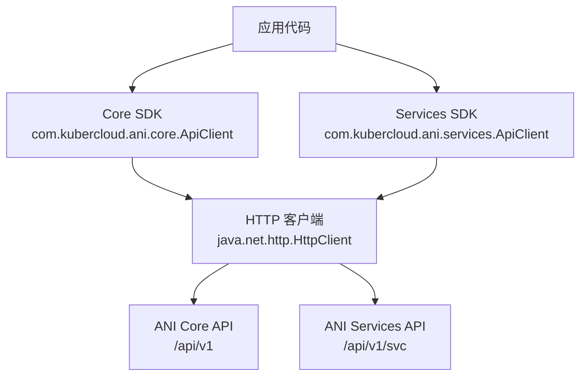
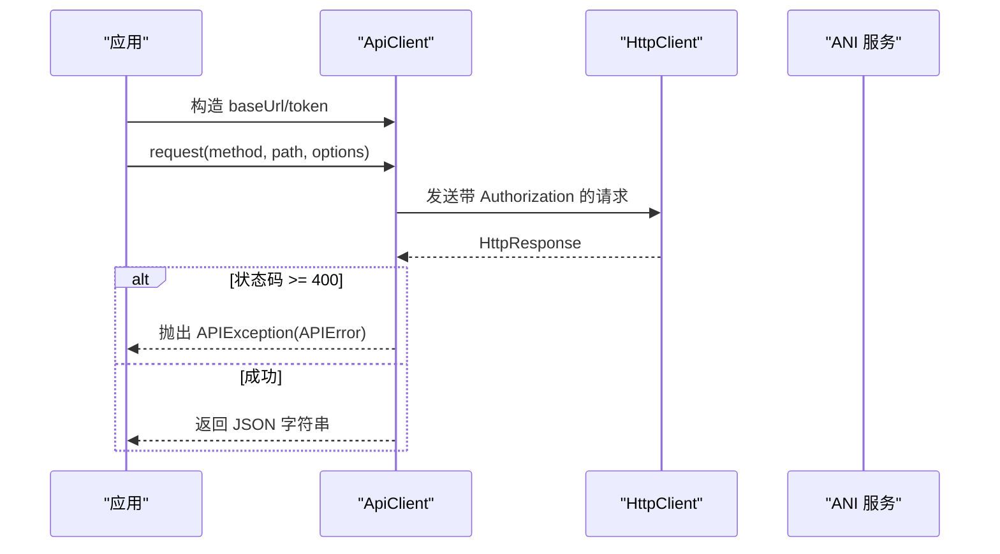
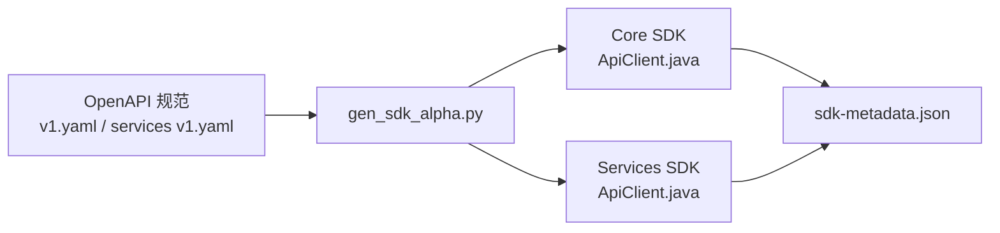

# Java SDK 使用指南

<cite>
**本文引用的文件**
- [repo/sdks/core/java/src/main/java/com/kubercloud/ani/core/ApiClient.java](file://repo/sdks/core/java/src/main/java/com/kubercloud/ani/core/ApiClient.java)
- [repo/sdks/services/java/src/main/java/com/kubercloud/ani/services/ApiClient.java](file://repo/sdks/services/java/src/main/java/com/kubercloud/ani/services/ApiClient.java)
- [repo/sdks/core/java/examples/Basic.java](file://repo/sdks/core/java/examples/Basic.java)
- [repo/sdks/services/java/examples/Basic.java](file://repo/sdks/services/java/examples/Basic.java)
- [repo/scripts/gen_sdk_alpha.py](file://repo/scripts/gen_sdk_alpha.py)
- [repo/sdks/core/sdk-metadata.json](file://repo/sdks/core/sdk-metadata.json)
- [repo/sdks/services/sdk-metadata.json](file://repo/sdks/services/sdk-metadata.json)
</cite>

## 目录
1. [简介](#简介)
2. [项目结构](#项目结构)
3. [核心组件](#核心组件)
4. [架构总览](#架构总览)
5. [详细组件分析](#详细组件分析)
6. [依赖关系分析](#依赖关系分析)
7. [性能与内存管理](#性能与内存管理)
8. [故障排查指南](#故障排查指南)
9. [结论](#结论)
10. [附录](#附录)

## 简介
本指南面向在 Java 项目中集成 ANI Core 与 Services API 的开发者，基于仓库中生成的轻量级 Java SDK（由 OpenAPI 规范生成）提供：
- 依赖与版本要求说明
- 客户端初始化、认证、请求构造与错误处理
- 幂等键与游标分页等通用能力
- 同步调用模式与流式查询的使用建议
- 与 Spring Boot 等框架的集成思路
- 性能调优与资源管理最佳实践

注意：当前 SDK 为“Alpha”阶段产物，由脚本从 OpenAPI 规范生成，不包含 Maven/Gradle 包发布物。实际集成时以源码形式引入或自行打包。

## 项目结构
仓库包含两套 Java SDK 生成物：
- Core SDK：包名 com.kubercloud.ani.core，服务端基础路径 /api/v1
- Services SDK：包名 com.kubercloud.ani.services，服务端基础路径 /api/v1/svc

两者均由同一生成器脚本产出，结构一致，均提供 ApiClient 类作为统一入口。

图表来源
- [repo/sdks/core/java/src/main/java/com/kubercloud/ani/core/ApiClient.java:21-28](file://repo/sdks/core/java/src/main/java/com/kubercloud/ani/core/ApiClient.java#L21-L28)
- [repo/sdks/services/java/src/main/java/com/kubercloud/ani/services/ApiClient.java:21-28](file://repo/sdks/services/java/src/main/java/com/kubercloud/ani/services/ApiClient.java#L21-L28)

章节来源
- [repo/sdks/core/java/src/main/java/com/kubercloud/ani/core/ApiClient.java:1-28](file://repo/sdks/core/java/src/main/java/com/kubercloud/ani/core/ApiClient.java#L1-L28)
- [repo/sdks/services/java/src/main/java/com/kubercloud/ani/services/ApiClient.java:1-28](file://repo/sdks/services/java/src/main/java/com/kubercloud/ani/services/ApiClient.java#L1-L28)

## 核心组件
- ApiClient：统一的 HTTP 客户端封装，负责构建请求、附加鉴权头、参数编码、错误解析与工具方法（幂等键、游标分页、错误码校验）。
- 示例 Basic：演示如何创建客户端、构造幂等负载、构造分页参数、构造错误对象并做基本断言。

关键要点
- 两个 SDK 都暴露常量 LAYER/TITLE/VERSION/SERVER_URL，便于运行时识别与日志记录。
- 通过构造函数传入 baseUrl 和 token；未传 baseUrl 时使用默认 SERVER_URL。
- 所有请求统一设置 Accept: application/json；可选携带 Authorization: Bearer <token>。
- 支持 RequestOptions 自定义 bodyJson、params、headers。
- 错误统一包装为 APIException，内部包含 APIError（code/message/requestId/details）。

章节来源
- [repo/sdks/core/java/src/main/java/com/kubercloud/ani/core/ApiClient.java:21-28](file://repo/sdks/core/java/src/main/java/com/kubercloud/ani/core/ApiClient.java#L21-L28)
- [repo/sdks/services/java/src/main/java/com/kubercloud/ani/services/ApiClient.java:21-28](file://repo/sdks/services/java/src/main/java/com/kubercloud/ani/services/ApiClient.java#L21-L28)
- [repo/sdks/core/java/examples/Basic.java:1-20](file://repo/sdks/core/java/examples/Basic.java#L1-L20)
- [repo/sdks/services/java/examples/Basic.java:1-20](file://repo/sdks/services/java/examples/Basic.java#L1-L20)

## 架构总览
SDK 采用“薄封装 + 强契约”的设计：不隐藏底层 HTTP 细节，但提供稳定的操作集合、错误模型与工具方法。

图表来源
- [repo/sdks/core/java/src/main/java/com/kubercloud/ani/core/ApiClient.java:1153-1175](file://repo/sdks/core/java/src/main/java/com/kubercloud/ani/core/ApiClient.java#L1153-L1175)
- [repo/sdks/services/java/src/main/java/com/kubercloud/ani/services/ApiClient.java:468-490](file://repo/sdks/services/java/src/main/java/com/kubercloud/ani/services/ApiClient.java#L468-L490)

## 详细组件分析

### 客户端初始化与认证
- 构造方式：new ApiClient(baseUrl, token)
- 默认服务器地址：可从常量获取（core 为 /api/v1，services 为 /api/v1/svc）
- 鉴权：若 token 非空，自动添加 Authorization: Bearer <token>
- 可覆盖：RequestOptions.headers 可追加自定义头部

章节来源
- [repo/sdks/core/java/src/main/java/com/kubercloud/ani/core/ApiClient.java:1136-1147](file://repo/sdks/core/java/src/main/java/com/kubercloud/ani/core/ApiClient.java#L1136-L1147)
- [repo/sdks/services/java/src/main/java/com/kubercloud/ani/services/ApiClient.java:451-462](file://repo/sdks/services/java/src/main/java/com/kubercloud/ani/services/ApiClient.java#L451-L462)

### 请求与响应
- 方法：request(String method, String path, RequestOptions options)
- 内容类型：当存在 bodyJson 时自动设置 Content-Type: application/json
- 查询参数：通过 RequestOptions.params 传递，内部进行 URL 编码拼接
- 返回值：成功返回 JSON 字符串；失败抛出 APIException

章节来源
- [repo/sdks/core/java/src/main/java/com/kubercloud/ani/core/ApiClient.java:1153-1175](file://repo/sdks/core/java/src/main/java/com/kubercloud/ani/core/ApiClient.java#L1153-L1175)
- [repo/sdks/services/java/src/main/java/com/kubercloud/ani/services/ApiClient.java:468-490](file://repo/sdks/services/java/src/main/java/com/kubercloud/ani/services/ApiClient.java#L468-L490)

### 错误处理
- 异常：APIException 包裹 APIError
- APIError 字段：code、message、requestId、details
- 错误码校验：isAPIErrorCode(code) 可用于判断是否属于已知错误码集
- 错误解析：当响应体缺少 code 时回退为 HTTP_状态码

章节来源
- [repo/sdks/core/java/src/main/java/com/kubercloud/ani/core/ApiClient.java:1099-1110](file://repo/sdks/core/java/src/main/java/com/kubercloud/ani/core/ApiClient.java#L1099-L1110)
- [repo/sdks/core/java/src/main/java/com/kubercloud/ani/core/ApiClient.java:1193-1213](file://repo/sdks/core/java/src/main/java/com/kubercloud/ani/core/ApiClient.java#L1193-L1213)
- [repo/sdks/core/java/src/main/java/com/kubercloud/ani/core/ApiClient.java:1246-1249](file://repo/sdks/core/java/src/main/java/com/kubercloud/ani/core/ApiClient.java#L1246-L1249)
- [repo/sdks/services/java/src/main/java/com/kubercloud/ani/services/ApiClient.java:384-425](file://repo/sdks/services/java/src/main/java/com/kubercloud/ani/services/ApiClient.java#L384-L425)
- [repo/sdks/services/java/src/main/java/com/kubercloud/ani/services/ApiClient.java:508-528](file://repo/sdks/services/java/src/main/java/com/kubercloud/ani/services/ApiClient.java#L508-L528)
- [repo/sdks/services/java/src/main/java/com/kubercloud/ani/services/ApiClient.java:561-567](file://repo/sdks/services/java/src/main/java/com/kubercloud/ani/services/ApiClient.java#L561-L567)

### 幂等性支持
- 生成规则：根据 OpenAPI 中请求体 schema 是否要求 idempotency_key 标记为幂等操作
- 工具方法：
  - newIdempotencyKey(prefix)：生成唯一键
  - withIdempotencyKey(body, key)：将 idempotency_key 注入请求体
- 适用场景：POST/PUT/PATCH 等写操作，避免重试导致重复副作用

章节来源
- [repo/sdks/core/java/src/main/java/com/kubercloud/ani/core/ApiClient.java:1215-1233](file://repo/sdks/core/java/src/main/java/com/kubercloud/ani/core/ApiClient.java#L1215-L1233)
- [repo/sdks/services/java/src/main/java/com/kubercloud/ani/services/ApiClient.java:530-548](file://repo/sdks/services/java/src/main/java/com/kubercloud/ani/services/ApiClient.java#L530-L548)
- [repo/scripts/gen_sdk_alpha.py:100-109](file://repo/scripts/gen_sdk_alpha.py#L100-L109)
- [repo/scripts/gen_sdk_alpha.py:1021-1064](file://repo/scripts/gen_sdk_alpha.py#L1021-L1064)

### 游标分页
- 生成规则：GET 接口若同时声明 limit 与 cursor 参数，则视为游标分页
- 工具方法：cursorParams(limit, cursor) 生成标准分页参数
- 使用建议：循环拉取直到 next_cursor 为空

章节来源
- [repo/sdks/core/java/src/main/java/com/kubercloud/ani/core/ApiClient.java:1235-1244](file://repo/sdks/core/java/src/main/java/com/kubercloud/ani/core/ApiClient.java#L1235-L1244)
- [repo/sdks/services/java/src/main/java/com/kubercloud/ani/services/ApiClient.java:550-559](file://repo/sdks/services/java/src/main/java/com/kubercloud/ani/services/ApiClient.java#L550-L559)
- [repo/scripts/gen_sdk_alpha.py:111-113](file://repo/scripts/gen_sdk_alpha.py#L111-L113)
- [repo/scripts/gen_sdk_alpha.py:1021-1064](file://repo/scripts/gen_sdk_alpha.py#L1021-L1064)

### 流式处理
- 当前 SDK 不提供专用流式 API；对于支持流式响应的接口，可在业务层基于 HttpClient 的异步/流式能力扩展封装。
- 建议在业务侧实现独立的 StreamClient，复用 ApiClient 的错误与鉴权逻辑。

[本节为概念性说明，无直接代码映射]

### 线程安全与资源管理
- 线程安全：HttpClient 实例为静态共享，适合多线程并发调用。
- 资源管理：SDK 未显式关闭连接池；生产环境建议通过外部配置化 HttpClient（如设置连接池大小、超时、Keep-Alive）替换默认实例，或在应用启动时统一管理生命周期。

章节来源
- [repo/sdks/core/java/src/main/java/com/kubercloud/ani/core/ApiClient.java:21-23](file://repo/sdks/core/java/src/main/java/com/kubercloud/ani/core/ApiClient.java#L21-L23)
- [repo/sdks/services/java/src/main/java/com/kubercloud/ani/services/ApiClient.java:21-23](file://repo/sdks/services/java/src/main/java/com/kubercloud/ani/services/ApiClient.java#L21-L23)

### 完整 API 参考（类与方法）
- 类：ApiClient
  - 常量：LAYER、TITLE、VERSION、SERVER_URL、OPERATIONS、PATHS、SCHEMAS、IDEMPOTENCY_OPERATIONS、CURSOR_PAGINATION_OPERATIONS、ERROR_CODES
  - 构造：ApiClient(String baseUrl, String token)
  - 属性：baseUrl()、token()
  - 方法：hasOperation(String operationId)、request(String method, String path, RequestOptions options)
  - 工具：newIdempotencyKey(String prefix)、withIdempotencyKey(Map<String,Object> body, String key)、cursorParams(int limit, String cursor)、isAPIErrorCode(String code)、apiError(String code, String message, String requestId, Map<String,Object> details)
- 内部类：
  - APIError：code、message、requestId、details
  - APIException：包装 APIError
  - RequestOptions：bodyJson、params、headers

章节来源
- [repo/sdks/core/java/src/main/java/com/kubercloud/ani/core/ApiClient.java:21-28](file://repo/sdks/core/java/src/main/java/com/kubercloud/ani/core/ApiClient.java#L21-L28)
- [repo/sdks/core/java/src/main/java/com/kubercloud/ani/core/ApiClient.java:1066-1175](file://repo/sdks/core/java/src/main/java/com/kubercloud/ani/core/ApiClient.java#L1066-L1175)
- [repo/sdks/core/java/src/main/java/com/kubercloud/ani/core/ApiClient.java:1215-1249](file://repo/sdks/core/java/src/main/java/com/kubercloud/ani/core/ApiClient.java#L1215-L1249)
- [repo/sdks/services/java/src/main/java/com/kubercloud/ani/services/ApiClient.java:21-28](file://repo/sdks/services/java/src/main/java/com/kubercloud/ani/services/ApiClient.java#L21-L28)
- [repo/sdks/services/java/src/main/java/com/kubercloud/ani/services/ApiClient.java:381-567](file://repo/sdks/services/java/src/main/java/com/kubercloud/ani/services/ApiClient.java#L381-L567)

### 常用调用模式示例
- 同步调用：使用 request(method, path, RequestOptions) 发起请求，捕获 APIException 处理错误。
- 幂等写入：使用 withIdempotencyKey 注入 idempotency_key，配合重试更安全。
- 游标分页：使用 cursorParams 构造 limit/cursor，循环拉取直至结束。
- 错误处理：通过 isAPIErrorCode 判断错误类型，结合 APIError 的 code/message/requestId 进行告警与追踪。

章节来源
- [repo/sdks/core/java/examples/Basic.java:1-20](file://repo/sdks/core/java/examples/Basic.java#L1-L20)
- [repo/sdks/services/java/examples/Basic.java:1-20](file://repo/sdks/services/java/examples/Basic.java#L1-L20)

## 依赖关系分析
SDK 仅依赖 JDK 内置的 java.net.http.*，无第三方网络库依赖。生成过程基于 OpenAPI 规范，保证操作集合、路径、Schema、错误码与元数据的一致性。

图表来源
- [repo/scripts/gen_sdk_alpha.py:15-30](file://repo/scripts/gen_sdk_alpha.py#L15-L30)
- [repo/scripts/gen_sdk_alpha.py:1021-1064](file://repo/scripts/gen_sdk_alpha.py#L1021-L1064)
- [repo/sdks/core/sdk-metadata.json:1-6](file://repo/sdks/core/sdk-metadata.json#L1-L6)
- [repo/sdks/services/sdk-metadata.json:1-6](file://repo/sdks/services/sdk-metadata.json#L1-L6)

章节来源
- [repo/scripts/gen_sdk_alpha.py:53-97](file://repo/scripts/gen_sdk_alpha.py#L53-L97)
- [repo/sdks/core/sdk-metadata.json:1-6](file://repo/sdks/core/sdk-metadata.json#L1-L6)
- [repo/sdks/services/sdk-metadata.json:1-6](file://repo/sdks/services/sdk-metadata.json#L1-L6)

## 性能与内存管理
- 连接复用：使用静态 HttpClient 实例，默认启用连接复用，减少握手开销。
- 超时与重试：SDK 未内置超时与重试策略，建议在业务层封装或使用外部 HTTP 客户端替代。
- 大响应体：当前 request 返回 JSON 字符串，适用于中小响应；超大响应建议在业务层实现流式读取以避免全量驻留内存。
- 内存占用：避免在循环中频繁创建大量临时对象；合理设置 JVM 堆大小与 GC 参数。
- 并发控制：在高并发场景下，关注线程池与连接池上限，防止资源耗尽。

[本节为通用指导，无特定文件映射]

## 故障排查指南
- 认证失败：检查 baseUrl 与 token 是否正确；确认 Authorization 头已正确附加。
- 4xx/5xx 错误：捕获 APIException，读取 APIError.code/message/requestId 定位问题。
- 幂等冲突：对幂等接口重试时确保 idempotency_key 一致；不同请求使用不同 key。
- 分页遗漏：确保每次请求都带上上一次返回的 cursor；直到 next_cursor 为空。
- 网络异常：检查 DNS、代理、防火墙；必要时增加重试与退避策略。

章节来源
- [repo/sdks/core/java/src/main/java/com/kubercloud/ani/core/ApiClient.java:1153-1175](file://repo/sdks/core/java/src/main/java/com/kubercloud/ani/core/ApiClient.java#L1153-L1175)
- [repo/sdks/services/java/src/main/java/com/kubercloud/ani/services/ApiClient.java:468-490](file://repo/sdks/services/java/src/main/java/com/kubercloud/ani/services/ApiClient.java#L468-L490)
- [repo/sdks/core/java/src/main/java/com/kubercloud/ani/core/ApiClient.java:1215-1249](file://repo/sdks/core/java/src/main/java/com/kubercloud/ani/core/ApiClient.java#L1215-L1249)
- [repo/sdks/services/java/src/main/java/com/kubercloud/ani/services/ApiClient.java:530-559](file://repo/sdks/services/java/src/main/java/com/kubercloud/ani/services/ApiClient.java#L530-L559)

## 结论
该 Java SDK 提供了最小而实用的 API 访问能力，适合快速集成 ANI Core 与 Services 接口。通过幂等键与游标分页工具方法，可有效提升健壮性与易用性。生产环境建议结合业务需求扩展超时、重试、流式处理与监控埋点，以获得更完善的稳定性与可观测性。

[本节为总结，无特定文件映射]

## 附录

### 依赖与版本要求
- JDK：由于使用 java.net.http.*，建议使用 JDK 11+。
- 依赖管理：当前 SDK 为源码生成物，未提供 Maven/Gradle 坐标；可将 sdk 目录纳入工程或通过私有制品库发布。
- 包名：Core 为 com.kubercloud.ani.core，Services 为 com.kubercloud.ani.services。

章节来源
- [repo/sdks/core/java/src/main/java/com/kubercloud/ani/core/ApiClient.java:1-10](file://repo/sdks/core/java/src/main/java/com/kubercloud/ani/core/ApiClient.java#L1-L10)
- [repo/sdks/services/java/src/main/java/com/kubercloud/ani/services/ApiClient.java:1-10](file://repo/sdks/services/java/src/main/java/com/kubercloud/ani/services/ApiClient.java#L1-L10)

### 与 Spring Boot 集成建议
- 配置化：将 baseUrl、token、超时等参数放入 application.yml，并通过 @Configuration 装配到业务 Service。
- 单例：将 ApiClient 作为 Bean 单例管理，避免重复创建。
- 切面：通过 AOP 统一记录请求/响应、耗时与错误，结合 APIError.requestId 关联链路。
- 重试：使用 Spring Retry 或 Resilience4j 对幂等接口进行重试与退避。

[本节为概念性说明，无直接代码映射]

### 监控与可观测性
- 指标：记录 QPS、延迟、错误率（按 APIError.code 分类）。
- 日志：输出 requestId、method、path、status、latency。
- 追踪：将 requestId 透传到下游，便于跨服务链路追踪。

[本节为概念性说明，无直接代码映射]