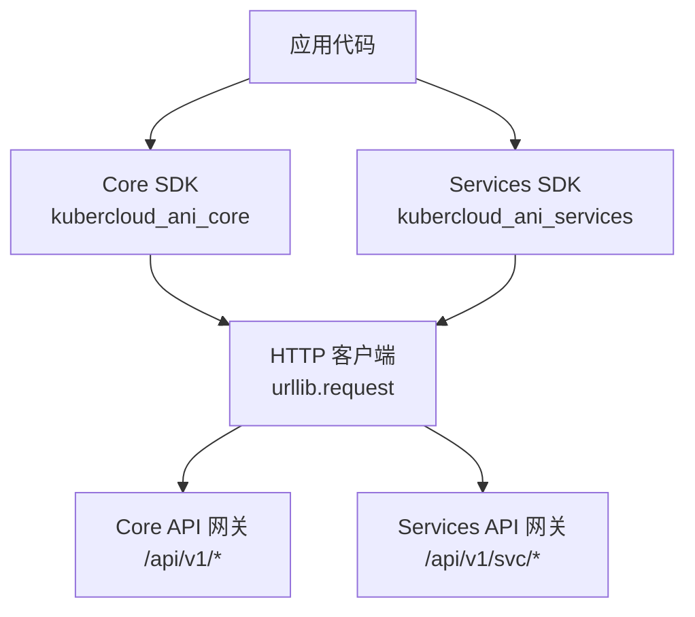
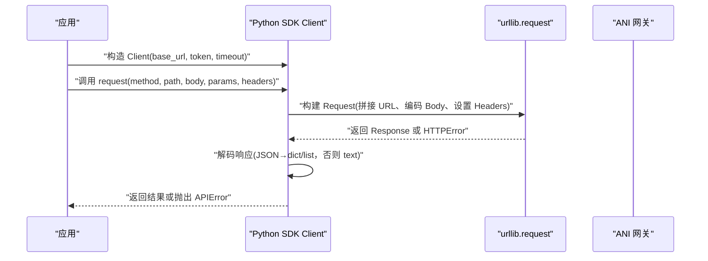
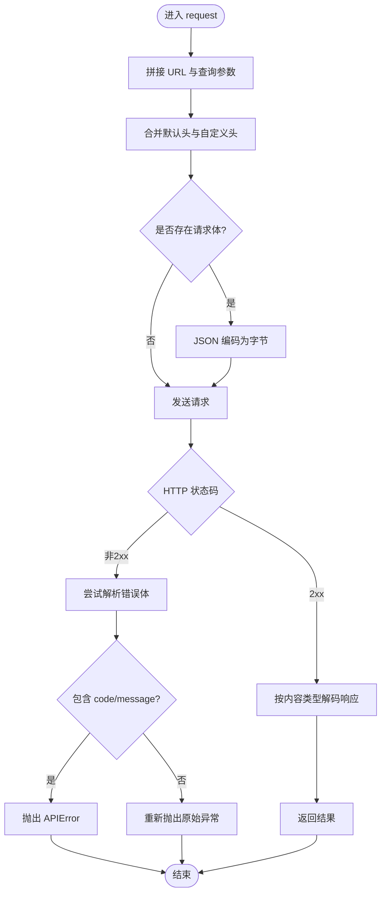
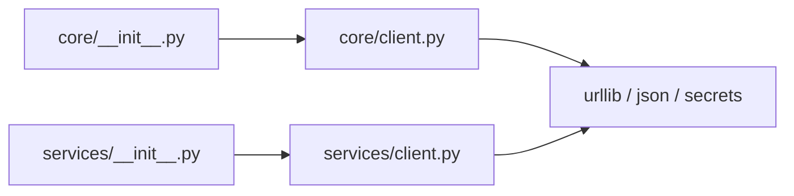

# Python SDK 使用指南

<cite>
**本文引用的文件**
- [README.md](file://repo/README.md)
- [Core SDK 初始化入口](file://repo/sdks/core/python/kubercloud_ani_core/__init__.py)
- [Core SDK 客户端实现](file://repo/sdks/core/python/kubercloud_ani_core/client.py)
- [Core SDK 基础示例](file://repo/sdks/core/python/examples/basic.py)
- [Core SDK 冒烟测试](file://repo/sdks/core/python/smoke.py)
- [Services SDK 初始化入口](file://repo/sdks/services/python/kubercloud_ani_services/__init__.py)
- [Services SDK 客户端实现](file://repo/sdks/services/python/kubercloud_ani_services/client.py)
- [Services SDK 基础示例](file://repo/sdks/services/python/examples/basic.py)
- [Services SDK 冒烟测试](file://repo/sdks/services/python/smoke.py)
</cite>

## 目录
1. [简介](#简介)
2. [项目结构](#项目结构)
3. [核心组件](#核心组件)
4. [架构总览](#架构总览)
5. [详细组件分析](#详细组件分析)
6. [依赖关系分析](#依赖关系分析)
7. [性能与连接管理建议](#性能与连接管理建议)
8. [故障排查指南](#故障排查指南)
9. [结论](#结论)
10. [附录：API 参考速查](#附录api-参考速查)

## 简介
本指南面向在 Python 中集成 ANI Core 与 Services API 的开发者，覆盖安装与环境准备、客户端初始化、配置选项、错误处理、幂等键与分页工具、类型提示与序列化机制，以及基于仓库现有实现的性能与连接管理建议。文档严格依据仓库中的 Python SDK 源码与示例编写，不包含未实现的假设能力。

## 项目结构
仓库提供两套独立的 Python SDK：
- Core SDK：用于调用平台核心能力（实例、存储、网络、注册表、可观测性等），包名为 `kubercloud_ani_core`。
- Services SDK：用于调用业务服务（推理服务、知识库、沙箱、租户管理等），包名为 `kubercloud_ani_services`。

两个 SDK 均由代码生成脚本产出，暴露统一的 `Client` 与常用工具函数，并通过 OpenAPI 契约驱动操作集合、路径与数据模型。

图表来源
- [Core SDK 客户端实现:1-10](file://repo/sdks/core/python/kubercloud_ani_core/client.py#L1-L10)
- [Services SDK 客户端实现:1-10](file://repo/sdks/services/python/kubercloud_ani_services/client.py#L1-L10)

章节来源
- [README.md:18-67](file://repo/README.md#L18-L67)
- [Core SDK 初始化入口:1-39](file://repo/sdks/core/python/kubercloud_ani_core/__init__.py#L1-L39)
- [Services SDK 初始化入口:1-39](file://repo/sdks/services/python/kubercloud_ani_services/__init__.py#L1-L39)

## 核心组件
- Client：统一 HTTP 请求封装，支持 base_url、token、timeout；提供 has_operation 校验与 request 方法。
- APIError：标准化异常，包含 code、message、request_id、details。
- 工具函数：
  - new_idempotency_key：生成幂等键。
  - with_idempotency_key：将幂等键注入请求体。
  - cursor_params：构造游标分页参数。
  - is_api_error_code：判断错误码是否属于已知集合。
- 常量：
  - LAYER、TITLE、VERSION、SERVER_URL：标识 SDK 层、标题、版本与默认服务端地址。
  - OPERATIONS、PATHS、SCHEMAS：由 OpenAPI 生成的操作名、路径与数据模型名称列表。
  - IDEMPOTENCY_OPERATIONS、CURSOR_PAGINATION_OPERATIONS、ERROR_CODES：幂等操作、游标分页操作与错误码白名单。

章节来源
- [Core SDK 客户端实现:6-219](file://repo/sdks/core/python/kubercloud_ani_core/client.py#L6-L219)
- [Core SDK 客户端实现:430-800](file://repo/sdks/core/python/kubercloud_ani_core/client.py#L430-L800)
- [Services SDK 客户端实现:6-338](file://repo/sdks/services/python/kubercloud_ani_services/client.py#L6-L338)
- [Services SDK 客户端实现:339-467](file://repo/sdks/services/python/kubercloud_ani_services/client.py#L339-L467)

## 架构总览
SDK 通过标准库 urllib 发起 HTTP/JSON 请求，自动设置 Accept/Content-Type，并在需要时附加 Authorization 头。服务端返回 JSON 时解析为 dict/list，否则返回原始文本。非 2xx 响应会被转换为 APIError，便于上层统一捕获与重试策略。

图表来源
- [Core SDK 客户端实现:379-443](file://repo/sdks/core/python/kubercloud_ani_core/client.py#L379-L443)
- [Services SDK 客户端实现:379-443](file://repo/sdks/services/python/kubercloud_ani_services/client.py#L379-L443)

## 详细组件分析

### 客户端初始化与配置
- 构造函数参数：
  - base_url：服务端根地址，默认来自 SERVER_URL。
  - token：鉴权令牌，自动放入 Authorization: Bearer。
  - timeout：单次请求超时秒数。
- 常用属性与方法：
  - base_url、token、timeout：访问当前配置。
  - has_operation(operation_id)：校验 operationId 是否在 SDK 暴露的操作列表中。
  - request(method, path, body=None, params=None, headers=None)：通用请求方法。

最佳实践
- 在生产环境显式传入 base_url 与 token，避免使用默认值。
- 合理设置 timeout，防止长尾请求阻塞。
- 对敏感信息使用环境变量注入，不在代码中硬编码。

章节来源
- [Core SDK 客户端实现:379-443](file://repo/sdks/core/python/kubercloud_ani_core/client.py#L379-L443)
- [Services SDK 客户端实现:379-443](file://repo/sdks/services/python/kubercloud_ani_services/client.py#L379-L443)

### 同步调用与异步支持
- 当前 SDK 使用标准库 urllib 进行同步 I/O，不提供内置异步接口。
- 若需异步调用，可在应用层使用线程池或进程池包装同步 request，或将请求逻辑迁移至异步框架自行封装。

注意
- 由于 SDK 未暴露异步方法，请勿直接 await SDK 方法。
- 在高并发场景下，建议使用连接复用与合理的超时控制。

章节来源
- [Core SDK 客户端实现:388-443](file://repo/sdks/core/python/kubercloud_ani_core/client.py#L388-L443)
- [Services SDK 客户端实现:388-443](file://repo/sdks/services/python/kubercloud_ani_services/client.py#L388-L443)

### 连接管理与请求生命周期
- URL 拼接：base_url + path + query 参数，自动过滤 None 值。
- 头部合并：Accept 固定为 application/json；当存在 body 时设置 Content-Type；若配置了 token 则添加 Authorization。
- 请求体编码：None 不发送 body；否则序列化为 UTF-8 JSON。
- 响应解码：根据 Content-Type 选择 JSON 解析或纯文本返回。
- 错误转换：HTTPError 且响应体包含 code/message 时转为 APIError。

图表来源
- [Core SDK 客户端实现:388-443](file://repo/sdks/core/python/kubercloud_ani_core/client.py#L388-L443)
- [Services SDK 客户端实现:388-443](file://repo/sdks/services/python/kubercloud_ani_services/client.py#L388-L443)

章节来源
- [Core SDK 客户端实现:388-443](file://repo/sdks/core/python/kubercloud_ani_core/client.py#L388-L443)
- [Services SDK 客户端实现:388-443](file://repo/sdks/services/python/kubercloud_ani_services/client.py#L388-L443)

### 幂等性与重试模式
- 幂等键：
  - new_idempotency_key(prefix="ani")：生成唯一键。
  - with_idempotency_key(body, key=None)：将 idempotency_key 注入请求体。
  - IDEMPOTENCY_OPERATIONS：标记哪些操作在服务端支持幂等回放。
- 重试建议：
  - SDK 本身不内置重试；建议在应用层对可重试错误（如网络错误、5xx）实施指数退避重试。
  - 仅对幂等操作启用重试，避免重复副作用。
  - 结合 IDENTITY_OPERATIONS 与服务端幂等语义，确保一致性。

章节来源
- [Core SDK 客户端实现:723-785](file://repo/sdks/core/python/kubercloud_ani_core/client.py#L723-L785)
- [Services SDK 客户端实现:290-338](file://repo/sdks/services/python/kubercloud_ani_services/client.py#L290-L338)
- [Core SDK 客户端实现:445-453](file://repo/sdks/core/python/kubercloud_ani_core/client.py#L445-L453)
- [Services SDK 客户端实现:445-453](file://repo/sdks/services/python/kubercloud_ani_services/client.py#L445-L453)

### 分页与游标
- cursor_params(limit=None, cursor=None)：构造 limit/cursor 查询参数。
- CURSOR_PAGINATION_OPERATIONS：标记支持游标分页的操作。
- 典型用法：先获取第一页 limit=20，再根据 next_cursor 继续翻页。

章节来源
- [Core SDK 客户端实现:786-800](file://repo/sdks/core/python/kubercloud_ani_core/client.py#L786-L800)
- [Services SDK 客户端实现:325-338](file://repo/sdks/services/python/kubercloud_ani_services/client.py#L325-L338)
- [Core SDK 客户端实现:456-462](file://repo/sdks/core/python/kubercloud_ani_core/client.py#L456-L462)
- [Services SDK 客户端实现:456-462](file://repo/sdks/services/python/kubercloud_ani_services/client.py#L456-L462)

### 类型提示、数据验证与序列化
- 类型提示：
  - Client.__init__、request、_url、_headers、_encode_body、_decode_response 均提供类型标注。
  - APIError 字段具有明确类型。
- 数据验证：
  - SDK 不做服务端 schema 校验；请求体由服务端验证。
  - 可使用 is_api_error_code 判断错误码是否属于已知集合。
- 序列化：
  - 请求体使用 json.dumps 编码为 UTF-8 字节。
  - 响应体根据 Content-Type 决定是否 JSON 解析。

章节来源
- [Core SDK 客户端实现:379-443](file://repo/sdks/core/python/kubercloud_ani_core/client.py#L379-L443)
- [Services SDK 客户端实现:364-467](file://repo/sdks/services/python/kubercloud_ani_services/client.py#L364-L467)

### 常用模式与示例
- 基本初始化与断言：
  - 参见示例与冒烟测试中对 base_url、token、OPERATIONS、SCHEMAS、new_idempotency_key、with_idempotency_key、cursor_params、is_api_error_code 的使用。
- 错误处理：
  - 捕获 APIError，读取 code、message、request_id、details。
- 幂等写入：
  - 对写操作使用 with_idempotency_key 注入幂等键，并结合 IDEMPOTENCY_OPERATIONS 确认服务端支持。
- 分页读取：
  - 使用 cursor_params 构造 limit/cursor，循环拉取直到无下一页。

章节来源
- [Core SDK 基础示例:1-16](file://repo/sdks/core/python/examples/basic.py#L1-L16)
- [Core SDK 冒烟测试:1-21](file://repo/sdks/core/python/smoke.py#L1-L21)
- [Services SDK 基础示例:1-16](file://repo/sdks/services/python/examples/basic.py#L1-L16)
- [Services SDK 冒烟测试:1-21](file://repo/sdks/services/python/smoke.py#L1-L21)

## 依赖关系分析
- 运行时依赖：
  - Python 标准库：json、secrets、urllib.error/parse/request。
  - 无第三方依赖，便于部署与隔离。
- 模块耦合：
  - __init__.py 仅重导出 client.py 中的符号，保持最小对外接口。
  - client.py 集中实现请求、编码、解码与错误转换，内聚度高。

图表来源
- [Core SDK 初始化入口:1-39](file://repo/sdks/core/python/kubercloud_ani_core/__init__.py#L1-L39)
- [Services SDK 初始化入口:1-39](file://repo/sdks/services/python/kubercloud_ani_services/__init__.py#L1-L39)
- [Core SDK 客户端实现:1-10](file://repo/sdks/core/python/kubercloud_ani_core/client.py#L1-L10)
- [Services SDK 客户端实现:1-10](file://repo/sdks/services/python/kubercloud_ani_services/client.py#L1-L10)

章节来源
- [Core SDK 初始化入口:1-39](file://repo/sdks/core/python/kubercloud_ani_core/__init__.py#L1-L39)
- [Services SDK 初始化入口:1-39](file://repo/sdks/services/python/kubercloud_ani_services/__init__.py#L1-L39)
- [Core SDK 客户端实现:1-10](file://repo/sdks/core/python/kubercloud_ani_core/client.py#L1-L10)
- [Services SDK 客户端实现:1-10](file://repo/sdks/services/python/kubercloud_ani_services/client.py#L1-L10)

## 性能与连接管理建议
- 连接复用：
  - 当前 SDK 每次请求创建新连接；在高并发场景下，建议在应用层维护连接池或使用支持连接复用的 HTTP 客户端封装 SDK 的请求。
- 超时与重试：
  - 合理设置 timeout，避免长尾请求占用资源。
  - 对幂等读/写分别设计重试策略；写操作必须结合幂等键。
- 批量与分页：
  - 使用 cursor_params 控制每页大小，避免一次性拉取过多数据。
- 序列化开销：
  - 大对象请求体会增加 CPU 与内存消耗；必要时考虑分块上传或流式传输（需应用层扩展）。
- 日志与可观测性：
  - 记录 request_id、operation_id、耗时与错误码，便于定位问题。

[本节为通用指导，不直接分析具体文件]

## 故障排查指南
- 常见错误：
  - APIError：从服务端返回的错误体中提取 code、message、request_id、details。
  - HTTPError：非 JSON 响应或未携带 code/message 时，会抛出原始异常。
- 诊断步骤：
  - 检查 base_url 是否正确指向目标环境。
  - 确认 token 有效且权限足够。
  - 核对 operation_id 是否在 OPERATIONS 中。
  - 对写操作确认是否使用了幂等键。
  - 查看服务端日志与 request_id 定位问题。
- 快速验证：
  - 运行示例与冒烟测试，确认 SDK 可用。

章节来源
- [Core SDK 客户端实现:402-414](file://repo/sdks/core/python/kubercloud_ani_core/client.py#L402-L414)
- [Services SDK 客户端实现:402-414](file://repo/sdks/services/python/kubercloud_ani_services/client.py#L402-L414)
- [Core SDK 冒烟测试:1-21](file://repo/sdks/core/python/smoke.py#L1-L21)
- [Services SDK 冒烟测试:1-21](file://repo/sdks/services/python/smoke.py#L1-L21)

## 结论
本仓库提供的 Python SDK 以最小依赖实现了 Core 与 Services API 的统一客户端，具备幂等键、游标分页、错误分类与类型提示等实用能力。当前 SDK 为同步实现，适用于大多数场景；在高并发或异步需求下，可在应用层进行扩展。建议结合幂等与重试策略、合理超时与分页，以获得稳定高效的调用体验。

[本节为总结，不直接分析具体文件]

## 附录：API 参考速查
- 包与类
  - kubercloud_ani_core.Client：Core 客户端。
  - kubercloud_ani_services.Client：Services 客户端。
  - APIError：统一异常。
- 工具函数
  - new_idempotency_key(prefix)：生成幂等键。
  - with_idempotency_key(body, key)：注入幂等键到请求体。
  - cursor_params(limit, cursor)：构造分页参数。
  - is_api_error_code(code)：判断错误码是否已知。
- 常量
  - LAYER、TITLE、VERSION、SERVER_URL：SDK 元信息与默认服务端地址。
  - OPERATIONS、PATHS、SCHEMAS：操作、路径与数据模型名称。
  - IDEMPOTENCY_OPERATIONS、CURSOR_PAGINATION_OPERATIONS、ERROR_CODES：能力清单。

章节来源
- [Core SDK 初始化入口:1-39](file://repo/sdks/core/python/kubercloud_ani_core/__init__.py#L1-L39)
- [Services SDK 初始化入口:1-39](file://repo/sdks/services/python/kubercloud_ani_services/__init__.py#L1-L39)
- [Core SDK 客户端实现:6-219](file://repo/sdks/core/python/kubercloud_ani_core/client.py#L6-L219)
- [Services SDK 客户端实现:6-338](file://repo/sdks/services/python/kubercloud_ani_services/client.py#L6-L338)
- [Core SDK 客户端实现:430-800](file://repo/sdks/core/python/kubercloud_ani_core/client.py#L430-L800)
- [Services SDK 客户端实现:339-467](file://repo/sdks/services/python/kubercloud_ani_services/client.py#L339-L467)