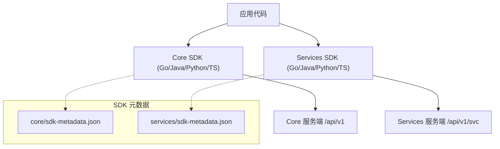
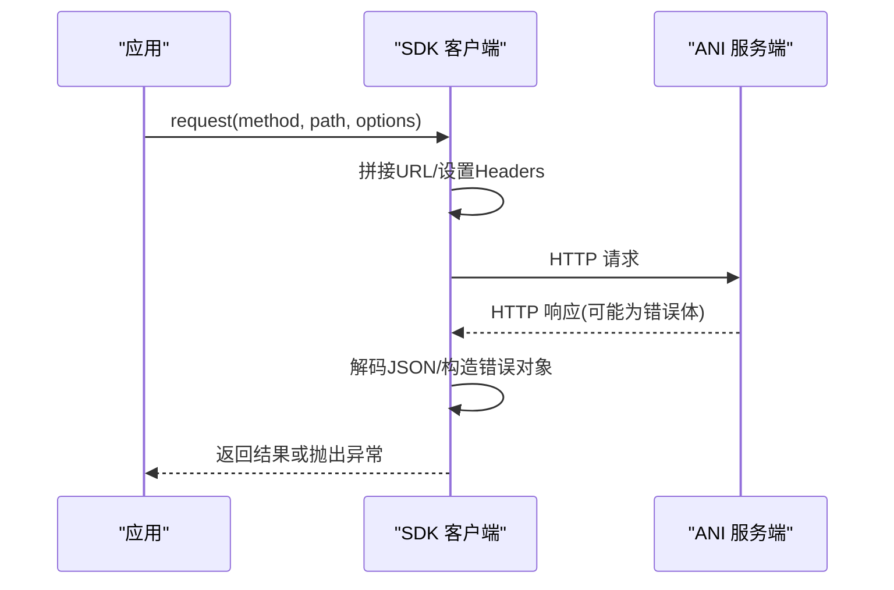
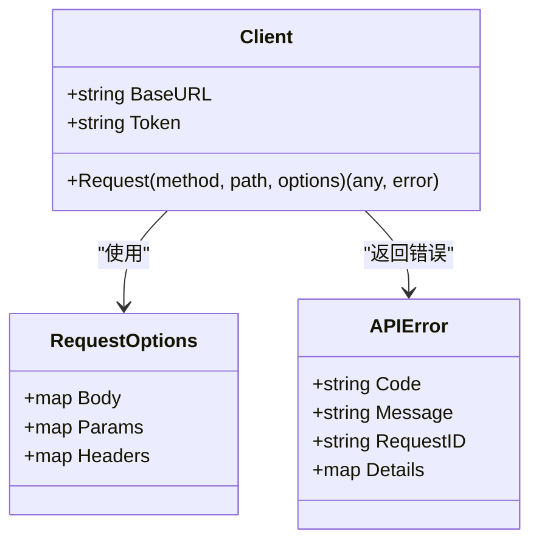
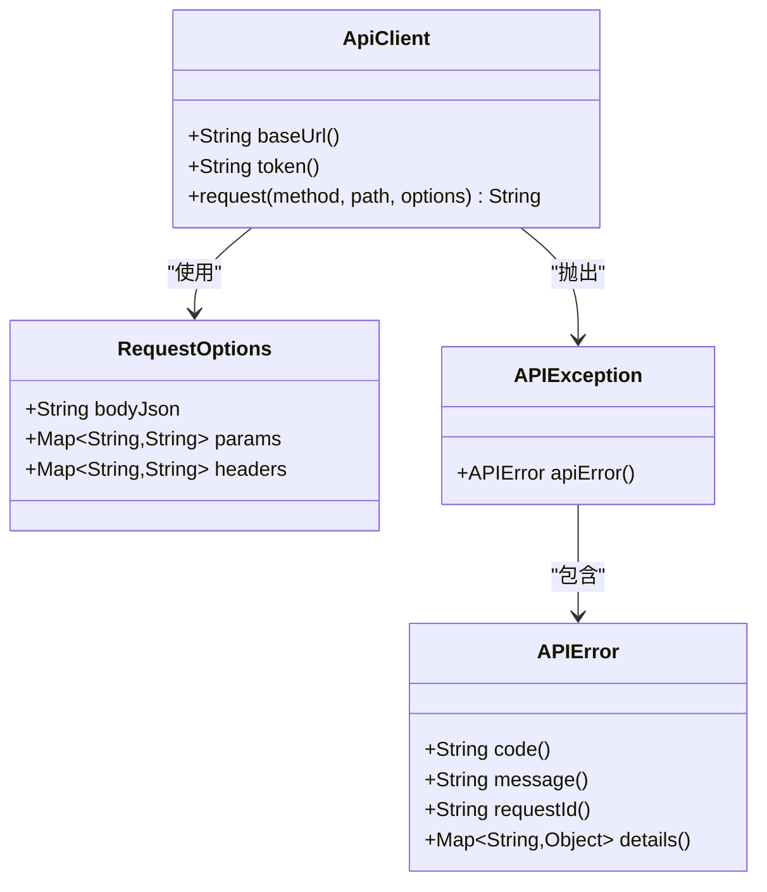
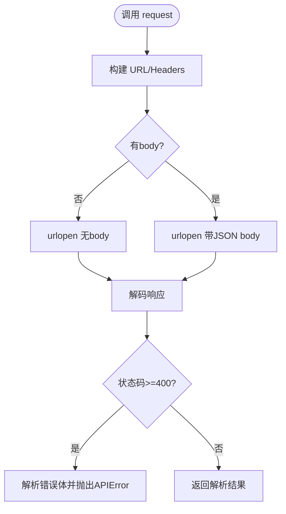
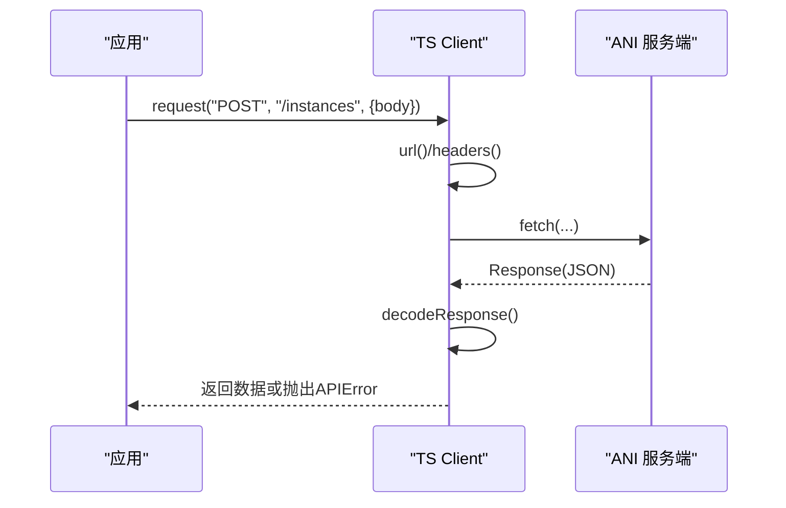
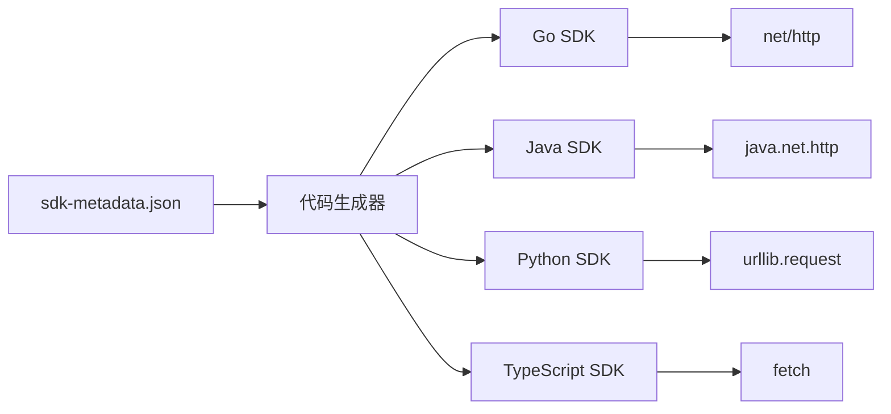

# SDK 文档

<cite>
**本文引用的文件**
- [repo/sdks/core/sdk-metadata.json](file://repo/sdks/core/sdk-metadata.json)
- [repo/sdks/services/sdk-metadata.json](file://repo/sdks/services/sdk-metadata.json)
- [repo/sdks/core/go/anisdk/client.go](file://repo/sdks/core/go/anisdk/client.go)
- [repo/sdks/services/go/anisdk/client.go](file://repo/sdks/services/go/anisdk/client.go)
- [repo/sdks/core/java/src/main/java/com/kubercloud/ani/core/ApiClient.java](file://repo/sdks/core/java/src/main/java/com/kubercloud/ani/core/ApiClient.java)
- [repo/sdks/services/java/src/main/java/com/kubercloud/ani/services/ApiClient.java](file://repo/sdks/services/java/src/main/java/com/kubercloud/ani/services/ApiClient.java)
- [repo/sdks/core/python/kubercloud_ani_core/client.py](file://repo/sdks/core/python/kubercloud_ani_core/client.py)
- [repo/sdks/services/python/kubercloud_ani_services/client.py](file://repo/sdks/services/python/kubercloud_ani_services/client.py)
- [repo/sdks/core/typescript/src/index.ts](file://repo/sdks/core/typescript/src/index.ts)
- [repo/sdks/services/typescript/src/index.ts](file://repo/sdks/services/typescript/src/index.ts)
</cite>

## 目录
1. [简介](#简介)
2. [项目结构](#项目结构)
3. [核心组件](#核心组件)
4. [架构总览](#架构总览)
5. [详细组件分析](#详细组件分析)
6. [依赖关系分析](#依赖关系分析)
7. [性能与可靠性](#性能与可靠性)
8. [故障排查指南](#故障排查指南)
9. [结论](#结论)
10. [附录：API 参考与示例](#附录api-参考与示例)

## 简介
本仓库提供 KuberCloud ANI 的 Core 与 Services 两套 SDK，覆盖 Go、Java、Python、TypeScript 四种语言。SDK 由代码生成器基于统一的元数据（sdk-metadata.json）生成，保证多语言 API 的一致性。Core SDK 面向平台核心能力（实例、存储、网络、GPU、注册表等），Services SDK 面向上层服务（推理服务、知识库、沙箱、租户管理等）。所有 SDK 均支持：
- 认证配置：通过 Bearer Token 进行鉴权
- 错误处理：统一解析服务端错误码与消息
- 幂等性：为写操作提供幂等键注入与校验
- 游标分页：对列表接口提供 limit/cursor 参数构造工具
- 基础 HTTP 客户端封装：请求构建、响应解码、异常转换

## 项目结构
SDK 按“层（core/services）× 语言”组织，每个语言包包含：
- 常量与清单：层名、标题、版本、服务器地址、操作集合、路径集合、Schema 名称集合、幂等操作集合、游标分页操作集合、错误码集合
- 客户端类：统一发起 HTTP 请求、组装 URL/Headers、编码/解码 JSON、抛出结构化错误
- 辅助函数：生成幂等键、合并幂等键到请求体、构造分页参数、判断错误码是否受管

图表来源
- [repo/sdks/core/sdk-metadata.json:1-20](file://repo/sdks/core/sdk-metadata.json#L1-L20)
- [repo/sdks/services/sdk-metadata.json:1-20](file://repo/sdks/services/sdk-metadata.json#L1-L20)

章节来源
- [repo/sdks/core/sdk-metadata.json:1-20](file://repo/sdks/core/sdk-metadata.json#L1-L20)
- [repo/sdks/services/sdk-metadata.json:1-20](file://repo/sdks/services/sdk-metadata.json#L1-L20)

## 核心组件
- 客户端 Client：负责构建请求 URL、设置 Accept/Content-Type/Authorization、发送 HTTP 请求、读取并解码响应、将非 2xx 响应转换为结构化错误对象或异常。
- 元数据清单：
  - operations：可调用操作 ID 列表
  - paths：HTTP 方法与路径映射
  - schemas：数据类型名称列表（用于类型定义或文档）
  - idempotencyOperations：支持幂等的写操作
  - cursorPaginationOperations：支持游标分页的读操作
  - errorCodes：受管错误码集合
- 辅助工具：
  - newIdempotencyKey/prefix：生成唯一幂等键
  - withIdempotencyKey：将幂等键注入请求体
  - cursorParams：构造 limit/cursor 分页参数
  - isAPIErrorCode：判断错误码是否在受管集合中

章节来源
- [repo/sdks/core/go/anisdk/client.go:391-556](file://repo/sdks/core/go/anisdk/client.go#L391-L556)
- [repo/sdks/services/go/anisdk/client.go:391-556](file://repo/sdks/services/go/anisdk/client.go#L391-L556)
- [repo/sdks/core/java/src/main/java/com/kubercloud/ani/core/ApiClient.java:381-569](file://repo/sdks/core/java/src/main/java/com/kubercloud/ani/core/ApiClient.java#L381-L569)
- [repo/sdks/services/java/src/main/java/com/kubercloud/ani/services/ApiClient.java:381-569](file://repo/sdks/services/java/src/main/java/com/kubercloud/ani/services/ApiClient.java#L381-L569)
- [repo/sdks/core/python/kubercloud_ani_core/client.py:379-467](file://repo/sdks/core/python/kubercloud_ani_core/client.py#L379-L467)
- [repo/sdks/services/python/kubercloud_ani_services/client.py:364-467](file://repo/sdks/services/python/kubercloud_ani_services/client.py#L364-L467)
- [repo/sdks/core/typescript/src/index.ts:359-481](file://repo/sdks/core/typescript/src/index.ts#L359-L481)
- [repo/sdks/services/typescript/src/index.ts:359-481](file://repo/sdks/services/typescript/src/index.ts#L359-L481)

## 架构总览
SDK 作为薄客户端，直接调用后端 REST API。不同语言的实现差异仅体现在语言特定的 HTTP 库与异常模型上，但行为一致：
- 统一设置 Accept: application/json
- 可选设置 Authorization: Bearer <token>
- 自动序列化 body 为 JSON（当存在 body）
- 统一解析错误体中的 code/message/request_id/details

图表来源
- [repo/sdks/core/go/anisdk/client.go:409-496](file://repo/sdks/core/go/anisdk/client.go#L409-L496)
- [repo/sdks/services/go/anisdk/client.go:409-496](file://repo/sdks/services/go/anisdk/client.go#L409-L496)
- [repo/sdks/core/java/src/main/java/com/kubercloud/ani/core/ApiClient.java:468-528](file://repo/sdks/core/java/src/main/java/com/kubercloud/ani/core/ApiClient.java#L468-L528)
- [repo/sdks/services/java/src/main/java/com/kubercloud/ani/services/ApiClient.java:468-528](file://repo/sdks/services/java/src/main/java/com/kubercloud/ani/services/ApiClient.java#L468-L528)
- [repo/sdks/core/python/kubercloud_ani_core/client.py:388-443](file://repo/sdks/core/python/kubercloud_ani_core/client.py#L388-L443)
- [repo/sdks/services/python/kubercloud_ani_services/client.py:388-443](file://repo/sdks/services/python/kubercloud_ani_services/client.py#L388-L443)
- [repo/sdks/core/typescript/src/index.ts:390-439](file://repo/sdks/core/typescript/src/index.ts#L390-L439)
- [repo/sdks/services/typescript/src/index.ts:390-439](file://repo/sdks/services/typescript/src/index.ts#L390-L439)

## 详细组件分析

### 通用客户端行为（跨语言）
- 认证：若提供 token，则自动在请求头添加 Authorization: Bearer <token>
- 内容协商：Accept 固定为 application/json；当存在 body 时设置 Content-Type: application/json
- 错误处理：当状态码 >= 400 时，尝试从响应体解析 {code,message,request_id,details}，并转换为结构化错误或异常
- 幂等性：为标记为幂等的操作，可通过 withIdempotencyKey 注入 idempotency_key
- 分页：对游标分页操作，使用 cursorParams(limit, cursor) 构造查询参数

章节来源
- [repo/sdks/core/go/anisdk/client.go:409-556](file://repo/sdks/core/go/anisdk/client.go#L409-L556)
- [repo/sdks/services/go/anisdk/client.go:409-556](file://repo/sdks/services/go/anisdk/client.go#L409-L556)
- [repo/sdks/core/java/src/main/java/com/kubercloud/ani/core/ApiClient.java:468-569](file://repo/sdks/core/java/src/main/java/com/kubercloud/ani/core/ApiClient.java#L468-L569)
- [repo/sdks/services/java/src/main/java/com/kubercloud/ani/services/ApiClient.java:468-569](file://repo/sdks/services/java/src/main/java/com/kubercloud/ani/services/ApiClient.java#L468-L569)
- [repo/sdks/core/python/kubercloud_ani_core/client.py:388-467](file://repo/sdks/core/python/kubercloud_ani_core/client.py#L388-L467)
- [repo/sdks/services/python/kubercloud_ani_services/client.py:388-467](file://repo/sdks/services/python/kubercloud_ani_services/client.py#L388-L467)
- [repo/sdks/core/typescript/src/index.ts:390-481](file://repo/sdks/core/typescript/src/index.ts#L390-L481)
- [repo/sdks/services/typescript/src/index.ts:390-481](file://repo/sdks/services/typescript/src/index.ts#L390-L481)

### Go SDK
- 客户端结构体：Client{BaseURL, Token}
- 方法：Request(method, path, RequestOptions) -> (any, error)
- 错误类型：APIError{Code, Message, RequestID, Details}
- 工具：NewIdempotencyKey, WithIdempotencyKey, CursorParams, IsAPIErrorCode

图表来源
- [repo/sdks/core/go/anisdk/client.go:391-556](file://repo/sdks/core/go/anisdk/client.go#L391-L556)
- [repo/sdks/services/go/anisdk/client.go:391-556](file://repo/sdks/services/go/anisdk/client.go#L391-L556)

章节来源
- [repo/sdks/core/go/anisdk/client.go:391-556](file://repo/sdks/core/go/anisdk/client.go#L391-L556)
- [repo/sdks/services/go/anisdk/client.go:391-556](file://repo/sdks/services/go/anisdk/client.go#L391-L556)

### Java SDK
- 客户端类：ApiClient(baseUrl, token)
- 方法：request(method, path, RequestOptions) throws IOException, InterruptedException, APIException
- 错误类型：APIError(code, message, requestId, details)，APIException 包装
- 工具：newIdempotencyKey, withIdempotencyKey, cursorParams, isAPIErrorCode

图表来源
- [repo/sdks/core/java/src/main/java/com/kubercloud/ani/core/ApiClient.java:381-569](file://repo/sdks/core/java/src/main/java/com/kubercloud/ani/core/ApiClient.java#L381-L569)
- [repo/sdks/services/java/src/main/java/com/kubercloud/ani/services/ApiClient.java:381-569](file://repo/sdks/services/java/src/main/java/com/kubercloud/ani/services/ApiClient.java#L381-L569)

章节来源
- [repo/sdks/core/java/src/main/java/com/kubercloud/ani/core/ApiClient.java:381-569](file://repo/sdks/core/java/src/main/java/com/kubercloud/ani/core/ApiClient.java#L381-L569)
- [repo/sdks/services/java/src/main/java/com/kubercloud/ani/services/ApiClient.java:381-569](file://repo/sdks/services/java/src/main/java/com/kubercloud/ani/services/ApiClient.java#L381-L569)

### Python SDK
- 客户端类：Client(base_url=None, token=None, timeout=10.0)
- 方法：request(method, path, body=None, params=None, headers=None) -> dict|list|string|None
- 错误类型：APIError(code, message, request_id="", details={})
- 工具：new_idempotency_key, with_idempotency_key, cursor_params, is_api_error_code

图表来源
- [repo/sdks/core/python/kubercloud_ani_core/client.py:388-443](file://repo/sdks/core/python/kubercloud_ani_core/client.py#L388-L443)
- [repo/sdks/services/python/kubercloud_ani_services/client.py:388-443](file://repo/sdks/services/python/kubercloud_ani_services/client.py#L388-L443)

章节来源
- [repo/sdks/core/python/kubercloud_ani_core/client.py:379-467](file://repo/sdks/core/python/kubercloud_ani_core/client.py#L379-L467)
- [repo/sdks/services/python/kubercloud_ani_services/client.py:364-467](file://repo/sdks/services/python/kubercloud_ani_services/client.py#L364-L467)

### TypeScript SDK
- 客户端类：Client(options)
- 方法：async request<T>(method, path, options) -> Promise<T>
- 错误类型：APIError{code, message, request_id, details?}
- 工具：newIdempotencyKey, withIdempotencyKey, cursorParams, isAPIErrorCode, apiError

图表来源
- [repo/sdks/core/typescript/src/index.ts:390-439](file://repo/sdks/core/typescript/src/index.ts#L390-L439)
- [repo/sdks/services/typescript/src/index.ts:390-439](file://repo/sdks/services/typescript/src/index.ts#L390-L439)

章节来源
- [repo/sdks/core/typescript/src/index.ts:359-481](file://repo/sdks/core/typescript/src/index.ts#L359-L481)
- [repo/sdks/services/typescript/src/index.ts:359-481](file://repo/sdks/services/typescript/src/index.ts#L359-L481)

## 依赖关系分析
- 元数据驱动：各语言 SDK 的 operations、paths、schemas、idempotencyOperations、cursorPaginationOperations、errorCodes 均由 sdk-metadata.json 生成，确保一致性
- 运行时依赖：
  - Go：net/http
  - Java：java.net.http
  - Python：urllib.request
  - TypeScript：fetch API
- 无外部第三方库依赖，便于集成与部署

图表来源
- [repo/sdks/core/sdk-metadata.json:1-20](file://repo/sdks/core/sdk-metadata.json#L1-L20)
- [repo/sdks/services/sdk-metadata.json:1-20](file://repo/sdks/services/sdk-metadata.json#L1-L20)

章节来源
- [repo/sdks/core/sdk-metadata.json:1-20](file://repo/sdks/core/sdk-metadata.json#L1-L20)
- [repo/sdks/services/sdk-metadata.json:1-20](file://repo/sdks/services/sdk-metadata.json#L1-L20)

## 性能与可靠性
- 连接池：各语言 SDK 使用各自标准库的默认 HTTP 客户端，通常具备连接复用能力；如需自定义连接池/超时/重试，可在上层封装客户端或使用框架级 HTTP 客户端替换
- 超时：Python SDK 暴露 timeout 参数；其他语言可在上层 HTTP 客户端配置超时
- 重试：SDK 未内置重试逻辑，建议在业务层根据错误码（如 RUNTIME_TIMEOUT、OPERATION_IN_PROGRESS）实施指数退避重试
- 并发：建议复用 SDK 客户端实例以避免重复创建底层连接资源
- 幂等：对写操作务必传入幂等键，避免网络抖动导致重复提交

[本节为通用指导，不直接分析具体文件]

## 故障排查指南
- 认证失败：确认已正确设置 Authorization: Bearer <token>
- 权限不足：检查服务端返回的错误码（如 FORBIDDEN、UNAUTHORIZED）
- 参数错误：核对请求体字段与必填项，关注 INVALID_ARGUMENT/BAD_REQUEST
- 资源不存在：NOT_FOUND 表示目标资源未找到
- 并发冲突：IDEMPOTENCY_CONFLICT 表示幂等键冲突，需更换新的幂等键
- 超时：RUNTIME_TIMEOUT 建议重试并适当延长超时
- 调试信息：捕获错误对象的 request_id，便于服务端定位日志

章节来源
- [repo/sdks/core/go/anisdk/client.go:374-389](file://repo/sdks/core/go/anisdk/client.go#L374-L389)
- [repo/sdks/services/go/anisdk/client.go:374-389](file://repo/sdks/services/go/anisdk/client.go#L374-L389)
- [repo/sdks/core/java/src/main/java/com/kubercloud/ani/core/ApiClient.java:384-425](file://repo/sdks/core/java/src/main/java/com/kubercloud/ani/core/ApiClient.java#L384-L425)
- [repo/sdks/services/java/src/main/java/com/kubercloud/ani/services/ApiClient.java:384-425](file://repo/sdks/services/java/src/main/java/com/kubercloud/ani/services/ApiClient.java#L384-L425)
- [repo/sdks/core/python/kubercloud_ani_core/client.py:364-377](file://repo/sdks/core/python/kubercloud_ani_core/client.py#L364-L377)
- [repo/sdks/services/python/kubercloud_ani_services/client.py:364-377](file://repo/sdks/services/python/kubercloud_ani_services/client.py#L364-L377)
- [repo/sdks/core/typescript/src/index.ts:370-375](file://repo/sdks/core/typescript/src/index.ts#L370-L375)
- [repo/sdks/services/typescript/src/index.ts:370-375](file://repo/sdks/services/typescript/src/index.ts#L370-L375)

## 结论
本 SDK 以元数据驱动的方式，为四种语言提供了统一、简洁且可靠的 API 访问能力。通过统一的认证、错误处理、幂等性与分页工具，开发者可以快速集成 Core 与 Services 能力。对于生产环境，建议在上层补充连接池、超时与重试策略，并结合错误码进行精细化容错。

[本节为总结，不直接分析具体文件]

## 附录：API 参考与示例

### 认证配置
- 在客户端初始化时传入 token，SDK 会自动在请求头附加 Authorization: Bearer <token>
- 参考：
  - Go: [repo/sdks/core/go/anisdk/client.go:391-407](file://repo/sdks/core/go/anisdk/client.go#L391-L407)
  - Java: [repo/sdks/core/java/src/main/java/com/kubercloud/ani/core/ApiClient.java:451-454](file://repo/sdks/core/java/src/main/java/com/kubercloud/ani/core/ApiClient.java#L451-L454)
  - Python: [repo/sdks/core/python/kubercloud_ani_core/client.py:379-383](file://repo/sdks/core/python/kubercloud_ani_core/client.py#L379-L383)
  - TypeScript: [repo/sdks/core/typescript/src/index.ts:377-384](file://repo/sdks/core/typescript/src/index.ts#L377-L384)

### 错误处理
- 所有 SDK 将非 2xx 响应解析为结构化错误对象或异常，包含 code/message/request_id/details
- 参考：
  - Go: [repo/sdks/core/go/anisdk/client.go:461-496](file://repo/sdks/core/go/anisdk/client.go#L461-L496)
  - Java: [repo/sdks/core/java/src/main/java/com/kubercloud/ani/core/ApiClient.java:486-528](file://repo/sdks/core/java/src/main/java/com/kubercloud/ani/core/ApiClient.java#L486-L528)
  - Python: [repo/sdks/core/python/kubercloud_ani_core/client.py:402-414](file://repo/sdks/core/python/kubercloud_ani_core/client.py#L402-L414)
  - TypeScript: [repo/sdks/core/typescript/src/index.ts:397-404](file://repo/sdks/core/typescript/src/index.ts#L397-L404)

### 幂等性
- 为写操作注入 idempotency_key，避免重复提交
- 参考：
  - Go: [repo/sdks/core/go/anisdk/client.go:507-531](file://repo/sdks/core/go/anisdk/client.go#L507-L531)
  - Java: [repo/sdks/core/java/src/main/java/com/kubercloud/ani/core/ApiClient.java:530-548](file://repo/sdks/core/java/src/main/java/com/kubercloud/ani/core/ApiClient.java#L530-L548)
  - Python: [repo/sdks/core/python/kubercloud_ani_core/client.py:445-453](file://repo/sdks/core/python/kubercloud_ani_core/client.py#L445-L453)
  - TypeScript: [repo/sdks/core/typescript/src/index.ts:442-461](file://repo/sdks/core/typescript/src/index.ts#L442-L461)

### 游标分页
- 对列表接口使用 cursorParams(limit, cursor) 构造分页参数
- 参考：
  - Go: [repo/sdks/core/go/anisdk/client.go:533-542](file://repo/sdks/core/go/anisdk/client.go#L533-L542)
  - Java: [repo/sdks/core/java/src/main/java/com/kubercloud/ani/core/ApiClient.java:550-559](file://repo/sdks/core/java/src/main/java/com/kubercloud/ani/core/ApiClient.java#L550-L559)
  - Python: [repo/sdks/core/python/kubercloud_ani_core/client.py:456-462](file://repo/sdks/core/python/kubercloud_ani_core/client.py#L456-L462)
  - TypeScript: [repo/sdks/core/typescript/src/index.ts:463-472](file://repo/sdks/core/typescript/src/index.ts#L463-L472)

### 常见使用场景与最佳实践
- 初始化客户端并设置 token
- 调用列表接口时使用 cursorParams 分页
- 对写操作使用 withIdempotencyKey 注入幂等键
- 捕获并记录错误对象的 request_id 以便排查
- 对超时与临时错误实施指数退避重试

[本节为实践指导，不直接分析具体文件]