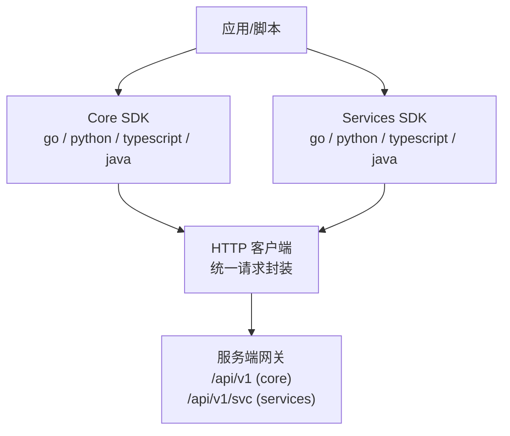
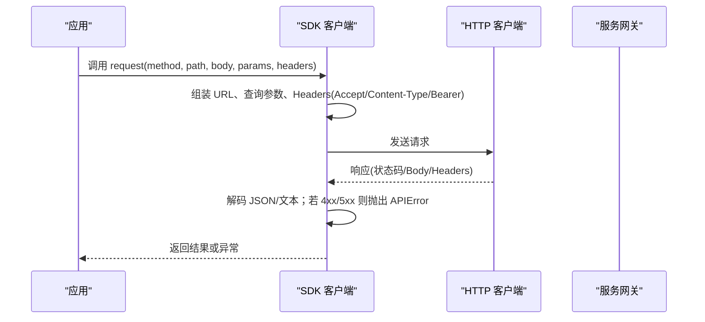
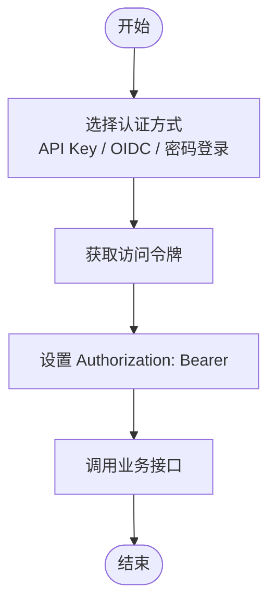
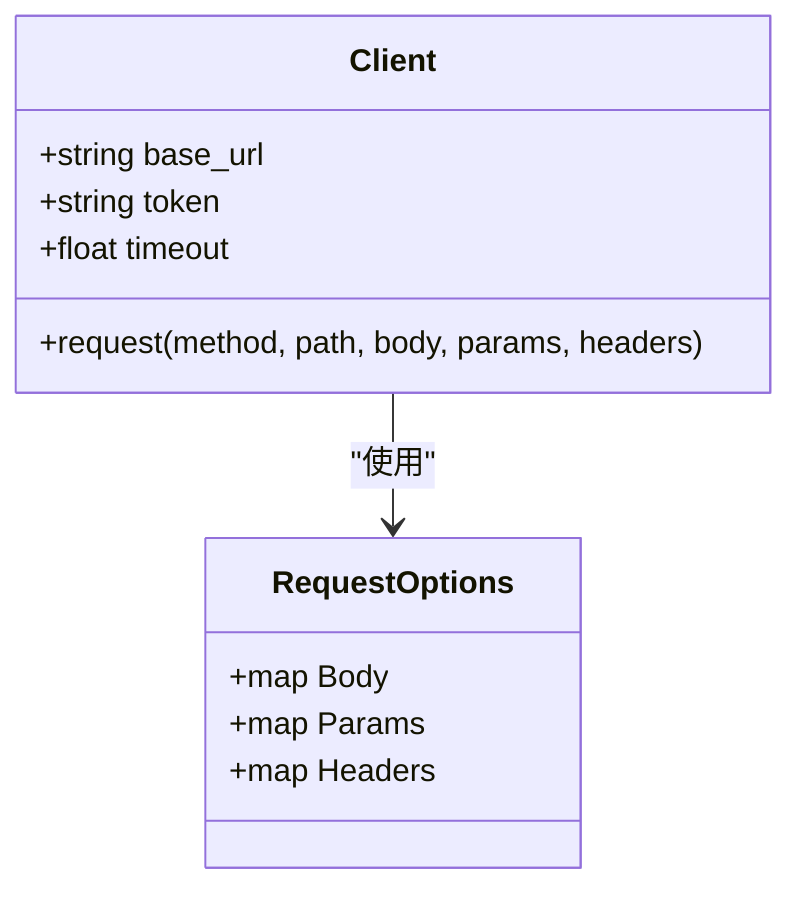
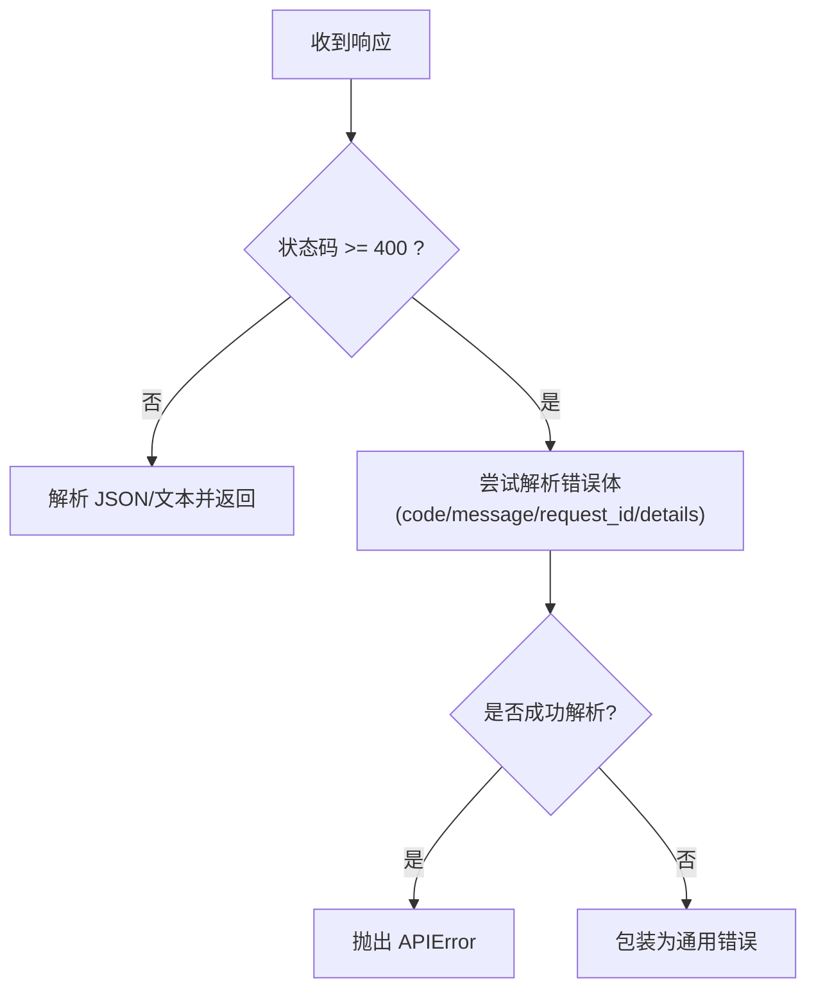
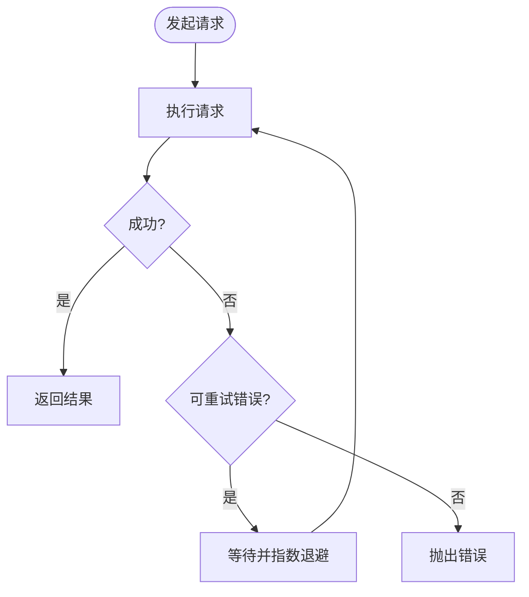
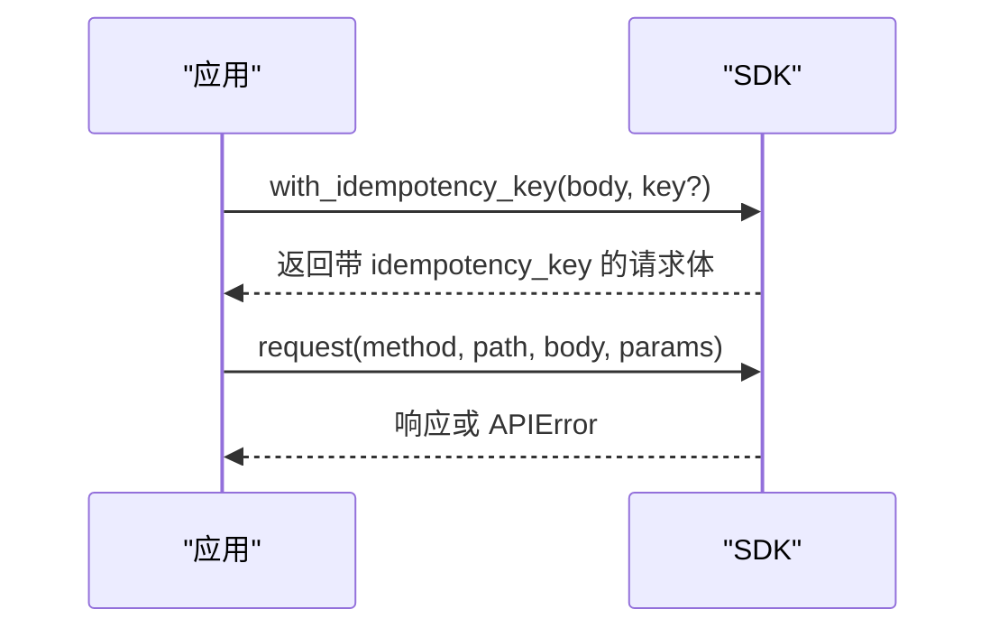
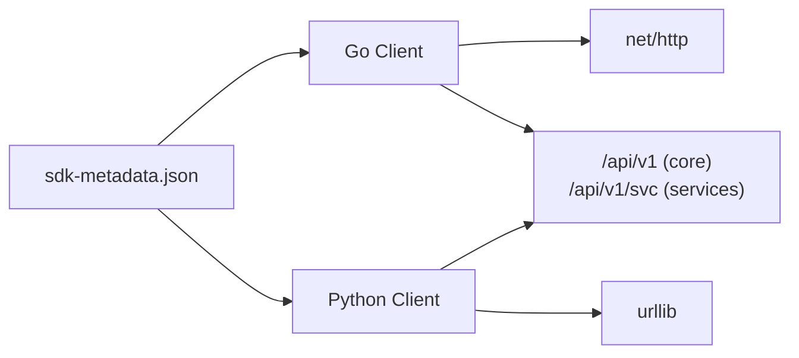

# SDK 通用特性

<cite>
**本文引用的文件**
- [repo/sdks/core/sdk-metadata.json](file://repo/sdks/core/sdk-metadata.json)
- [repo/sdks/services/sdk-metadata.json](file://repo/sdks/services/sdk-metadata.json)
- [repo/sdks/core/go/anisdk/client.go](file://repo/sdks/core/go/anisdk/client.go)
- [repo/sdks/services/go/anisdk/client.go](file://repo/sdks/services/go/anisdk/client.go)
- [repo/sdks/core/python/kubercloud_ani_core/client.py](file://repo/sdks/core/python/kubercloud_ani_core/client.py)
- [repo/sdks/services/python/kubercloud_ani_services/client.py](file://repo/sdks/services/python/kubercloud_ani_services/client.py)
</cite>

## 目录
1. [简介](#简介)
2. [项目结构](#项目结构)
3. [核心组件](#核心组件)
4. [架构总览](#架构总览)
5. [详细组件分析](#详细组件分析)
6. [依赖关系分析](#依赖关系分析)
7. [性能考量](#性能考量)
8. [故障排查指南](#故障排查指南)
9. [结论](#结论)
10. [附录](#附录)

## 简介
本文件面向跨语言 SDK（Go、Python、TypeScript、Java）的通用特性，聚焦以下主题：认证机制（API Key、OAuth2/OIDC、JWT）、配置管理、日志记录、监控指标与调试工具、错误处理模式、重试策略、超时配置与连接池管理、版本兼容性与升级指南、跨语言配置映射与使用对比，以及故障排查与性能优化建议。内容基于仓库中生成的 SDK 元数据与各语言客户端实现进行归纳总结。

## 项目结构
SDK 按“层”组织为 core 与 services 两套 API 集合，每套提供多语言客户端。每个语言的客户端由代码生成器从统一的 sdk-metadata.json 生成，保证行为一致。

**图示来源**
- [repo/sdks/core/sdk-metadata.json:1-10](file://repo/sdks/core/sdk-metadata.json#L1-L10)
- [repo/sdks/services/sdk-metadata.json:1-10](file://repo/sdks/services/sdk-metadata.json#L1-L10)

**章节来源**
- [repo/sdks/core/sdk-metadata.json:1-10](file://repo/sdks/core/sdk-metadata.json#L1-L10)
- [repo/sdks/services/sdk-metadata.json:1-10](file://repo/sdks/services/sdk-metadata.json#L1-L10)

## 核心组件
- 统一客户端对象：各语言均提供 Client，支持设置 BaseURL、Token、Timeout（Python），并封装 Request 方法。
- 认证注入：在请求头中自动附加 Authorization: Bearer <token>。
- 幂等性：提供 idempotency_key 生成与注入工具函数，适用于可幂等操作。
- 分页：提供 cursor 分页参数构造工具。
- 错误模型：统一 APIError，包含 code、message、request_id、details。
- 操作清单：Operations、Paths、Schemas、IdempotencyOperations、CursorPaginationOperations、ErrorCodes 等元数据集中声明，用于校验与辅助能力。

**章节来源**
- [repo/sdks/core/go/anisdk/client.go:391-442](file://repo/sdks/core/go/anisdk/client.go#L391-L442)
- [repo/sdks/services/go/anisdk/client.go:391-442](file://repo/sdks/services/go/anisdk/client.go#L391-L442)
- [repo/sdks/core/python/kubercloud_ani_core/client.py:869-933](file://repo/sdks/core/python/kubercloud_ani_core/client.py#L869-L933)
- [repo/sdks/services/python/kubercloud_ani_services/client.py:379-443](file://repo/sdks/services/python/kubercloud_ani_services/client.py#L379-L443)
- [repo/sdks/core/sdk-metadata.json:1-10](file://repo/sdks/core/sdk-metadata.json#L1-L10)
- [repo/sdks/services/sdk-metadata.json:1-10](file://repo/sdks/services/sdk-metadata.json#L1-L10)

## 架构总览
SDK 通过统一的 HTTP 客户端向 Core 与 Services 网关发起请求，所有认证、序列化、错误解析、幂等键与分页参数均由 SDK 内部完成。

**图示来源**
- [repo/sdks/core/go/anisdk/client.go:899-932](file://repo/sdks/core/go/anisdk/client.go#L899-L932)
- [repo/sdks/services/go/anisdk/client.go:409-442](file://repo/sdks/services/go/anisdk/client.go#L409-L442)
- [repo/sdks/core/python/kubercloud_ani_core/client.py:878-904](file://repo/sdks/core/python/kubercloud_ani_core/client.py#L878-L904)
- [repo/sdks/services/python/kubercloud_ani_services/client.py:388-414](file://repo/sdks/services/python/kubercloud_ani_services/client.py#L388-L414)

## 详细组件分析

### 认证机制（API Key、OAuth2/OIDC、JWT）
- API Key：通过创建/撤销 API Key 的接口进行管理，SDK 侧以 Token 形式注入到请求头。
- OAuth2/OIDC：元数据中包含 OIDC 登录流程相关操作（begin/complete/token），表明平台支持 OIDC 授权码流程；SDK 负责携带已获取的访问令牌。
- JWT：访问令牌以 Bearer Token 形式传递，服务端验证后签发后续操作的权限上下文。

**图示来源**
- [repo/sdks/core/sdk-metadata.json:50-101](file://repo/sdks/core/sdk-metadata.json#L50-L101)
- [repo/sdks/core/go/anisdk/client.go:920-922](file://repo/sdks/core/go/anisdk/client.go#L920-L922)
- [repo/sdks/services/go/anisdk/client.go:430-432](file://repo/sdks/services/go/anisdk/client.go#L430-L432)
- [repo/sdks/core/python/kubercloud_ani_core/client.py:912-918](file://repo/sdks/core/python/kubercloud_ani_core/client.py#L912-L918)
- [repo/sdks/services/python/kubercloud_ani_services/client.py:422-428](file://repo/sdks/services/python/kubercloud_ani_services/client.py#L422-L428)

**章节来源**
- [repo/sdks/core/sdk-metadata.json:50-101](file://repo/sdks/core/sdk-metadata.json#L50-L101)
- [repo/sdks/core/go/anisdk/client.go:920-922](file://repo/sdks/core/go/anisdk/client.go#L920-L922)
- [repo/sdks/services/go/anisdk/client.go:430-432](file://repo/sdks/services/go/anisdk/client.go#L430-L432)
- [repo/sdks/core/python/kubercloud_ani_core/client.py:912-918](file://repo/sdks/core/python/kubercloud_ani_core/client.py#L912-L918)
- [repo/sdks/services/python/kubercloud_ani_services/client.py:422-428](file://repo/sdks/services/python/kubercloud_ani_services/client.py#L422-L428)

### 配置管理
- 基础地址：BaseURL/SERVER_URL，区分 core 与 services 两个端点。
- 令牌：Token 字段用于注入鉴权。
- 超时：Python SDK 显式支持 timeout 参数；Go/TS/Java 可通过底层 HTTP 客户端配置。
- 自定义头：RequestOptions/headers 允许追加任意请求头。

**图示来源**
- [repo/sdks/core/go/anisdk/client.go:391-407](file://repo/sdks/core/go/anisdk/client.go#L391-L407)
- [repo/sdks/services/go/anisdk/client.go:391-407](file://repo/sdks/services/go/anisdk/client.go#L391-L407)
- [repo/sdks/core/python/kubercloud_ani_core/client.py:869-884](file://repo/sdks/core/python/kubercloud_ani_core/client.py#L869-L884)
- [repo/sdks/services/python/kubercloud_ani_services/client.py:379-395](file://repo/sdks/services/python/kubercloud_ani_services/client.py#L379-L395)

**章节来源**
- [repo/sdks/core/sdk-metadata.json:1-10](file://repo/sdks/core/sdk-metadata.json#L1-L10)
- [repo/sdks/services/sdk-metadata.json:1-10](file://repo/sdks/services/sdk-metadata.json#L1-L10)
- [repo/sdks/core/go/anisdk/client.go:391-407](file://repo/sdks/core/go/anisdk/client.go#L391-L407)
- [repo/sdks/services/go/anisdk/client.go:391-407](file://repo/sdks/services/go/anisdk/client.go#L391-L407)
- [repo/sdks/core/python/kubercloud_ani_core/client.py:869-884](file://repo/sdks/core/python/kubercloud_ani_core/client.py#L869-L884)
- [repo/sdks/services/python/kubercloud_ani_services/client.py:379-395](file://repo/sdks/services/python/kubercloud_ani_services/client.py#L379-L395)

### 日志记录、监控指标与调试工具
- 日志：SDK 未内置结构化日志输出，建议在调用方对关键步骤（构建请求、发送、响应、异常）添加日志。
- 指标：SDK 不直接暴露指标采集，可在调用方埋点统计 QPS、延迟、错误率等。
- 调试：利用 request_id（错误响应中）与 Operation/Path 元数据进行问题定位；可使用 HasOperation/CursorParams 等工具辅助。

**章节来源**
- [repo/sdks/core/go/anisdk/client.go:973-984](file://repo/sdks/core/go/anisdk/client.go#L973-L984)
- [repo/sdks/services/go/anisdk/client.go:483-494](file://repo/sdks/services/go/anisdk/client.go#L483-L494)
- [repo/sdks/core/python/kubercloud_ani_core/client.py:895-904](file://repo/sdks/core/python/kubercloud_ani_core/client.py#L895-L904)
- [repo/sdks/services/python/kubercloud_ani_services/client.py:405-414](file://repo/sdks/services/python/kubercloud_ani_services/client.py#L405-L414)

### 错误处理模式
- 统一错误类型 APIError，包含 code、message、request_id、details。
- 非 2xx 响应会转换为 APIError 或直接包装为错误。
- 提供 IsAPIErrorCode 工具判断错误码是否属于已知集合。

**图示来源**
- [repo/sdks/core/go/anisdk/client.go:951-985](file://repo/sdks/core/go/anisdk/client.go#L951-L985)
- [repo/sdks/services/go/anisdk/client.go:461-496](file://repo/sdks/services/go/anisdk/client.go#L461-L496)
- [repo/sdks/core/python/kubercloud_ani_core/client.py:895-904](file://repo/sdks/core/python/kubercloud_ani_core/client.py#L895-L904)
- [repo/sdks/services/python/kubercloud_ani_services/client.py:405-414](file://repo/sdks/services/python/kubercloud_ani_services/client.py#L405-L414)

**章节来源**
- [repo/sdks/core/go/anisdk/client.go:864-879](file://repo/sdks/core/go/anisdk/client.go#L864-L879)
- [repo/sdks/services/go/anisdk/client.go:374-389](file://repo/sdks/services/go/anisdk/client.go#L374-L389)
- [repo/sdks/core/python/kubercloud_ani_core/client.py:854-867](file://repo/sdks/core/python/kubercloud_ani_core/client.py#L854-L867)
- [repo/sdks/services/python/kubercloud_ani_services/client.py:364-377](file://repo/sdks/services/python/kubercloud_ani_services/client.py#L364-L377)

### 重试策略、超时配置与连接池管理
- 重试策略：SDK 未内置重试逻辑，建议在调用层根据错误码（如 RATE_LIMIT_EXCEEDED、UNAVAILABLE）实现指数退避重试。
- 超时配置：Python SDK 支持 timeout；Go/TS/Java 可通过底层 HTTP 客户端设置连接/读写超时。
- 连接池：默认使用语言标准库 HTTP 客户端的连接复用；如需细粒度控制，请替换底层 HTTP 客户端。

**章节来源**
- [repo/sdks/core/python/kubercloud_ani_core/client.py:869-884](file://repo/sdks/core/python/kubercloud_ani_core/client.py#L869-L884)
- [repo/sdks/services/python/kubercloud_ani_services/client.py:379-395](file://repo/sdks/services/python/kubercloud_ani_services/client.py#L379-L395)
- [repo/sdks/core/sdk-metadata.json:836-862](file://repo/sdks/core/sdk-metadata.json#L836-L862)
- [repo/sdks/services/sdk-metadata.json:697-719](file://repo/sdks/services/sdk-metadata.json#L697-L719)

### 幂等性与分页
- 幂等性：提供 NewIdempotencyKey/with_idempotency_key 工具，将 idempotency_key 注入请求体，适用于标记为幂等的操作。
- 分页：提供 CursorParams/cursor_params 构造 limit 与 cursor 参数，配合服务端游标分页。

**图示来源**
- [repo/sdks/core/go/anisdk/client.go:997-1021](file://repo/sdks/core/go/anisdk/client.go#L997-L1021)
- [repo/sdks/services/go/anisdk/client.go:507-531](file://repo/sdks/services/go/anisdk/client.go#L507-L531)
- [repo/sdks/core/python/kubercloud_ani_core/client.py:935-943](file://repo/sdks/core/python/kubercloud_ani_core/client.py#L935-L943)
- [repo/sdks/services/python/kubercloud_ani_services/client.py:445-453](file://repo/sdks/services/python/kubercloud_ani_services/client.py#L445-L453)

**章节来源**
- [repo/sdks/core/sdk-metadata.json:734-796](file://repo/sdks/core/sdk-metadata.json#L734-L796)
- [repo/sdks/services/sdk-metadata.json:648-682](file://repo/sdks/services/sdk-metadata.json#L648-L682)
- [repo/sdks/core/go/anisdk/client.go:997-1032](file://repo/sdks/core/go/anisdk/client.go#L997-L1032)
- [repo/sdks/services/go/anisdk/client.go:507-542](file://repo/sdks/services/go/anisdk/client.go#L507-L542)
- [repo/sdks/core/python/kubercloud_ani_core/client.py:935-952](file://repo/sdks/core/python/kubercloud_ani_core/client.py#L935-L952)
- [repo/sdks/services/python/kubercloud_ani_services/client.py:445-462](file://repo/sdks/services/python/kubercloud_ani_services/client.py#L445-L462)

### 版本兼容性与升级指南
- 版本标识：SDK 常量 Version 与 serverURL 路径前缀（/api/v1、/api/v1/svc）体现 API 版本。
- 兼容性基线：仓库维护了 v1 兼容性基线与变更日志，升级时应对照基线检查 Breaking Changes。
- 建议：优先锁定 SDK 版本与服务端版本对齐；新增字段采用向后兼容策略；删除字段需评估影响面。

**章节来源**
- [repo/sdks/core/sdk-metadata.json:1-10](file://repo/sdks/core/sdk-metadata.json#L1-L10)
- [repo/sdks/services/sdk-metadata.json:1-10](file://repo/sdks/services/sdk-metadata.json#L1-L10)

### 跨语言配置映射与使用对比
- 基础地址：BaseURL（Go/TS/Java）/ base_url（Python）。
- 令牌：Token（Go/TS/Java）/ token（Python）。
- 超时：timeout（Python）/ 通过底层 HTTP 客户端配置（Go/TS/Java）。
- 自定义头：Headers（Go RequestOptions）/ headers（Python）。
- 幂等键：NewIdempotencyKey/with_idempotency_key（Go）/ new_idempotency_key/with_idempotency_key（Python）。
- 分页：CursorParams（Go）/ cursor_params（Python）。

| 维度 | Go | Python | TypeScript/Java |
| --- | --- | --- | --- |
| 基础地址 | BaseURL | base_url | 同 Go |
| 令牌 | Token | token | 同 Go |
| 超时 | 底层 HTTP 客户端 | timeout | 同 Go |
| 自定义头 | RequestOptions.Headers | headers | 同 Go |
| 幂等键 | NewIdempotencyKey/WithIdempotencyKey | new_idempotency_key/with_idempotency_key | 同 Go |
| 分页 | CursorParams | cursor_params | 同 Go |

**章节来源**
- [repo/sdks/core/go/anisdk/client.go:391-407](file://repo/sdks/core/go/anisdk/client.go#L391-L407)
- [repo/sdks/services/go/anisdk/client.go:391-407](file://repo/sdks/services/go/anisdk/client.go#L391-L407)
- [repo/sdks/core/python/kubercloud_ani_core/client.py:869-884](file://repo/sdks/core/python/kubercloud_ani_core/client.py#L869-L884)
- [repo/sdks/services/python/kubercloud_ani_services/client.py:379-395](file://repo/sdks/services/python/kubercloud_ani_services/client.py#L379-L395)

## 依赖关系分析
- SDK 与元数据：Operations、Paths、Schemas、ErrorCodes 等由 sdk-metadata.json 驱动，确保多语言一致性。
- 客户端与网络栈：Go 使用 net/http；Python 使用 urllib；TS/Java 使用各自标准 HTTP 栈。
- 服务端：Core 与 Services 网关分别对应不同路径前缀。

**图示来源**
- [repo/sdks/core/sdk-metadata.json:1-10](file://repo/sdks/core/sdk-metadata.json#L1-L10)
- [repo/sdks/services/sdk-metadata.json:1-10](file://repo/sdks/services/sdk-metadata.json#L1-L10)
- [repo/sdks/core/go/anisdk/client.go:1-14](file://repo/sdks/core/go/anisdk/client.go#L1-L14)
- [repo/sdks/core/python/kubercloud_ani_core/client.py:1-5](file://repo/sdks/core/python/kubercloud_ani_core/client.py#L1-L5)

**章节来源**
- [repo/sdks/core/sdk-metadata.json:1-10](file://repo/sdks/core/sdk-metadata.json#L1-L10)
- [repo/sdks/services/sdk-metadata.json:1-10](file://repo/sdks/services/sdk-metadata.json#L1-L10)
- [repo/sdks/core/go/anisdk/client.go:1-14](file://repo/sdks/core/go/anisdk/client.go#L1-L14)
- [repo/sdks/core/python/kubercloud_ani_core/client.py:1-5](file://repo/sdks/core/python/kubercloud_ani_core/client.py#L1-L5)

## 性能考量
- 连接复用：使用语言标准库 HTTP 客户端，默认启用连接复用；在高并发场景下注意线程安全与实例复用。
- 超时与限流：合理设置超时；对 RATE_LIMIT_EXCEEDED 等错误实施指数退避重试。
- 批量与分页：使用游标分页避免一次性拉取大量数据；合并小请求以降低开销。
- 序列化：尽量复用请求体对象，减少重复分配；仅在必要时开启调试日志。

[本节为通用指导，无需特定文件引用]

## 故障排查指南
- 认证失败：确认 Token 有效且正确注入 Authorization 头；检查 OIDC 流程是否完整。
- 404/NOT_FOUND：核对 Path 与参数；使用 HasOperation 校验操作是否存在。
- 速率限制：捕获 RATE_LIMIT_EXCEEDED 并退避重试；降低并发或增加间隔。
- 超时：调整 timeout；检查网络与远端服务健康度。
- 错误定位：记录 request_id 与 Operation/Path；结合服务端日志进行根因分析。

**章节来源**
- [repo/sdks/core/go/anisdk/client.go:920-922](file://repo/sdks/core/go/anisdk/client.go#L920-L922)
- [repo/sdks/services/go/anisdk/client.go:430-432](file://repo/sdks/services/go/anisdk/client.go#L430-L432)
- [repo/sdks/core/python/kubercloud_ani_core/client.py:912-918](file://repo/sdks/core/python/kubercloud_ani_core/client.py#L912-L918)
- [repo/sdks/services/python/kubercloud_ani_services/client.py:422-428](file://repo/sdks/services/python/kubercloud_ani_services/client.py#L422-L428)
- [repo/sdks/core/sdk-metadata.json:836-862](file://repo/sdks/core/sdk-metadata.json#L836-L862)
- [repo/sdks/services/sdk-metadata.json:697-719](file://repo/sdks/services/sdk-metadata.json#L697-L719)

## 结论
本 SDK 族通过统一的元数据驱动与一致的客户端抽象，在多语言环境下提供了稳定的认证、配置、错误处理、幂等性与分页能力。生产环境建议结合调用层实现重试、超时与连接池调优，并完善日志与指标采集，以获得更好的可观测性与稳定性。

[本节为总结，无需特定文件引用]

## 附录
- 常用工具函数速查：
  - 幂等键：NewIdempotencyKey/with_idempotency_key（Go）；new_idempotency_key/with_idempotency_key（Python）
  - 分页：CursorParams（Go）；cursor_params（Python）
  - 错误码校验：IsAPIErrorCode（Go/Python）

**章节来源**
- [repo/sdks/core/go/anisdk/client.go:997-1041](file://repo/sdks/core/go/anisdk/client.go#L997-L1041)
- [repo/sdks/services/go/anisdk/client.go:507-551](file://repo/sdks/services/go/anisdk/client.go#L507-L551)
- [repo/sdks/core/python/kubercloud_ani_core/client.py:935-956](file://repo/sdks/core/python/kubercloud_ani_core/client.py#L935-L956)
- [repo/sdks/services/python/kubercloud_ani_services/client.py:445-466](file://repo/sdks/services/python/kubercloud_ani_services/client.py#L445-L466)