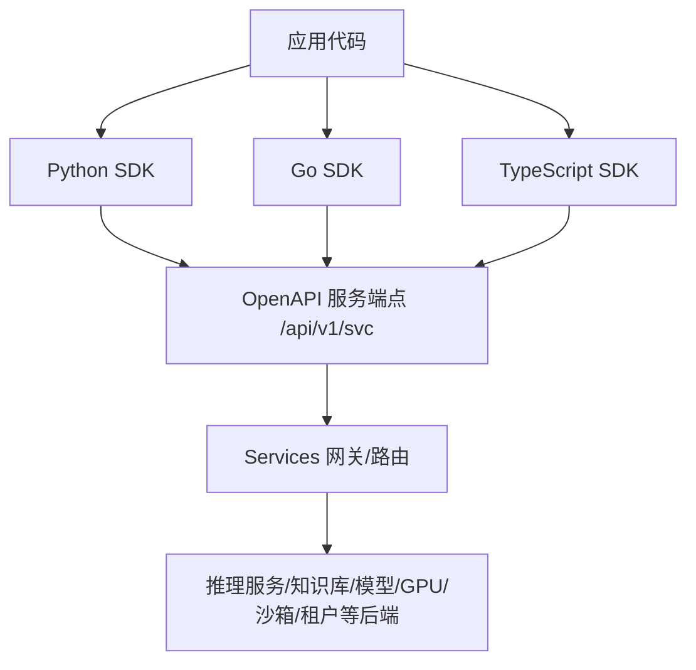
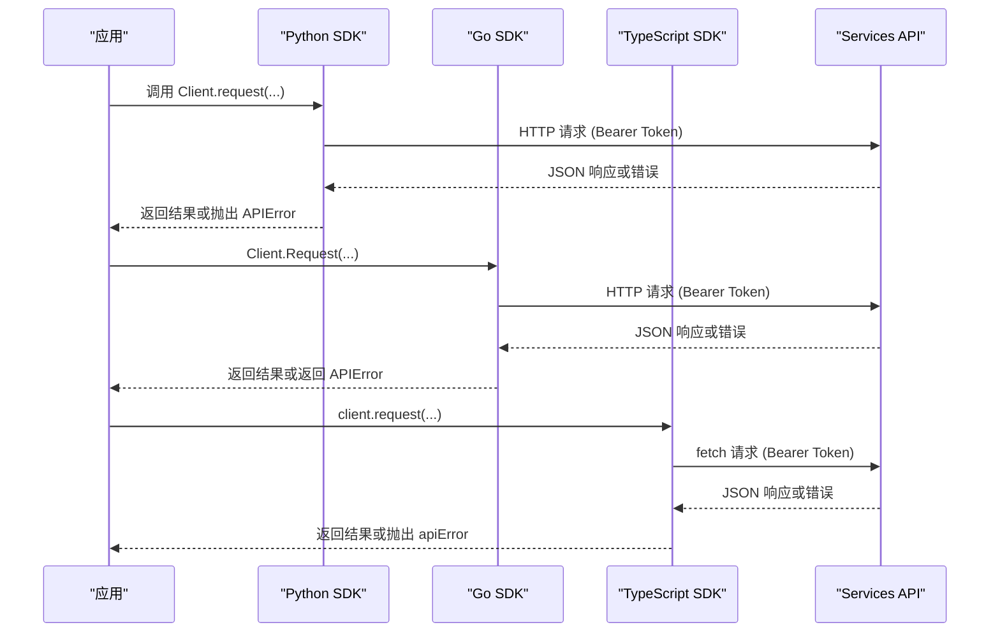
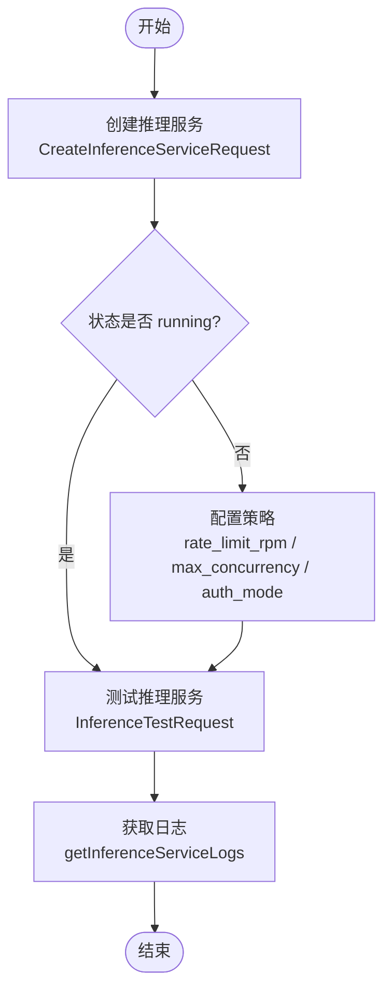
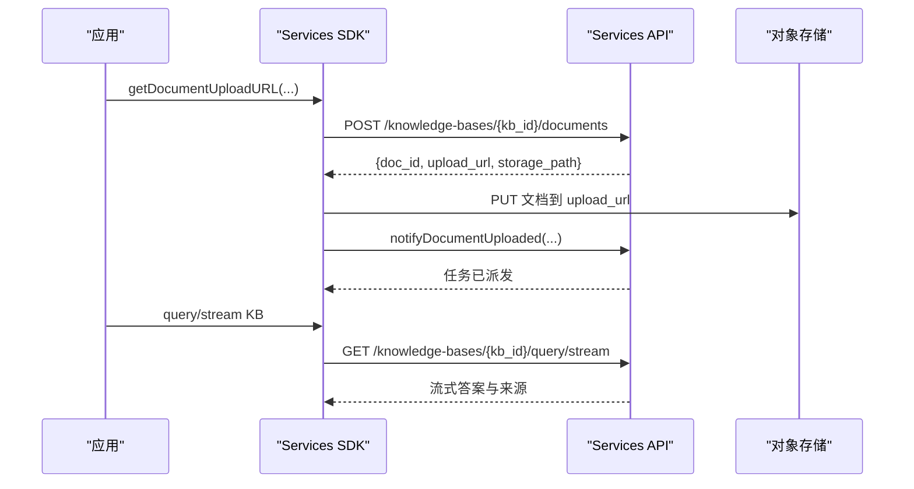
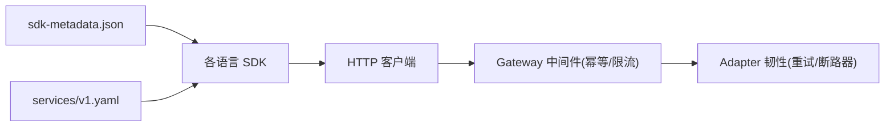
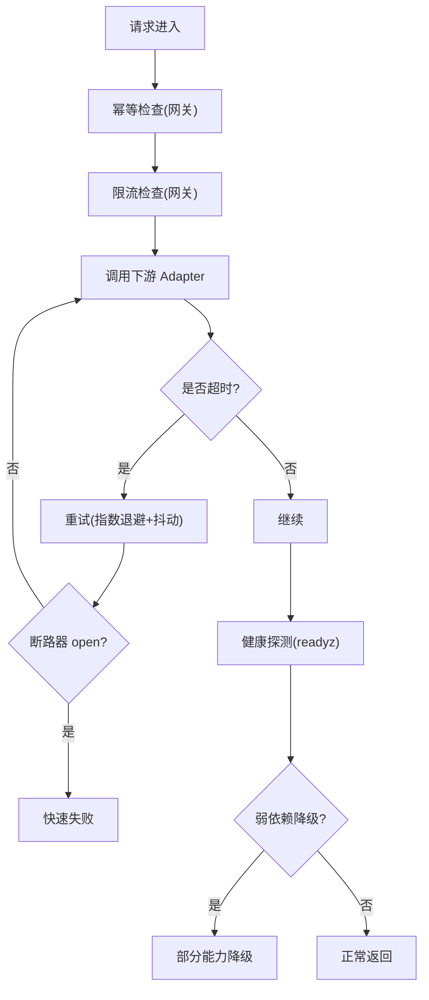

# Services SDK 概览

<cite>
**本文引用的文件**
- [repo/sdks/services/sdk-metadata.json](file://repo/sdks/services/sdk-metadata.json)
- [repo/api/openapi/services/v1.yaml](file://repo/api/openapi/services/v1.yaml)
- [repo/sdks/services/python/kubercloud_ani_services/client.py](file://repo/sdks/services/python/kubercloud_ani_services/client.py)
- [repo/sdks/services/go/anisdk/client.go](file://repo/sdks/services/go/anisdk/client.go)
- [repo/sdks/services/typescript/src/index.ts](file://repo/sdks/services/typescript/src/index.ts)
- [repo/sdks/services/python/examples/basic.py](file://repo/sdks/services/python/examples/basic.py)
- [repo/sdks/services/go/examples/basic/main.go](file://repo/sdks/services/go/examples/basic/main.go)
- [repo/development-records/sprint14-core-resilience-plan.md](file://repo/development-records/sprint14-core-resilience-plan.md)
- [ANI-02-产品功能设计.md](file://ANI-02-产品功能设计.md)
</cite>

## 目录
1. [简介](#简介)
2. [项目结构](#项目结构)
3. [核心组件](#核心组件)
4. [架构总览](#架构总览)
5. [详细组件分析](#详细组件分析)
6. [依赖关系分析](#依赖关系分析)
7. [性能与韧性考量](#性能与韧性考量)
8. [故障排查指南](#故障排查指南)
9. [结论](#结论)
10. [附录：快速开始](#附录快速开始)

## 简介
Services SDK 是面向 ANI Services 层的客户端 SDK，提供对 AI 推理服务、知识库管理、模型管理等业务能力的统一访问。它基于 OpenAPI 契约生成，覆盖 Python、Go、TypeScript 等多语言，帮助开发者以一致的方式集成 AI 相关能力（如创建推理服务、管理知识库文档与查询、导入/版本化模型等）。

相对于 Core SDK，Services SDK 聚焦“平台之上的业务能力”，包括：
- 推理服务生命周期管理（创建、扩缩容、日志、测试、策略）
- 知识库全生命周期（创建、配置、文档上传/解析/重建、检索与流式问答）
- 模型管理（导入、版本化、列表与删除）
- GPU 容器与沙箱资源管理
- 租户、计划、成员、SSO、Webhook 等运营管理能力

Core SDK 主要对接平台基础能力（实例、存储、网络、可观测性等），而 Services SDK 在此基础上提供更贴近 AI 场景的编排与管理能力。

**章节来源**
- [ANI-02-产品功能设计.md:66-72](file://ANI-02-产品功能设计.md#L66-L72)
- [ANI-02-产品功能设计.md:297-300](file://ANI-02-产品功能设计.md#L297-L300)

## 项目结构
Services SDK 位于 repo/sdks/services，包含多语言实现与示例：
- Python：kubercloud_ani_services.client 提供 Client、错误类型、幂等键与分页参数工具
- Go：anisdk.Client 提供 Request 方法与错误封装
- TypeScript：index.ts 暴露 Client、常量与工具函数
- 元数据：sdk-metadata.json 描述操作、路径、Schema、幂等与分页能力、错误码
- OpenAPI 契约：repo/api/openapi/services/v1.yaml 定义所有 API 资源与行为

**图表来源**
- [repo/sdks/services/python/kubercloud_ani_services/client.py:379-442](file://repo/sdks/services/python/kubercloud_ani_services/client.py#L379-L442)
- [repo/sdks/services/go/anisdk/client.go:391-442](file://repo/sdks/services/go/anisdk/client.go#L391-L442)
- [repo/sdks/services/typescript/src/index.ts:377-440](file://repo/sdks/services/typescript/src/index.ts#L377-L440)
- [repo/api/openapi/services/v1.yaml:11-20](file://repo/api/openapi/services/v1.yaml#L11-L20)

**章节来源**
- [repo/sdks/services/sdk-metadata.json:1-12](file://repo/sdks/services/sdk-metadata.json#L1-L12)
- [repo/api/openapi/services/v1.yaml:1-20](file://repo/api/openapi/services/v1.yaml#L1-L20)

## 核心组件
- 客户端抽象
  - Python Client：支持 base_url、token、timeout；统一 request 方法；自动设置 Accept/Content-Type；将 HTTPError 转换为 APIError
  - Go Client：NewClient + Request；统一编码/解码；返回结构化 APIError
  - TypeScript Client：fetch 封装；统一 headers；抛出 apiError
- 通用工具
  - 幂等键生成：new_idempotency_key / NewIdempotencyKey / newIdempotencyKey
  - 请求体注入：with_idempotency_key / WithIdempotencyKey / withIdempotencyKey
  - 游标分页：cursor_params / CursorParams / cursorParams
- 能力清单
  - operations：列出所有 operationId（推理服务、知识库、模型、GPU 容器、沙箱、租户等）
  - paths：HTTP 方法与路径映射
  - schemas：数据结构定义集合
  - idempotencyOperations：支持幂等的操作集合
  - cursorPaginationOperations：支持游标分页的操作集合
  - errorCodes：标准错误码集合

这些组件由 OpenAPI 契约驱动生成，确保 SDK 与服务端接口严格一致。

**章节来源**
- [repo/sdks/services/python/kubercloud_ani_services/client.py:10-102](file://repo/sdks/services/python/kubercloud_ani_services/client.py#L10-L102)
- [repo/sdks/services/go/anisdk/client.go:21-113](file://repo/sdks/services/go/anisdk/client.go#L21-L113)
- [repo/sdks/services/typescript/src/index.ts:6-98](file://repo/sdks/services/typescript/src/index.ts#L6-L98)
- [repo/sdks/services/sdk-metadata.json:6-553](file://repo/sdks/services/sdk-metadata.json#L6-L553)

## 架构总览
Services SDK 通过统一的 REST 客户端访问 Services 层 API，核心职责是：
- 构造请求 URL 与 Headers（含鉴权）
- 序列化/反序列化 JSON
- 标准化错误为 APIError
- 提供幂等键与游标分页工具

**图表来源**
- [repo/sdks/services/python/kubercloud_ani_services/client.py:388-414](file://repo/sdks/services/python/kubercloud_ani_services/client.py#L388-L414)
- [repo/sdks/services/go/anisdk/client.go:409-442](file://repo/sdks/services/go/anisdk/client.go#L409-L442)
- [repo/sdks/services/typescript/src/index.ts:390-405](file://repo/sdks/services/typescript/src/index.ts#L390-L405)
- [repo/api/openapi/services/v1.yaml:18-21](file://repo/api/openapi/services/v1.yaml#L18-L21)

## 详细组件分析

### 推理服务（Inference Service）
- 能力范围
  - 创建/更新/删除推理服务
  - 生命周期控制（启动/停止/重启）
  - 日志获取、策略配置（限流、并发、租户白名单、认证模式）、测试
  - 关联模型版本与镜像引用
- 关键 Schema
  - InferenceService、CreateInferenceServiceRequest、UpdateInferenceServiceRequest、InferenceServiceLifecycleRequest、InferenceServicePolicies、InferenceTestRequest/Response
- 典型流程
  - 创建推理服务 → 等待运行 → 配置策略 → 测试 → 获取日志

**图表来源**
- [repo/api/openapi/services/v1.yaml:154-241](file://repo/api/openapi/services/v1.yaml#L154-L241)
- [repo/api/openapi/services/v1.yaml:577-629](file://repo/api/openapi/services/v1.yaml#L577-L629)

**章节来源**
- [repo/sdks/services/sdk-metadata.json:68-126](file://repo/sdks/services/sdk-metadata.json#L68-L126)
- [repo/api/openapi/services/v1.yaml:154-241](file://repo/api/openapi/services/v1.yaml#L154-L241)
- [repo/api/openapi/services/v1.yaml:577-629](file://repo/api/openapi/services/v1.yaml#L577-L629)

### 知识库（Knowledge Base）
- 能力范围
  - 创建/删除/获取知识库
  - 配置（嵌入模型、分块大小、OCR、TopK、相似度阈值、检索策略）
  - 文档上传（获取预签名 URL → 直传对象存储 → 通知解析）
  - 重新解析、重建、权限管理
  - 会话管理与流式查询
- 关键 Schema
  - KnowledgeBase、KBConfig、KBDocument、KBQueryRequest/Response、GetDocumentUploadURLRequest/Response、NotifyDocumentUploadedRequest、ReparseDocumentRequest、RebuildKnowledgeBaseRequest
- 典型流程
  - 获取上传 URL → 上传文档 → 通知解析 → 查询/流式问答

**图表来源**
- [repo/api/openapi/services/v1.yaml:278-368](file://repo/api/openapi/services/v1.yaml#L278-L368)
- [repo/api/openapi/services/v1.yaml:312-341](file://repo/api/openapi/services/v1.yaml#L312-L341)

**章节来源**
- [repo/sdks/services/sdk-metadata.json:146-252](file://repo/sdks/services/sdk-metadata.json#L146-L252)
- [repo/api/openapi/services/v1.yaml:278-368](file://repo/api/openapi/services/v1.yaml#L278-L368)

### 模型管理（Model）
- 能力范围
  - 列表/创建/导入/删除模型
  - 版本管理（创建版本）
  - 可用模型列表（嵌入与推理）
- 关键 Schema
  - Model、ModelVersion、ModelList、CreateModelRequest
- 使用场景
  - 从 HuggingFace/ModelScope 导入模型
  - 为推理服务选择不可变模型版本

**章节来源**
- [repo/sdks/services/sdk-metadata.json:254-288](file://repo/sdks/services/sdk-metadata.json#L254-L288)
- [repo/api/openapi/services/v1.yaml:129-153](file://repo/api/openapi/services/v1.yaml#L129-L153)
- [repo/api/openapi/services/v1.yaml:705-719](file://repo/api/openapi/services/v1.yaml#L705-L719)

### GPU 容器与沙箱
- GPU 容器
  - 创建/查询/更新/删除 GPU 容器
  - 查看可用 GPU、指标、版本、重建与回滚
- 沙箱
  - 创建/暂停/扩展/删除沙箱
  - 安全事件与安全概览
- 适用场景
  - 临时实验环境、调试推理服务、隔离执行

**章节来源**
- [repo/sdks/services/sdk-metadata.json:7-66](file://repo/sdks/services/sdk-metadata.json#L7-L66)
- [repo/sdks/services/sdk-metadata.json:290-342](file://repo/sdks/services/sdk-metadata.json#L290-L342)
- [repo/api/openapi/services/v1.yaml:369-486](file://repo/api/openapi/services/v1.yaml#L369-L486)

### 租户与运营能力
- 租户计划、成员、角色、SSO、Webhook、管理员邀请与审计日志
- 适用于平台运营、权限治理、事件通知与合规审计

**章节来源**
- [repo/sdks/services/sdk-metadata.json:344-552](file://repo/sdks/services/sdk-metadata.json#L344-L552)
- [repo/api/openapi/services/v1.yaml:508-576](file://repo/api/openapi/services/v1.yaml#L508-L576)

## 依赖关系分析
- SDK 与 OpenAPI 契约强绑定：operations、paths、schemas、idempotencyOperations、cursorPaginationOperations、errorCodes 均来源于 sdk-metadata.json 与 v1.yaml
- 客户端实现仅负责 HTTP 通信与错误转换，不耦合具体业务逻辑
- 幂等与重试：
  - SDK 侧提供幂等键生成与注入
  - 服务端网关具备幂等重放中间件（跨副本共享存储）
  - 适配器层具备重试与断路器 foundation（用于外部依赖韧性）

**图表来源**
- [repo/sdks/services/sdk-metadata.json:648-719](file://repo/sdks/services/sdk-metadata.json#L648-L719)
- [repo/api/openapi/services/v1.yaml:96-128](file://repo/api/openapi/services/v1.yaml#L96-L128)
- [repo/development-records/sprint14-core-resilience-plan.md:51-63](file://repo/development-records/sprint14-core-resilience-plan.md#L51-L63)

**章节来源**
- [repo/sdks/services/sdk-metadata.json:648-719](file://repo/sdks/services/sdk-metadata.json#L648-L719)
- [repo/development-records/sprint14-core-resilience-plan.md:51-63](file://repo/development-records/sprint14-core-resilience-plan.md#L51-L63)

## 性能与韧性考量
- 幂等性
  - SDK 提供幂等键生成与注入，避免重复提交导致副作用
  - 服务端网关对 mutating 请求进行幂等重放，减少重复处理
- 限流与背压
  - Gateway 中间件实现 per-tenant/route-class 窗口计数，超限返回 429
- 超时与重试
  - Adapter 层支持每调用超时、指数退避重试、断路器 foundation
  - 多端点 fallback（MinIO/Milvus）在网络错误、429、5xx 时尝试下一个 endpoint
- 健康探测与降级
  - 数据面 readyz 区分 strong/weak 依赖失败，返回不同健康状态
  - 断路器 open 时快速失败，避免雪崩

**图表来源**
- [repo/development-records/sprint14-core-resilience-plan.md:51-63](file://repo/development-records/sprint14-core-resilience-plan.md#L51-L63)

**章节来源**
- [repo/development-records/sprint14-core-resilience-plan.md:51-63](file://repo/development-records/sprint14-core-resilience-plan.md#L51-L63)

## 故障排查指南
- 常见错误
  - BAD_REQUEST：请求参数非法
  - UNAUTHORIZED/FORBIDDEN：鉴权或权限不足
  - NOT_FOUND：资源不存在
  - MODEL_NOT_READY/MODEL_INCOMPATIBLE：模型未就绪或不兼容
  - ACCELERATOR_SPEC_UNAVAILABLE/INSUFFICIENT_CAPACITY：加速器规格不可用或容量不足
  - RUNTIME_ERROR/RUNTIME_TIMEOUT：运行时错误或超时
- 排查步骤
  - 检查鉴权 token 是否正确传递
  - 确认幂等键是否重复且处于进行中（409 IDEMPOTENCY_CONFLICT）
  - 查看推理服务日志定位运行时问题
  - 检查知识库文档解析状态与错误消息
  - 使用游标分页拉取更多上下文信息

**章节来源**
- [repo/sdks/services/sdk-metadata.json:697-719](file://repo/sdks/services/sdk-metadata.json#L697-L719)
- [repo/api/openapi/services/v1.yaml:22-95](file://repo/api/openapi/services/v1.yaml#L22-L95)

## 结论
Services SDK 以 OpenAPI 契约为核心，提供多语言一致的 AI 服务能力接入方式，覆盖推理服务、知识库、模型、GPU 容器、沙箱及租户运营等关键领域。结合网关幂等、限流与适配器层重试/断路器 foundation，能够在生产环境中提供稳定可靠的调用体验。建议在实际使用中：
- 始终使用幂等键保护写操作
- 合理配置超时与重试策略
- 关注健康状态与降级语义
- 利用日志与查询能力快速定位问题

## 附录：快速开始
以下示例展示如何在各语言中初始化 SDK、生成幂等键与分页参数，并验证基本能力。

- Python
  - 初始化客户端、注入幂等键、构造分页参数、校验错误码
  - 参考路径：[basic.py:1-16](file://repo/sdks/services/python/examples/basic.py#L1-L16)

- Go
  - 初始化客户端、注入幂等键、构造分页参数、校验错误码
  - 参考路径：[main.go:1-23](file://repo/sdks/services/go/examples/basic/main.go#L1-L23)

- TypeScript
  - 使用 Client 发起请求，携带 Bearer Token，处理 APIError
  - 参考路径：[index.ts:377-440](file://repo/sdks/services/typescript/src/index.ts#L377-L440)

**章节来源**
- [repo/sdks/services/python/examples/basic.py:1-16](file://repo/sdks/services/python/examples/basic.py#L1-L16)
- [repo/sdks/services/go/examples/basic/main.go:1-23](file://repo/sdks/services/go/examples/basic/main.go#L1-L23)
- [repo/sdks/services/typescript/src/index.ts:377-440](file://repo/sdks/services/typescript/src/index.ts#L377-L440)