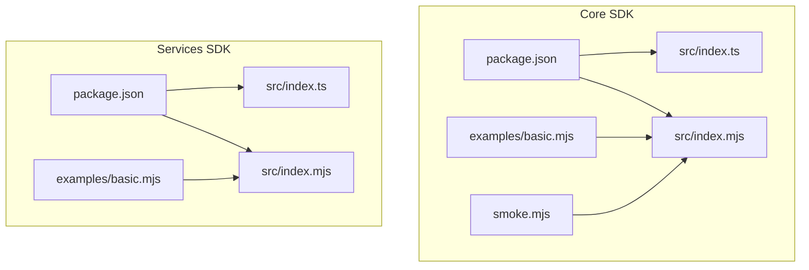
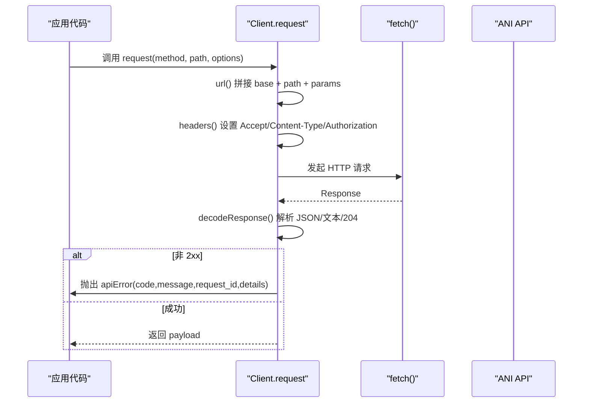
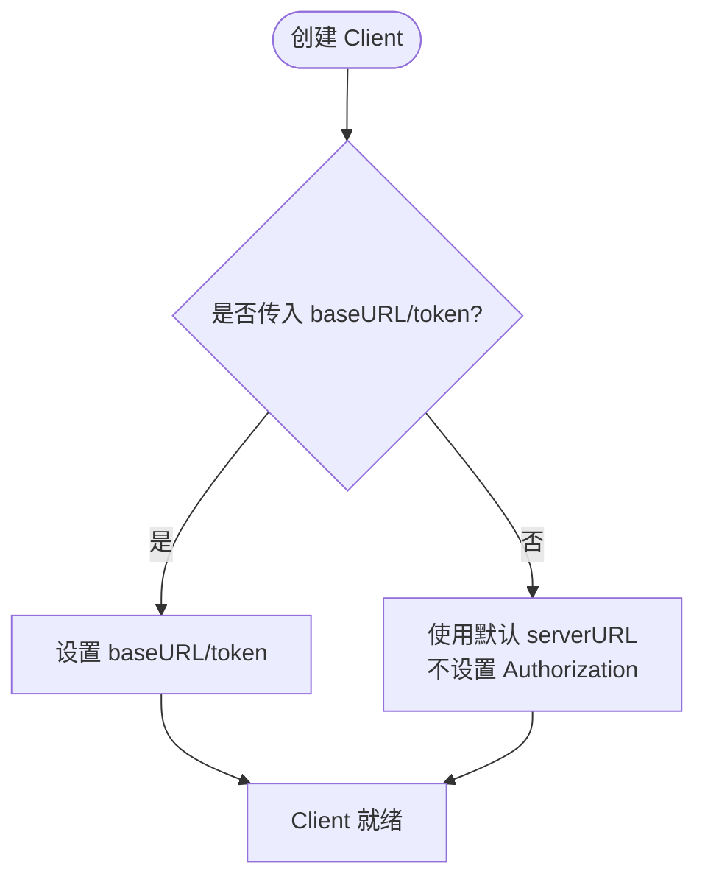
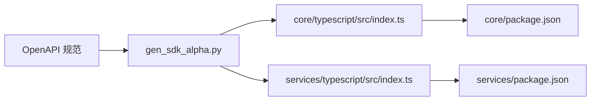

# TypeScript SDK 使用指南

<cite>
**本文引用的文件**
- [repo/sdks/core/typescript/package.json](file://repo/sdks/core/typescript/package.json)
- [repo/sdks/services/typescript/package.json](file://repo/sdks/services/typescript/package.json)
- [repo/sdks/core/typescript/src/index.ts](file://repo/sdks/core/typescript/src/index.ts)
- [repo/sdks/services/typescript/src/index.ts](file://repo/sdks/services/typescript/src/index.ts)
- [repo/sdks/core/typescript/examples/basic.mjs](file://repo/sdks/core/typescript/examples/basic.mjs)
- [repo/sdks/services/typescript/examples/basic.mjs](file://repo/sdks/services/typescript/examples/basic.mjs)
- [repo/sdks/core/typescript/smoke.mjs](file://repo/sdks/core/typescript/smoke.mjs)
- [repo/scripts/gen_sdk_alpha.py](file://repo/scripts/gen_sdk_alpha.py)
</cite>

## 目录
1. [简介](#简介)
2. [项目结构](#项目结构)
3. [核心组件](#核心组件)
4. [架构总览](#架构总览)
5. [详细组件分析](#详细组件分析)
6. [依赖关系分析](#依赖关系分析)
7. [性能与兼容性](#性能与兼容性)
8. [故障排查](#故障排查)
9. [结论](#结论)
10. [附录：API 参考](#附录api-参考)

## 简介
本指南面向在浏览器与 Node.js 环境中使用 ANI TypeScript SDK 的开发者。SDK 由 OpenAPI 规范自动生成，提供轻量、类型安全的 HTTP 客户端能力，覆盖 Core API 与 Services API 两层。文档涵盖安装与包管理、客户端初始化、ESM/CommonJS 支持、类型定义与接口说明、完整 API 参考、错误处理、以及打包与性能优化建议。

## 项目结构
仓库中 TypeScript SDK 位于 repo/sdks 下，分为 core 与 services 两个独立包：
- Core SDK（@kubercloud/ani-core-alpha）：面向平台核心资源（实例、存储、网络、注册表等）。
- Services SDK（@kubercloud/ani-services-alpha）：面向服务层能力（推理服务、知识库、租户计划、Webhook 等）。

每个包包含：
- package.json：声明包名、版本、模块类型与导出入口。
- src/index.ts：TypeScript 类型定义与客户端实现（含请求方法、工具函数）。
- src/index.mjs：运行时 JS 实现（供 ESM 环境直接导入）。
- examples/basic.mjs：最小可运行示例。
- smoke.mjs：冒烟测试脚本，验证元数据与关键能力。

图表来源
- [repo/sdks/core/typescript/package.json:1-11](file://repo/sdks/core/typescript/package.json#L1-L11)
- [repo/sdks/services/typescript/package.json:1-11](file://repo/sdks/services/typescript/package.json#L1-L11)
- [repo/sdks/core/typescript/src/index.ts:1-20](file://repo/sdks/core/typescript/src/index.ts#L1-L20)
- [repo/sdks/services/typescript/src/index.ts:1-20](file://repo/sdks/services/typescript/src/index.ts#L1-L20)

章节来源
- [repo/sdks/core/typescript/package.json:1-11](file://repo/sdks/core/typescript/package.json#L1-L11)
- [repo/sdks/services/typescript/package.json:1-11](file://repo/sdks/services/typescript/package.json#L1-L11)

## 核心组件
- Client：统一 HTTP 客户端，封装 baseURL、token、headers、URL 拼接、响应解码与错误转换。
- 工具函数：
  - newIdempotencyKey：生成幂等键，兼容浏览器 crypto.randomUUID 与 fallback 随机数。
  - withIdempotencyKey：为请求体注入 idempotency_key。
  - cursorParams：构造分页参数 limit/cursor。
  - isAPIErrorCode / apiError：统一错误码校验与错误对象构造。
- 元数据常量：layer/title/version/serverURL/operations/paths/schemas/idempotencyOperations/cursorPaginationOperations/errorCodes。

章节来源
- [repo/sdks/core/typescript/src/index.ts:359-481](file://repo/sdks/core/typescript/src/index.ts#L359-L481)
- [repo/sdks/services/typescript/src/index.ts:359-481](file://repo/sdks/services/typescript/src/index.ts#L359-L481)

## 架构总览
SDK 通过 OpenAPI 规范生成操作列表、路径、Schema 名称与幂等/分页标记，并在客户端暴露统一的 request 方法与工具函数。Core 与 Services 共享相同的设计模式，差异在于 serverURL 前缀与具体操作集合。

图表来源
- [repo/sdks/core/typescript/src/index.ts:390-439](file://repo/sdks/core/typescript/src/index.ts#L390-L439)
- [repo/sdks/services/typescript/src/index.ts:369-417](file://repo/sdks/services/typescript/src/index.ts#L369-L417)

## 详细组件分析

### 客户端初始化与环境配置
- 基础 URL：可通过 ClientOptions.baseURL 覆盖默认 serverURL；Core 默认 /api/v1，Services 默认 /api/v1/svc。
- 认证：通过 ClientOptions.token 注入 Authorization: Bearer <token>。
- 模块系统：package.json 声明 type: module，exports.import 指向 .mjs，exports.types 指向 .ts，便于 ESM 与 TS 类型提示。

图表来源
- [repo/sdks/core/typescript/src/index.ts:359-384](file://repo/sdks/core/typescript/src/index.ts#L359-L384)
- [repo/sdks/services/typescript/src/index.ts:359-384](file://repo/sdks/services/typescript/src/index.ts#L359-L384)

章节来源
- [repo/sdks/core/typescript/src/index.ts:359-384](file://repo/sdks/core/typescript/src/index.ts#L359-L384)
- [repo/sdks/services/typescript/src/index.ts:359-384](file://repo/sdks/services/typescript/src/index.ts#L359-L384)

### 请求构建与类型安全
- RequestOptions.body：JSON 序列化后发送。
- RequestOptions.params：查询参数自动拼接，undefined 会被忽略。
- 自定义 headers：会合并到默认 headers 中。
- 泛型：request<T>() 允许对返回值进行类型标注，便于 IDE 提示与编译期检查。

章节来源
- [repo/sdks/core/typescript/src/index.ts:364-405](file://repo/sdks/core/typescript/src/index.ts#L364-L405)
- [repo/sdks/services/typescript/src/index.ts:364-405](file://repo/sdks/services/typescript/src/index.ts#L364-L405)

### 幂等性与分页
- 幂等键：
  - newIdempotencyKey(prefix)：优先使用 crypto.randomUUID，否则回退到随机字节序列。
  - withIdempotencyKey(body, key)：将 idempotency_key 注入请求体。
  - 哪些操作需要幂等键由 idempotencyOperations 决定（由生成器从 OpenAPI 推导）。
- 游标分页：
  - cursorParams(limit, cursor)：生成 {limit, cursor} 查询参数。
  - 哪些操作支持分页由 cursorPaginationOperations 决定。

章节来源
- [repo/sdks/core/typescript/src/index.ts:442-476](file://repo/sdks/core/typescript/src/index.ts#L442-L476)
- [repo/sdks/services/typescript/src/index.ts:420-454](file://repo/sdks/services/typescript/src/index.ts#L420-L454)
- [repo/scripts/gen_sdk_alpha.py:100-113](file://repo/scripts/gen_sdk_alpha.py#L100-L113)

### 错误处理
- 非 2xx 响应会尝试解析错误体并抛出 apiError 对象，包含 code/message/request_id/details。
- isAPIErrorCode(code)：用于判断错误码是否在 errorCodes 列表中。
- 常见错误码来源于 OpenAPI 描述与响应映射。

章节来源
- [repo/sdks/core/typescript/src/index.ts:397-405](file://repo/sdks/core/typescript/src/index.ts#L397-L405)
- [repo/sdks/services/typescript/src/index.ts:376-381](file://repo/sdks/services/typescript/src/index.ts#L376-L381)
- [repo/scripts/gen_sdk_alpha.py:116-133](file://repo/scripts/gen_sdk_alpha.py#L116-L133)

### 示例与冒烟测试
- examples/basic.mjs：演示 Client 初始化、withIdempotencyKey、cursorParams、apiError 与 isAPIErrorCode 的基本用法。
- smoke.mjs：验证 metadata（title/version/schemas）、工具函数行为、hasOperation 能力。

章节来源
- [repo/sdks/core/typescript/examples/basic.mjs:1-14](file://repo/sdks/core/typescript/examples/basic.mjs#L1-L14)
- [repo/sdks/services/typescript/examples/basic.mjs:1-14](file://repo/sdks/services/typescript/examples/basic.mjs#L1-L14)
- [repo/sdks/core/typescript/smoke.mjs:1-33](file://repo/sdks/core/typescript/smoke.mjs#L1-L33)

## 依赖关系分析
- 生成器 scripts/gen_sdk_alpha.py 读取 OpenAPI 规范，提取 operations、paths、schemas、idempotencyOperations、cursorPaginationOperations、errorCodes，并生成 TypeScript 源文件。
- Core 与 Services 分别对应不同的 spec 路径与 serverURL 前缀。

图表来源
- [repo/scripts/gen_sdk_alpha.py:15-30](file://repo/scripts/gen_sdk_alpha.py#L15-L30)
- [repo/scripts/gen_sdk_alpha.py:58-97](file://repo/scripts/gen_sdk_alpha.py#L58-L97)
- [repo/sdks/core/typescript/package.json:1-11](file://repo/sdks/core/typescript/package.json#L1-L11)
- [repo/sdks/services/typescript/package.json:1-11](file://repo/sdks/services/typescript/package.json#L1-L11)

章节来源
- [repo/scripts/gen_sdk_alpha.py:15-30](file://repo/scripts/gen_sdk_alpha.py#L15-L30)
- [repo/scripts/gen_sdk_alpha.py:58-97](file://repo/scripts/gen_sdk_alpha.py#L58-L97)

## 性能与兼容性
- 浏览器兼容性：
  - 使用 fetch 作为 HTTP 客户端，现代浏览器均支持。
  - 幂等键生成优先使用 crypto.randomUUID，若不可用则回退到 getRandomValues 或 Math.random。
- Node.js 兼容性：
  - Node 内置 fetch 可用（Node 18+），或使用 polyfill。
  - 全局 crypto 在较新 Node 版本可用；如不可用，需引入 polyfill。
- 打包建议：
  - 由于 SDK 仅依赖 fetch 与 crypto，体积较小，适合直接引入。
  - 若目标环境不支持 fetch/crypto，请在构建阶段注入 polyfill。
- 性能优化：
  - 复用 Client 实例避免重复创建。
  - 合理设置超时与重试（可在上层封装）。
  - 使用 cursorParams 分页拉取大数据集，避免单次过大响应。

[本节为通用指导，无需特定文件引用]

## 故障排查
- 无法访问 API：
  - 检查 baseURL 是否正确，是否包含协议与主机名。
  - 确认 token 有效且权限足够。
- 请求失败：
  - 捕获 apiError 并检查 code/message/request_id。
  - 使用 isAPIErrorCode 做分支处理。
- 幂等键问题：
  - 确保对需要幂等的操作使用 withIdempotencyKey。
  - 检查 idempotencyOperations 列表中的操作是否已添加 idempotency_key。
- 分页异常：
  - 使用 cursorParams 构造 limit/cursor。
  - 确认当前操作在 cursorPaginationOperations 列表中。

章节来源
- [repo/sdks/core/typescript/src/index.ts:390-439](file://repo/sdks/core/typescript/src/index.ts#L390-L439)
- [repo/sdks/services/typescript/src/index.ts:369-417](file://repo/sdks/services/typescript/src/index.ts#L369-L417)
- [repo/sdks/core/typescript/smoke.mjs:1-33](file://repo/sdks/core/typescript/smoke.mjs#L1-L33)

## 结论
该 TypeScript SDK 以 OpenAPI 驱动生成，提供轻量、类型安全、跨环境的 HTTP 客户端。通过统一的 Client.request 与工具函数，开发者可以高效、可靠地调用 Core 与 Services API。结合幂等键与游标分页，能够构建健壮的生产级集成。

[本节为总结性内容，无需特定文件引用]

## 附录：API 参考

### 包管理与安装
- Core 包名：@kubercloud/ani-core-alpha
- Services 包名：@kubercloud/ani-services-alpha
- 模块类型：ESM（type: module）
- 导出入口：
  - import 指向 src/index.mjs
  - types 指向 src/index.ts

章节来源
- [repo/sdks/core/typescript/package.json:1-11](file://repo/sdks/core/typescript/package.json#L1-L11)
- [repo/sdks/services/typescript/package.json:1-11](file://repo/sdks/services/typescript/package.json#L1-L11)

### 客户端接口
- ClientOptions
  - baseURL?: string
  - token?: string
- RequestOptions
  - body?: Record<string, unknown>
  - params?: Record<string, string | number | boolean | undefined>
  - headers?: Record<string, string>
- APIError
  - code: string
  - message: string
  - request_id: string
  - details?: Record<string, unknown>

章节来源
- [repo/sdks/core/typescript/src/index.ts:359-375](file://repo/sdks/core/typescript/src/index.ts#L359-L375)
- [repo/sdks/services/typescript/src/index.ts:359-375](file://repo/sdks/services/typescript/src/index.ts#L359-L375)

### 客户端方法
- new Client(options)
- client.request<T>(method, path, options): Promise<T>
- client.hasOperation(operationID): boolean
- 工具函数：
  - newIdempotencyKey(prefix): string
  - withIdempotencyKey(body, key): T & { idempotency_key: string }
  - cursorParams(limit?, cursor?): Record<string, string>
  - isAPIErrorCode(code): boolean
  - apiError(code, message, requestID?, details?): APIError

章节来源
- [repo/sdks/core/typescript/src/index.ts:377-481](file://repo/sdks/core/typescript/src/index.ts#L377-L481)
- [repo/sdks/services/typescript/src/index.ts:377-481](file://repo/sdks/services/typescript/src/index.ts#L377-L481)

### 元数据与操作集合
- layer/title/version/serverURL：标识 SDK 层级、标题、版本与默认服务器地址。
- operations：所有可用的操作 ID 列表。
- paths：HTTP 方法与路径组合列表。
- schemas：所有 Schema 名称列表。
- idempotencyOperations：需要幂等键的操作列表。
- cursorPaginationOperations：支持游标分页的操作列表。
- errorCodes：服务端错误码集合。

章节来源
- [repo/sdks/core/typescript/src/index.ts:1-215](file://repo/sdks/core/typescript/src/index.ts#L1-L215)
- [repo/sdks/core/typescript/src/index.ts:426-718](file://repo/sdks/core/typescript/src/index.ts#L426-L718)
- [repo/sdks/core/typescript/src/index.ts:719-800](file://repo/sdks/core/typescript/src/index.ts#L719-L800)
- [repo/sdks/services/typescript/src/index.ts:1-98](file://repo/sdks/services/typescript/src/index.ts#L1-L98)
- [repo/sdks/services/typescript/src/index.ts:192-357](file://repo/sdks/services/typescript/src/index.ts#L192-L357)

### 使用示例（无代码片段）
- 初始化客户端并设置 baseURL 与 token。
- 使用 withIdempotencyKey 为请求体注入幂等键。
- 使用 cursorParams 构造分页参数。
- 调用 client.request 并处理返回结果。
- 捕获 apiError 并根据 isAPIErrorCode 分支处理。

章节来源
- [repo/sdks/core/typescript/examples/basic.mjs:1-14](file://repo/sdks/core/typescript/examples/basic.mjs#L1-L14)
- [repo/sdks/services/typescript/examples/basic.mjs:1-14](file://repo/sdks/services/typescript/examples/basic.mjs#L1-L14)