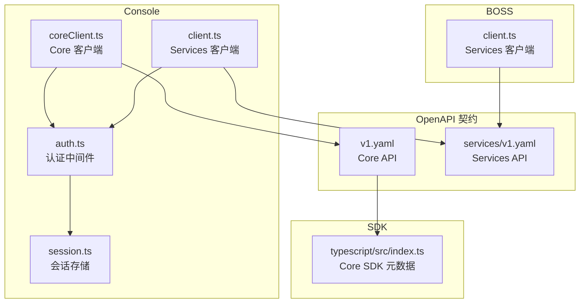
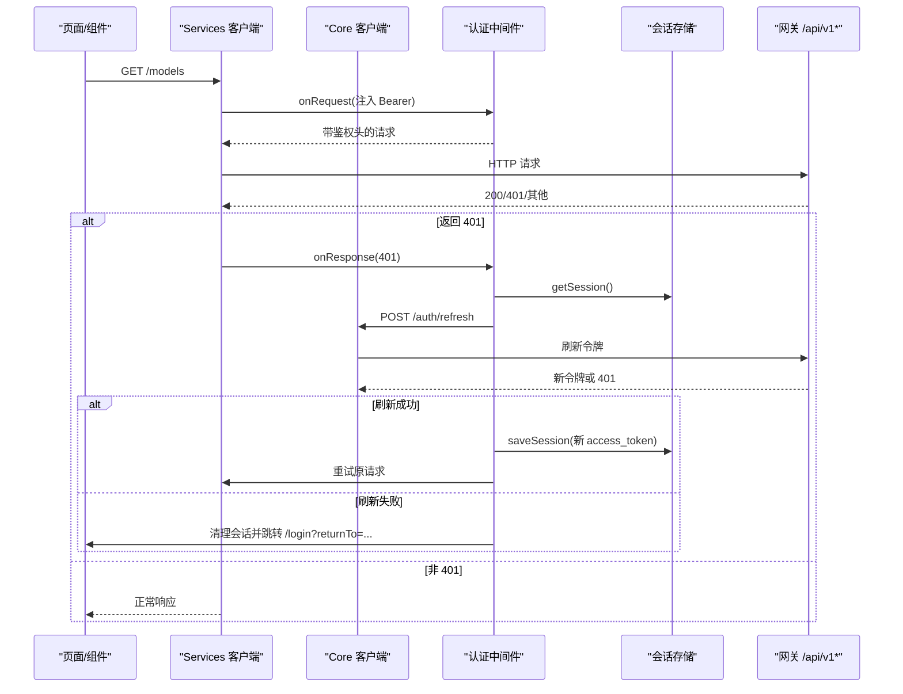
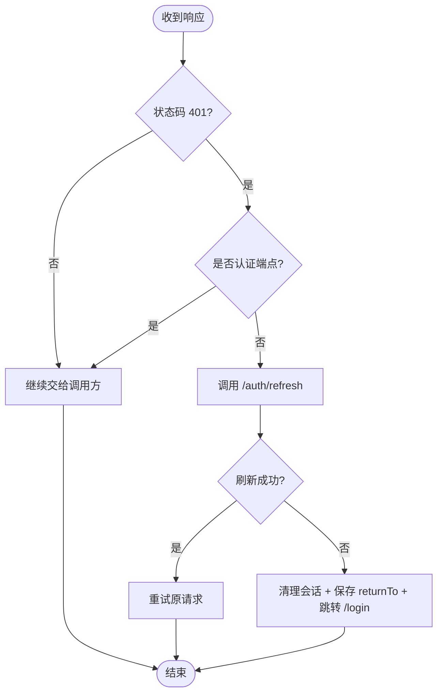
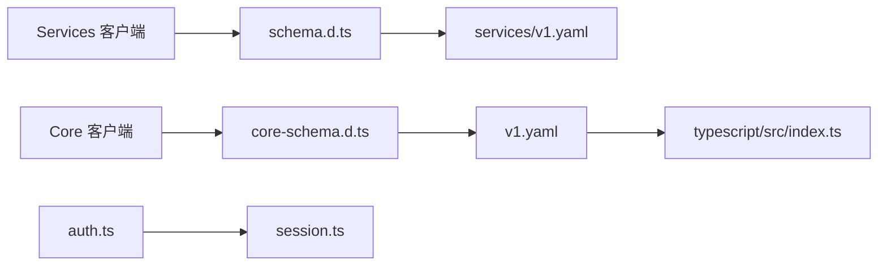

# API 集成层

<cite>
**本文引用的文件**
- [console/src/api/client.ts](file://repo/frontends/console/src/api/client.ts)
- [console/src/api/coreClient.ts](file://repo/frontends/console/src/api/coreClient.ts)
- [console/src/api/auth.ts](file://repo/frontends/console/src/api/auth.ts)
- [console/src/auth/session.ts](file://repo/frontends/console/src/auth/session.ts)
- [api/openapi/v1.yaml](file://repo/api/openapi/v1.yaml)
- [api/openapi/services/v1.yaml](file://repo/api/openapi/services/v1.yaml)
- [sdks/core/typescript/src/index.ts](file://repo/sdks/core/typescript/src/index.ts)
- [boss/src/api/client.ts](file://repo/frontends/boss/src/api/client.ts)
</cite>

## 目录
1. [简介](#简介)
2. [项目结构](#项目结构)
3. [核心组件](#核心组件)
4. [架构总览](#架构总览)
5. [详细组件分析](#详细组件分析)
6. [依赖关系分析](#依赖关系分析)
7. [性能与可靠性](#性能与可靠性)
8. [故障排查指南](#故障排查指南)
9. [结论](#结论)
10. [附录](#附录)

## 简介
本文件面向前端工程中的 API 集成层，聚焦以下目标：
- HTTP 客户端封装设计与请求拦截器实现
- 认证流程、Token 管理与会话处理机制
- TypeScript 类型定义与 API 响应数据结构
- 错误处理策略、重试机制与超时配置
- API 版本管理与向后兼容性方案

该集成层基于 openapi-fetch 生成类型安全的客户端，并通过中间件统一注入认证、刷新与 401 处理；同时通过 OpenAPI 契约驱动 SDK 与类型定义，确保前后端一致性与可演进性。

## 项目结构
前端 Console/BOSS 工程分别维护独立的 API 客户端实例，均指向同一网关路径前缀：
- Core API（基础设施）：/api/v1
- Services API（业务）：/api/v1/svc

图表来源
- [console/src/api/client.ts:1-25](file://repo/frontends/console/src/api/client.ts#L1-L25)
- [console/src/api/coreClient.ts:1-25](file://repo/frontends/console/src/api/coreClient.ts#L1-L25)
- [console/src/api/auth.ts:1-198](file://repo/frontends/console/src/api/auth.ts#L1-L198)
- [console/src/auth/session.ts:1-251](file://repo/frontends/console/src/auth/session.ts#L1-L251)
- [api/openapi/v1.yaml:1-200](file://repo/api/openapi/v1.yaml#L1-L200)
- [api/openapi/services/v1.yaml:1-200](file://repo/api/openapi/services/v1.yaml#L1-L200)
- [sdks/core/typescript/src/index.ts:1-800](file://repo/sdks/core/typescript/src/index.ts#L1-L800)
- [boss/src/api/client.ts:1-18](file://repo/frontends/boss/src/api/client.ts#L1-L18)

章节来源
- [console/src/api/client.ts:1-25](file://repo/frontends/console/src/api/client.ts#L1-L25)
- [console/src/api/coreClient.ts:1-25](file://repo/frontends/console/src/api/coreClient.ts#L1-L25)
- [boss/src/api/client.ts:1-18](file://repo/frontends/boss/src/api/client.ts#L1-L18)

## 核心组件
- HTTP 客户端封装
  - Services 客户端：baseUrl=/api/v1/svc，Content-Type=application/json
  - Core 客户端：baseUrl=/api/v1，Content-Type=application/json
  - 两者均由 openapi-fetch 创建，并导入由 OpenAPI 生成的 paths 类型，保证调用点强类型约束
- 认证中间件
  - 请求拦截：自动注入 Authorization: Bearer <token>
  - 响应拦截：对 401 进行统一处理，优先尝试 refresh；失败则清理会话并重定向登录页
  - 白名单：跳过 /auth/* 等认证相关端点的 401 拦截
- 会话管理
  - 支持“记住我”模式，使用 localStorage 或 sessionStorage 持久化 access_token、refresh_token、expires_at
  - 提供 hydrate、maybeRefresh、logout、safe returnTo 等能力
- 类型与数据结构
  - 通过 OpenAPI 生成 schema.d.ts 与 core-schema.d.ts，供客户端强类型调用
  - SDK 元数据暴露 operations、paths、schemas、idempotencyOperations、cursorPaginationOperations 等清单

章节来源
- [console/src/api/client.ts:1-25](file://repo/frontends/console/src/api/client.ts#L1-L25)
- [console/src/api/coreClient.ts:1-25](file://repo/frontends/console/src/api/coreClient.ts#L1-L25)
- [console/src/api/auth.ts:1-198](file://repo/frontends/console/src/api/auth.ts#L1-L198)
- [console/src/auth/session.ts:1-251](file://repo/frontends/console/src/auth/session.ts#L1-L251)
- [sdks/core/typescript/src/index.ts:1-800](file://repo/sdks/core/typescript/src/index.ts#L1-L800)

## 架构总览
下图展示了 Console 中两个客户端与认证中间件的协作关系，以及与服务端的交互路径。

图表来源
- [console/src/api/client.ts:1-25](file://repo/frontends/console/src/api/client.ts#L1-L25)
- [console/src/api/coreClient.ts:1-25](file://repo/frontends/console/src/api/coreClient.ts#L1-L25)
- [console/src/api/auth.ts:1-198](file://repo/frontends/console/src/api/auth.ts#L1-L198)
- [console/src/auth/session.ts:1-251](file://repo/frontends/console/src/auth/session.ts#L1-L251)
- [api/openapi/v1.yaml:1-200](file://repo/api/openapi/v1.yaml#L1-L200)

## 详细组件分析

### HTTP 客户端封装设计
- 双客户端分离职责
  - Services 客户端：面向业务资源（模型、知识库、推理服务等），base path 为 /api/v1/svc
  - Core 客户端：面向基础设施资源（实例、网络、存储、注册表、计量、任务等），base path 为 /api/v1
- 类型安全
  - 通过 openapi-typescript 从 OpenAPI 规范生成 paths 类型，客户端方法签名与参数/返回值受严格类型约束
  - SDK 元数据集中暴露操作名、路径、Schema、幂等操作集合与游标分页操作集合，便于上层工具链与校验
- 默认头与基础配置
  - 统一设置 Content-Type=application/json
  - 后续可通过扩展中间件增加重试、超时、日志等横切能力

章节来源
- [console/src/api/client.ts:1-25](file://repo/frontends/console/src/api/client.ts#L1-L25)
- [console/src/api/coreClient.ts:1-25](file://repo/frontends/console/src/api/coreClient.ts#L1-L25)
- [sdks/core/typescript/src/index.ts:1-800](file://repo/sdks/core/typescript/src/index.ts#L1-L800)

### 请求拦截器与认证流程
- 请求拦截
  - 在发起请求前注入 Authorization: Bearer <access_token>
  - 仅当存在有效 token 时注入
- 响应拦截与 401 处理
  - 捕获 401 后判断是否为认证相关端点（白名单），否则进入刷新流程
  - 刷新成功后让调用方重试；失败则清理会话并重定向到登录页，携带 returnTo
- Token 刷新
  - 调用 Core /auth/refresh，传入 refresh_token
  - 成功后更新本地会话与内存中的 bearerToken，并返回 true
- 登出
  - 可选地调用 /auth/logout 并附带 jti（从 JWT payload 解析）
  - 清理本地会话与中间件状态

图表来源
- [console/src/api/auth.ts:1-198](file://repo/frontends/console/src/api/auth.ts#L1-L198)
- [console/src/auth/session.ts:1-251](file://repo/frontends/console/src/auth/session.ts#L1-L251)

章节来源
- [console/src/api/auth.ts:1-198](file://repo/frontends/console/src/api/auth.ts#L1-L198)
- [console/src/auth/session.ts:1-251](file://repo/frontends/console/src/auth/session.ts#L1-L251)

### Token 管理与会话处理机制
- 存储介质与键空间
  - 使用 console:* 前缀隔离 BOSS 的 boss:* 键空间
  - 根据 remember_me 选择 localStorage（持久）或 sessionStorage（标签页生命周期）
- 关键键
  - access_token、refresh_token、expires_at、remember_me、oidc_state、return_to
- 过期与提前刷新
  - 计算 expires_at 并比较当前时间
  - 剩余有效期小于阈值（默认 5 分钟）时触发 maybeRefresh
- Hydrate
  - 应用启动时读取未过期的 access_token 并注入中间件，避免首次请求即 401
- ReturnTo 安全
  - 仅允许同源相对路径，防止开放重定向

章节来源
- [console/src/auth/session.ts:1-251](file://repo/frontends/console/src/auth/session.ts#L1-L251)
- [console/src/api/auth.ts:1-198](file://repo/frontends/console/src/api/auth.ts#L1-L198)

### TypeScript 类型定义与 API 响应数据结构
- 类型来源
  - Console 的 schema.d.ts 与 core-schema.d.ts 由 OpenAPI 生成，覆盖 Services 与 Core 的 paths、schemas
  - SDK 元数据集中列出 operations、paths、schemas、idempotencyOperations、cursorPaginationOperations
- 错误体结构
  - ErrorResponse 包含 code、message、request_id、details
- 分页
  - CursorPage 提供 next_cursor
- 异步任务
  - AsyncTask 描述任务 ID、幂等键、类型、状态、进度、结果、错误信息等

章节来源
- [api/openapi/services/v1.yaml:1-200](file://repo/api/openapi/services/v1.yaml#L1-L200)
- [api/openapi/v1.yaml:1-200](file://repo/api/openapi/v1.yaml#L1-L200)
- [sdks/core/typescript/src/index.ts:1-800](file://repo/sdks/core/typescript/src/index.ts#L1-L800)

### 错误处理策略、重试机制与超时配置
- 前端侧
  - 统一 401 处理：先尝试刷新，失败则清会话并跳转登录
  - 目前未在客户端内置通用重试与超时逻辑，建议通过扩展 openapi-fetch 中间件或包装函数实现
- 后端/网关侧（参考）
  - 网关具备限流、幂等重放、健康探针与降级语义
  - Adapter 层具备每调用超时、重试退避、断路器基础能力（适用于服务端适配器，非前端直接复用）
- 建议
  - 在前端封装统一的 retryWithBackoff、timeout 中间件，结合业务幂等键与用户提示
  - 将 429/5xx/网络错误纳入可重试范围，4xx 业务错误不重试

章节来源
- [console/src/api/auth.ts:1-198](file://repo/frontends/console/src/api/auth.ts#L1-L198)
- [api/openapi/services/v1.yaml:1-200](file://repo/api/openapi/services/v1.yaml#L1-L200)
- [api/openapi/v1.yaml:1-200](file://repo/api/openapi/v1.yaml#L1-L200)

### API 版本管理与向后兼容性
- 版本基线
  - Core API 与 Services API 均以 v1 为稳定基线，服务器地址以 /api/v1* 暴露
- 演进策略
  - 新增版本时新建独立 spec 文件（如 v2.yaml），保持旧路径稳定
  - 通过 SDK 元数据与类型生成保障多语言一致性
- 向后兼容
  - 字段级兼容：保留已弃用字段但标注 deprecated，引导客户端迁移
  - 行为兼容：错误码与响应结构保持稳定，新增字段采用可选扩展

章节来源
- [api/openapi/v1.yaml:1-200](file://repo/api/openapi/v1.yaml#L1-L200)
- [api/openapi/services/v1.yaml:1-200](file://repo/api/openapi/services/v1.yaml#L1-L200)
- [sdks/core/typescript/src/index.ts:1-800](file://repo/sdks/core/typescript/src/index.ts#L1-L800)

## 依赖关系分析
- Console 客户端依赖
  - openapi-fetch：HTTP 客户端与中间件扩展点
  - 生成的 schema.d.ts/core-schema.d.ts：强类型约束
  - auth.ts：认证中间件与刷新逻辑
  - session.ts：会话存取与过期判断
- 服务契约依赖
  - OpenAPI v1.yaml 与 services/v1.yaml：定义认证方式、错误格式、分页、异步任务等
- SDK 元数据
  - typescript/src/index.ts：暴露操作名、路径、Schema、幂等与分页操作集合

图表来源
- [console/src/api/client.ts:1-25](file://repo/frontends/console/src/api/client.ts#L1-L25)
- [console/src/api/coreClient.ts:1-25](file://repo/frontends/console/src/api/coreClient.ts#L1-L25)
- [console/src/api/auth.ts:1-198](file://repo/frontends/console/src/api/auth.ts#L1-L198)
- [console/src/auth/session.ts:1-251](file://repo/frontends/console/src/auth/session.ts#L1-L251)
- [api/openapi/services/v1.yaml:1-200](file://repo/api/openapi/services/v1.yaml#L1-L200)
- [api/openapi/v1.yaml:1-200](file://repo/api/openapi/v1.yaml#L1-L200)
- [sdks/core/typescript/src/index.ts:1-800](file://repo/sdks/core/typescript/src/index.ts#L1-L800)

章节来源
- [console/src/api/client.ts:1-25](file://repo/frontends/console/src/api/client.ts#L1-L25)
- [console/src/api/coreClient.ts:1-25](file://repo/frontends/console/src/api/coreClient.ts#L1-L25)
- [console/src/api/auth.ts:1-198](file://repo/frontends/console/src/api/auth.ts#L1-L198)
- [console/src/auth/session.ts:1-251](file://repo/frontends/console/src/auth/session.ts#L1-L251)
- [api/openapi/services/v1.yaml:1-200](file://repo/api/openapi/services/v1.yaml#L1-L200)
- [api/openapi/v1.yaml:1-200](file://repo/api/openapi/v1.yaml#L1-L200)
- [sdks/core/typescript/src/index.ts:1-800](file://repo/sdks/core/typescript/src/index.ts#L1-L800)

## 性能与可靠性
- 前端侧优化建议
  - 为高频读接口增加缓存（内存/浏览器缓存）与去抖/节流
  - 对写接口结合 idempotency_key 与重试，避免重复提交
  - 合理设置请求超时与重试次数，避免长时间阻塞
- 后端/网关侧能力（参考）
  - 限流、幂等重放、健康探针与降级已在网关与适配器层落地
  - 每调用超时、重试退避、断路器基础能力可用于服务端外部调用保护

[本节为通用指导，不直接分析具体文件]

## 故障排查指南
- 常见问题
  - 登录后仍 401：检查 setAuthToken 是否被调用、中间件是否已挂载、会话是否过期
  - 刷新失败：确认 refresh_token 有效、/auth/refresh 可达、网络与跨域配置正确
  - 重定向循环：检查 AUTH_ENDPOINTS 白名单与 handle401 逻辑，避免对认证端点误拦截
- 定位步骤
  - 查看控制台网络面板，确认请求是否携带 Authorization
  - 检查会话存储键是否存在且未过期
  - 核对 returnTo 是否安全（同源相对路径）
- 恢复措施
  - 清理会话并重新登录
  - 必要时清除浏览器缓存与 Cookie

章节来源
- [console/src/api/auth.ts:1-198](file://repo/frontends/console/src/api/auth.ts#L1-L198)
- [console/src/auth/session.ts:1-251](file://repo/frontends/console/src/auth/session.ts#L1-L251)

## 结论
本 API 集成层通过 openapi-fetch 与 OpenAPI 契约实现了类型安全、可维护的前端 HTTP 访问层；借助中间件统一处理认证、刷新与 401，配合会话模块完成 Token 生命周期管理。通过 SDK 元数据与版本化 OpenAPI 规范，保障了多语言一致性与向后兼容。建议在现有基础上补充前端侧的重试与超时中间件，进一步提升健壮性与用户体验。

## 附录
- 常用端点
  - Core：/api/v1（实例、网络、存储、注册表、计量、任务、认证等）
  - Services：/api/v1/svc（模型、知识库、推理服务等）
- 错误码与响应
  - ErrorResponse：code、message、request_id、details
  - 标准错误码：UNAUTHORIZED、FORBIDDEN、NOT_FOUND、CONFLICT、BAD_REQUEST、RATE_LIMIT_EXCEEDED、NOT_IMPLEMENTED、INTERNAL_ERROR
- 分页与异步
  - CursorPage：next_cursor
  - AsyncTask：任务状态机与进度信息

章节来源
- [api/openapi/v1.yaml:1-200](file://repo/api/openapi/v1.yaml#L1-L200)
- [api/openapi/services/v1.yaml:1-200](file://repo/api/openapi/services/v1.yaml#L1-L200)