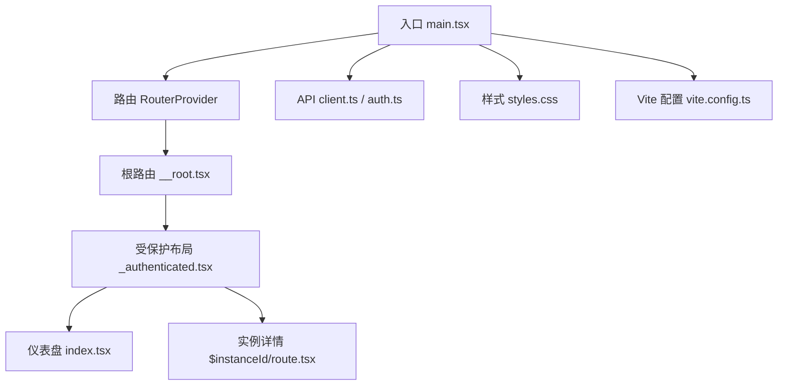
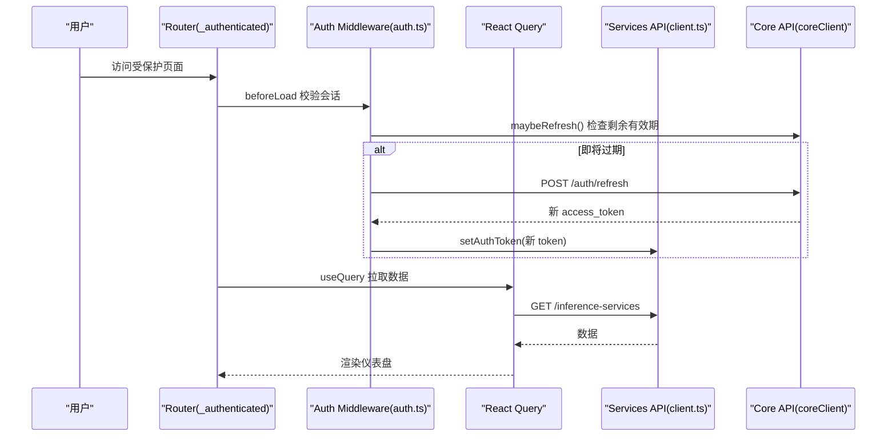
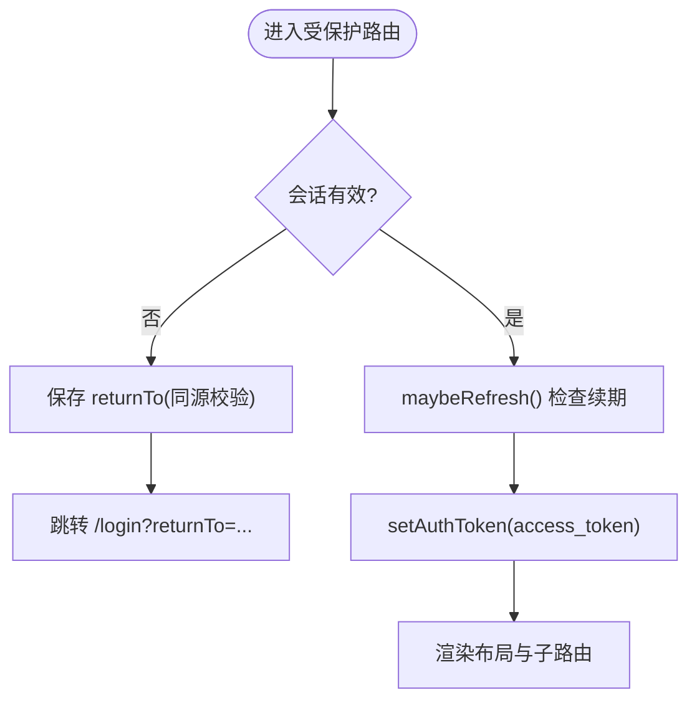
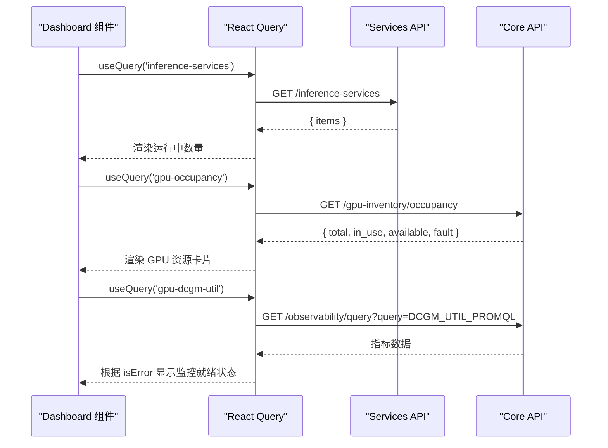
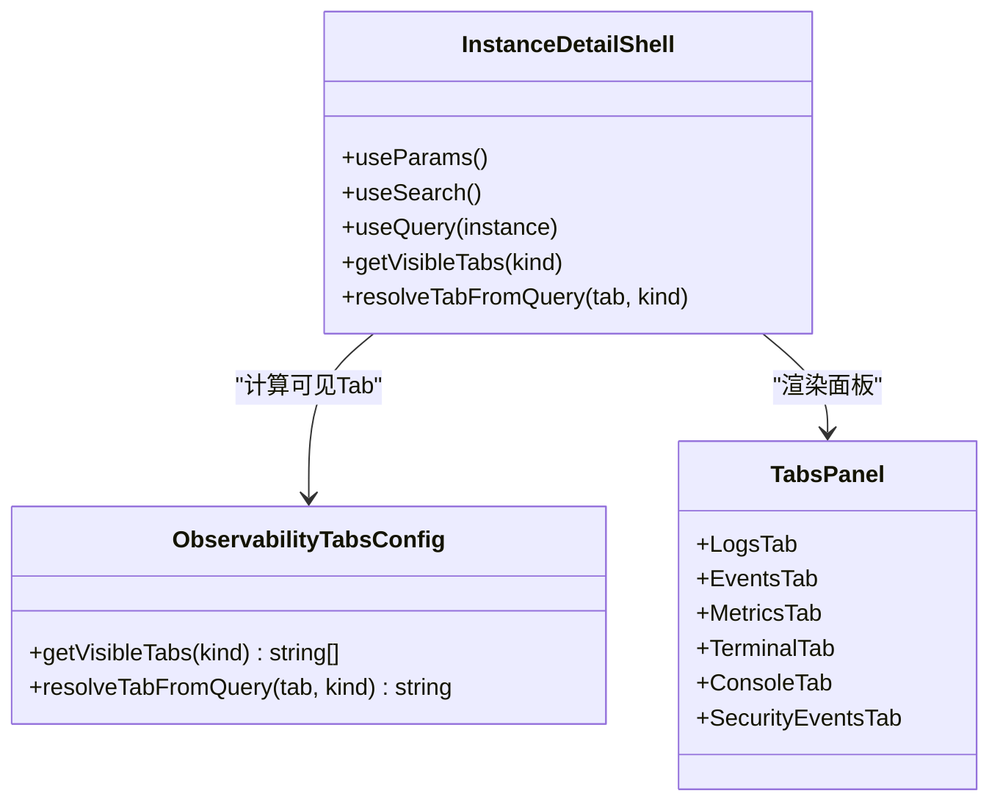
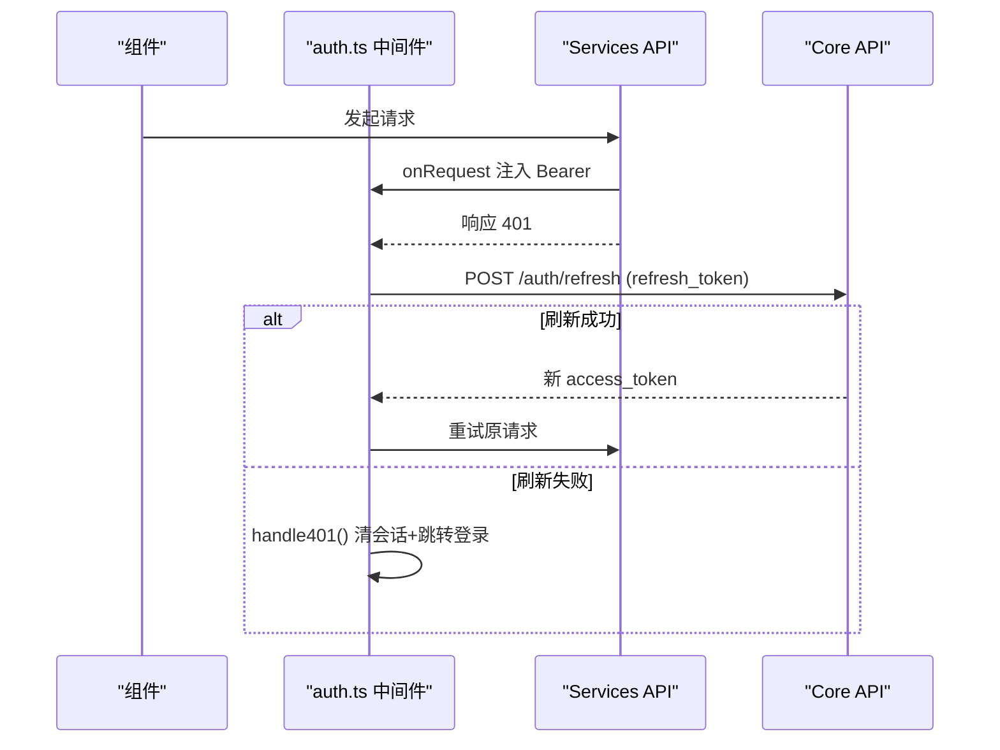
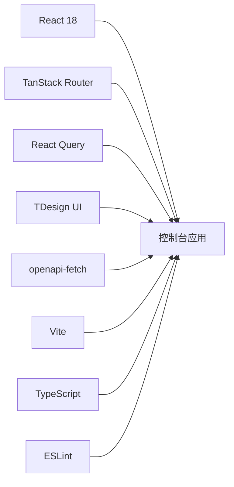

# 前端控制台

<cite>
**本文引用的文件**
- [package.json](file://repo/frontends/console/package.json)
- [vite.config.ts](file://repo/frontends/console/vite.config.ts)
- [main.tsx](file://repo/frontends/console/src/main.tsx)
- [App.tsx](file://repo/frontends/console/src/App.tsx)
- [styles.css](file://repo/frontends/console/src/styles.css)
- [__root.tsx](file://repo/frontends/console/src/routes/__root.tsx)
- [_authenticated.tsx](file://repo/frontends/console/src/routes/_authenticated.tsx)
- [index.tsx](file://repo/frontends/console/src/routes/_authenticated/index.tsx)
- [$instanceId/route.tsx](file://repo/frontends/console/src/routes/_authenticated/compute/instances/$instanceId/route.tsx)
- [client.ts](file://repo/frontends/console/src/api/client.ts)
- [auth.ts](file://repo/frontends/console/src/api/auth.ts)
</cite>

## 目录
1. [简介](#简介)
2. [项目结构](#项目结构)
3. [核心组件](#核心组件)
4. [架构总览](#架构总览)
5. [详细组件分析](#详细组件分析)
6. [依赖关系分析](#依赖关系分析)
7. [性能考虑](#性能考虑)
8. [故障排查指南](#故障排查指南)
9. [结论](#结论)
10. [附录](#附录)

## 简介
本文件面向基于 React 18 与 TDesign UI 的前端控制台，目标是提供一份从架构到实现、从路由到状态管理、从 API 集成到页面功能、从样式主题到国际化与调试优化的完整技术文档。控制台采用 TanStack Router 进行文件级路由，使用 @tanstack/react-query 管理数据请求与缓存，通过 openapi-fetch 生成类型安全的客户端调用 Services 与 Core API；认证与会话由本地中间件统一处理，支持自动续期与 401 统一跳转登录。页面以受保护布局承载 Header/Aside/Content 的壳层，仪表盘、实例详情等页面已具备真实数据拉取能力，其余模块以 Demo Mock 形式组织，便于后续接入生产接口。

## 项目结构
控制台位于 repo/frontends/console，采用 Vite + React + TypeScript 构建，关键目录与职责如下：
- src/main.tsx：应用入口，初始化 QueryClient、RouterProvider，挂载全局消息提示，注入初始 token。
- vite.config.ts：Vite 配置，启用 TanStack Router 插件、路径别名、开发代理（/api → 后端）。
- src/routes：按文件约定生成路由树，包含根路由、受保护布局及业务路由。
- src/api：API 客户端封装与认证中间件，基于 openapi-fetch 生成类型定义。
- src/demo：演示用页面（实例工作台、Demo 控制台），用于快速验证交互与布局。
- src/styles.css：全局样式与登录卡片样式，使用 TDesign CSS 变量适配主题。

图表来源
- [main.tsx:1-43](file://repo/frontends/console/src/main.tsx#L1-L43)
- [__root.tsx:1-14](file://repo/frontends/console/src/routes/__root.tsx#L1-L14)
- [_authenticated.tsx:1-131](file://repo/frontends/console/src/routes/_authenticated.tsx#L1-L131)
- [index.tsx:1-101](file://repo/frontends/console/src/routes/_authenticated/index.tsx#L1-L101)
- [$instanceId/route.tsx:1-263](file://repo/frontends/console/src/routes/_authenticated/compute/instances/$instanceId/route.tsx#L1-L263)
- [client.ts:1-25](file://repo/frontends/console/src/api/client.ts#L1-L25)
- [auth.ts:1-198](file://repo/frontends/console/src/api/auth.ts#L1-L198)
- [vite.config.ts:1-28](file://repo/frontends/console/vite.config.ts#L1-L28)
- [styles.css:1-51](file://repo/frontends/console/src/styles.css#L1-L51)

章节来源
- [package.json:1-48](file://repo/frontends/console/package.json#L1-L48)
- [vite.config.ts:1-28](file://repo/frontends/console/vite.config.ts#L1-L28)
- [main.tsx:1-43](file://repo/frontends/console/src/main.tsx#L1-L43)

## 核心组件
- 应用壳层与导航
  - App.tsx 提供简易控制台壳层（Header/Aside/Main），用于演示视图切换与 Mock 数据展示。
  - 受保护布局 _authenticated.tsx 提供正式控制台壳层（TDesign Layout + Menu），并实现 beforeLoad 鉴权、Token 续期与退出登录。
- 路由与页面
  - 根路由 __root.tsx 仅渲染 Outlet，业务壳层下沉至受保护布局。
  - 仪表盘 index.tsx 聚合推理服务数量与 GPU 资源指标，使用 react-query 拉取数据。
  - 实例详情 $instanceId/route.tsx 提供观测 Tab 壳层（日志/事件/指标/终端/控制台/安全事件），并基于上下文与可见性规则渲染对应面板。
- API 与认证
  - client.ts 基于 openapi-fetch 创建类型安全的 Services API 客户端。
  - auth.ts 实现 Bearer 注入、401 统一处理、自动刷新、登出与 returnTo 流程。
- 构建与样式
  - vite.config.ts 配置路由插件、别名与开发代理。
  - styles.css 定义全局基础样式与登录卡片样式，使用 TDesign CSS 变量以便主题定制。

章节来源
- [App.tsx:1-239](file://repo/frontends/console/src/App.tsx#L1-L239)
- [_authenticated.tsx:1-131](file://repo/frontends/console/src/routes/_authenticated.tsx#L1-L131)
- [index.tsx:1-101](file://repo/frontends/console/src/routes/_authenticated/index.tsx#L1-L101)
- [$instanceId/route.tsx:1-263](file://repo/frontends/console/src/routes/_authenticated/compute/instances/$instanceId/route.tsx#L1-L263)
- [client.ts:1-25](file://repo/frontends/console/src/api/client.ts#L1-L25)
- [auth.ts:1-198](file://repo/frontends/console/src/api/auth.ts#L1-L198)
- [styles.css:1-51](file://repo/frontends/console/src/styles.css#L1-L51)

## 架构总览
控制台采用“路由壳层 + 数据查询 + 认证中间件”的分层设计：
- 路由层：TanStack Router 文件路由，根路由无壳，受保护路由统一鉴权与布局。
- 数据层：@tanstack/react-query 负责缓存、重试、错误态；openapi-fetch 生成类型化客户端。
- 认证层：中间件在请求前注入 Bearer，响应 401 时尝试刷新或跳转登录，支持定时检查与阈值续期。
- 表现层：TDesign 组件库提供 UI，CSS 变量支持主题定制。

图表来源
- [_authenticated.tsx:27-46](file://repo/frontends/console/src/routes/_authenticated.tsx#L27-L46)
- [auth.ts:109-153](file://repo/frontends/console/src/api/auth.ts#L109-L153)
- [index.tsx:19-29](file://repo/frontends/console/src/routes/_authenticated/index.tsx#L19-L29)
- [client.ts:17-22](file://repo/frontends/console/src/api/client.ts#L17-L22)

## 详细组件分析

### 路由与受保护布局
- 根路由仅渲染 Outlet，将壳层下移至受保护布局，使公开路由（登录、回调）不受壳层影响。
- 受保护布局 beforeLoad：
  - 读取会话，若无效则保存 returnTo（同源相对路径）并跳转 /login。
  - 每次路由切换前检查 Token 临近过期，触发自动续期。
  - 设置当前 Bearer Token 到中间件，确保后续请求携带认证头。
- 布局内包含 Header（品牌名、退出登录）、Aside（菜单）、Content（Outlet 内容区）。

图表来源
- [_authenticated.tsx:27-46](file://repo/frontends/console/src/routes/_authenticated.tsx#L27-L46)
- [auth.ts:109-153](file://repo/frontends/console/src/api/auth.ts#L109-L153)

章节来源
- [__root.tsx:1-14](file://repo/frontends/console/src/routes/__root.tsx#L1-L14)
- [_authenticated.tsx:1-131](file://repo/frontends/console/src/routes/_authenticated.tsx#L1-L131)

### 仪表盘（运营总览）
- 使用 react-query 拉取推理服务列表，统计运行中服务数量。
- 拉取 GPU 占用统计与 DCGM 利用率指标，结合 Tag 显示监控就绪状态。
- 点击 GPU 资源卡片可跳转到算力管理页。

图表来源
- [index.tsx:19-38](file://repo/frontends/console/src/routes/_authenticated/index.tsx#L19-L38)

章节来源
- [index.tsx:1-101](file://repo/frontends/console/src/routes/_authenticated/index.tsx#L1-101)

### 实例详情页（观测 Tab 壳层）
- 解析 URL 参数 ?tab=，校验允许值并同步到搜索参数，支持深链分享。
- 拉取实例详情，若实例已删除则直接展示 Empty 提示，不渲染 Tab。
- 根据实例 kind 计算可见 Tab 集合，渲染对应面板（日志/事件/指标/终端/控制台/安全事件）。
- 头部展示名称、ID（可复制）、状态与 Kind 标签，面包屑导航清晰。

图表来源
- [$instanceId/route.tsx:58-143](file://repo/frontends/console/src/routes/_authenticated/compute/instances/$instanceId/route.tsx#L58-L143)

章节来源
- [$instanceId/route.tsx:1-263](file://repo/frontends/console/src/routes/_authenticated/compute/instances/$instanceId/route.tsx#L1-L263)

### API 集成与认证中间件
- Services API 客户端：基于 openapi-fetch 生成类型化客户端，baseUrl 为 /api/v1/svc，统一 Content-Type。
- Core API 客户端：用于鉴权、GPU 清单、可观测性等核心能力。
- 认证中间件：
  - 请求前注入 Authorization: Bearer <token>。
  - 响应 401 时，排除鉴权端点，先尝试 refresh，失败则清理会话并跳转登录。
  - 支持定时检查与阈值续期（剩余 < 5 分钟触发）。
  - 登出时调用 /auth/logout 并清理本地会话与中间件状态。

图表来源
- [auth.ts:38-74](file://repo/frontends/console/src/api/auth.ts#L38-L74)
- [auth.ts:109-153](file://repo/frontends/console/src/api/auth.ts#L109-L153)
- [client.ts:17-22](file://repo/frontends/console/src/api/client.ts#L17-L22)

章节来源
- [client.ts:1-25](file://repo/frontends/console/src/api/client.ts#L1-L25)
- [auth.ts:1-198](file://repo/frontends/console/src/api/auth.ts#L1-L198)

### 样式定制与主题配置
- 全局样式使用 TDesign CSS 变量（如 --td-brand-color、--td-text-color-primary），便于主题切换与一致性。
- 登录卡片样式遵循 Plain 风格，全屏居中、简洁无游戏化背景。
- 可通过覆盖 CSS 变量或扩展样式类实现品牌定制。

章节来源
- [styles.css:1-51](file://repo/frontends/console/src/styles.css#L1-L51)

### 国际化支持说明
- 当前代码未引入 i18n 库，文案集中在组件与路由标题中。
- 建议后续引入 i18n 方案（如 i18next），将文案抽离为键值对，并在路由标题、按钮、提示信息等处替换为动态文案。
- 可在受保护布局与页面组件中按需加载语言包，保持首屏体积最小化。

[本节为概念性说明，不直接分析具体文件]

## 依赖关系分析
- 运行时依赖
  - React 18、ReactDOM 18：UI 框架与渲染。
  - @tanstack/react-router：文件级路由与上下文。
  - @tanstack/react-query：数据获取、缓存与重试。
  - tdesign-react、tdesign-icons-react：UI 组件与图标。
  - openapi-fetch：类型安全的 API 客户端。
  - echarts、echarts-for-react：图表可视化（预留）。
  - @xterm/xterm：终端能力（预留）。
- 构建与工具
  - Vite：开发与构建。
  - TypeScript：类型检查。
  - ESLint：代码规范。
  - openapi-typescript：从 OpenAPI Spec 生成类型定义。

图表来源
- [package.json:13-45](file://repo/frontends/console/package.json#L13-L45)

章节来源
- [package.json:1-48](file://repo/frontends/console/package.json#L1-L48)

## 性能考虑
- 数据请求与缓存
  - 使用 react-query 的 queryKey 区分不同数据源，避免重复请求。
  - 合理设置 retry、staleTime、gcTime，减少网络压力与重渲染。
- 路由与懒加载
  - 利用 TanStack Router 的文件路由与代码分割，按需加载页面组件。
- 认证中间件优化
  - maybeRefresh 仅在剩余有效期低于阈值时触发，避免频繁刷新。
  - 401 处理集中化，减少组件内重复逻辑。
- 样式与主题
  - 使用 CSS 变量与 TDesign 主题，减少自定义样式复杂度。
  - 避免过度嵌套与复杂选择器，提升渲染性能。

[本节提供通用指导，不直接分析具体文件]

## 故障排查指南
- 401 未跳转登录
  - 检查 AUTH_ENDPOINTS 是否包含当前端点，避免误拦截。
  - 确认 maybeRefresh 是否正确调用，查看返回状态码与错误信息。
- 路由无法进入受保护页面
  - 检查 beforeLoad 中的会话有效性判断与 returnTo 保存逻辑。
  - 确认 setAuthToken 是否在登录后正确调用。
- 仪表盘数据为空或报错
  - 检查 Services API 与 Core API 的 baseUrl 与代理配置。
  - 查看 react-query 的错误态与 isLoading 状态，定位数据来源。
- 实例详情 Tab 不可见
  - 检查 getVisibleTabs 与 resolveTabFromQuery 的逻辑，确认 tab 值合法且与 kind 匹配。
  - 查看 URL 搜索参数 ?tab= 是否被正确解析与同步。

章节来源
- [auth.ts:28-74](file://repo/frontends/console/src/api/auth.ts#L28-L74)
- [_authenticated.tsx:27-46](file://repo/frontends/console/src/routes/_authenticated.tsx#L27-L46)
- [index.tsx:19-38](file://repo/frontends/console/src/routes/_authenticated/index.tsx#L19-L38)
- [$instanceId/route.tsx:58-143](file://repo/frontends/console/src/routes/_authenticated/compute/instances/$instanceId/route.tsx#L58-L143)

## 结论
控制台以 React 18 + TDesign 为基础，结合 TanStack Router 与 react-query 构建了清晰的路由与数据层，并通过 openapi-fetch 实现了类型安全的 API 调用。认证中间件统一处理 Bearer 注入、401 流程与自动续期，提升了安全性与用户体验。仪表盘与实例详情已具备真实数据能力，其余模块以 Demo 形式组织，便于逐步接入生产接口。样式与主题通过 CSS 变量与 TDesign 体系实现，具备良好的可扩展性。后续可引入 i18n、更完善的错误边界与性能监控，进一步提升可维护性与稳定性。

## 附录
- 开发脚本
  - dev：启动开发服务器。
  - build：构建生产包。
  - preview：预览构建产物。
  - type-check：类型检查。
  - lint：ESLint 检查。
  - gen-api：从 OpenAPI Spec 生成类型定义。
- 开发代理
  - 开发环境将 /api 请求代理至 http://localhost:8080，便于联调后端服务。

章节来源
- [package.json:5-12](file://repo/frontends/console/package.json#L5-L12)
- [vite.config.ts:19-26](file://repo/frontends/console/vite.config.ts#L19-L26)