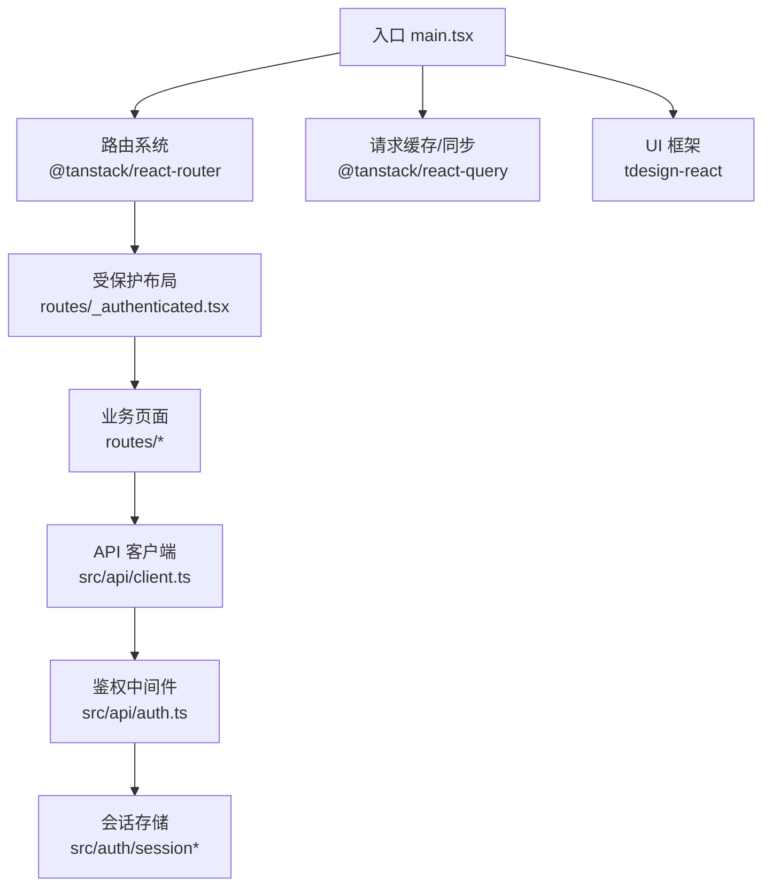
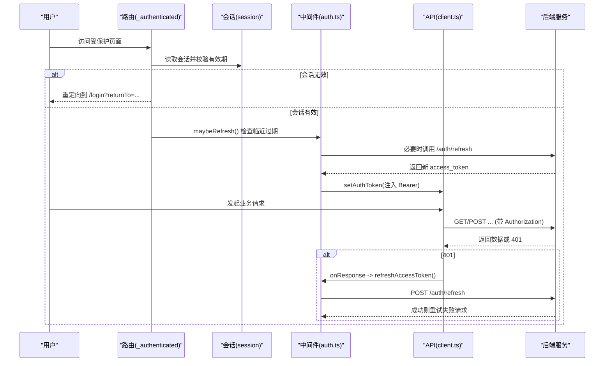
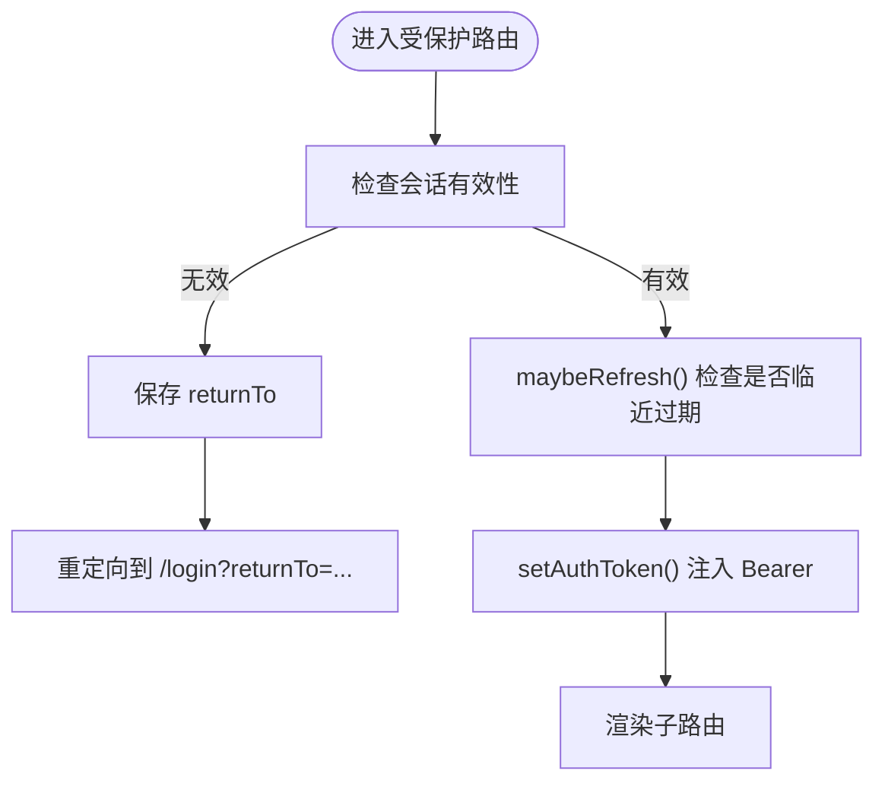
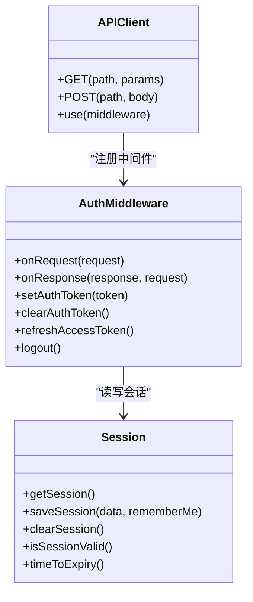
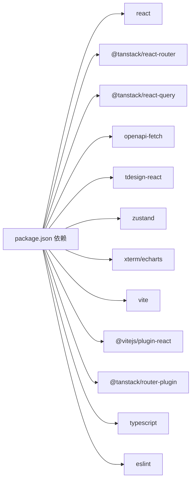

# 前端架构设计

<cite>
**本文引用的文件**
- [package.json](file://repo/frontends/console/package.json)
- [vite.config.ts](file://repo/frontends/console/vite.config.ts)
- [tsconfig.json](file://repo/frontends/console/tsconfig.json)
- [main.tsx](file://repo/frontends/console/src/main.tsx)
- [App.tsx](file://repo/frontends/console/src/App.tsx)
- [__root.tsx](file://repo/frontends/console/src/routes/__root.tsx)
- [_authenticated.tsx](file://repo/frontends/console/src/routes/_authenticated.tsx)
- [routeTree.gen.ts](file://repo/frontends/console/src/routeTree.gen.ts)
- [client.ts](file://repo/frontends/console/src/api/client.ts)
- [auth.ts](file://repo/frontends/console/src/api/auth.ts)
</cite>

## 目录
1. [简介](#简介)
2. [项目结构](#项目结构)
3. [核心组件](#核心组件)
4. [架构总览](#架构总览)
5. [详细组件分析](#详细组件分析)
6. [依赖关系分析](#依赖关系分析)
7. [性能与构建优化](#性能与构建优化)
8. [开发环境搭建与调试](#开发环境搭建与调试)
9. [故障排查指南](#故障排查指南)
10. [结论](#结论)

## 简介
本文件面向 ANI 平台的前端控制台，基于 React 18、TypeScript、TDesign UI、TanStack Router、TanStack Query 与 openapi-fetch 构建。文档聚焦以下目标：
- 技术栈选择与理由
- 应用整体架构模式（路由、状态管理、API 客户端、组件组织）
- Vite 构建配置与优化策略
- 开发环境搭建与调试技巧
- 项目结构与代码组织规范

## 项目结构
控制台位于 repo/frontends/console，采用“按功能域 + 分层”的组织方式：
- src/routes：基于 TanStack Router 的文件路由，受保护布局 _authenticated 包裹业务页面，公开路由 login、auth/callback 在根下
- src/api：类型安全的 API 客户端封装，统一鉴权中间件与 token 刷新
- src/auth：会话持久化、returnTo 安全处理、过期时间计算
- src/demo：演示用页面与 Mock 数据，便于联调前快速验证 UI
- 根级入口 main.tsx 负责初始化 QueryClient、RouterProvider、全局消息提示与认证注入
- App.tsx 提供 Demo 视图壳层（非生产路由），用于本地预览

图表来源
- [main.tsx:1-43](file://repo/frontends/console/src/main.tsx#L1-L43)
- [_authenticated.tsx:1-131](file://repo/frontends/console/src/routes/_authenticated.tsx#L1-L131)
- [client.ts:1-25](file://repo/frontends/console/src/api/client.ts#L1-L25)
- [auth.ts:1-198](file://repo/frontends/console/src/api/auth.ts#L1-L198)

章节来源
- [package.json:1-48](file://repo/frontends/console/package.json#L1-L48)
- [vite.config.ts:1-28](file://repo/frontends/console/vite.config.ts#L1-L28)
- [tsconfig.json:1-26](file://repo/frontends/console/tsconfig.json#L1-L26)
- [main.tsx:1-43](file://repo/frontends/console/src/main.tsx#L1-L43)
- [App.tsx:1-239](file://repo/frontends/console/src/App.tsx#L1-L239)

## 核心组件
- 路由与布局
  - 根路由仅渲染 Outlet，业务壳层下沉到受保护布局，避免对公开路由产生额外开销
  - 受保护布局在 beforeLoad 中校验会话、保存 returnTo、必要时重定向至登录页；并在切换时尝试自动续期
- 状态管理
  - 服务端状态：使用 @tanstack/react-query 进行数据获取、缓存与重试
  - 客户端状态：使用 zustand 管理轻量 UI 状态（如当前视图、选中项等）
- API 客户端
  - 基于 openapi-fetch 生成类型安全的客户端，baseUrl 指向 /api/v1/svc
  - 统一鉴权中间件：注入 Authorization 头、401 统一处理、Token 自动刷新、登出清理
- UI 与主题
  - TDesign React 作为基础组件库，配合图标库 tdicons-react
  - 全局消息提示 MessagePlugin 在启动时完成配置

章节来源
- [__root.tsx:1-14](file://repo/frontends/console/src/routes/__root.tsx#L1-L14)
- [_authenticated.tsx:1-131](file://repo/frontends/console/src/routes/_authenticated.tsx#L1-L131)
- [client.ts:1-25](file://repo/frontends/console/src/api/client.ts#L1-L25)
- [auth.ts:1-198](file://repo/frontends/console/src/api/auth.ts#L1-L198)
- [main.tsx:1-43](file://repo/frontends/console/src/main.tsx#L1-L43)
- [package.json:13-26](file://repo/frontends/console/package.json#L13-L26)

## 架构总览
控制台采用“文件路由 + 受保护布局 + 类型安全 API + 查询缓存”的现代化前端架构：
- 路由：TanStack Router 通过 routes 目录自动生成 routeTree，支持嵌套路由与参数路由
- 鉴权：受保护布局拦截未登录或过期访问，保存 returnTo 并跳转登录；登录后恢复原路径
- 数据：React Query 负责列表/详情缓存、并发控制与错误重试；Zustand 管理局部 UI 状态
- API：openapi-fetch 客户端由 OpenAPI 规范生成类型定义，保证前后端契约一致
- 构建：Vite + React 插件，开发代理转发 /api 到后端服务

图表来源
- [_authenticated.tsx:27-46](file://repo/frontends/console/src/routes/_authenticated.tsx#L27-L46)
- [auth.ts:38-74](file://repo/frontends/console/src/api/auth.ts#L38-L74)
- [auth.ts:109-153](file://repo/frontends/console/src/api/auth.ts#L109-L153)
- [client.ts:17-22](file://repo/frontends/console/src/api/client.ts#L17-L22)

## 详细组件分析

### 路由与布局
- 根路由 __root.tsx 仅渲染 Outlet，保持最小化挂载成本
- 受保护布局 _authenticated.tsx：
  - beforeLoad 门禁：无会话或已过期 → 保存 returnTo → 重定向 /login
  - 路由切换时定时触发 maybeRefresh，避免频繁刷新
  - 提供 Header/Aside/Content 布局与菜单导航
- 路由树由 TanStack Router 自动生成，包含登录、回调及多个业务模块（模型、知识库、用量、算力与 GPU、设置等）

图表来源
- [_authenticated.tsx:27-46](file://repo/frontends/console/src/routes/_authenticated.tsx#L27-L46)
- [_authenticated.tsx:48-58](file://repo/frontends/console/src/routes/_authenticated.tsx#L48-L58)

章节来源
- [__root.tsx:1-14](file://repo/frontends/console/src/routes/__root.tsx#L1-L14)
- [_authenticated.tsx:1-131](file://repo/frontends/console/src/routes/_authenticated.tsx#L1-L131)
- [routeTree.gen.ts:1-438](file://repo/frontends/console/src/routeTree.gen.ts#L1-L438)

### API 客户端与鉴权中间件
- client.ts：基于 openapi-fetch 创建类型安全客户端，baseUrl 为 /api/v1/svc，统一 Content-Type
- auth.ts：
  - setAuthToken/clearAuthToken：注入或清除 Bearer Token
  - onRequest：为每个请求附加 Authorization
  - onResponse：捕获 401，排除认证相关端点，尝试 refresh；失败则清会话并重定向登录
  - refreshAccessToken：调用 Core /auth/refresh，更新本地会话并注入新 token
  - logout：调用 /auth/logout（携带 jti），清理本地状态
  - getPendingReturnTo/consumePendingReturnTo：安全地读取并消费 returnTo

图表来源
- [client.ts:1-25](file://repo/frontends/console/src/api/client.ts#L1-L25)
- [auth.ts:1-198](file://repo/frontends/console/src/api/auth.ts#L1-L198)

章节来源
- [client.ts:1-25](file://repo/frontends/console/src/api/client.ts#L1-L25)
- [auth.ts:1-198](file://repo/frontends/console/src/api/auth.ts#L1-L198)

### 状态管理策略
- 服务端状态：@tanstack/react-query
  - 在 main.tsx 中创建 QueryClient 并通过 RouterProvider context 注入
  - 适合列表/详情缓存、并发去重、错误重试与增量更新
- 客户端状态：zustand
  - 适用于局部 UI 状态（如当前视图、选中行、弹窗开关等）
  - 与 React Query 解耦，避免过度集中式状态

章节来源
- [main.tsx:12-28](file://repo/frontends/console/src/main.tsx#L12-L28)
- [package.json:13-26](file://repo/frontends/console/package.json#L13-L26)

### 组件组织与 UI 规范
- 页面级组件按路由拆分，受保护布局统一 Header/Aside/Content
- 通用 UI 使用 TDesign 组件，图标使用 tdesign-icons-react
- 全局消息提示 MessagePlugin 在启动时完成配置
- 演示页面 App.tsx 提供 Mock 数据与操作反馈，便于联调前验证交互

章节来源
- [_authenticated.tsx:66-131](file://repo/frontends/console/src/routes/_authenticated.tsx#L66-L131)
- [main.tsx:20-22](file://repo/frontends/console/src/main.tsx#L20-L22)
- [App.tsx:35-90](file://repo/frontends/console/src/App.tsx#L35-L90)

## 依赖关系分析
- 运行时依赖
  - react/react-dom：UI 框架
  - @tanstack/react-router：文件路由与类型安全导航
  - @tanstack/react-query：数据请求与缓存
  - openapi-fetch：类型安全 HTTP 客户端
  - tdesign-react/tdesign-icons-react：UI 组件与图标
  - zustand：轻量客户端状态
  - xterm/echarts：终端与可视化（按需引入）
- 构建与工具
  - vite：开发与构建
  - @vitejs/plugin-react：React JSX 支持
  - @tanstack/router-plugin：路由代码生成
  - typescript/eslint：类型检查与代码规范

图表来源
- [package.json:13-46](file://repo/frontends/console/package.json#L13-L46)

章节来源
- [package.json:13-46](file://repo/frontends/console/package.json#L13-L46)

## 性能与构建优化
- 路由与代码分割
  - 使用 TanStack Router 文件路由，天然支持按路由懒加载与预取
- 构建与开发
  - Vite 开发服务器 host 绑定本机，端口 5173，/api 代理到后端 8080
  - 别名 @ 指向 src，简化导入路径
- 类型安全与一致性
  - 通过 openapi-typescript 从 OpenAPI 规范生成 schema.d.ts，确保 API 类型与后端一致
  - TypeScript 严格模式开启，减少运行时错误
- 资源与样式
  - 按需引入 TDesign 样式与组件，避免全量打包
  - 使用 CSS 变量与主题色，便于后续扩展多主题

章节来源
- [vite.config.ts:1-28](file://repo/frontends/console/vite.config.ts#L1-L28)
- [tsconfig.json:1-26](file://repo/frontends/console/tsconfig.json#L1-L26)
- [package.json:5-12](file://repo/frontends/console/package.json#L5-L12)

## 开发环境搭建与调试
- 前置条件
  - Node.js 与包管理器（npm/yarn/pnpm）
  - 后端服务运行在 localhost:8080（或根据 vite.config.ts 修改代理）
- 安装与启动
  - 进入 frontends/console 目录
  - 安装依赖：npm install
  - 生成 API 类型：npm run gen-api
  - 启动开发服务器：npm run dev
  - 预览构建产物：npm run preview
- 类型检查与代码规范
  - 类型检查：npm run type-check
  - 代码检查：npm run lint
- 调试技巧
  - 浏览器 Network 面板查看 /api 请求与响应
  - 使用 React DevTools 检查组件状态与 Query Cache
  - 在受保护路由 beforeLoad 与 API 中间件中增加日志，定位 401/刷新流程
  - 若出现跨域问题，确认 vite.config.ts 的 proxy 配置与后端 CORS

章节来源
- [package.json:5-12](file://repo/frontends/console/package.json#L5-L12)
- [vite.config.ts:19-26](file://repo/frontends/console/vite.config.ts#L19-L26)
- [main.tsx:12-28](file://repo/frontends/console/src/main.tsx#L12-L28)

## 故障排查指南
- 401 未跳转登录
  - 检查 auth.ts 的 AUTH_ENDPOINTS 是否误包含业务接口
  - 确认 response401Middleware 是否正确附加到 api 与 coreApi
- Token 不刷新
  - 检查 maybeRefresh 阈值与 refreshAccessToken 调用链路
  - 确认 /auth/refresh 返回格式与会话保存逻辑
- 路由守卫失效
  - 确认业务路由均挂载在 _authenticated 下
  - 检查 beforeLoad 中的会话校验与 redirect 逻辑
- 代理失败
  - 核对 vite.config.ts server.proxy 的目标地址
  - 确认后端服务可访问且端口正确

章节来源
- [auth.ts:28-74](file://repo/frontends/console/src/api/auth.ts#L28-L74)
- [auth.ts:93-107](file://repo/frontends/console/src/api/auth.ts#L93-L107)
- [auth.ts:118-153](file://repo/frontends/console/src/api/auth.ts#L118-L153)
- [_authenticated.tsx:27-46](file://repo/frontends/console/src/routes/_authenticated.tsx#L27-L46)
- [vite.config.ts:19-26](file://repo/frontends/console/vite.config.ts#L19-L26)

## 结论
该前端控制台以现代、类型安全与高内聚低耦合为目标：
- 路由与鉴权清晰分离，受保护布局统一处理权限与续期
- API 客户端基于 OpenAPI 生成类型，结合 React Query 实现高效数据流
- Vite 构建配置简洁可扩展，开发体验友好
- 组件组织遵循文件路由与布局约定，便于团队协作与维护

建议后续优化方向：
- 逐步将演示页面迁移至真实路由与数据源
- 完善错误边界与全局异常处理
- 引入单元测试与端到端测试，提升质量保障
- 持续对齐 OpenAPI 变更，保持前后端契约一致