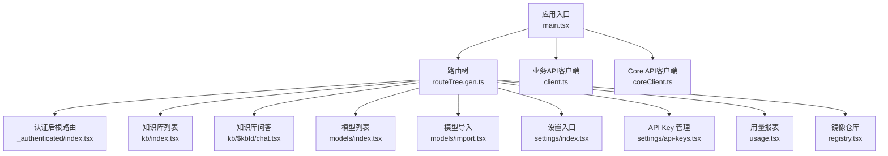
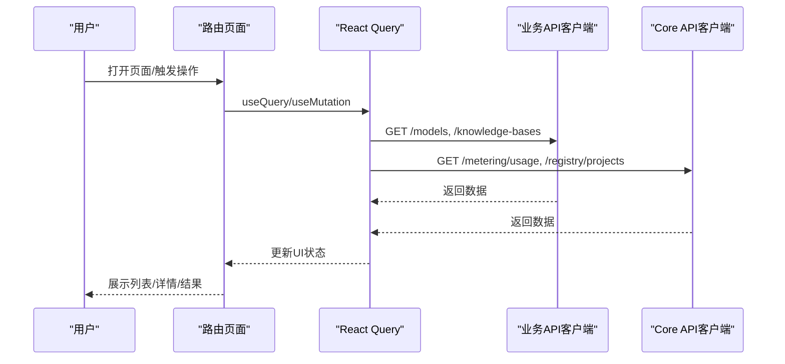
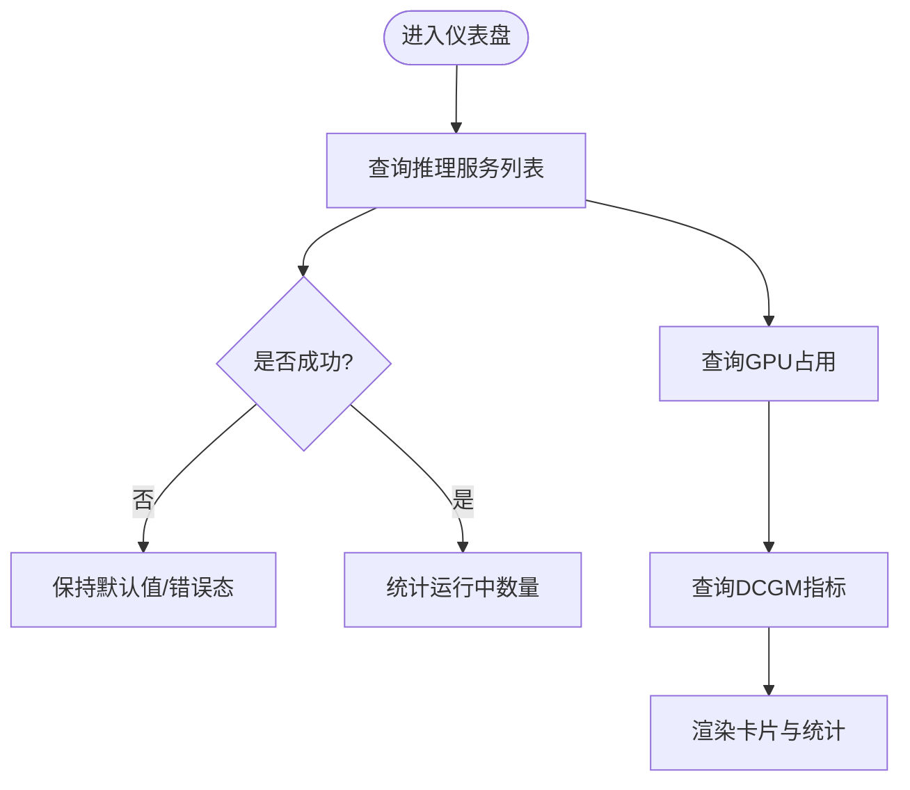
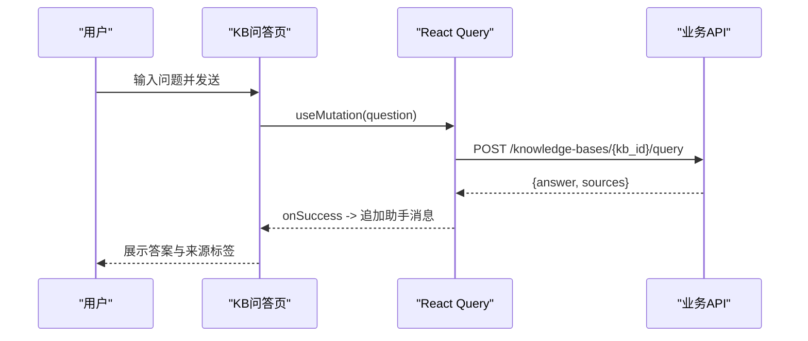
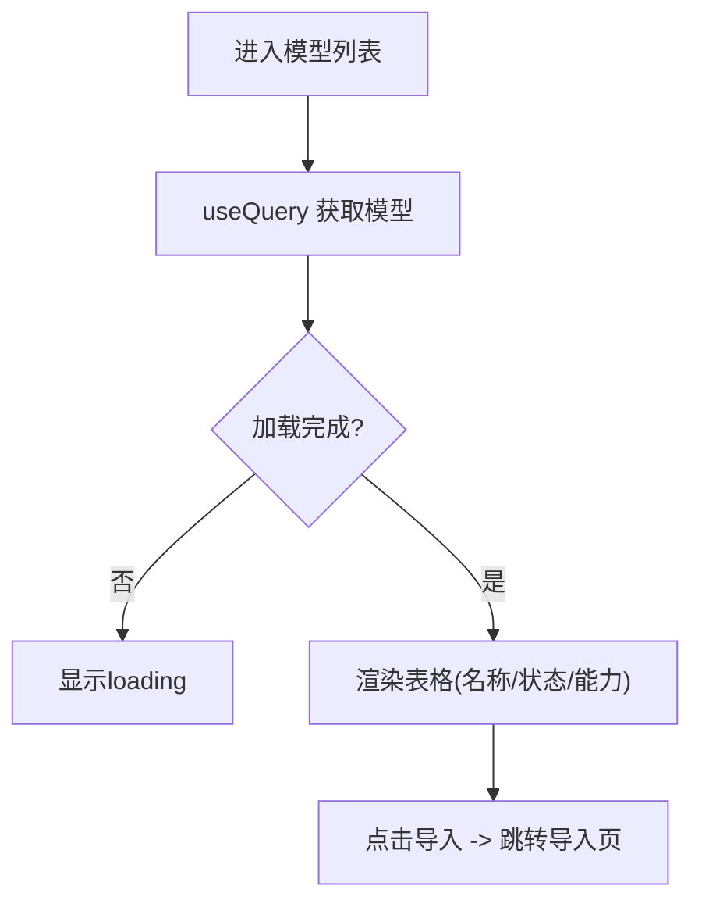
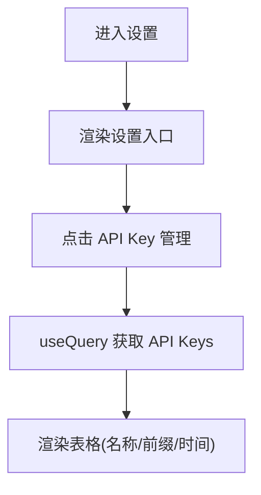
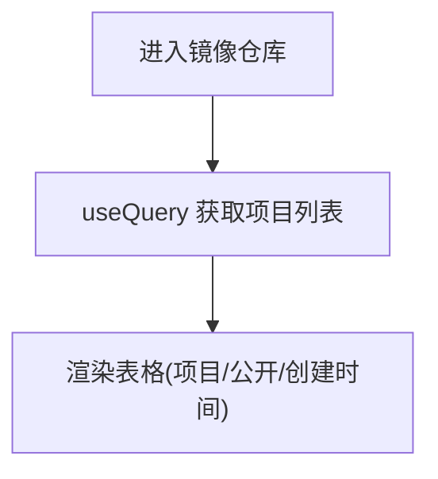
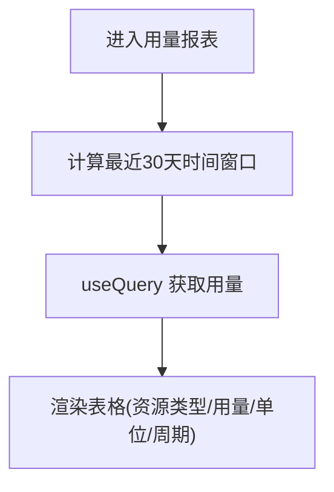
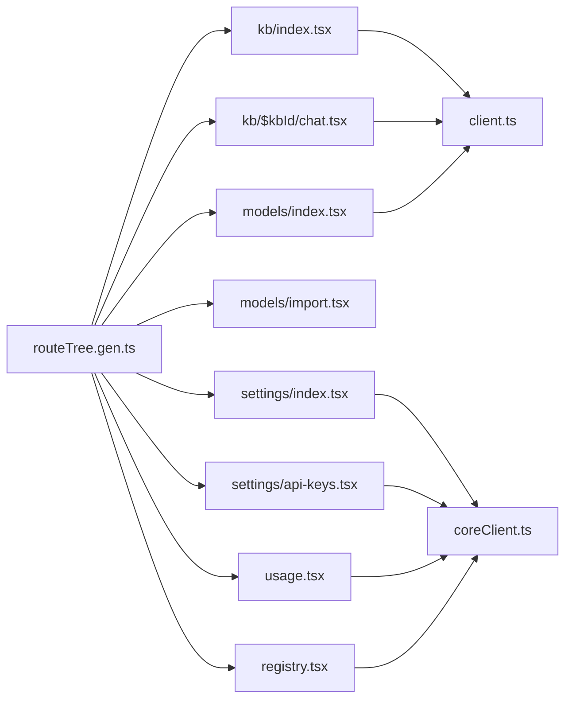

# 功能模块

<cite>
**本文引用的文件**
- [main.tsx](file://repo/frontends/console/src/main.tsx)
- [App.tsx](file://repo/frontends/console/src/App.tsx)
- [routeTree.gen.ts](file://repo/frontends/console/src/routeTree.gen.ts)
- [_authenticated/index.tsx](file://repo/frontends/console/src/routes/_authenticated/index.tsx)
- [_authenticated/kb/index.tsx](file://repo/frontends/console/src/routes/_authenticated/kb/index.tsx)
- [_authenticated/kb/$kbId/chat.tsx](file://repo/frontends/console/src/routes/_authenticated/kb/$kbId/chat.tsx)
- [_authenticated/models/index.tsx](file://repo/frontends/console/src/routes/_authenticated/models/index.tsx)
- [_authenticated/models/import.tsx](file://repo/frontends/console/src/routes/_authenticated/models/import.tsx)
- [_authenticated/settings/index.tsx](file://repo/frontends/console/src/routes/_authenticated/settings/index.tsx)
- [_authenticated/settings/api-keys.tsx](file://repo/frontends/console/src/routes/_authenticated/settings/api-keys.tsx)
- [_authenticated/usage.tsx](file://repo/frontends/console/src/routes/_authenticated/usage.tsx)
- [_authenticated/registry.tsx](file://repo/frontends/console/src/routes/_authenticated/registry.tsx)
- [client.ts](file://repo/frontends/console/src/api/client.ts)
- [coreClient.ts](file://repo/frontends/console/src/api/coreClient.ts)
- [ConsolePage.tsx](file://repo/frontends/console/src/components/shell/ConsolePage.tsx)
</cite>

## 目录
1. [简介](#简介)
2. [项目结构](#项目结构)
3. [核心组件](#核心组件)
4. [架构总览](#架构总览)
5. [详细组件分析](#详细组件分析)
6. [依赖关系分析](#依赖关系分析)
7. [性能考虑](#性能考虑)
8. [故障排查指南](#故障排查指南)
9. [结论](#结论)
10. [附录](#附录)

## 简介
本文件面向前端控制台（Console）的功能模块文档，聚焦以下能力：知识库管理、模型管理、设置管理、镜像注册表与资源使用监控。内容覆盖页面结构、组件设计、业务逻辑、用户交互流程、状态管理与数据流、表单验证与操作反馈等实现细节，帮助读者快速理解并扩展各模块。

## 项目结构
前端基于 React + TanStack Router + TDesign UI + React Query 构建。入口通过 main.tsx 初始化查询客户端、路由与全局消息提示；App.tsx 提供演示级布局与导航；路由按功能域组织在 routes/_authenticated 下，API 访问通过两个类型安全的客户端：业务 API（/api/v1/svc）与 Core API（/api/v1）。

图表来源
- [main.tsx:1-43](file://repo/frontends/console/src/main.tsx#L1-L43)
- [routeTree.gen.ts:11-148](file://repo/frontends/console/src/routeTree.gen.ts#L11-L148)
- [client.ts:1-25](file://repo/frontends/console/src/api/client.ts#L1-L25)
- [coreClient.ts:1-25](file://repo/frontends/console/src/api/coreClient.ts#L1-L25)

章节来源
- [main.tsx:1-43](file://repo/frontends/console/src/main.tsx#L1-L43)
- [App.tsx:1-239](file://repo/frontends/console/src/App.tsx#L1-L239)
- [routeTree.gen.ts:11-148](file://repo/frontends/console/src/routeTree.gen.ts#L11-L148)

## 核心组件
- 应用壳层与导航：App.tsx 提供顶部栏、侧边导航与内容区占位，用于演示态下的统一视图切换。
- 页面容器：ConsolePage.tsx 提供统一的页面内间距与布局容器，供各路由页面复用。
- 数据请求：React Query 负责缓存、重试与加载状态；openapi-fetch 生成类型安全客户端，分别对接业务 API 与 Core API。
- 路由：TanStack Router 文件路由自动生成 routeTree.gen.ts，集中维护路径与层级。

章节来源
- [App.tsx:1-239](file://repo/frontends/console/src/App.tsx#L1-L239)
- [ConsolePage.tsx:1-34](file://repo/frontends/console/src/components/shell/ConsolePage.tsx#L1-L34)
- [client.ts:1-25](file://repo/frontends/console/src/api/client.ts#L1-L25)
- [coreClient.ts:1-25](file://repo/frontends/console/src/api/coreClient.ts#L1-L25)
- [routeTree.gen.ts:11-148](file://repo/frontends/console/src/routeTree.gen.ts#L11-L148)

## 架构总览
控制台采用“路由即页面”的模块化组织，每个功能模块对应一个或多个路由文件，通过 React Query 拉取数据并使用 TDesign 组件渲染。业务 API 与 Core API 解耦，便于后续替换或并行演进。

图表来源
- [_authenticated/models/index.tsx:15-40](file://repo/frontends/console/src/routes/_authenticated/models/index.tsx#L15-L40)
- [_authenticated/kb/index.tsx:15-39](file://repo/frontends/console/src/routes/_authenticated/kb/index.tsx#L15-L39)
- [_authenticated/usage.tsx:20-47](file://repo/frontends/console/src/routes/_authenticated/usage.tsx#L20-L47)
- [_authenticated/registry.tsx:10-33](file://repo/frontends/console/src/routes/_authenticated/registry.tsx#L10-L33)
- [client.ts:17-22](file://repo/frontends/console/src/api/client.ts#L17-L22)
- [coreClient.ts:17-22](file://repo/frontends/console/src/api/coreClient.ts#L17-L22)

## 详细组件分析

### 仪表盘（运营总览）
- 页面职责：聚合运行中的推理服务数量、GPU 库存占用与 Prometheus 指标可用性，点击可跳转至 GPU 相关页面。
- 数据流：
  - 推理服务列表：调用业务 API 获取并统计 running 数量。
  - GPU 占用：调用 Core API 获取占用统计。
  - DCGM 指标：调用 Core API 的 observability/query 查询 PromQL，失败时显示“监控未就绪”。
- 交互与状态：使用 Skeleton 处理加载中，Tag 标记监控就绪状态，Statistic 展示关键指标。

图表来源
- [_authenticated/index.tsx:16-99](file://repo/frontends/console/src/routes/_authenticated/index.tsx#L16-L99)

章节来源
- [_authenticated/index.tsx:1-101](file://repo/frontends/console/src/routes/_authenticated/index.tsx#L1-L101)

### 知识库管理
- 列表页（kb/index.tsx）
  - 数据：调用业务 API 获取知识库列表，展示名称、文档数、状态。
  - 操作：跳转到具体知识库的问答页。
- 问答页（kb/$kbId/chat.tsx）
  - 数据：提交问题到 /knowledge-bases/{kb_id}/query，携带 idempotency_key、top_k、score_threshold。
  - 幂等：使用 ref 保存当前问题的幂等键，重试时复用，成功后清空以生成新键。
  - 展示：用户与助手消息气泡，附带来源片段（文件名+页码）。
  - 交互：输入框回车发送，按钮带 loading 态。

图表来源
- [_authenticated/kb/$kbId/chat.tsx:22-91](file://repo/frontends/console/src/routes/_authenticated/kb/$kbId/chat.tsx#L22-L91)
- [client.ts:17-22](file://repo/frontends/console/src/api/client.ts#L17-L22)

章节来源
- [_authenticated/kb/index.tsx:1-42](file://repo/frontends/console/src/routes/_authenticated/kb/index.tsx#L1-L42)
- [_authenticated/kb/$kbId/chat.tsx:1-92](file://repo/frontends/console/src/routes/_authenticated/kb/$kbId/chat.tsx#L1-L92)

### 模型管理
- 列表页（models/index.tsx）
  - 数据：调用业务 API 获取模型列表，展示名称、状态、能力标签。
  - 操作：预留“详情”入口（开发中），支持跳转到“导入模型”。
- 导入页（models/import.tsx）
  - 现状：占位页面，说明支持本地上传、HuggingFace、ModelScope 三种方式，待实现多步向导。

图表来源
- [_authenticated/models/index.tsx:15-40](file://repo/frontends/console/src/routes/_authenticated/models/index.tsx#L15-L40)
- [_authenticated/models/import.tsx:7-21](file://repo/frontends/console/src/routes/_authenticated/models/import.tsx#L7-L21)

章节来源
- [_authenticated/models/index.tsx:1-43](file://repo/frontends/console/src/routes/_authenticated/models/index.tsx#L1-L43)
- [_authenticated/models/import.tsx:1-22](file://repo/frontends/console/src/routes/_authenticated/models/import.tsx#L1-L22)

### 设置管理
- 设置入口（settings/index.tsx）
  - 提供子菜单链接，如“API Key 管理”。
- API Key 管理（settings/api-keys.tsx）
  - 数据：调用 Core API 获取当前租户的 API Key 列表，展示名称、Key 前缀、创建时间、过期时间。
  - 错误处理：加载失败时提示确认 gateway 已启动且已登录。

图表来源
- [_authenticated/settings/index.tsx:4-13](file://repo/frontends/console/src/routes/_authenticated/settings/index.tsx#L4-L13)
- [_authenticated/settings/api-keys.tsx:10-35](file://repo/frontends/console/src/routes/_authenticated/settings/api-keys.tsx#L10-L35)

章节来源
- [_authenticated/settings/index.tsx:1-14](file://repo/frontends/console/src/routes/_authenticated/settings/index.tsx#L1-L14)
- [_authenticated/settings/api-keys.tsx:1-37](file://repo/frontends/console/src/routes/_authenticated/settings/api-keys.tsx#L1-L37)

### 镜像注册表
- 页面职责：展示 Harbor 项目列表，包含项目名称、是否公开、创建时间。
- 数据流：调用 Core API 的 /registry/projects。
- 错误处理：失败时给出明确提示。

图表来源
- [_authenticated/registry.tsx:10-33](file://repo/frontends/console/src/routes/_authenticated/registry.tsx#L10-L33)

章节来源
- [_authenticated/registry.tsx:1-36](file://repo/frontends/console/src/routes/_authenticated/registry.tsx#L1-L36)

### 资源使用监控（用量报表）
- 页面职责：展示近 30 天租户用量，包括资源类型、总量、单位、周期。
- 数据流：调用 Core API 的 /metering/usage，传入 start_time/end_time。
- 错误处理：失败时提示检查 gateway 与登录状态。

图表来源
- [_authenticated/usage.tsx:6-47](file://repo/frontends/console/src/routes/_authenticated/usage.tsx#L6-L47)

章节来源
- [_authenticated/usage.tsx:1-51](file://repo/frontends/console/src/routes/_authenticated/usage.tsx#L1-L51)

## 依赖关系分析
- 路由与页面：routeTree.gen.ts 由 TanStack Router 根据文件路由生成，集中映射路径与组件。
- 数据层：
  - 业务 API 客户端（client.ts）指向 /api/v1/svc，用于模型、知识库等业务资源。
  - Core API 客户端（coreClient.ts）指向 /api/v1，用于实例、计量、注册表、鉴权等基础设施能力。
- 状态管理：React Query 负责缓存与生命周期；TDesign 组件负责 UI 呈现。
- 全局初始化：main.tsx 注入 QueryClient、RouterProvider，并挂载 MessagePlugin。

图表来源
- [routeTree.gen.ts:11-148](file://repo/frontends/console/src/routeTree.gen.ts#L11-L148)
- [client.ts:17-22](file://repo/frontends/console/src/api/client.ts#L17-L22)
- [coreClient.ts:17-22](file://repo/frontends/console/src/api/coreClient.ts#L17-L22)

章节来源
- [routeTree.gen.ts:11-148](file://repo/frontends/console/src/routeTree.gen.ts#L11-L148)
- [client.ts:1-25](file://repo/frontends/console/src/api/client.ts#L1-L25)
- [coreClient.ts:1-25](file://repo/frontends/console/src/api/coreClient.ts#L1-L25)

## 性能考虑
- 数据缓存与去重：React Query 自动缓存查询结果，避免重复请求；知识库问答使用幂等键减少重复提交。
- 按需加载：路由级组件懒加载，减少首屏体积。
- 指标查询优化：PromQL 查询关闭重试，避免频繁失败重试造成压力。
- UI 骨架与节流：使用 Skeleton 提升感知性能；按钮 loading 防止重复提交。

[本节为通用指导，不直接分析具体文件]

## 故障排查指南
- 无法加载数据
  - 现象：表格为空或显示“加载失败”。
  - 可能原因：Gateway 未启动、网络不可达、鉴权失败。
  - 建议：检查浏览器网络面板、确认已登录、核对 baseUrl 配置。
- 监控未就绪
  - 现象：仪表盘显示“监控未就绪”。
  - 可能原因：Prometheus/DCGM 导出器未就绪或查询失败。
  - 建议：检查 observability/query 接口与指标采集链路。
- 知识库问答无响应
  - 现象：发送问题后无结果。
  - 可能原因：知识库未索引、参数阈值过低、后端异常。
  - 建议：调整 top_k 与 score_threshold，查看后端日志。

章节来源
- [_authenticated/index.tsx:31-45](file://repo/frontends/console/src/routes/_authenticated/index.tsx#L31-L45)
- [_authenticated/usage.tsx:43-47](file://repo/frontends/console/src/routes/_authenticated/usage.tsx#L43-L47)
- [_authenticated/registry.tsx:28-31](file://repo/frontends/console/src/routes/_authenticated/registry.tsx#L28-L31)
- [_authenticated/settings/api-keys.tsx:29-31](file://repo/frontends/console/src/routes/_authenticated/settings/api-keys.tsx#L29-L31)

## 结论
控制台以清晰的路由分层与类型安全的 API 客户端实现了知识库、模型、设置、镜像仓库与用量监控等核心功能。通过 React Query 统一管理数据状态，结合 TDesign 组件提供一致的交互体验。后续可在现有基础上完善表单校验、分页与批量操作，并逐步补齐导入向导与更多运维能力。

[本节为总结性内容，不直接分析具体文件]

## 附录
- 常用 API 端点
  - 业务 API（/api/v1/svc）
    - GET /models
    - GET /knowledge-bases
    - POST /knowledge-bases/{kb_id}/query
  - Core API（/api/v1）
    - GET /gpu-inventory/occupancy
    - GET /observability/query
    - GET /metering/usage
    - GET /registry/projects
    - GET /auth/api-keys

[本节为参考信息，不直接分析具体文件]