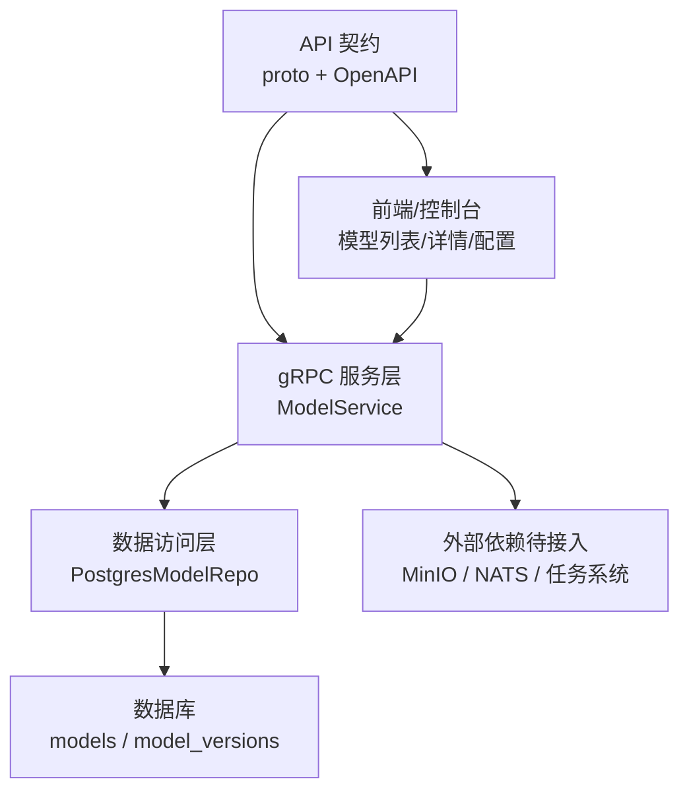
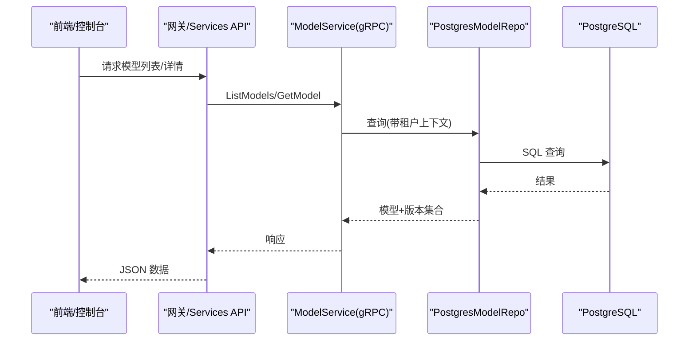
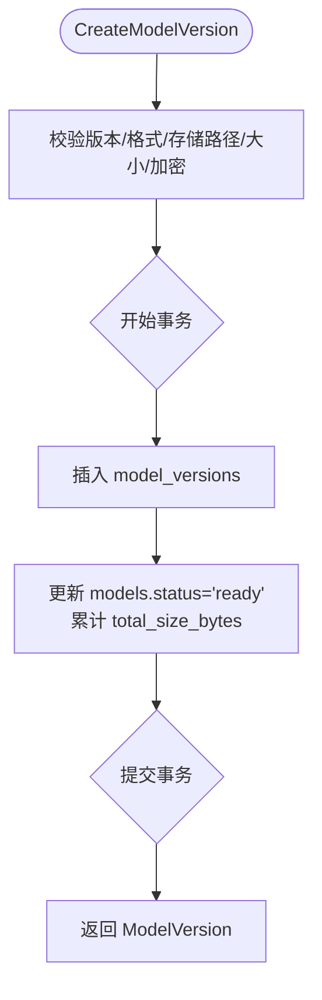
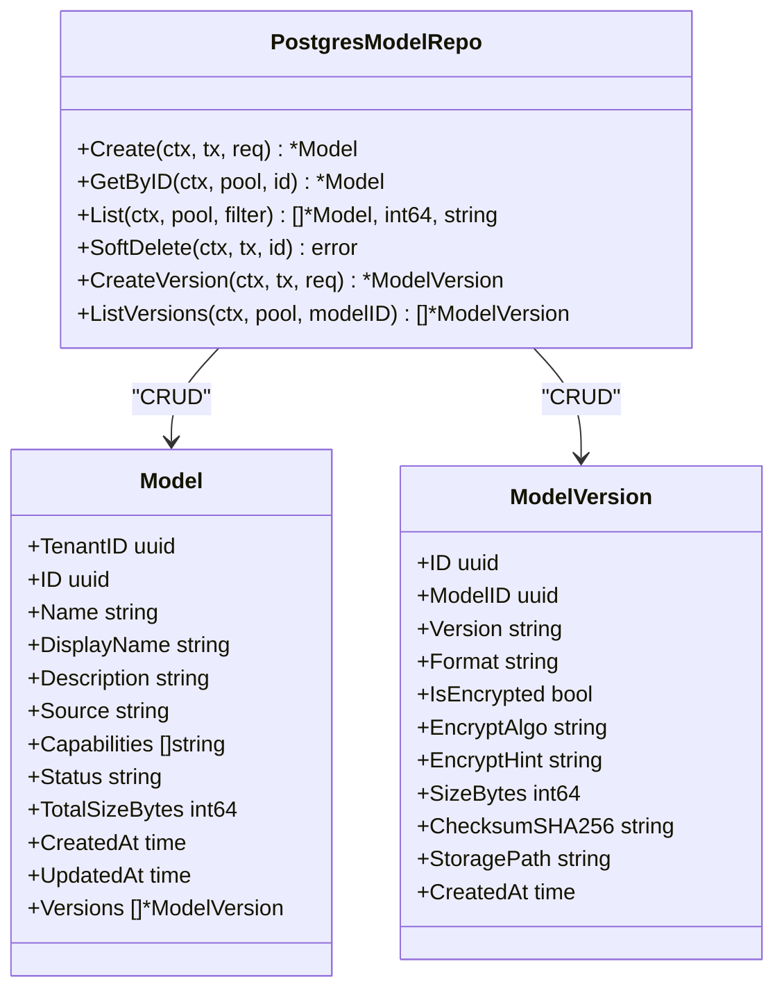
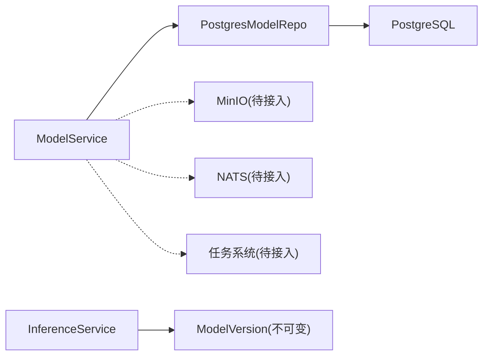

# 模型管理模块

<cite>
**本文引用的文件**
- [model_service.proto](file://repo/api/proto/model/v1/model_service.proto)
- [v1.yaml](file://repo/api/openapi/services/v1.yaml)
- [main.go](file://repo/services/model-service/main.go)
- [model_service.go](file://repo/services/model-service/internal/service/model_service.go)
- [model_repo.go](file://repo/services/model-service/internal/repo/model_repo.go)
- [config.go](file://repo/services/model-service/internal/config/config.go)
- [PHASE3-MODEL-ENHANCEMENT-ACCEPTANCE-RECORD.md](file://repo/services/tasks/phase3/acceptance/PHASE3-MODEL-ENHANCEMENT-ACCEPTANCE-RECORD.md)
- [prd-console-model-usage-stats.md](file://repo/services/tasks/modules/prd/console/inference/prd-console-model-usage-stats.md)
- [ANI-02-产品功能设计.md](file://ANI-02-产品功能设计.md)
</cite>

## 目录
1. [简介](#简介)
2. [项目结构](#项目结构)
3. [核心组件](#核心组件)
4. [架构总览](#架构总览)
5. [详细组件分析](#详细组件分析)
6. [依赖关系分析](#依赖关系分析)
7. [性能与可扩展性](#性能与可扩展性)
8. [故障排查指南](#故障排查指南)
9. [结论](#结论)
10. [附录：UI 设计与业务流程建议](#附录ui-设计与业务流程建议)

## 简介
本模块为 ANI 平台的“模型仓库服务”，提供私有模型的注册、版本管理、导入导出（计划中）、下载直链、以及后续推理服务集成的基础能力。当前实现已覆盖：
- 模型元数据创建、查询、分页列表、软删除
- 模型版本登记（含格式、加密、大小、校验和、存储路径）
- 租户隔离与事务一致性
- 通过 OpenAPI 契约定义 Model / ModelVersion / InferenceService 等类型，便于前端与服务间对齐

尚未实现的 RPC（占位返回 Unimplemented）包括：上传直链生成、模型导入任务、下载直链生成；这些将在后续迭代接入 MinIO、任务队列与下载器工作流后启用。

## 项目结构
模型管理相关代码主要分布在以下位置：
- API 契约：gRPC proto 与 Services OpenAPI 契约
- 服务实现：Go gRPC 服务、Postgres 仓储、配置加载
- 任务与计量：Phase3 验收文档与用量统计 PRD，为后续模型维度计量与报表提供依据
- 产品规划：AI 全生命周期平台中的“模型仓库服务”定位

图表来源
- [model_service.proto:12-40](file://repo/api/proto/model/v1/model_service.proto#L12-L40)
- [v1.yaml:129-152](file://repo/api/openapi/services/v1.yaml#L129-L152)
- [main.go:10-18](file://repo/services/model-service/main.go#L10-L18)
- [model_service.go:22-34](file://repo/services/model-service/internal/service/model_service.go#L22-L34)
- [model_repo.go:16-23](file://repo/services/model-service/internal/repo/model_repo.go#L16-L23)

章节来源
- [model_service.proto:12-40](file://repo/api/proto/model/v1/model_service.proto#L12-L40)
- [v1.yaml:129-152](file://repo/api/openapi/services/v1.yaml#L129-L152)
- [main.go:10-18](file://repo/services/model-service/main.go#L10-L18)
- [model_service.go:22-34](file://repo/services/model-service/internal/service/model_service.go#L22-L34)
- [model_repo.go:16-23](file://repo/services/model-service/internal/repo/model_repo.go#L16-L23)

## 核心组件
- gRPC 服务：ModelService 暴露模型与版本管理的 RPC 接口，负责参数校验、租户上下文注入、事务控制与错误映射。
- 数据访问层：PostgresModelRepo 封装 models 与 model_versions 表的 CRUD、分页、软删除与版本关联查询。
- 配置：从环境变量加载数据库、NATS、Redis 与端口信息，统一由 bootstrap 初始化连接。
- 契约：proto 定义 RPC 与领域消息；OpenAPI v1.yaml 定义 REST 侧的 Model / ModelVersion / InferenceService 等类型，供控制台与网关使用。

章节来源
- [model_service.go:22-34](file://repo/services/model-service/internal/service/model_service.go#L22-L34)
- [model_repo.go:16-23](file://repo/services/model-service/internal/repo/model_repo.go#L16-L23)
- [config.go:10-20](file://repo/services/model-service/internal/config/config.go#L10-L20)
- [model_service.proto:12-40](file://repo/api/proto/model/v1/model_service.proto#L12-L40)
- [v1.yaml:129-152](file://repo/api/openapi/services/v1.yaml#L129-L152)

## 架构总览
模型管理采用分层架构：
- 契约层：gRPC proto 与 OpenAPI 契约明确输入输出、枚举与分页约定。
- 服务层：gRPC 处理器进行参数校验、租户隔离、事务边界控制，并调用仓储。
- 仓储层：Postgres 表 models 与 model_versions，支持按状态过滤、游标分页、软删除。
- 集成点（待实现）：MinIO 直传直下、NATS 异步任务（导入/下载）、推理服务（InferenceService）引用模型版本。

图表来源
- [model_service.proto:20-24](file://repo/api/proto/model/v1/model_service.proto#L20-L24)
- [model_service.go:85-117](file://repo/services/model-service/internal/service/model_service.go#L85-L117)
- [model_repo.go:138-198](file://repo/services/model-service/internal/repo/model_repo.go#L138-L198)

## 详细组件分析

### gRPC 服务层：ModelService
职责
- 解析并校验租户 ID、模型名、版本与格式等入参
- 将租户 ID 注入到上下文，确保多租户隔离
- 在事务中执行创建模型、软删除、创建版本等操作
- 将领域对象转换为 proto 消息返回
- 将内部错误映射为 gRPC 状态码

关键流程
- 创建模型：校验名称与显示名 -> 开启事务 -> 写入 models -> 提交事务 -> 返回 Model
- 获取模型：按 ID 查询 models，并附带 versions -> 返回 Model
- 列表查询：游标分页，支持按 status 过滤 -> 返回 Models + 分页元信息
- 软删除：更新 status=deleted -> 提交事务
- 创建版本：校验版本、格式、存储路径、大小、加密字段 -> 写入 model_versions -> 更新 models.status=ready 与 total_size_bytes

未实现项（占位）
- GetUploadURL：需要接入 MinIO 客户端以生成预签名上传 URL
- ImportModel：需要接入 Outbox 发布器与下载器 Worker
- GetModelDownloadURL：需要接入 MinIO 客户端以生成预签名下载 URL

图表来源
- [model_service.go:139-172](file://repo/services/model-service/internal/service/model_service.go#L139-L172)
- [model_repo.go:218-245](file://repo/services/model-service/internal/repo/model_repo.go#L218-L245)

章节来源
- [model_service.go:36-184](file://repo/services/model-service/internal/service/model_service.go#L36-L184)
- [model_service.go:186-218](file://repo/services/model-service/internal/service/model_service.go#L186-L218)
- [model_service.go:282-301](file://repo/services/model-service/internal/service/model_service.go#L282-L301)

### 数据访问层：PostgresModelRepo
职责
- 维护 models 与 model_versions 表的数据读写
- 提供游标分页、状态过滤、软删除、版本列表查询
- 在事务中保证创建模型、创建版本与状态更新的原子性

关键实现要点
- 游标分页：基于 (created_at, id) 组合条件，先查 limit+1 条，再计算 next_cursor
- 软删除：仅当 status <> 'deleted' 时更新，否则视为不存在
- 版本创建：插入版本后，同步更新所属模型的 status 与总大小
- 租户隔离：所有查询均通过 SetDBTenant 设置租户上下文

图表来源
- [model_repo.go:16-23](file://repo/services/model-service/internal/repo/model_repo.go#L16-L23)
- [model_repo.go:59-88](file://repo/services/model-service/internal/repo/model_repo.go#L59-L88)

章节来源
- [model_repo.go:90-136](file://repo/services/model-service/internal/repo/model_repo.go#L90-L136)
- [model_repo.go:138-198](file://repo/services/model-service/internal/repo/model_repo.go#L138-L198)
- [model_repo.go:200-245](file://repo/services/model-service/internal/repo/model_repo.go#L200-L245)
- [model_repo.go:247-310](file://repo/services/model-service/internal/repo/model_repo.go#L247-L310)

### 配置与启动
- 配置加载：从环境变量读取 DATABASE_URL、NATS_URL、REDIS_URL、GRPC_PORT、HEALTH_PORT，并设置 ServiceName
- 启动流程：加载配置 -> 初始化基础设施连接 -> 构建 Repo 与 Service -> 注册 gRPC 服务并启动监听

章节来源
- [config.go:10-20](file://repo/services/model-service/internal/config/config.go#L10-L20)
- [main.go:10-18](file://repo/services/model-service/main.go#L10-L18)

### 契约与数据模型
- gRPC 契约：定义 Model、ModelVersion、ImportModel、GetUploadURL、GetModelDownloadURL 等 RPC 与消息
- OpenAPI 契约：定义 Model、ModelVersion、InferenceService 等 JSON Schema，用于 Services 层 REST 交互与前端类型生成

章节来源
- [model_service.proto:44-157](file://repo/api/proto/model/v1/model_service.proto#L44-L157)
- [v1.yaml:129-152](file://repo/api/openapi/services/v1.yaml#L129-L152)

## 依赖关系分析
- 服务对仓储的依赖：ModelService 依赖 PostgresModelRepo 完成数据持久化
- 仓储对数据库的依赖：直接操作 PostgreSQL，使用 pgxpool 连接池
- 外部依赖（待接入）：MinIO（上传/下载直链）、NATS（异步任务）、任务系统（导入/下载）
- 与推理服务的耦合：通过 InferenceService 引用不可变模型版本（model_version_id），保障部署可追溯

图表来源
- [model_service.go:22-34](file://repo/services/model-service/internal/service/model_service.go#L22-L34)
- [model_repo.go:16-23](file://repo/services/model-service/internal/repo/model_repo.go#L16-L23)
- [v1.yaml:154-181](file://repo/api/openapi/services/v1.yaml#L154-L181)

章节来源
- [model_service.go:22-34](file://repo/services/model-service/internal/service/model_service.go#L22-L34)
- [model_repo.go:16-23](file://repo/services/model-service/internal/repo/model_repo.go#L16-L23)
- [v1.yaml:154-181](file://repo/api/openapi/services/v1.yaml#L154-L181)

## 性能与可扩展性
- 分页策略：使用游标分页，避免深翻页性能问题；默认 limit 20，可按需调整
- 事务边界：创建模型、软删除、创建版本均在事务内执行，保证一致性
- 索引建议：建议在 models(created_at, id)、models(status)、model_versions(model_id) 建立合适索引以提升查询效率
- 扩展点：
  - 接入 MinIO 后可实现大文件直传直下，降低服务带宽压力
  - 接入 NATS 与任务系统后，可实现异步导入/下载与进度上报
  - 结合计量服务，按 model_id 与 inference_service_id 聚合 Token/请求量，支撑用量报表

[本节为通用指导，不直接分析具体文件]

## 故障排查指南
常见错误与处理
- 参数校验失败：模型名、版本、格式、存储路径、大小或加密算法不符合要求，返回 InvalidArgument
- 资源不存在：按 ID 查询不到模型或已软删除，返回 NotFound
- 权限与认证：租户 ID 无效或未授权，返回 PermissionDenied/Unauthenticated
- 内部错误：数据库或事务异常，返回 Internal，需检查日志与连接

排查步骤
- 检查请求参数是否符合 proto/OpenAPI 约束
- 确认租户上下文是否正确注入
- 查看数据库事务是否成功提交
- 对于未实现 RPC（上传/导入/下载），确认是否已接入对应依赖

章节来源
- [model_service.go:186-218](file://repo/services/model-service/internal/service/model_service.go#L186-L218)
- [model_service.go:282-301](file://repo/services/model-service/internal/service/model_service.go#L282-L301)

## 结论
当前模型管理模块已具备稳定的模型元数据管理与版本登记能力，并通过严格的租户隔离与事务控制保障数据一致性。下一步重点在于：
- 接入 MinIO 实现模型文件的上传/下载直链
- 接入 NATS 与任务系统实现异步导入/下载与进度跟踪
- 完善计量与报表，按模型维度统计 Token 与请求量
- 与推理服务深度集成，实现模型版本的不可变引用与回滚策略

[本节为总结性内容，不直接分析具体文件]

## 附录：UI 设计与业务流程建议

### 模型列表页面
- 数据来源：调用 ListModels（gRPC）或 Services 层对应 REST 接口
- 展示字段：模型名称、显示名、能力标签、状态、总大小、创建时间
- 交互：支持按状态筛选、游标分页加载、进入详情页

### 模型详情页面
- 数据来源：调用 GetModel（gRPC）或 Services 层对应 REST 接口
- 展示字段：模型基本信息、版本列表（版本号、格式、加密标志、大小、校验和、创建时间）
- 交互：选择版本进行部署、查看版本差异（未来）、回滚到历史版本（结合 InferenceService 的不可变版本）

### 模型配置与版本管理
- 创建模型：填写名称、显示名、描述、能力标签
- 上传模型文件：调用 GetUploadURL（待实现）获取预签名 PUT URL，直传到 MinIO，再调用 CreateModelVersion 登记版本
- 导入模型：调用 ImportModel（待实现）触发异步下载（HuggingFace/ModelScope），轮询任务进度
- 下载模型：调用 GetModelDownloadURL（待实现）获取预签名 GET URL，供 Init Container 拉取

### 模型导入导出流程
- 导入流程（待实现）：
  - 前端发起 ImportModel，携带 source、repo_id、revision、idempotency_key
  - 服务端写入任务记录并返回 AsyncTaskRef
  - 前端轮询任务状态，完成后自动登记版本
- 导出流程（待实现）：
  - 前端选择模型版本，调用 GetModelDownloadURL 获取下载链接
  - 浏览器或后端代理下载至本地或对象存储

### 版本对比与回滚
- 版本对比（建议）：基于 model_versions 的 format、checksum_sha256、size_bytes 与 encrypt_hint 进行差异展示
- 回滚策略（建议）：
  - 推理服务绑定不可变 model_version_id
  - 回滚即重新部署到指定历史版本，保留变更审计与幂等键

### 模型元数据管理
- 字段规范：name 遵循命名规则，capabilities 限定枚举值，status 体现生命周期
- 加密字段：is_encrypted、encrypt_algo、encrypt_hint 仅在模型加密时填写

### 性能监控与推理服务集成
- 计量指标：按 model_id 与 inference_service_id 聚合 Token 与请求量，支撑用量报表
- 推理集成：InferenceService 通过 model_version_id 绑定不可变版本，确保部署可追溯与可回滚

章节来源
- [model_service.proto:20-40](file://repo/api/proto/model/v1/model_service.proto#L20-L40)
- [model_service.proto:73-123](file://repo/api/proto/model/v1/model_service.proto#L73-L123)
- [v1.yaml:154-181](file://repo/api/openapi/services/v1.yaml#L154-L181)
- [prd-console-model-usage-stats.md:1-34](file://repo/services/tasks/modules/prd/console/inference/prd-console-model-usage-stats.md#L1-L34)
- [PHASE3-MODEL-ENHANCEMENT-ACCEPTANCE-RECORD.md:31-71](file://repo/services/tasks/phase3/acceptance/PHASE3-MODEL-ENHANCEMENT-ACCEPTANCE-RECORD.md#L31-L71)
- [ANI-02-产品功能设计.md:318-340](file://ANI-02-产品功能设计.md#L318-L340)