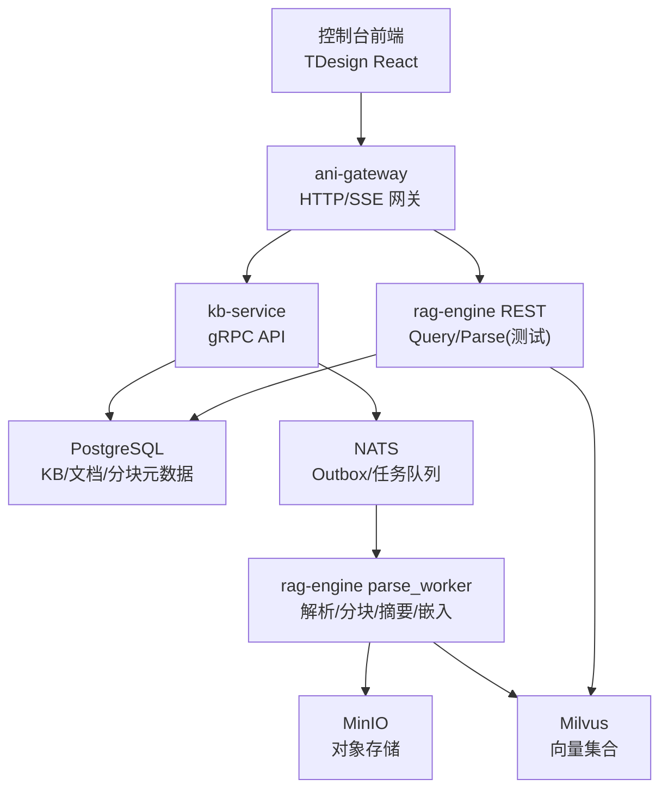
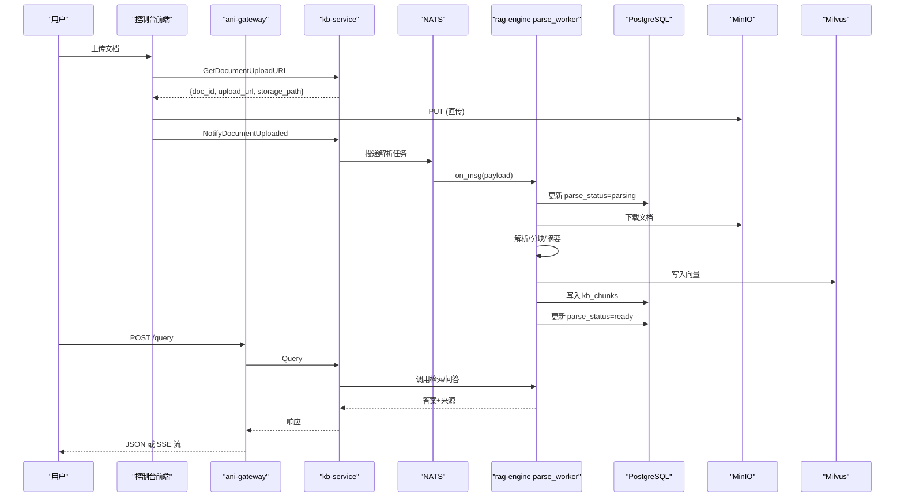
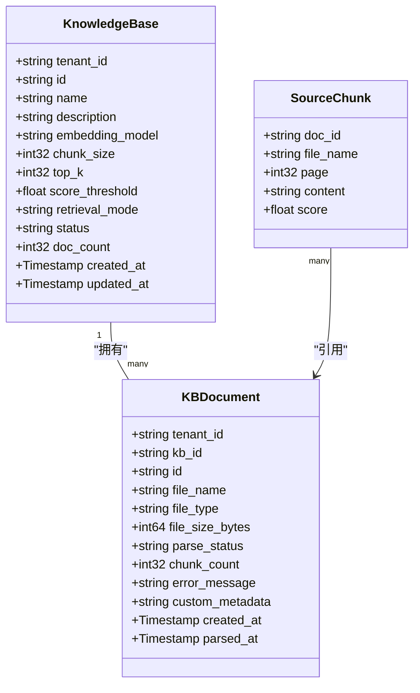
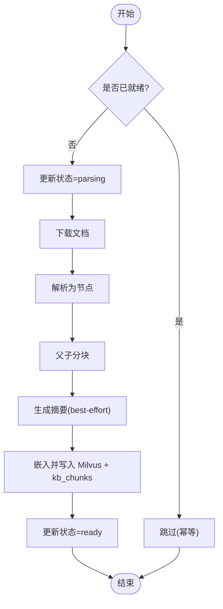
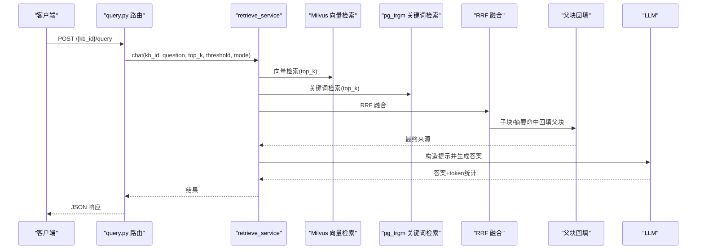
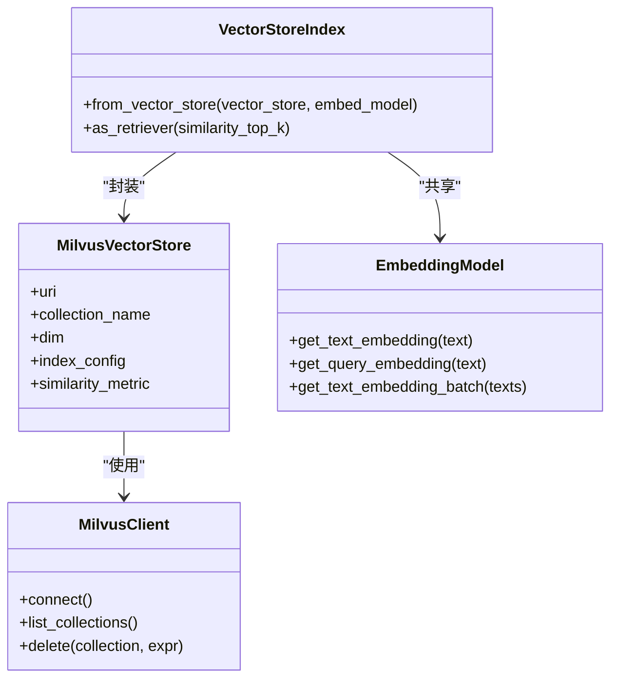
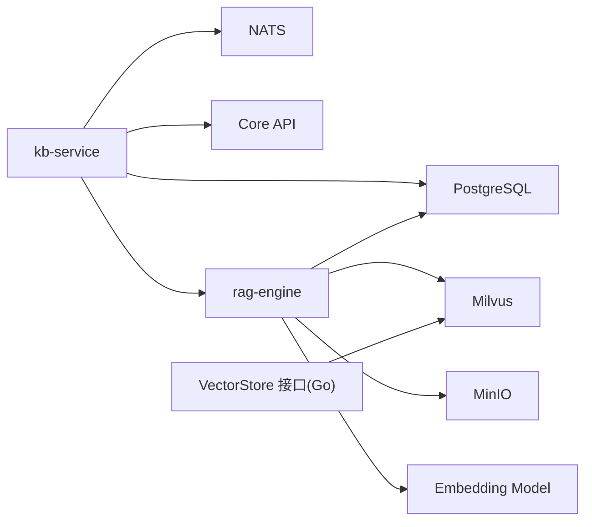

# 知识库管理模块

<cite>
**本文引用的文件**
- [kb_service.proto](file://repo/api/proto/kb/v1/kb_service.proto)
- [documents.py](file://repo/ai/rag-engine/app/routers/documents.py)
- [query.py](file://repo/ai/rag-engine/app/routers/query.py)
- [milvus.py](file://repo/ai/rag-engine/app/core/milvus.py)
- [embeddings.py](file://repo/ai/rag-engine/app/core/embeddings.py)
- [retrieve_service.py](file://repo/ai/rag-engine/app/services/retrieve_service.py)
- [parse_worker.py](file://repo/ai/rag-engine/app/workers/parse_worker.py)
- [vector_store.go](file://repo/pkg/ports/vector_store.go)
- [spec-console-knowledge-base-platform.md](file://repo/services/tasks/modules/spec/core/knowledge/spec-console-knowledge-base-platform.md)
- [issue-021-console-chat-page.md](file://repo/services/tasks/modules/issue/core/knowledge/issue-021-console-chat-page.md)
</cite>

## 目录
1. [简介](#简介)
2. [项目结构](#项目结构)
3. [核心组件](#核心组件)
4. [架构总览](#架构总览)
5. [详细组件分析](#详细组件分析)
6. [依赖关系分析](#依赖关系分析)
7. [性能考量](#性能考量)
8. [故障排查指南](#故障排查指南)
9. [结论](#结论)
10. [附录](#附录)

## 简介
本模块提供知识库（Knowledge Base）的创建、编辑、删除，以及文档上传、解析、分块、索引构建、相似度检索与问答交互等端到端能力。前端通过网关访问 kb-service 与 rag-engine，后端以 PostgreSQL 存储元数据、Milvus 存储向量、NATS 异步处理解析任务，结合 LlamaIndex 实现混合检索（向量+关键词）与 RAG 问答。

## 项目结构
- 协议层：kb_service.proto 定义 KB 生命周期、文档管理与查询/流式检索接口。
- 服务层：
  - kb-service：对外 gRPC API，编排文档入库、会话、权限等；通过 Outbox 将解析任务投递到 NATS。
  - rag-engine：FastAPI 暴露 REST 用于测试与集成；内部包含解析工作流、检索服务、Milvus/嵌入模型适配。
- 基础设施：
  - Milvus：向量数据库，按 KB 维度建集合，HNSW+COSINE。
  - PostgreSQL：KB/文档/分块元数据，pg_trgm 支持关键词检索。
  - MinIO：对象存储，直传 + 校验。
  - NATS：异步消息总线，驱动解析流水线。
- 前端：Console 基于 TDesign React，经 ani-gateway 消费 Services API 与 SSE 事件。

图表来源
- [kb_service.proto:11-53](file://repo/api/proto/kb/v1/kb_service.proto#L11-L53)
- [documents.py:28-90](file://repo/ai/rag-engine/app/routers/documents.py#L28-L90)
- [query.py:112-166](file://repo/ai/rag-engine/app/routers/query.py#L112-L166)
- [milvus.py:36-153](file://repo/ai/rag-engine/app/core/milvus.py#L36-L153)
- [parse_worker.py:334-500](file://repo/ai/rag-engine/app/workers/parse_worker.py#L334-L500)

章节来源
- [kb_service.proto:11-53](file://repo/api/proto/kb/v1/kb_service.proto#L11-L53)
- [spec-console-knowledge-base-platform.md:33-56](file://repo/services/tasks/modules/spec/core/knowledge/spec-console-knowledge-base-platform.md#L33-L56)

## 核心组件
- KB 服务接口：创建/获取/列表/删除知识库；文档上传 URL 生成、通知上传完成、文档元数据查询、删除文档；同步 Query 与流式 Retrieve。
- 解析流水线：下载 → 解析 → 父子分块 → 摘要（可选）→ 嵌入 → 写入 Milvus 与 kb_chunks → 状态机推进。
- 检索服务：向量检索（Milvus HNSW/COSINE）、关键词检索（pg_trgm）、RRF 融合、父块回填、阈值门控防幻觉。
- 嵌入模型：统一远程 OpenAI 兼容 /v1/embeddings 端点，写读共用同一模型，保证一致性。
- 向量存储抽象：Go 端口定义 VectorStore 接口，便于替换底层实现。

章节来源
- [kb_service.proto:57-242](file://repo/api/proto/kb/v1/kb_service.proto#L57-L242)
- [parse_worker.py:185-500](file://repo/ai/rag-engine/app/workers/parse_worker.py#L185-L500)
- [retrieve_service.py:568-685](file://repo/ai/rag-engine/app/services/retrieve_service.py#L568-L685)
- [embeddings.py:50-101](file://repo/ai/rag-engine/app/core/embeddings.py#L50-L101)
- [vector_store.go:123-165](file://repo/pkg/ports/vector_store.go#L123-L165)

## 架构总览
知识库从创建到可检索的关键路径：
- 创建 KB：设置 embedding_model、chunk_size、top_k、score_threshold、retrieval_mode。
- 上传文档：先获取预签名 PUT URL，客户端直传到 MinIO，再调用 NotifyDocumentUploaded 触发 Outbox 投递解析任务。
- 解析与索引：parse_worker 拉取文档，解析为节点，父子分块，生成摘要（best-effort），向量化并写入 Milvus 与 kb_chunks。
- 检索与问答：Query 走混合检索（向量+关键词）→ RRF 融合 → 父块回填 → 评分阈值门控 → LLM 生成答案；Retrieve 支持 SSE 流式输出 token 与 sources。

图表来源
- [kb_service.proto:18-44](file://repo/api/proto/kb/v1/kb_service.proto#L18-L44)
- [documents.py:28-90](file://repo/ai/rag-engine/app/routers/documents.py#L28-L90)
- [query.py:112-166](file://repo/ai/rag-engine/app/routers/query.py#L112-L166)
- [parse_worker.py:334-500](file://repo/ai/rag-engine/app/workers/parse_worker.py#L334-L500)

## 详细组件分析

### 知识库与文档管理（kb-service 协议）
- 知识库 CRUD：CreateKB/GetKB/ListKBs/DeleteKB，字段包括 embedding_model、chunk_size、top_k、score_threshold、retrieval_mode、status 等。
- 文档管理：
  - GetDocumentUploadURL：返回预签名上传地址与 doc_id，记录 pending。
  - NotifyDocumentUploaded：校验后入队解析任务。
  - ListDocuments/GetDocument/DeleteDocument：分页、过滤、幂等删除（同时清理 Milvus 向量）。
- 查询与检索：
  - Query：同步返回答案与引用来源。
  - Retrieve：服务器流式 RPC，依次推送 token、sources、done/error。

图表来源
- [kb_service.proto:213-242](file://repo/api/proto/kb/v1/kb_service.proto#L213-L242)
- [kb_service.proto:156-162](file://repo/api/proto/kb/v1/kb_service.proto#L156-L162)

章节来源
- [kb_service.proto:11-53](file://repo/api/proto/kb/v1/kb_service.proto#L11-L53)
- [kb_service.proto:57-242](file://repo/api/proto/kb/v1/kb_service.proto#L57-L242)

### 文档解析与索引构建（parse_worker）
- 状态机：pending → parsing → indexing → ready | failed，异常时记录 sanitized 错误信息。
- 幂等性：重复任务若已 ready 则跳过。
- 流程要点：
  - 下载：优先使用 object_id（UUID），回退到 storage_path。
  - 解析：PDF/Word/Excel/PPT/MD/TXT，图片转占位符并上传 MinIO。
  - 分块：父子分块，子块 256-512 tokens，父块固定窗口叠放，表格/代码/图片作为不可切单元。
  - 摘要：best-effort，失败不阻断入库。
  - 嵌入与写入：parents/children/summaries 分别嵌入，写入 Milvus 与 kb_chunks。
  - 并发控制：默认最大并发 4，避免资源耗尽。

图表来源
- [parse_worker.py:334-500](file://repo/ai/rag-engine/app/workers/parse_worker.py#L334-L500)
- [parse_worker.py:49-57](file://repo/ai/rag-engine/app/workers/parse_worker.py#L49-L57)

章节来源
- [parse_worker.py:185-500](file://repo/ai/rag-engine/app/workers/parse_worker.py#L185-L500)

### 混合检索与问答（retrieve_service + query.py）
- 检索策略：
  - 向量检索：Milvus HNSW/COSINE，按 KB 集合检索。
  - 关键词检索：pg_trgm 对 kb_chunks 内容做相似度匹配，中文分词去停用词。
  - 融合：RRF（reciprocal_rerank），num_queries=1 关闭 LLM 重排。
  - 父块回填：命中子块时回填 parent_content；命中 doc_summary 时拼接该文档所有父块。
  - 阈值门控：max_score < score_threshold 返回空结果，避免幻觉。
- 问答入口：
  - 同步 Query：POST /{kb_id}/query，返回 answer、sources、session_id、token 用量。
  - 流式 Retrieve：Server-streaming，事件 token → sources → done/error。

图表来源
- [query.py:112-166](file://repo/ai/rag-engine/app/routers/query.py#L112-L166)
- [retrieve_service.py:640-685](file://repo/ai/rag-engine/app/services/retrieve_service.py#L640-L685)
- [retrieve_service.py:728-800](file://repo/ai/rag-engine/app/services/retrieve_service.py#L728-L800)

章节来源
- [query.py:112-166](file://repo/ai/rag-engine/app/routers/query.py#L112-L166)
- [retrieve_service.py:568-685](file://repo/ai/rag-engine/app/services/retrieve_service.py#L568-L685)

### 向量存储与嵌入模型（milvus.py + embeddings.py）
- Milvus 集合命名：kb_{kb_id 去横杠}，HNSW 索引，COSINE 度量，M=16，efConstruction=200。
- 连接管理：启动时建立连接，失败降级；客户端获取失败返回 None 以便优雅降级。
- 嵌入模型：OpenAI 兼容 /v1/embeddings，批量请求，写读共用同一模型，确保一致性。

图表来源
- [milvus.py:36-153](file://repo/ai/rag-engine/app/core/milvus.py#L36-L153)
- [embeddings.py:50-101](file://repo/ai/rag-engine/app/core/embeddings.py#L50-L101)

章节来源
- [milvus.py:36-153](file://repo/ai/rag-engine/app/core/milvus.py#L36-L153)
- [embeddings.py:147-203](file://repo/ai/rag-engine/app/core/embeddings.py#L147-L203)

### 前端页面与交互（Console）
- 路由与组件：
  - 列表页 routes/kb/index.tsx：表格、新建对话框、删除、空态。
  - 详情页壳 routes/kb/$kbId/__root.tsx 或 route.tsx：面包屑+Tabs（概览/文档/问答+P1 占位）。
  - 概览 tab routes/kb/$kbId/overview.tsx：入库配置表单、问答配置表单、重建按钮。
  - 文档 tab routes/kb/$kbId/documents.tsx：拖拽上传、元数据对话框、解析详情抽屉、重试。
  - 问答 tab routes/kb/$kbId/chat.tsx：多会话、TopK 调节、SSE 流式问答、引用卡片展开父块上下文。
- 数据获取：@tanstack/react-query + openapi-fetch；SSE 使用浏览器 EventSource 消费 token/sources/done/error。
- 网关：Console 仅通过 ani-gateway 消费 Services API，不直接调 kb-service/rag-engine/Core。

章节来源
- [spec-console-knowledge-base-platform.md:33-56](file://repo/services/tasks/modules/spec/core/knowledge/spec-console-knowledge-base-platform.md#L33-L56)
- [issue-021-console-chat-page.md:1-38](file://repo/services/tasks/modules/issue/core/knowledge/issue-021-console-chat-page.md#L1-L38)

## 依赖关系分析
- kb-service 依赖：
  - PostgreSQL：KB/文档/分块元数据、RLS 租户隔离。
  - NATS：Outbox 投递解析任务。
  - Core API：对象下载/上传。
  - rag-engine：REST/gRPC 查询与解析。
- rag-engine 依赖：
  - Milvus：向量检索与写入。
  - PostgreSQL：关键词检索与 kb_chunks 写入。
  - MinIO：对象存储。
  - 嵌入模型：远程 /v1/embeddings。
- Go 端口抽象：
  - VectorStore 接口定义健康检查、集合保障、Upsert/Search/Delete/表达式删除、集合健康。

图表来源
- [vector_store.go:123-165](file://repo/pkg/ports/vector_store.go#L123-L165)
- [kb_service.proto:11-53](file://repo/api/proto/kb/v1/kb_service.proto#L11-L53)
- [parse_worker.py:334-500](file://repo/ai/rag-engine/app/workers/parse_worker.py#L334-L500)

章节来源
- [vector_store.go:123-165](file://repo/pkg/ports/vector_store.go#L123-L165)

## 性能考量
- 解析并发：parse_worker 默认最大并发 4，避免 CPU/IO 过载。
- 嵌入批处理：embedding 批量大小 100，减少网络往返。
- 向量索引：HNSW M=16、efConstruction=200，平衡召回与延迟。
- 检索优化：
  - pg_trgm GIN 索引加速关键词检索。
  - RRF 融合提升综合相关性。
  - 父块回填减少碎片化，提高答案质量。
- 超时与降级：
  - Milvus 连接失败降级为无向量检索。
  - 摘要生成失败不阻断入库。
  - LLM 超时返回 504。

[本节为通用性能讨论，无需特定文件引用]

## 故障排查指南
- 文档解析失败：
  - 检查 parse_status 是否为 failed，查看 error_message（已脱敏）。
  - 确认 MinIO 对象存在且可下载。
  - 验证 db_pool 可用，否则 kb_chunks 写入会失败并标记 failed。
- 检索无结果：
  - 检查 score_threshold 是否过高。
  - 确认 Milvus 集合是否存在且已写入向量。
  - 确认 kb_chunks 已写入且 pg_trgm 扩展启用。
- 流式问答中断：
  - 检查 SSE 事件协议是否正确解析 token/sources/done/error。
  - 确认网关转发正常，无网络中断。
- 向量库不可用：
  - 检查 Milvus 连接参数与网络连通性。
  - 降级逻辑应允许查询继续但无向量结果。

章节来源
- [parse_worker.py:505-516](file://repo/ai/rag-engine/app/workers/parse_worker.py#L505-L516)
- [query.py:143-149](file://repo/ai/rag-engine/app/routers/query.py#L143-L149)
- [milvus.py:36-72](file://repo/ai/rag-engine/app/core/milvus.py#L36-L72)

## 结论
知识库管理模块通过清晰的协议与服务边界，实现了从文档上传到问答的全链路闭环。解析流水线具备幂等性与健壮性，检索采用混合策略提升召回与准确性，前端提供直观的操作界面与流式交互体验。整体架构具备良好的可扩展性与容错能力，适合在生产环境部署与演进。

[本节为总结性内容，无需特定文件引用]

## 附录
- 关键配置项参考：
  - embedding_model、chunk_size、top_k、score_threshold、retrieval_mode。
  - Milvus host/port、PG DSN、NATS URL、MinIO 端点。
- 常用操作路径：
  - 创建 KB：CreateKB。
  - 上传文档：GetDocumentUploadURL → PUT MinIO → NotifyDocumentUploaded。
  - 查询：POST /{kb_id}/query 或 SSE /query/stream。
  - 删除文档：DeleteDocument（幂等，同时清理向量）。

[本节为补充说明，无需特定文件引用]