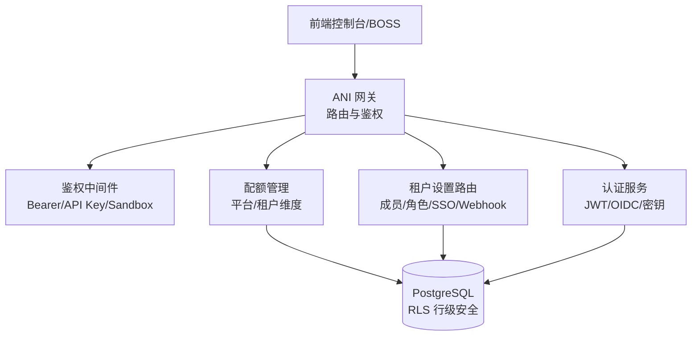
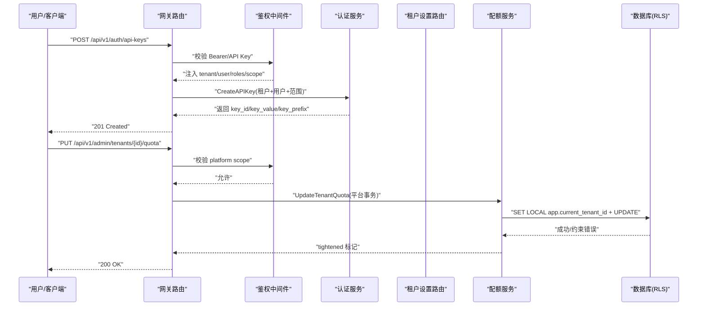
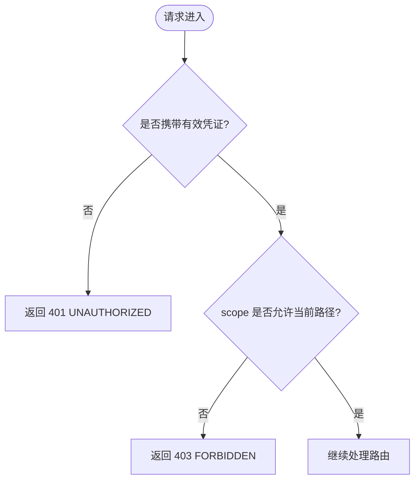
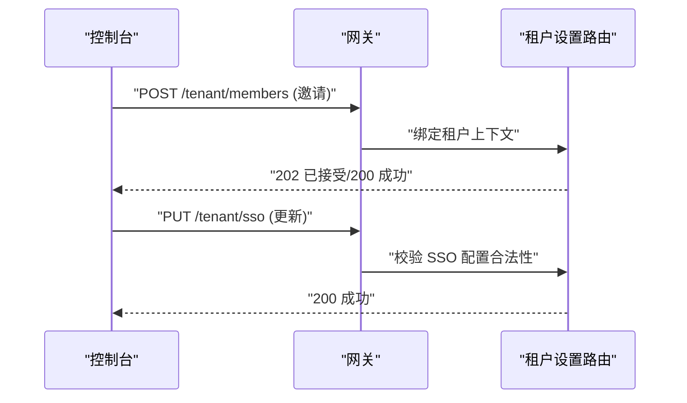
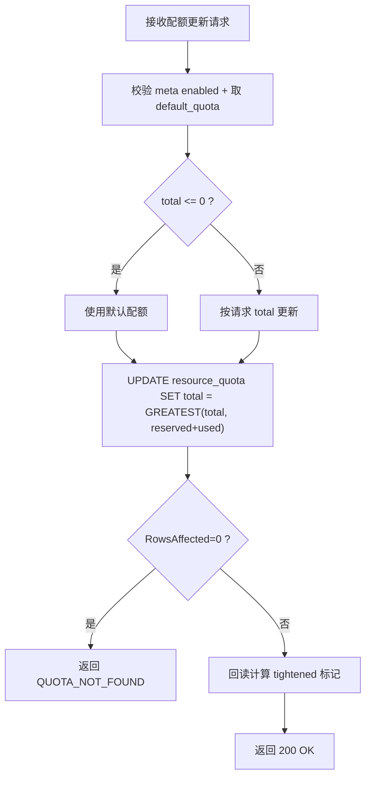
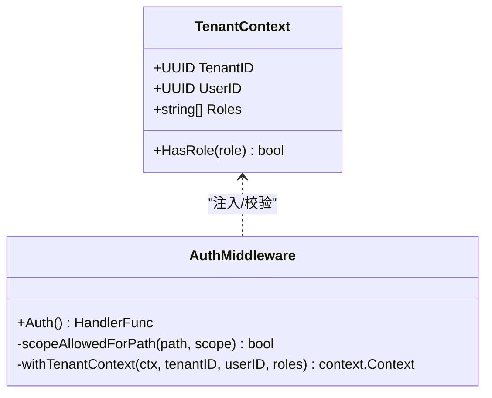
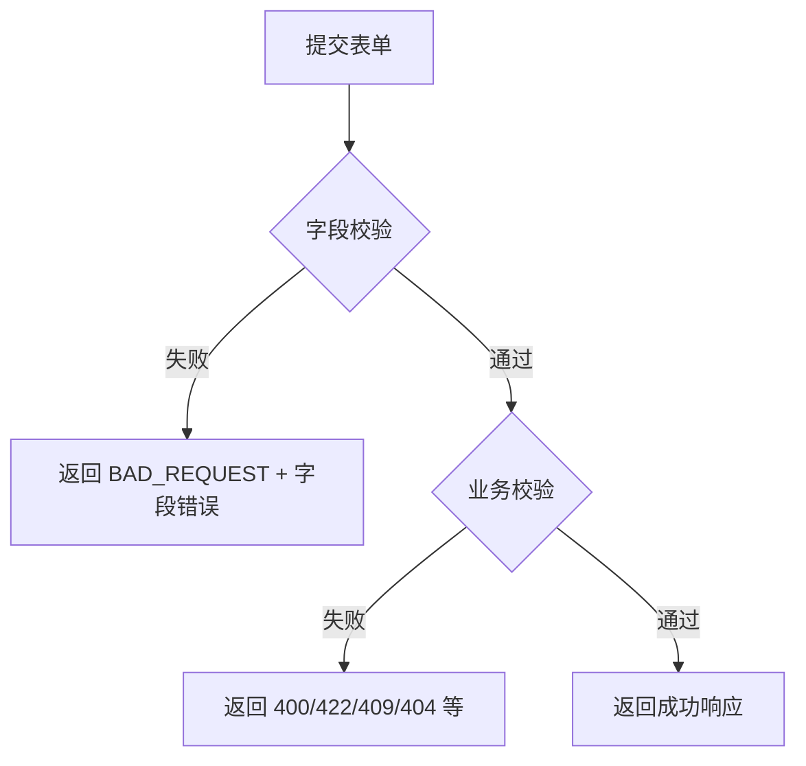
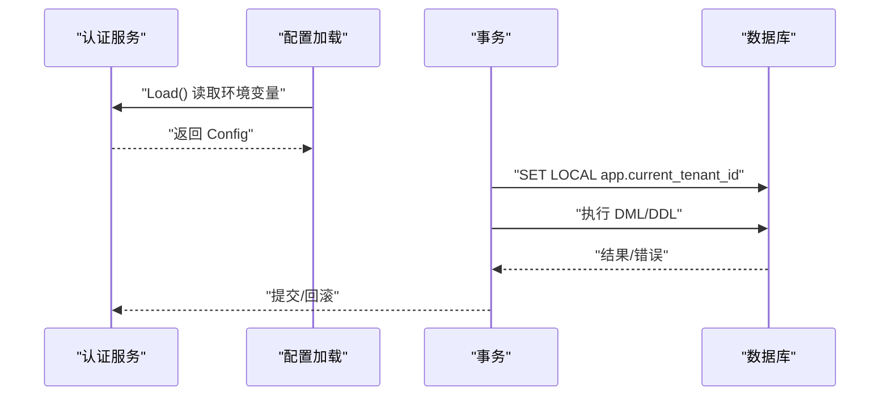
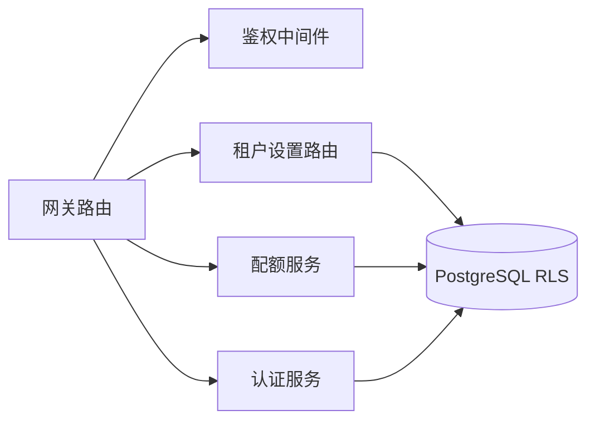

# 设置管理模块

<cite>
**本文引用的文件**
- [auth.go](file://repo/services/ani-gateway/internal/router/auth.go)
- [auth.go](file://repo/services/ani-gateway/internal/middleware/auth.go)
- [config.go](file://repo/services/auth-service/internal/config/config.go)
- [tenant.go](file://repo/pkg/types/tenant.go)
- [tenant_resources.go](file://repo/services/ani-gateway/internal/router/tenant_resources.go)
- [spec-console-tenant-management.md](file://repo/services/tasks/modules/spec/console/tenant/spec-console-tenant-management.md)
- [spec-quota-service.md](file://repo/services/tasks/modules/spec/core/quota/spec-quota-service.md)
- [rls.py](file://repo/services/kb-service/app/repositories/rls.py)
- [client.py](file://repo/sdks/core/python/kubercloud_ani_core/client.py)
- [client.py](file://repo/sdks/services/python/kubercloud_ani_services/client.py)
</cite>

## 目录
1. [简介](#简介)
2. [项目结构](#项目结构)
3. [核心组件](#核心组件)
4. [架构总览](#架构总览)
5. [详细组件分析](#详细组件分析)
6. [依赖关系分析](#依赖关系分析)
7. [性能与一致性考虑](#性能与一致性考虑)
8. [故障排查指南](#故障排查指南)
9. [结论](#结论)
10. [附录](#附录)

## 简介
本模块聚焦平台级“设置管理”，涵盖：
- 平台设置与安全策略（认证、令牌、API 密钥）
- 多租户配置（成员、角色、SSO、Webhook）
- 用户权限与访问控制（scope、RLS、路径白名单）
- 系统参数与配额管理（资源维度、限额、元数据）
- 表单设计、校验规则与配置持久化机制

该文档面向产品、前端、后端与运维读者，提供从界面到服务、从鉴权到存储的端到端说明。

## 项目结构
设置管理相关能力分布在网关路由、鉴权中间件、认证服务配置、租户资源路由以及配额服务规范中：
- 网关路由负责暴露设置类 API（认证、API 密钥、租户设置等）
- 鉴权中间件统一处理 Bearer Token、API Key、沙箱令牌及 scope 路由隔离
- 认证服务通过环境变量加载安全相关配置（JWT/OIDC）
- 租户资源路由提供成员、角色、SSO、Webhook 等设置入口
- 配额服务规范定义平台级配额管理与 RLS 安全边界

**图表来源**
- [auth.go:102-113](file://repo/services/ani-gateway/internal/router/auth.go#L102-L113)
- [auth.go:214-229](file://repo/services/ani-gateway/internal/middleware/auth.go#L214-L229)
- [config.go:28-53](file://repo/services/auth-service/internal/config/config.go#L28-L53)
- [tenant_resources.go:12-22](file://repo/services/ani-gateway/internal/router/tenant_resources.go#L12-L22)
- [spec-quota-service.md:666-762](file://repo/services/tasks/modules/spec/core/quota/spec-quota-service.md#L666-L762)

**章节来源**
- [auth.go:102-113](file://repo/services/ani-gateway/internal/router/auth.go#L102-L113)
- [auth.go:214-229](file://repo/services/ani-gateway/internal/middleware/auth.go#L214-L229)
- [config.go:28-53](file://repo/services/auth-service/internal/config/config.go#L28-L53)
- [tenant_resources.go:12-22](file://repo/services/ani-gateway/internal/router/tenant_resources.go#L12-L22)
- [spec-quota-service.md:666-762](file://repo/services/tasks/modules/spec/core/quota/spec-quota-service.md#L666-L762)

## 核心组件
- 鉴权中间件：统一解析请求身份，注入租户上下文，执行 scope 路由隔离
- 认证路由：账号密码登录、OIDC、刷新、登出、API 密钥生命周期
- 租户设置路由：成员邀请/移除、角色列表、SSO 配置、Webhook 管理
- 配额管理：平台/租户维度的配额元数据与限额维护，基于 RLS 的安全隔离
- 配置加载：认证服务通过环境变量加载 JWT/OIDC 等关键配置

**章节来源**
- [auth.go:22-141](file://repo/services/ani-gateway/internal/middleware/auth.go#L22-L141)
- [auth.go:102-113](file://repo/services/ani-gateway/internal/router/auth.go#L102-L113)
- [tenant_resources.go:12-22](file://repo/services/ani-gateway/internal/router/tenant_resources.go#L12-L22)
- [spec-quota-service.md:666-762](file://repo/services/tasks/modules/spec/core/quota/spec-quota-service.md#L666-L762)
- [config.go:28-53](file://repo/services/auth-service/internal/config/config.go#L28-L53)

## 架构总览
设置管理的请求在网关层完成鉴权与路由分发，随后进入具体业务服务或调用认证服务。所有写操作均受 scope 与 RLS 双重保护。

**图表来源**
- [auth.go:287-318](file://repo/services/ani-gateway/internal/router/auth.go#L287-L318)
- [auth.go:398-474](file://repo/services/ani-gateway/internal/router/auth.go#L398-L474)
- [auth.go:214-229](file://repo/services/ani-gateway/internal/middleware/auth.go#L214-L229)
- [spec-quota-service.md:677-711](file://repo/services/tasks/modules/spec/core/quota/spec-quota-service.md#L677-L711)
- [rls.py:16-32](file://repo/services/kb-service/app/repositories/rls.py#L16-L32)

## 详细组件分析

### 认证与 API 密钥管理
- 支持账号密码登录、平台密码登录、OIDC 流程、刷新与注销
- API 密钥创建、列出、撤销；支持名称、作用域、速率限制、过期时间
- 鉴权中间件支持 Bearer Token、API Key、沙箱令牌三种方式，并强制 scope 路由隔离
- 错误码与消息统一映射，便于前端展示与排障

**图表来源**
- [auth.go:22-141](file://repo/services/ani-gateway/internal/middleware/auth.go#L22-L141)
- [auth.go:214-229](file://repo/services/ani-gateway/internal/middleware/auth.go#L214-L229)

**章节来源**
- [auth.go:102-113](file://repo/services/ani-gateway/internal/router/auth.go#L102-L113)
- [auth.go:287-318](file://repo/services/ani-gateway/internal/router/auth.go#L287-L318)
- [auth.go:398-474](file://repo/services/ani-gateway/internal/router/auth.go#L398-L474)
- [auth.go:22-141](file://repo/services/ani-gateway/internal/middleware/auth.go#L22-L141)
- [auth.go:214-229](file://repo/services/ani-gateway/internal/middleware/auth.go#L214-L229)

### 多租户配置（成员、角色、SSO、Webhook）
- 成员邀请/移除、角色列表、SSO 配置读取与更新、Webhook 增删改查
- 所有租户设置接口均在租户上下文中执行，确保数据隔离
- 前端 SDK 已声明这些路径，便于 Console/BOSS 集成

**图表来源**
- [tenant_resources.go:12-22](file://repo/services/ani-gateway/internal/router/tenant_resources.go#L12-L22)
- [spec-console-tenant-management.md:1-33](file://repo/services/tasks/modules/spec/console/tenant/spec-console-tenant-management.md#L1-L33)
- [client.py:165-201](file://repo/sdks/services/python/kubercloud_ani_services/client.py#L165-L201)

**章节来源**
- [tenant_resources.go:12-22](file://repo/services/ani-gateway/internal/router/tenant_resources.go#L12-L22)
- [spec-console-tenant-management.md:1-33](file://repo/services/tasks/modules/spec/console/tenant/spec-console-tenant-management.md#L1-L33)
- [client.py:165-201](file://repo/sdks/services/python/kubercloud_ani_services/client.py#L165-L201)

### 配额管理（平台与租户维度）
- 平台管理员可批量创建/更新/删除租户配额，查询可用维度元数据
- 使用平台事务 WithPlatformTx，结合 RLS 防止越权
- 缩容时自动 clamp 至 reserved+used，避免非法状态
- 失败模式明确：PG 连接断开回滚、RLS 拒绝透传、CHECK 约束违反透传

**图表来源**
- [spec-quota-service.md:677-711](file://repo/services/tasks/modules/spec/core/quota/spec-quota-service.md#L677-L711)
- [spec-quota-service.md:814-846](file://repo/services/tasks/modules/spec/core/quota/spec-quota-service.md#L814-L846)

**章节来源**
- [spec-quota-service.md:666-762](file://repo/services/tasks/modules/spec/core/quota/spec-quota-service.md#L666-L762)
- [spec-quota-service.md:814-846](file://repo/services/tasks/modules/spec/core/quota/spec-quota-service.md#L814-L846)

### 安全策略与权限控制
- 路径级 scope 白名单：/auth/platform/*、/platform/*、/admin/* 仅 platform scope
- 沙箱令牌仅允许访问实例子资源 /instances/{id}/sandbox/*
- API Key 默认 tenant scope，禁止访问平台端点
- 租户上下文通过 TenantContext 注入，DB 层通过 RLS 强制隔离

**图表来源**
- [tenant.go:17-73](file://repo/pkg/types/tenant.go#L17-L73)
- [auth.go:214-229](file://repo/services/ani-gateway/internal/middleware/auth.go#L214-L229)
- [auth.go:160-197](file://repo/services/ani-gateway/internal/middleware/auth.go#L160-L197)

**章节来源**
- [tenant.go:17-73](file://repo/pkg/types/tenant.go#L17-L73)
- [auth.go:214-229](file://repo/services/ani-gateway/internal/middleware/auth.go#L214-L229)
- [auth.go:160-197](file://repo/services/ani-gateway/internal/middleware/auth.go#L160-L197)

### 表单设计与验证规则
- 登录表单：租户标识、用户名、密码必填；错误信息通过字段级 error 提示
- OIDC 表单：租户名、回调地址必填；错误映射为 BAD_REQUEST
- API 密钥表单：名称必填；user_id 可选但存在时必须非空；expires_at 需 RFC3339
- 租户设置表单：SSO 配置需合法；Webhook URL 可达且 secret 已配置（建议 422）

**图表来源**
- [auth.go:116-174](file://repo/services/ani-gateway/internal/router/auth.go#L116-L174)
- [auth.go:320-382](file://repo/services/ani-gateway/internal/router/auth.go#L320-L382)
- [auth.go:398-474](file://repo/services/ani-gateway/internal/router/auth.go#L398-L474)
- [spec-console-tenant-management.md:21-29](file://repo/services/tasks/modules/spec/console/tenant/spec-console-tenant-management.md#L21-L29)

**章节来源**
- [auth.go:116-174](file://repo/services/ani-gateway/internal/router/auth.go#L116-L174)
- [auth.go:320-382](file://repo/services/ani-gateway/internal/router/auth.go#L320-L382)
- [auth.go:398-474](file://repo/services/ani-gateway/internal/router/auth.go#L398-L474)
- [spec-console-tenant-management.md:21-29](file://repo/services/tasks/modules/spec/console/tenant/spec-console-tenant-management.md#L21-L29)

### 配置持久化机制
- 认证服务配置通过环境变量加载（JWT/OIDC/端口/URL），支持 PEM/文件双模式
- 租户上下文在事务内通过 SET LOCAL 设置 app.current_tenant_id，确保 RLS 生效且不泄漏
- 配额管理使用平台事务 WithPlatformTx，保证跨表操作的原子性与一致性

**图表来源**
- [config.go:28-53](file://repo/services/auth-service/internal/config/config.go#L28-L53)
- [rls.py:16-32](file://repo/services/kb-service/app/repositories/rls.py#L16-L32)
- [spec-quota-service.md:745-762](file://repo/services/tasks/modules/spec/core/quota/spec-quota-service.md#L745-L762)

**章节来源**
- [config.go:28-53](file://repo/services/auth-service/internal/config/config.go#L28-L53)
- [rls.py:16-32](file://repo/services/kb-service/app/repositories/rls.py#L16-L32)
- [spec-quota-service.md:745-762](file://repo/services/tasks/modules/spec/core/quota/spec-quota-service.md#L745-L762)

## 依赖关系分析
- 网关路由依赖鉴权中间件进行身份与权限校验
- 认证路由依赖认证服务实现令牌签发与密钥管理
- 租户设置路由依赖租户上下文与 RLS 保障数据隔离
- 配额服务依赖平台事务与 RLS，确保跨租户安全与一致性

**图表来源**
- [auth.go:102-113](file://repo/services/ani-gateway/internal/router/auth.go#L102-L113)
- [auth.go:214-229](file://repo/services/ani-gateway/internal/middleware/auth.go#L214-L229)
- [tenant_resources.go:12-22](file://repo/services/ani-gateway/internal/router/tenant_resources.go#L12-L22)
- [spec-quota-service.md:666-762](file://repo/services/tasks/modules/spec/core/quota/spec-quota-service.md#L666-L762)

**章节来源**
- [auth.go:102-113](file://repo/services/ani-gateway/internal/router/auth.go#L102-L113)
- [auth.go:214-229](file://repo/services/ani-gateway/internal/middleware/auth.go#L214-L229)
- [tenant_resources.go:12-22](file://repo/services/ani-gateway/internal/router/tenant_resources.go#L12-L22)
- [spec-quota-service.md:666-762](file://repo/services/tasks/modules/spec/core/quota/spec-quota-service.md#L666-L762)

## 性能与一致性考虑
- 鉴权中间件对公共路径免检，减少不必要开销
- 沙箱令牌本地校验，降低认证服务压力
- 配额更新采用 clamp 策略与紧凑回读，避免并发冲突导致的状态不一致
- RLS 在数据库层强制隔离，减少应用层过滤成本

[本节为通用指导，不直接分析具体文件]

## 故障排查指南
- 401 未授权：检查 Authorization 头或 X-API-Key 是否正确；确认 token/key 未过期
- 403 禁止访问：确认 scope 是否匹配路径白名单；API Key 无法访问平台端点
- 400 请求错误：检查必填字段与格式（如 expires_at 必须 RFC3339）
- 404 未找到：租户或配额不存在；检查路径参数与 ID
- 422 前置条件失败：SSO/Webhook 配置不合法或不可达
- 503 服务不可用：认证服务不可用或数据库连接异常

**章节来源**
- [auth.go:157-174](file://repo/services/ani-gateway/internal/router/auth.go#L157-L174)
- [auth.go:214-229](file://repo/services/ani-gateway/internal/middleware/auth.go#L214-L229)
- [auth.go:320-382](file://repo/services/ani-gateway/internal/router/auth.go#L320-L382)
- [auth.go:398-474](file://repo/services/ani-gateway/internal/router/auth.go#L398-L474)
- [spec-console-tenant-management.md:21-29](file://repo/services/tasks/modules/spec/console/tenant/spec-console-tenant-management.md#L21-L29)

## 结论
设置管理模块通过统一的鉴权中间件与清晰的路由划分，实现了平台级安全策略、多租户配置与配额管理的闭环。API 密钥的全生命周期、租户设置的 CRUD、以及配额的平台/租户双维度管理，均以 RLS 与 scope 作为安全基石。建议在后续迭代中完善前端表单校验与错误提示，提升用户体验与可观测性。

[本节为总结，不直接分析具体文件]

## 附录
- 常用 API 路径参考（Core SDK）：包含 /auth/api-keys、/admin/tenants/{tenant_id}/reservations 等
- 常用 API 路径参考（Services SDK）：包含 /tenant/members、/tenant/roles、/tenant/sso、/tenant/webhooks 等

**章节来源**
- [client.py:227-264](file://repo/sdks/core/python/kubercloud_ani_core/client.py#L227-L264)
- [client.py:165-201](file://repo/sdks/services/python/kubercloud_ani_services/client.py#L165-L201)