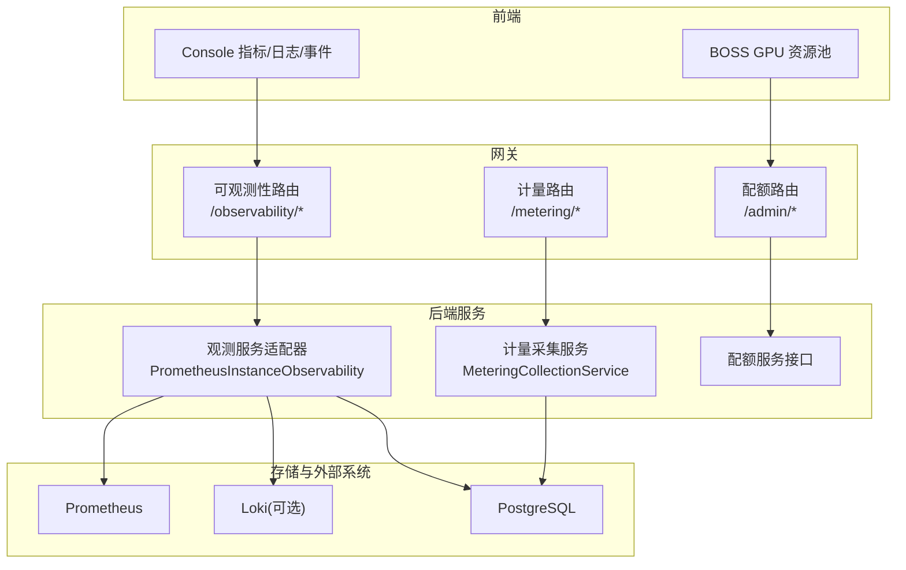
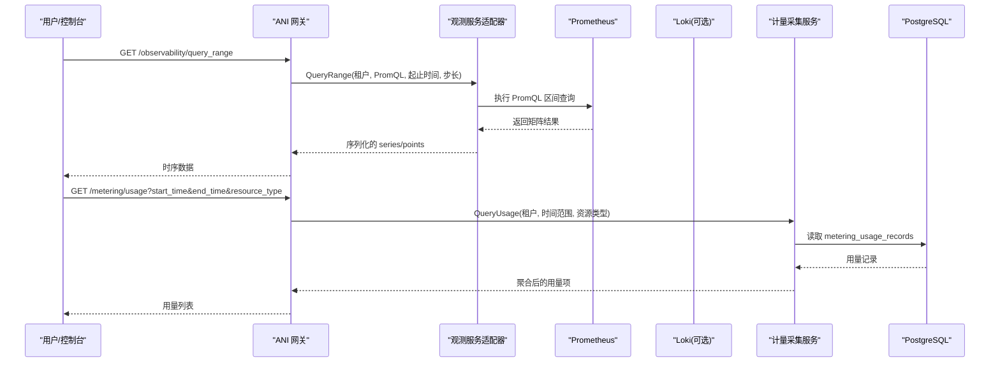
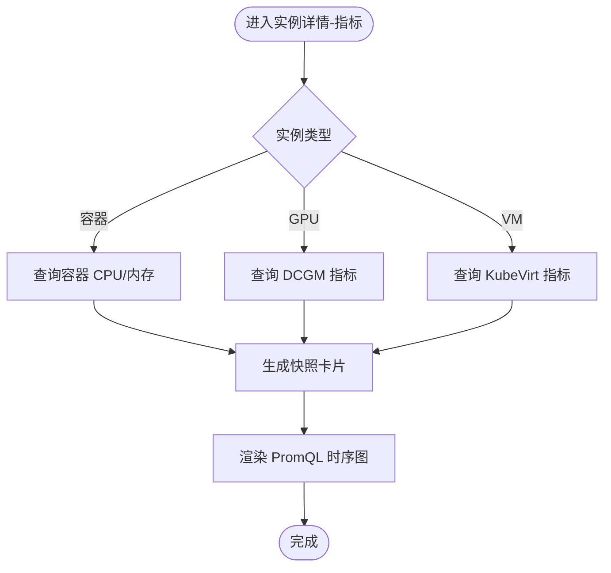
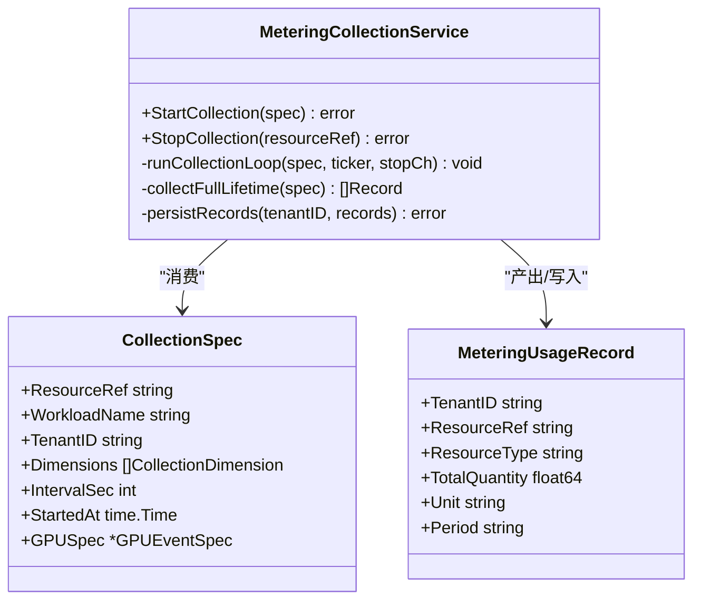
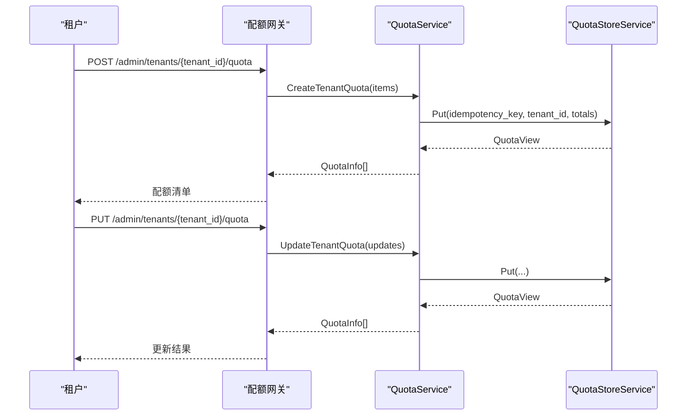
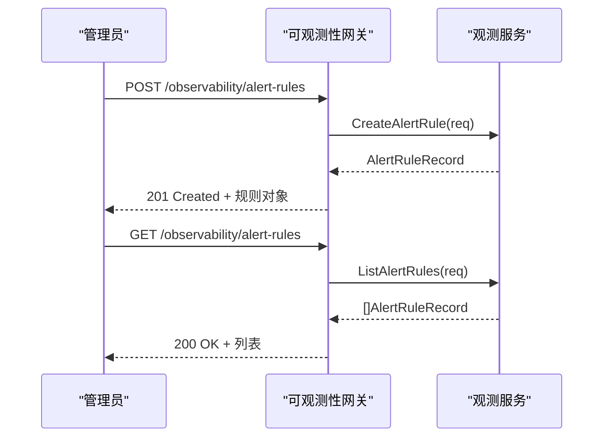
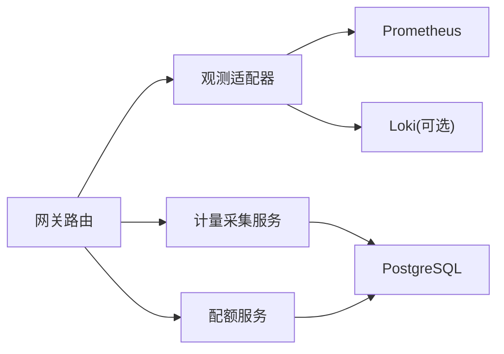

# 资源使用监控模块

<cite>
**本文引用的文件**
- [ports/metering.go](file://repo/pkg/ports/metering.go)
- [ports/observability.go](file://repo/pkg/ports/observability.go)
- [ports/quota.go](file://repo/pkg/ports/quota.go)
- [services/ani-gateway/internal/router/observability.go](file://repo/services/ani-gateway/internal/router/observability.go)
- [services/ani-gateway/internal/router/metering_resources.go](file://repo/services/ani-gateway/internal/router/metering_resources.go)
- [services/ani-gateway/internal/router/quota_resources.go](file://repo/services/ani-gateway/internal/router/quota_resources.go)
- [services/metering-service/internal/service/metering_collection_service.go](file://repo/services/metering-service/internal/service/metering_collection_service.go)
- [pkg/adapters/runtime/prometheus_instance_observability.go](file://repo/pkg/adapters/runtime/prometheus_instance_observability.go)
- [pkg/adapters/runtime/local_instance_observability_service.go](file://repo/pkg/adapters/runtime/local_instance_observability_service.go)
- [development-records/console-instance-observability-metrics-a.md](file://repo/development-records/console-instance-observability-metrics-a.md)
- [services/tasks/modules/spec/console/compute/spec-console-instance-observability-completion.md](file://repo/services/tasks/modules/spec/console/compute/spec-console-instance-observability-completion.md)
</cite>

## 目录
1. [简介](#简介)
2. [项目结构](#项目结构)
3. [核心组件](#核心组件)
4. [架构总览](#架构总览)
5. [详细组件分析](#详细组件分析)
6. [依赖关系分析](#依赖关系分析)
7. [性能考虑](#性能考虑)
8. [故障排查指南](#故障排查指南)
9. [结论](#结论)
10. [附录](#附录)

## 简介
本模块提供对 CPU、内存、GPU 等资源的实时监控与统计分析能力，覆盖以下方面：
- 指标采集与聚合：通过 Prometheus 与 DCGM exporter 采集容器、VM、GPU 的 CPU/内存/GPU 利用率与显存使用情况。
- 仪表板与可视化：Console 端提供“实例详情-指标”Tab，包含快照卡片与 PromQL 时序图；BOSS 端提供 GPU 资源池概览。
- 计量与成本：周期化采集并持久化用量记录，支持按租户、资源类型、时间范围查询用量，为计费与成本分析提供数据基础。
- 配额管理：提供租户级资源配额定义、预占与释放流程（TCC），以及配额元数据查询。
- 告警规则：支持创建、查询、更新、删除基于 PromQL 的告警规则，便于阈值告警与异常检测。
- 历史数据查询：提供观测数据的瞬时与区间查询接口，供前端渲染趋势图与报表。

## 项目结构
资源使用监控相关代码主要分布在如下位置：
- 端口契约定义：pkg/ports/*（计量、观测、配额）
- 网关路由与协议转换：services/ani-gateway/internal/router/*
- 采集服务：services/metering-service/internal/service/*
- 运行时适配器：pkg/adapters/runtime/*（Prometheus 与本地模拟实现）
- Console/BOSS 前端与规格文档：frontends/console 与 services/tasks/modules/spec/*

图表来源
- [services/ani-gateway/internal/router/observability.go:95-103](file://repo/services/ani-gateway/internal/router/observability.go#L95-L103)
- [services/ani-gateway/internal/router/metering_resources.go:65-69](file://repo/services/ani-gateway/internal/router/metering_resources.go#L65-L69)
- [services/ani-gateway/internal/router/quota_resources.go:21-28](file://repo/services/ani-gateway/internal/router/quota_resources.go#L21-L28)
- [pkg/adapters/runtime/prometheus_instance_observability.go:88-101](file://repo/pkg/adapters/runtime/prometheus_instance_observability.go#L88-L101)
- [services/metering-service/internal/service/metering_collection_service.go:195-237](file://repo/services/metering-service/internal/service/metering_collection_service.go#L195-L237)

章节来源
- [services/ani-gateway/internal/router/observability.go:95-103](file://repo/services/ani-gateway/internal/router/observability.go#L95-L103)
- [services/ani-gateway/internal/router/metering_resources.go:65-69](file://repo/services/ani-gateway/internal/router/metering_resources.go#L65-L69)
- [services/ani-gateway/internal/router/quota_resources.go:21-28](file://repo/services/ani-gateway/internal/router/quota_resources.go#L21-L28)

## 核心组件
- 观测端口与网关
  - 观测端口定义了瞬时查询、区间查询与告警规则的请求/响应模型。
  - 网关暴露 /observability/query、/observability/query_range 及告警规则 CRUD 路由。
- 计量端口与网关
  - 计量端口定义了资源类型、用量记录、Token 用量上报与周期采集规格。
  - 网关暴露 /metering/usage 查询与 /metering/token-usage 上报。
- 配额端口与网关
  - 配额端口定义了资源类型、预占/确认/取消/释放流程与租户配额视图。
  - 网关暴露租户配额管理与配额元数据查询的管理端点。
- 运行时适配器
  - PrometheusInstanceObservability：根据实例 kind 选择不同指标源（容器、GPU、VM），支持日志持久化（Loki）或 K8s Pod 日志回退。
  - LocalInstanceObservability：开发/本地环境下的模拟实现。
- 计量采集服务
  - MeteringCollectionService：按资源维度周期采集、幂等写入用量记录，并在停止时进行全生命周期补采。

章节来源
- [ports/observability.go:33-81](file://repo/pkg/ports/observability.go#L33-L81)
- [ports/metering.go:8-112](file://repo/pkg/ports/metering.go#L8-L112)
- [ports/quota.go:8-102](file://repo/pkg/ports/quota.go#L8-L102)
- [services/ani-gateway/internal/router/observability.go:95-103](file://repo/services/ani-gateway/internal/router/observability.go#L95-L103)
- [services/ani-gateway/internal/router/metering_resources.go:65-69](file://repo/services/ani-gateway/internal/router/metering_resources.go#L65-L69)
- [services/ani-gateway/internal/router/quota_resources.go:21-28](file://repo/services/ani-gateway/internal/router/quota_resources.go#L21-L28)
- [pkg/adapters/runtime/prometheus_instance_observability.go:88-101](file://repo/pkg/adapters/runtime/prometheus_instance_observability.go#L88-L101)
- [pkg/adapters/runtime/local_instance_observability_service.go:72-97](file://repo/pkg/adapters/runtime/local_instance_observability_service.go#L72-L97)
- [services/metering-service/internal/service/metering_collection_service.go:51-157](file://repo/services/metering-service/internal/service/metering_collection_service.go#L51-L157)

## 架构总览
观测与计量在网关层解耦，通过端口契约对接运行时适配器与采集服务，最终落盘至数据库或查询外部时序系统。

图表来源
- [services/ani-gateway/internal/router/observability.go:118-154](file://repo/services/ani-gateway/internal/router/observability.go#L118-L154)
- [services/ani-gateway/internal/router/metering_resources.go:71-94](file://repo/services/ani-gateway/internal/router/metering_resources.go#L71-L94)
- [services/metering-service/internal/service/metering_collection_service.go:195-237](file://repo/services/metering-service/internal/service/metering_collection_service.go#L195-L237)

## 详细组件分析

### 观测子系统（CPU/内存/GPU/日志）
- 指标采集策略
  - 容器：通过 cAdvisor/metrics.k8s.io 获取 CPU 与内存。
  - GPU：通过 DCGM exporter 获取 GPU 利用率与显存 used/free，total 由 free+used 推导。
  - VM：通过 KubeVirt 指标获取 CPU 与内存使用率，网络 RX/TX。
- 日志采集策略
  - 优先从 Loki 等持久化日志存储查询（可通过环境变量注入 LogStore）。
  - 未配置时回退到 K8s Pod 日志 API。
- 前端展示
  - Console 指标 Tab：快照卡片 + PromQL 时序图；支持 15m/1h/6h/24h 时间范围；null 字段显示“暂不可用”。
  - BOSS GPU 资源池：集群级 KPI、型号分布、节点列表、异常设备、调度队列只读。

图表来源
- [services/tasks/modules/spec/console/compute/spec-console-instance-observability-completion.md:140-157](file://repo/services/tasks/modules/spec/console/compute/spec-console-instance-observability-completion.md#L140-L157)
- [services/tasks/modules/spec/console/compute/spec-console-instance-observability-completion.md:558-634](file://repo/services/tasks/modules/spec/console/compute/spec-console-instance-observability-completion.md#L558-L634)
- [development-records/console-instance-observability-metrics-a.md:11-49](file://repo/development-records/console-instance-observability-metrics-a.md#L11-L49)

章节来源
- [pkg/adapters/runtime/prometheus_instance_observability.go:88-101](file://repo/pkg/adapters/runtime/prometheus_instance_observability.go#L88-L101)
- [pkg/adapters/runtime/prometheus_instance_observability.go:155-166](file://repo/pkg/adapters/runtime/prometheus_instance_observability.go#L155-L166)
- [services/tasks/modules/spec/console/compute/spec-console-instance-observability-completion.md:140-157](file://repo/services/tasks/modules/spec/console/compute/spec-console-instance-observability-completion.md#L140-L157)
- [development-records/console-instance-observability-metrics-a.md:11-49](file://repo/development-records/console-instance-observability-metrics-a.md#L11-L49)

### 计量子系统（用量采集与查询）
- 采集规格
  - CollectionSpec 描述资源引用、工作负载名称、租户、维度集合、采集间隔、起始时间与 GPU 规格。
  - 支持 instance_cpu_seconds、instance_memory_gib_seconds、instance_gpu_seconds、token_input/output/total 等资源类型。
- 周期采集
  - 每个资源维护独立 ticker，周期性调用 CollectAll 采集并持久化。
  - 失败不中断，仅记录错误日志并继续下一周期。
- 持久化
  - 使用专用角色绕过 RLS 写入 metering_usage_records，INSERT 使用 ON CONFLICT DO NOTHING 保证幂等。
- 停止与补采
  - StopCollection 会关闭 ticker，若从未产出过周期记录则计算全生命周期用量并补写一次。

图表来源
- [ports/metering.go:83-112](file://repo/pkg/ports/metering.go#L83-L112)
- [services/metering-service/internal/service/metering_collection_service.go:21-49](file://repo/services/metering-service/internal/service/metering_collection_service.go#L21-L49)
- [services/metering-service/internal/service/metering_collection_service.go:159-193](file://repo/services/metering-service/internal/service/metering_collection_service.go#L159-L193)
- [services/metering-service/internal/service/metering_collection_service.go:195-237](file://repo/services/metering-service/internal/service/metering_collection_service.go#L195-L237)

章节来源
- [ports/metering.go:8-112](file://repo/pkg/ports/metering.go#L8-L112)
- [services/metering-service/internal/service/metering_collection_service.go:51-157](file://repo/services/metering-service/internal/service/metering_collection_service.go#L51-L157)
- [services/metering-service/internal/service/metering_collection_service.go:159-237](file://repo/services/metering-service/internal/service/metering_collection_service.go#L159-L237)

### 配额子系统（资源配额管理）
- 资源类型
  - gpu_count、cpu_core、memory_gb、storage_gb、token_count、kb_query_count、member_count、inference_service_count。
- 预占流程（TCC）
  - Try/TryMany：尝试预占指定资源数量，返回预留事务 ID 与过期时间。
  - Confirm/Cancel/Release：在业务事务中确认、取消或释放预留。
- 管理端点
  - 创建/更新/获取/删除租户配额。
  - 列出配额元数据（单位、默认值、是否离散等）。

图表来源
- [ports/quota.go:8-102](file://repo/pkg/ports/quota.go#L8-L102)
- [services/ani-gateway/internal/router/quota_resources.go:21-28](file://repo/services/ani-gateway/internal/router/quota_resources.go#L21-L28)
- [services/ani-gateway/internal/router/quota_resources.go:85-165](file://repo/services/ani-gateway/internal/router/quota_resources.go#L85-L165)

章节来源
- [ports/quota.go:8-102](file://repo/pkg/ports/quota.go#L8-L102)
- [services/ani-gateway/internal/router/quota_resources.go:21-28](file://repo/services/ani-gateway/internal/router/quota_resources.go#L21-L28)
- [services/ani-gateway/internal/router/quota_resources.go:85-165](file://repo/services/ani-gateway/internal/router/quota_resources.go#L85-L165)

### 告警规则（PromQL 驱动）
- 能力
  - 创建、查询、获取、更新、删除告警规则。
  - 规则包含 PromQL、持续时间、严重级别、标签、注解、启用状态。
- 网关处理
  - 校验 duration、severity 等字段，映射为端口请求后调用服务层。
  - 统一错误映射（NOT_FOUND、BAD_REQUEST 等）。

图表来源
- [services/ani-gateway/internal/router/observability.go:156-254](file://repo/services/ani-gateway/internal/router/observability.go#L156-L254)
- [ports/observability.go:83-143](file://repo/pkg/ports/observability.go#L83-L143)

章节来源
- [services/ani-gateway/internal/router/observability.go:156-254](file://repo/services/ani-gateway/internal/router/observability.go#L156-L254)
- [ports/observability.go:83-143](file://repo/pkg/ports/observability.go#L83-L143)

## 依赖关系分析
- 耦合与内聚
  - 网关层仅负责协议转换与参数校验，核心逻辑下沉至端口与服务实现，保持高内聚低耦合。
  - 观测适配器通过 LogStore 注入点实现日志存储的可插拔（Loki/K8s 回退）。
- 直接/间接依赖
  - 观测适配器依赖 Prometheus/Loki/K8s API。
  - 计量采集服务依赖 PostgreSQL 直连（特定角色）与外部 Collector（PR-M2 接入）。
- 外部集成点
  - Prometheus：指标采集与查询。
  - Loki：日志持久化查询（可选）。
  - PostgreSQL：用量记录与配额元数据存储。

图表来源
- [services/ani-gateway/internal/router/observability.go:95-103](file://repo/services/ani-gateway/internal/router/observability.go#L95-L103)
- [services/ani-gateway/internal/router/metering_resources.go:65-69](file://repo/services/ani-gateway/internal/router/metering_resources.go#L65-L69)
- [services/ani-gateway/internal/router/quota_resources.go:21-28](file://repo/services/ani-gateway/internal/router/quota_resources.go#L21-L28)
- [pkg/adapters/runtime/prometheus_instance_observability.go:88-101](file://repo/pkg/adapters/runtime/prometheus_instance_observability.go#L88-L101)
- [services/metering-service/internal/service/metering_collection_service.go:195-237](file://repo/services/metering-service/internal/service/metering_collection_service.go#L195-L237)

章节来源
- [services/ani-gateway/internal/router/observability.go:95-103](file://repo/services/ani-gateway/internal/router/observability.go#L95-L103)
- [services/ani-gateway/internal/router/metering_resources.go:65-69](file://repo/services/ani-gateway/internal/router/metering_resources.go#L65-L69)
- [services/ani-gateway/internal/router/quota_resources.go:21-28](file://repo/services/ani-gateway/internal/router/quota_resources.go#L21-L28)
- [pkg/adapters/runtime/prometheus_instance_observability.go:88-101](file://repo/pkg/adapters/runtime/prometheus_instance_observability.go#L88-L101)
- [services/metering-service/internal/service/metering_collection_service.go:195-237](file://repo/services/metering-service/internal/service/metering_collection_service.go#L195-L237)

## 性能考虑
- 指标查询
  - 区间查询需合理设置 step 与时间范围，避免过大窗口导致响应缓慢。
  - 多曲线场景建议分条 useQuery，降低单条失败影响面。
- 采集频率
  - 默认采集间隔 60 秒，可按资源规模调整 IntervalSec。
  - 采集失败不中断循环，但应关注错误日志以定位问题。
- 写入幂等
  - 用量记录写入使用 ON CONFLICT DO NOTHING，避免重复写入造成膨胀。
- 日志查询
  - 优先使用 Loki 持久化日志，减少 K8s API 压力；注意 cursor 分页控制单次加载量。

[本节为通用指导，不直接分析具体文件]

## 故障排查指南
- 指标为空或字段为 null
  - 检查实例 kind 是否正确（gpu_container/container/vm）。
  - 确认对应 exporter（DCGM/KubeVirt/cAdvisor）已就绪且指标可达。
  - Console 对 null 字段显示“暂不可用”，避免误判为 0。
- 时序图为空或报错
  - 检查 PromQL 模板与 label 注入是否正确。
  - 确认 observability 读权限；无权限时前端提示“无权限查看趋势数据”。
- 用量查询无数据
  - 确认采集服务已启动并成功写入 metering_usage_records。
  - 检查数据库角色 ani_metering_writer 权限与连接池配置。
- 告警规则无效
  - 校验 duration、severity 等字段格式。
  - 检查 PromQL 在 Prometheus 中可执行。

章节来源
- [development-records/console-instance-observability-metrics-a.md:11-49](file://repo/development-records/console-instance-observability-metrics-a.md#L11-L49)
- [services/ani-gateway/internal/router/observability.go:338-348](file://repo/services/ani-gateway/internal/router/observability.go#L338-L348)
- [services/metering-service/internal/service/metering_collection_service.go:195-237](file://repo/services/metering-service/internal/service/metering_collection_service.go#L195-L237)

## 结论
本模块通过统一的端口契约与网关路由，将观测、计量与配额能力解耦并标准化，既满足实时指标与日志的可观测性需求，又为用量统计与成本分析提供了可靠的数据基础。告警规则与配额管理进一步增强了平台对资源使用的治理与约束能力。后续可在 PR-M2 阶段完善 CPU/内存维度的 Prometheus 采集，提升计量精度与覆盖面。

[本节为总结性内容，不直接分析具体文件]

## 附录

### 操作指南：告警规则配置
- 创建规则
  - 调用 POST /observability/alert-rules，传入 name、promql、duration、severity、labels、annotations、enabled。
  - 网关校验 duration 与 severity，成功后返回 201 与规则对象。
- 查询规则
  - 调用 GET /observability/alert-rules，支持 limit 与 cursor 分页。
- 更新/删除规则
  - PATCH /observability/alert-rules/:rule_id 更新规则。
  - DELETE /observability/alert-rules/:rule_id 删除规则。

章节来源
- [services/ani-gateway/internal/router/observability.go:156-254](file://repo/services/ani-gateway/internal/router/observability.go#L156-L254)
- [ports/observability.go:83-143](file://repo/pkg/ports/observability.go#L83-L143)

### 操作指南：历史数据查询
- 瞬时查询
  - GET /observability/query?query=...，返回 vector/scalar/string 结果。
- 区间查询
  - GET /observability/query_range?query=&start=<RFC3339>&end=<RFC3339>&step=<duration>，返回 matrix 结果。
- 用量查询
  - GET /metering/usage?start_time=&end_time=&resource_type=&group_by=，返回按周期聚合的用量项。

章节来源
- [services/ani-gateway/internal/router/observability.go:106-154](file://repo/services/ani-gateway/internal/router/observability.go#L106-L154)
- [services/ani-gateway/internal/router/metering_resources.go:71-94](file://repo/services/ani-gateway/internal/router/metering_resources.go#L71-L94)