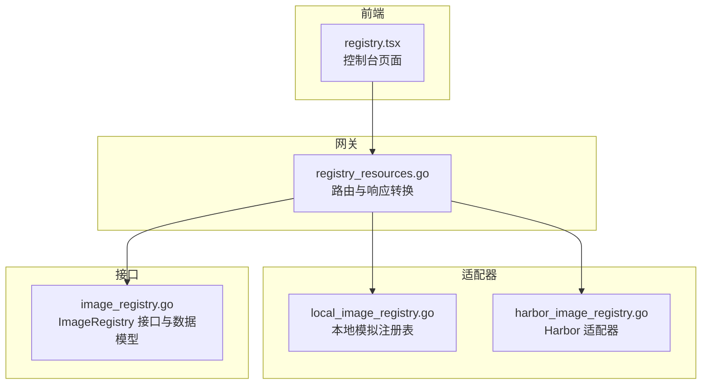
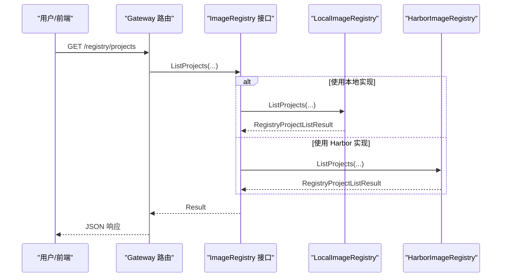
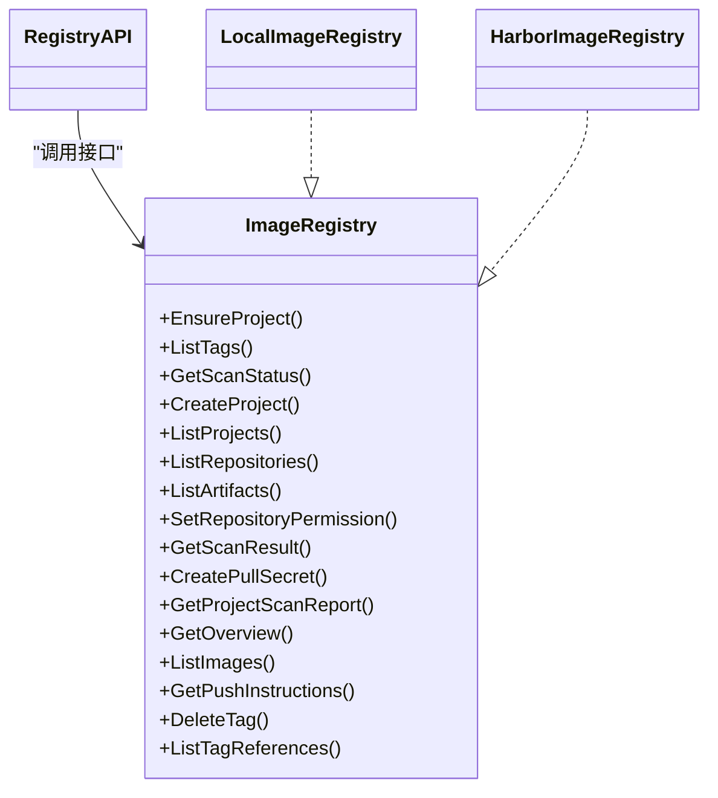
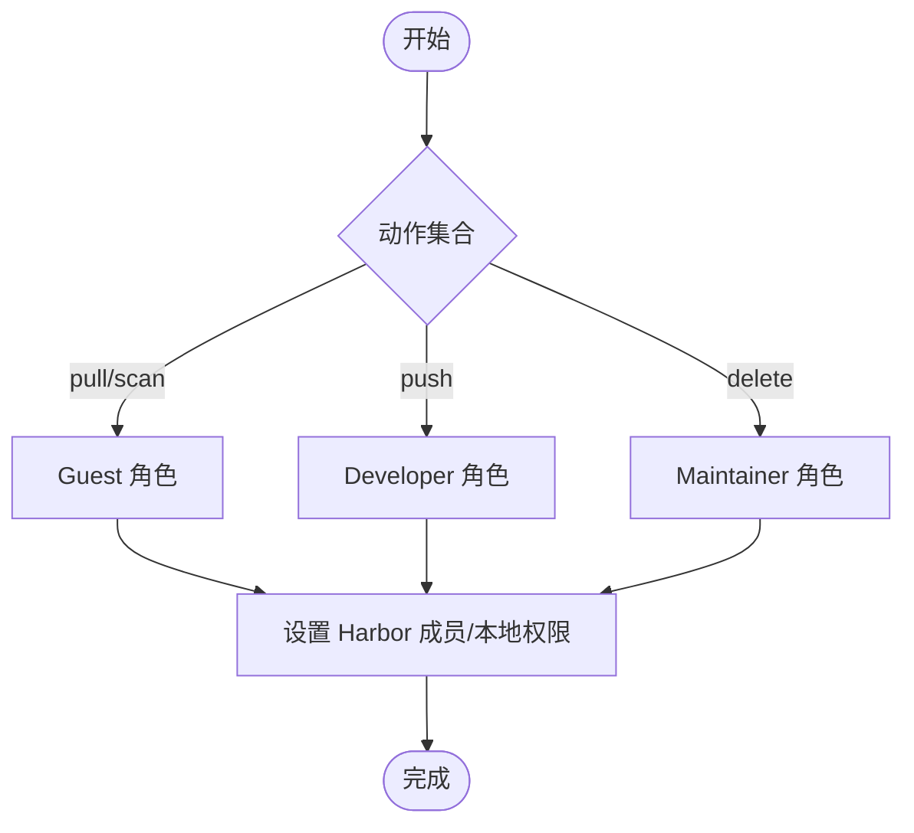
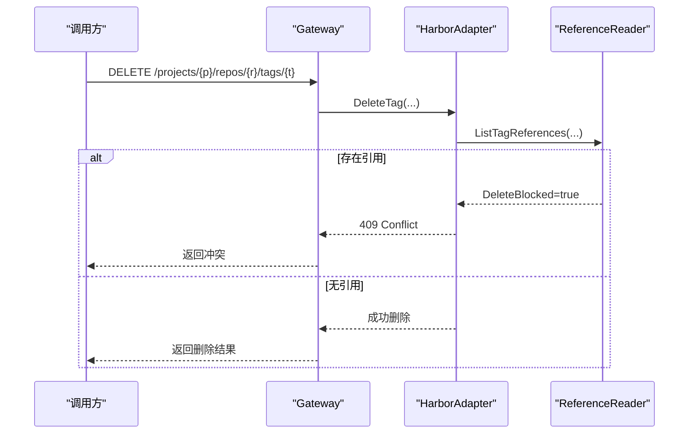

# 镜像注册表模块

<cite>
**本文引用的文件**
- [image_registry.go](file://repo/pkg/ports/image_registry.go)
- [harbor_image_registry.go](file://repo/pkg/adapters/registry/harbor_image_registry.go)
- [local_image_registry.go](file://repo/pkg/adapters/registry/local_image_registry.go)
- [registry_resources.go](file://repo/services/ani-gateway/internal/router/registry_resources.go)
- [harbor.yaml](file://repo/deploy/helm/ani-platform/component-contracts/harbor.yaml)
- [registry.tsx](file://repo/frontends/console/src/routes/_authenticated/registry.tsx)
- [2026-07-21-harbor-registry-provider-design.md](file://docs/superpowers/specs/2026-07-21-harbor-registry-provider-design.md)
- [core-registry-console-flow-core-a.md](file://repo/development-records/core-registry-console-flow-core-a.md)
- [validate_registry_harbor_live_gate.py](file://repo/scripts/validate_registry_harbor_live_gate.py)
</cite>

## 目录
1. [简介](#简介)
2. [项目结构](#项目结构)
3. [核心组件](#核心组件)
4. [架构总览](#架构总览)
5. [详细组件分析](#详细组件分析)
6. [依赖关系分析](#依赖关系分析)
7. [性能与缓存策略](#性能与缓存策略)
8. [安全扫描与访问控制](#安全扫描与访问控制)
9. [生命周期管理与清理策略](#生命周期管理与清理策略)
10. [故障排查指南](#故障排查指南)
11. [结论](#结论)

## 简介
本模块为平台提供容器镜像的上传、下载、版本管理、访问控制与安全扫描能力，并通过统一的 Core API 暴露给控制台前端与外部系统。当前实现包含：
- 本地模拟注册表（用于开发与演示）
- Harbor 适配器（对接集群内 Harbor 2.15.1 及 Trivy 扫描）
- Gateway 路由层（REST API 聚合与响应转换）
- 控制台前端页面（展示项目列表等）

该设计支持通过配置选择 provider（默认 local，可切换 harbor），并保证在 Harbor 不可用时不影响其他服务运行。

**章节来源**
- [2026-07-21-harbor-registry-provider-design.md:1-32](file://docs/superpowers/specs/2026-07-21-harbor-registry-provider-design.md#L1-L32)
- [harbor.yaml:1-17](file://repo/deploy/helm/ani-platform/component-contracts/harbor.yaml#L1-L17)

## 项目结构
镜像注册表相关代码按“接口定义 + 适配器 + 网关路由 + 前端”分层组织：
- 接口定义：统一边界类型与操作契约
- 适配器：LocalImageRegistry（内存模拟）、HarborImageRegistry（Harbor 客户端）
- 网关路由：将 HTTP 请求映射到 ImageRegistry 接口方法
- 前端：控制台页面调用 /registry/projects 等端点

**图表来源**
- [registry_resources.go:140-155](file://repo/services/ani-gateway/internal/router/registry_resources.go#L140-L155)
- [local_image_registry.go:13-44](file://repo/pkg/adapters/registry/local_image_registry.go#L13-L44)
- [harbor_image_registry.go:23-81](file://repo/pkg/adapters/registry/harbor_image_registry.go#L23-L81)
- [image_registry.go:375-392](file://repo/pkg/ports/image_registry.go#L375-L392)
- [registry.tsx:10-35](file://repo/frontends/console/src/routes/_authenticated/registry.tsx#L10-L35)

**章节来源**
- [registry_resources.go:140-155](file://repo/services/ani-gateway/internal/router/registry_resources.go#L140-L155)
- [image_registry.go:375-392](file://repo/pkg/ports/image_registry.go#L375-L392)

## 核心组件
- ImageRegistry 接口：定义项目、仓库、制品、权限、扫描、拉取密钥、镜像列表、推送说明、标签删除与引用查询等操作。
- LocalImageRegistry：内存中维护项目、权限、拉取密钥与固定种子镜像，提供确定性元数据与扫描结果，适合开发调试。
- HarborImageRegistry：通过 HTTP 调用 Harbor API 完成项目、仓库、制品、成员、机器人账号、扫描概览等操作；支持基于租户的项目隔离与拉取 Secret 生成。
- Gateway 路由：将 REST 路径映射到 ImageRegistry 方法，统一错误码与 DevProfile 信息返回。

关键职责划分：
- 接口层：稳定契约，屏蔽底层差异
- 适配器层：具体实现（本地/Harbor）
- 网关层：HTTP 协议适配、参数校验、错误映射
- 前端层：消费 /registry/* 接口展示与管理

**章节来源**
- [image_registry.go:8-392](file://repo/pkg/ports/image_registry.go#L8-L392)
- [local_image_registry.go:13-531](file://repo/pkg/adapters/registry/local_image_registry.go#L13-L531)
- [harbor_image_registry.go:23-913](file://repo/pkg/adapters/registry/harbor_image_registry.go#L23-L913)
- [registry_resources.go:14-509](file://repo/services/ani-gateway/internal/router/registry_resources.go#L14-L509)

## 架构总览
整体采用“适配器模式 + 网关聚合”的架构，便于在不改变 API 的前提下替换或扩展注册表后端。

**图表来源**
- [registry_resources.go:206-217](file://repo/services/ani-gateway/internal/router/registry_resources.go#L206-L217)
- [local_image_registry.go:88-101](file://repo/pkg/adapters/registry/local_image_registry.go#L88-L101)
- [harbor_image_registry.go:144-162](file://repo/pkg/adapters/registry/harbor_image_registry.go#L144-L162)

**章节来源**
- [registry_resources.go:140-155](file://repo/services/ani-gateway/internal/router/registry_resources.go#L140-L155)

## 详细组件分析

### 接口与数据模型（ImageRegistry）
- 项目与仓库：创建、列举、权限设置
- 制品与标签：列举制品、列出标签、删除标签
- 扫描：单镜像扫描结果、项目级扫描报告
- 拉取密钥：生成 Kubernetes Pull Secret（含 Harbor Robot 账号回退逻辑）
- 镜像列表：支持按 purpose、tag、scan_status 过滤
- 推送说明：返回 docker login/tag/push 示例命令
- 概述：资源统计、能力清单、快速操作、删除风险提示

复杂度与约束：
- 所有写操作均要求幂等键（idempotency_key），避免重复提交
- 租户与项目强绑定，确保多租户隔离
- 扫描状态聚合遵循 not_scanned → pending → running → complete/failed

**章节来源**
- [image_registry.go:56-392](file://repo/pkg/ports/image_registry.go#L56-L392)

### 本地注册表适配器（LocalImageRegistry）
- 内存存储：项目、权限、拉取密钥、去重键
- 固定种子镜像：runtime/gpu-runtime/sandbox-runtime/system-images，目的明确，便于 UI 演示
- 扫描结果：固定为已完成且无漏洞，ProviderID 标记为 local-trivy
- 标签引用：对 runtime:latest 做保护性引用，阻止误删

适用场景：
- 开发联调、自动化测试、离线环境演示

**章节来源**
- [local_image_registry.go:13-531](file://repo/pkg/adapters/registry/local_image_registry.go#L13-L531)

### Harbor 注册表适配器（HarborImageRegistry）
- 项目与仓库：通过 Harbor v2.0 API 创建/列举项目与仓库
- 权限：根据 actions 映射到 Harbor 角色（Guest/Developer/Maintainer）
- 制品与扫描：获取 artifacts 时启用 with_tag/with_label/with_scan_overview，解析扫描摘要兼容两种格式
- 拉取密钥：优先在项目级创建只读 Robot Account，若不支持则回退到全局 Robot；生成 dockerconfigjson 并通过 PullSecretWriter 写入
- 镜像 purpose：优先读取标签 ani-purpose-*，否则保守派生（gpu*/sandbox*/system*）
- 标签删除：先检查引用（ReferenceReader），再调用 Harbor 删除 API

健壮性与容错：
- 超时与 TLS 可配，支持自签证书跳过验证（实验室场景）
- EnsureProject 并发安全：冲突时重试并确认存在
- 错误映射：区分未配置、无效参数、冲突、未找到等

**章节来源**
- [harbor_image_registry.go:23-913](file://repo/pkg/adapters/registry/harbor_image_registry.go#L23-L913)

### 网关路由（Registry Resources）
- 路由注册：/registry/overview, /registry/images, /registry/projects, /registry/projects/:project/repositories, /registry/projects/:project/pull-secret, /registry/projects/:project/scan-report, /registry/images/scan-result 等
- 参数透传：purpose、tag、scan_status、limit、cursor 等查询参数直接转发至适配器
- 错误处理：将端口错误映射为 HTTP 状态码（400/404/409/501/503）
- DevProfile：在响应中附带 provider 信息（local-image-registry 或 harbor）

**章节来源**
- [registry_resources.go:140-509](file://repo/services/ani-gateway/internal/router/registry_resources.go#L140-L509)

### 控制台前端（Registry 页面）
- 调用 /registry/projects 获取项目列表
- 表格展示项目名称、是否公开、创建时间
- 错误提示：加载失败时显示引导信息

**章节来源**
- [registry.tsx:10-35](file://repo/frontends/console/src/routes/_authenticated/registry.tsx#L10-L35)

## 依赖关系分析
- Gateway 仅依赖 ImageRegistry 接口，不感知具体实现
- Harbor 适配器依赖 HTTP 客户端、Kubernetes Secret 写入器（PullSecretWriter）、镜像引用读取器（ReferenceReader）
- 本地适配器无外部依赖，线程安全（读写锁）
- 前端依赖 Core API 客户端，仅消费 REST 接口

**图表来源**
- [image_registry.go:375-392](file://repo/pkg/ports/image_registry.go#L375-L392)
- [local_image_registry.go:13-531](file://repo/pkg/adapters/registry/local_image_registry.go#L13-L531)
- [harbor_image_registry.go:23-913](file://repo/pkg/adapters/registry/harbor_image_registry.go#L23-L913)
- [registry_resources.go:14-155](file://repo/services/ani-gateway/internal/router/registry_resources.go#L14-L155)

**章节来源**
- [image_registry.go:375-392](file://repo/pkg/ports/image_registry.go#L375-L392)

## 性能与缓存策略
- 请求超时：Harbor 适配器默认 10 秒超时，可通过配置覆盖
- 网络传输：Harbor 适配器使用标准 http.Client，支持自定义 Transport（如跳过证书校验）
- 列表分页：接口支持 limit/cursor，建议前端合理分页以减少单次负载
- 扫描聚合：项目扫描报告遍历仓库与制品，建议在高频查询时结合缓存（由上层决定）
- 本地实现：内存数据结构，无 IO 开销，适合高并发读

注意：
- 当前未内置镜像拉取加速与缓存层；拉取加速通常由 containerd registry hosts 重写或镜像代理实现，不在本模块范围内
- 如需缓存扫描结果或制品列表，可在 Gateway 层引入缓存中间件或在业务侧缓存

**章节来源**
- [harbor_image_registry.go:19-81](file://repo/pkg/adapters/registry/harbor_image_registry.go#L19-L81)
- [registry_resources.go:166-173](file://repo/services/ani-gateway/internal/router/registry_resources.go#L166-L173)

## 安全扫描与访问控制
- 扫描状态：not_scanned/pending/running/complete/failed，支持单镜像与项目级汇总
- 扫描结果：Critical/High/Medium/Low 计数与报告 URL，ProviderID 标识实现方（local-trivy/harbor-trivy）
- 访问控制：
  - 本地：内存权限记录，支持 pull/push/delete/scan 动作
  - Harbor：根据 actions 映射到项目角色（Guest/Developer/Maintainer），通过成员接口设置
- 拉取密钥：
  - 本地：生成虚拟 robot 用户名与 dockerconfigjson
  - Harbor：优先项目级 Robot Account，不存在则回退全局 Robot；生成 dockerconfigjson 并通过 PullSecretWriter 写入 Kubernetes Secret

**图表来源**
- [harbor_image_registry.go:182-258](file://repo/pkg/adapters/registry/harbor_image_registry.go#L182-L258)
- [local_image_registry.go:156-195](file://repo/pkg/adapters/registry/local_image_registry.go#L156-L195)

**章节来源**
- [image_registry.go:30-54](file://repo/pkg/ports/image_registry.go#L30-L54)
- [harbor_image_registry.go:182-258](file://repo/pkg/adapters/registry/harbor_image_registry.go#L182-L258)
- [local_image_registry.go:156-195](file://repo/pkg/adapters/registry/local_image_registry.go#L156-L195)

## 生命周期管理与清理策略
- 标签删除保护：删除前检查标签是否被工作负载引用（ReferenceReader），若存在则拒绝删除并返回冲突
- 本地保护：对 runtime:latest 强制引用保护，防止误删
- 清理策略：
  - 当前模块未内置垃圾回收（GC）定时任务；Harbor 能力在概述中标记为 planned
  - 可通过 Harbor 自身 GC 策略或外部运维流程进行清理
- 实例生命周期联动：
  - 脚本在清理阶段会删除实例与拉取 Secret，确保资源释放
  - 实例更新镜像时，需确保新镜像存在且 purpose 允许

**图表来源**
- [harbor_image_registry.go:441-470](file://repo/pkg/adapters/registry/harbor_image_registry.go#L441-L470)
- [local_image_registry.go:361-382](file://repo/pkg/adapters/registry/local_image_registry.go#L361-L382)
- [registry_resources.go:184-191](file://repo/services/ani-gateway/internal/router/registry_resources.go#L184-L191)

**章节来源**
- [harbor_image_registry.go:431-470](file://repo/pkg/adapters/registry/harbor_image_registry.go#L431-L470)
- [local_image_registry.go:361-382](file://repo/pkg/adapters/registry/local_image_registry.go#L361-L382)
- [validate_registry_harbor_live_gate.py:484-502](file://repo/scripts/validate_registry_harbor_live_gate.py#L484-L502)

## 故障排查指南
常见错误与定位：
- 未配置（ErrNotConfigured）：Harbor 端点或凭证缺失、PullSecretWriter 未注入
- 参数无效（ErrInvalid）：缺少 tenant_id/project/repository/tag/idempotency_key 等必填字段
- 冲突（ErrConflict）：项目已存在、标签仍被引用、并发创建导致
- 未找到（ErrNotFound）：镜像/制品/项目不存在
- 不可用（ErrUnavailable）：Harbor 服务不可达或超时

排查步骤：
- 检查 Harbor 可达性与凭据（Endpoint/Username/Password）
- 确认租户与项目一致（tenant_id == project）
- 查看扫描结果与报告 URL，确认扫描是否正常完成
- 检查拉取密钥是否成功写入（PullSecretWriter 日志）
- 使用 live gate 脚本验证端到端流程（登录、推送、拉取、清理）

**章节来源**
- [registry_resources.go:493-508](file://repo/services/ani-gateway/internal/router/registry_resources.go#L493-L508)
- [harbor_image_registry.go:44-81](file://repo/pkg/adapters/registry/harbor_image_registry.go#L44-L81)
- [validate_registry_harbor_live_gate.py:253-271](file://repo/scripts/validate_registry_harbor_live_gate.py#L253-L271)

## 结论
本模块通过稳定的 ImageRegistry 接口与双实现（Local/Harbor），为平台提供了完整的镜像管理能力：项目与仓库管理、制品与标签操作、访问控制、安全扫描、拉取密钥生成与镜像列表查询。Gateway 层统一了 REST 接口与错误语义，前端可便捷消费。未来可扩展垃圾回收、配额、扫描策略等能力，并在需要时引入拉取加速与缓存层以提升性能。