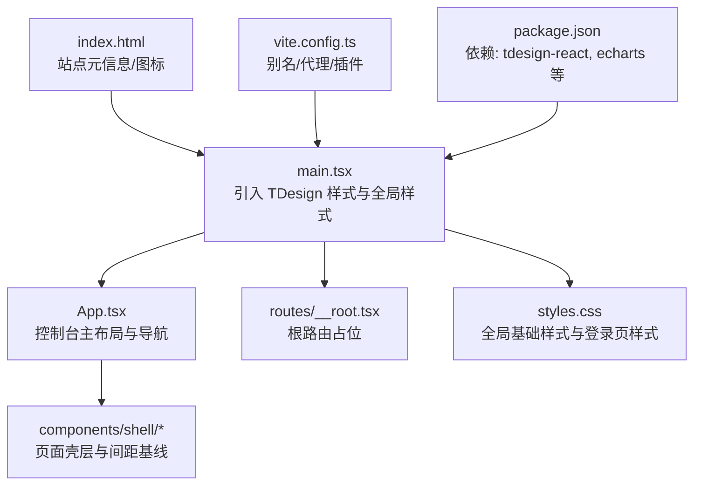
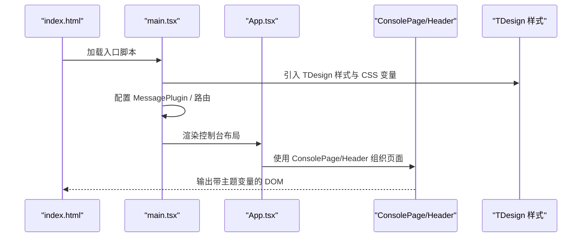
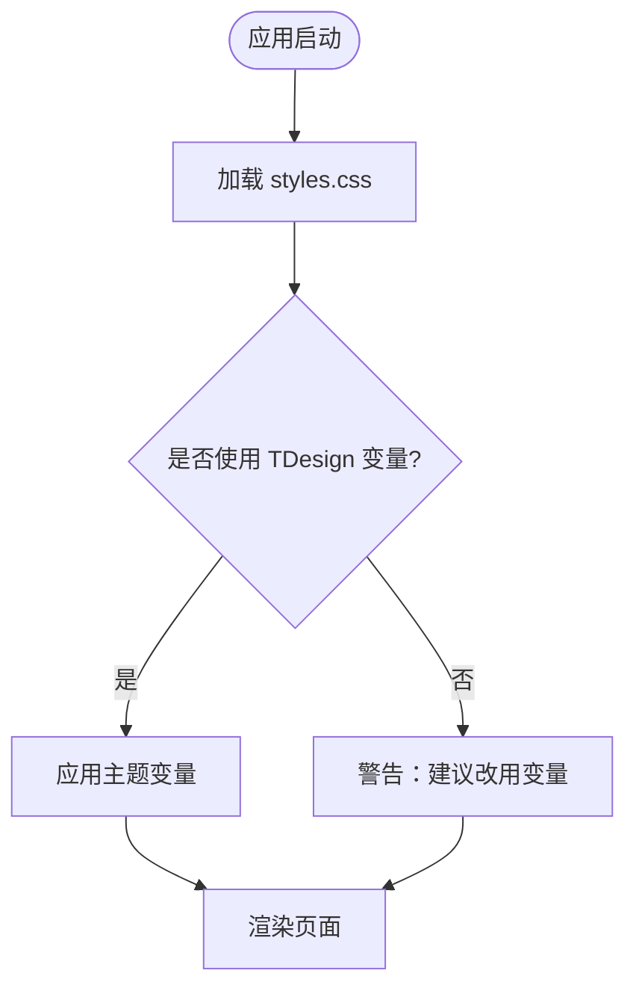
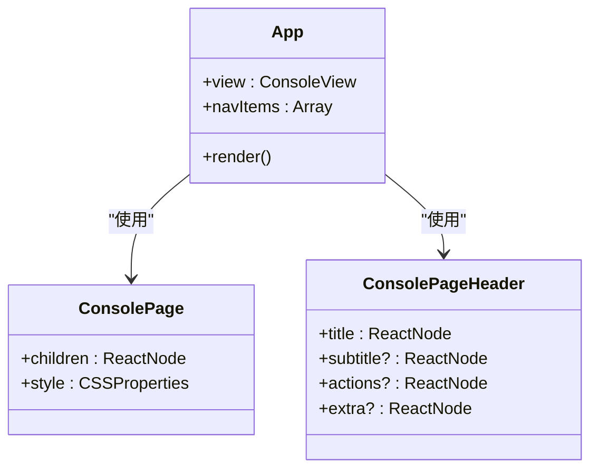
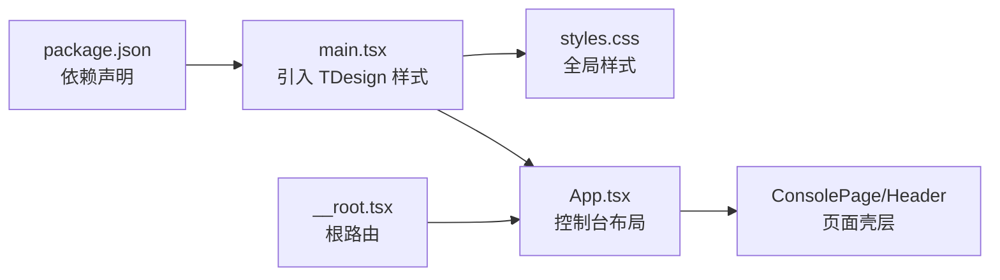

# 样式与主题

<cite>
**本文引用的文件**
- [console/package.json](file://repo/frontends/console/package.json)
- [console/vite.config.ts](file://repo/frontends/console/vite.config.ts)
- [console/index.html](file://repo/frontends/console/index.html)
- [console/src/main.tsx](file://repo/frontends/console/src/main.tsx)
- [console/src/styles.css](file://repo/frontends/console/src/styles.css)
- [console/src/App.tsx](file://repo/frontends/console/src/App.tsx)
- [console/src/routes/__root.tsx](file://repo/frontends/console/src/routes/__root.tsx)
- [console/src/components/shell/ConsolePage.tsx](file://repo/frontends/console/src/components/shell/ConsolePage.tsx)
- [console/src/components/shell/ConsolePageHeader.tsx](file://repo/frontends/console/src/components/shell/ConsolePageHeader.tsx)
- [UI规范-TDesign组件与Token-2.0.md](file://docs/ANI-boss-email-notification-docs/references/UI规范/产品设计规范-TDesign组件与Token-2.0.md)
- [UI规范-设计原则-2.0.md](file://docs/ANI-boss-email-notification-docs/references/UI规范/产品设计规范-设计原则-2.0.md)
</cite>

## 目录
1. [简介](#简介)
2. [项目结构](#项目结构)
3. [核心组件](#核心组件)
4. [架构总览](#架构总览)
5. [详细组件分析](#详细组件分析)
6. [依赖关系分析](#依赖关系分析)
7. [性能考量](#性能考量)
8. [故障排查指南](#故障排查指南)
9. [结论](#结论)
10. [附录](#附录)

## 简介
本章节面向 ANI 控制台（Console）与 BOSS 前端的样式与主题体系，聚焦以下目标：
- 说明基于 TDesign React 的样式架构与组织方式
- 给出主题定制与品牌化配置方法
- 提供响应式设计与移动端适配方案
- 指导样式变量管理、CSS 模块化与本地化资源使用

整体策略：以 TDesign Design Token（CSS 变量）为核心，统一色板、字号、间距与状态语义；通过全局入口注入样式与主题能力，页面级组件仅做布局与业务拼装，避免散落样式。

## 项目结构
前端工程采用 Vite + React + TanStack Router 构建，样式入口集中在应用启动阶段，页面级样式按模块拆分并复用共享壳层组件。

**图表来源**
- [console/index.html:1-14](file://repo/frontends/console/index.html#L1-L14)
- [console/src/main.tsx:1-43](file://repo/frontends/console/src/main.tsx#L1-L43)
- [console/src/App.tsx:1-239](file://repo/frontends/console/src/App.tsx#L1-L239)
- [console/src/routes/__root.tsx:1-14](file://repo/frontends/console/src/routes/__root.tsx#L1-L14)
- [console/src/styles.css:1-51](file://repo/frontends/console/src/styles.css#L1-L51)
- [console/vite.config.ts:1-28](file://repo/frontends/console/vite.config.ts#L1-L28)
- [console/package.json:1-48](file://repo/frontends/console/package.json#L1-L48)

**章节来源**
- [console/index.html:1-14](file://repo/frontends/console/index.html#L1-L14)
- [console/src/main.tsx:1-43](file://repo/frontends/console/src/main.tsx#L1-L43)
- [console/src/App.tsx:1-239](file://repo/frontends/console/src/App.tsx#L1-L239)
- [console/src/routes/__root.tsx:1-14](file://repo/frontends/console/src/routes/__root.tsx#L1-L14)
- [console/src/styles.css:1-51](file://repo/frontends/console/src/styles.css#L1-L51)
- [console/vite.config.ts:1-28](file://repo/frontends/console/vite.config.ts#L1-L28)
- [console/package.json:1-48](file://repo/frontends/console/package.json#L1-L48)

## 核心组件
- 全局样式入口：在应用启动时引入 TDesign 样式与全局样式，确保主题变量可用。
- 页面壳层：通过 ConsolePage 与 ConsolePageHeader 统一页面间距、标题与操作区布局，保证全站一致。
- 主布局：App 提供顶部品牌区、全局搜索、侧边导航与内容区，配合 TDesign 组件完成控制台骨架。
- 路由根：__root.tsx 仅渲染 Outlet，壳层下沉到受保护路由，便于公开页面（登录等）无壳层渲染。

**章节来源**
- [console/src/main.tsx:1-43](file://repo/frontends/console/src/main.tsx#L1-L43)
- [console/src/components/shell/ConsolePage.tsx:1-34](file://repo/frontends/console/src/components/shell/ConsolePage.tsx#L1-L34)
- [console/src/components/shell/ConsolePageHeader.tsx:1-50](file://repo/frontends/console/src/components/shell/ConsolePageHeader.tsx#L1-L50)
- [console/src/App.tsx:1-239](file://repo/frontends/console/src/App.tsx#L1-L239)
- [console/src/routes/__root.tsx:1-14](file://repo/frontends/console/src/routes/__root.tsx#L1-L14)

## 架构总览
样式与主题的整体流程如下：Vite 构建产物中，index.html 加载 main.tsx；main.tsx 引入 TDesign 样式与全局样式，初始化消息提示与路由；App 渲染控制台布局；页面级组件通过共享壳层保持间距与排版一致。

**图表来源**
- [console/index.html:1-14](file://repo/frontends/console/index.html#L1-L14)
- [console/src/main.tsx:1-43](file://repo/frontends/console/src/main.tsx#L1-L43)
- [console/src/App.tsx:1-239](file://repo/frontends/console/src/App.tsx#L1-L239)
- [console/src/components/shell/ConsolePage.tsx:1-34](file://repo/frontends/console/src/components/shell/ConsolePage.tsx#L1-L34)
- [console/src/components/shell/ConsolePageHeader.tsx:1-50](file://repo/frontends/console/src/components/shell/ConsolePageHeader.tsx#L1-L50)

## 详细组件分析

### 全局样式与主题变量
- 全局基础样式：重置 body、链接、盒模型，设置页面背景与字体栈。
- 登录页样式：使用 TDesign 背景与文本变量，确保与主题一致。
- 变量使用：优先使用 --td-* 系列变量，避免硬编码颜色值。

**图表来源**
- [console/src/styles.css:1-51](file://repo/frontends/console/src/styles.css#L1-L51)

**章节来源**
- [console/src/styles.css:1-51](file://repo/frontends/console/src/styles.css#L1-L51)
- [UI规范-TDesign组件与Token-2.0.md:39-86](file://docs/ANI-boss-email-notification-docs/references/UI规范/产品设计规范-TDesign组件与Token-2.0.md#L39-L86)

### 控制台主布局（App）
- 顶部品牌区：Logo 与品牌文案，结合全局搜索与用户信息按钮。
- 侧边导航：服务导航项，当前选中态高亮。
- 内容区：面包屑与视图切换，演示数据与表格、卡片组合。
- 主题一致性：通过 TDesign 组件与变量保持视觉统一。

**图表来源**
- [console/src/App.tsx:1-239](file://repo/frontends/console/src/App.tsx#L1-L239)
- [console/src/components/shell/ConsolePage.tsx:1-34](file://repo/frontends/console/src/components/shell/ConsolePage.tsx#L1-L34)
- [console/src/components/shell/ConsolePageHeader.tsx:1-50](file://repo/frontends/console/src/components/shell/ConsolePageHeader.tsx#L1-L50)

**章节来源**
- [console/src/App.tsx:1-239](file://repo/frontends/console/src/App.tsx#L1-L239)
- [console/src/components/shell/ConsolePage.tsx:1-34](file://repo/frontends/console/src/components/shell/ConsolePage.tsx#L1-L34)
- [console/src/components/shell/ConsolePageHeader.tsx:1-50](file://repo/frontends/console/src/components/shell/ConsolePageHeader.tsx#L1-L50)

### 页面壳层与间距基线
- ConsolePage：统一页面容器纵向间距（gap），作为页面内容包裹器。
- ConsolePageHeader：标题、副标题、操作区对齐与换行处理，支持额外元信息插槽。
- 设计映射：遵循“页面栈间距 16px”的工程约定，保证列表与卡片间节奏一致。

**章节来源**
- [console/src/components/shell/ConsolePage.tsx:1-34](file://repo/frontends/console/src/components/shell/ConsolePage.tsx#L1-L34)
- [console/src/components/shell/ConsolePageHeader.tsx:1-50](file://repo/frontends/console/src/components/shell/ConsolePageHeader.tsx#L1-L50)
- [UI规范-TDesign组件与Token-2.0.md:28-36](file://docs/ANI-boss-email-notification-docs/references/UI规范/产品设计规范-TDesign组件与Token-2.0.md#L28-L36)

### 构建与开发环境
- Vite 插件：React 与 TanStack Router 插件启用，自动生成路由树。
- 别名：@ 指向 src，简化导入路径。
- 代理：开发服务器将 /api 请求转发至后端，便于联调。

**章节来源**
- [console/vite.config.ts:1-28](file://repo/frontends/console/vite.config.ts#L1-L28)

### 依赖与主题库
- 依赖：tdesign-react 与 tdesign-icons-react 为 UI 与图标基础；echarts 用于图表展示。
- 覆盖：对 postcss 等关键依赖进行版本覆盖，保障构建稳定性。

**章节来源**
- [console/package.json:1-48](file://repo/frontends/console/package.json#L1-L48)

## 依赖关系分析
样式与主题的依赖链从入口开始，逐步传递到页面与组件。

**图表来源**
- [console/package.json:1-48](file://repo/frontends/console/package.json#L1-L48)
- [console/src/main.tsx:1-43](file://repo/frontends/console/src/main.tsx#L1-L43)
- [console/src/styles.css:1-51](file://repo/frontends/console/src/styles.css#L1-L51)
- [console/src/App.tsx:1-239](file://repo/frontends/console/src/App.tsx#L1-L239)
- [console/src/routes/__root.tsx:1-14](file://repo/frontends/console/src/routes/__root.tsx#L1-L14)

**章节来源**
- [console/package.json:1-48](file://repo/frontends/console/package.json#L1-L48)
- [console/src/main.tsx:1-43](file://repo/frontends/console/src/main.tsx#L1-L43)
- [console/src/styles.css:1-51](file://repo/frontends/console/src/styles.css#L1-L51)
- [console/src/App.tsx:1-239](file://repo/frontends/console/src/App.tsx#L1-L239)
- [console/src/routes/__root.tsx:1-14](file://repo/frontends/console/src/routes/__root.tsx#L1-L14)

## 性能考量
- 样式体积：仅引入必要的 TDesign 样式，避免全量引入导致包体过大。
- 变量复用：通过 CSS 变量减少重复定义，提升维护性与渲染效率。
- 构建优化：使用 Vite 插件与别名，缩短编译路径；按需引入组件样式（由 TDesign 内部处理）。
- 图表渲染：ECharts 仅在需要时挂载，避免不必要的重绘。

[本节为通用指导，不直接分析具体文件]

## 故障排查指南
- 主题变量未生效
  - 检查是否在 main.tsx 中引入 TDesign 样式与全局样式。
  - 确认页面是否使用了 --td-* 变量而非硬编码颜色。
- 登录页样式异常
  - 核对 .auth-page 与 .auth-card 类名是否正确应用。
  - 检查背景与文本颜色是否引用了正确的变量。
- 壳层间距不一致
  - 确认页面是否使用 ConsolePage 包裹内容。
  - 检查 ConsolePageHeader 的 actions 区域是否与标题对齐。
- 构建或代理问题
  - 查看 vite.config.ts 的 alias 与 proxy 配置是否正确。
  - 确认 package.json 中的依赖版本与覆盖策略。

**章节来源**
- [console/src/main.tsx:1-43](file://repo/frontends/console/src/main.tsx#L1-L43)
- [console/src/styles.css:1-51](file://repo/frontends/console/src/styles.css#L1-L51)
- [console/src/components/shell/ConsolePage.tsx:1-34](file://repo/frontends/console/src/components/shell/ConsolePage.tsx#L1-L34)
- [console/src/components/shell/ConsolePageHeader.tsx:1-50](file://repo/frontends/console/src/components/shell/ConsolePageHeader.tsx#L1-L50)
- [console/vite.config.ts:1-28](file://repo/frontends/console/vite.config.ts#L1-L28)
- [console/package.json:1-48](file://repo/frontends/console/package.json#L1-L48)

## 结论
本项目以 TDesign 为主题基础，通过全局样式入口与页面壳层组件实现统一的视觉与交互体验。样式变量集中管理，页面级组件专注于布局与业务拼装，确保可维护性与扩展性。后续可在主题切换、深色模式与品牌化方面进一步扩展，同时保持与设计规范的严格对齐。

[本节为总结，不直接分析具体文件]

## 附录

### 主题定制与品牌化配置指南
- 主题变量
  - 背景与表面：--td-bg-color-page、--td-bg-color-container、--td-bg-color-secondarycontainer
  - 文本：--td-text-color-primary、--td-text-color-secondary、--td-text-color-placeholder、--td-text-color-disabled
  - 品牌与状态：--td-brand-color、--td-success-color、--td-warning-color、--td-error-color
  - 边框与分割：--td-component-border、--td-component-stroke
- 品牌化步骤
  - 在应用启动阶段（main.tsx）引入 TDesign 样式后，可通过 CSS 变量覆盖品牌色与状态色。
  - 在 index.html 中配置 favicon 与站点名称，体现品牌标识。
  - 在页面中使用 TDesign 组件的 theme/variant 属性，确保行为与视觉一致。

**章节来源**
- [UI规范-TDesign组件与Token-2.0.md:39-86](file://docs/ANI-boss-email-notification-docs/references/UI规范/产品设计规范-TDesign组件与Token-2.0.md#L39-L86)
- [console/index.html:1-14](file://repo/frontends/console/index.html#L1-L14)
- [console/src/main.tsx:1-43](file://repo/frontends/console/src/main.tsx#L1-L43)

### 响应式设计与移动端适配方案
- 桌面优先：以 ≥1280px 为基准宽度，保证控制台高密度工作区可读性。
- 窄屏适配：辅助面板在窄屏下 Drawer 化或下移；表格允许横向滚动，关键操作列固定或保持在首屏。
- 组件选择：使用 TDesign Layout、Menu、Breadcrumb 等组件，便于在不同屏幕尺寸下自适应。
- 交互安全：危险操作需二次确认；行点击与行内按钮区域分离，避免误触。

**章节来源**
- [UI规范-设计原则-2.0.md:148-197](file://docs/ANI-boss-email-notification-docs/references/UI规范/产品设计规范-设计原则-2.0.md#L148-L197)
- [UI规范-TDesign组件与Token-2.0.md:109-118](file://docs/ANI-boss-email-notification-docs/references/UI规范/产品设计规范-TDesign组件与Token-2.0.md#L109-L118)

### 样式变量管理与 CSS 模块化
- 变量管理
  - 全局变量集中于 styles.css，并通过 TDesign 提供的 --td-* 变量统一语义。
  - 页面级样式尽量使用变量与组件属性，避免散落 hex 值。
- 模块化
  - 页面壳层组件（ConsolePage、ConsolePageHeader）封装通用布局与间距。
  - 业务组件在 components/ 下按功能划分，内部仍基于 TDesign 拼装。
- 本地化资源
  - 站点图标与品牌资源在 index.html 中引入，确保多端一致。
  - 文案与标签使用中文，符合产品定位。

**章节来源**
- [console/src/styles.css:1-51](file://repo/frontends/console/src/styles.css#L1-L51)
- [console/src/components/shell/ConsolePage.tsx:1-34](file://repo/frontends/console/src/components/shell/ConsolePage.tsx#L1-L34)
- [console/src/components/shell/ConsolePageHeader.tsx:1-50](file://repo/frontends/console/src/components/shell/ConsolePageHeader.tsx#L1-L50)
- [console/index.html:1-14](file://repo/frontends/console/index.html#L1-L14)