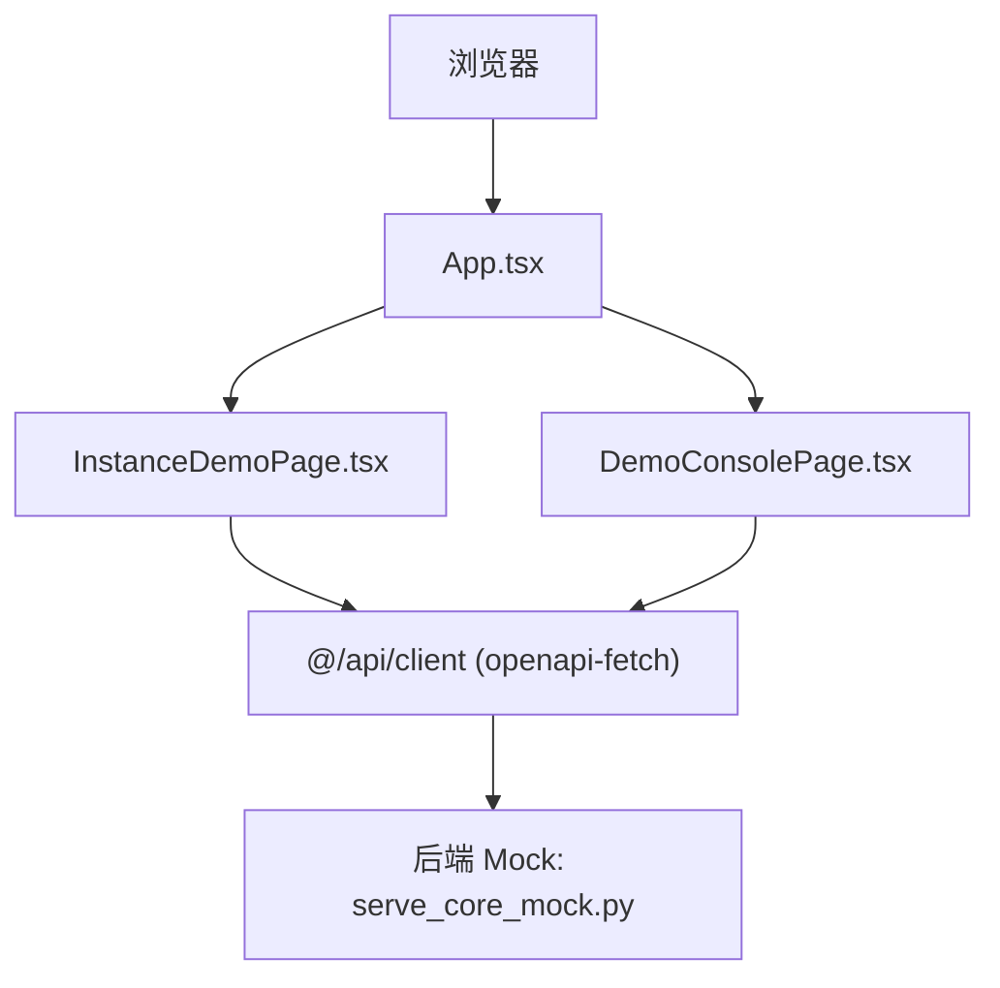
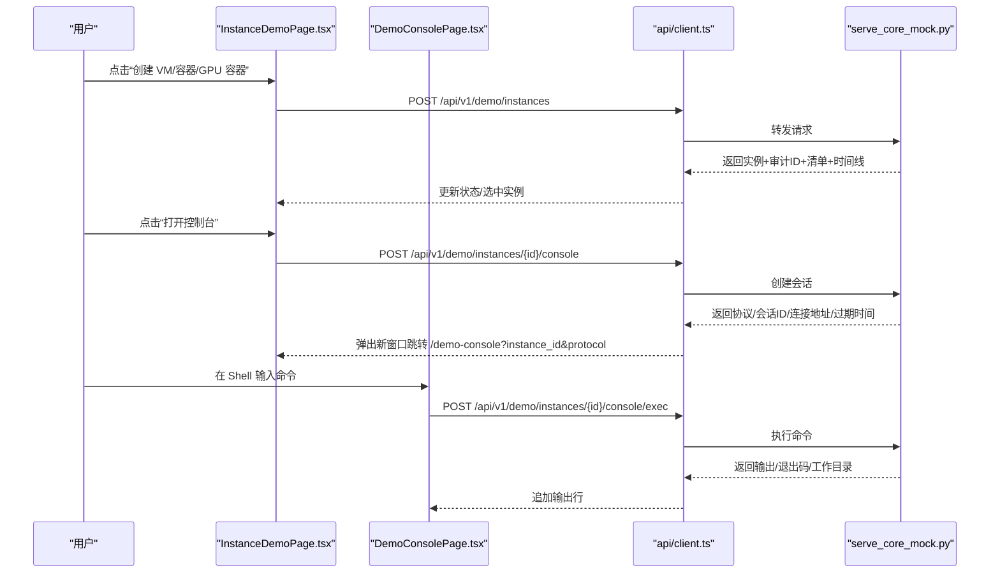
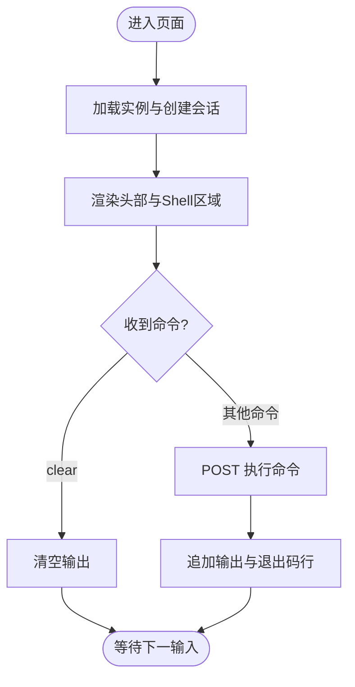
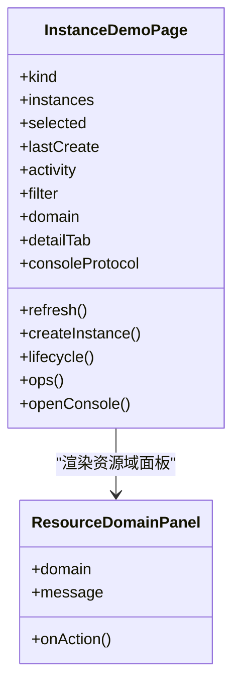
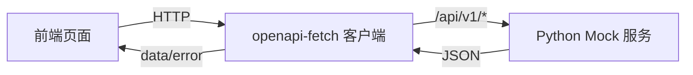

# 演示页面

<cite>
**本文引用的文件**
- [DemoConsolePage.tsx](file://repo/frontends/console/src/demo/DemoConsolePage.tsx)
- [InstanceDemoPage.tsx](file://repo/frontends/console/src/demo/InstanceDemoPage.tsx)
- [App.tsx](file://repo/frontends/console/src/App.tsx)
- [client.ts](file://repo/frontends/console/src/api/client.ts)
- [serve_core_mock.py](file://repo/scripts/serve_core_mock.py)
</cite>

## 目录
1. [简介](#简介)
2. [项目结构](#项目结构)
3. [核心组件](#核心组件)
4. [架构总览](#架构总览)
5. [详细组件分析](#详细组件分析)
6. [依赖关系分析](#依赖关系分析)
7. [性能与体验](#性能与体验)
8. [故障排查指南](#故障排查指南)
9. [结论](#结论)
10. [附录：快速上手与扩展](#附录快速上手与扩展)

## 简介
本文件面向开发者，系统性说明 ANI Console 前端中的两个演示页面：
- DemoConsolePage：演示 VM 控制台会话（VNC/Serial/SPICE/RDP 等协议），支持命令执行、输出回显、会话元信息展示。
- InstanceDemoPage：演示实例工作台，覆盖实例创建、生命周期管理（启动/停止/重启/变配/删除）、资源域导航、指标/网络/存储/安全/事件/审计/快照/备份等 Tab 的演示数据与交互。

文档同时说明演示数据的模拟方式、测试场景设计、界面预览方法，以及扩展与自定义建议。

## 项目结构
演示页面位于前端控制台工程的前端源码中，由应用入口路由到不同视图：
- 应用入口 App.tsx：根据路径或侧边栏选择渲染“实例工作台”或其他 Mock 视图；当路径为 /demo-console 时直接渲染 DemoConsolePage。
- 演示页面：
  - InstanceDemoPage.tsx：实例工作台主页面，包含创建面板、实例列表、详情与操作区、底部执行结果与链路时间线。
  - DemoConsolePage.tsx：控制台会话页，负责连接后端、显示 Shell 输出、执行命令。
- API 客户端：
  - client.ts：基于 OpenAPI 生成的类型化客户端，统一 baseUrl 和请求头。演示页面通过该客户端调用 /api/v1/demo/* 接口。
- 后端 Mock：
  - serve_core_mock.py：提供 Core API 的轻量 Mock 服务，并内置多种演示场景的数据与行为（如实例列表、指标、日志、事件、安全事件、exec 与 console session 等）。

图表来源
- [App.tsx:35-89](file://repo/frontends/console/src/App.tsx#L35-L89)
- [InstanceDemoPage.tsx:121-465](file://repo/frontends/console/src/demo/InstanceDemoPage.tsx#L121-L465)
- [DemoConsolePage.tsx:31-140](file://repo/frontends/console/src/demo/DemoConsolePage.tsx#L31-L140)
- [client.ts:17-22](file://repo/frontends/console/src/api/client.ts#L17-L22)
- [serve_core_mock.py:700-800](file://repo/scripts/serve_core_mock.py#L700-L800)

章节来源
- [App.tsx:35-89](file://repo/frontends/console/src/App.tsx#L35-L89)
- [client.ts:17-22](file://repo/frontends/console/src/api/client.ts#L17-L22)

## 核心组件
- DemoConsolePage
  - 功能：加载实例信息、创建控制台会话、显示 Shell 输出、执行命令、重置/关闭。
  - 关键交互：URL 参数 instance_id、protocol；POST 创建会话；POST 执行命令；错误提示与加载态。
- InstanceDemoPage
  - 功能：实例创建工作流（基础/规格/网络/存储/确认）、实例列表筛选、详情多 Tab（概览/监控/网络/存储/安全/事件/审计/快照/备份）、生命周期操作、打开控制台、执行结果与链路时间线。
  - 关键交互：创建实例、启动/停止/重启/变配/删除、打开控制台、切换资源域、刷新与过滤。

章节来源
- [DemoConsolePage.tsx:31-140](file://repo/frontends/console/src/demo/DemoConsolePage.tsx#L31-L140)
- [InstanceDemoPage.tsx:121-465](file://repo/frontends/console/src/demo/InstanceDemoPage.tsx#L121-L465)

## 架构总览
演示页面采用“前端 React + TDesign 组件 + openapi-fetch 客户端 + Python Mock 服务”的组合：
- 前端通过统一的 api 客户端发起 GET/POST 请求，路径以 /api/v1 开头。
- 后端 Mock 服务解析请求，返回符合 OpenAPI 契约的 JSON，并提供演示场景（如不同 kind 的实例、指标、日志、事件、安全事件、exec/console session）。
- 控制台会话页通过 URL 参数控制协议与会话，支持命令执行与输出回显。

图表来源
- [InstanceDemoPage.tsx:156-216](file://repo/frontends/console/src/demo/InstanceDemoPage.tsx#L156-L216)
- [DemoConsolePage.tsx:42-90](file://repo/frontends/console/src/demo/DemoConsolePage.tsx#L42-L90)
- [client.ts:17-22](file://repo/frontends/console/src/api/client.ts#L17-L22)
- [serve_core_mock.py:700-800](file://repo/scripts/serve_core_mock.py#L700-L800)

## 详细组件分析

### DemoConsolePage 分析
- 职责
  - 从 URL 读取 instance_id 与 protocol，初始化连接。
  - 获取实例信息与创建控制台会话，展示会话元信息（协议、会话ID、连接地址、过期时间）。
  - 提供 Shell 输入框，执行命令并追加输出行，支持 clear 清空、重置初始行、关闭页面。
- 数据流
  - 首次挂载调用 boot：GET 实例详情，POST 创建控制台会话，设置初始输出行。
  - 执行命令：POST 执行，解析输出并按行追加，处理退出码行。
- 错误处理
  - 捕获异常并显示 Alert；loading 态包裹内容区域。
- 扩展点
  - 新增协议：在 UI 下拉与 URL 参数中扩展 protocol。
  - 命令历史/自动补全：可在本地维护 history 列表与 fuzzy search。
  - 终端增强：接入 xterm.js 实现更真实的终端体验。

图表来源
- [DemoConsolePage.tsx:42-90](file://repo/frontends/console/src/demo/DemoConsolePage.tsx#L42-L90)
- [DemoConsolePage.tsx:152-164](file://repo/frontends/console/src/demo/DemoConsolePage.tsx#L152-L164)

章节来源
- [DemoConsolePage.tsx:31-140](file://repo/frontends/console/src/demo/DemoConsolePage.tsx#L31-L140)

### InstanceDemoPage 分析
- 职责
  - 实例创建向导：选择模板（VM/容器/GPU 容器），填写名称、镜像、控制台协议，提交创建。
  - 实例列表：按 kind 筛选，展示名称/类型/状态/Provider/操作。
  - 详情面板：多 Tab 展示概览、监控、网络、存储、安全、事件、审计、快照、备份等演示信息。
  - 生命周期操作：启动/停止/重启/变配/删除，更新实例状态与活动日志。
  - 控制台集成：打开新窗口跳转到 DemoConsolePage。
- 数据流
  - 初始化：拉取实例列表，默认选中第一个。
  - 创建：POST 创建实例，记录审计ID、清单、时间线，刷新列表。
  - 生命周期：POST 变更，更新选中实例与活动日志。
  - 控制台：POST 创建会话，生成跳转链接。
- 错误处理
  - 统一 run 包装 try/catch，错误通过 Alert 展示。
- 扩展点
  - 新增资源域：扩展 domainRows/domainMetrics/domainActions。
  - 新增 Tab：扩展 detailTabs 与 renderDetailTab。
  - 更多协议：扩展控制台协议选项。

图表来源
- [InstanceDemoPage.tsx:121-465](file://repo/frontends/console/src/demo/InstanceDemoPage.tsx#L121-L465)
- [InstanceDemoPage.tsx:476-549](file://repo/frontends/console/src/demo/InstanceDemoPage.tsx#L476-L549)

章节来源
- [InstanceDemoPage.tsx:121-465](file://repo/frontends/console/src/demo/InstanceDemoPage.tsx#L121-L465)

### App.tsx 路由与导航
- 根据路径 /demo-console 直接渲染 DemoConsolePage。
- 否则渲染主布局，左侧导航切换视图，“实例工作台”对应 InstanceDemoPage。
- 其他视图使用 MockConsolePage 展示通用 Mock 数据与交互。

章节来源
- [App.tsx:35-89](file://repo/frontends/console/src/App.tsx#L35-L89)

## 依赖关系分析
- 前端依赖
  - TDesign React 组件库：按钮、表格、标签、统计卡片、Alert、Loading 等。
  - openapi-fetch：类型安全的 HTTP 客户端，baseUrl 指向 /api/v1/svc。
  - React Hooks：useState/useEffect/useMemo/useCallback 管理状态与副作用。
- 后端依赖
  - Python http.server：提供 REST 接口与 WebSocket echo 服务器。
  - YAML 解析：读取 OpenAPI 规范构建路由与响应。
- 耦合与内聚
  - 演示页面通过统一 api 客户端解耦具体实现，便于替换后端。
  - Mock 服务集中管理演示数据与场景开关，降低前端分支复杂度。

图表来源
- [client.ts:17-22](file://repo/frontends/console/src/api/client.ts#L17-L22)
- [serve_core_mock.py:700-800](file://repo/scripts/serve_core_mock.py#L700-L800)

章节来源
- [client.ts:17-22](file://repo/frontends/console/src/api/client.ts#L17-L22)
- [serve_core_mock.py:700-800](file://repo/scripts/serve_core_mock.py#L700-L800)

## 性能与体验
- 首屏加载
  - 列表与详情按需渲染，避免一次性加载过多数据。
- 交互反馈
  - Loading 包裹关键区域，错误通过 Alert 即时提示，提升可感知性。
- 可扩展性
  - 通过 presets 与 domainRows/Metrics/Actions 配置驱动，易于扩展新模板与新资源域。
- 建议优化
  - 对长列表增加虚拟滚动。
  - 对控制台输出进行增量渲染与防抖。
  - 对频繁请求增加缓存与去重策略。

[本节为通用指导，不直接分析具体文件]

## 故障排查指南
- 无法加载实例列表
  - 检查 Mock 服务是否运行，端口是否正确；查看浏览器 Network 是否有 404/5xx。
  - 参考 Mock 服务中对 listInstances 的处理逻辑。
- 控制台无法连接
  - 检查 URL 参数 instance_id 与 protocol 是否有效。
  - 确认后端返回 connect_url 与 expires_at；若过期需重新创建会话。
- 命令执行失败
  - 检查 exec 接口返回的 exit_code 与 output；必要时清理输出后重试。
- 权限或错误态
  - Mock 服务支持 ?forbidden=1、?error=1 等参数触发特定错误，用于验证前端错误处理。

章节来源
- [serve_core_mock.py:700-800](file://repo/scripts/serve_core_mock.py#L700-L800)
- [DemoConsolePage.tsx:42-90](file://repo/frontends/console/src/demo/DemoConsolePage.tsx#L42-L90)
- [InstanceDemoPage.tsx:156-216](file://repo/frontends/console/src/demo/InstanceDemoPage.tsx#L156-L216)

## 结论
演示页面通过清晰的前端组件划分与统一的 API 客户端，结合强大的 Mock 服务，提供了完整的实例工作台与控制台会话演示。开发者可以在此基础上快速扩展新的资源域、协议与操作流程，并通过 Mock 参数快速验证边界与错误场景。

[本节为总结，不直接分析具体文件]

## 附录：快速上手与扩展

### 快速上手
- 启动前端开发服务器
  - 进入 repo/frontends/console，执行 npm install 与 npm run dev。
- 启动后端 Mock 服务
  - 在仓库根目录执行 python scripts/serve_core_mock.py，确保监听端口可用。
- 访问演示页面
  - 实例工作台：浏览器访问 localhost:端口，选择“实例工作台”。
  - 控制台会话：访问 /demo-console?instance_id={实例ID}&protocol=vnc。

### 界面预览
- 实例工作台
  - 创建面板：选择 VM/容器/GPU 容器，点击“创建”，观察底部执行结果与时间线。
  - 实例列表：筛选全部/VM/容器/GPU 容器，查看状态与操作。
  - 详情面板：切换概览/监控/网络/存储/安全/事件/审计/快照/备份，查看演示信息。
- 控制台会话
  - 顶部显示实例名、状态、Provider、协议、会话ID。
  - Shell 区域显示连接信息与命令历史，支持执行命令与重置。

### 测试场景设计
- 正常流程
  - 创建实例 → 启动/停止/重启 → 打开控制台 → 执行命令。
- 错误与边界
  - 使用 Mock 参数触发 forbidden/error/expired 等场景，验证前端 Alert 与重试逻辑。
  - 切换不同 kind 的实例，验证指标差异与不可用字段处理。
- 多协议
  - 在控制台协议下拉中选择 VNC/Serial/Cloud Console/SPICE/RDP，验证跳转与元信息展示。

### 扩展与自定义
- 新增资源域
  - 在 InstanceDemoPage 中扩展 resourceDomains、domainIntro、domainMetrics、domainActions、domainRows。
- 新增控制台协议
  - 在 UI 下拉中添加新协议选项，并在 URL 参数中传递 protocol。
- 增强控制台体验
  - 接入 xterm.js，实现更丰富的终端能力（粘贴、复制、主题、快捷键）。
- 接入真实后端
  - 将 api/client.ts 的 baseUrl 指向生产环境，并确保后端实现 /api/v1/demo/* 接口。

章节来源
- [InstanceDemoPage.tsx:54-119](file://repo/frontends/console/src/demo/InstanceDemoPage.tsx#L54-L119)
- [InstanceDemoPage.tsx:594-711](file://repo/frontends/console/src/demo/InstanceDemoPage.tsx#L594-L711)
- [DemoConsolePage.tsx:31-140](file://repo/frontends/console/src/demo/DemoConsolePage.tsx#L31-L140)
- [client.ts:17-22](file://repo/frontends/console/src/api/client.ts#L17-L22)