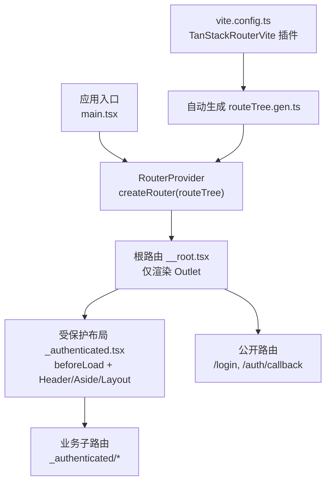
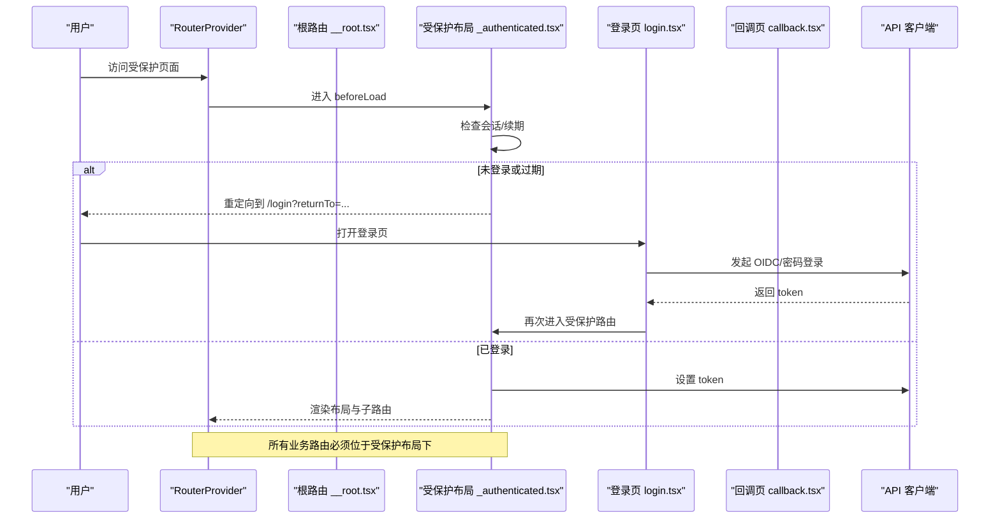
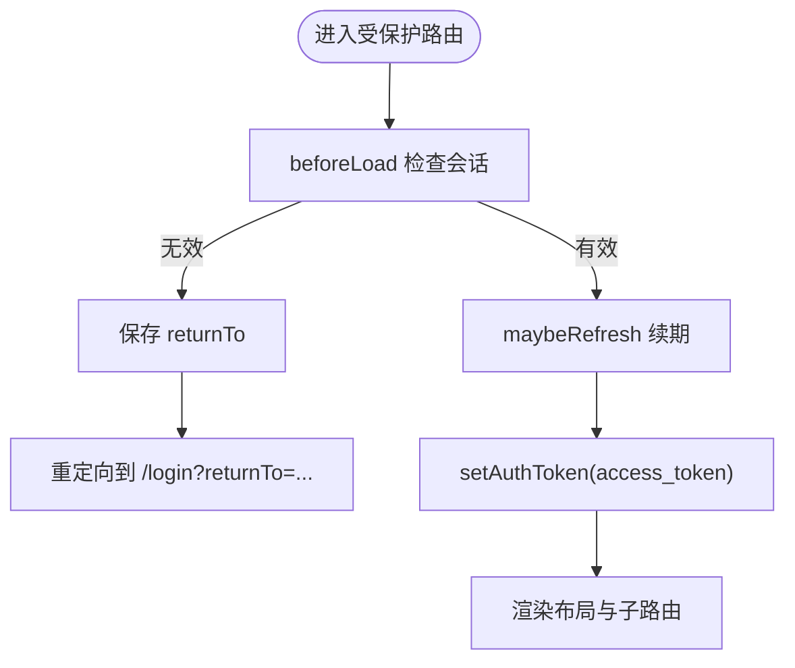
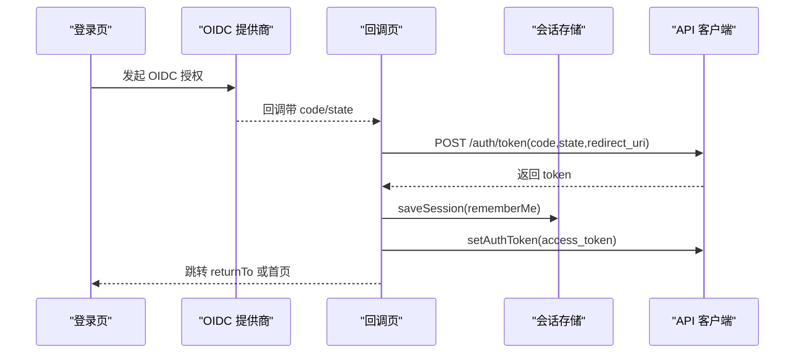
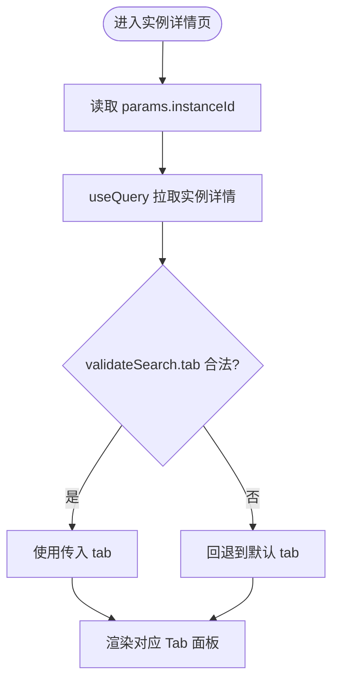
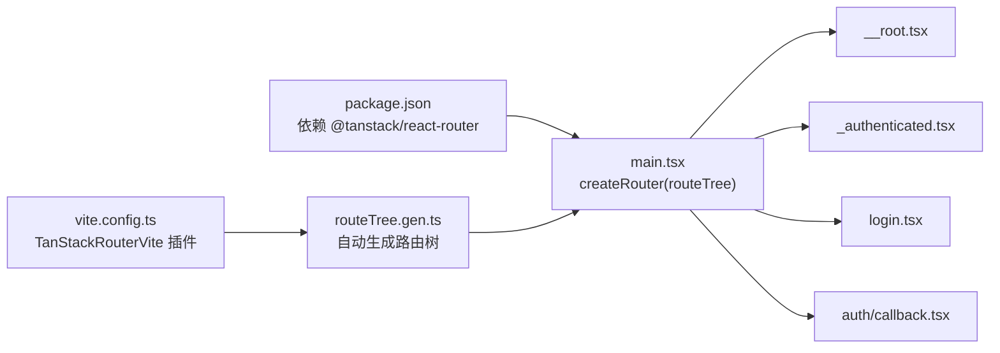

# 路由系统

<cite>
**本文引用的文件**
- [main.tsx](file://repo/frontends/console/src/main.tsx)
- [vite.config.ts](file://repo/frontends/console/vite.config.ts)
- [package.json](file://repo/frontends/console/package.json)
- [__root.tsx](file://repo/frontends/console/src/routes/__root.tsx)
- [_authenticated.tsx](file://repo/frontends/console/src/routes/_authenticated.tsx)
- [login.tsx](file://repo/frontends/console/src/routes/login.tsx)
- [callback.tsx](file://repo/frontends/console/src/routes/auth/callback.tsx)
- [routeTree.gen.ts](file://repo/frontends/console/src/routeTree.gen.ts)
- [_authenticated/index.tsx](file://repo/frontends/console/src/routes/_authenticated/index.tsx)
- [_authenticated/compute/instances/$instanceId/route.tsx](file://repo/frontends/console/src/routes/_authenticated/compute/instances/$instanceId/route.tsx)
- [_authenticated/kb/$kbId/chat.tsx](file://repo/frontends/console/src/routes/_authenticated/kb/$kbId/chat.tsx)
</cite>

## 目录
1. [简介](#简介)
2. [项目结构](#项目结构)
3. [核心组件](#核心组件)
4. [架构总览](#架构总览)
5. [详细组件分析](#详细组件分析)
6. [依赖关系分析](#依赖关系分析)
7. [性能与懒加载](#性能与懒加载)
8. [故障排查指南](#故障排查指南)
9. [结论](#结论)
10. [附录](#附录)

## 简介
本仓库前端控制台采用基于 TanStack Router 的文件路由方案，通过约定式目录结构与自动生成类型化路由树，实现可维护、可扩展的前端路由体系。文档聚焦以下目标：
- 根路由与受保护布局的设计模式
- 嵌套路由与动态参数处理
- 路由守卫与权限控制（登录态校验、Token 续期）
- 路由跳转、参数传递与状态保持的最佳实践
- 懒加载与性能优化策略

## 项目结构
控制台前端使用 TanStack Router 的“文件系统路由”插件，自动扫描 `src/routes` 目录生成类型安全的 `routeTree.gen.ts`。Vite 配置中启用插件并指定生成路径；应用入口创建 Router 实例并挂载到 React 根节点。

**图表来源**
- [main.tsx:23-28](file://repo/frontends/console/src/main.tsx#L23-L28)
- [__root.tsx:1-14](file://repo/frontends/console/src/routes/__root.tsx#L1-L14)
- [_authenticated.tsx:17-46](file://repo/frontends/console/src/routes/_authenticated.tsx#L17-L46)
- [vite.config.ts:6-13](file://repo/frontends/console/vite.config.ts#L6-L13)
- [routeTree.gen.ts:11-49](file://repo/frontends/console/src/routeTree.gen.ts#L11-L49)

**章节来源**
- [main.tsx:1-43](file://repo/frontends/console/src/main.tsx#L1-L43)
- [vite.config.ts:1-28](file://repo/frontends/console/vite.config.ts#L1-L28)
- [package.json:13-16](file://repo/frontends/console/package.json#L13-L16)
- [routeTree.gen.ts:1-49](file://repo/frontends/console/src/routeTree.gen.ts#L1-L49)

## 核心组件
- 根路由：纯壳层，仅渲染 `<Outlet />`，不承载全局 UI，避免对公开路由造成干扰。
- 受保护布局：以 pathless 路由 `_authenticated` 作为统一门禁与布局容器，负责：
  - beforeLoad 鉴权：无会话或过期则保存 returnTo 并重定向至 `/login?returnTo=...`
  - Token 续期：定时检查并在临近过期时刷新
  - 注入访问令牌：将 access_token 设置到 API 中间件
  - 提供 Header/Aside 导航与内容区 `<Outlet />`
- 登录页：支持企业 OIDC 与账号密码两种登录方式，成功后写入会话并跳转到 returnTo 或首页。
- 回调页：OIDC 回调换 Token，校验 state，写会话后硬跳转回目标页面。
- 业务路由：如仪表盘、知识库问答、实例详情等，均挂在受保护布局下。

**章节来源**
- [__root.tsx:1-14](file://repo/frontends/console/src/routes/__root.tsx#L1-L14)
- [_authenticated.tsx:17-46](file://repo/frontends/console/src/routes/_authenticated.tsx#L17-L46)
- [login.tsx:37-45](file://repo/frontends/console/src/routes/login.tsx#L37-L45)
- [callback.tsx:23-25](file://repo/frontends/console/src/routes/auth/callback.tsx#L23-L25)

## 架构总览
下图展示从浏览器访问到路由渲染、鉴权与数据请求的整体流程。

**图表来源**
- [_authenticated.tsx:27-46](file://repo/frontends/console/src/routes/_authenticated.tsx#L27-L46)
- [login.tsx:77-155](file://repo/frontends/console/src/routes/login.tsx#L77-L155)
- [callback.tsx:44-79](file://repo/frontends/console/src/routes/auth/callback.tsx#L44-L79)
- [main.tsx:23-28](file://repo/frontends/console/src/main.tsx#L23-L28)

## 详细组件分析

### 根路由与受保护布局
- 根路由职责单一：仅渲染 `<Outlet />`，确保公开路由不受布局影响。
- 受保护布局：
  - beforeLoad 门禁：读取会话、校验有效期、保存 returnTo、必要时重定向
  - 定时续期：每 60 秒调用 maybeRefresh，剩余不足 5 分钟触发刷新
  - 注入 token：setAuthToken 使后续 API 请求携带 Bearer 头
  - 布局 UI：Header 显示品牌与退出按钮，Aside 提供导航菜单，Content 渲染子路由

**图表来源**
- [_authenticated.tsx:27-46](file://repo/frontends/console/src/routes/_authenticated.tsx#L27-L46)
- [_authenticated.tsx:48-64](file://repo/frontends/console/src/routes/_authenticated.tsx#L48-L64)

**章节来源**
- [__root.tsx:1-14](file://repo/frontends/console/src/routes/__root.tsx#L1-L14)
- [_authenticated.tsx:17-131](file://repo/frontends/console/src/routes/_authenticated.tsx#L17-L131)

### 登录与回调流程
- 登录页：
  - 支持企业 OIDC 与账号密码双 Tab
  - 表单校验、幂等键生成、错误码映射与提示
  - 成功写入会话并跳转到 returnTo 或首页
- 回调页：
  - 解析 code/state，校验 state 一致性
  - 换取 token，写入会话，硬跳转回目标页面

**图表来源**
- [login.tsx:77-155](file://repo/frontends/console/src/routes/login.tsx#L77-L155)
- [callback.tsx:44-79](file://repo/frontends/console/src/routes/auth/callback.tsx#L44-L79)

**章节来源**
- [login.tsx:15-168](file://repo/frontends/console/src/routes/login.tsx#L15-L168)
- [callback.tsx:14-84](file://repo/frontends/console/src/routes/auth/callback.tsx#L14-L84)

### 动态路由与查询参数
- 动态参数：
  - 实例详情：`/compute/instances/$instanceId`，通过 `Route.useParams()` 获取 instanceId
  - 知识库问答：`/kb/$kbId/chat`，通过 `Route.useParams()` 获取 kbId
- 查询参数：
  - 实例详情页支持 `?tab=` 深链，通过 `validateSearch` 严格白名单校验，非法值回退默认 tab
  - 切换 tab 同步更新 URL，便于分享与刷新保持状态

**图表来源**
- [_authenticated/compute/instances/$instanceId/route.tsx:58-71](file://repo/frontends/console/src/routes/_authenticated/compute/instances/$instanceId/route.tsx#L58-L71)
- [_authenticated/compute/instances/$instanceId/route.tsx:73-143](file://repo/frontends/console/src/routes/_authenticated/compute/instances/$instanceId/route.tsx#L73-L143)

**章节来源**
- [_authenticated/compute/instances/$instanceId/route.tsx:58-143](file://repo/frontends/console/src/routes/_authenticated/compute/instances/$instanceId/route.tsx#L58-L143)
- [_authenticated/kb/$kbId/chat.tsx:18-24](file://repo/frontends/console/src/routes/_authenticated/kb/$kbId/chat.tsx#L18-L24)

### 路由跳转、参数传递与状态保持最佳实践
- 跳转方式：
  - 受保护路由内优先使用 `useNavigate` 进行 SPA 跳转，避免整页刷新
  - 登录/回调场景在需要强制刷新上下文时使用 `window.location.assign`
- 参数传递：
  - 路径参数：使用文件名 `$paramName` 声明，组件内通过 `Route.useParams()` 读取
  - 查询参数：使用 `validateSearch` 做白名单校验，保证类型安全与健壮性
- 状态保持：
  - 通过 URL 深链（如 `?tab=logs`）保持视图状态，刷新或分享链接可恢复
  - 登录态与会话持久化由 `@/auth/session` 管理，路由守卫在每次进入受保护路由时校验

**章节来源**
- [_authenticated.tsx:48-64](file://repo/frontends/console/src/routes/_authenticated.tsx#L48-L64)
- [_authenticated/compute/instances/$instanceId/route.tsx:118-133](file://repo/frontends/console/src/routes/_authenticated/compute/instances/$instanceId/route.tsx#L118-L133)
- [login.tsx:144-155](file://repo/frontends/console/src/routes/login.tsx#L144-L155)
- [callback.tsx:68-79](file://repo/frontends/console/src/routes/auth/callback.tsx#L68-L79)

### 权限控制机制
- 前置守卫：受保护布局的 `beforeLoad` 统一拦截，未登录或 token 过期则保存 returnTo 并跳转登录
- Token 续期：布局内定时器周期性调用 maybeRefresh，减少用户感知中断
- 令牌注入：登录后通过 setAuthToken 注入到 API 中间件，后续请求自动携带认证信息

**章节来源**
- [_authenticated.tsx:27-46](file://repo/frontends/console/src/routes/_authenticated.tsx#L27-L46)
- [_authenticated.tsx:48-64](file://repo/frontends/console/src/routes/_authenticated.tsx#L48-L64)
- [main.tsx:14-18](file://repo/frontends/console/src/main.tsx#L14-L18)

## 依赖关系分析
- 构建与代码生成：
  - Vite 插件 TanStackRouterVite 扫描 `src/routes` 生成 `routeTree.gen.ts`
  - package.json 引入 `@tanstack/react-router` 与 `@tanstack/router-plugin`
- 运行时：
  - main.tsx 创建 Router 实例，注入 QueryClient 上下文
  - 路由树包含根路由、受保护布局、登录与回调等

**图表来源**
- [package.json:13-16](file://repo/frontends/console/package.json#L13-L16)
- [vite.config.ts:6-13](file://repo/frontends/console/vite.config.ts#L6-L13)
- [main.tsx:23-28](file://repo/frontends/console/src/main.tsx#L23-L28)
- [routeTree.gen.ts:11-49](file://repo/frontends/console/src/routeTree.gen.ts#L11-L49)

**章节来源**
- [package.json:1-48](file://repo/frontends/console/package.json#L1-L48)
- [vite.config.ts:1-28](file://repo/frontends/console/vite.config.ts#L1-L28)
- [main.tsx:1-43](file://repo/frontends/console/src/main.tsx#L1-L43)
- [routeTree.gen.ts:1-49](file://repo/frontends/console/src/routeTree.gen.ts#L1-L49)

## 性能与懒加载
- 路由级懒加载：
  - 当前路由树为文件路由自动生成，TanStack Router 支持按路由按需加载模块，建议为大型页面拆分组件并按需导入，减少首屏体积
- 数据懒加载：
  - 使用 `@tanstack/react-query` 的 useQuery/useMutation 按需拉取数据，结合 queryKey 缓存与重试策略
- 路由守卫优化：
  - beforeLoad 只做必要校验与续期，避免阻塞渲染
  - 定时续期间隔合理（60s），避免频繁网络请求
- 构建优化：
  - Vite 开发服务器代理后端接口，生产环境可通过 CDN、分包与 Tree-shaking 进一步减小包体

[本节为通用指导，不直接分析具体文件]

## 故障排查指南
- 无法进入受保护路由：
  - 检查会话是否有效、token 是否过期；确认 beforeLoad 是否正确保存 returnTo 并跳转
  - 查看登录成功后的会话写入与 token 注入逻辑
- 回调失败：
  - 检查 code/state 是否齐全且 state 一致；确认回调地址与发起时一致
  - 查看 /auth/token 响应与错误消息
- 动态参数异常：
  - 确认文件名中使用 `$paramName` 正确声明；组件内通过 `Route.useParams()` 读取
  - 查询参数需通过 `validateSearch` 白名单校验，非法值会回退默认行为
- 页面状态丢失：
  - 确认关键状态是否通过 URL 深链（如 `?tab=`）持久化；刷新或分享应能恢复

**章节来源**
- [_authenticated.tsx:27-46](file://repo/frontends/console/src/routes/_authenticated.tsx#L27-L46)
- [callback.tsx:44-79](file://repo/frontends/console/src/routes/auth/callback.tsx#L44-L79)
- [_authenticated/compute/instances/$instanceId/route.tsx:58-71](file://repo/frontends/console/src/routes/_authenticated/compute/instances/$instanceId/route.tsx#L58-L71)

## 结论
本项目基于 TanStack Router 实现了清晰的路由分层：根路由保持轻量，受保护布局集中处理鉴权与布局，业务路由专注于功能实现。通过文件路由自动生成类型安全的路由树，配合 beforeLoad 守卫、查询参数白名单与 URL 深链，实现了高可用、易维护的前端路由体系。建议在后续迭代中继续推进路由级懒加载与组件拆分，进一步优化首屏性能与可维护性。

## 附录
- 常用路由示例：
  - 仪表盘：`/_authenticated/`
  - 模型管理：`/_authenticated/models/`
  - 知识库：`/_authenticated/kb/`
  - 用量报表：`/_authenticated/usage`
  - GPU 算力：`/_authenticated/compute/gpu`
  - GPU 容器实例：`/_authenticated/compute/gpu-containers/`
  - 实例详情：`/_authenticated/compute/instances/$instanceId`
  - 知识库问答：`/_authenticated/kb/$kbId/chat`

**章节来源**
- [routeTree.gen.ts:130-188](file://repo/frontends/console/src/routeTree.gen.ts#L130-L188)
- [_authenticated/index.tsx:8-10](file://repo/frontends/console/src/routes/_authenticated/index.tsx#L8-L10)
- [_authenticated/kb/$kbId/chat.tsx:18-20](file://repo/frontends/console/src/routes/_authenticated/kb/$kbId/chat.tsx#L18-L20)