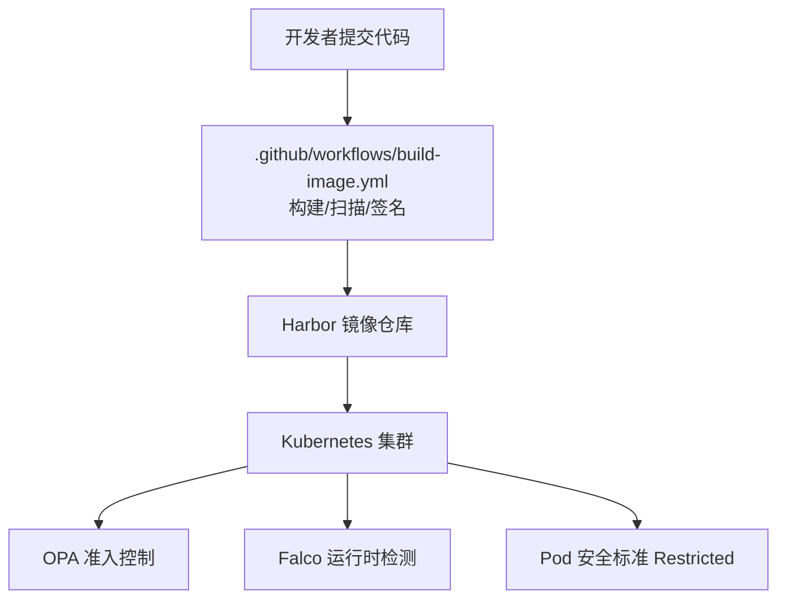
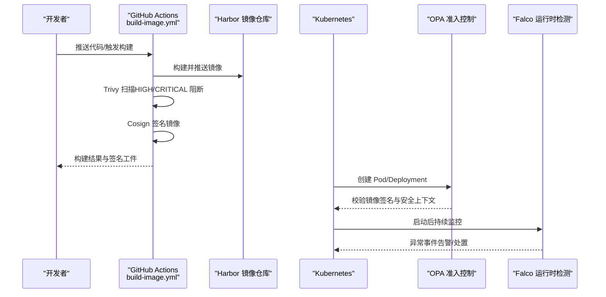
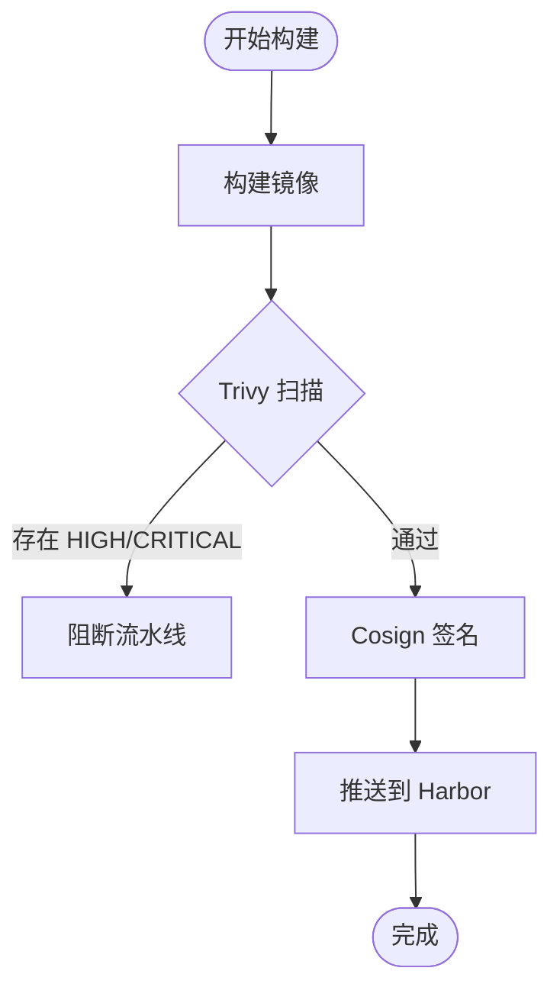
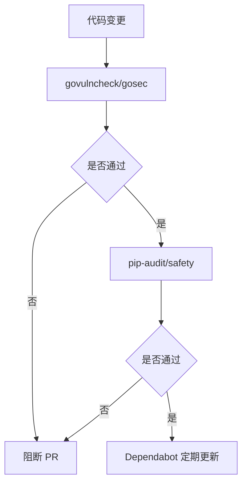
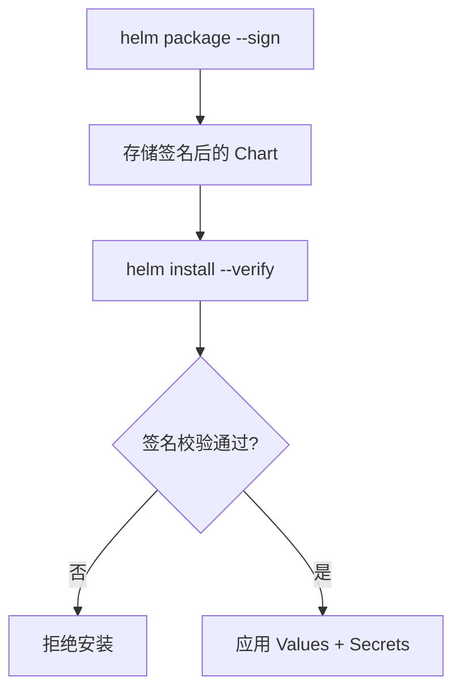
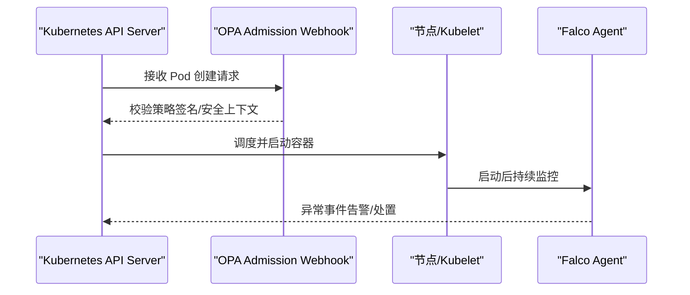
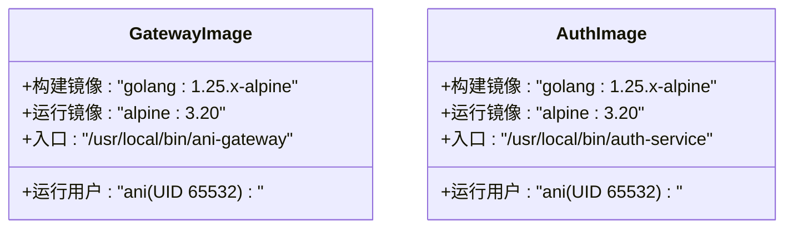
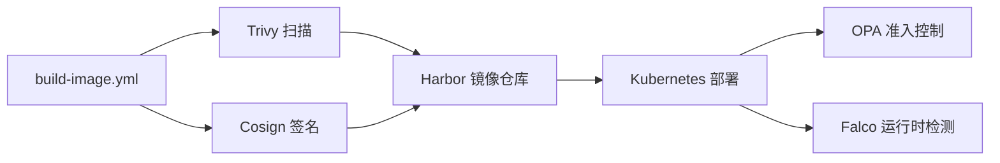

# 供应链安全

<cite>
**本文引用的文件**
- [ANI-08-安全架构设计.md](file://ANI-08-安全架构设计.md)
- [build-image.yml](file://repo/.github/workflows/build-image.yml)
- [ani-gateway Dockerfile](file://repo/services/ani-gateway/Dockerfile)
- [auth-service Dockerfile](file://repo/services/auth-service/Dockerfile)
- [Chart.yaml](file://repo/deploy/helm/ani-platform/Chart.yaml)
- [validate_ci_workflow_test.py](file://repo/scripts/validate_ci_workflow_test.py)
</cite>

## 目录
1. [简介](#简介)
2. [项目结构](#项目结构)
3. [核心组件](#核心组件)
4. [架构总览](#架构总览)
5. [详细组件分析](#详细组件分析)
6. [依赖关系分析](#依赖关系分析)
7. [性能考虑](#性能考虑)
8. [故障排查指南](#故障排查指南)
9. [结论](#结论)
10. [附录](#附录)

## 简介
本文件聚焦 ANI 平台的供应链安全，覆盖镜像安全策略、依赖安全管理、Helm Chart 安全配置、容器运行时安全以及供应链攻击防护与应急响应流程。文档基于仓库中的安全架构设计与 CI/CD、Dockerfile、Helm Chart 等实现进行说明，并提供可操作的流程图与时序图以辅助理解。

## 项目结构
与供应链安全直接相关的工程化资产包括：
- 安全架构设计文档：定义镜像基线、漏洞扫描、签名、OPA/Falco、Pod 安全标准等总体策略。
- CI/CD 构建流水线：负责镜像构建、Trivy 扫描、Cosign 签名。
- 服务镜像 Dockerfile：体现基础镜像选择、非 root 运行、工具链版本固定等实践。
- Helm Chart：平台级打包与发布物，需配合签名校验与无硬编码凭证策略。
- CI 工作流校验脚本：确保依赖扫描、工具链版本、禁止 @latest 等安全基线。

图表来源
- [build-image.yml:1-82](file://repo/.github/workflows/build-image.yml#L1-L82)
- [ANI-08-安全架构设计.md:292-400](file://ANI-08-安全架构设计.md#L292-L400)

章节来源
- [ANI-08-安全架构设计.md:292-400](file://ANI-08-安全架构设计.md#L292-L400)
- [build-image.yml:1-82](file://repo/.github/workflows/build-image.yml#L1-L82)

## 核心组件
- 镜像安全策略
  - 最小化基础镜像：Go 服务使用 distroless/static-debian12；Python 服务使用 slim 变体；禁止 latest 标签，强制 digest pinning。
  - 镜像扫描：CI 中集成 Trivy，HIGH/CRITICAL 阻断合并。
  - 镜像签名：CI 中使用 Cosign 对产物签名，生产环境通过准入控制验证。
- 依赖安全管理
  - Go：govulncheck、gosec；CI 强制最低 Go 工具链版本并匹配构建镜像。
  - Python：pip-audit、safety；Dependabot 定期更新。
- Helm Chart 安全
  - Chart 包签名与安装时签名校验；Values + Secrets 注入，禁止硬编码凭证。
- 容器运行时安全
  - OPA 准入控制：禁止特权容器、强制只读根文件系统、非 root 运行、仅允许签名镜像（生产命名空间）。
  - Falco 运行时威胁检测：自定义规则检测异常进程、数据外泄、未授权访问等。
  - Pod 安全标准：命名空间强制 Restricted 级别。

章节来源
- [ANI-08-安全架构设计.md:292-400](file://ANI-08-安全架构设计.md#L292-L400)
- [build-image.yml:65-82](file://repo/.github/workflows/build-image.yml#L65-L82)
- [validate_ci_workflow_test.py:58-84](file://repo/scripts/validate_ci_workflow_test.py#L58-L84)

## 架构总览
下图展示从代码提交到部署运行的完整供应链安全链路，包含构建、扫描、签名、准入控制与运行时检测。

图表来源
- [build-image.yml:34-82](file://repo/.github/workflows/build-image.yml#L34-L82)
- [ANI-08-安全架构设计.md:341-399](file://ANI-08-安全架构设计.md#L341-L399)

## 详细组件分析

### 镜像安全策略
- 基础镜像选择
  - Go 服务：建议使用 distroless/static-debian12 作为最终运行镜像，减少攻击面。
  - Python 服务：使用 slim 变体，避免 full 镜像带来的多余组件。
- 镜像标签固定
  - 禁止 latest；所有镜像引用必须使用 digest（image@sha256:...），确保可追溯与不可变性。
- Trivy 漏洞扫描
  - CI 阶段执行 Trivy，HIGH/CRITICAL 漏洞将导致流水线失败，阻止不安全镜像进入仓库。
- 镜像签名与验证
  - CI 阶段使用 Cosign 对镜像签名；生产命名空间通过 OPA 准入控制拒绝未签名镜像。

图表来源
- [build-image.yml:53-82](file://repo/.github/workflows/build-image.yml#L53-L82)
- [ANI-08-安全架构设计.md:294-313](file://ANI-08-安全架构设计.md#L294-L313)

章节来源
- [ANI-08-安全架构设计.md:294-313](file://ANI-08-安全架构设计.md#L294-L313)
- [build-image.yml:65-82](file://repo/.github/workflows/build-image.yml#L65-L82)

### 依赖安全管理
- Go 模块漏洞检查
  - govulncheck：在 CI 中对各模块执行漏洞扫描，禁止静态模块列表，动态发现模块。
  - gosec：静态安全分析，识别常见安全问题。
  - 工具链安全基线：CI 要求最低 Go 版本，且构建镜像的 Go 版本与 CI 一致。
- Python 依赖审计
  - pip-audit 与 safety：对 requirements.txt 进行漏洞审计。
  - Dependabot：每周自动提 PR 更新有安全补丁的依赖。
- 工作流契约校验
  - validate_ci_workflow_test.py 强制依赖扫描步骤、工具链版本、禁止 @latest 引用等。

图表来源
- [validate_ci_workflow_test.py:58-84](file://repo/scripts/validate_ci_workflow_test.py#L58-L84)
- [ANI-08-安全架构设计.md:314-330](file://ANI-08-安全架构设计.md#L314-L330)

章节来源
- [validate_ci_workflow_test.py:58-84](file://repo/scripts/validate_ci_workflow_test.py#L58-L84)
- [ANI-08-安全架构设计.md:314-330](file://ANI-08-安全架构设计.md#L314-L330)

### Helm Chart 安全配置
- Chart 包签名验证
  - 发布时使用 helm package --sign 对 Chart 包签名；安装时校验签名，防止篡改。
- 安装时签名检查
  - 建议在部署流程中加入签名校验步骤，确保仅安装可信 Chart。
- 硬编码凭证防护
  - Chart 不得包含任何硬编码密钥或凭证；通过 Values 与 Secret 注入敏感信息。
- 当前 Chart 元数据
  - Chart.yaml 定义了平台 umbrella chart 的基本信息与依赖声明。

图表来源
- [Chart.yaml:1-16](file://repo/deploy/helm/ani-platform/Chart.yaml#L1-L16)
- [ANI-08-安全架构设计.md:331-336](file://ANI-08-安全架构设计.md#L331-L336)

章节来源
- [Chart.yaml:1-16](file://repo/deploy/helm/ani-platform/Chart.yaml#L1-L16)
- [ANI-08-安全架构设计.md:331-336](file://ANI-08-安全架构设计.md#L331-L336)

### 容器运行时安全
- OPA 准入控制策略
  - 禁止特权容器、强制只读根文件系统（推理服务）、非 root 运行、生产命名空间仅允许签名镜像。
- Falco 运行时威胁检测
  - 预置规则检测异常 Shell、模型外泄、未授权读取敏感目录、非白名单外联、疑似挖矿等。
- Pod 安全标准
  - 所有 ANI 命名空间强制 Restricted 级别，限制容器能力与权限。

图表来源
- [ANI-08-安全架构设计.md:341-399](file://ANI-08-安全架构设计.md#L341-L399)

章节来源
- [ANI-08-安全架构设计.md:341-399](file://ANI-08-安全架构设计.md#L341-L399)

### 构建镜像与运行用户
- 构建镜像
  - ani-gateway 与 auth-service 均使用 golang:1.25.x-alpine 作为构建镜像，CGO_ENABLED=0，静态链接二进制。
- 运行镜像
  - 采用 alpine:3.20 作为运行镜像，添加 ca-certificates，创建非 root 用户 ani（UID 65532），以该用户运行服务。
- 工具链一致性
  - CI 校验器要求构建镜像的 Go 版本与 CI 环境变量 GO_VERSION 一致，避免不一致导致的构建差异。

图表来源
- [ani-gateway Dockerfile:1-44](file://repo/services/ani-gateway/Dockerfile#L1-L44)
- [auth-service Dockerfile:1-24](file://repo/services/auth-service/Dockerfile#L1-L24)
- [validate_ci_workflow_test.py:69-79](file://repo/scripts/validate_ci_workflow_test.py#L69-L79)

章节来源
- [ani-gateway Dockerfile:1-44](file://repo/services/ani-gateway/Dockerfile#L1-L44)
- [auth-service Dockerfile:1-24](file://repo/services/auth-service/Dockerfile#L1-L24)
- [validate_ci_workflow_test.py:69-79](file://repo/scripts/validate_ci_workflow_test.py#L69-L79)

## 依赖关系分析
- 构建流水线依赖
  - build-image.yml 依赖 GitHub Actions 提供的 checkout、setup-buildx、login-action、build-push-action、trivy-action、cosign 签名。
  - 镜像产物推送到 Harbor，供后续部署使用。
- 安全校验依赖
  - validate_ci_workflow_test.py 校验 CI 工作流是否符合安全契约（依赖扫描、工具链版本、禁止 @latest）。
- 部署与运行时依赖
  - OPA 与 Falco 作为集群侧安全组件，约束 Pod 创建与运行时行为。
  - Helm Chart 作为部署载体，需配合签名校验与 Values/Secrets 管理。

图表来源
- [build-image.yml:34-82](file://repo/.github/workflows/build-image.yml#L34-L82)
- [validate_ci_workflow_test.py:58-84](file://repo/scripts/validate_ci_workflow_test.py#L58-L84)
- [ANI-08-安全架构设计.md:341-399](file://ANI-08-安全架构设计.md#L341-L399)

章节来源
- [build-image.yml:34-82](file://repo/.github/workflows/build-image.yml#L34-L82)
- [validate_ci_workflow_test.py:58-84](file://repo/scripts/validate_ci_workflow_test.py#L58-L84)
- [ANI-08-安全架构设计.md:341-399](file://ANI-08-安全架构设计.md#L341-L399)

## 性能考虑
- 构建缓存
  - 使用 registry 缓存（cache-from/cache-to）加速多服务并行构建。
- 扫描与签名开销
  - Trivy 与 Cosign 在 CI 中串行执行，建议按服务矩阵并行化以减少整体耗时。
- 运行时检测
  - Falco 规则应精简并避免高开销操作，集中告警与采样以降低性能影响。

[本节为通用指导，不直接分析具体文件]

## 故障排查指南
- 镜像构建失败
  - 检查 Dockerfile 基础镜像与工具链版本是否与 CI 一致；确认 CGO_ENABLED 与静态链接参数。
- Trivy 扫描阻断
  - 查看 HIGH/CRITICAL 漏洞详情，优先修复高危依赖；必要时临时忽略未修复项（ignore-unfixed）但需限期修复。
- Cosign 签名失败
  - 确认 COSIGN_PRIVATE_KEY 与密码正确；检查仓库权限与网络可达性。
- OPA 拒绝部署
  - 检查 Pod 安全上下文（非 root、只读根文件系统）、镜像是否签名；核对命名空间策略。
- Falco 误报
  - 调整规则阈值或白名单；结合业务日志定位真实风险。

章节来源
- [build-image.yml:65-82](file://repo/.github/workflows/build-image.yml#L65-L82)
- [ANI-08-安全架构设计.md:341-399](file://ANI-08-安全架构设计.md#L341-L399)

## 结论
本项目在供应链安全方面已形成较为完整的闭环：从代码提交到镜像构建、漏洞扫描、签名、部署准入与运行时检测均有明确策略与实现。建议持续完善以下方面：
- 统一基础镜像策略（逐步迁移至 distroless/static-debian12）。
- 强化 Helm Chart 签名校验流程与自动化。
- 扩展 Falco 规则库与告警响应机制。
- 引入 Dependabot 自动化依赖更新与治理流程。

[本节为总结性内容，不直接分析具体文件]

## 附录
- 供应链攻击防护要点
  - 禁止 latest 标签，强制 digest pinning。
  - 所有镜像签名并在生产环境强制校验。
  - 依赖扫描与静态分析纳入 PR 门禁。
  - 运行时通过 OPA 与 Falco 双重保障。
- 应急响应流程
  - 发现高危漏洞：立即回滚受影响镜像，通知相关团队，评估影响范围。
  - 凭证泄露：吊销相关密钥/Token，轮换证书，审查访问日志。
  - 运行时异常：隔离受影响 Pod，收集 Falco 事件与审计日志，定位根因。

[本节为通用指导，不直接分析具体文件]