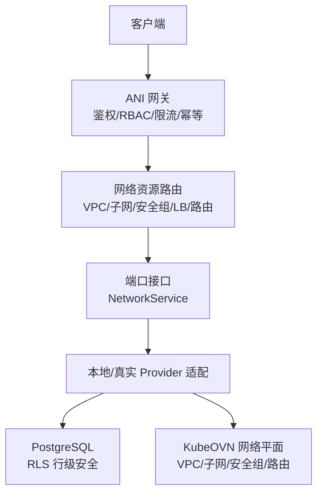
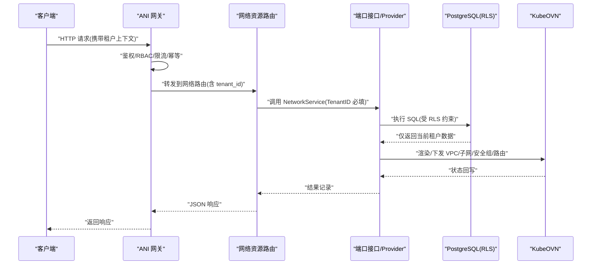
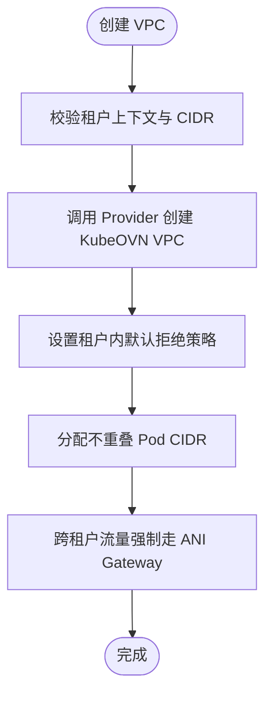
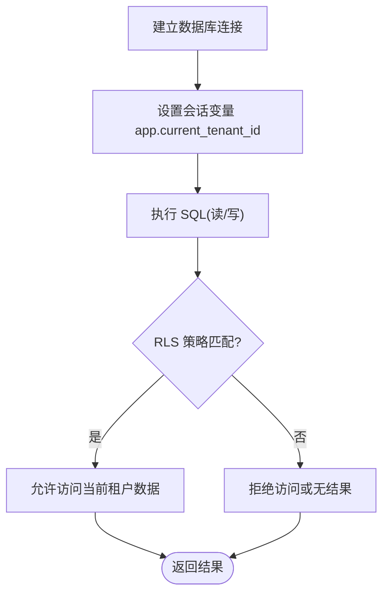
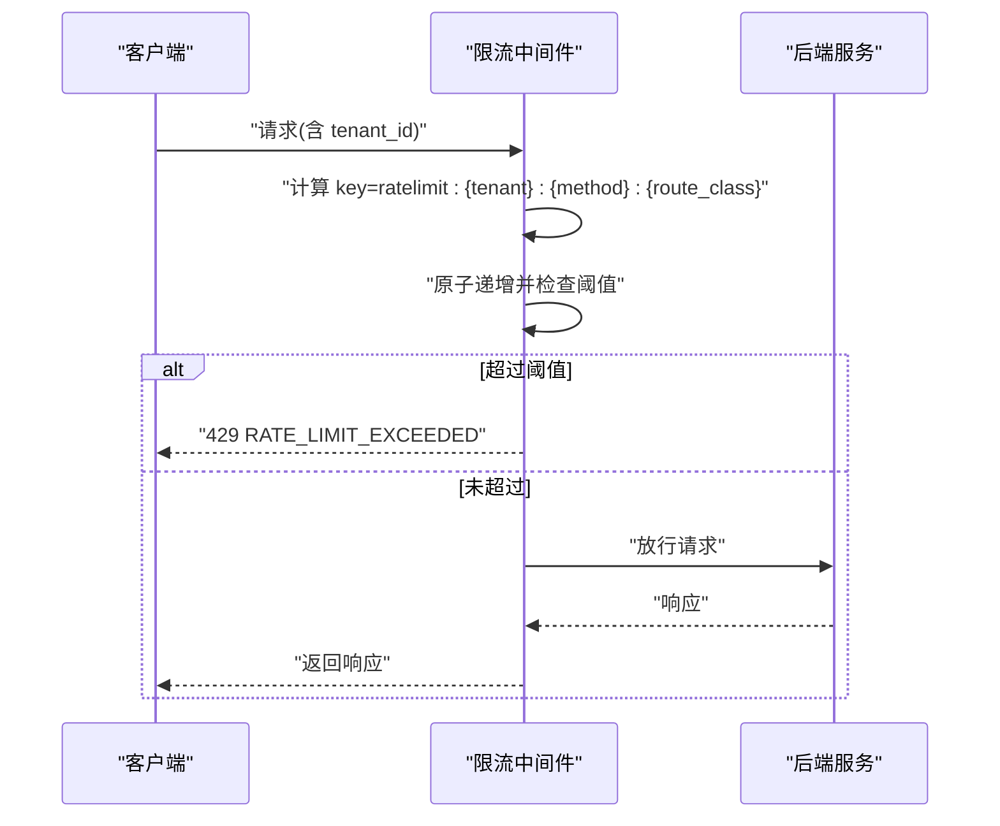
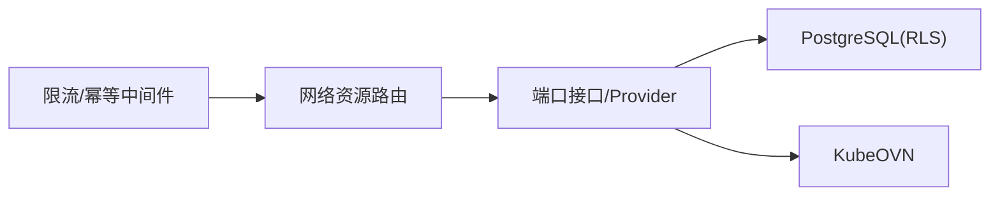

# 多租户隔离

<cite>
**本文引用的文件**
- [ANI-02-产品功能设计.md](file://ANI-02-产品功能设计.md)
- [network_resources.go](file://repo/services/ani-gateway/internal/router/network_resources.go)
- [network_resources_test.go](file://repo/services/ani-gateway/internal/router/network_resources_test.go)
- [ratelimit.go](file://repo/services/ani-gateway/internal/middleware/ratelimit.go)
- [r-p0-1-gateway-rate-limit.md](file://repo/development-records/r-p0-1-gateway-rate-limit.md)
- [sprint14-core-resilience-plan.md](file://repo/development-records/sprint14-core-resilience-plan.md)
- [20260520_005_network_resources.sql](file://repo/deploy/migrations/20260520_005_network_resources.sql)
- [network_resources.go（ports）](file://repo/pkg/ports/network_resources.go)
- [auth.go（网关认证路由）](file://repo/services/ani-gateway/internal/router/auth.go)
- [refresh_tokens_test.go](file://repo/services/auth-service/internal/service/refresh_tokens_test.go)
</cite>

## 目录
1. [简介](#简介)
2. [项目结构](#项目结构)
3. [核心组件](#核心组件)
4. [架构总览](#架构总览)
5. [详细组件分析](#详细组件分析)
6. [依赖关系分析](#依赖关系分析)
7. [性能与配额](#性能与配额)
8. [故障排查指南](#故障排查指南)
9. [结论](#结论)
10. [附录](#附录)

## 简介
本文件聚焦 ANI 平台的多租户隔离能力，围绕以下目标展开：
- KubeOVN VPC 网络隔离：租户间流量默认拒绝、Pod CIDR 不重叠、跨租户通信强制经 ANI Gateway。
- 数据层隔离：PostgreSQL RLS 行级安全策略、租户上下文设置、SQL 查询中的 tenant_id 过滤。
- 资源配额与限流：CPU/内存限制、存储配额、API 调用频率限制。
- 可视化与监控：租户网络拓扑与关键指标观测方案。
- 常见问题排查与最佳实践。

## 项目结构
从代码与文档可见，多租户隔离贯穿“网关—服务—适配器—持久化”全链路：
- 网关层：鉴权、RBAC、幂等、限流中间件；将 tenant_id 注入请求上下文并透传到下游。
- 服务层：网络资源 API（VPC/子网/安全组/负载均衡/路由）在端口定义中显式携带 TenantID，并在路由实现中强制使用当前租户上下文。
- 持久化层：网络相关表通过 PostgreSQL RLS 强制按 app.current_tenant_id 进行行级访问控制。
- 产品文档明确以 KubeOVN 实现 VPC 级网络隔离，并划分租户业务、平台控制面、存储、管理、公网等网络平面。

图表来源
- [network_resources.go:246-283](file://repo/services/ani-gateway/internal/router/network_resources.go#L246-L283)
- [network_resources.go（ports）:314-350](file://repo/pkg/ports/network_resources.go#L314-L350)
- [20260520_005_network_resources.sql:84-110](file://repo/deploy/migrations/20260520_005_network_resources.sql#L84-L110)

章节来源
- [ANI-02-产品功能设计.md:209-246](file://ANI-02-产品功能设计.md#L209-L246)
- [network_resources.go:246-283](file://repo/services/ani-gateway/internal/router/network_resources.go#L246-L283)
- [network_resources.go（ports）:314-350](file://repo/pkg/ports/network_resources.go#L314-L350)
- [20260520_005_network_resources.sql:84-110](file://repo/deploy/migrations/20260520_005_network_resources.sql#L84-L110)

## 核心组件
- 网关限流中间件：基于共享存储的 per-tenant + method + route-class 窗口计数，超限返回 429。
- 网络资源路由：所有网络资源操作均绑定 TenantID，并通过 ports.NetworkService 抽象出统一接口。
- 数据库 RLS：网络相关表启用强制行级安全，策略基于会话变量 app.current_tenant_id 过滤。
- 身份与令牌：JWT claims 包含 tenant_id、user_id、roles、scope，用于后续鉴权与审计。

章节来源
- [ratelimit.go:14-87](file://repo/services/ani-gateway/internal/middleware/ratelimit.go#L14-L87)
- [network_resources.go:294-735](file://repo/services/ani-gateway/internal/router/network_resources.go#L294-L735)
- [20260520_005_network_resources.sql:84-110](file://repo/deploy/migrations/20260520_005_network_resources.sql#L84-L110)
- [refresh_tokens_test.go:52-73](file://repo/services/auth-service/internal/service/refresh_tokens_test.go#L52-L73)

## 架构总览
下图展示一次网络资源请求在多租户环境下的完整流转，强调租户上下文贯穿始终以及 RLS 兜底。

图表来源
- [network_resources.go:294-735](file://repo/services/ani-gateway/internal/router/network_resources.go#L294-L735)
- [network_resources.go（ports）:314-350](file://repo/pkg/ports/network_resources.go#L314-L350)
- [20260520_005_network_resources.sql:84-110](file://repo/deploy/migrations/20260520_005_network_resources.sql#L84-L110)

## 详细组件分析

### 网络隔离与 KubeOVN VPC
- 设计目标：每租户独立 VPC，租户间默认拒绝；Pod CIDR 不重叠；跨租户通信必须经 ANI Gateway。
- 实现要点：
  - 产品文档明确基于 KubeOVN 1.13+ 实现 VPC 级隔离，并定义租户业务、平台控制面、存储、管理、公网等网络平面。
  - 网络资源 API 提供 VPC/子网/安全组/负载均衡/路由等能力，所有资源创建与查询均绑定 TenantID。
  - 测试用例验证跨租户访问被拒绝，确保隔离生效。

图表来源
- [ANI-02-产品功能设计.md:209-246](file://ANI-02-产品功能设计.md#L209-L246)
- [network_resources.go:294-311](file://repo/services/ani-gateway/internal/router/network_resources.go#L294-L311)
- [network_resources_test.go:77-93](file://repo/services/ani-gateway/internal/router/network_resources_test.go#L77-L93)

章节来源
- [ANI-02-产品功能设计.md:209-246](file://ANI-02-产品功能设计.md#L209-L246)
- [network_resources.go:294-311](file://repo/services/ani-gateway/internal/router/network_resources.go#L294-L311)
- [network_resources_test.go:77-93](file://repo/services/ani-gateway/internal/router/network_resources_test.go#L77-L93)

### 数据层隔离：PostgreSQL RLS 与租户上下文
- 行级安全策略：网络相关表启用强制 RLS，策略基于会话变量 app.current_tenant_id 过滤，确保任何 SQL 仅能访问当前租户数据。
- 迁移脚本对 network_vpcs、network_subnets、network_security_groups、network_load_balancers 分别启用 RLS 并创建 tenant_isolation 策略。
- 应用侧需在连接建立时设置 app.current_tenant_id，使 RLS 生效。

图表来源
- [20260520_005_network_resources.sql:84-110](file://repo/deploy/migrations/20260520_005_network_resources.sql#L84-L110)

章节来源
- [20260520_005_network_resources.sql:84-110](file://repo/deploy/migrations/20260520_005_network_resources.sql#L84-L110)

### 资源配额与 API 限流
- API 限流：网关中间件基于共享存储实现 per-tenant + method + route-class 窗口计数，超限返回 429；公共路径与缺失租户上下文的请求放行。
- 配置项：通过环境变量覆盖请求数与时间窗口，默认 100 req/s。
- 配额管理：产品文档暴露 /api/v1/tenants 接口用于租户管理与配额/用量；结合 vCluster 控制面隔离与 KubeOVN 网络隔离，形成多维配额与隔离体系。

图表来源
- [ratelimit.go:14-87](file://repo/services/ani-gateway/internal/middleware/ratelimit.go#L14-L87)
- [r-p0-1-gateway-rate-limit.md:1-39](file://repo/development-records/r-p0-1-gateway-rate-limit.md#L1-L39)

章节来源
- [ratelimit.go:14-87](file://repo/services/ani-gateway/internal/middleware/ratelimit.go#L14-L87)
- [r-p0-1-gateway-rate-limit.md:1-39](file://repo/development-records/r-p0-1-gateway-rate-limit.md#L1-L39)
- [ANI-02-产品功能设计.md:231-246](file://ANI-02-产品功能设计.md#L231-L246)

### 身份与租户上下文
- JWT claims 包含 tenant_id、user_id、roles、scope，用于鉴权、RBAC 与审计。
- 网关认证路由在缺少租户上下文时直接拒绝，避免越权。

章节来源
- [refresh_tokens_test.go:52-73](file://repo/services/auth-service/internal/service/refresh_tokens_test.go#L52-L73)
- [auth.go（网关认证路由）:398-496](file://repo/services/ani-gateway/internal/router/auth.go#L398-L496)

## 依赖关系分析
- 网关中间件依赖共享存储（如 Redis）实现分布式限流与幂等。
- 网络路由依赖 ports.NetworkService 抽象，屏蔽本地/真实 Provider 差异。
- Provider 适配器负责渲染与下发 KubeOVN 资源，并维护状态。
- 数据库层通过 RLS 强制租户隔离，避免应用层遗漏导致的越权。

图表来源
- [network_resources.go:246-283](file://repo/services/ani-gateway/internal/router/network_resources.go#L246-L283)
- [network_resources.go（ports）:314-350](file://repo/pkg/ports/network_resources.go#L314-L350)
- [20260520_005_network_resources.sql:84-110](file://repo/deploy/migrations/20260520_005_network_resources.sql#L84-L110)

章节来源
- [network_resources.go:246-283](file://repo/services/ani-gateway/internal/router/network_resources.go#L246-L283)
- [network_resources.go（ports）:314-350](file://repo/pkg/ports/network_resources.go#L314-L350)
- [20260520_005_network_resources.sql:84-110](file://repo/deploy/migrations/20260520_005_network_resources.sql#L84-L110)

## 性能与配额
- 限流性能：基于原子递增与 TTL 的窗口计数，键空间为 ratelimit:{tenant}:{method}:{route_class}，默认 100 req/s，可通过环境变量调整。
- 背压与降级：当限流存储不可用时，返回 503 而非放行，保证 fail-closed。
- 配额维度：
  - CPU/内存：由 vCluster 与 K8s 调度器（如 Volcano）结合租户标签进行资源隔离与配额控制。
  - 存储配额：通过对象存储/块存储的命名空间或桶/卷配额策略限制。
  - API 调用频率：网关层 per-tenant 限流保护后端稳定性。

章节来源
- [ratelimit.go:14-87](file://repo/services/ani-gateway/internal/middleware/ratelimit.go#L14-L87)
- [sprint14-core-resilience-plan.md:264-286](file://repo/development-records/sprint14-core-resilience-plan.md#L264-L286)
- [ANI-02-产品功能设计.md:231-246](file://ANI-02-产品功能设计.md#L231-L246)

## 故障排查指南
- 跨租户访问成功：检查网络路由是否错误传入其他租户 ID；确认 RLS 策略已启用且会话变量设置正确。
- 限流误杀：核对 key 生成逻辑（tenant/method/route_class），确认阈值与环境变量配置；观察共享存储可用性。
- 网络资源状态异常：查看 Provider 渲染与下发日志，确认 KubeOVN 资源状态；核对 VPC/子网 CIDR 是否冲突。
- 鉴权失败：检查 JWT claims 中 tenant_id、roles、scope 是否正确；确认网关认证路由对缺失租户上下文的处理。

章节来源
- [network_resources_test.go:77-93](file://repo/services/ani-gateway/internal/router/network_resources_test.go#L77-L93)
- [ratelimit.go:14-87](file://repo/services/ani-gateway/internal/middleware/ratelimit.go#L14-L87)
- [20260520_005_network_resources.sql:84-110](file://repo/deploy/migrations/20260520_005_network_resources.sql#L84-L110)
- [auth.go（网关认证路由）:398-496](file://repo/services/ani-gateway/internal/router/auth.go#L398-L496)

## 结论
ANI 平台通过“网关—服务—适配器—数据库—网络”多层联动实现强隔离：
- 网络层：KubeOVN VPC 隔离、默认拒绝、CIDR 不重叠、跨租户强制经 Gateway。
- 数据层：PostgreSQL RLS 强制按租户过滤，fail-closed。
- 配额与限流：网关层 per-tenant 限流，vCluster/K8s 调度器与存储配额配合。
- 可观测性：建议基于 Prometheus/Grafana 采集网关限流、网络资源状态、数据库 RLS 命中等指标，构建租户级拓扑视图。

## 附录
- 推荐监控指标
  - 网关：per-tenant 请求量、429 比例、鉴权失败率。
  - 网络：VPC/子网/安全组/LB 状态分布、创建/删除耗时。
  - 数据库：RLS 命中率、慢查询、连接池使用率。
- 最佳实践
  - 所有网络资源操作必须携带有效 tenant_id。
  - 数据库连接初始化时必须设置 app.current_tenant_id。
  - 跨租户通信一律经 ANI Gateway，禁止直连。
  - 定期审计安全组规则与路由策略，避免过度开放。