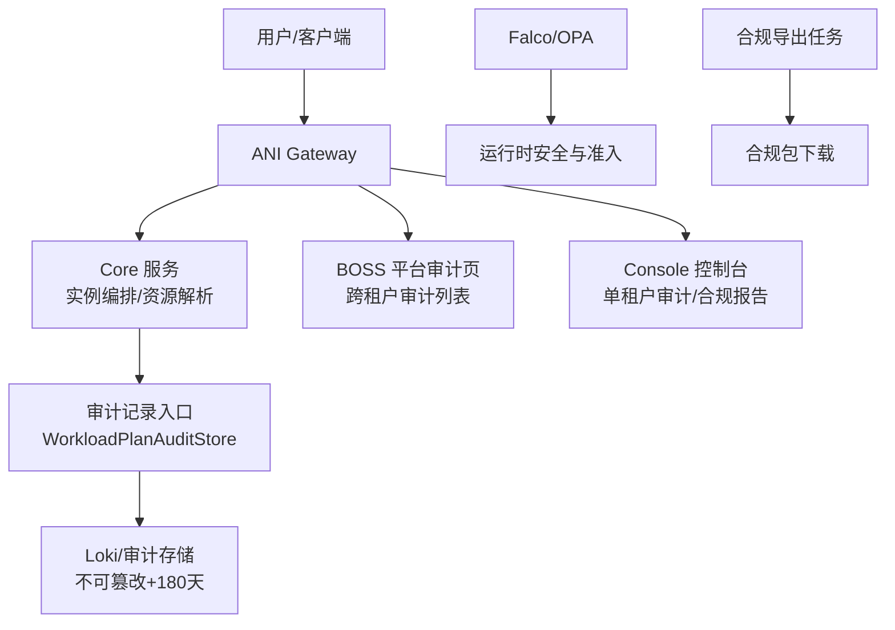
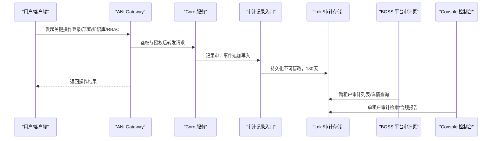
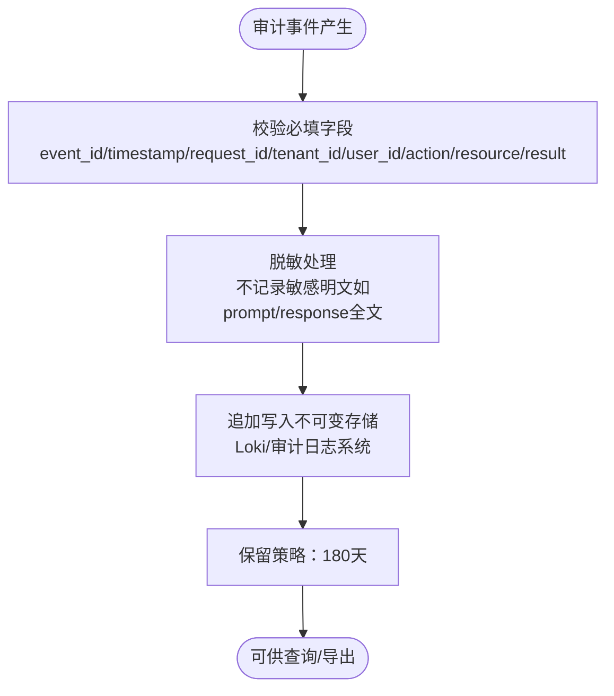
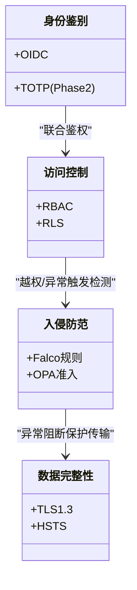
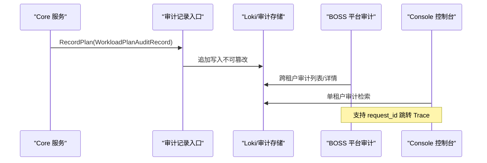
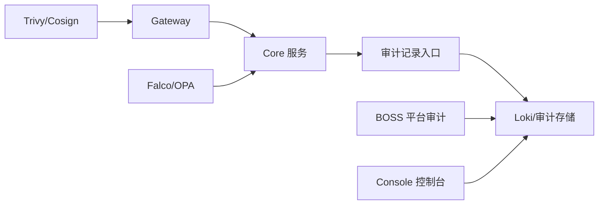

# 安全审计与合规

<cite>
**本文引用的文件**
- [ANI-08-安全架构设计.md](file://ANI-08-安全架构设计.md)
- [platform-audit-log.md](file://repo/services/docs/boss-modules/audit/platform-audit-log.md)
- [prd-console-audit-log.md](file://repo/services/tasks/modules/prd/console/security/prd-console-audit-log.md)
- [spec-console-audit-log.md](file://repo/services/tasks/modules/spec/console/security/spec-console-audit-log.md)
- [compliance.md](file://repo/services/docs/console-modules/security/compliance.md)
- [openapi-phase3-agent-audit-draft.md](file://repo/services/docs/console-modules/openapi-drafts/phase3/openapi-phase3-agent-audit-draft.md)
- [instance_orchestrator.go](file://repo/pkg/adapters/runtime/instance_orchestrator.go)
- [idempotency_test.go](file://repo/services/ani-gateway/internal/middleware/idempotency_test.go)
</cite>

## 目录
1. [引言](#引言)
2. [项目结构](#项目结构)
3. [核心组件](#核心组件)
4. [架构总览](#架构总览)
5. [详细组件分析](#详细组件分析)
6. [依赖关系分析](#依赖关系分析)
7. [性能考虑](#性能考虑)
8. [故障排查指南](#故障排查指南)
9. [结论](#结论)
10. [附录](#附录)

## 引言
本文件面向平台管理员、SRE 与安全合规人员，系统性说明 ANI 平台的安全审计与合规能力。内容覆盖：
- 审计日志规范：不可篡改的追加写入方式、180 天保留策略、标准 JSON 字段定义
- 关键审计事件清单：登录、密码修改、模型部署、知识库操作、推理调用、RBAC 变更等
- 等保 2.0 三级合规实现：身份鉴别（双因素认证）、访问控制（最小权限）、入侵防范（异常行为检测）、数据完整性（传输加密）
- 审计日志收集、存储、查询与分析方案
- 合规检查与审计报告生成工具与流程边界

## 项目结构
与安全审计和合规相关的文档与代码分布在以下位置：
- 顶层安全架构设计：定义审计日志规范、等保 2.0 控制项映射与总体策略
- BOSS 平台侧：平台级跨租户审计日志页面与导出能力规划
- Console 控制台侧：单租户审计日志只读视图与合规报告查看
- Services 层：Agent 审计 OpenAPI 草案、合规接口草案
- Core 运行时：实例编排中的工作负载计划审计记录接入点
- Gateway 中间件：幂等与请求去重测试用例，体现对可审计操作的幂等保障

**图示来源**
- [ANI-08-安全架构设计.md:402-450](file://ANI-08-安全架构设计.md#L402-L450)
- [platform-audit-log.md:55-71](file://repo/services/docs/boss-modules/audit/platform-audit-log.md#L55-L71)
- [compliance.md:17-28](file://repo/services/docs/console-modules/security/compliance.md#L17-L28)

**章节来源**
- [ANI-08-安全架构设计.md:402-450](file://ANI-08-安全架构设计.md#L402-L450)
- [platform-audit-log.md:1-108](file://repo/services/docs/boss-modules/audit/platform-audit-log.md#L1-L108)
- [compliance.md:1-87](file://repo/services/docs/console-modules/security/compliance.md#L1-L87)

## 核心组件
- 审计日志规范与保留策略
  - 审计日志不可篡改、仅追加写入，保留 180 天以满足等保要求
  - 每条审计记录包含事件标识、时间戳、请求 ID、租户、主体、来源 IP、动作、资源、结果、耗时与扩展元数据
- 关键审计事件清单
  - 必须审计的事件包括：用户登录成功/失败、密码修改/API Key 创建与吊销、模型部署/删除、知识库创建/文档上传/删除、推理调用（记录 who/model/tokens，不记录具体内容）、RBAC 权限变更、平台配置修改、证书轮换、Patch 升级执行
- 平台与租户侧审计视图
  - BOSS：跨租户平台审计事件列表与详情、request_id 跳转 Trace、合规导出入口（写操作待 YAML 冻结）
  - Console：单租户审计日志只读检索；合规摘要与历史报告只读列表
- Agent 审计
  - 独立于平台审计与实例安全事件，提供 tool_call、LLM 摘要、策略命中等事件，需脱敏 prompt/response 正文
- 合规能力
  - 合规摘要与报告只读；完整合规包生成与取证归 BOSS

**章节来源**
- [ANI-08-安全架构设计.md:406-450](file://ANI-08-安全架构设计.md#L406-L450)
- [platform-audit-log.md:20-108](file://repo/services/docs/boss-modules/audit/platform-audit-log.md#L20-L108)
- [openapi-phase3-agent-audit-draft.md:10-34](file://repo/services/docs/console-modules/openapi-drafts/phase3/openapi-phase3-agent-audit-draft.md#L10-L34)
- [compliance.md:17-56](file://repo/services/docs/console-modules/security/compliance.md#L17-L56)

## 架构总览
审计与合规的整体流程如下：
- 所有敏感或关键操作在 ANI Gateway 或 Core 服务中触发
- Core 运行时在关键路径上记录工作负载计划审计（如实例编排），通过 WorkloadPlanAuditStore 写入不可变审计流
- 审计事件统一进入 Loki 等不可篡改存储，按 180 天保留策略归档
- BOSS 提供跨租户审计列表与详情、Trace 跳转与合规导出；Console 提供单租户审计检索与合规报告查看
- 运行时安全由 Falco 与 OPA 提供异常检测与准入控制，作为入侵防范与最小权限的补充

**图示来源**
- [ANI-08-安全架构设计.md:406-450](file://ANI-08-安全架构设计.md#L406-L450)
- [platform-audit-log.md:55-108](file://repo/services/docs/boss-modules/audit/platform-audit-log.md#L55-L108)
- [compliance.md:17-56](file://repo/services/docs/console-modules/security/compliance.md#L17-L56)

## 详细组件分析

### 审计日志规范与标准 JSON 格式
- 不可篡改与追加写入
  - 审计日志采用不可变追加写入模式，禁止覆盖或删除，确保事后取证可信
- 保留策略
  - 保留 180 天，满足等保 2.0 对审计日志留存的要求
- 标准 JSON 字段
  - 事件标识、时间戳、请求 ID、租户 ID、用户 ID、来源 IP、动作、资源、结果、耗时毫秒、扩展元数据
  - 该字段集用于平台审计、租户审计与 Agent 审计的统一对齐与展示

**图示来源**
- [ANI-08-安全架构设计.md:406-450](file://ANI-08-安全架构设计.md#L406-L450)
- [openapi-phase3-agent-audit-draft.md:10-34](file://repo/services/docs/console-modules/openapi-drafts/phase3/openapi-phase3-agent-audit-draft.md#L10-L34)

**章节来源**
- [ANI-08-安全架构设计.md:406-450](file://ANI-08-安全架构设计.md#L406-L450)

### 关键审计事件清单
- 必须审计的操作类型
  - 用户登录成功/失败
  - 密码修改 / API Key 创建 / 吊销
  - 模型部署 / 删除
  - 知识库创建 / 文档上传 / 删除
  - 推理调用（记录 who/model/tokens，不记录具体内容）
  - RBAC 权限变更
  - 平台配置修改
  - 证书轮换
  - Patch 升级执行
- 事件分类与读者
  - 平台审计：面向安全合规与平台管理员
  - 实例安全事件：面向算力运维
  - Agent 行为审计：面向 Agent 运维与租户管理员，需严格脱敏

**章节来源**
- [ANI-08-安全架构设计.md:426-436](file://ANI-08-安全架构设计.md#L426-L436)
- [openapi-phase3-agent-audit-draft.md:10-34](file://repo/services/docs/console-modules/openapi-drafts/phase3/openapi-phase3-agent-audit-draft.md#L10-L34)

### 等保 2.0 三级合规实现
- 身份鉴别（双因素认证）
  - 当前阶段：OIDC + TOTP（Dex插件，Phase 2）
- 访问控制（最小权限）
  - RBAC + PostgreSQL RLS 多租户隔离，确保最小权限与数据隔离
- 入侵防范（异常行为检测）
  - Falco 运行时威胁检测规则，针对异常进程、外联、挖矿等行为告警与处置
- 数据完整性（传输加密）
  - TLS 1.3 全链路加密，强制最低版本与禁用弱套件，HSTS 启用
- 其他控制项
  - 恶意代码防范：镜像扫描（Trivy）+ 签名验证（Cosign）
  - 数据保密性：etcd Secret 静态加密 + 模型 SM4 加密
  - 备份恢复：Velero 自动备份
  - 密码管理：Dex 密码策略

**图示来源**
- [ANI-08-安全架构设计.md:437-450](file://ANI-08-安全架构设计.md#L437-L450)

**章节来源**
- [ANI-08-安全架构设计.md:437-450](file://ANI-08-安全架构设计.md#L437-L450)

### 审计日志收集、存储、查询与分析
- 收集
  - 关键操作在 Gateway/Core 中触发，Core 运行时通过 WorkloadPlanAuditStore 记录工作负载计划审计
  - 平台审计与租户审计分别由 BOSS 与 Console 提供只读视图
- 存储
  - 不可篡改追加写入，180 天保留策略
- 查询
  - BOSS：跨租户 list/get，支持 tenant_id、actor、action、resource_type、result、时间范围、request_id、分页
  - Console：单租户审计检索，对齐字段口径
- 分析
  - 结合 request_id 跳转 Trace，定位问题链路
  - 合规导出任务（写操作待 YAML 冻结）生成 CSV/Parquet 等取证包

**图示来源**
- [instance_orchestrator.go:123-168](file://repo/pkg/adapters/runtime/instance_orchestrator.go#L123-L168)
- [platform-audit-log.md:55-108](file://repo/services/docs/boss-modules/audit/platform-audit-log.md#L55-L108)

**章节来源**
- [instance_orchestrator.go:123-168](file://repo/pkg/adapters/runtime/instance_orchestrator.go#L123-L168)
- [platform-audit-log.md:55-108](file://repo/services/docs/boss-modules/audit/platform-audit-log.md#L55-L108)

### 合规检查与审计报告生成工具
- 合规能力（Console 只读）
  - 合规摘要：overall_status、控制项 checklist、open_actions
  - 报告列表：类型、周期、status、download_url（ready 时）
  - 无 Console 侧创建报告 POST，完整合规包生成与取证归 BOSS
- 平台审计导出（BOSS）
  - 写操作（触发合规/CSV 导出）待 YAML 冻结，须 idempotency_key
  - 异步任务返回 task_id，轮询 GET /api/v1/tasks/{task_id} 获取进度
- 接口草案（Services 层）
  - GET /api/v1/svc/compliance/summary
  - GET /api/v1/svc/compliance/reports
  - GET /api/v1/svc/compliance/reports/{report_id}
  - RBAC：scope:compliance:read（无 write）

**章节来源**
- [compliance.md:17-56](file://repo/services/docs/console-modules/security/compliance.md#L17-L56)
- [platform-audit-log.md:260-267](file://repo/services/docs/boss-modules/audit/platform-audit-log.md#L260-L267)

### 幂等与可审计操作保障
- 幂等中间件
  - 对公开端点（如平台密码登录）使用 idempotency_key 进行去重，避免重复提交导致审计噪声
  - 测试覆盖同 key 重复提交返回相同 TokenPair，并设置 Idempotent-Replay 头
- 审计关联
  - 幂等响应与审计事件通过 request_id 关联，便于追踪与取证

**章节来源**
- [idempotency_test.go:207-256](file://repo/services/ani-gateway/internal/middleware/idempotency_test.go#L207-L256)

## 依赖关系分析
- 组件耦合与职责
  - Gateway：鉴权、限流、幂等、审计事件入口
  - Core：业务逻辑与工作负载计划审计记录
  - BOSS：跨租户审计列表、详情、合规导出
  - Console：单租户审计检索、合规报告只读
  - 存储：Loki/审计存储（不可篡改、180 天）
- 外部依赖与集成点
  - OIDC/Dex：身份认证与组映射
  - Falco/OPA：运行时威胁检测与准入控制
  - Trivy/Cosign：镜像漏洞扫描与签名验证
- 潜在循环依赖
  - 审计记录入口与存储服务为单向依赖，避免循环
- 接口契约
  - 平台审计 list/get 与 Console 审计字段对齐，Agent 审计独立且需脱敏

**图示来源**
- [ANI-08-安全架构设计.md:402-450](file://ANI-08-安全架构设计.md#L402-L450)
- [platform-audit-log.md:55-108](file://repo/services/docs/boss-modules/audit/platform-audit-log.md#L55-L108)

**章节来源**
- [ANI-08-安全架构设计.md:402-450](file://ANI-08-安全架构设计.md#L402-L450)
- [platform-audit-log.md:55-108](file://repo/services/docs/boss-modules/audit/platform-audit-log.md#L55-L108)

## 性能考虑
- 审计写入
  - 追加写入模式减少锁竞争，适合高并发场景
  - 建议批量落盘与异步持久化，降低主链路延迟
- 查询与展示
  - 跨租户 list 使用 cursor 分页，避免大结果集拖慢响应
  - request_id 跳转 Trace 应带时间窗口，缩小检索范围
- 存储与保留
  - 180 天保留策略需评估存储容量与归档成本，建议冷热分层
- 幂等与去重
  - idempotency_key 去重可减少重复审计事件，提升审计质量

[本节提供一般性指导，无需特定文件引用]

## 故障排查指南
- 常见错误与处理
  - 时间范围非法：start_time 必须早于 end_time，前端拦截并在后端返回 400
  - 无平台 audit 读权限：返回 403 FORBIDDEN，检查平台 RBAC scope
  - 幂等重复提交：Idempotent-Replay 头为 true，避免重复审计
- 审计缺失排查
  - 确认 Core 运行时是否注入 WorkloadPlanAuditStore
  - 检查 Loki/审计存储是否可用，追加写入是否成功
- Trace 关联
  - 使用 request_id 跳转 Trace，定位问题链路

**章节来源**
- [platform-audit-log.md:323-345](file://repo/services/docs/boss-modules/audit/platform-audit-log.md#L323-L345)
- [idempotency_test.go:207-256](file://repo/services/ani-gateway/internal/middleware/idempotency_test.go#L207-L256)

## 结论
ANI 平台在安全审计与合规方面已建立清晰的规范与架构：
- 审计日志不可篡改、追加写入，180 天保留满足等保要求
- 关键审计事件清单覆盖登录、密码修改、模型部署、知识库操作、推理调用、RBAC 变更等
- 等保 2.0 三级控制在身份鉴别、访问控制、入侵防范、数据完整性等方面有明确实现与规划
- 平台与租户侧审计视图分工明确，Agent 审计独立且严格脱敏
- 合规导出与报告生成在 BOSS 侧提供，Console 侧只读展示
后续需推进：
- 平台审计 list/get YAML 冻结与实现
- 合规导出写操作 YAML 冻结与实现
- 全资源审计覆盖与保留策略落地
- 双因素认证（TOTP）与内容安全过滤等 Phase 2 能力交付

[本节总结性内容，无需特定文件引用]

## 附录
- 相关模块与参考
  - 平台审计日志：BOSS 跨租户审计列表与详情
  - 控制台审计日志：单租户只读检索
  - Agent 审计：tool_call、LLM 摘要、策略命中事件
  - 合规能力：摘要与报告只读，完整包生成归 BOSS

[本节为参考信息，无需特定文件引用]