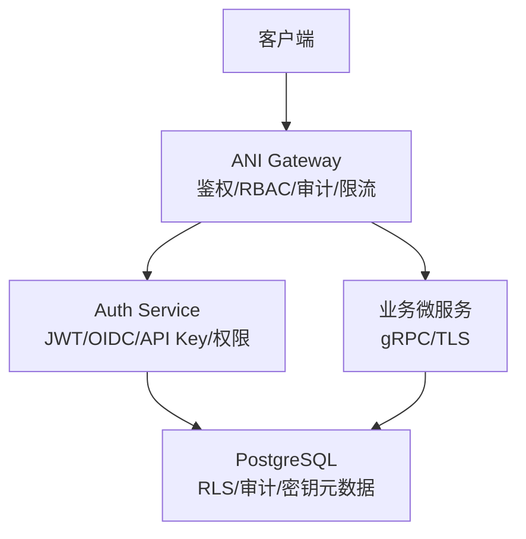
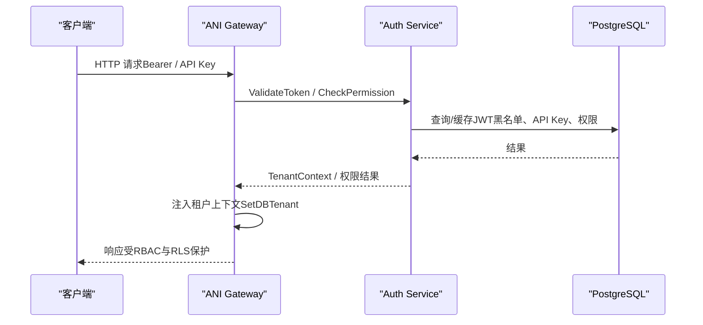
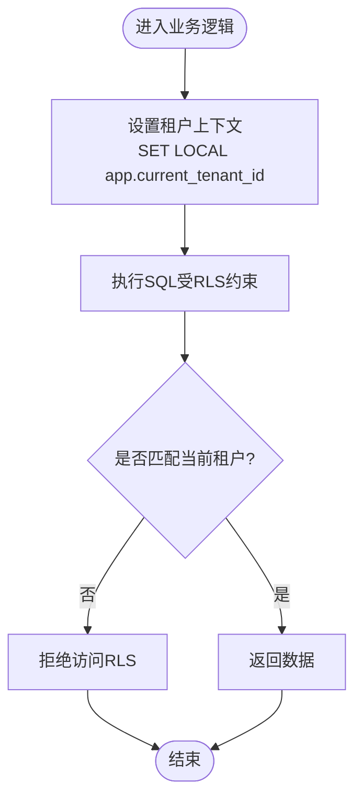
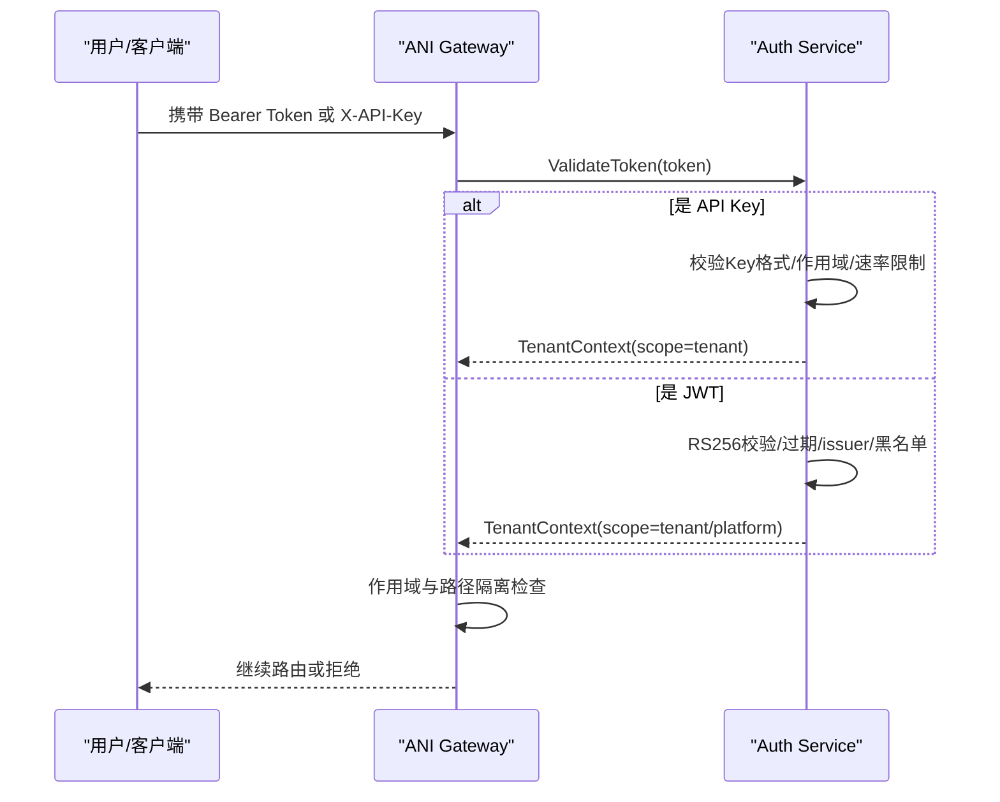
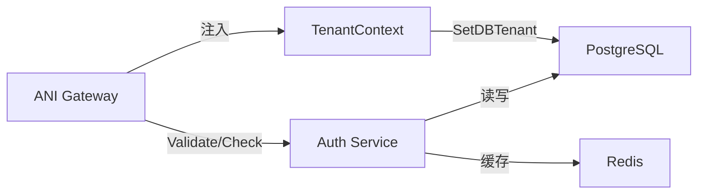

# 安全设计

<cite>
**本文引用的文件**
- [ANI-08-安全架构设计.md](file://ANI-08-安全架构设计.md)
- [auth_service.go](file://repo/services/auth-service/internal/service/auth_service.go)
- [jwt.go](file://repo/services/auth-service/internal/service/jwt.go)
- [api_keys.go](file://repo/services/auth-service/internal/service/api_keys.go)
- [auth.go](file://repo/services/ani-gateway/internal/middleware/auth.go)
- [rbac.go](file://repo/services/ani-gateway/internal/middleware/rbac.go)
- [tenant.go](file://repo/pkg/types/tenant.go)
</cite>

## 目录
1. [引言](#引言)
2. [项目结构](#项目结构)
3. [核心组件](#核心组件)
4. [架构总览](#架构总览)
5. [详细组件分析](#详细组件分析)
6. [依赖关系分析](#依赖关系分析)
7. [性能与可用性考虑](#性能与可用性考虑)
8. [故障排查指南](#故障排查指南)
9. [结论](#结论)
10. [附录](#附录)

## 引言
本文件聚焦平台的安全设计与实现，覆盖多租户隔离、认证授权体系（JWT、RBAC、OIDC、API Key）、网络安全策略（TLS、防火墙/网络策略、访问控制列表）、数据安全（加密存储、传输加密、敏感信息保护），以及安全审计、漏洞扫描与合规检查的实施要点。文档以仓库中的安全架构设计与关键服务代码为依据，提供可落地的实施说明与排障指引。

## 项目结构
安全相关能力由网关层与认证服务共同构成：
- ANI Gateway：统一入口，负责鉴权中间件、RBAC 权限校验、请求上下文注入、限流与审计等横切能力。
- Auth Service：集中处理登录、OIDC 流程、JWT 签发与校验、刷新令牌、令牌吊销、API Key 生命周期与速率限制、权限判定。
- 类型与上下文：TenantContext 在请求链路中传递租户与用户身份，驱动数据库行级安全（RLS）与后续数据访问边界。

图示来源
- [auth.go:22-141](file://repo/services/ani-gateway/internal/middleware/auth.go#L22-L141)
- [auth_service.go:59-159](file://repo/services/auth-service/internal/service/auth_service.go#L59-L159)
- [tenant.go:48-63](file://repo/pkg/types/tenant.go#L48-L63)

章节来源
- [ANI-08-安全架构设计.md:78-152](file://ANI-08-安全架构设计.md#L78-L152)
- [auth.go:22-141](file://repo/services/ani-gateway/internal/middleware/auth.go#L22-L141)
- [auth_service.go:59-159](file://repo/services/auth-service/internal/service/auth_service.go#L59-L159)
- [tenant.go:48-63](file://repo/pkg/types/tenant.go#L48-L63)

## 核心组件
- 认证与令牌
  - JWT 校验：RS256 签名验证、过期/生效时间、颁发者校验、黑名单（jti）检查。
  - OIDC：Begin/Complete 流程，state 校验、redirect_uri 校验、JWKS discovery/kid 选择、group→role 白名单映射。
  - Refresh Token：仅续发 Access Token，Refresh Token 不可续期。
  - API Key：生成、哈希存储、前缀展示、作用域与速率限制、吊销。
- 权限模型
  - RBAC：角色矩阵（platform-admin、tenant-admin、auditor、user、service-account），资源:动作粒度控制。
  - 路径与作用域隔离：平台路由仅 platform scope 可访问；sandbox token 仅允许子资源。
- 多租户隔离
  - 网络层：KubeOVN VPC 隔离 + NetworkPolicy 默认拒绝。
  - 数据层：PostgreSQL RLS，通过会话变量 app.current_tenant_id 强制租户隔离。
  - 上下文：TenantContext 贯穿请求，驱动 SetDBTenant 设置租户上下文。

章节来源
- [jwt.go:96-169](file://repo/services/auth-service/internal/service/jwt.go#L96-L169)
- [auth_service.go:73-108](file://repo/services/auth-service/internal/service/auth_service.go#L73-L108)
- [api_keys.go:223-269](file://repo/services/auth-service/internal/service/api_keys.go#L223-L269)
- [rbac.go:21-71](file://repo/services/ani-gateway/internal/middleware/rbac.go#L21-L71)
- [auth.go:214-229](file://repo/services/ani-gateway/internal/middleware/auth.go#L214-L229)
- [tenant.go:48-63](file://repo/pkg/types/tenant.go#L48-L63)
- [ANI-08-安全架构设计.md:78-152](file://ANI-08-安全架构设计.md#L78-L152)

## 架构总览
系统采用“零信任 + 纵深防御”的分层安全架构：
- 网络层：VPC 隔离与 NetworkPolicy 默认拒绝，仅 ANI Gateway 作为跨租户唯一入口。
- 传输层：强制 TLS 1.3，内部 gRPC mTLS，证书自动轮换。
- 身份层：JWT/OIDC/API Key 统一认证，Gateway 侧完成作用域与路径隔离。
- 应用层：RBAC 资源:动作校验，输入校验与注入防护。
- 数据层：RLS 强制租户隔离，敏感字段加密存储，审计日志不可篡改。
- 运行时：OPA 准入控制、Falco 异常检测、Restricted Pod 安全标准。

图示来源
- [auth.go:51-137](file://repo/services/ani-gateway/internal/middleware/auth.go#L51-L137)
- [auth_service.go:123-159](file://repo/services/auth-service/internal/service/auth_service.go#L123-L159)
- [tenant.go:48-63](file://repo/pkg/types/tenant.go#L48-L63)

## 详细组件分析

### 多租户隔离机制
- 网络隔离
  - 每租户独立 KubeOVN VPC，Pod CIDR 不重叠；租户间流量默认 DROP，仅经 ANI Gateway 的 API 调用合法。
  - 每个组件声明显式 NetworkPolicy（拒绝所有 + 白名单放行）。
- 数据隔离
  - 所有业务表启用 RLS；连接/事务开始时设置 app.current_tenant_id；任何越权访问将被数据库策略拒绝。
  - TenantContext 由 Gateway 注入，确保下游服务在事务内正确设置租户上下文。
- 权限控制
  - RBAC 在 Gateway 中间件执行，按资源:动作维度校验；auditor 只读；service-account 仅限 API Key 授权范围。
  - 路径与作用域隔离：平台路由仅 platform scope 可访问；sandbox token 仅允许特定子资源。

图示来源
- [tenant.go:48-63](file://repo/pkg/types/tenant.go#L48-L63)
- [rbac.go:21-71](file://repo/services/ani-gateway/internal/middleware/rbac.go#L21-L71)
- [auth.go:214-229](file://repo/services/ani-gateway/internal/middleware/auth.go#L214-L229)
- [ANI-08-安全架构设计.md:78-152](file://ANI-08-安全架构设计.md#L78-L152)

章节来源
- [ANI-08-安全架构设计.md:78-152](file://ANI-08-安全架构设计.md#L78-L152)
- [tenant.go:48-63](file://repo/pkg/types/tenant.go#L48-L63)
- [rbac.go:21-71](file://repo/services/ani-gateway/internal/middleware/rbac.go#L21-L71)
- [auth.go:214-229](file://repo/services/ani-gateway/internal/middleware/auth.go#L214-L229)

### 认证授权体系
- JWT 令牌管理
  - 算法 RS256；校验包括签名、过期/生效时间、颁发者、黑名单（jti）。
  - 支持 JWKS discovery 与 kid 选择；静态公钥作为离线 fallback。
  - 密钥轮换：私钥定期轮换，旧公钥保留窗口用于存量 Token 验证。
- RBAC 权限模型
  - 角色矩阵：platform-admin、tenant-admin、auditor、user、service-account。
  - 资源:动作粒度控制；auditor 只读；用户角色受限操作集。
- OIDC 集成
  - Begin/Complete 流程严格校验 state 与 redirect_uri；group→role 白名单映射，未配置映射仅授予 user。
- API Key 管理
  - 格式包含环境、租户与随机部分；数据库中仅存哈希值，创建时返回一次原始值。
  - 支持作用域与速率限制；可立即吊销。

图示来源
- [auth.go:51-137](file://repo/services/ani-gateway/internal/middleware/auth.go#L51-L137)
- [auth_service.go:123-159](file://repo/services/auth-service/internal/service/auth_service.go#L123-L159)
- [jwt.go:96-169](file://repo/services/auth-service/internal/service/jwt.go#L96-L169)
- [api_keys.go:223-269](file://repo/services/auth-service/internal/service/api_keys.go#L223-L269)

章节来源
- [jwt.go:96-169](file://repo/services/auth-service/internal/service/jwt.go#L96-L169)
- [auth_service.go:73-108](file://repo/services/auth-service/internal/service/auth_service.go#L73-L108)
- [auth_service.go:123-159](file://repo/services/auth-service/internal/service/auth_service.go#L123-L159)
- [api_keys.go:223-269](file://repo/services/auth-service/internal/service/api_keys.go#L223-L269)
- [rbac.go:21-71](file://repo/services/ani-gateway/internal/middleware/rbac.go#L21-L71)

### 网络安全策略
- TLS 配置
  - 外部 HTTPS/TLS 1.3；内部 gRPC mTLS；HSTS 头；禁用弱套件。
  - 证书由 cert-manager 自动签发与轮换，事件写入审计日志。
- 防火墙规则与访问控制
  - KubeOVN VPC 隔离；NetworkPolicy 默认拒绝，白名单放行。
  - 出口流量经 NAT + 白名单过滤（AI Agent 沙箱）。
- 访问控制列表
  - 平台路由仅 platform scope 可访问；sandbox token 仅允许子资源；其他路由仅 tenant scope。

章节来源
- [ANI-08-安全架构设计.md:78-152](file://ANI-08-安全架构设计.md#L78-L152)
- [auth.go:214-229](file://repo/services/ani-gateway/internal/middleware/auth.go#L214-L229)

### 数据安全保护措施
- 加密存储
  - K8s Secret 静态加密（etcd EncryptionConfiguration）；加密密钥文件权限 0600。
  - 模型文件可选 SM4 加密（用户密钥），存储于对象存储。
- 传输加密
  - 全链路 TLS 1.3；内部服务 gRPC mTLS。
- 敏感信息保护
  - JWT Claims 不含敏感信息；密码使用 bcrypt；API Key 仅存哈希。
  - 推理输入脱敏（NER）预留扩展点，Phase 2 实现。

章节来源
- [ANI-08-安全架构设计.md:221-290](file://ANI-08-安全架构设计.md#L221-L290)
- [api_keys.go:320-344](file://repo/services/auth-service/internal/service/api_keys.go#L320-L344)

### 安全审计、漏洞扫描与合规检查
- 安全审计
  - 审计日志不可篡改、追加写入、保留 180 天；记录登录、凭证变更、资源操作、证书轮换等关键事件。
- 漏洞扫描
  - CI 阶段运行 gosec、trivy、govulncheck；镜像签名（Cosign）与准入控制（OPA）验证。
- 合规检查
  - 等保 2.0 三级：双因素（Phase 2）、最小权限（RBAC+RLS）、入侵防范（Falco）、备份恢复（Velero）等。

章节来源
- [ANI-08-安全架构设计.md:402-450](file://ANI-08-安全架构设计.md#L402-L450)
- [ANI-08-安全架构设计.md:292-337](file://ANI-08-安全架构设计.md#L292-L337)

## 依赖关系分析
- Gateway 依赖 Auth Service 进行令牌校验与权限判定；通过 TenantContext 将租户上下文传递给下游服务。
- Auth Service 依赖 PostgreSQL 持久化 API Key、刷新令牌与黑名单；依赖缓存（Redis）做快路径黑名单与速率限制。
- 数据访问层通过 SetDBTenant 在事务内设置租户上下文，确保 RLS 生效。

图示来源
- [auth.go:51-137](file://repo/services/ani-gateway/internal/middleware/auth.go#L51-L137)
- [auth_service.go:123-159](file://repo/services/auth-service/internal/service/auth_service.go#L123-L159)
- [tenant.go:48-63](file://repo/pkg/types/tenant.go#L48-L63)

章节来源
- [auth.go:51-137](file://repo/services/ani-gateway/internal/middleware/auth.go#L51-L137)
- [auth_service.go:123-159](file://repo/services/auth-service/internal/service/auth_service.go#L123-L159)
- [tenant.go:48-63](file://repo/pkg/types/tenant.go#L48-L63)

## 性能与可用性考虑
- 令牌校验与黑名单
  - 黑名单优先查缓存（O(1)），未命中再查持久化并回填缓存，降低延迟。
- API Key 速率限制
  - 基于 Redis 增量计数，按 Key 维度限速，避免滥用。
- 上下文注入
  - TenantContext 在 Gateway 注入，减少重复解析；SetDBTenant 使用 SET LOCAL 限定事务范围，避免连接池污染。
- 传输与证书
  - TLS 1.3 与 mTLS 提升安全性同时保持高性能；证书自动轮换减少停机风险。

章节来源
- [jwt.go:160-168](file://repo/services/auth-service/internal/service/jwt.go#L160-L168)
- [api_keys.go:306-318](file://repo/services/auth-service/internal/service/api_keys.go#L306-L318)
- [tenant.go:48-63](file://repo/pkg/types/tenant.go#L48-L63)

## 故障排查指南
- 认证失败
  - 检查 Authorization Header 是否为 Bearer Token 或 X-API-Key；确认 Token 未过期且未被吊销。
  - 若为 API Key，确认 Key 未过期、未吊销且未超过速率限制。
- 权限不足
  - 检查路径与作用域是否匹配；平台路由需 platform scope；sandbox token 仅允许子资源。
  - 检查 RBAC 资源:动作是否被角色允许。
- 数据越权
  - 确认 TenantContext 已注入；确认 SetDBTenant 已在事务内调用；检查 RLS 策略是否正确设置 app.current_tenant_id。
- 常见问题定位
  - 查看审计日志与错误响应；核对 OIDC state/redirect_uri 校验；确认 JWKS/kid 选择正确。

章节来源
- [auth.go:27-141](file://repo/services/ani-gateway/internal/middleware/auth.go#L27-L141)
- [rbac.go:21-71](file://repo/services/ani-gateway/internal/middleware/rbac.go#L21-L71)
- [tenant.go:48-63](file://repo/pkg/types/tenant.go#L48-L63)
- [api_keys.go:223-269](file://repo/services/auth-service/internal/service/api_keys.go#L223-L269)

## 结论
本安全设计以零信任与纵深防御为核心，通过 KubeOVN VPC 隔离、TLS 1.3/mTLS、JWT/OIDC/API Key 统一认证、RBAC 权限控制、PostgreSQL RLS 数据隔离与完整审计，构建了覆盖网络、传输、身份、应用与数据的多层防护体系。结合 CI/CD 中的漏洞扫描与合规检查，以及运行时 OPA/Falco 策略，形成从开发到运行的闭环安全治理。后续可按 Phase 规划逐步补齐 Prompt 注入防护、内容安全过滤与增强沙箱等高级能力。

## 附录
- 角色矩阵参考
  - platform-admin：全平台管理与配置。
  - tenant-admin：租户内资源管理与用户邀请。
  - auditor：租户内只读审计。
  - user：租户内使用 AI 应用与查看用量。
  - service-account：程序调用，仅 API Key 授权范围。
- 关键路径与作用域
  - 平台路由：/api/v1/auth/platform/*、/api/v1/platform/*、/api/v1/admin/* 仅 platform scope。
  - sandbox 子资源：/api/v1/instances/{id}/sandbox/* 仅 sandbox token。
  - 其他路由：仅 tenant scope。

章节来源
- [rbac.go:21-71](file://repo/services/ani-gateway/internal/middleware/rbac.go#L21-L71)
- [auth.go:214-229](file://repo/services/ani-gateway/internal/middleware/auth.go#L214-L229)
- [ANI-08-安全架构设计.md:199-218](file://ANI-08-安全架构设计.md#L199-L218)