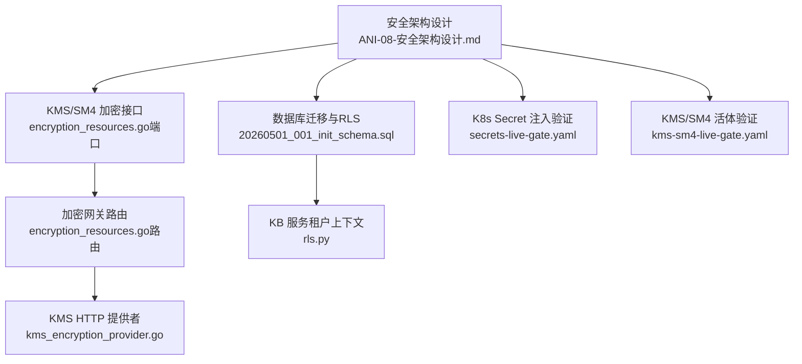
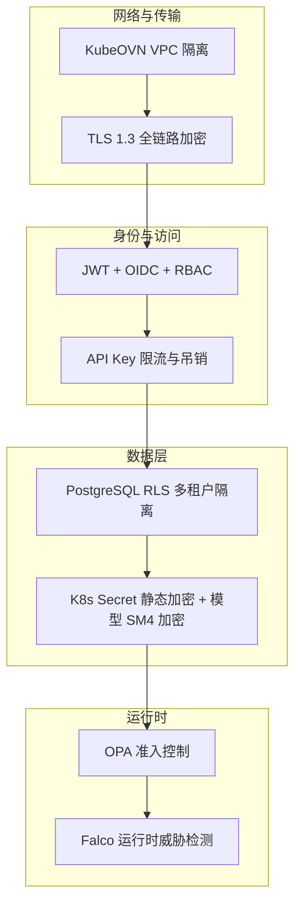
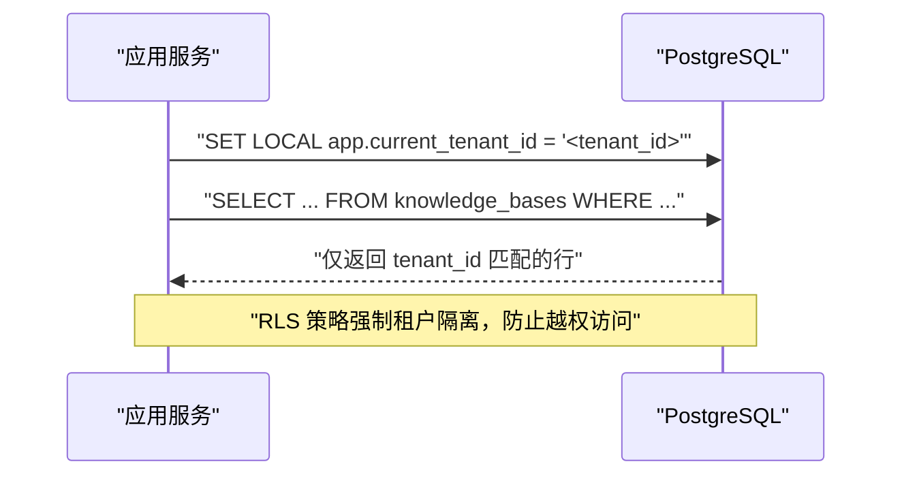
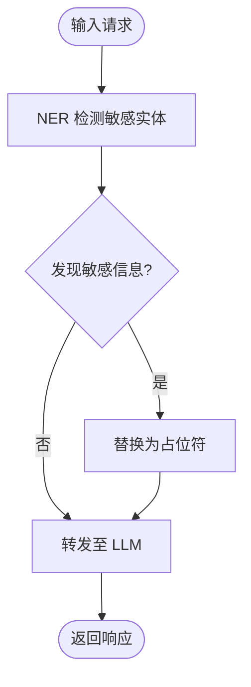
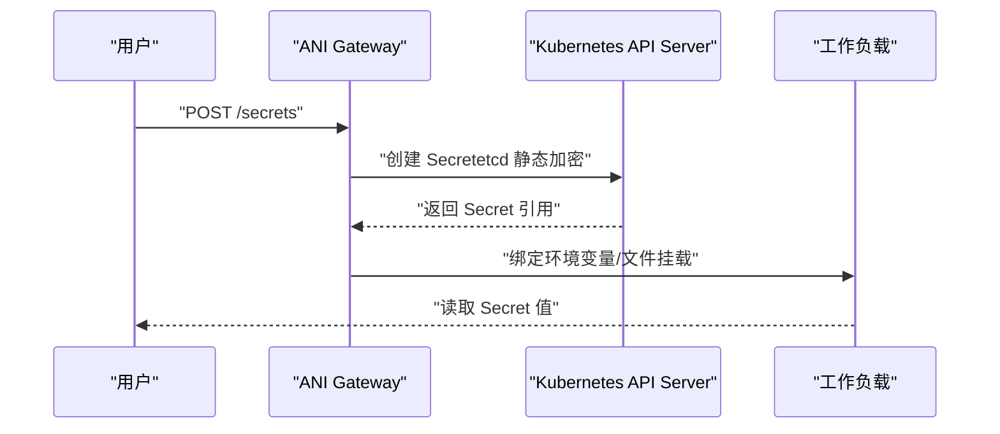
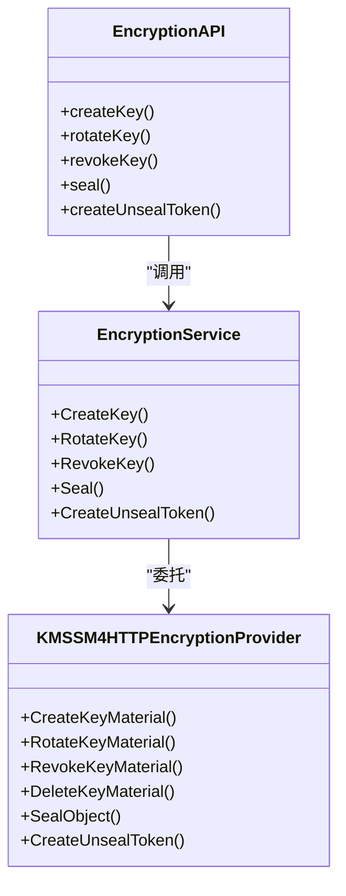
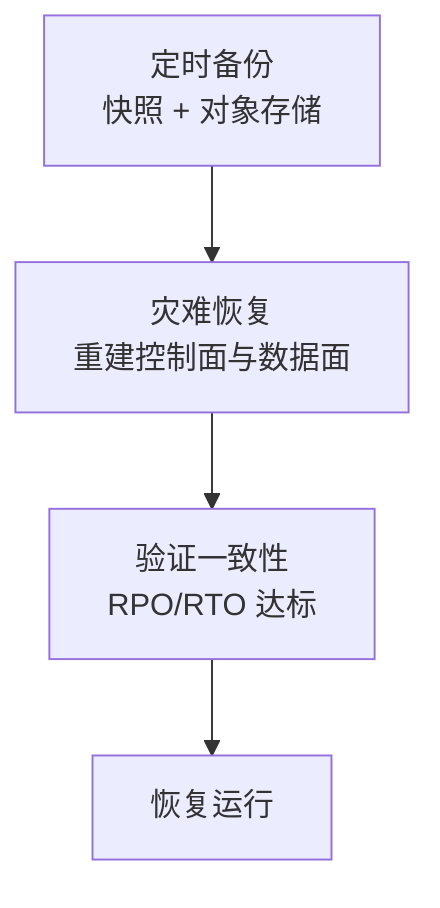
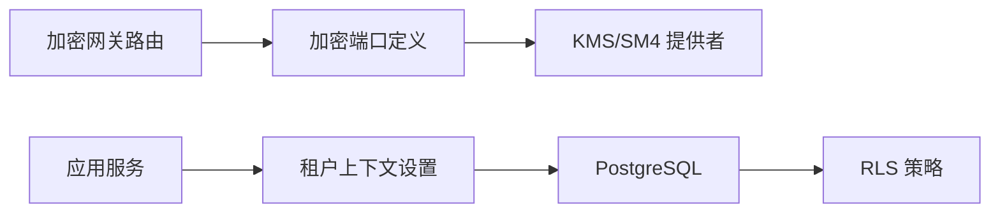

# 数据安全

<cite>
**本文引用的文件**
- [ANI-08-安全架构设计.md](file://ANI-08-安全架构设计.md)
- [20260501_001_init_schema.sql](file://repo/deploy/migrations/20260501_001_init_schema.sql)
- [rls.py](file://repo/services/kb-service/app/repositories/rls.py)
- [kms_encryption_provider.go](file://repo/pkg/adapters/runtime/kms_encryption_provider.go)
- [encryption_resources.go（路由）](file://repo/services/ani-gateway/internal/router/encryption_resources.go)
- [encryption_resources.go（端口定义）](file://repo/pkg/ports/encryption_resources.go)
- [secrets-live-gate.yaml](file://repo/deploy/real-k8s-lab/secrets-live-gate.yaml)
- [kms-sm4-live-gate.yaml](file://repo/deploy/real-k8s-lab/kms-sm4-live-gate.yaml)
</cite>

## 目录
1. [引言](#引言)
2. [项目结构](#项目结构)
3. [核心组件](#核心组件)
4. [架构总览](#架构总览)
5. [详细组件分析](#详细组件分析)
6. [依赖关系分析](#依赖关系分析)
7. [性能考量](#性能考量)
8. [故障排查指南](#故障排查指南)
9. [结论](#结论)
10. [附录](#附录)

## 引言
本文件聚焦平台的数据安全保护措施，覆盖数据分类与保护级别、数据库行级安全（PostgreSQL RLS）、敏感信息脱敏机制、K8s Secret 静态加密与 etcd 加密存储、模型文件 SM4 加密、以及数据备份恢复与灾难恢复策略。文档基于仓库中的安全架构设计与具体实现文件进行梳理，确保读者既能理解整体策略，也能定位到代码与配置位置。

## 项目结构
与安全相关的关键目录与文件：
- 安全架构总览与原则：ANI-08-安全架构设计.md
- 数据库初始迁移与 RLS 策略：20260501_001_init_schema.sql
- KB 服务租户上下文设置（RLS 配合）：rls.py
- KMS/SM4 加密提供者与网关接口：kms_encryption_provider.go、encryption_resources.go（路由）、encryption_resources.go（端口定义）
- K8s Secret 注入与可见性验证：secrets-live-gate.yaml
- KMS/SM4 端到端校验用例：kms-sm4-live-gate.yaml

**图示来源**
- [ANI-08-安全架构设计.md:221-290](file://ANI-08-安全架构设计.md#L221-L290)
- [20260501_001_init_schema.sql:525-627](file://repo/deploy/migrations/20260501_001_init_schema.sql#L525-L627)
- [encryption_resources.go（端口定义）:215-236](file://repo/pkg/ports/encryption_resources.go#L215-L236)
- [encryption_resources.go（路由）:84-94](file://repo/services/ani-gateway/internal/router/encryption_resources.go#L84-L94)
- [kms_encryption_provider.go:17-49](file://repo/pkg/adapters/runtime/kms_encryption_provider.go#L17-L49)
- [secrets-live-gate.yaml:15-39](file://repo/deploy/real-k8s-lab/secrets-live-gate.yaml#L15-L39)
- [kms-sm4-live-gate.yaml:14-35](file://repo/deploy/real-k8s-lab/kms-sm4-live-gate.yaml#L14-L35)

**章节来源**
- [ANI-08-安全架构设计.md:221-290](file://ANI-08-安全架构设计.md#L221-L290)
- [20260501_001_init_schema.sql:525-627](file://repo/deploy/migrations/20260501_001_init_schema.sql#L525-L627)
- [rls.py:1-32](file://repo/services/kb-service/app/repositories/rls.py#L1-L32)
- [encryption_resources.go（端口定义）:215-236](file://repo/pkg/ports/encryption_resources.go#L215-L236)
- [encryption_resources.go（路由）:84-94](file://repo/services/ani-gateway/internal/router/encryption_resources.go#L84-L94)
- [kms_encryption_provider.go:17-49](file://repo/pkg/adapters/runtime/kms_encryption_provider.go#L17-L49)
- [secrets-live-gate.yaml:15-39](file://repo/deploy/real-k8s-lab/secrets-live-gate.yaml#L15-L39)
- [kms-sm4-live-gate.yaml:14-35](file://repo/deploy/real-k8s-lab/kms-sm4-live-gate.yaml#L14-L35)

## 核心组件
- 数据分类与保护级别：高敏感（模型文件、知识库文档、推理对话记录）、极高敏感（认证凭证）、中低敏感（审计日志、系统指标）。
- 数据库行级安全（RLS）：所有业务表启用强制 RLS，策略通过租户上下文 app.current_tenant_id 过滤。
- 敏感信息脱敏：推理前对输入进行 NER 检测并替换手机号、身份证号、银行卡号等敏感字段。
- K8s Secret 静态加密：etcd 中 Secret 使用 EncryptionConfiguration 静态加密；Secret 注入工作负载环境变量或挂载文件。
- 模型文件 SM4 加密：通过 KMS/SM4 提供者提供密钥生命周期管理与流式封解密密钥能力，支持 seal/unseal-token 流程。
- 备份恢复与灾难恢复：结合快照、对象存储持久化与多副本策略，保障控制面与数据面可用性。

**章节来源**
- [ANI-08-安全架构设计.md:221-290](file://ANI-08-安全架构设计.md#L221-L290)
- [20260501_001_init_schema.sql:525-627](file://repo/deploy/migrations/20260501_001_init_schema.sql#L525-L627)
- [rls.py:1-32](file://repo/services/kb-service/app/repositories/rls.py#L1-L32)
- [encryption_resources.go（端口定义）:215-236](file://repo/pkg/ports/encryption_resources.go#L215-L236)
- [kms_encryption_provider.go:87-120](file://repo/pkg/adapters/runtime/kms_encryption_provider.go#L87-L120)
- [secrets-live-gate.yaml:15-39](file://repo/deploy/real-k8s-lab/secrets-live-gate.yaml#L15-L39)

## 架构总览
平台采用纵深防御与零信任原则，网络层（VPC隔离）、传输层（TLS 1.3）、身份层（JWT/OIDC/RBAC）、应用层（输入校验/权限检查）、数据层（RLS+存储加密）、运行时（OPA/Falco）多层防护。数据安全在数据层以 RLS 与存储加密为核心，辅以传输加密与访问控制。

**图示来源**
- [ANI-08-安全架构设计.md:38-66](file://ANI-08-安全架构设计.md#L38-L66)
- [ANI-08-安全架构设计.md:128-152](file://ANI-08-安全架构设计.md#L128-L152)
- [ANI-08-安全架构设计.md:155-219](file://ANI-08-安全架构设计.md#L155-L219)
- [ANI-08-安全架构设计.md:221-290](file://ANI-08-安全架构设计.md#L221-L290)
- [ANI-08-安全架构设计.md:339-400](file://ANI-08-安全架构设计.md#L339-L400)

## 详细组件分析

### 数据分类与保护级别
- 高敏感：模型文件（可选 SM4 加密）、知识库文档（VPC 隔离+访问控制）、推理对话记录（RLS 隔离）。
- 极高敏感：认证凭证（密码哈希、K8s Secret 加密），不直接传输明文。
- 中低敏感：审计日志（追加不可篡改）、系统指标（内部 TLS）。

保护策略要点：
- 传输层强制 TLS 1.3，禁用弱套件。
- 存储层启用 RLS 与 Secret 静态加密，模型文件支持 SM4 加密。
- 访问控制通过 RBAC 与 API Key 限流、吊销机制。

**章节来源**
- [ANI-08-安全架构设计.md:221-290](file://ANI-08-安全架构设计.md#L221-L290)
- [ANI-08-安全架构设计.md:128-152](file://ANI-08-安全架构设计.md#L128-L152)
- [ANI-08-安全架构设计.md:199-219](file://ANI-08-安全架构设计.md#L199-L219)

### 数据库行级安全（PostgreSQL RLS）
- 所有业务表启用强制 RLS，策略为 tenant_id = current_setting('app.current_tenant_id')::uuid。
- 应用程序在每个事务开始时设置租户上下文，确保 SQL 查询自动按租户过滤。
- KB 服务通过 set_tenant_context(conn, tenant_id) 在事务内执行 SET LOCAL app.current_tenant_id。

**图示来源**
- [20260501_001_init_schema.sql:525-627](file://repo/deploy/migrations/20260501_001_init_schema.sql#L525-L627)
- [rls.py:16-32](file://repo/services/kb-service/app/repositories/rls.py#L16-L32)

**章节来源**
- [20260501_001_init_schema.sql:525-627](file://repo/deploy/migrations/20260501_001_init_schema.sql#L525-L627)
- [rls.py:1-32](file://repo/services/kb-service/app/repositories/rls.py#L1-L32)

### 敏感信息脱敏机制（NER）
- 推理前对输入进行命名实体识别（NER），检测并替换手机号、身份证号、银行卡号等敏感信息。
- 脱敏中间件在 Phase 1 预留接口位置，Phase 2 完整实现，不影响主链路性能。
- 输出不会还原脱敏内容，避免敏感信息泄露。

**图示来源**
- [ANI-08-安全架构设计.md:254-269](file://ANI-08-安全架构设计.md#L254-L269)

**章节来源**
- [ANI-08-安全架构设计.md:254-269](file://ANI-08-安全架构设计.md#L254-L269)

### K8s Secret 静态加密与注入
- etcd 中 Secret 启用 EncryptionConfiguration 静态加密，密钥由安装时生成并安全存储。
- Secret 可通过环境变量或文件挂载注入工作负载，支持 Pod 与 KubeVirt VM。
- 活体验证包含创建 Secret、绑定环境变量/文件、读取可见性等步骤。

**图示来源**
- [ANI-08-安全架构设计.md:270-290](file://ANI-08-安全架构设计.md#L270-L290)
- [secrets-live-gate.yaml:15-39](file://repo/deploy/real-k8s-lab/secrets-live-gate.yaml#L15-L39)

**章节来源**
- [ANI-08-安全架构设计.md:270-290](file://ANI-08-安全架构设计.md#L270-L290)
- [secrets-live-gate.yaml:15-39](file://repo/deploy/real-k8s-lab/secrets-live-gate.yaml#L15-L39)

### 模型文件 SM4 加密
- 通过 KMS/SM4 提供者实现密钥生命周期管理（创建、旋转、吊销、删除）与流式封解密。
- 网关暴露加密资源接口，支持 seal/unseal-token 流程，返回密封对象 URI 与临时解密密钥。
- 活体验证涵盖创建密钥、封送对象、写入对象存储、读取密封内容、解封比对等步骤。

**图示来源**
- [kms_encryption_provider.go:17-49](file://repo/pkg/adapters/runtime/kms_encryption_provider.go#L17-L49)
- [encryption_resources.go（端口定义）:215-236](file://repo/pkg/ports/encryption_resources.go#L215-L236)
- [encryption_resources.go（路由）:84-94](file://repo/services/ani-gateway/internal/router/encryption_resources.go#L84-L94)

**章节来源**
- [kms_encryption_provider.go:87-120](file://repo/pkg/adapters/runtime/kms_encryption_provider.go#L87-L120)
- [encryption_resources.go（路由）:162-186](file://repo/services/ani-gateway/internal/router/encryption_resources.go#L162-L186)
- [kms-sm4-live-gate.yaml:14-35](file://repo/deploy/real-k8s-lab/kms-sm4-live-gate.yaml#L14-L35)

### 数据备份恢复与灾难恢复策略
- 控制面与数据面通过快照与对象存储持久化保障可恢复性。
- 实例与工作负载状态以数据库为真相源，支持重建与幂等处理。
- 建议结合 Velero 等工具实现集群级备份与跨域恢复，确保 RPO/RTO 目标达成。

**章节来源**
- [ANI-08-安全架构设计.md:437-450](file://ANI-08-安全架构设计.md#L437-L450)

## 依赖关系分析
- 网关路由依赖端口定义的服务接口，端口定义抽象了加密服务的实现细节。
- KMS 提供者通过 HTTP 与外部 KMS/SM4 服务交互，网关负责编排密钥生命周期与封解密流程。
- RLS 策略依赖数据库迁移脚本中的策略定义，应用服务需在事务中设置租户上下文。

**图示来源**
- [encryption_resources.go（路由）:84-94](file://repo/services/ani-gateway/internal/router/encryption_resources.go#L84-L94)
- [encryption_resources.go（端口定义）:215-236](file://repo/pkg/ports/encryption_resources.go#L215-L236)
- [kms_encryption_provider.go:17-49](file://repo/pkg/adapters/runtime/kms_encryption_provider.go#L17-L49)
- [20260501_001_init_schema.sql:525-627](file://repo/deploy/migrations/20260501_001_init_schema.sql#L525-L627)
- [rls.py:16-32](file://repo/services/kb-service/app/repositories/rls.py#L16-L32)

**章节来源**
- [encryption_resources.go（路由）:84-94](file://repo/services/ani-gateway/internal/router/encryption_resources.go#L84-L94)
- [encryption_resources.go（端口定义）:215-236](file://repo/pkg/ports/encryption_resources.go#L215-L236)
- [kms_encryption_provider.go:17-49](file://repo/pkg/adapters/runtime/kms_encryption_provider.go#L17-L49)
- [20260501_001_init_schema.sql:525-627](file://repo/deploy/migrations/20260501_001_init_schema.sql#L525-L627)
- [rls.py:16-32](file://repo/services/kb-service/app/repositories/rls.py#L16-L32)

## 性能考量
- RLS 策略在数据库层执行，减少应用层过滤开销，但需确保索引优化（如 tenant_id 索引）。
- NER 脱敏在推理前执行，应异步或缓存以减少延迟影响。
- KMS/SM4 流式封解密应避免大对象一次性加载，采用分块处理提升吞吐。

[本节为通用指导，无需特定文件引用]

## 故障排查指南
- RLS 租户上下文未设置：检查应用是否在事务中调用 set_tenant_context 或等效的 SET LOCAL 语句。
- 加密接口失败：核对 KMS 提供者可达性与鉴权令牌，查看网关错误码与响应体。
- Secret 注入不可见：验证 Secret 是否成功创建，检查工作负载绑定与环境变量/文件挂载是否正确。

**章节来源**
- [rls.py:16-32](file://repo/services/kb-service/app/repositories/rls.py#L16-L32)
- [encryption_resources.go（路由）:162-186](file://repo/services/ani-gateway/internal/router/encryption_resources.go#L162-L186)
- [secrets-live-gate.yaml:15-39](file://repo/deploy/real-k8s-lab/secrets-live-gate.yaml#L15-L39)

## 结论
平台通过多层次安全措施保障数据安全：数据分类明确、RLS 强制租户隔离、敏感信息脱敏降低泄露风险、K8s Secret 静态加密与模型 SM4 加密确保存储安全、备份恢复策略保障业务连续性。建议在后续迭代中完善 NER 脱敏实现与灾难恢复演练，持续提升安全性与可用性。

[本节为总结，无需特定文件引用]

## 附录
- 参考文件清单与路径已在本文开头列出，便于深入查阅具体实现。
- 建议在部署环境中启用 etcd 静态加密与 KMS/SM4 提供者，并进行端到端验证。

[本节为补充说明，无需特定文件引用]