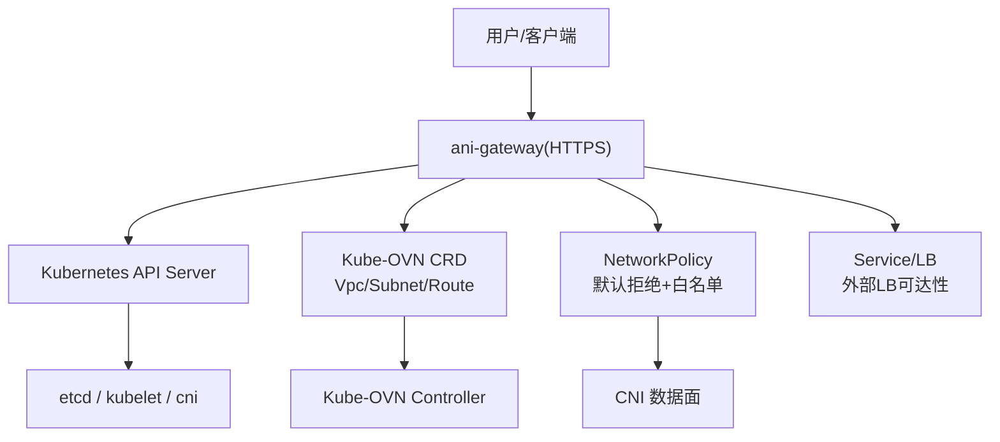
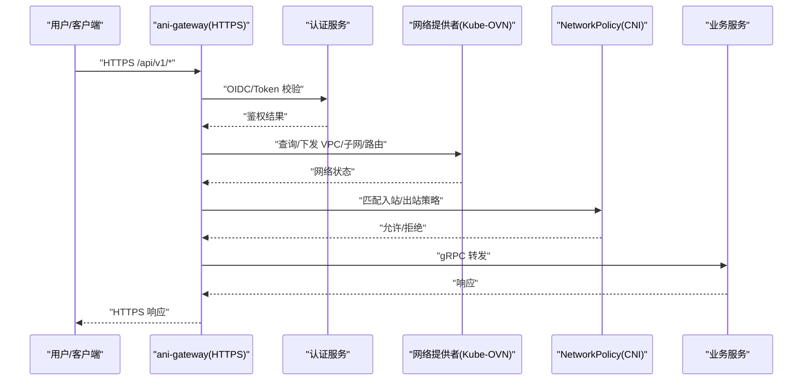
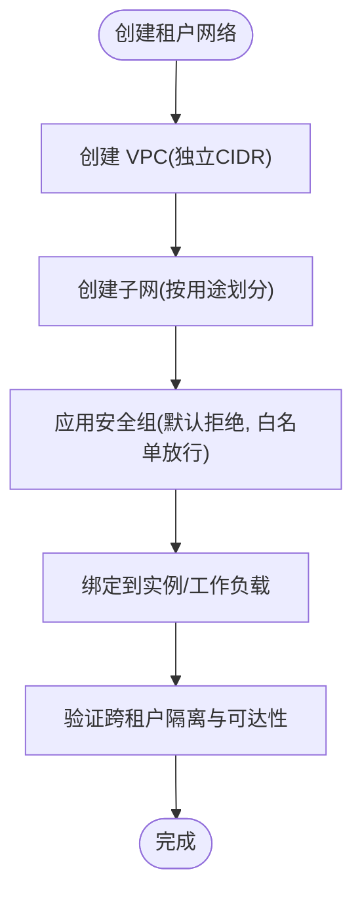
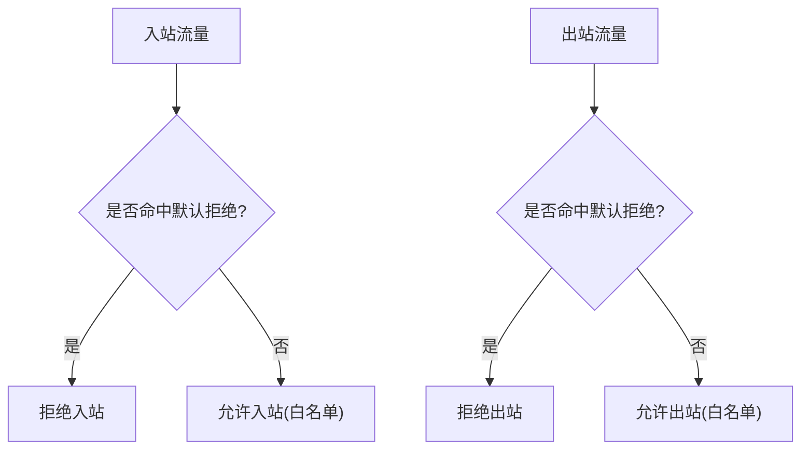
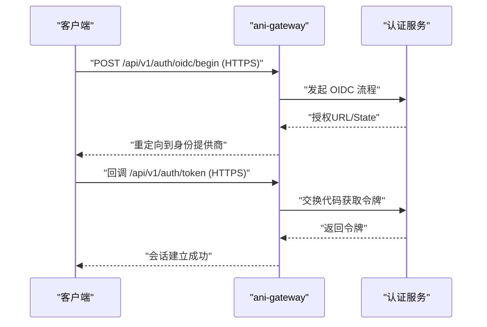
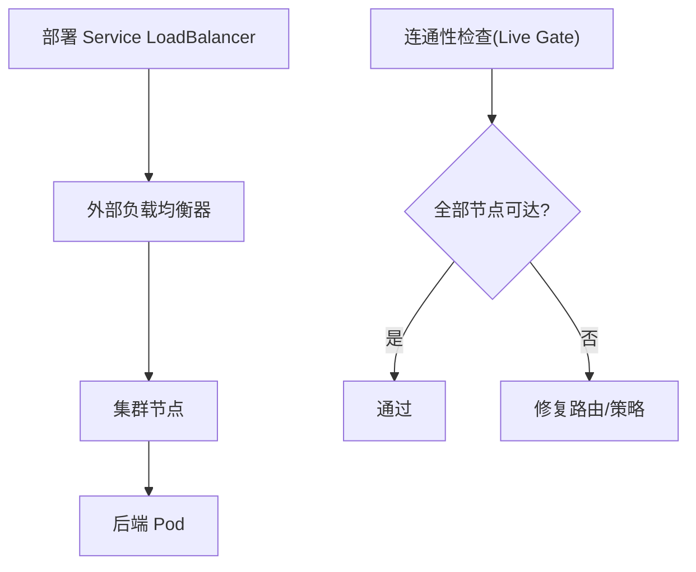
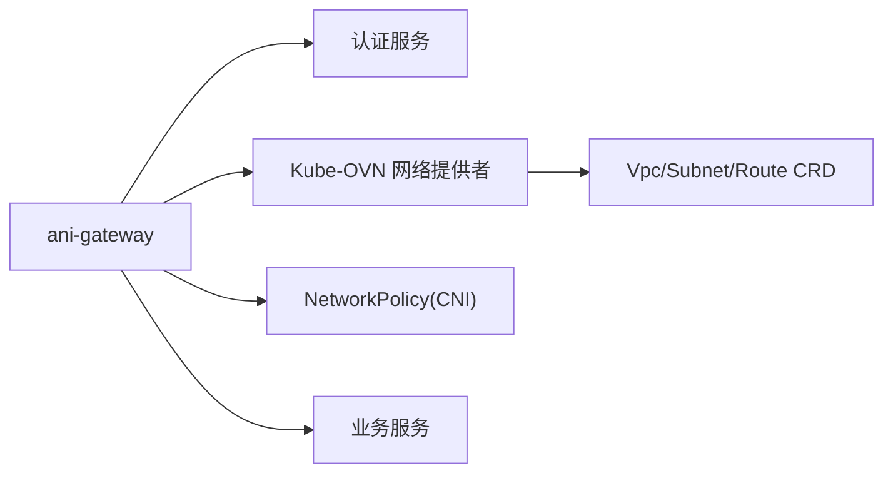

# 网络安全

<cite>
**本文引用的文件**
- [ANI-02-产品功能设计.md](file://ANI-02-产品功能设计.md)
- [values.yaml](file://repo/deploy/helm/ani-platform/values.yaml)
- [20-networkpolicy.yaml](file://repo/deploy/manifests/m1-infra-a/20-networkpolicy.yaml)
- [20-tenant-networkpolicy-template.yaml](file://repo/deploy/manifests/m1-infra-c/20-tenant-networkpolicy-template.yaml)
- [kubeovn-network-live-gate.yaml](file://repo/deploy/real-k8s-lab/kubeovn-network-live-gate.yaml)
- [network_resources_test.go](file://repo/services/ani-gateway/internal/router/network_resources_test.go)
- [auth.go](file://services/ani-gateway/internal/router/auth.go)
- [v1.yaml](file://repo/api/openapi/v1.yaml)
</cite>

## 目录
1. [简介](#简介)
2. [项目结构](#项目结构)
3. [核心组件](#核心组件)
4. [架构总览](#架构总览)
5. [详细组件分析](#详细组件分析)
6. [依赖关系分析](#依赖关系分析)
7. [性能考虑](#性能考虑)
8. [故障排查指南](#故障排查指南)
9. [结论](#结论)
10. [附录](#附录)

## 简介
本文件面向平台运维与安全工程师，系统性说明 ANI 平台的网络安全策略与实现要点，重点覆盖：
- 多租户网络隔离：基于 Kube-OVN 的 VPC、子网、路由与安全组；Pod CIDR 规划建议；租户间默认拒绝。
- Kubernetes NetworkPolicy 规范：默认拒绝入站/出站、白名单放行、跨命名空间通信控制。
- TLS 配置要求：强制 HTTPS、证书管理（cert-manager）、IP SAN 支持、HSTS 响应头。
- 防火墙规则与访问控制列表（ACL）：结合安全组与外部负载均衡器。
- 监控与排障：可观测性指标、日志与连通性验证流程。

## 项目结构
仓库中与网络安全相关的资源主要分布在以下位置：
- Helm 值与默认隔离策略：deploy/helm/ani-platform/values.yaml
- 基础设施默认 NetworkPolicy：deploy/manifests/m1-infra-a/20-networkpolicy.yaml
- 租户模板 NetworkPolicy：deploy/manifests/m1-infra-c/20-tenant-networkpolicy-template.yaml
- Kube-OVN 能力校验与 Live Gate：deploy/real-k8s-lab/kubeovn-network-live-gate.yaml
- 网络 API 与租户隔离测试：services/ani-gateway/internal/router/network_resources_test.go
- 网关认证路由入口：services/ani-gateway/internal/router/auth.go
- OpenAPI 对外暴露协议与端口约定：repo/api/openapi/v1.yaml
- 总体网络层设计与平面划分：ANI-02-产品功能设计.md

图表来源
- [values.yaml:180-224](file://repo/deploy/helm/ani-platform/values.yaml#L180-L224)
- [20-networkpolicy.yaml:1-76](file://repo/deploy/manifests/m1-infra-a/20-networkpolicy.yaml#L1-L76)
- [20-tenant-networkpolicy-template.yaml:1-63](file://repo/deploy/manifests/m1-infra-c/20-tenant-networkpolicy-template.yaml#L1-L63)
- [kubeovn-network-live-gate.yaml:1-47](file://repo/deploy/real-k8s-lab/kubeovn-network-live-gate.yaml#L1-L47)

章节来源
- [ANI-02-产品功能设计.md:209-246](file://ANI-02-产品功能设计.md#L209-L246)
- [values.yaml:180-224](file://repo/deploy/helm/ani-platform/values.yaml#L180-L224)

## 核心组件
- 多租户网络隔离（Kube-OVN VPC）
  - 通过 API 创建 VPC、子网、安全组与负载均衡，按租户隔离资源与访问。
  - 测试用例验证了跨租户不可见与隔离边界。
- 默认拒绝 + 最小权限 NetworkPolicy
  - 在 ani-system 与租户命名空间均启用默认拒绝入站/出站。
  - 仅开放必要端口（如 DNS、数据库、消息队列、网关入口）。
- 网关与认证
  - 所有外部流量经 ani-gateway 统一入口，内部服务通过 gRPC 调用。
  - 认证路由定义于网关中，配合 OIDC/Token 机制进行鉴权。
- 外部负载均衡与可达性
  - 通过 Service LoadBalancer 与外部 LB 打通公网入口，并在 Live Gate 中验证可达性。

章节来源
- [network_resources_test.go:11-93](file://repo/services/ani-gateway/internal/router/network_resources_test.go#L11-L93)
- [20-networkpolicy.yaml:1-76](file://repo/deploy/manifests/m1-infra-a/20-networkpolicy.yaml#L1-L76)
- [20-tenant-networkpolicy-template.yaml:1-63](file://repo/deploy/manifests/m1-infra-c/20-tenant-networkpolicy-template.yaml#L1-L63)
- [auth.go:1-49](file://services/ani-gateway/internal/router/auth.go#L1-L49)
- [kubeovn-network-live-gate.yaml:1-47](file://repo/deploy/real-k8s-lab/kubeovn-network-live-gate.yaml#L1-L47)

## 架构总览
下图展示了从客户端到后端服务的请求路径，以及各层的安全控制点：

图表来源
- [auth.go:1-49](file://services/ani-gateway/internal/router/auth.go#L1-L49)
- [values.yaml:180-224](file://repo/deploy/helm/ani-platform/values.yaml#L180-L224)
- [20-networkpolicy.yaml:1-76](file://repo/deploy/manifests/m1-infra-a/20-networkpolicy.yaml#L1-L76)

## 详细组件分析

### 多租户网络隔离（Kube-OVN VPC）
- 设计要点
  - 每租户独立 VPC，子网按业务域划分（租户业务互通、平台控制面互联、存储专用、管理出口、公网入口）。
  - 通过 API 创建 VPC、Subnet、Security Group、Load Balancer，并绑定到实例或工作负载。
  - 测试覆盖了跨租户隔离：不同租户无法访问彼此资源。
- Pod CIDR 规划建议
  - 每个 VPC 分配独立大段 CIDR（例如 /16），子网按用途切分 /24 或更小，避免重叠。
  - 预留扩展空间，便于后续扩容与迁移。
- 默认策略
  - 租户间默认拒绝，除非显式通过安全组或路由放行。

图表来源
- [network_resources_test.go:11-93](file://repo/services/ani-gateway/internal/router/network_resources_test.go#L11-L93)
- [kubeovn-network-live-gate.yaml:19-41](file://repo/deploy/real-k8s-lab/kubeovn-network-live-gate.yaml#L19-L41)

章节来源
- [ANI-02-产品功能设计.md:209-246](file://ANI-02-产品功能设计.md#L209-L246)
- [network_resources_test.go:11-93](file://repo/services/ani-gateway/internal/router/network_resources_test.go#L11-L93)
- [kubeovn-network-live-gate.yaml:1-47](file://repo/deploy/real-k8s-lab/kubeovn-network-live-gate.yaml#L1-L47)

### NetworkPolicy 规范与默认策略
- 默认拒绝
  - 在 ani-system 与租户命名空间均启用默认拒绝入站与出站。
- 白名单放行
  - 仅允许必要的系统服务通信（DNS、数据库、消息队列等）。
  - 仅允许网关对标记为 gateway 暴露的服务的入站访问。
- 跨命名空间通信控制
  - 使用 namespaceSelector 与 podSelector 精确限定来源与目标。
  - 限制端口范围，遵循最小权限原则。

图表来源
- [20-networkpolicy.yaml:1-76](file://repo/deploy/manifests/m1-infra-a/20-networkpolicy.yaml#L1-L76)
- [20-tenant-networkpolicy-template.yaml:1-63](file://repo/deploy/manifests/m1-infra-c/20-tenant-networkpolicy-template.yaml#L1-L63)

章节来源
- [20-networkpolicy.yaml:1-76](file://repo/deploy/manifests/m1-infra-a/20-networkpolicy.yaml#L1-L76)
- [20-tenant-networkpolicy-template.yaml:1-63](file://repo/deploy/manifests/m1-infra-c/20-tenant-networkpolicy-template.yaml#L1-L63)

### 网关与认证（TLS 入口）
- 统一入口
  - 所有外部流量经 ani-gateway 进入，内部服务通过 gRPC 通信。
- 认证流程
  - 提供 OIDC 开始与完成、刷新、登出、API Key 管理等接口。
  - 网关将认证请求转发至认证服务，返回鉴权结果。
- TLS 要求
  - 外部入口必须使用 HTTPS（OpenAPI 声明 https）。
  - 建议使用 cert-manager 管理证书，开启 HSTS 响应头。
  - 若需 IP SAN，确保证书包含对应 IP。

图表来源
- [auth.go:1-49](file://services/ani-gateway/internal/router/auth.go#L1-L49)
- [v1.yaml:17-41](file://repo/api/openapi/v1.yaml#L17-L41)

章节来源
- [auth.go:1-49](file://services/ani-gateway/internal/router/auth.go#L1-L49)
- [v1.yaml:17-41](file://repo/api/openapi/v1.yaml#L17-L41)

### 外部负载均衡与可达性
- 通过 Service LoadBalancer 暴露服务，结合外部 LB 实现公网可达。
- Live Gate 验证 Kube-OVN CRD、VPC/Subnet/静态路由、NetworkPolicy、Service/LB 及外部 LB IP 可达性。

图表来源
- [kubeovn-network-live-gate.yaml:19-41](file://repo/deploy/real-k8s-lab/kubeovn-network-live-gate.yaml#L19-L41)

章节来源
- [kubeovn-network-live-gate.yaml:1-47](file://repo/deploy/real-k8s-lab/kubeovn-network-live-gate.yaml#L1-L47)

## 依赖关系分析
- 组件耦合
  - Gateway 依赖认证服务与网络提供者（Kube-OVN）。
  - NetworkPolicy 由 CNI 数据面执行，受控制器与策略对象驱动。
- 外部依赖
  - Kube-OVN CRD（Vpc/Subnet/Route）。
  - Kubernetes API Server、etcd。
  - 外部负载均衡器（用于公网入口）。
- 潜在循环依赖
  - 当前设计以 Gateway 为唯一入口，避免服务间直接公网访问，降低环路风险。

图表来源
- [values.yaml:180-224](file://repo/deploy/helm/ani-platform/values.yaml#L180-L224)
- [20-networkpolicy.yaml:1-76](file://repo/deploy/manifests/m1-infra-a/20-networkpolicy.yaml#L1-L76)

章节来源
- [values.yaml:180-224](file://repo/deploy/helm/ani-platform/values.yaml#L180-L224)
- [20-networkpolicy.yaml:1-76](file://repo/deploy/manifests/m1-infra-a/20-networkpolicy.yaml#L1-L76)

## 性能考虑
- 默认拒绝策略会增加首次匹配开销，建议合理聚合规则、减少重复条目。
- 使用命名空间与标签选择器缩小匹配范围，提升策略评估效率。
- 外部 LB 与健康检查应配置合理的超时与重试，避免雪崩。
- 对高频路径（如认证）启用缓存与限流，减轻后端压力。

## 故障排查指南
- 连通性问题
  - 检查 Kube-OVN CRD 是否就绪（Vpc/Subnet/Route）。
  - 确认 NetworkPolicy 是否正确放行 DNS 与必要端口。
  - 验证外部 LB 在各节点可达性（Live Gate 脚本）。
- 认证问题
  - 核对 OIDC 回调地址与域名解析。
  - 检查证书有效期与 SAN 字段（含 IP SAN 时）。
- 日志与指标
  - 收集 Gateway、认证服务、Kube-OVN 控制器日志。
  - 查看 Prometheus 指标（如有）定位瓶颈与错误。

章节来源
- [kubeovn-network-live-gate.yaml:19-41](file://repo/deploy/real-k8s-lab/kubeovn-network-live-gate.yaml#L19-L41)
- [20-networkpolicy.yaml:1-76](file://repo/deploy/manifests/m1-infra-a/20-networkpolicy.yaml#L1-L76)
- [20-tenant-networkpolicy-template.yaml:1-63](file://repo/deploy/manifests/m1-infra-c/20-tenant-networkpolicy-template.yaml#L1-L63)

## 结论
本方案通过 Kube-OVN VPC 与 Kubernetes NetworkPolicy 的组合，实现了强隔离的多租户网络环境。默认拒绝策略配合最小权限白名单，有效降低了横向移动风险。Gateway 作为统一入口，结合认证与 TLS，保障传输与访问安全。通过 Live Gate 与系统化排障流程，确保网络能力在生产环境中稳定可用。

## 附录

### 多租户网络隔离实现清单
- 为每个租户创建独立 VPC，分配不重叠的 CIDR。
- 按用途划分子网（租户业务、平台控制面、存储、管理、公网入口）。
- 应用默认拒绝策略，仅放行必要通信。
- 使用安全组与路由表精细化控制跨租户与跨子网访问。

章节来源
- [ANI-02-产品功能设计.md:209-246](file://ANI-02-产品功能设计.md#L209-L246)
- [values.yaml:180-224](file://repo/deploy/helm/ani-platform/values.yaml#L180-L224)

### NetworkPolicy 规范要点
- 默认拒绝入站与出站。
- 仅开放 DNS（UDP/TCP 53）与必要服务端口。
- 跨命名空间访问需显式声明 namespaceSelector 与 podSelector。
- 网关仅允许对标记为 gateway 暴露的服务入站访问。

章节来源
- [20-networkpolicy.yaml:1-76](file://repo/deploy/manifests/m1-infra-a/20-networkpolicy.yaml#L1-L76)
- [20-tenant-networkpolicy-template.yaml:1-63](file://repo/deploy/manifests/m1-infra-c/20-tenant-networkpolicy-template.yaml#L1-L63)

### TLS 配置要求
- 强制 HTTPS：外部入口必须使用 HTTPS（OpenAPI 已声明）。
- 证书管理：建议使用 cert-manager 自动化签发与续期。
- IP SAN 支持：如需 IP 访问，确保证书包含 IP SAN。
- HSTS：在网关或反向代理层设置 Strict-Transport-Security 响应头。

章节来源
- [v1.yaml:17-41](file://repo/api/openapi/v1.yaml#L17-L41)

### 防火墙规则与 ACL
- 安全组：默认拒绝，白名单放行（如 443 入站）。
- 外部 LB：仅暴露必要端口，健康检查指向网关或服务。
- 路由表：静态路由用于跨 VPC 或外部网络互通，需审计与最小化。

章节来源
- [network_resources_test.go:43-75](file://repo/services/ani-gateway/internal/router/network_resources_test.go#L43-L75)
- [kubeovn-network-live-gate.yaml:19-41](file://repo/deploy/real-k8s-lab/kubeovn-network-live-gate.yaml#L19-L41)