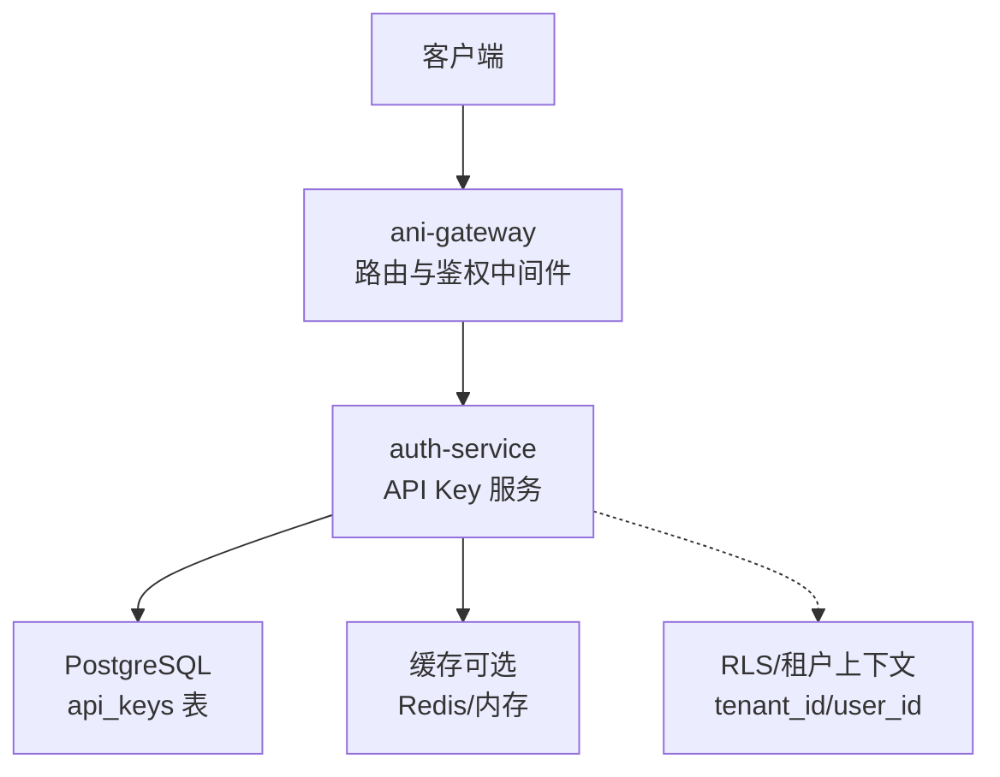
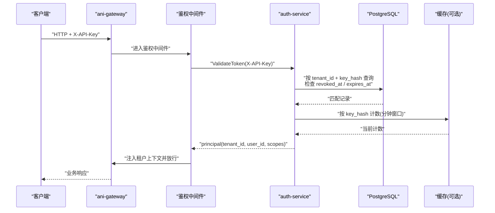
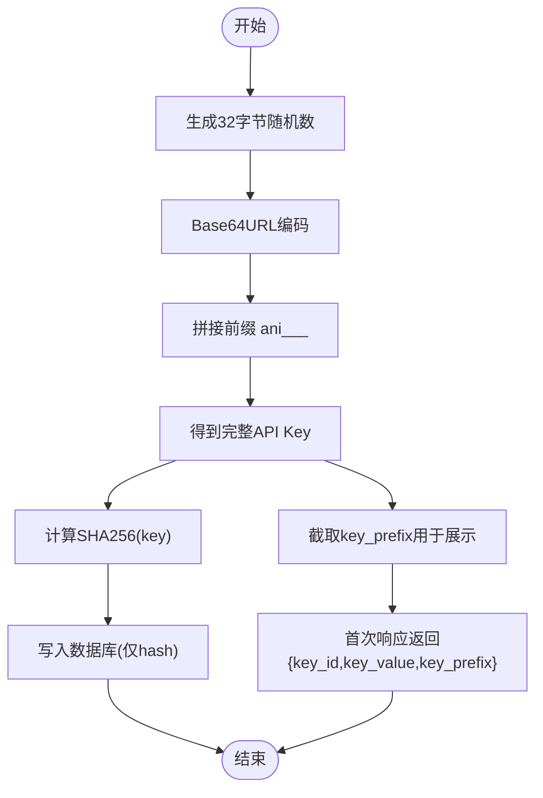
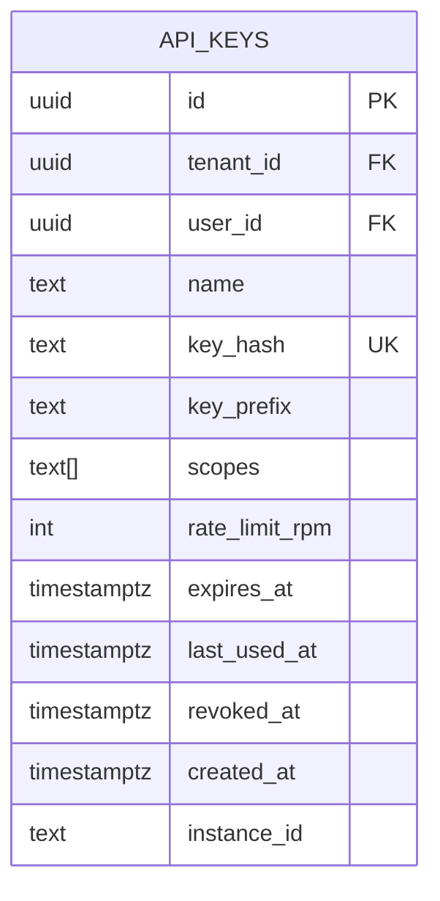
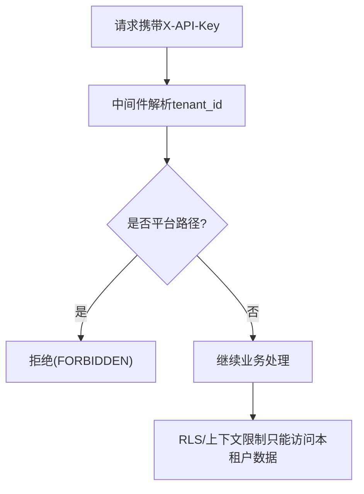
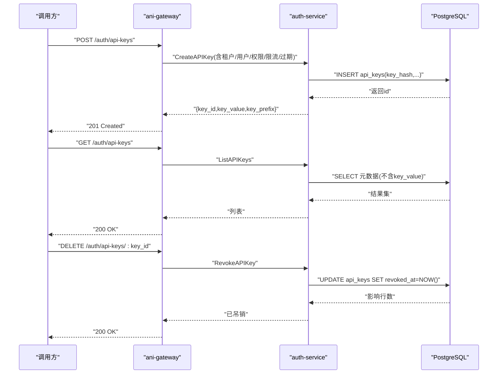
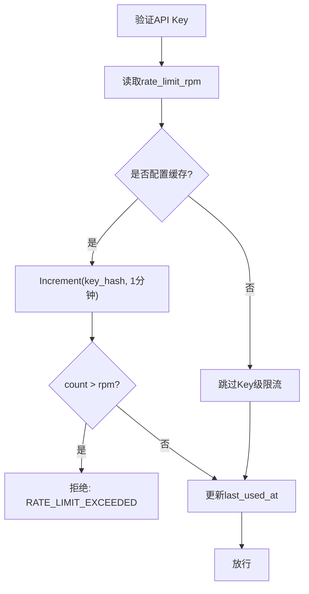
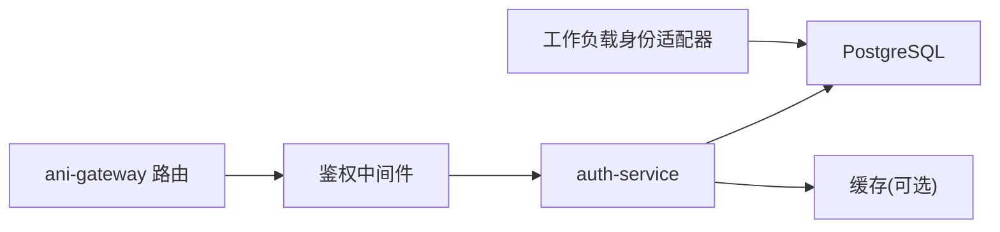

# API Key 管理

<cite>
**本文引用的文件**
- [api_keys.go](file://repo/services/auth-service/internal/service/api_keys.go)
- [auth.go](file://repo/services/ani-gateway/internal/router/auth.go)
- [auth.go（中间件）](file://repo/services/ani-gateway/internal/middleware/auth.go)
- [workload_identity.go](file://repo/pkg/adapters/runtime/workload_identity.go)
- [20260501_001_init_schema.sql](file://repo/deploy/migrations/20260501_001_init_schema.sql)
- [20260520_007_workload_identity_api_keys.sql](file://repo/deploy/migrations/20260520_007_workload_identity_api_keys.sql)
- [ratelimit.go](file://services/ani-gateway/internal/middleware/ratelimit.go)
- [chain.go](file://services/ani-gateway/internal/middleware/chain.go)
- [errors.go](file://pkg/types/errors.go)
- [api_keys_test.go](file://repo/services/auth-service/internal/service/api_keys_test.go)
</cite>

## 目录
1. [简介](#简介)
2. [项目结构](#项目结构)
3. [核心组件](#核心组件)
4. [架构总览](#架构总览)
5. [详细组件分析](#详细组件分析)
6. [依赖关系分析](#依赖关系分析)
7. [性能与限流](#性能与限流)
8. [故障排查指南](#故障排查指南)
9. [结论](#结论)
10. [附录](#附录)

## 简介
本文件系统性说明 ANI 平台的 API Key 管理机制，覆盖 Key 格式规范、生成算法、安全存储、绑定策略、生命周期管理、Key 级限流与异常检测，以及泄露应急响应流程。目标是帮助开发者与安全运维人员理解并正确使用 API Key，确保多租户隔离、最小权限与可审计性。

## 项目结构
API Key 能力由网关路由、认证服务、数据库迁移与运行时适配器共同实现：
- 网关层暴露 REST 接口用于创建、查看、吊销 API Key，并在鉴权中间件中支持通过 X-API-Key 头进行认证。
- 认证服务负责 Key 的生成、哈希存储、校验、限流与状态检查。
- 数据库使用 api_keys 表持久化 Key 元数据，仅保存 key_hash（SHA256），不保存明文。
- 工作负载身份适配器将实例绑定的短期 Key 也写入同一张表，便于统一管理与审计。

**图表来源**
- [auth.go（中间件）:22-141](file://repo/services/ani-gateway/internal/middleware/auth.go#L22-L141)
- [auth.go:102-113](file://repo/services/ani-gateway/internal/router/auth.go#L102-L113)
- [api_keys.go:46-119](file://repo/services/auth-service/internal/service/api_keys.go#L46-L119)
- [20260501_001_init_schema.sql:85-99](file://repo/deploy/migrations/20260501_001_init_schema.sql#L85-L99)

**章节来源**
- [auth.go（中间件）:22-141](file://repo/services/ani-gateway/internal/middleware/auth.go#L22-L141)
- [auth.go:102-113](file://repo/services/ani-gateway/internal/router/auth.go#L102-L113)
- [api_keys.go:46-119](file://repo/services/auth-service/internal/service/api_keys.go#L46-L119)
- [20260501_001_init_schema.sql:85-99](file://repo/deploy/migrations/20260501_001_init_schema.sql#L85-L99)

## 核心组件
- API Key 格式与生成：在认证服务中生成，包含环境标识、租户 ID 与随机密钥段；仅返回一次原始值。
- Key 存储：数据库中只存 SHA256(api_key)，同时保存 key_prefix 用于展示与检索。
- 鉴权与访问控制：网关中间件支持 X-API-Key 认证，强制租户隔离，禁止跨租户访问平台端点。
- 生命周期：创建、列表、吊销；支持过期时间与 Key 级 RPM 限流。
- 工作负载身份：实例绑定的短期 Key 同样落库到 api_keys，便于统一治理。

**章节来源**
- [api_keys.go:320-351](file://repo/services/auth-service/internal/service/api_keys.go#L320-L351)
- [api_keys.go:101-118](file://repo/services/auth-service/internal/service/api_keys.go#L101-L118)
- [auth.go（中间件）:109-137](file://repo/services/ani-gateway/internal/middleware/auth.go#L109-L137)
- [workload_identity.go:137-181](file://repo/pkg/adapters/runtime/workload_identity.go#L137-L181)

## 架构总览
下图展示了从客户端发起请求到 API Key 鉴权与限流的完整链路。

**图表来源**
- [auth.go（中间件）:109-137](file://repo/services/ani-gateway/internal/middleware/auth.go#L109-L137)
- [api_keys.go:223-268](file://repo/services/auth-service/internal/service/api_keys.go#L223-L268)
- [api_keys.go:306-318](file://repo/services/auth-service/internal/service/api_keys.go#L306-L318)

## 详细组件分析

### API Key 格式规范与生成算法
- 格式：`ani_<env>_<tenant_id>_<随机32字节Base62>`。其中 env 为运行环境标识（如 dev），tenant_id 来自请求上下文或绑定信息，随机部分使用密码学安全的随机源生成并以 Base64 URL 安全编码。
- 生成过程：
  - 读取租户 ID 与环境前缀。
  - 生成 32 字节随机数并编码。
  - 拼接成最终 Key。
  - 计算 SHA256 摘要作为 key_hash 存入数据库。
  - 截取前缀 key_prefix 用于展示。
  - 仅在创建时返回原始 Key 一次，后续不再提供。

**图表来源**
- [api_keys.go:320-351](file://repo/services/auth-service/internal/service/api_keys.go#L320-L351)
- [api_keys.go:101-118](file://repo/services/auth-service/internal/service/api_keys.go#L101-L118)

**章节来源**
- [api_keys.go:320-351](file://repo/services/auth-service/internal/service/api_keys.go#L320-L351)
- [api_keys.go:101-118](file://repo/services/auth-service/internal/service/api_keys.go#L101-L118)
- [api_keys_test.go:14-30](file://repo/services/auth-service/internal/service/api_keys_test.go#L14-L30)

### Key 存储机制与安全设计
- 数据库表：api_keys，关键字段包括 id、tenant_id、user_id、name、key_hash、key_prefix、scopes、rate_limit_rpm、expires_at、last_used_at、revoked_at、created_at。
- 安全要点：
  - 仅存储 key_hash（SHA256），不存储明文。
  - key_prefix 仅用于展示与定位，不可还原原始 Key。
  - 通过 tenant_id 与 user_id 建立多租户与用户级隔离。
  - 支持 expires_at 与 revoked_at 控制有效期与吊销。
  - last_used_at 每次验证成功更新，便于审计与活跃度分析。

**图表来源**
- [20260501_001_init_schema.sql:85-99](file://repo/deploy/migrations/20260501_001_init_schema.sql#L85-L99)
- [20260520_007_workload_identity_api_keys.sql:8-19](file://repo/deploy/migrations/20260520_007_workload_identity_api_keys.sql#L8-L19)

**章节来源**
- [20260501_001_init_schema.sql:85-99](file://repo/deploy/migrations/20260501_001_init_schema.sql#L85-L99)
- [20260520_007_workload_identity_api_keys.sql:8-19](file://repo/deploy/migrations/20260520_007_workload_identity_api_keys.sql#L8-L19)

### Key 绑定策略与跨租户访问控制
- 绑定维度：
  - 租户：每个 Key 属于特定 tenant_id，所有操作受 RLS/上下文约束。
  - 用户：可选绑定 user_id，便于细粒度审计与责任追溯。
  - 权限范围：scopes 以“scope:资源:动作”形式声明，支持通配符与去重。
  - 实例：工作负载身份可将 Key 绑定到具体 instance_id，随实例生命周期管理。
- 跨租户访问控制：
  - 网关中间件对 API Key 设置 scope=tenant，禁止访问平台端点（/auth/platform/*、/platform/*、/admin/*）。
  - 所有数据库访问通过 WithTenantTx/SetDBTenant 注入 tenant_id，配合 RLS 保证行级隔离。

**图表来源**
- [auth.go（中间件）:109-137](file://repo/services/ani-gateway/internal/middleware/auth.go#L109-L137)
- [auth.go（中间件）:214-229](file://repo/services/ani-gateway/internal/middleware/auth.go#L214-L229)
- [api_keys.go:223-268](file://repo/services/auth-service/internal/service/api_keys.go#L223-L268)

**章节来源**
- [auth.go（中间件）:109-137](file://repo/services/ani-gateway/internal/middleware/auth.go#L109-L137)
- [auth.go（中间件）:214-229](file://repo/services/ani-gateway/internal/middleware/auth.go#L214-L229)
- [api_keys.go:223-268](file://repo/services/auth-service/internal/service/api_keys.go#L223-L268)

### Key 生命周期管理
- 创建：
  - 入口：POST /api/v1/auth/api-keys。
  - 参数：name、user_id、scopes、rate_limit_rpm、expires_at。
  - 行为：生成 Key，写入数据库，返回 key_id、key_value、key_prefix。
- 查看：
  - 入口：GET /api/v1/auth/api-keys?user_id=...。
  - 行为：列出该租户下 Key 的元数据（不含 key_value），显示 isActive 等状态。
- 吊销：
  - 入口：DELETE /api/v1/auth/api-keys/:key_id。
  - 行为：设置 revoked_at，立即失效。
- 过期：
  - 支持 expires_at 指定过期时间；未设置则永不过期。
  - 校验时检查 expires_at > NOW()。

**图表来源**
- [auth.go:287-318](file://repo/services/ani-gateway/internal/router/auth.go#L287-L318)
- [auth.go:398-474](file://repo/services/ani-gateway/internal/router/auth.go#L398-L474)
- [api_keys.go:46-119](file://repo/services/auth-service/internal/service/api_keys.go#L46-L119)
- [api_keys.go:121-189](file://repo/services/auth-service/internal/service/api_keys.go#L121-L189)
- [api_keys.go:191-221](file://repo/services/auth-service/internal/service/api_keys.go#L191-L221)

**章节来源**
- [auth.go:287-318](file://repo/services/ani-gateway/internal/router/auth.go#L287-L318)
- [auth.go:398-474](file://repo/services/ani-gateway/internal/router/auth.go#L398-L474)
- [api_keys.go:46-119](file://repo/services/auth-service/internal/service/api_keys.go#L46-L119)
- [api_keys.go:121-189](file://repo/services/auth-service/internal/service/api_keys.go#L121-L189)
- [api_keys.go:191-221](file://repo/services/auth-service/internal/service/api_keys.go#L191-L221)

### Key 级限流配置与异常检测
- Key 级限流：
  - 基于 key_hash 在分钟窗口内计数，超过配置的 rate_limit_rpm 即拒绝。
  - 默认限流值为 60 RPM，最大允许值有上限保护。
  - 若未配置缓存，则跳过 Key 级限流（不影响其他网关级限流）。
- 网关级限流：
  - 对非公共路径执行 per-tenant + method + route-class 窗口计数，默认 100 requests/1s。
  - 超限返回 429 RATE_LIMIT_EXCEEDED。
- 异常检测：
  - 鉴权失败返回 UNAUTHORIZED。
  - 限流失败返回 RATE_LIMIT_EXCEEDED。
  - 服务不可用返回 AUTH_SERVICE_UNAVAILABLE。

**图表来源**
- [api_keys.go:296-318](file://repo/services/auth-service/internal/service/api_keys.go#L296-L318)
- [api_keys.go:223-268](file://repo/services/auth-service/internal/service/api_keys.go#L223-L268)
- [ratelimit.go:14-75](file://services/ani-gateway/internal/middleware/ratelimit.go#L14-L75)
- [chain.go:2-17](file://services/ani-gateway/internal/middleware/chain.go#L2-L17)

**章节来源**
- [api_keys.go:296-318](file://repo/services/auth-service/internal/service/api_keys.go#L296-L318)
- [api_keys.go:223-268](file://repo/services/auth-service/internal/service/api_keys.go#L223-L268)
- [ratelimit.go:14-75](file://services/ani-gateway/internal/middleware/ratelimit.go#L14-L75)
- [chain.go:2-17](file://services/ani-gateway/internal/middleware/chain.go#L2-L17)

### 工作负载身份 Key 绑定
- 工作负载实例可通过 BindScopedKey 获取短期 Key，自动写入 api_keys 表，并绑定 instance_id。
- 默认限流 120 RPM，支持 TTL 过期。
- 实例删除或吊销时，对应 Key 被标记 revoked_at，立即失效。

**章节来源**
- [workload_identity.go:137-181](file://repo/pkg/adapters/runtime/workload_identity.go#L137-L181)
- [workload_identity.go:210-239](file://repo/pkg/adapters/runtime/workload_identity.go#L210-L239)
- [20260520_007_workload_identity_api_keys.sql:8-19](file://repo/deploy/migrations/20260520_007_workload_identity_api_keys.sql#L8-L19)

## 依赖关系分析
- 网关路由依赖鉴权中间件，中间件依赖 auth-service 进行 Token/API Key 校验。
- auth-service 依赖 PostgreSQL 与可选缓存实现限流。
- 工作负载身份适配器复用 api_keys 表，实现统一的 Key 生命周期管理。

**图表来源**
- [auth.go:102-113](file://repo/services/ani-gateway/internal/router/auth.go#L102-L113)
- [auth.go（中间件）:22-141](file://repo/services/ani-gateway/internal/middleware/auth.go#L22-L141)
- [api_keys.go:46-119](file://repo/services/auth-service/internal/service/api_keys.go#L46-L119)
- [workload_identity.go:137-181](file://repo/pkg/adapters/runtime/workload_identity.go#L137-L181)

**章节来源**
- [auth.go:102-113](file://repo/services/ani-gateway/internal/router/auth.go#L102-L113)
- [auth.go（中间件）:22-141](file://repo/services/ani-gateway/internal/middleware/auth.go#L22-L141)
- [api_keys.go:46-119](file://repo/services/auth-service/internal/service/api_keys.go#L46-L119)
- [workload_identity.go:137-181](file://repo/pkg/adapters/runtime/workload_identity.go#L137-L181)

## 性能与限流
- Key 级限流：
  - 使用分钟窗口计数，避免高频请求对后端造成压力。
  - 默认 60 RPM，可根据业务需求调整，但存在上限保护。
- 网关级限流：
  - 默认 100 requests/1s，按租户+方法+路由类统计，防止单租户滥用。
- 数据库访问：
  - 验证时按 tenant_id + key_hash 精确查找，索引友好。
  - 更新 last_used_at 用于活跃追踪，注意在高并发场景下的写放大。

[本节为通用性能建议，无需特定文件引用]

## 故障排查指南
- 鉴权失败：
  - 检查 X-API-Key 是否正确传递。
  - 确认 Key 未被吊销且未过期。
  - 确认请求路径不在平台白名单（API Key 仅允许租户级路径）。
- 限流触发：
  - 检查 rate_limit_rpm 配置与缓存可用性。
  - 观察网关级限流是否命中（429 RATE_LIMIT_EXCEEDED）。
- 服务不可用：
  - 当 auth-service 不可用时，网关返回 AUTH_SERVICE_UNAVAILABLE。
- 错误码参考：
  - RATE_LIMIT_EXCEEDED、UNAUTHORIZED、AUTH_SERVICE_UNAVAILABLE 等。

**章节来源**
- [auth.go（中间件）:109-141](file://repo/services/ani-gateway/internal/middleware/auth.go#L109-L141)
- [auth.go:533-547](file://repo/services/ani-gateway/internal/router/auth.go#L533-L547)
- [errors.go:45-45](file://pkg/types/errors.go#L45-L45)
- [ratelimit.go:14-75](file://services/ani-gateway/internal/middleware/ratelimit.go#L14-L75)

## 结论
ANI 的 API Key 管理采用“前端仅见一次明文、后端仅存哈希”的安全模型，结合租户隔离、权限范围、过期与吊销机制，以及 Key 级与网关级双重限流，提供了高安全、高可控的认证与授权能力。工作负载身份 Key 与用户 API Key 共用同一存储与治理体系，便于统一审计与生命周期管理。

## 附录

### API Key 泄露应急响应流程
- 立即吊销：
  - 调用 DELETE /api/v1/auth/api-keys/:key_id 设置 revoked_at。
  - 或通过内部工具直接更新 api_keys.revoked_at。
- 快速阻断：
  - 若怀疑大规模泄露，可在网关层临时屏蔽相关 key_prefix 或租户流量。
- 审计与溯源：
  - 根据 last_used_at 与审计日志定位最近使用位置。
  - 结合请求 ID 与租户上下文回溯调用链。
- 预防改进：
  - 缩短 Key 有效期（expires_at）。
  - 收紧 scopes 至最小必要权限。
  - 启用更严格的网关级限流与异常告警。

[本节为通用应急流程，无需特定文件引用]