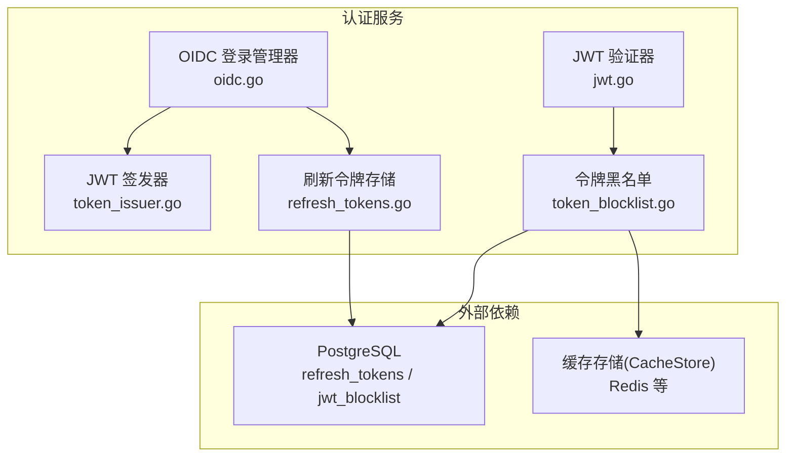
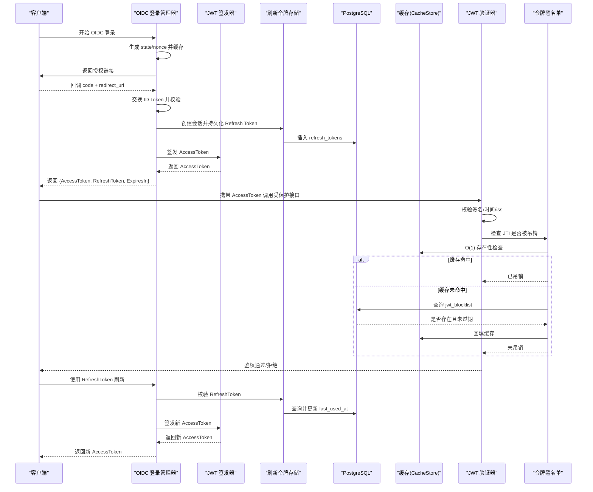
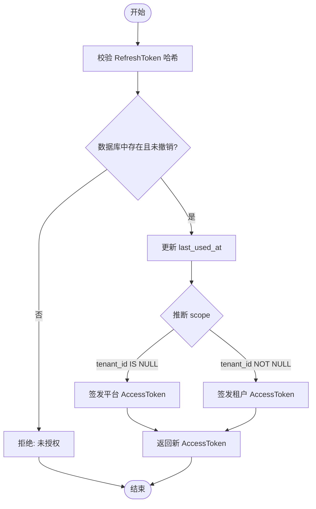
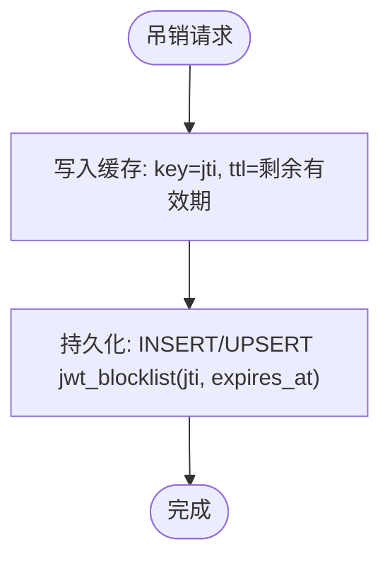
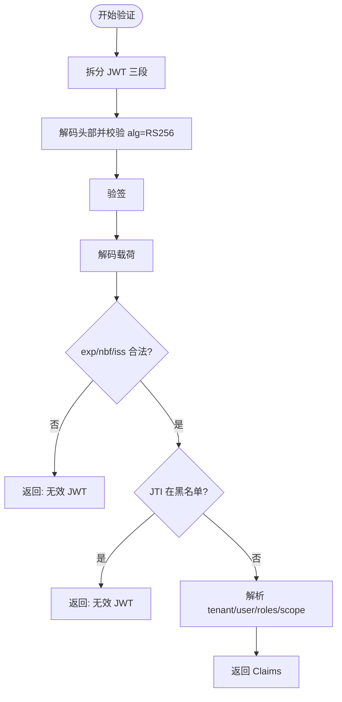
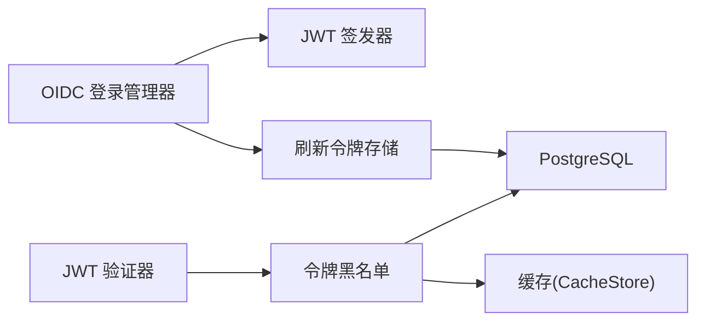

# JWT 令牌管理

<cite>
**本文引用的文件**
- [jwt.go](file://repo/services/auth-service/internal/service/jwt.go)
- [token_issuer.go](file://repo/services/auth-service/internal/service/token_issuer.go)
- [oidc.go](file://repo/services/auth-service/internal/service/oidc.go)
- [refresh_tokens.go](file://repo/services/auth-service/internal/service/refresh_tokens.go)
- [token_blocklist.go](file://repo/services/auth-service/internal/service/token_blocklist.go)
- [password_login.go](file://repo/pkg/adapters/postgres/password_login.go)
</cite>

## 目录
1. [简介](#简介)
2. [项目结构](#项目结构)
3. [核心组件](#核心组件)
4. [架构总览](#架构总览)
5. [详细组件分析](#详细组件分析)
6. [依赖关系分析](#依赖关系分析)
7. [性能考量](#性能考量)
8. [故障排查指南](#故障排查指南)
9. [结论](#结论)
10. [附录](#附录)

## 简介
本文件聚焦于认证服务中的 JWT 令牌管理，覆盖以下方面：
- JWT 载荷与标准 Claims（sub、iss、exp、nbf、iat、jti）及自定义 Claims（TenantID、UserID、Roles、Scope）
- 令牌生命周期：AccessToken 有效期、RefreshToken 策略与刷新流程
- 令牌吊销机制：黑名单存储（Redis + 持久化表）、O(1) 查询优化
- 签名算法与密钥轮换：RS256、公钥缓存与轮换窗口
- 令牌验证流程与错误处理示例

## 项目结构
JWT 相关能力集中在 auth-service 的 service 包中，配合 PostgreSQL 与 Redis（通过 CacheStore 抽象）实现持久化与缓存。OIDC 集成用于签发前对 ID Token 的校验与用户会话建立。

**图表来源**
- [token_issuer.go:44-88](file://repo/services/auth-service/internal/service/token_issuer.go#L44-L88)
- [jwt.go:96-170](file://repo/services/auth-service/internal/service/jwt.go#L96-L170)
- [oidc.go:101-195](file://repo/services/auth-service/internal/service/oidc.go#L101-L195)
- [refresh_tokens.go:40-76](file://repo/services/auth-service/internal/service/refresh_tokens.go#L40-L76)
- [token_blocklist.go:29-93](file://repo/services/auth-service/internal/service/token_blocklist.go#L29-L93)

**章节来源**
- [token_issuer.go:19-88](file://repo/services/auth-service/internal/service/token_issuer.go#L19-L88)
- [jwt.go:21-170](file://repo/services/auth-service/internal/service/jwt.go#L21-L170)
- [oidc.go:28-195](file://repo/services/auth-service/internal/service/oidc.go#L28-L195)
- [refresh_tokens.go:19-92](file://repo/services/auth-service/internal/service/refresh_tokens.go#L19-L92)
- [token_blocklist.go:14-93](file://repo/services/auth-service/internal/service/token_blocklist.go#L14-L93)

## 核心组件
- JWT 签发器：负责以 RS256 签发 AccessToken（租户/平台），生成唯一 JTI，设置 exp/nbf/iat/iss/sub 等标准字段，并写入自定义字段 TenantID/UserID/Roles/Scope。
- JWT 验证器：解析并校验签名、时间、签发者、JTI 是否在黑名单。
- OIDC 登录管理器：完成授权码交换、ID Token 校验、创建会话、签发 Access Token 与 Refresh Token。
- 刷新令牌存储：基于数据库持久化 Refresh Token，支持按哈希查找、过期与撤销检查，并在验证成功后更新 last_used_at。
- 令牌黑名单：支持 Redis 缓存与 PostgreSQL 持久化的双重存储，提供 O(1) 的 IsRevoked 查询与 Revoke 写入。

**章节来源**
- [token_issuer.go:44-107](file://repo/services/auth-service/internal/service/token_issuer.go#L44-L107)
- [jwt.go:96-170](file://repo/services/auth-service/internal/service/jwt.go#L96-L170)
- [oidc.go:101-195](file://repo/services/auth-service/internal/service/oidc.go#L101-L195)
- [refresh_tokens.go:40-92](file://repo/services/auth-service/internal/service/refresh_tokens.go#L40-L92)
- [token_blocklist.go:29-93](file://repo/services/auth-service/internal/service/token_blocklist.go#L29-L93)

## 架构总览
下图展示了从 OIDC 登录到签发令牌、后续访问校验与刷新、以及令牌吊销的整体流程。

**图表来源**
- [oidc.go:101-195](file://repo/services/auth-service/internal/service/oidc.go#L101-L195)
- [token_issuer.go:44-107](file://repo/services/auth-service/internal/service/token_issuer.go#L44-L107)
- [refresh_tokens.go:40-76](file://repo/services/auth-service/internal/service/refresh_tokens.go#L40-L76)
- [jwt.go:96-170](file://repo/services/auth-service/internal/service/jwt.go#L96-L170)
- [token_blocklist.go:29-93](file://repo/services/auth-service/internal/service/token_blocklist.go#L29-L93)

## 详细组件分析

### JWT 结构与 Claims
- 标准 Claims
  - sub：用户标识（字符串）
  - iss：签发者
  - exp：过期时间戳
  - nbf：生效时间戳
  - iat：签发时间戳
  - jti：令牌唯一标识（用于吊销）
- 自定义 Claims
  - tid（映射为 TenantID）：租户标识（UUID）
  - uid（映射为 UserID）：用户标识（UUID）
  - roles：角色列表
  - scope：作用域，tenant 或 platform（平台令牌无 tenant_id）

说明：
- 签发时由签发器填充上述字段；验证时将 tid/uid 解析为 UUID，scope 决定是否需要 tenant_id。
- 平台令牌 scope=platform，不强制要求 tenant_id；租户令牌 scope=tenant，必须包含有效 tenant_id。

**章节来源**
- [token_issuer.go:44-88](file://repo/services/auth-service/internal/service/token_issuer.go#L44-L88)
- [jwt.go:45-70](file://repo/services/auth-service/internal/service/jwt.go#L45-L70)
- [jwt.go:128-146](file://repo/services/auth-service/internal/service/jwt.go#L128-L146)

### 令牌生命周期管理
- AccessToken
  - 默认有效期：由常量 defaultAccessTokenTTL 控制（具体秒数见代码定义处）。
  - 用途：访问受保护资源。
- RefreshToken
  - 默认有效期：7 天（常量 defaultRefreshTokenTTL）。
  - 不可续期：每次刷新仅用于换取新的 AccessToken，RefreshToken 本身不延长自身有效期。
  - 持久化：以哈希形式存入数据库，避免明文泄露；验证后更新 last_used_at。
- 刷新流程
  - 客户端提交 RefreshToken 至认证服务。
  - 服务在数据库中校验 token_hash、未撤销、未过期。
  - 根据 tenant_id 是否为空推断 scope，选择签发平台或租户 AccessToken。
  - 返回新的 AccessToken 与过期时间。

**图表来源**
- [refresh_tokens.go:40-76](file://repo/services/auth-service/internal/service/refresh_tokens.go#L40-L76)
- [token_issuer.go:44-88](file://repo/services/auth-service/internal/service/token_issuer.go#L44-L88)

**章节来源**
- [refresh_tokens.go:40-92](file://repo/services/auth-service/internal/service/refresh_tokens.go#L40-L92)
- [token_issuer.go:44-88](file://repo/services/auth-service/internal/service/token_issuer.go#L44-L88)

### 令牌吊销机制（黑名单）
- 存储策略
  - 缓存层：Redis（通过 CacheStore），键为固定前缀加 JTI，值标记为“revoked”，TTL 与令牌剩余有效期一致。
  - 持久化层：PostgreSQL 表 jwt_blocklist，记录 jti 与 expires_at，支持并发重复吊销时合并过期时间。
- 查询性能
  - IsRevoked 优先查缓存，命中即返回 true，达到 O(1) 复杂度。
  - 未命中时回退到数据库查询，并将结果回填缓存。
- 写入路径
  - Revoke 同时写入缓存与数据库，确保快速失效与持久化一致性。

**图表来源**
- [token_blocklist.go:29-55](file://repo/services/auth-service/internal/service/token_blocklist.go#L29-L55)

**章节来源**
- [token_blocklist.go:29-93](file://repo/services/auth-service/internal/service/token_blocklist.go#L29-L93)

### 签名算法与密钥轮换
- 签名算法
  - 统一使用 RS256（RSA PKCS#1 v1.5 + SHA-256）。
  - 签发侧使用私钥签名，验证侧使用公钥验签。
- 密钥轮换策略
  - 验证器持有当前公钥，支持从 PEM 文件或配置注入。
  - OIDC ID Token 验证支持 JWKS 动态获取与缓存（默认 5 分钟 TTL），便于上游 IdP 轮换公钥。
  - 建议实践：每 90 天轮换一次密钥对；旧公钥保留至少 24 小时，以确保在途令牌仍可验证。
- 安全约束
  - 校验 alg 必须为 RS256。
  - JWKS 过滤非 RSA 或非 sig 用途的键，最小 RSA 位长限制。

**章节来源**
- [jwt.go:102-118](file://repo/services/auth-service/internal/service/jwt.go#L102-L118)
- [token_issuer.go:90-107](file://repo/services/auth-service/internal/service/token_issuer.go#L90-L107)
- [oidc.go:375-444](file://repo/services/auth-service/internal/service/oidc.go#L375-L444)
- [oidc.go:505-554](file://repo/services/auth-service/internal/service/oidc.go#L505-L554)

### 令牌验证流程与错误处理
- 验证步骤
  - 拆分三段式 JWT，解码头部并校验 alg=RS256。
  - 计算签名输入摘要并使用公钥验签。
  - 解码载荷，校验 exp/nbf/iss 与 JTI 黑名单。
  - 解析自定义字段：tenant_id（可选，取决于 scope）、user_id（必填）、roles、scope。
- 常见错误
  - 非法格式或签名失败：返回“无效 JWT”。
  - 时间校验失败：返回“无效 JWT”。
  - 签发者不匹配：返回“无效 JWT”。
  - JTI 在黑名单：返回“无效 JWT”。
  - 缺少必要字段（如 user_id）：返回“无效 JWT”。

**图表来源**
- [jwt.go:96-170](file://repo/services/auth-service/internal/service/jwt.go#L96-L170)

**章节来源**
- [jwt.go:96-170](file://repo/services/auth-service/internal/service/jwt.go#L96-L170)

### OIDC 集成与会话建立
- 流程要点
  - Begin：生成 state/nonce 并缓存，返回授权 URL。
  - Complete：校验 state/redirect_uri，交换 ID Token，校验 nonce、issuer、audience、时间窗口。
  - 创建会话：将用户信息持久化为 Refresh Token（含 roles、expires_at），并据此推断 scope。
  - 签发 Access Token：根据 scope 选择平台或租户签发。
- 安全要点
  - 严格校验 redirect_uri、state、nonce。
  - ID Token 校验使用静态公钥或 JWKS 动态获取，并缓存以减少网络开销。

**章节来源**
- [oidc.go:101-195](file://repo/services/auth-service/internal/service/oidc.go#L101-L195)
- [oidc.go:333-444](file://repo/services/auth-service/internal/service/oidc.go#L333-L444)
- [refresh_tokens.go:40-76](file://repo/services/auth-service/internal/service/refresh_tokens.go#L40-L76)

### 持久化与事务一致性
- Refresh Token 持久化
  - 使用 PostgreSQL 表 refresh_tokens，存储 token_hash、tenant_id、user_id、roles、expires_at。
  - 登录收尾在单事务内完成：插入 refresh token 并更新 last_login_at，保证原子性。
  - 租户账号需设置数据库租户上下文以满足 RLS 策略；平台账号无需设置。
- 黑名单持久化
  - jwt_blocklist 表记录 jti 与 expires_at，支持并发吊销时的过期时间合并。

**章节来源**
- [password_login.go:89-121](file://repo/pkg/adapters/postgres/password_login.go#L89-L121)
- [password_login.go:187-213](file://repo/pkg/adapters/postgres/password_login.go#L187-L213)
- [token_blocklist.go:29-55](file://repo/services/auth-service/internal/service/token_blocklist.go#L29-L55)

## 依赖关系分析
- 组件耦合
  - OIDC 登录管理器依赖 JWT 签发器与刷新令牌存储。
  - JWT 验证器依赖令牌黑名单接口（可组合 Redis + PostgreSQL）。
  - 刷新令牌存储依赖 PostgreSQL。
  - 黑名单接口依赖缓存与数据库。
- 外部依赖
  - PostgreSQL：refresh_tokens、jwt_blocklist。
  - 缓存（Redis 等）：黑名单缓存、OIDC state 缓存等。
  - HTTP 客户端：OIDC JWKS 拉取与授权码交换。

**图表来源**
- [oidc.go:28-77](file://repo/services/auth-service/internal/service/oidc.go#L28-L77)
- [token_issuer.go:19-42](file://repo/services/auth-service/internal/service/token_issuer.go#L19-L42)
- [refresh_tokens.go:19-38](file://repo/services/auth-service/internal/service/refresh_tokens.go#L19-L38)
- [token_blocklist.go:14-27](file://repo/services/auth-service/internal/service/token_blocklist.go#L14-L27)

**章节来源**
- [oidc.go:28-77](file://repo/services/auth-service/internal/service/oidc.go#L28-L77)
- [token_issuer.go:19-42](file://repo/services/auth-service/internal/service/token_issuer.go#L19-L42)
- [refresh_tokens.go:19-38](file://repo/services/auth-service/internal/service/refresh_tokens.go#L19-L38)
- [token_blocklist.go:14-27](file://repo/services/auth-service/internal/service/token_blocklist.go#L14-L27)

## 性能考量
- 黑名单查询
  - 优先使用缓存进行 O(1) 存在性检查，显著降低数据库压力。
  - 未命中时回退数据库查询，并将结果回填缓存，TTL 与令牌剩余有效期一致。
- 刷新令牌校验
  - 基于哈希索引的单行查询，更新 last_used_at 用于活跃度统计。
- OIDC JWKS 缓存
  - 默认 5 分钟 TTL，减少频繁拉取远端密钥的成本。
- 令牌体积
  - 自定义 Claims 尽量精简，避免过大载荷影响传输与解析性能。

[本节为通用性能指导，不直接分析具体文件]

## 故障排查指南
- 常见问题定位
  - “无效 JWT”：检查 alg 是否为 RS256、签名是否匹配、时间是否过期、签发者是否匹配、JTI 是否在黑名单。
  - 刷新失败：确认 RefreshToken 哈希是否存在、是否已撤销、是否过期；检查数据库连接与权限。
  - OIDC 回调失败：核对 state、nonce、redirect_uri 是否一致；检查 JWKS 拉取与缓存状态。
- 日志与指标
  - 关注黑名单缓存命中率、数据库查询耗时、JWKS 拉取频率与错误率。
- 恢复建议
  - 若发现异常吊销，检查黑名单写入逻辑与缓存一致性。
  - 密钥轮换期间确保旧公钥保留足够时长，避免在途令牌验证失败。

**章节来源**
- [jwt.go:96-170](file://repo/services/auth-service/internal/service/jwt.go#L96-L170)
- [refresh_tokens.go:40-76](file://repo/services/auth-service/internal/service/refresh_tokens.go#L40-L76)
- [oidc.go:375-444](file://repo/services/auth-service/internal/service/oidc.go#L375-L444)
- [token_blocklist.go:29-93](file://repo/services/auth-service/internal/service/token_blocklist.go#L29-L93)

## 结论
该 JWT 令牌管理方案采用 RS256 签名、严格的载荷校验与黑名单机制，结合 Redis 与 PostgreSQL 的双重存储，实现了高性能与高可靠性的令牌验证与吊销能力。RefreshToken 以哈希持久化并支持 7 天不可续期策略，保障安全性。OIDC 集成提供了灵活的第三方身份源接入与密钥轮换支持。建议在运维中遵循密钥轮换周期与旧公钥保留策略，持续监控缓存命中率与数据库性能，确保系统稳定运行。

[本节为总结性内容，不直接分析具体文件]

## 附录
- 关键常量与默认值
  - AccessToken 默认有效期：defaultAccessTokenTTL（定义于签发器所在文件）。
  - RefreshToken 默认有效期：7 天（defaultRefreshTokenTTL）。
  - OIDC JWKS 缓存 TTL：5 分钟。
  - 时钟偏差容忍：2 分钟。
- 数据表参考
  - refresh_tokens：存储 Refresh Token 哈希、租户/用户标识、角色、过期时间。
  - jwt_blocklist：存储被吊销令牌的 JTI 与过期时间。

**章节来源**
- [refresh_tokens.go:78-92](file://repo/services/auth-service/internal/service/refresh_tokens.go#L78-L92)
- [oidc.go:47-50](file://repo/services/auth-service/internal/service/oidc.go#L47-L50)
- [password_login.go:89-121](file://repo/pkg/adapters/postgres/password_login.go#L89-L121)
- [token_blocklist.go:29-55](file://repo/services/auth-service/internal/service/token_blocklist.go#L29-L55)