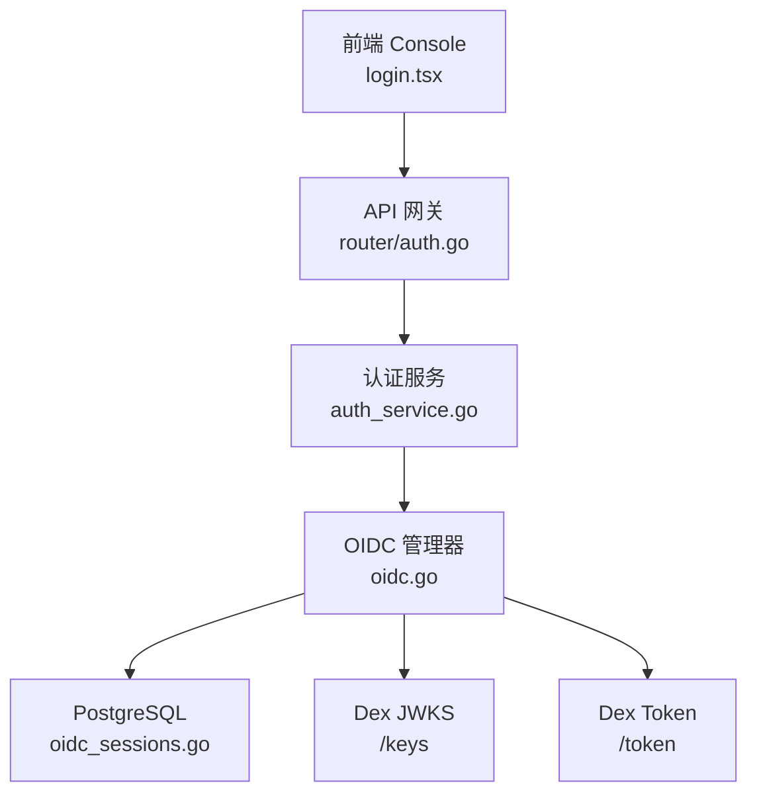
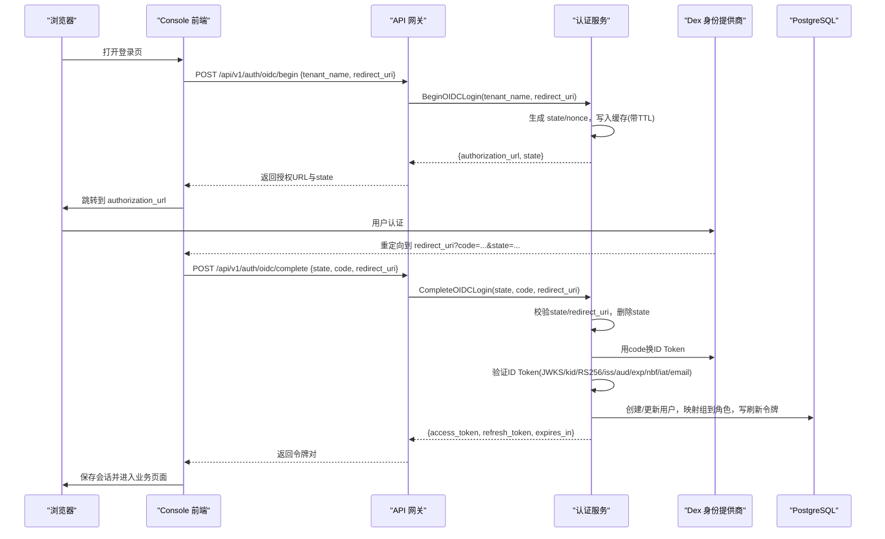
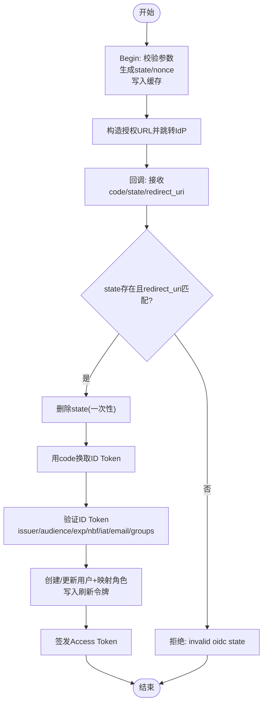
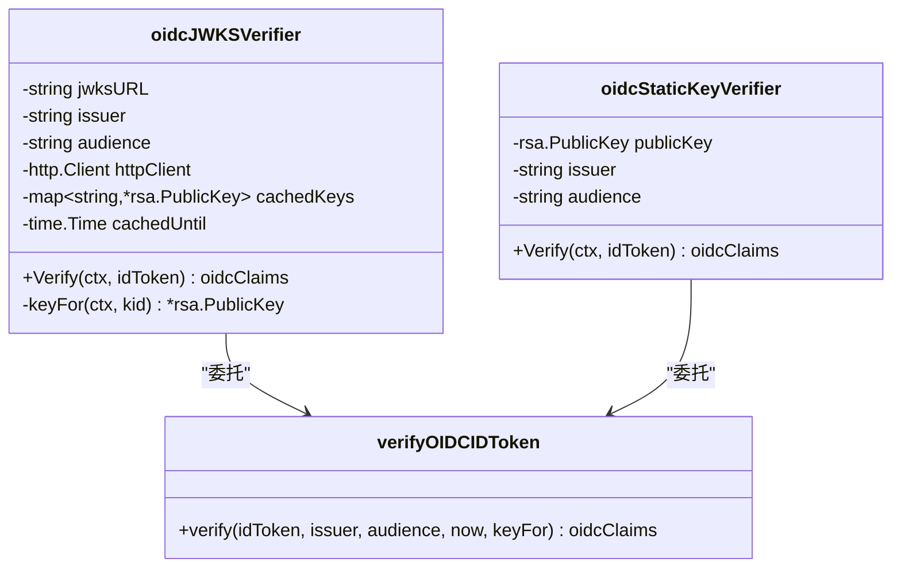
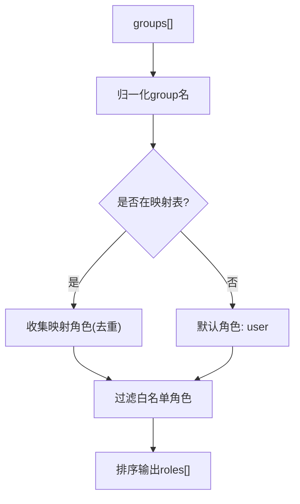
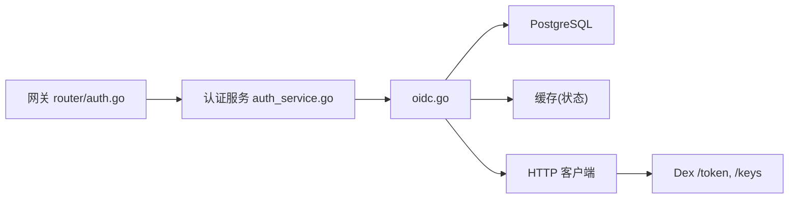

# OIDC 集成

<cite>
**本文引用的文件**
- [oidc.go](file://repo/services/auth-service/internal/service/oidc.go)
- [jwt.go](file://repo/services/auth-service/internal/service/jwt.go)
- [oidc_sessions.go](file://repo/services/auth-service/internal/service/oidc_sessions.go)
- [config.go](file://repo/services/auth-service/internal/config/config.go)
- [auth_service.go](file://repo/services/auth-service/internal/service/auth_service.go)
- [auth.go](file://repo/services/ani-gateway/internal/router/auth.go)
- [login.tsx](file://repo/frontends/console/src/routes/login.tsx)
- [oidc_test.go](file://repo/services/auth-service/internal/service/oidc_test.go)
</cite>

## 目录
1. [简介](#简介)
2. [项目结构](#项目结构)
3. [核心组件](#核心组件)
4. [架构总览](#架构总览)
5. [详细组件分析](#详细组件分析)
6. [依赖关系分析](#依赖关系分析)
7. [性能与可靠性](#性能与可靠性)
8. [故障排查指南](#故障排查指南)
9. [结论](#结论)
10. [附录：配置与环境变量](#附录：配置与环境变量)

## 简介
本文件面向 ANI 平台中“与 Dex 身份提供商的 OIDC 集成”实现，覆盖授权码模式、state/nonce/redirect_uri 校验、ID Token 验证（JWKS 动态发现 + kid 选择 + RS256 静态公钥回退）、组到角色映射、以及会话管理与过期清理。文档同时给出常见问题的定位思路与排障步骤。

## 项目结构
ANI 的 OIDC 能力由网关层、认证服务、前端登录页三部分协作完成：
- 前端 Console 发起 OIDC 登录流程，调用网关 /api/v1/auth/oidc/begin，随后跳转 IdP，回调后换取令牌。
- 网关将请求转发至认证服务的 gRPC 接口 BeginOIDCLogin/CompleteOIDCLogin。
- 认证服务负责 state/nonce/redirect_uri 校验、与 Dex 交换 code 为 ID Token、验证 ID Token、创建 OIDC 会话并签发平台 Access Token。

图表来源
- [login.tsx:77-111](file://repo/frontends/console/src/routes/login.tsx#L77-L111)
- [auth.go:320-367](file://repo/services/ani-gateway/internal/router/auth.go#L320-L367)
- [auth_service.go:73-79](file://repo/services/auth-service/internal/service/auth_service.go#L73-L79)
- [oidc.go:101-195](file://repo/services/auth-service/internal/service/oidc.go#L101-L195)
- [oidc_sessions.go:30-101](file://repo/services/auth-service/internal/service/oidc_sessions.go#L30-L101)

章节来源
- [login.tsx:77-111](file://repo/frontends/console/src/routes/login.tsx#L77-L111)
- [auth.go:320-367](file://repo/services/ani-gateway/internal/router/auth.go#L320-L367)
- [auth_service.go:73-79](file://repo/services/auth-service/internal/service/auth_service.go#L73-L79)
- [oidc.go:101-195](file://repo/services/auth-service/internal/service/oidc.go#L101-L195)
- [oidc_sessions.go:30-101](file://repo/services/auth-service/internal/service/oidc_sessions.go#L30-L101)

## 核心组件
- 认证服务 AuthService：聚合 JWT 签发/校验、OIDC 登录、刷新令牌、权限检查等能力。
- OIDC 管理器 oidcLoginManager：封装授权码流程、state/nonce/redirect_uri 校验、code 交换、ID Token 验证、会话创建与访问令牌签发。
- 会话存储 postgresOIDCSessionStore：基于 PostgreSQL 维护用户、角色、刷新令牌，并执行组到角色的映射。
- 配置 Config：通过环境变量注入 OIDC 端点、密钥、组映射等。
- 网关路由 auth.go：暴露 REST 入口，校验参数并转发到认证服务。
- 前端 login.tsx：发起 OIDC begin、保存 state、跳转 IdP、处理回调。

章节来源
- [auth_service.go:21-53](file://repo/services/auth-service/internal/service/auth_service.go#L21-L53)
- [oidc.go:28-77](file://repo/services/auth-service/internal/service/oidc.go#L28-L77)
- [oidc_sessions.go:17-28](file://repo/services/auth-service/internal/service/oidc_sessions.go#L17-L28)
- [config.go:10-52](file://repo/services/auth-service/internal/config/config.go#L10-L52)
- [auth.go:320-367](file://repo/services/ani-gateway/internal/router/auth.go#L320-L367)
- [login.tsx:77-111](file://repo/frontends/console/src/routes/login.tsx#L77-L111)

## 架构总览
下图展示一次完整的 OIDC 授权码登录从前端到后端的关键交互。

图表来源
- [auth.go:320-367](file://repo/services/ani-gateway/internal/router/auth.go#L320-L367)
- [oidc.go:101-195](file://repo/services/auth-service/internal/service/oidc.go#L101-L195)
- [oidc_sessions.go:30-101](file://repo/services/auth-service/internal/service/oidc_sessions.go#L30-L101)

## 详细组件分析

### 授权码模式与状态参数校验
- Begin：校验 tenant_name、redirect_uri；生成随机 state 与 nonce；将 state 记录（含 tenant_name、redirect_uri、nonce）存入缓存，设置 TTL；拼接授权 URL（包含 client_id、redirect_uri、response_type=code、scope、state、可选 nonce）。
- Complete：校验 state/code/redirect_uri；从缓存读取并比对 redirect_uri；删除已使用的 state；使用 code 向 Dex token 端点换取 ID Token；校验 nonce；创建会话并签发 Access Token。

图表来源
- [oidc.go:101-195](file://repo/services/auth-service/internal/service/oidc.go#L101-L195)
- [oidc.go:209-242](file://repo/services/auth-service/internal/service/oidc.go#L209-L242)

章节来源
- [oidc.go:101-195](file://repo/services/auth-service/internal/service/oidc.go#L101-L195)
- [oidc.go:209-242](file://repo/services/auth-service/internal/service/oidc.go#L209-L242)
- [oidc_test.go:25-95](file://repo/services/auth-service/internal/service/oidc_test.go#L25-L95)
- [oidc_test.go:351-496](file://repo/services/auth-service/internal/service/oidc_test.go#L351-L496)

### ID Token 验证机制（JWKS 动态发现 + kid 选择 + RS256 静态公钥回退）
- 动态 JWKS：当配置了 OIDCJWKSURL/OIDCIssuerURL/OIDCClientID 时，使用 oidcJWKSVerifier。首次或缓存过期时拉取 /keys，解析出所有有效 RSA 签名密钥（仅 accept use=sig 且 alg=RS256），按 kid 缓存并在 TTL 内复用。
- kid 选择：从 ID Token header 中读取 kid，若为空则拒绝；在缓存或 JWKS 中查找对应公钥。
- 静态公钥回退：若未配置 JWKS 但提供了 OIDCPublicKeyPEM/FILE，则使用固定 RSA 公钥进行 RS256 验签。
- 通用校验：强制算法 RS256；校验 issuer、audience、exp/nbf/iat（含时钟偏差容忍）、email 必填；支持 groups 字段用于后续角色映射。

图表来源
- [oidc.go:333-389](file://repo/services/auth-service/internal/service/oidc.go#L333-L389)
- [oidc.go:391-444](file://repo/services/auth-service/internal/service/oidc.go#L391-L444)
- [oidc.go:446-503](file://repo/services/auth-service/internal/service/oidc.go#L446-L503)

章节来源
- [oidc.go:333-389](file://repo/services/auth-service/internal/service/oidc.go#L333-L389)
- [oidc.go:391-444](file://repo/services/auth-service/internal/service/oidc.go#L391-L444)
- [oidc.go:446-503](file://repo/services/auth-service/internal/service/oidc.go#L446-L503)
- [oidc_test.go:187-249](file://repo/services/auth-service/internal/service/oidc_test.go#L187-L249)
- [oidc_test.go:251-318](file://repo/services/auth-service/internal/service/oidc_test.go#L251-L318)
- [oidc_test.go:320-349](file://repo/services/auth-service/internal/service/oidc_test.go#L320-L349)

### 组映射到角色机制（白名单与默认策略）
- 输入：ID Token 中的 groups 数组。
- 归一化：group 名称统一小写，并截取最后一段（忽略前缀路径/分隔符）。
- 白名单映射：通过配置 JSON 指定 group→roles 映射；角色需经过允许集合过滤（platform-admin、tenant-admin、user、auditor）。
- 默认策略：若未命中任何映射，则赋予默认角色 user。
- 持久化：将最终角色授予用户，并写入刷新令牌元数据。

图表来源
- [oidc_sessions.go:103-148](file://repo/services/auth-service/internal/service/oidc_sessions.go#L103-L148)
- [oidc_sessions.go:150-172](file://repo/services/auth-service/internal/service/oidc_sessions.go#L150-L172)
- [oidc_sessions.go:30-101](file://repo/services/auth-service/internal/service/oidc_sessions.go#L30-L101)

章节来源
- [oidc_sessions.go:103-148](file://repo/services/auth-service/internal/service/oidc_sessions.go#L103-L148)
- [oidc_sessions.go:150-172](file://repo/services/auth-service/internal/service/oidc_sessions.go#L150-L172)
- [oidc_sessions.go:30-101](file://repo/services/auth-service/internal/service/oidc_sessions.go#L30-L101)
- [oidc_sessions_test.go:8-39](file://repo/services/auth-service/internal/service/oidc_sessions_test.go#L8-L39)

### OIDC 会话管理（状态维护、过期清理、并发登录控制）
- 状态维护：
  - state：临时状态，存储在缓存中，TTL 默认 10 分钟；Complete 成功后立即删除，防止重放。
  - nonce：防重放攻击，随授权请求下发并在回调时与 ID Token 中的 nonce 比对。
  - 刷新令牌：持久化到数据库，附带角色信息，具有默认过期时间。
- 过期清理：
  - state 由缓存 TTL 自动清理。
  - 刷新令牌由数据库记录的 expires_at 管理，配合刷新流程使用。
- 并发登录控制：
  - 当前实现允许多设备/多会话登录；同一用户可拥有多个刷新令牌。
  - 如需限制并发登录，可在刷新令牌层增加“每用户最大活跃数”或“最近登录踢出”策略（当前未实现）。

章节来源
- [oidc.go:69-77](file://repo/services/auth-service/internal/service/oidc.go#L69-L77)
- [oidc.go:117-135](file://repo/services/auth-service/internal/service/oidc.go#L117-L135)
- [oidc.go:156-166](file://repo/services/auth-service/internal/service/oidc.go#L156-L166)
- [oidc_sessions.go:85-101](file://repo/services/auth-service/internal/service/oidc_sessions.go#L85-L101)

### 网关与前端协作
- 网关路由：
  - /api/v1/auth/oidc/begin：校验 tenant_name、redirect_uri，调用认证服务 BeginOIDCLogin。
  - /api/v1/auth/oidc/complete：校验 state、code、redirect_uri，调用认证服务 CompleteOIDCLogin。
- 前端登录页：
  - 调用 begin 获取 authorization_url 与 state，保存 state 并跳转 IdP。
  - 回调后调用 complete 换取令牌，保存会话并导航。

章节来源
- [auth.go:320-367](file://repo/services/ani-gateway/internal/router/auth.go#L320-L367)
- [login.tsx:77-111](file://repo/frontends/console/src/routes/login.tsx#L77-L111)
- [login.tsx:113-179](file://repo/frontends/console/src/routes/login.tsx#L113-L179)

## 依赖关系分析
- 认证服务依赖：
  - PostgreSQL：用户、角色、刷新令牌持久化。
  - 缓存（如 Redis）：state 短期存储。
  - HTTP 客户端：访问 Dex 的 token 与 JWKS 端点。
- 外部依赖：
  - Dex：提供 OIDC 授权端点、令牌端点、JWKS。
- 内部耦合：
  - 网关与认证服务通过 gRPC 解耦。
  - OIDC 管理器与会话存储通过接口抽象，便于替换实现。

图表来源
- [auth.go:320-367](file://repo/services/ani-gateway/internal/router/auth.go#L320-L367)
- [auth_service.go:33-53](file://repo/services/auth-service/internal/service/auth_service.go#L33-L53)
- [oidc.go:79-81](file://repo/services/auth-service/internal/service/oidc.go#L79-L81)

章节来源
- [auth.go:320-367](file://repo/services/ani-gateway/internal/router/auth.go#L320-L367)
- [auth_service.go:33-53](file://repo/services/auth-service/internal/service/auth_service.go#L33-L53)
- [oidc.go:79-81](file://repo/services/auth-service/internal/service/oidc.go#L79-L81)

## 性能与可靠性
- 网络超时：OIDC 相关 HTTP 调用使用固定超时，避免长时间阻塞。
- JWKS 缓存：JWKS 结果按 TTL 缓存，减少频繁拉取。
- 最小密钥强度：JWKS 解析时拒绝弱 RSA 密钥（位长不足、指数异常等）。
- 时钟偏差：ID Token 时间校验允许一定偏差，提高跨时区稳定性。
- 幂等性：state 一次性消费，防止重放；刷新令牌流程具备独立校验。

[本节为通用指导，不直接分析具体文件]

## 故障排查指南
- 无法开始 OIDC 登录
  - 检查 tenant_name、redirect_uri 是否非空且合法（绝对地址、http/https、无 fragment）。
  - 确认认证服务已正确配置 OIDC 端点与客户端信息。
  - 参考：Begin 参数校验与错误码。
- 回调失败：invalid oidc state
  - 检查 state 是否存在且未过期；确认回调 redirect_uri 与 begin 一致。
  - 参考：Complete 中 state 读取、比对与删除逻辑。
- ID Token 验证失败
  - 检查算法是否为 RS256；检查 issuer、audience、exp/nbf/iat、email 是否满足要求。
  - 若使用 JWKS，确认 /keys 可达且返回有效 RSA 签名密钥；确认 kid 匹配。
  - 若使用静态公钥，确认 PEM 格式正确且与 IdP 签名密钥匹配。
- 组映射未生效
  - 检查 OIDCGroupRoleMapJSON 是否正确配置；group 名称是否被归一化；角色是否在白名单内。
  - 未命中映射时将回退为默认角色 user。
- 刷新令牌问题
  - 确认刷新令牌未过期；检查刷新流程是否成功签发新的 Access Token。
  - 如需吊销，使用 RevokeToken 将 JTI 加入黑名单。

章节来源
- [oidc.go:101-195](file://repo/services/auth-service/internal/service/oidc.go#L101-L195)
- [oidc.go:333-503](file://repo/services/auth-service/internal/service/oidc.go#L333-L503)
- [oidc_sessions.go:103-172](file://repo/services/auth-service/internal/service/oidc_sessions.go#L103-L172)
- [auth_service.go:81-121](file://repo/services/auth-service/internal/service/auth_service.go#L81-L121)

## 结论
该实现以安全、健壮的方式完成了与 Dex 的 OIDC 集成：严格校验授权码流程中的 state/nonce/redirect_uri；采用 JWKS 动态发现与 kid 选择，并提供静态 RS256 公钥回退；通过组到角色的白名单映射与默认策略保障最小权限；借助缓存与数据库实现会话状态维护与过期清理。结合网关与前端协作，形成端到端的登录闭环。

[本节为总结性内容，不直接分析具体文件]

## 附录：配置与环境变量
以下环境变量用于配置认证服务与 OIDC 行为：
- AUTH_OIDC_ISSUER_URL：Dex Issuer 地址（用于推导 /auth、/token、/keys）。
- AUTH_OIDC_CLIENT_ID：OIDC 客户端标识。
- AUTH_OIDC_CLIENT_SECRET：可选，用于 code 交换。
- AUTH_OIDC_AUTH_URL：可选，显式覆盖授权端点。
- AUTH_OIDC_TOKEN_URL：可选，显式覆盖令牌端点。
- AUTH_OIDC_JWKS_URL：可选，显式覆盖 JWKS 端点。
- AUTH_OIDC_PUBLIC_KEY_PEM / AUTH_OIDC_PUBLIC_KEY_FILE：静态公钥（当未配置 JWKS 时使用）。
- AUTH_OIDC_GROUP_ROLE_MAP_JSON：组到角色的映射配置（JSON）。
- AUTH_JWT_*：用于平台侧 Access Token 的签发与校验。

章节来源
- [config.go:10-52](file://repo/services/auth-service/internal/config/config.go#L10-L52)