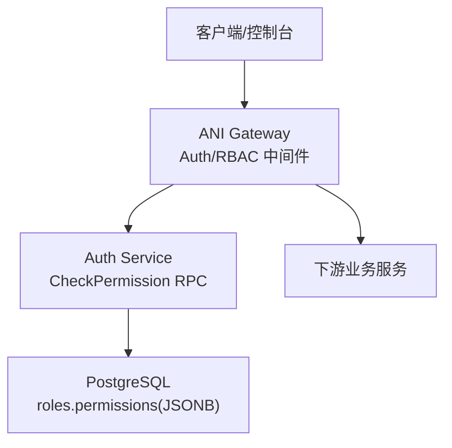
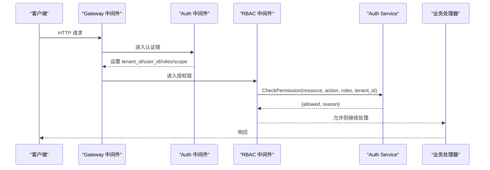
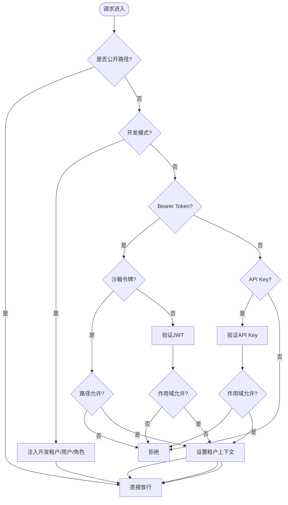
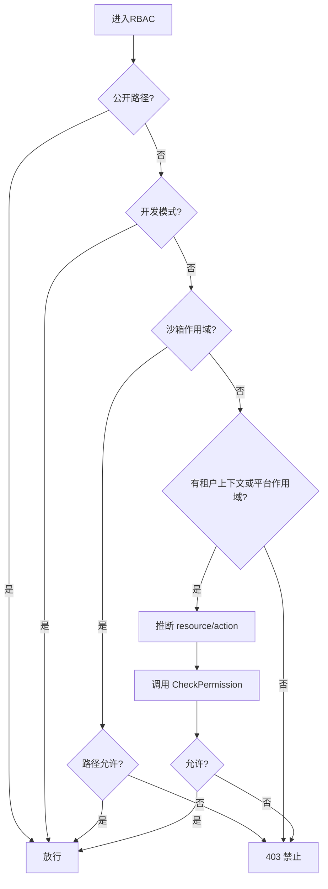
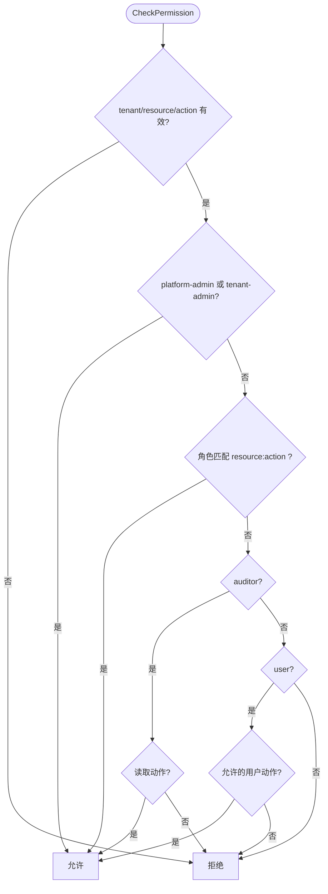
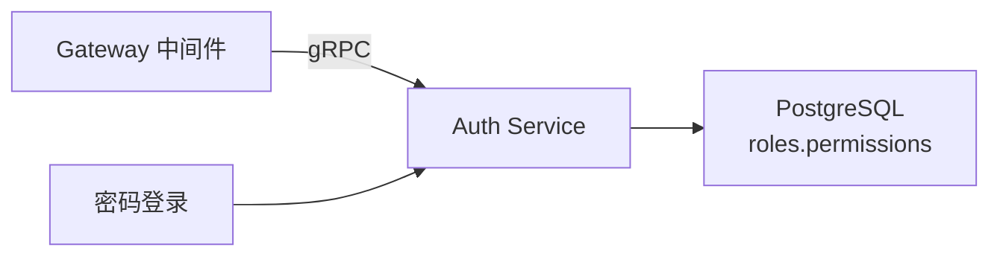

# RBAC 权限控制

<cite>
**本文引用的文件**
- [services/ani-gateway/internal/middleware/auth.go](file://repo/services/ani-gateway/internal/middleware/auth.go)
- [services/ani-gateway/internal/middleware/rbac.go](file://repo/services/ani-gateway/internal/middleware/rbac.go)
- [services/ani-gateway/internal/middleware/chain.go](file://repo/services/ani-gateway/internal/middleware/chain.go)
- [services/ani-gateway/internal/middleware/auth_client.go](file://repo/services/ani-gateway/internal/middleware/auth_client.go)
- [services/auth-service/internal/service/auth_service.go](file://repo/services/auth-service/internal/service/auth_service.go)
- [pkg/ports/password_login.go](file://repo/pkg/ports/password_login.go)
- [deploy/migrations/20260502_003_permissions_schema.sql](file://repo/deploy/migrations/20260502_003_permissions_schema.sql)
- [frontends/console/src/api/schema.d.ts](file://repo/frontends/console/src/api/schema.d.ts)
- [development-records/auth-login-core-001.md](file://repo/development-records/auth-login-core-001.md)
</cite>

## 目录
1. [简介](#简介)
2. [项目结构](#项目结构)
3. [核心组件](#核心组件)
4. [架构总览](#架构总览)
5. [详细组件分析](#详细组件分析)
6. [依赖关系分析](#依赖关系分析)
7. [性能与可扩展性](#性能与可扩展性)
8. [故障排查指南](#故障排查指南)
9. [结论](#结论)
10. [附录：权限矩阵与管理接口](#附录：权限矩阵与管理接口)

## 简介
本文件系统性说明 ANI 平台的 RBAC（基于角色的访问控制）权限模型、网关中间件统一鉴权流程、角色与权限矩阵、权限继承与组合规则、审计日志与冲突解决策略，以及面向控制台的管理接口设计。目标是让非技术读者也能理解“谁在什么范围能做什么”，同时为开发者提供可落地的实现参考。

## 项目结构
RBAC 能力由以下关键部分构成：
- 网关中间件层：统一认证与授权入口，负责令牌校验、作用域隔离、资源/动作推断，并调用权限服务进行决策。
- 权限服务：集中式权限判断，内置最小化角色规则引擎，支持平台管理员、租户管理员、普通用户、审计员等角色语义。
- 数据与配置：通过数据库迁移定义角色与权限 JSONB 约束，前端 OpenAPI 类型描述管理界面所需的数据结构。

**图示来源**
- [services/ani-gateway/internal/middleware/auth.go:18-141](file://repo/services/ani-gateway/internal/middleware/auth.go#L18-L141)
- [services/ani-gateway/internal/middleware/rbac.go:14-71](file://repo/services/ani-gateway/internal/middleware/rbac.go#L14-L71)
- [services/auth-service/internal/service/auth_service.go:123-187](file://repo/services/auth-service/internal/service/auth_service.go#L123-L187)
- [deploy/migrations/20260502_003_permissions_schema.sql:20-70](file://repo/deploy/migrations/20260502_003_permissions_schema.sql#L20-L70)

**章节来源**
- [services/ani-gateway/internal/middleware/auth.go:18-141](file://repo/services/ani-gateway/internal/middleware/auth.go#L18-L141)
- [services/ani-gateway/internal/middleware/rbac.go:14-71](file://repo/services/ani-gateway/internal/middleware/rbac.go#L14-L71)
- [services/auth-service/internal/service/auth_service.go:123-187](file://repo/services/auth-service/internal/service/auth_service.go#L123-L187)
- [deploy/migrations/20260502_003_permissions_schema.sql:20-70](file://repo/deploy/migrations/20260502_003_permissions_schema.sql#L20-L70)

## 核心组件
- 网关认证中间件：解析 Bearer Token、API Key、沙箱短令牌；按路径与作用域白名单放行；将 tenant_id、user_id、roles、scope 注入上下文。
- 网关授权中间件：根据 HTTP 方法与路径推断资源与动作，调用权限服务 CheckPermission 做最终裁决。
- 权限服务：内置最小化规则引擎，优先放行平台/租户管理员，其次匹配 scope 模式，再按角色限制（审计只读、用户受限）。
- 登录与角色加载：平台管理员与租户管理员分别通过密码登录流程加载角色；平台账号无租户上下文。

**章节来源**
- [services/ani-gateway/internal/middleware/auth.go:18-141](file://repo/services/ani-gateway/internal/middleware/auth.go#L18-L141)
- [services/ani-gateway/internal/middleware/rbac.go:14-71](file://repo/services/ani-gateway/internal/middleware/rbac.go#L14-L71)
- [services/auth-service/internal/service/auth_service.go:161-187](file://repo/services/auth-service/internal/service/auth_service.go#L161-L187)
- [pkg/ports/password_login.go:52-73](file://repo/pkg/ports/password_login.go#L52-L73)

## 架构总览
请求进入网关后，先经过认证（Auth），再进行授权（RBAC），然后进入业务路由。认证阶段完成身份识别与作用域隔离；授权阶段将请求映射为“资源:动作”并交由权限服务判定。

**图示来源**
- [services/ani-gateway/internal/middleware/chain.go:2-16](file://repo/services/ani-gateway/internal/middleware/chain.go#L2-L16)
- [services/ani-gateway/internal/middleware/auth.go:18-141](file://repo/services/ani-gateway/internal/middleware/auth.go#L18-L141)
- [services/ani-gateway/internal/middleware/rbac.go:14-71](file://repo/services/ani-gateway/internal/middleware/rbac.go#L14-L71)
- [services/auth-service/internal/service/auth_service.go:123-187](file://repo/services/auth-service/internal/service/auth_service.go#L123-L187)

## 详细组件分析

### 网关认证中间件（Auth）
- 支持三种凭证：Bearer Token、API Key、沙箱短令牌。
- 作用域隔离：平台/管理路由仅允许 platform 作用域；沙箱 token 仅允许特定子资源路径；其余路由仅允许 tenant 作用域。
- 开发模式：可通过环境变量启用本地模拟身份，便于联调。

**图示来源**
- [services/ani-gateway/internal/middleware/auth.go:18-141](file://repo/services/ani-gateway/internal/middleware/auth.go#L18-L141)
- [services/ani-gateway/internal/middleware/auth.go:214-229](file://repo/services/ani-gateway/internal/middleware/auth.go#L214-L229)

**章节来源**
- [services/ani-gateway/internal/middleware/auth.go:18-141](file://repo/services/ani-gateway/internal/middleware/auth.go#L18-L141)
- [services/ani-gateway/internal/middleware/auth.go:214-229](file://repo/services/ani-gateway/internal/middleware/auth.go#L214-L229)

### 网关授权中间件（RBAC）
- 将 HTTP 方法与路径推断为“资源:动作”。
- 对沙箱 token 做额外路径白名单检查。
- 调用权限服务进行最终授权决策，失败返回 403。

**图示来源**
- [services/ani-gateway/internal/middleware/rbac.go:14-71](file://repo/services/ani-gateway/internal/middleware/rbac.go#L14-L71)
- [services/ani-gateway/internal/middleware/rbac.go:74-98](file://repo/services/ani-gateway/internal/middleware/rbac.go#L74-L98)

**章节来源**
- [services/ani-gateway/internal/middleware/rbac.go:14-71](file://repo/services/ani-gateway/internal/middleware/rbac.go#L14-L71)
- [services/ani-gateway/internal/middleware/rbac.go:74-98](file://repo/services/ani-gateway/internal/middleware/rbac.go#L74-L98)

### 权限服务（CheckPermission）
- 优先级规则：
  - 平台管理员或租户管理员：直接允许。
  - 若角色包含资源级 scope 匹配（如 resource:action 或通配符）：允许。
  - 审计员：仅允许读取类动作（get/list/read/watch）。
  - 普通用户：仅允许受限动作集合。
  - 否则：拒绝。
- API Key 会被转换为 service-account 角色并限定为租户作用域。

**图示来源**
- [services/auth-service/internal/service/auth_service.go:161-187](file://repo/services/auth-service/internal/service/auth_service.go#L161-L187)
- [services/auth-service/internal/service/auth_service.go:261-277](file://repo/services/auth-service/internal/service/auth_service.go#L261-L277)

**章节来源**
- [services/auth-service/internal/service/auth_service.go:161-187](file://repo/services/auth-service/internal/service/auth_service.go#L161-L187)
- [services/auth-service/internal/service/auth_service.go:261-277](file://repo/services/auth-service/internal/service/auth_service.go#L261-L277)

### 角色与权限矩阵
- 平台管理员（platform-admin）：系统级全量权限，作用于平台作用域。
- 租户管理员（tenant-admin）：租户级全量权限，作用于租户作用域。
- 普通用户（user）：受限资源与动作，支持 own/tenant 作用域。
- 审计员（auditor）：租户级只读权限。
- 服务账户（service-account）：API Key 转换而来，默认租户作用域，用于服务间调用。

这些角色及其权限在数据库中通过 JSONB 字段进行约束与存储，确保资源与动作的合法性。

**章节来源**
- [deploy/migrations/20260502_003_permissions_schema.sql:41-70](file://repo/deploy/migrations/20260502_003_permissions_schema.sql#L41-L70)
- [services/auth-service/internal/service/auth_service.go:161-187](file://repo/services/auth-service/internal/service/auth_service.go#L161-L187)

### 权限继承与组合规则
- 继承：平台管理员与租户管理员拥有最高权限，覆盖其他角色。
- 组合：多个角色叠加时，任一角色满足条件即允许；但审计员与普通用户的动作集合受限于各自规则。
- 作用域：platform、tenant、own 三类作用域决定资源访问边界；平台路由仅限 platform 作用域，沙箱 token 仅限特定子资源。

**章节来源**
- [services/auth-service/internal/service/auth_service.go:161-187](file://repo/services/auth-service/internal/service/auth_service.go#L161-L187)
- [services/ani-gateway/internal/middleware/auth.go:214-229](file://repo/services/ani-gateway/internal/middleware/auth.go#L214-L229)

### 内部服务信任网关的设计原则
- 内部服务通过 API Key 或专用 JWT 访问网关，被转换为 service-account 角色，且限定为租户作用域。
- 平台管理路由严格限制为 platform 作用域，防止租户 token 越权。
- 沙箱令牌采用本地 HMAC 校验，仅允许访问实例沙箱子资源，避免泄露平台管理能力。

**章节来源**
- [services/auth-service/internal/service/auth_service.go:123-159](file://repo/services/auth-service/internal/service/auth_service.go#L123-L159)
- [services/ani-gateway/internal/middleware/auth.go:51-137](file://repo/services/ani-gateway/internal/middleware/auth.go#L51-L137)

### 权限变更的审计日志记录
- 控制台侧定义了租户管理员审计日志模型，包含操作类型、资源、结果、用户标识与详情。
- 建议所有角色变更、权限调整、密钥管理等敏感操作均写入审计日志，便于追溯与合规。

**章节来源**
- [frontends/console/src/api/schema.d.ts:2316-2336](file://repo/frontends/console/src/api/schema.d.ts#L2316-L2336)

### 权限冲突解决策略
- 冲突场景：同一用户具备多个角色，不同角色对同一资源/动作存在读写冲突。
- 解决策略：
  - 管理员优先：平台管理员与租户管理员直接允许。
  - 显式 scope 匹配优先于通用角色。
  - 审计员与普通用户遵循最小权限原则，不覆盖管理员与显式 scope。
  - 若仍冲突，应引入更细粒度的策略引擎（如 OPA）进行裁决。

**章节来源**
- [services/auth-service/internal/service/auth_service.go:161-187](file://repo/services/auth-service/internal/service/auth_service.go#L161-L187)

## 依赖关系分析
- 网关中间件依赖 Auth Service 的 gRPC 接口进行权限判断。
- 权限服务依赖 PostgreSQL 存储角色与权限 JSONB 配置。
- 登录模块依赖密码登录接口，平台管理员无租户上下文。

**图示来源**
- [services/ani-gateway/internal/middleware/auth_client.go:16-58](file://repo/services/ani-gateway/internal/middleware/auth_client.go#L16-L58)
- [services/auth-service/internal/service/auth_service.go:123-187](file://repo/services/auth-service/internal/service/auth_service.go#L123-L187)
- [pkg/ports/password_login.go:52-73](file://repo/pkg/ports/password_login.go#L52-L73)

**章节来源**
- [services/ani-gateway/internal/middleware/auth_client.go:16-58](file://repo/services/ani-gateway/internal/middleware/auth_client.go#L16-L58)
- [services/auth-service/internal/service/auth_service.go:123-187](file://repo/services/auth-service/internal/service/auth_service.go#L123-L187)
- [pkg/ports/password_login.go:52-73](file://repo/pkg/ports/password_login.go#L52-L73)

## 性能与可扩展性
- 中间件链路短平快：认证与授权在网关层快速失败，减少后端压力。
- 权限判断集中化：通过 CheckPermission 统一裁决，便于后续替换为 OPA 等策略引擎。
- 作用域隔离降低误判：platform/tenant/sandbox 作用域明确，避免跨域访问。
- 可扩展点：
  - 将 RBAC 中间件从 stub 升级为策略引擎调用。
  - 增加缓存层加速高频权限查询。
  - 扩展资源与动作枚举，保持向后兼容。

[本节为通用指导，无需具体文件引用]

## 故障排查指南
- 401 未认证：检查 Authorization 头或 X-API-Key 是否正确；确认 dev 模式下是否设置了必要的开发头。
- 403 禁止访问：确认作用域是否匹配；检查 RBAC 推断的资源/动作是否正确；查看权限服务返回的原因。
- 平台路由不可用：确认 token 作用域为 platform；平台路由仅允许 platform 作用域。
- 沙箱 token 被拒：确认路径是否为沙箱子资源；检查本地 HMAC 校验是否通过。

**章节来源**
- [services/ani-gateway/internal/middleware/auth.go:51-141](file://repo/services/ani-gateway/internal/middleware/auth.go#L51-L141)
- [services/ani-gateway/internal/middleware/rbac.go:21-71](file://repo/services/ani-gateway/internal/middleware/rbac.go#L21-L71)

## 结论
ANI 平台的 RBAC 以网关中间件为统一入口，结合权限服务的集中式决策，实现了清晰的角色划分与作用域隔离。当前实现已覆盖平台管理员、租户管理员、普通用户、审计员与服务账户的核心场景，并为未来接入策略引擎预留了扩展点。建议在后续迭代中完善审计日志、冲突解决策略与性能优化。

[本节为总结，无需具体文件引用]

## 附录：权限矩阵与管理接口

### 角色与权限矩阵
- platform-admin：平台级全量权限，作用于 platform 作用域。
- tenant-admin：租户级全量权限，作用于 tenant 作用域。
- user：受限资源与动作，支持 own/tenant 作用域。
- auditor：租户级只读权限。
- service-account：API Key 转换而来，默认租户作用域。

**章节来源**
- [deploy/migrations/20260502_003_permissions_schema.sql:41-70](file://repo/deploy/migrations/20260502_003_permissions_schema.sql#L41-L70)
- [services/auth-service/internal/service/auth_service.go:161-187](file://repo/services/auth-service/internal/service/auth_service.go#L161-L187)

### 管理界面设计要点
- 管理员角色与权限查询/修改接口需受平台管理员或平台运维角色保护。
- 权限模型采用四维模型（角色 + 资源 + 动作 + 作用域），前端类型定义已包含相关结构。
- 审计日志需记录角色变更、权限调整、密钥管理等敏感操作。

**章节来源**
- [frontends/console/src/api/schema.d.ts:1157-1200](file://repo/frontends/console/src/api/schema.d.ts#L1157-L1200)
- [frontends/console/src/api/schema.d.ts:2316-2336](file://repo/frontends/console/src/api/schema.d.ts#L2316-L2336)

### 权限检查机制与网关集成
- 网关中间件在认证阶段设置租户上下文与作用域，在授权阶段推断资源/动作并调用权限服务。
- 开发模式可绕过权限检查，便于联调；生产环境必须启用完整鉴权链路。

**章节来源**
- [services/ani-gateway/internal/middleware/auth.go:18-141](file://repo/services/ani-gateway/internal/middleware/auth.go#L18-L141)
- [services/ani-gateway/internal/middleware/rbac.go:14-71](file://repo/services/ani-gateway/internal/middleware/rbac.go#L14-L71)
- [development-records/auth-login-core-001.md:22-28](file://repo/development-records/auth-login-core-001.md#L22-L28)