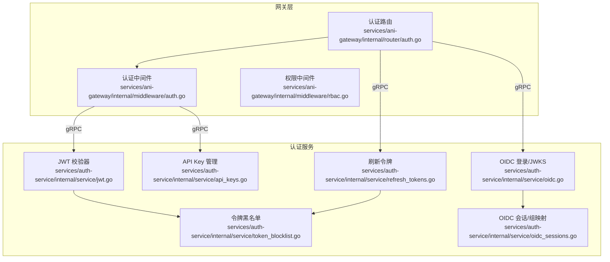
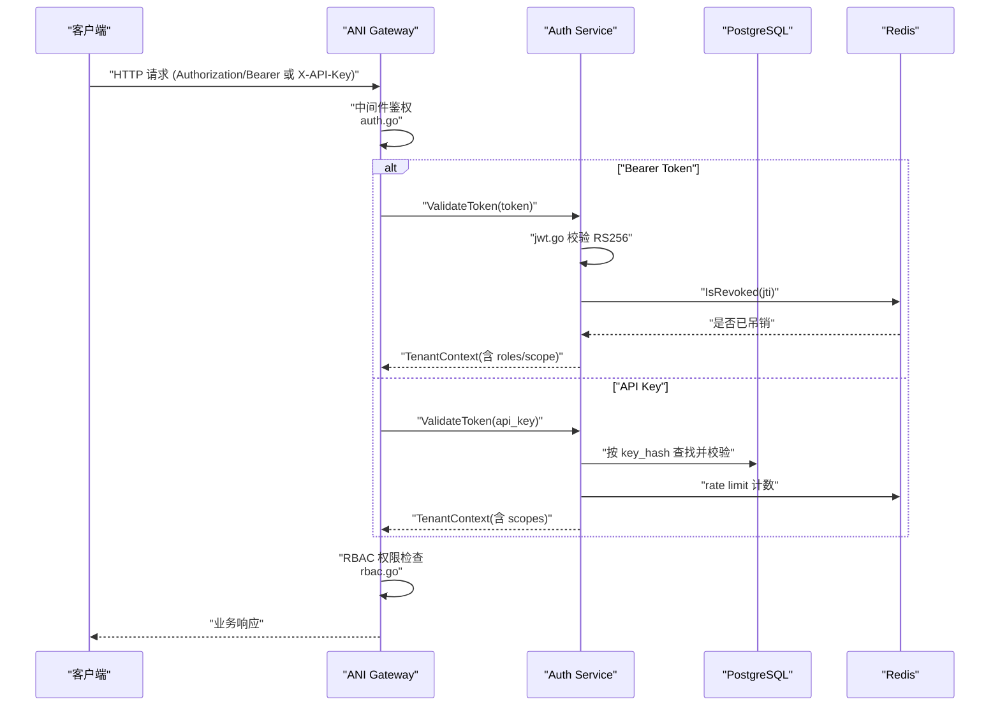
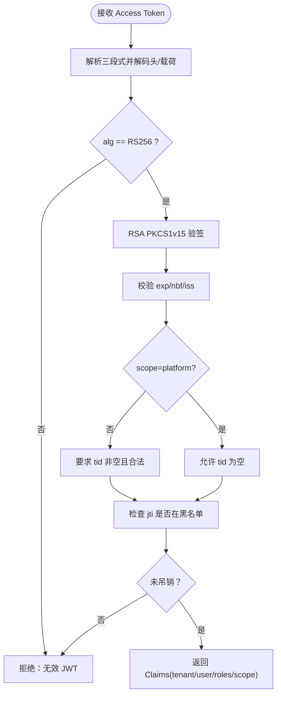
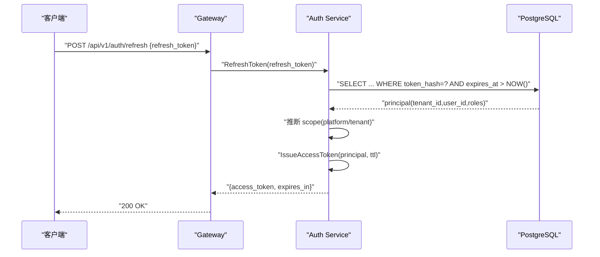
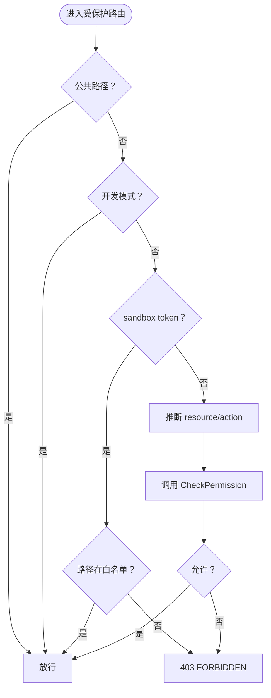
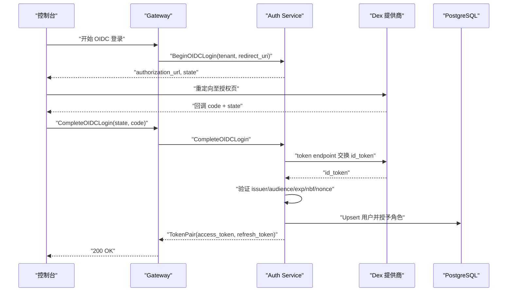
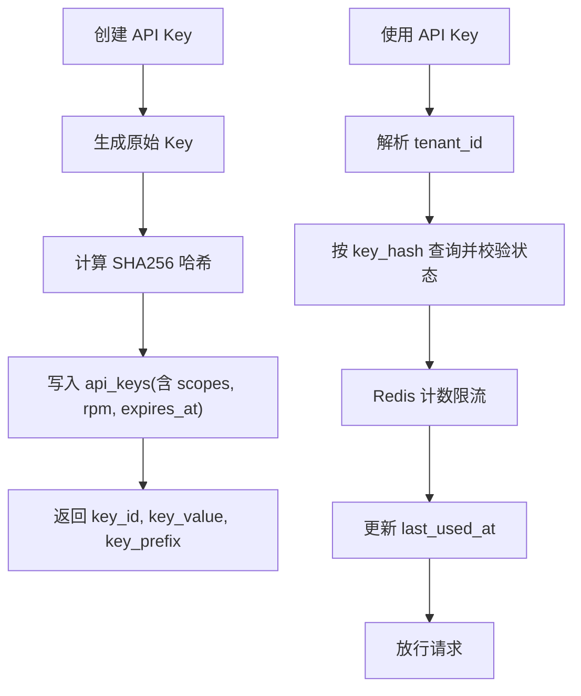
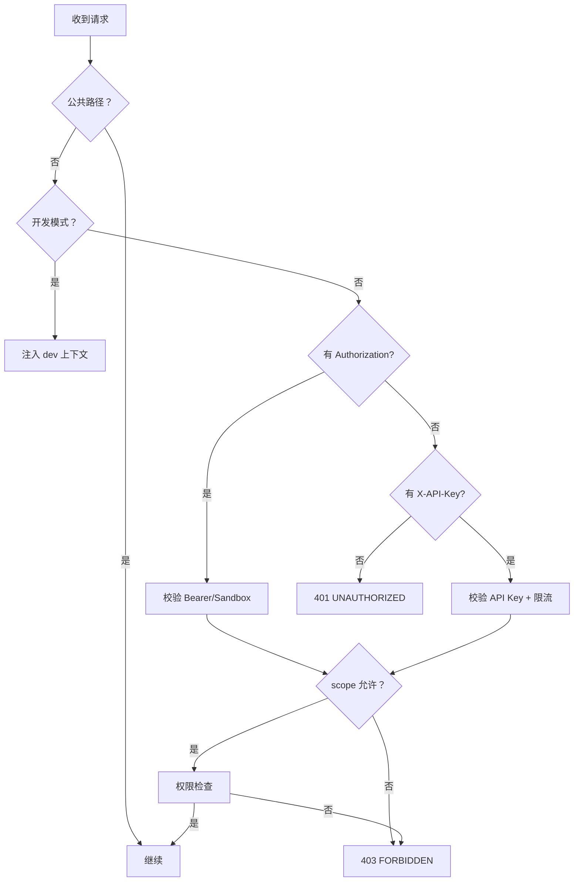
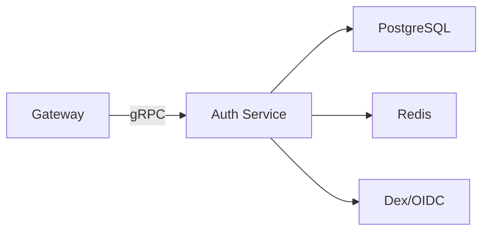

# 认证授权

<cite>
**本文引用的文件**
- [services/auth-service/internal/service/jwt.go](file://services/auth-service/internal/service/jwt.go)
- [services/auth-service/internal/service/refresh_tokens.go](file://services/auth-service/internal/service/refresh_tokens.go)
- [services/auth-service/internal/service/api_keys.go](file://services/auth-service/internal/service/api_keys.go)
- [services/auth-service/internal/service/token_blocklist.go](file://services/auth-service/internal/service/token_blocklist.go)
- [services/auth-service/internal/service/oidc.go](file://services/auth-service/internal/service/oidc.go)
- [services/auth-service/internal/service/oidc_sessions.go](file://services/auth-service/internal/service/oidc_sessions.go)
- [services/ani-gateway/internal/middleware/auth.go](file://services/ani-gateway/internal/middleware/auth.go)
- [services/ani-gateway/internal/middleware/rbac.go](file://services/ani-gateway/internal/middleware/rbac.go)
- [services/ani-gateway/internal/router/auth.go](file://services/ani-gateway/internal/router/auth.go)
- [development-records/m2-2-auth-a-auth-service-foundation.md](file://development-records/m2-2-auth-a-auth-service-foundation.md)
</cite>

## 目录
1. [简介](#简介)
2. [项目结构](#项目结构)
3. [核心组件](#核心组件)
4. [架构总览](#架构总览)
5. [详细组件分析](#详细组件分析)
6. [依赖关系分析](#依赖关系分析)
7. [性能考虑](#性能考虑)
8. [故障排查指南](#故障排查指南)
9. [结论](#结论)
10. [附录](#附录)

## 简介
本文件系统性说明 ANI 平台的认证与授权体系，覆盖以下主题：
- JWT 令牌管理：AccessToken 与 RefreshToken 生命周期、RS256 签名校验、密钥轮换策略、令牌吊销机制。
- RBAC 权限模型：平台管理员、租户管理员、普通用户、审计员等角色矩阵与权限检查流程。
- OIDC 集成：Dex 身份提供商对接、组映射到角色、JWKS 公钥发现与缓存。
- API Key 管理：Key 生成、存储（SHA256 哈希）、绑定范围、限流配置。
- 认证中间件：Gateway 的鉴权与权限拦截、错误处理策略。

## 项目结构
认证授权相关代码主要分布在两个服务中：
- auth-service：负责令牌签发与校验、OIDC 登录流程、刷新令牌、API Key 管理、令牌黑名单持久化与缓存。
- ani-gateway：提供 HTTP 路由与中间件，统一进行 Bearer Token / API Key 鉴权、RBAC 权限检查、限流与请求上下文注入。

**图表来源**
- [services/ani-gateway/internal/middleware/auth.go:18-142](file://services/ani-gateway/internal/middleware/auth.go#L18-L142)
- [services/ani-gateway/internal/middleware/rbac.go:14-72](file://services/ani-gateway/internal/middleware/rbac.go#L14-L72)
- [services/ani-gateway/internal/router/auth.go:51-95](file://services/ani-gateway/internal/router/auth.go#L51-L95)
- [services/auth-service/internal/service/jwt.go:21-147](file://services/auth-service/internal/service/jwt.go#L21-L147)
- [services/auth-service/internal/service/refresh_tokens.go:19-92](file://services/auth-service/internal/service/refresh_tokens.go#L19-L92)
- [services/auth-service/internal/service/api_keys.go:31-414](file://services/auth-service/internal/service/api_keys.go#L31-L414)
- [services/auth-service/internal/service/token_blocklist.go:14-94](file://services/auth-service/internal/service/token_blocklist.go#L14-L94)
- [services/auth-service/internal/service/oidc.go:28-195](file://services/auth-service/internal/service/oidc.go#L28-L195)
- [services/auth-service/internal/service/oidc_sessions.go:17-189](file://services/auth-service/internal/service/oidc_sessions.go#L17-L189)

**章节来源**
- [development-records/m2-2-auth-a-auth-service-foundation.md:16-34](file://development-records/m2-2-auth-a-auth-service-foundation.md#L16-L34)

## 核心组件
- JWT 校验器：解析并验证 RS256 签名的 Access Token，提取 tenant_id、user_id、roles、scope、jti，并支持黑名单校验。
- 刷新令牌：基于数据库中的 refresh token 签发新的 Access Token，区分平台与租户 scope。
- API Key：生成、存储（SHA256 哈希）、按租户隔离查询、撤销、速率限制。
- 令牌黑名单：Redis 缓存 + PostgreSQL 持久化的可过期黑名单，用于即时吊销。
- OIDC 登录：支持 Dex 默认端点推导、JWKS 动态发现与缓存、静态公钥回退；组到角色映射；创建会话并返回 TokenPair。
- 网关中间件：Bearer Token / API Key 鉴权、sandbox token 特殊路径控制、RBAC 权限检查、公共路径放行、错误响应标准化。

**章节来源**
- [services/auth-service/internal/service/jwt.go:21-147](file://services/auth-service/internal/service/jwt.go#L21-L147)
- [services/auth-service/internal/service/refresh_tokens.go:19-92](file://services/auth-service/internal/service/refresh_tokens.go#L19-L92)
- [services/auth-service/internal/service/api_keys.go:31-414](file://services/auth-service/internal/service/api_keys.go#L31-L414)
- [services/auth-service/internal/service/token_blocklist.go:14-94](file://services/auth-service/internal/service/token_blocklist.go#L14-L94)
- [services/auth-service/internal/service/oidc.go:28-195](file://services/auth-service/internal/service/oidc.go#L28-L195)
- [services/auth-service/internal/service/oidc_sessions.go:17-189](file://services/auth-service/internal/service/oidc_sessions.go#L17-L189)
- [services/ani-gateway/internal/middleware/auth.go:18-142](file://services/ani-gateway/internal/middleware/auth.go#L18-L142)
- [services/ani-gateway/internal/middleware/rbac.go:14-72](file://services/ani-gateway/internal/middleware/rbac.go#L14-L72)

## 架构总览
下图展示一次典型请求从 Gateway 进入，经过鉴权与权限检查，最终调用业务逻辑的完整链路。

**图表来源**
- [services/ani-gateway/internal/middleware/auth.go:18-142](file://services/ani-gateway/internal/middleware/auth.go#L18-L142)
- [services/auth-service/internal/service/jwt.go:96-169](file://services/auth-service/internal/service/jwt.go#L96-L169)
- [services/auth-service/internal/service/token_blocklist.go:57-94](file://services/auth-service/internal/service/token_blocklist.go#L57-L94)
- [services/auth-service/internal/service/api_keys.go:223-269](file://services/auth-service/internal/service/api_keys.go#L223-L269)
- [services/ani-gateway/internal/middleware/rbac.go:21-72](file://services/ani-gateway/internal/middleware/rbac.go#L21-L72)

## 详细组件分析

### JWT 令牌管理与吊销
- 算法与载荷：Access Token 使用 RS256 签名；载荷包含 iss、exp、nbf、iat、jti、tid、uid、roles、scope。
- 校验流程：解析三段式结构，强制 alg=RS256，校验签名、时间窗口、issuer、tenant/user 合法性；对 platform token 允许 tid 为空，对 tenant token 必须携带有效 tid。
- 吊销机制：通过 jti 在 Redis 与 PostgreSQL 中维护可过期黑名单；校验时优先查缓存，未命中再查库，并将结果回填缓存。
- 密钥轮换：当前实现以 PEM 公钥配置为主，支持从文件或内联配置加载；若需轮换，可通过滚动更新公钥并在签发侧切换私钥完成。

**图表来源**
- [services/auth-service/internal/service/jwt.go:96-169](file://services/auth-service/internal/service/jwt.go#L96-L169)
- [services/auth-service/internal/service/token_blocklist.go:57-94](file://services/auth-service/internal/service/token_blocklist.go#L57-L94)

**章节来源**
- [services/auth-service/internal/service/jwt.go:21-147](file://services/auth-service/internal/service/jwt.go#L21-L147)
- [services/auth-service/internal/service/token_blocklist.go:14-94](file://services/auth-service/internal/service/token_blocklist.go#L14-L94)

### RefreshToken 与 AccessToken 生命周期
- 刷新流程：客户端提交 RefreshToken，服务端校验其有效性（存在、未过期、未撤销），根据 tenant_id 推断 scope（NULL→platform，否则→tenant），签发对应 scope 的 Access Token。
- 存储与追踪：RefreshToken 原始值不落地，仅存储 SHA256 哈希；每次使用会更新时间戳以便审计。
- 安全要点：平台与租户 token 严格隔离，避免跨域访问；刷新接口受网关鉴权保护。

**图表来源**
- [services/ani-gateway/internal/router/auth.go:369-396](file://services/ani-gateway/internal/router/auth.go#L369-L396)
- [services/auth-service/internal/service/refresh_tokens.go:40-76](file://services/auth-service/internal/service/refresh_tokens.go#L40-L76)

**章节来源**
- [services/auth-service/internal/service/refresh_tokens.go:19-92](file://services/auth-service/internal/service/refresh_tokens.go#L19-L92)
- [services/ani-gateway/internal/router/auth.go:51-95](file://services/ani-gateway/internal/router/auth.go#L51-L95)

### RBAC 权限模型与检查流程
- 角色集合：平台管理员、租户管理员、普通用户、审计员。
- 权限矩阵（示例）：
  - 平台管理员：平台级读写操作。
  - 租户管理员：租户级资源管理。
  - 普通用户：读/用/创建基线能力。
  - 审计员：只读访问审计数据。
- 检查流程：网关从上下文获取 tenant_id、user_id、roles、scope，推断 resource 与 action，调用 auth-service 的 CheckPermission 决策；sandbox token 走独立白名单。

**图表来源**
- [services/ani-gateway/internal/middleware/rbac.go:21-72](file://services/ani-gateway/internal/middleware/rbac.go#L21-L72)
- [development-records/m2-2-auth-a-auth-service-foundation.md:28-32](file://development-records/m2-2-auth-a-auth-service-foundation.md#L28-L32)

**章节来源**
- [services/ani-gateway/internal/middleware/rbac.go:14-115](file://services/ani-gateway/internal/middleware/rbac.go#L14-L115)
- [development-records/m2-2-auth-a-auth-service-foundation.md:28-32](file://development-records/m2-2-auth-a-auth-service-foundation.md#L28-L32)

### OIDC 集成（Dex、组映射、JWKS）
- 登录流程：Begin 生成 state/nonce 并缓存；Complete 校验 state、code 交换 ID Token；校验 issuer、audience、时间窗口、nonce；创建或更新用户，授予角色，签发 TokenPair。
- 组到角色映射：通过 JSON 配置将 OIDC groups 映射为平台角色；未匹配则赋予默认角色 user。
- JWKS 公钥发现：优先从 Dex JWKS 端点拉取并缓存（默认 5 分钟），失败回退到静态公钥配置；仅接受 RSA 且满足最小位长与安全参数。

**图表来源**
- [services/auth-service/internal/service/oidc.go:101-195](file://services/auth-service/internal/service/oidc.go#L101-L195)
- [services/auth-service/internal/service/oidc.go:333-444](file://services/auth-service/internal/service/oidc.go#L333-L444)
- [services/auth-service/internal/service/oidc_sessions.go:30-101](file://services/auth-service/internal/service/oidc_sessions.go#L30-L101)

**章节来源**
- [services/auth-service/internal/service/oidc.go:28-593](file://services/auth-service/internal/service/oidc.go#L28-L593)
- [services/auth-service/internal/service/oidc_sessions.go:17-189](file://services/auth-service/internal/service/oidc_sessions.go#L17-L189)

### API Key 管理（生成、存储、范围、限流）
- 生成与格式：随机字节 + 环境前缀 + tenant_id + 随机串，便于识别归属租户。
- 存储安全：仅存储 SHA256 哈希；公开前缀用于日志与展示。
- 范围绑定：scopes 规范化为“scope:resource:action”三元组，支持去重与通配符。
- 限流：基于 Redis 计数器，按 key_hash 维度每分钟请求数限制；可配置上限。
- 生命周期：支持设置过期时间；支持撤销（标记 revoked_at）。

**图表来源**
- [services/auth-service/internal/service/api_keys.go:46-119](file://services/auth-service/internal/service/api_keys.go#L46-L119)
- [services/auth-service/internal/service/api_keys.go:223-269](file://services/auth-service/internal/service/api_keys.go#L223-L269)
- [services/auth-service/internal/service/api_keys.go:306-318](file://services/auth-service/internal/service/api_keys.go#L306-L318)

**章节来源**
- [services/auth-service/internal/service/api_keys.go:31-414](file://services/auth-service/internal/service/api_keys.go#L31-L414)

### 认证中间件与错误处理
- 鉴权顺序：公共路径直接放行；优先尝试 Bearer Token（支持 sandbox token 短生命周期 HMAC 校验），其次尝试 API Key；均失败返回 401。
- 作用域隔离：平台路由仅允许 scope=platform；其他路由仅允许 scope=tenant；sandbox token 仅允许特定子资源路径。
- 权限检查：RBAC 中间件推断 resource/action，调用 auth-service 决策；未通过返回 403。
- 错误处理：统一转换为标准错误码与消息，如 UNAUTHORIZED、FORBIDDEN、RATE_LIMIT_EXCEEDED、AUTH_SERVICE_UNAVAILABLE。

**图表来源**
- [services/ani-gateway/internal/middleware/auth.go:18-142](file://services/ani-gateway/internal/middleware/auth.go#L18-L142)
- [services/ani-gateway/internal/middleware/rbac.go:21-72](file://services/ani-gateway/internal/middleware/rbac.go#L21-L72)

**章节来源**
- [services/ani-gateway/internal/middleware/auth.go:18-230](file://services/ani-gateway/internal/middleware/auth.go#L18-L230)
- [services/ani-gateway/internal/middleware/rbac.go:14-115](file://services/ani-gateway/internal/middleware/rbac.go#L14-L115)

## 依赖关系分析
- 组件耦合：
  - Gateway 中间件依赖 auth-service gRPC 接口进行鉴权与权限检查。
  - auth-service 内部模块通过接口抽象依赖数据库与缓存，便于测试与替换。
- 外部依赖：
  - PostgreSQL：用户、租户、角色、刷新令牌、API Key、JWT 黑名单等持久化。
  - Redis：JWT 黑名单缓存、API Key 限流计数、OIDC state 临时存储。
  - Dex/OIDC：授权码流程、JWKS 公钥发现。

**图表来源**
- [services/ani-gateway/internal/middleware/auth.go:18-142](file://services/ani-gateway/internal/middleware/auth.go#L18-L142)
- [services/auth-service/internal/service/oidc.go:28-195](file://services/auth-service/internal/service/oidc.go#L28-L195)
- [services/auth-service/internal/service/api_keys.go:31-414](file://services/auth-service/internal/service/api_keys.go#L31-L414)
- [services/auth-service/internal/service/token_blocklist.go:14-94](file://services/auth-service/internal/service/token_blocklist.go#L14-L94)

**章节来源**
- [services/ani-gateway/internal/middleware/auth.go:18-230](file://services/ani-gateway/internal/middleware/auth.go#L18-L230)
- [services/auth-service/internal/service/oidc.go:28-593](file://services/auth-service/internal/service/oidc.go#L28-L593)
- [services/auth-service/internal/service/api_keys.go:31-414](file://services/auth-service/internal/service/api_keys.go#L31-L414)
- [services/auth-service/internal/service/token_blocklist.go:14-94](file://services/auth-service/internal/service/token_blocklist.go#L14-L94)

## 性能考虑
- 令牌校验：优先本地签名校验，黑名单检查先查 Redis 缓存，未命中再落库，降低数据库压力。
- 刷新令牌：单次数据库查询与更新，附带 last_used_at 统计，避免频繁 IO。
- API Key 限流：基于 Redis 原子递增，毫秒级判断，支持高并发场景。
- JWKS 缓存：默认 5 分钟缓存，减少对外部 IdP 的网络开销。
- 建议：在高负载下监控 Redis 命中率、数据库慢查询、OIDC 网络延迟，必要时调整 TTL 与超时。

[本节为通用性能指导，无需具体文件引用]

## 故障排查指南
- 401 UNAUTHORIZED：
  - 检查 Authorization 头是否为 Bearer Token 或 X-API-Key 是否存在。
  - 确认 Token 未过期、issuer 正确、签名有效。
  - 检查 Redis 黑名单是否误标记。
- 403 FORBIDDEN：
  - 检查 scope 是否允许访问该路径（platform vs tenant vs sandbox）。
  - 检查 RBAC 决策是否允许（roles/resource/action）。
- 429 RATE_LIMIT_EXCEEDED：
  - 检查 API Key 的 rate_limit_rpm 配置与 Redis 计数。
- OIDC 登录失败：
  - 检查 state/nonce 是否一致、redirect_uri 是否合法。
  - 检查 JWKS 端点可达性与公钥格式。
  - 检查 Dex 返回的 id_token 是否包含必要字段。

**章节来源**
- [services/ani-gateway/internal/middleware/auth.go:18-142](file://services/ani-gateway/internal/middleware/auth.go#L18-L142)
- [services/ani-gateway/internal/middleware/rbac.go:21-72](file://services/ani-gateway/internal/middleware/rbac.go#L21-L72)
- [services/auth-service/internal/service/token_blocklist.go:57-94](file://services/auth-service/internal/service/token_blocklist.go#L57-L94)
- [services/auth-service/internal/service/oidc.go:101-195](file://services/auth-service/internal/service/oidc.go#L101-L195)

## 结论
本认证授权体系以 JWT（RS256）为核心，结合 RefreshToken、API Key、RBAC 与 OIDC，形成多因子、多路径的鉴权与授权方案。通过 Redis 与 PostgreSQL 的组合实现令牌吊销与限流，借助 Dex 的 JWKS 动态发现保障公钥轮换的安全性。网关中间件统一入口，确保所有请求在统一的上下文中进行鉴权与权限判定，具备良好的可扩展性与可维护性。

[本节为总结性内容，无需具体文件引用]

## 附录
- 关键配置项（示例）：
  - JWT 公钥：PublicKeyPEM / PublicKeyFile
  - OIDC：OIDCIssuerURL、OIDCAuthURL、OIDCTokenURL、OIDCJWKSURL、OIDCClientID、OIDCClientSecret、OIDCPublicKeyPEM / OIDCPublicKeyFile、OIDCGroupRoleMapJSON
  - 网关：ANI_AUTH_MODE（dev 模式）、GATEWAY_RATE_LIMIT_REQUESTS、GATEWAY_RATE_LIMIT_WINDOW
- 参考实现路径：
  - JWT 校验：[services/auth-service/internal/service/jwt.go](file://services/auth-service/internal/service/jwt.go)
  - 刷新令牌：[services/auth-service/internal/service/refresh_tokens.go](file://services/auth-service/internal/service/refresh_tokens.go)
  - API Key：[services/auth-service/internal/service/api_keys.go](file://services/auth-service/internal/service/api_keys.go)
  - 黑名单：[services/auth-service/internal/service/token_blocklist.go](file://services/auth-service/internal/service/token_blocklist.go)
  - OIDC：[services/auth-service/internal/service/oidc.go](file://services/auth-service/internal/service/oidc.go)、[services/auth-service/internal/service/oidc_sessions.go](file://services/auth-service/internal/service/oidc_sessions.go)
  - 网关鉴权与权限：[services/ani-gateway/internal/middleware/auth.go](file://services/ani-gateway/internal/middleware/auth.go)、[services/ani-gateway/internal/middleware/rbac.go](file://services/ani-gateway/internal/middleware/rbac.go)

[本节为索引性内容，无需具体文件引用]