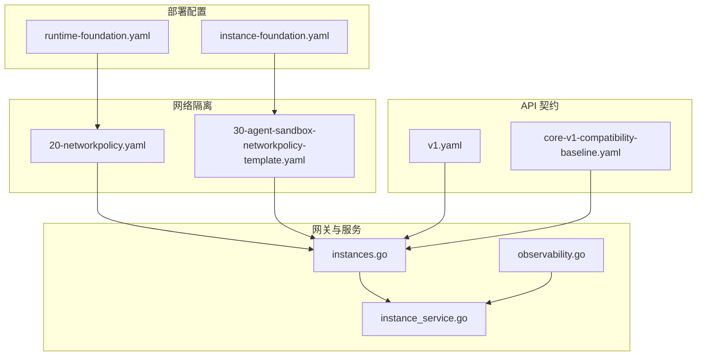
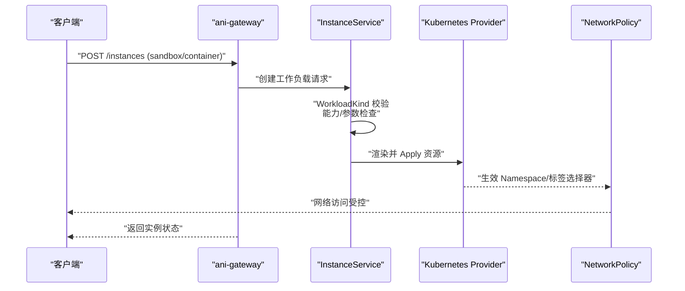
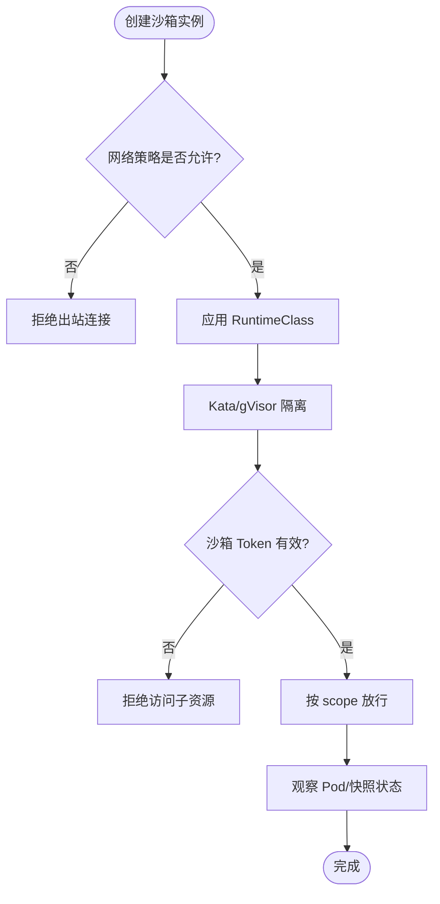
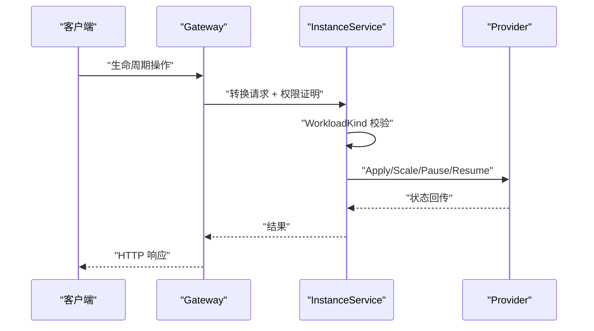
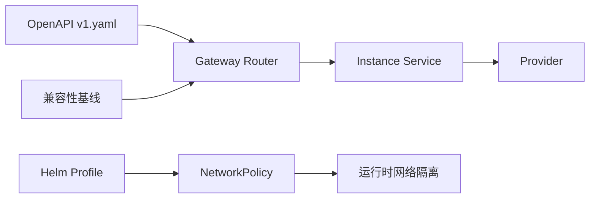

# 运行时安全

<cite>
**本文引用的文件**
- [runtime-foundation.yaml](file://repo/deploy/helm/ani-platform/profiles/runtime-foundation.yaml)
- [instance-foundation.yaml](file://repo/deploy/helm/ani-platform/profiles/instance-foundation.yaml)
- [30-agent-sandbox-networkpolicy-template.yaml](file://repo/deploy/manifests/m1-infra-c/30-agent-sandbox-networkpolicy-template.yaml)
- [20-networkpolicy.yaml](file://repo/deploy/manifests/m1-infra-a/20-networkpolicy.yaml)
- [instances.go](file://repo/services/ani-gateway/internal/router/instances.go)
- [observability.go](file://repo/services/ani-gateway/internal/router/observability.go)
- [instance_service.go](file://repo/pkg/adapters/runtime/instance_service.go)
- [kubernetes_sandbox_checkpoints_test.go](file://repo/pkg/adapters/runtime/kubernetes_sandbox_checkpoints_test.go)
- [v1.yaml](file://repo/api/openapi/v1.yaml)
- [core-v1-compatibility-baseline.yaml](file://repo/api/core-v1-compatibility-baseline.yaml)
- [component-contracts/workload-runtime.yaml](file://repo/deploy/helm/ani-platform/component-contracts/workload-runtime.yaml)
- [component-contracts/instance-fabric.yaml](file://repo/deploy/helm/ani-platform/component-contracts/instance-fabric.yaml)
- [m1-instance-d-admission-guardrail.md](file://repo/development-records/m1-instance-d-admission-guardrail.md)
- [m1-instance-u-a-termination-protection.md](file://repo/development-records/m1-instance-u-a-termination-protection.md)
- [instance-sandbox-token-a.md](file://repo/development-records/instance-sandbox-token-a.md)
- [instance-sandbox-adapter-a.md](file://repo/development-records/instance-sandbox-adapter-a.md)
</cite>

## 目录
1. [简介](#简介)
2. [项目结构](#项目结构)
3. [核心组件](#核心组件)
4. [架构总览](#架构总览)
5. [详细组件分析](#详细组件分析)
6. [依赖关系分析](#依赖关系分析)
7. [性能与可扩展性](#性能与可扩展性)
8. [故障排查指南](#故障排查指南)
9. [结论](#结论)
10. [附录](#附录)

## 简介
本文件聚焦 ANI 平台的“运行时安全”，覆盖准入控制、运行时威胁检测、Pod 安全标准、AI Agent 沙箱隔离以及监控与事件响应流程。内容基于仓库中 Helm Profile、Manifest、Gateway Router、Runtime Adapter、OpenAPI 契约及开发记录，确保读者既能理解整体设计，也能定位到具体实现位置。

## 项目结构
运行时安全相关能力分布在以下层次：
- 部署配置层：Helm Profile 定义默认隔离策略（租户网络策略、入站经网关、出站互联网默认关闭），实例基础能力（网络平面、存储挂载、生命周期动作）。
- 网络隔离层：Namespace 级 NetworkPolicy 模板，限制 Agent Sandbox 出网，仅允许访问平台系统命名空间特定端口；系统命名空间默认拒绝入出，仅放行必要流量。
- 服务网关层：Gateway Router 负责实例创建、生命周期操作、可观测性告警规则管理；对沙箱实例进行专用校验与路由。
- 运行时适配层：Instance Service 对不同 WorkloadKind 做能力与参数校验（如 Sandbox 不支持修改安全组、暂停/恢复/延长仅适用于 Sandbox 等）。
- API 契约层：OpenAPI 与兼容性基线声明了沙箱配置字段（如 network_egress_policy）、GPU 共享策略、拓扑 profile 等约束。
- 开发与验证层：开发记录记录了准入护栏、终止保护、沙箱 Token、Kata RuntimeClass 集成等关键事实。

图表来源
- [runtime-foundation.yaml:1-26](file://repo/deploy/helm/ani-platform/profiles/runtime-foundation.yaml#L1-L26)
- [instance-foundation.yaml:1-55](file://repo/deploy/helm/ani-platform/profiles/instance-foundation.yaml#L1-L55)
- [20-networkpolicy.yaml:1-76](file://repo/deploy/manifests/m1-infra-a/20-networkpolicy.yaml#L1-L76)
- [30-agent-sandbox-networkpolicy-template.yaml:1-39](file://repo/deploy/manifests/m1-infra-c/30-agent-sandbox-networkpolicy-template.yaml#L1-L39)
- [instances.go:1605-1622](file://repo/services/ani-gateway/internal/router/instances.go#L1605-L1622)
- [observability.go:156-200](file://repo/services/ani-gateway/internal/router/observability.go#L156-L200)
- [instance_service.go:1221-1248](file://repo/pkg/adapters/runtime/instance_service.go#L1221-L1248)
- [v1.yaml:1349-1374](file://repo/api/openapi/v1.yaml#L1349-L1374)
- [core-v1-compatibility-baseline.yaml:12535-12612](file://repo/api/core-v1-compatibility-baseline.yaml#L12535-L12612)

章节来源
- [runtime-foundation.yaml:1-26](file://repo/deploy/helm/ani-platform/profiles/runtime-foundation.yaml#L1-L26)
- [instance-foundation.yaml:1-55](file://repo/deploy/helm/ani-platform/profiles/instance-foundation.yaml#L1-L55)
- [20-networkpolicy.yaml:1-76](file://repo/deploy/manifests/m1-infra-a/20-networkpolicy.yaml#L1-L76)
- [30-agent-sandbox-networkpolicy-template.yaml:1-39](file://repo/deploy/manifests/m1-infra-c/30-agent-sandbox-networkpolicy-template.yaml#L1-L39)
- [instances.go:1605-1622](file://repo/services/ani-gateway/internal/router/instances.go#L1605-L1622)
- [observability.go:156-200](file://repo/services/ani-gateway/internal/router/observability.go#L156-L200)
- [instance_service.go:1221-1248](file://repo/pkg/adapters/runtime/instance_service.go#L1221-L1248)
- [v1.yaml:1349-1374](file://repo/api/openapi/v1.yaml#L1349-L1374)
- [core-v1-compatibility-baseline.yaml:12535-12612](file://repo/api/core-v1-compatibility-baseline.yaml#L12535-L12612)

## 核心组件
- 默认隔离策略（Helm Profile）
  - 租户网络策略启用、入站经 Gateway、出站互联网默认关闭，为所有工作负载提供最小暴露面。
- 实例网络平面与存储
  - 通过 tenantVPC、foundationMesh、storage、management、publicIngress 等多平面组合，结合 NetworkPolicy 实现细粒度隔离。
- 网关路由与校验
  - 实例生命周期路由将请求映射为 WorkloadSpec，并携带权限证明；可观测性告警规则支持创建、查询、更新、删除。
- 运行时适配器校验
  - 针对不同 WorkloadKind 的差异化能力校验，防止越权或不受支持的变更。
- API 契约约束
  - OpenAPI 定义了沙箱配置项（如 network_egress_policy）、GPU 共享策略、拓扑 profile 等，作为准入与渲染的依据。

章节来源
- [runtime-foundation.yaml:1-26](file://repo/deploy/helm/ani-platform/profiles/runtime-foundation.yaml#L1-L26)
- [instance-foundation.yaml:1-55](file://repo/deploy/helm/ani-platform/profiles/instance-foundation.yaml#L1-L55)
- [instances.go:1605-1622](file://repo/services/ani-gateway/internal/router/instances.go#L1605-L1622)
- [observability.go:156-200](file://repo/services/ani-gateway/internal/router/observability.go#L156-L200)
- [instance_service.go:1221-1248](file://repo/pkg/adapters/runtime/instance_service.go#L1221-L1248)
- [v1.yaml:1349-1374](file://repo/api/openapi/v1.yaml#L1349-L1374)
- [core-v1-compatibility-baseline.yaml:12535-12612](file://repo/api/core-v1-compatibility-baseline.yaml#L12535-L12612)

## 架构总览
下图展示了从用户请求到运行时隔离的关键路径：Gateway 接收请求，调用 Instance Service 进行参数与能力校验，最终由底层 Provider 渲染并应用 Kubernetes 资源；NetworkPolicy 在集群层面强制网络隔离。

图表来源
- [instances.go:1605-1622](file://repo/services/ani-gateway/internal/router/instances.go#L1605-L1622)
- [instance_service.go:1221-1248](file://repo/pkg/adapters/runtime/instance_service.go#L1221-L1248)
- [20-networkpolicy.yaml:1-76](file://repo/deploy/manifests/m1-infra-a/20-networkpolicy.yaml#L1-L76)
- [30-agent-sandbox-networkpolicy-template.yaml:1-39](file://repo/deploy/manifests/m1-infra-c/30-agent-sandbox-networkpolicy-template.yaml#L1-L39)

## 详细组件分析

### 准入控制策略（OPA/Falco/Pod 安全标准）
- 现状说明
  - 仓库未包含 OPA/Kyverno 策略文件或 Falco 规则 YAML。因此无法直接列出具体禁止特权容器、强制只读根文件系统、非 root 用户运行、镜像签名验证的规则文本。
  - 但可通过 Helm Profile 与 NetworkPolicy 体现“默认拒绝”和“最小暴露”的安全基线。
- 建议落地方式（概念性指导）
  - 使用 OPA/Kyverno 在 Admission Controller 阶段强制 PodSecurityStandard（Restricted），拒绝特权容器、只读根文件系统、非 root 用户、镜像签名校验等。
  - 使用 Falco 在运行时检测异常进程、模型文件外泄、异常网络连接，并联动告警通道。
  - 将上述策略纳入 CI/CD Gate，未通过则阻断部署。
- 与现有能力的衔接
  - 当前已具备 NetworkPolicy 默认拒绝与白名单模式，可作为运行时网络侧的兜底。
  - Gateway 与 Instance Service 的参数校验可作为业务层面的前置门禁。

[本节为通用实践说明，不直接分析具体代码文件]

### 运行时威胁检测（Falco）
- 预置检测规则（概念性）
  - AI Agent Shell 进程：检测异常 shell 启动行为。
  - 模型文件外泄：检测敏感模型文件被读取/上传。
  - 异常网络连接：检测非常见目的端口的出站连接。
- 告警响应机制（概念性）
  - 告警聚合至平台可观测性后端，触发通知（邮件/IM/Webhook）。
  - 自动执行隔离动作（如断网、暂停实例）需结合平台编排能力。
- 与现有可观测性能力衔接
  - 平台已提供 Observability Alert Rule 管理接口，可用于对接外部告警源或自定义规则。

章节来源
- [observability.go:156-200](file://repo/services/ani-gateway/internal/router/observability.go#L156-L200)

### Pod 安全标准与约束
- 默认隔离策略
  - runtime-foundation 启用租户网络策略、入站经 Gateway、出站互联网默认关闭。
  - instance-foundation 定义多网络平面与存储挂载策略，配合 NetworkPolicy 实现强隔离。
- 安全上下文与资源限制（概念性）
  - 建议在 Admission 阶段强制 Restricted 级别，限制 capabilities、readOnlyRootFilesystem、runAsNonRoot。
  - 资源配额与 LimitRange 应在命名空间层面统一治理。
- 与现有配置的关系
  - 当前 NetworkPolicy 已提供网络侧强约束；Pod 安全上下文与资源限制建议通过准入控制器补齐。

章节来源
- [runtime-foundation.yaml:1-26](file://repo/deploy/helm/ani-platform/profiles/runtime-foundation.yaml#L1-L26)
- [instance-foundation.yaml:1-55](file://repo/deploy/helm/ani-platform/profiles/instance-foundation.yaml#L1-L55)
- [20-networkpolicy.yaml:1-76](file://repo/deploy/manifests/m1-infra-a/20-networkpolicy.yaml#L1-L76)

### AI Agent 沙箱安全
- 隔离方案
  - Kata QEMU 隔离：通过 RuntimeClass（如 sandbox-kata）将沙箱工作负载置于轻量虚拟机中，提供内核级隔离。
  - gVisor 进程级隔离：以进程级沙箱替代完整 VM，适合 CPU 密集场景。
  - 工具调用权限控制：通过 RBAC 与 Scope 控制沙箱子资源访问（如 token 鉴权、能力范围）。
- 网络隔离
  - 针对 agent-sandbox 的 Egress 默认拒绝，仅允许访问 ani-system 命名空间的指定端口。
- 生命周期与快照
  - 支持 pause/resume/scale 等操作；Checkpoint/Restore 流程涉及 PVC 操作与 Pod 列表观察。
- 令牌鉴权
  - 沙箱短期访问凭证（HMAC 签发/校验），Gateway 识别并注入 scope，按实例绑定与 capability scope 放行。

图表来源
- [30-agent-sandbox-networkpolicy-template.yaml:1-39](file://repo/deploy/manifests/m1-infra-c/30-agent-sandbox-networkpolicy-template.yaml#L1-L39)
- [kubernetes_sandbox_checkpoints_test.go:78-96](file://repo/pkg/adapters/runtime/kubernetes_sandbox_checkpoints_test.go#L78-L96)
- [instance-sandbox-token-a.md:1-32](file://repo/development-records/instance-sandbox-token-a.md#L1-L32)
- [instance-sandbox-adapter-a.md:1-35](file://repo/development-records/instance-sandbox-adapter-a.md#L1-L35)

章节来源
- [30-agent-sandbox-networkpolicy-template.yaml:1-39](file://repo/deploy/manifests/m1-infra-c/30-agent-sandbox-networkpolicy-template.yaml#L1-L39)
- [kubernetes_sandbox_checkpoints_test.go:78-96](file://repo/pkg/adapters/runtime/kubernetes_sandbox_checkpoints_test.go#L78-L96)
- [instance-sandbox-token-a.md:1-32](file://repo/development-records/instance-sandbox-token-a.md#L1-L32)
- [instance-sandbox-adapter-a.md:1-35](file://repo/development-records/instance-sandbox-adapter-a.md#L1-L35)

### 网关与运行时校验流程
- 实例创建与生命周期
  - Gateway Router 将请求转换为 WorkloadSpec，并携带权限证明；不同 Kind 的生命周期动作受限于适配器校验。
- 可观测性告警规则
  - 支持创建、查询、更新、删除告警规则，便于接入外部检测引擎（如 Falco）产生的告警。

图表来源
- [instances.go:1605-1622](file://repo/services/ani-gateway/internal/router/instances.go#L1605-L1622)
- [instance_service.go:1221-1248](file://repo/pkg/adapters/runtime/instance_service.go#L1221-L1248)

章节来源
- [instances.go:1605-1622](file://repo/services/ani-gateway/internal/router/instances.go#L1605-L1622)
- [instance_service.go:1221-1248](file://repo/pkg/adapters/runtime/instance_service.go#L1221-L1248)

## 依赖关系分析
- 组件耦合
  - Gateway Router 依赖 Instance Service 进行参数与能力校验；Instance Service 依赖 Provider 渲染与 Apply。
  - NetworkPolicy 与 Helm Profile 共同决定网络可达性与默认隔离策略。
- 外部依赖
  - OpenAPI 契约驱动 Gateway 路由与前端 SDK；兼容性基线保障版本演进安全。
- 潜在风险
  - 若准入控制器缺失，Pod 安全上下文与镜像签名校验可能未被强制执行，需通过 CI/CD Gate 与运行时策略补齐。

图表来源
- [v1.yaml:1349-1374](file://repo/api/openapi/v1.yaml#L1349-L1374)
- [core-v1-compatibility-baseline.yaml:12535-12612](file://repo/api/core-v1-compatibility-baseline.yaml#L12535-L12612)
- [runtime-foundation.yaml:1-26](file://repo/deploy/helm/ani-platform/profiles/runtime-foundation.yaml#L1-L26)
- [20-networkpolicy.yaml:1-76](file://repo/deploy/manifests/m1-infra-a/20-networkpolicy.yaml#L1-L76)

章节来源
- [v1.yaml:1349-1374](file://repo/api/openapi/v1.yaml#L1349-L1374)
- [core-v1-compatibility-baseline.yaml:12535-12612](file://repo/api/core-v1-compatibility-baseline.yaml#L12535-L12612)
- [runtime-foundation.yaml:1-26](file://repo/deploy/helm/ani-platform/profiles/runtime-foundation.yaml#L1-L26)
- [20-networkpolicy.yaml:1-76](file://repo/deploy/manifests/m1-infra-a/20-networkpolicy.yaml#L1-L76)

## 性能与可扩展性
- 网络策略
  - 默认拒绝 + 白名单模式减少不必要流量，提升安全性；需注意策略数量增长带来的 kube-apiserver 压力。
- 网关限流
  - 已有网关中间件限流能力，可按租户+方法+路由类窗口计数，避免恶意请求影响平台稳定性。
- 可观测性
  - 告警规则管理接口支持灵活配置；建议将高并发检测规则下沉至专用引擎（如 Falco），通过 Webhook/消息总线上报。

章节来源
- [20-networkpolicy.yaml:1-76](file://repo/deploy/manifests/m1-infra-a/20-networkpolicy.yaml#L1-L76)
- [observability.go:156-200](file://repo/services/ani-gateway/internal/router/observability.go#L156-L200)

## 故障排查指南
- 沙箱出站被拒
  - 检查 agent-sandbox 的 NetworkPolicy 是否仅允许访问 ani-system 命名空间指定端口；确认目标服务是否在白名单内。
- 生命周期操作失败
  - 核对 Instance Service 的 WorkloadKind 校验逻辑，确认操作是否受支持（例如 Sandbox 不支持修改安全组）。
- 告警规则无效
  - 检查 observability 路由是否正确绑定服务；确认 PromQL 与持续时间解析是否合法。
- 沙箱快照恢复异常
  - 关注 PVC 应用与 Pod 列表观察步骤；确认 Provider 调用顺序是否符合预期。

章节来源
- [30-agent-sandbox-networkpolicy-template.yaml:1-39](file://repo/deploy/manifests/m1-infra-c/30-agent-sandbox-networkpolicy-template.yaml#L1-L39)
- [instance_service.go:1221-1248](file://repo/pkg/adapters/runtime/instance_service.go#L1221-L1248)
- [observability.go:156-200](file://repo/services/ani-gateway/internal/router/observability.go#L156-L200)
- [kubernetes_sandbox_checkpoints_test.go:78-96](file://repo/pkg/adapters/runtime/kubernetes_sandbox_checkpoints_test.go#L78-L96)

## 结论
ANI 平台在运行时安全方面已形成“默认拒绝、最小暴露”的网络隔离基线，并通过 Gateway 与 Instance Service 的参数与能力校验强化业务侧安全。对于准入控制与运行时威胁检测，建议引入 OPA/Kyverno 与 Falco，形成“构建期—部署期—运行期”的全链路安全闭环。AI Agent 沙箱通过 Kata/gVisor 隔离与 NetworkPolicy 白名单，结合短期 Token 鉴权，满足高安全要求的执行环境。

## 附录
- 参考文件
  - 准入护栏与终止保护：[m1-instance-d-admission-guardrail.md](file://repo/development-records/m1-instance-d-admission-guardrail.md)、[m1-instance-u-a-termination-protection.md](file://repo/development-records/m1-instance-u-a-termination-protection.md)
  - 沙箱适配器与 Token：[instance-sandbox-adapter-a.md](file://repo/development-records/instance-sandbox-adapter-a.md)、[instance-sandbox-token-a.md](file://repo/development-records/instance-sandbox-token-a.md)
  - 组件契约：[workload-runtime.yaml](file://repo/deploy/helm/ani-platform/component-contracts/workload-runtime.yaml)、[instance-fabric.yaml](file://repo/deploy/helm/ani-platform/component-contracts/instance-fabric.yaml)