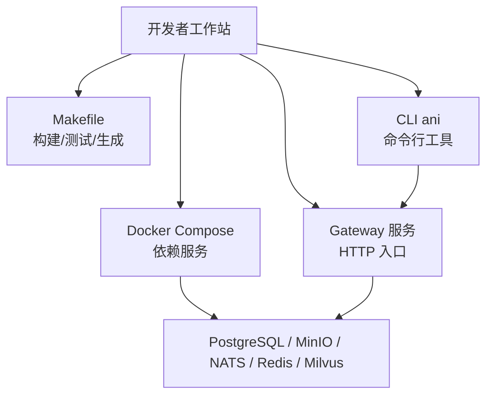
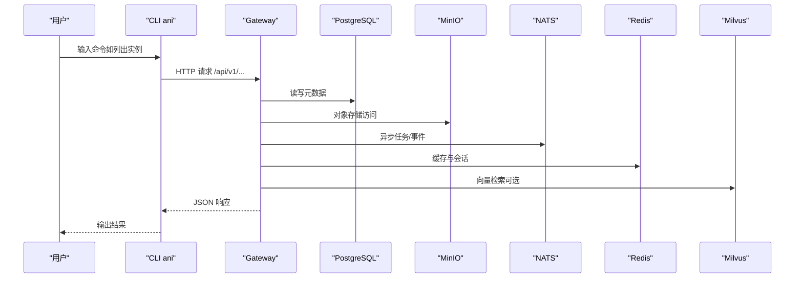
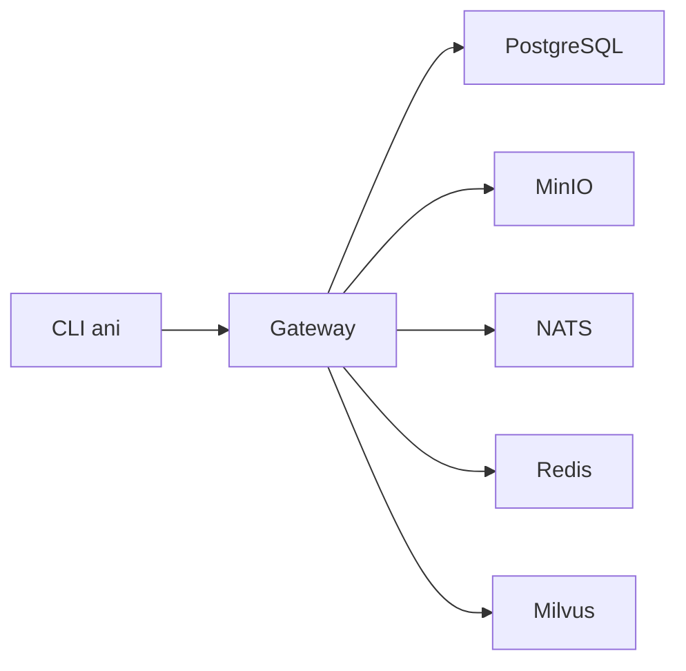

# 快速开始

<cite>
**本文引用的文件**
- [repo/README.md](file://repo/README.md)
- [repo/deploy/docker/README.md](file://repo/deploy/docker/README.md)
- [repo/deploy/docker/docker-compose.yml](file://repo/deploy/docker/docker-compose.yml)
- [repo/Makefile](file://repo/Makefile)
- [repo/go.work](file://repo/go.work)
- [repo/services/ani-gateway/main.go](file://repo/services/ani-gateway/main.go)
- [repo/cli/ani/main.go](file://repo/cli/ani/main.go)
- [repo/api/openapi/v1.yaml](file://repo/api/openapi/v1.yaml)
</cite>

## 目录
1. [简介](#简介)
2. [项目结构](#项目结构)
3. [核心组件](#核心组件)
4. [架构总览](#架构总览)
5. [详细组件分析](#详细组件分析)
6. [依赖关系分析](#依赖关系分析)
7. [性能与资源建议](#性能与资源建议)
8. [故障排查指南](#故障排查指南)
9. [结论](#结论)
10. [附录：常用命令速查](#附录：常用命令速查)

## 简介
本指南面向首次接触 ANI 平台的新用户，目标是帮助你在最短时间内完成开发环境搭建、启动本地服务、执行基本操作（部署实例、管理资源、调用 API），并给出常见问题定位方法。你将通过 Docker Compose 一键拉起数据库、对象存储、消息总线、缓存和向量数据库等依赖，再构建并运行 ANI Gateway 与 CLI，即可体验核心能力。

## 项目结构
ANI 采用 monorepo 组织方式，核心服务、CLI、前端、API 契约、部署配置与脚本统一在一个仓库中。本地开发推荐使用 Docker Compose 启动依赖服务，使用 Makefile 统一构建与测试入口。

**图示来源**
- [repo/deploy/docker/docker-compose.yml:1-184](file://repo/deploy/docker/docker-compose.yml#L1-L184)
- [repo/Makefile:167-186](file://repo/Makefile#L167-L186)
- [repo/services/ani-gateway/main.go:20-200](file://repo/services/ani-gateway/main.go#L20-L200)
- [repo/cli/ani/main.go:17-83](file://repo/cli/ani/main.go#L17-L83)

**章节来源**
- [repo/README.md:18-67](file://repo/README.md#L18-L67)
- [repo/deploy/docker/README.md:1-77](file://repo/deploy/docker/README.md#L1-L77)

## 核心组件
- 依赖服务：PostgreSQL、MinIO、NATS、Redis、Milvus（含 etcd）、可选 Dex（OIDC）与 Attu（Milvus UI）。
- Gateway：统一 HTTP 入口，负责路由到各运行时适配器（实例、网络、存储、镜像仓库、向量库、GPU 等）。
- CLI：轻量命令行客户端，默认连接 http://127.0.0.1:4010/api/v1，支持列举与管理 Core 资源。
- 代码生成与构建：Makefile 提供 deps、build、test、gen-* 等目标；go.work 聚合多模块。

**章节来源**
- [repo/deploy/docker/docker-compose.yml:16-175](file://repo/deploy/docker/docker-compose.yml#L16-L175)
- [repo/services/ani-gateway/main.go:20-200](file://repo/services/ani-gateway/main.go#L20-L200)
- [repo/cli/ani/main.go:17-83](file://repo/cli/ani/main.go#L17-L83)
- [repo/Makefile:167-280](file://repo/Makefile#L167-L280)
- [repo/go.work:1-21](file://repo/go.work#L1-L21)

## 架构总览
下图展示了本地开发模式下，CLI 与 Gateway 的交互以及 Gateway 对后端依赖的调用路径。

**图示来源**
- [repo/cli/ani/main.go:17-83](file://repo/cli/ani/main.go#L17-L83)
- [repo/services/ani-gateway/main.go:134-200](file://repo/services/ani-gateway/main.go#L134-L200)
- [repo/deploy/docker/docker-compose.yml:16-175](file://repo/deploy/docker/docker-compose.yml#L16-L175)

## 详细组件分析

### 本地依赖服务（Docker Compose）
- 启动所有依赖：make deps
- 查看状态：make deps-status
- 停止并保留数据：make deps-down
- 清理数据卷（危险）：make deps-clean
- 可选工具：
  - 启动 Milvus Attu：docker compose --profile tools up -d attu
  - 启动 Dex（OIDC）：docker compose --profile auth up -d dex

端口与服务说明：
- PostgreSQL：localhost:5432，账号 ani / ani_dev_password
- MinIO Console：http://localhost:9001，账号 ani-admin / ani_dev_password
- NATS Monitor：http://localhost:8222
- Redis：localhost:6379，密码 ani_dev_password
- Milvus：localhost:19530
- Milvus Attu：http://localhost:3000（需 tools profile）
- Dex：http://localhost:5556（需 auth profile）

环境变量：
- 复制 .env.example 为 .env 后按需修改，Compose 会自动加载。

**章节来源**
- [repo/deploy/docker/README.md:9-77](file://repo/deploy/docker/README.md#L9-L77)
- [repo/deploy/docker/docker-compose.yml:16-175](file://repo/deploy/docker/docker-compose.yml#L16-L175)
- [repo/Makefile:167-186](file://repo/Makefile#L167-L186)

### 构建与运行 Gateway
- 构建全部 Go 服务：make build
- 仅构建 Gateway：make build-gateway
- 构建产物位于 bin/ 目录下（例如 bin/ani-gateway）
- Gateway 启动后会注册路由并连接 Redis、存储、向量库、Kubernetes REST 客户端等运行时组件。

注意：
- 本地开发时，确保依赖服务已就绪后再启动 Gateway。
- Gateway 监听地址由环境变量控制，默认可通过 CLI 或浏览器访问。

**章节来源**
- [repo/Makefile:238-280](file://repo/Makefile#L238-L280)
- [repo/services/ani-gateway/main.go:20-200](file://repo/services/ani-gateway/main.go#L20-L200)

### CLI 工具与 API 调用
- CLI 默认 Base URL：http://127.0.0.1:4010/api/v1
- 可通过环境变量 ANI_BASE_URL 覆盖
- 认证：Bearer JWT 或 X-API-Key Header（通过 ANI_TOKEN 传入 token）
- 支持资源：instances、network-vpcs、volumes、objects、vector-stores、k8s-clusters、secrets、registry-projects 等
- 示例用法（以列举实例为例）：
  - 设置令牌与环境变量后执行：ani instances list
  - 指定分页：ani instances list --limit 20 --cursor <token>

OpenAPI 契约：
- Core API 定义在 api/openapi/v1.yaml，包含认证、错误格式、分页、异步任务等约定。

**章节来源**
- [repo/cli/ani/main.go:17-83](file://repo/cli/ani/main.go#L17-L83)
- [repo/cli/ani/main.go:109-200](file://repo/cli/ani/main.go#L109-L200)
- [repo/api/openapi/v1.yaml:1-39](file://repo/api/openapi/v1.yaml#L1-L39)

### 代码生成与文档
- 安装 Protobuf 插件：make tools-proto
- 从 OpenAPI 生成 Gateway 代码与 Console 类型：make gen-api
- 仅生成 Console TypeScript 类型：make gen-console-api
- 从 Protobuf 生成 gRPC 代码：make gen-proto
- 生成四语言 SDK Alpha：make gen-core-sdk
- 生成静态 API 文档：make gen-api-docs

**章节来源**
- [repo/Makefile:188-232](file://repo/Makefile#L188-L232)

## 依赖关系分析
- 服务耦合：Gateway 依赖多个运行时适配器（存储、网络、向量库、镜像仓库、Kubernetes REST 等），这些适配器通过环境变量注入。
- 外部依赖：PostgreSQL、MinIO、NATS、Redis、Milvus（etcd + milvus），可选 Dex（OIDC）。
- 构建依赖：Go 工作区 go.work 聚合多个模块，便于统一构建与测试。

**图示来源**
- [repo/services/ani-gateway/main.go:134-200](file://repo/services/ani-gateway/main.go#L134-L200)
- [repo/deploy/docker/docker-compose.yml:16-175](file://repo/deploy/docker/docker-compose.yml#L16-L175)
- [repo/go.work:1-21](file://repo/go.work#L1-L21)

**章节来源**
- [repo/go.work:1-21](file://repo/go.work#L1-L21)
- [repo/services/ani-gateway/main.go:134-200](file://repo/services/ani-gateway/main.go#L134-L200)

## 性能与资源建议
- 内存：建议 ≥ 8GB（Milvus 较吃内存）
- 磁盘：建议 ≥ 20GB（用于数据卷与镜像缓存）
- 并发与超时：Gateway 与各适配器具备超时与重试策略，建议在本地调试时合理设置超时以避免长耗时阻塞。
- 缓存：Redis 作为共享缓存与幂等键存储，避免重复计算与重复提交。

[本节为通用指导，不直接分析具体文件]

## 故障排查指南
- 依赖未就绪
  - 现象：Gateway 启动失败或 API 返回连接错误
  - 处理：确认 make deps 成功且依赖健康检查通过；使用 make deps-status 查看容器状态
- 端口冲突
  - 现象：无法绑定 5432/9000/9001/4222/6379/19530/8222/3000/5556
  - 处理：关闭占用端口的进程或调整 docker-compose 端口映射
- 认证失败
  - 现象：CLI 报 401/403
  - 处理：检查 ANI_TOKEN 是否正确；确认 Gateway 已启用 OIDC/Dex（如需）；核对 JWT 有效期与 scope
- 对象存储不可用
  - 现象：上传/下载失败
  - 处理：验证 MinIO 控制台可登录；检查 Bucket 是否初始化；确认凭据正确
- 向量库不可用
  - 现象：向量检索失败
  - 处理：确认 Milvus 与 etcd 健康；Attu 可辅助诊断集合与索引状态
- 清理与恢复
  - 停止并保留数据：make deps-down
  - 删除所有数据（危险）：make deps-clean

**章节来源**
- [repo/deploy/docker/docker-compose.yml:16-175](file://repo/deploy/docker/docker-compose.yml#L16-L175)
- [repo/deploy/docker/README.md:9-77](file://repo/deploy/docker/README.md#L9-L77)
- [repo/Makefile:167-186](file://repo/Makefile#L167-L186)

## 结论
通过 Docker Compose 启动依赖、Makefile 构建服务、CLI 调用 API，你可以在本地快速体验 ANI 平台的核心能力。建议按“依赖 → 构建 → 运行 → 调用”的顺序进行，遇到问题优先检查依赖健康与端口占用，再结合日志与工具（Attu、Dex）进行定位。

[本节为总结性内容，不直接分析具体文件]

## 附录：常用命令速查
- 启动依赖：make deps
- 查看依赖状态：make deps-status
- 停止依赖：make deps-down
- 清理数据：make deps-clean
- 构建全部：make build
- 仅构建 Gateway：make build-gateway
- 运行测试：make test
- 生成 API 代码：make gen-api
- 生成 SDK：make gen-core-sdk
- 生成 API 文档：make gen-api-docs
- 启动 Attu（可选）：docker compose --profile tools up -d attu
- 启动 Dex（可选）：docker compose --profile auth up -d dex
- CLI 列举实例：ani instances list
- CLI 列举网络 VPC：ani network-vpcs list
- CLI 列举对象：ani objects list
- CLI 列举向量库：ani vector-stores list

**章节来源**
- [repo/Makefile:167-280](file://repo/Makefile#L167-L280)
- [repo/deploy/docker/README.md:9-77](file://repo/deploy/docker/README.md#L9-L77)
- [repo/cli/ani/main.go:109-200](file://repo/cli/ani/main.go#L109-L200)