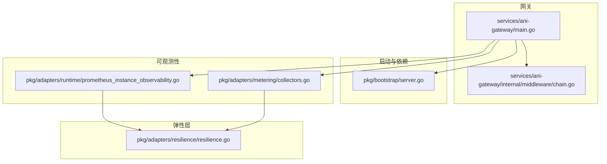
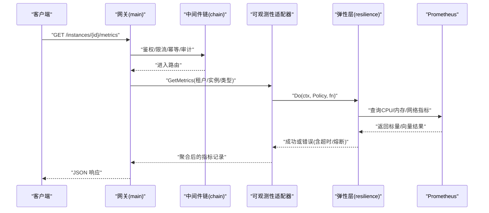
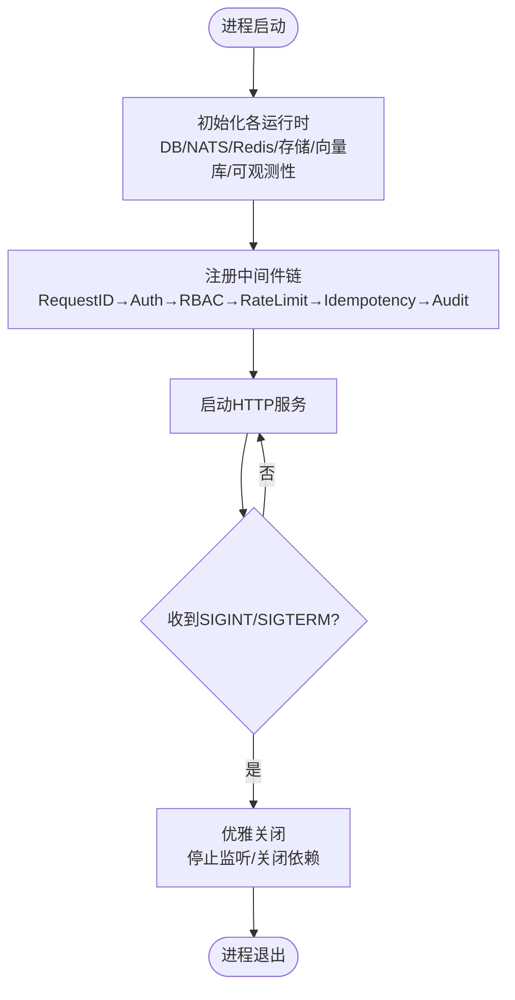
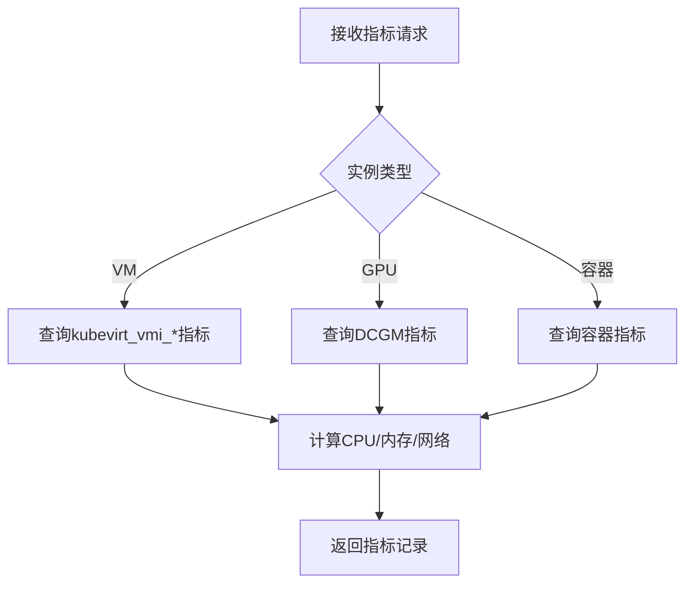
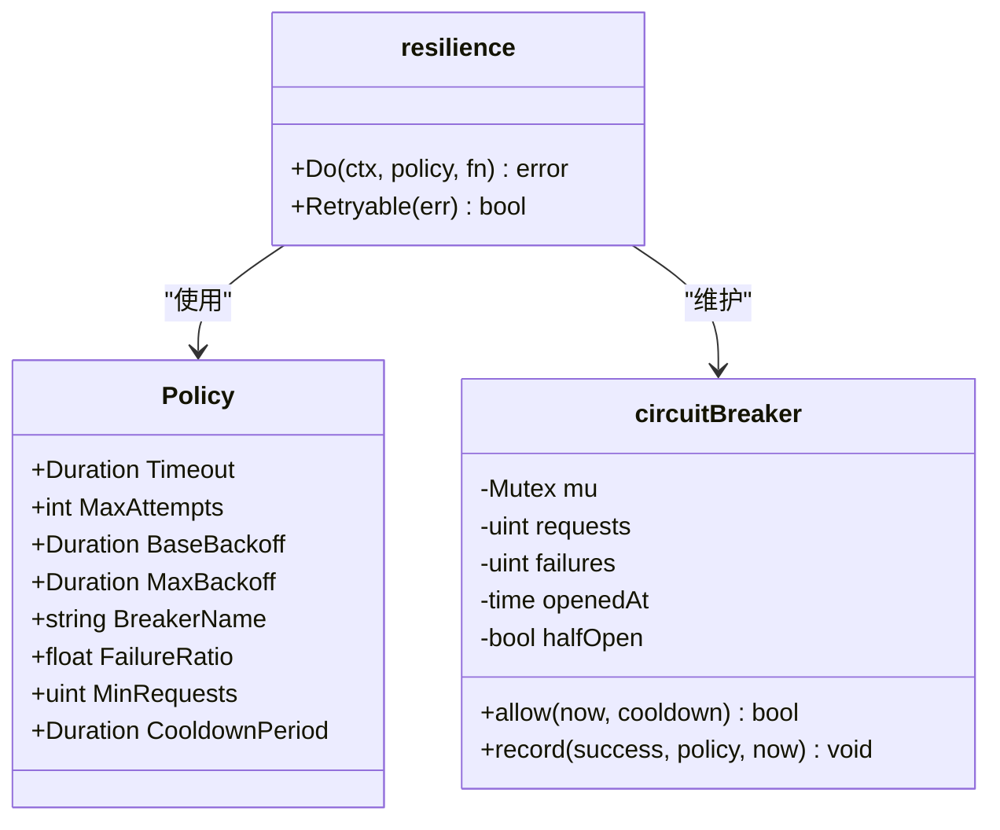
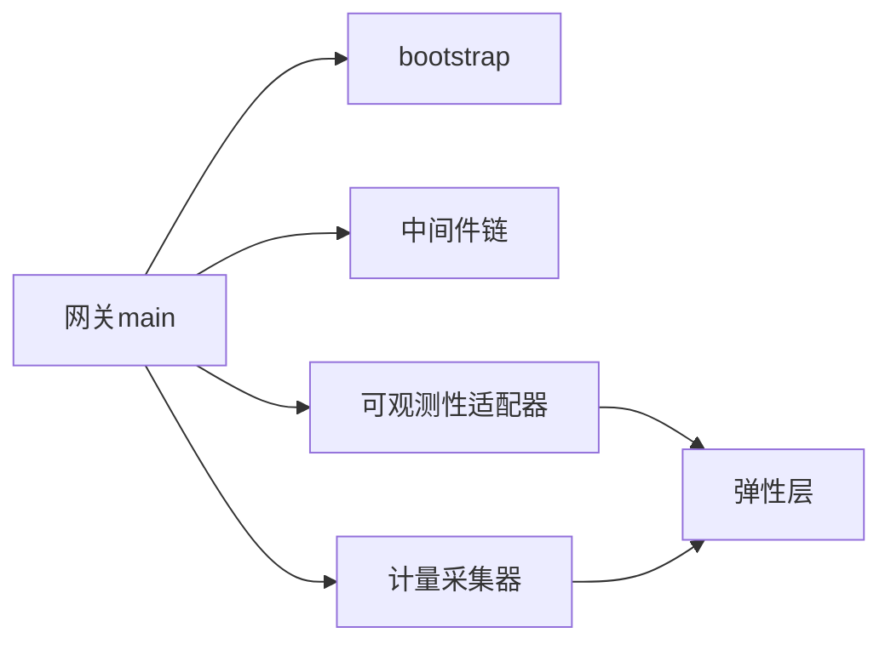

# 内存管理

<cite>
**本文引用的文件**
- [services/ani-gateway/main.go](file://repo/services/ani-gateway/main.go)
- [pkg/bootstrap/server.go](file://repo/pkg/bootstrap/server.go)
- [pkg/adapters/resilience/resilience.go](file://repo/pkg/adapters/resilience/resilience.go)
- [pkg/adapters/metering/collectors.go](file://repo/pkg/adapters/metering/collectors.go)
- [pkg/adapters/runtime/prometheus_instance_observability.go](file://repo/pkg/adapters/runtime/prometheus_instance_observability.go)
- [services/ani-gateway/internal/middleware/chain.go](file://repo/services/ani-gateway/internal/middleware/chain.go)
</cite>

## 目录
1. [简介](#简介)
2. [项目结构](#项目结构)
3. [核心组件](#核心组件)
4. [架构总览](#架构总览)
5. [详细组件分析](#详细组件分析)
6. [依赖关系分析](#依赖关系分析)
7. [性能与内存调优建议](#性能与内存调优建议)
8. [故障排查指南](#故障排查指南)
9. [结论](#结论)
10. [附录](#附录)

## 简介
本指南面向 Go 服务在平台中的内存管理与并发控制实践，结合仓库中网关、可观测性采集、弹性重试与熔断等实现，给出：
- GC 调优与环境变量策略（GOGC、GOMEMLIMIT）的落地建议
- 内存泄漏检测与预防方法（pprof、指标与告警）
- 并发优化（goroutine 池、channel 设计、同步原语选择）
- 内存使用监控与分析（Prometheus 指标、健康探针、告警配置）
- 常见内存问题的诊断与解决方案

## 项目结构
本项目采用多服务模块化组织，关键与内存/并发相关的代码集中在：
- 网关入口与中间件链：负责请求处理、限流、幂等、审计等
- 启动与依赖装配：数据库、NATS、Redis、gRPC、健康探针等
- 可观测性采集：Prometheus 指标查询、VM/GPU/容器资源使用率计算
- 弹性与超时：统一的重试、退避、熔断封装

**图表来源**
- [services/ani-gateway/main.go:20-221](file://repo/services/ani-gateway/main.go#L20-L221)
- [pkg/bootstrap/server.go:108-150](file://repo/pkg/bootstrap/server.go#L108-L150)
- [pkg/adapters/runtime/prometheus_instance_observability.go:250-324](file://repo/pkg/adapters/runtime/prometheus_instance_observability.go#L250-L324)
- [pkg/adapters/metering/collectors.go:241-266](file://repo/pkg/adapters/metering/collectors.go#L241-L266)
- [pkg/adapters/resilience/resilience.go:89-133](file://repo/pkg/adapters/resilience/resilience.go#L89-L133)

**章节来源**
- [services/ani-gateway/main.go:20-221](file://repo/services/ani-gateway/main.go#L20-L221)
- [pkg/bootstrap/server.go:108-150](file://repo/pkg/bootstrap/server.go#L108-L150)

## 核心组件
- 网关主流程：初始化各运行时（K8s、存储、镜像注册、实例运行时、向量库、可观测性等），注册中间件链并启动 HTTP 服务。
- 启动器与依赖：统一连接 DB/NATS/Redis，提供 gRPC 与健康探针，支持优雅关闭。
- 可观测性采集：通过 Prometheus 查询 VM/GPU/容器指标，计算 CPU/内存/网络使用量。
- 弹性层：统一的 Do 函数封装超时、重试、指数退避与熔断，保护外部调用。

**章节来源**
- [services/ani-gateway/main.go:20-221](file://repo/services/ani-gateway/main.go#L20-L221)
- [pkg/bootstrap/server.go:387-445](file://repo/pkg/bootstrap/server.go#L387-L445)
- [pkg/adapters/runtime/prometheus_instance_observability.go:250-324](file://repo/pkg/adapters/runtime/prometheus_instance_observability.go#L250-L324)
- [pkg/adapters/metering/collectors.go:241-266](file://repo/pkg/adapters/metering/collectors.go#L241-L266)
- [pkg/adapters/resilience/resilience.go:89-133](file://repo/pkg/adapters/resilience/resilience.go#L89-L133)

## 架构总览
下图展示一次“实例指标快照”请求从网关到可观测性采集再到外部系统的调用链，体现并发、超时与错误处理对内存的影响。

**图表来源**
- [services/ani-gateway/main.go:167-221](file://repo/services/ani-gateway/main.go#L167-L221)
- [services/ani-gateway/internal/middleware/chain.go:1-22](file://repo/services/ani-gateway/internal/middleware/chain.go#L1-L22)
- [pkg/adapters/runtime/prometheus_instance_observability.go:250-324](file://repo/pkg/adapters/runtime/prometheus_instance_observability.go#L250-L324)
- [pkg/adapters/resilience/resilience.go:89-133](file://repo/pkg/adapters/resilience/resilience.go#L89-L133)

## 详细组件分析

### 网关与中间件链
- 职责：组装运行时、注册中间件、启动 HTTP 服务、优雅关停。
- 内存要点：
  - 所有外部依赖（存储、向量库、K8s REST、NATS、Redis）需显式关闭，避免连接句柄与缓冲泄漏。
  - 中间件顺序固定，限流与幂等在早期阶段拦截无效请求，减少后续 goroutine 与对象分配。
  - 信号监听与 Shutdown 确保在退出时释放资源，降低重启期间的内存尖峰。

**图表来源**
- [services/ani-gateway/main.go:20-221](file://repo/services/ani-gateway/main.go#L20-L221)
- [services/ani-gateway/internal/middleware/chain.go:1-22](file://repo/services/ani-gateway/internal/middleware/chain.go#L1-L22)

**章节来源**
- [services/ani-gateway/main.go:20-221](file://repo/services/ani-gateway/main.go#L20-L221)
- [services/ani-gateway/internal/middleware/chain.go:1-22](file://repo/services/ani-gateway/internal/middleware/chain.go#L1-L22)

### 启动与依赖装配
- 职责：加载配置、连接 DB/NATS/Redis、构建能力适配层、启动 gRPC 与健康探针、优雅关停。
- 内存要点：
  - 健康探针独立 HTTP 服务器，避免与业务端口争用资源。
  - 所有依赖在 MustConnect 阶段失败即终止，防止半初始化状态导致资源泄漏。
  - 优雅关停时对探针与服务分别设置超时，避免阻塞退出。

**章节来源**
- [pkg/bootstrap/server.go:108-150](file://repo/pkg/bootstrap/server.go#L108-L150)
- [pkg/bootstrap/server.go:387-445](file://repo/pkg/bootstrap/server.go#L387-L445)

### 可观测性采集（VM/GPU/容器）
- 职责：根据实例类型查询 Prometheus，计算 CPU/内存/网络使用量；VM 分支使用 KubeVirt 指标，GPU 分支使用 DCGM 指标。
- 内存要点：
  - 指标查询使用瞬时查询，返回标量值，避免大结果集驻留内存。
  - 对 VM 内存使用率的计算遵循 PRD 公式，避免错误指标导致的误判与不必要的重算。
  - 错误路径不伪造零值，保持数据语义一致，减少下游补偿逻辑带来的额外分配。

**图表来源**
- [pkg/adapters/runtime/prometheus_instance_observability.go:250-324](file://repo/pkg/adapters/runtime/prometheus_instance_observability.go#L250-L324)

**章节来源**
- [pkg/adapters/runtime/prometheus_instance_observability.go:250-324](file://repo/pkg/adapters/runtime/prometheus_instance_observability.go#L250-L324)

### 计量采集器（CPU/Mem/GPU）
- 职责：按维度采集用量，CPU/Mem 通过 Prometheus 瞬时查询，GPU 基于持有时长计算。
- 内存要点：
  - HTTP 客户端默认超时，避免慢查询占用连接与缓冲。
  - 解析 Prometheus 响应时过滤 NaN/Inf，防止异常值引发后续计算放大。
  - 全局 collector 缓存使用读写锁保护，避免竞争导致的额外分配。

**章节来源**
- [pkg/adapters/metering/collectors.go:45-129](file://repo/pkg/adapters/metering/collectors.go#L45-L129)
- [pkg/adapters/metering/collectors.go:141-207](file://repo/pkg/adapters/metering/collectors.go#L141-L207)
- [pkg/adapters/metering/collectors.go:213-266](file://repo/pkg/adapters/metering/collectors.go#L213-L266)

### 弹性层（超时/重试/熔断）
- 职责：统一封装 Do，支持超时、最大尝试次数、指数退避、熔断（基于失败比例与最小请求数）。
- 内存要点：
  - 每次调用使用 context.WithTimeout，避免 goroutine 长期持有上下文与缓冲。
  - 退避使用 Timer 并在 ctx.Done 时及时释放，避免定时器泄漏。
  - 熔断器使用 sync.Map 与互斥锁，保证高并发下的低开销访问。

**图表来源**
- [pkg/adapters/resilience/resilience.go:13-22](file://repo/pkg/adapters/resilience/resilience.go#L13-L22)
- [pkg/adapters/resilience/resilience.go:89-133](file://repo/pkg/adapters/resilience/resilience.go#L89-L133)
- [pkg/adapters/resilience/resilience.go:166-223](file://repo/pkg/adapters/resilience/resilience.go#L166-L223)

**章节来源**
- [pkg/adapters/resilience/resilience.go:89-133](file://repo/pkg/adapters/resilience/resilience.go#L89-L133)
- [pkg/adapters/resilience/resilience.go:166-223](file://repo/pkg/adapters/resilience/resilience.go#L166-L223)

## 依赖关系分析
- 网关依赖 bootstrap 提供的依赖装配与运行期能力，依赖可观测性适配器与计量采集器进行指标与用量收集。
- 可观测性与计量均通过弹性层访问 Prometheus，确保外部调用具备超时、重试与熔断保护。
- 中间件链在网关入口处完成鉴权、限流、幂等与审计，减少无效请求对后端资源的消耗。

**图表来源**
- [services/ani-gateway/main.go:20-221](file://repo/services/ani-gateway/main.go#L20-L221)
- [pkg/bootstrap/server.go:108-150](file://repo/pkg/bootstrap/server.go#L108-L150)
- [pkg/adapters/runtime/prometheus_instance_observability.go:250-324](file://repo/pkg/adapters/runtime/prometheus_instance_observability.go#L250-L324)
- [pkg/adapters/metering/collectors.go:241-266](file://repo/pkg/adapters/metering/collectors.go#L241-L266)
- [pkg/adapters/resilience/resilience.go:89-133](file://repo/pkg/adapters/resilience/resilience.go#L89-L133)

**章节来源**
- [services/ani-gateway/main.go:20-221](file://repo/services/ani-gateway/main.go#L20-L221)
- [pkg/bootstrap/server.go:108-150](file://repo/pkg/bootstrap/server.go#L108-L150)

## 性能与内存调优建议
- GC 调优环境变量
  - GOGC：控制触发 GC 的堆增长阈值。建议在压测后根据 P95 延迟与吞吐调整，避免过频 GC 影响延迟，也避免过少 GC 导致堆膨胀。
  - GOMEMLIMIT：Go 1.21+ 引入的软内存上限，配合 GC 行为限制进程内存增长。建议设置为容器 limits 的 80%-90%，为系统预留空间。
  - GODEBUG：在问题定位阶段启用 memprofiler、gcpercent 等开关，观察 GC 行为与内存分配热点。
- 应用侧内存优化
  - 复用 http.Client 与连接池，避免频繁创建导致临时对象与句柄泄漏。
  - 对大对象（如指标结果、日志切片）尽量使用对象池或分块处理，减少堆分配峰值。
  - 合理设置超时与取消，避免 goroutine 泄漏与上下文滞留。
- 并发控制优化
  - goroutine 池：对批量任务（如指标采集、日志拉取）使用有界 worker pool，限制并发度，避免突发流量撑爆内存。
  - channel 设计：使用带缓冲 channel 控制背压，结合 select 与超时，避免阻塞堆积。
  - 同步原语：优先使用 context 取消与超时；需要共享状态时使用 sync.RWMutex 或 sync.Map，减少锁粒度与竞争。
- 指标与告警
  - 采集 Prometheus 指标：container_memory_working_set_bytes、kubevirt_vmi_memory_domain_bytes、DCGM_FI_DEV_FB_USED 等，用于评估内存使用趋势。
  - 告警规则：当进程 RSS 接近 GOMEMLIMIT 或 GC 频率异常升高时触发告警；当指标查询失败率上升时提示外部依赖异常。
  - 健康探针：利用 bootstrap 的健康探针暴露依赖状态，便于编排层快速发现异常。

[本节为通用指导，不直接分析具体文件]

## 故障排查指南
- 内存泄漏定位
  - 使用 pprof 的 heap/profile 抓取堆快照，对比不同时间点的分配热点，定位未释放的大对象或连接。
  - 使用 pprof 的 goroutine/profile 检查是否存在 goroutine 泄漏（如未关闭的 channel、未处理的 context）。
  - 结合 GC 日志与 GODEBUG=gcdetails=1 观察 GC 触发原因与停顿时间。
- 常见问题与解决
  - 指标查询慢导致 goroutine 堆积：检查弹性层超时与重试配置，必要时增加熔断阈值。
  - 大量小对象分配导致 GC 频繁：使用对象池或合并小对象，减少分配次数。
  - 外部依赖不可用时重试风暴：调整退避策略与熔断参数，避免雪崩。
- 监控与诊断
  - 通过健康探针与 Prometheus 指标观察服务状态与依赖健康度。
  - 对关键路径添加结构化日志与耗时统计，便于定位瓶颈。

**章节来源**
- [pkg/bootstrap/server.go:387-445](file://repo/pkg/bootstrap/server.go#L387-L445)
- [pkg/adapters/resilience/resilience.go:89-133](file://repo/pkg/adapters/resilience/resilience.go#L89-L133)
- [pkg/adapters/metering/collectors.go:141-207](file://repo/pkg/adapters/metering/collectors.go#L141-L207)

## 结论
本指南结合仓库中的网关、可观测性采集与弹性层实现，给出了 Go 服务的内存管理与并发控制最佳实践。通过合理的 GC 调优、严格的超时与取消、有界的并发与对象复用，以及完善的指标与告警体系，可以有效降低内存泄漏风险、提升稳定性与性能。建议在压测环境中持续验证参数与策略，并结合生产监控数据进行动态调整。

[本节为总结，不直接分析具体文件]

## 附录
- 相关实现参考路径
  - 网关主流程与中间件链：[services/ani-gateway/main.go](file://repo/services/ani-gateway/main.go)、[services/ani-gateway/internal/middleware/chain.go](file://repo/services/ani-gateway/internal/middleware/chain.go)
  - 启动与依赖装配：[pkg/bootstrap/server.go](file://repo/pkg/bootstrap/server.go)
  - 可观测性采集（VM/GPU/容器）：[pkg/adapters/runtime/prometheus_instance_observability.go](file://repo/pkg/adapters/runtime/prometheus_instance_observability.go)
  - 计量采集器（CPU/Mem/GPU）：[pkg/adapters/metering/collectors.go](file://repo/pkg/adapters/metering/collectors.go)
  - 弹性层（超时/重试/熔断）：[pkg/adapters/resilience/resilience.go](file://repo/pkg/adapters/resilience/resilience.go)

[本节为索引，不直接分析具体文件]