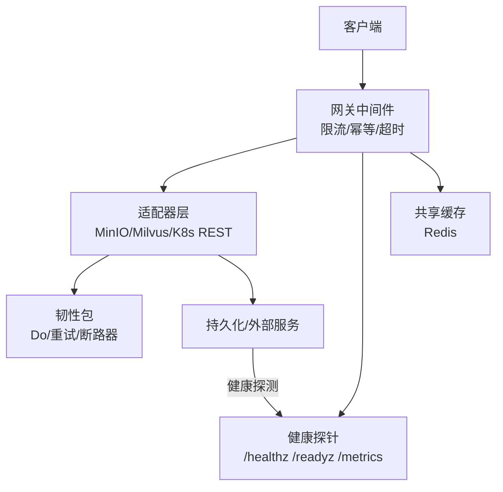
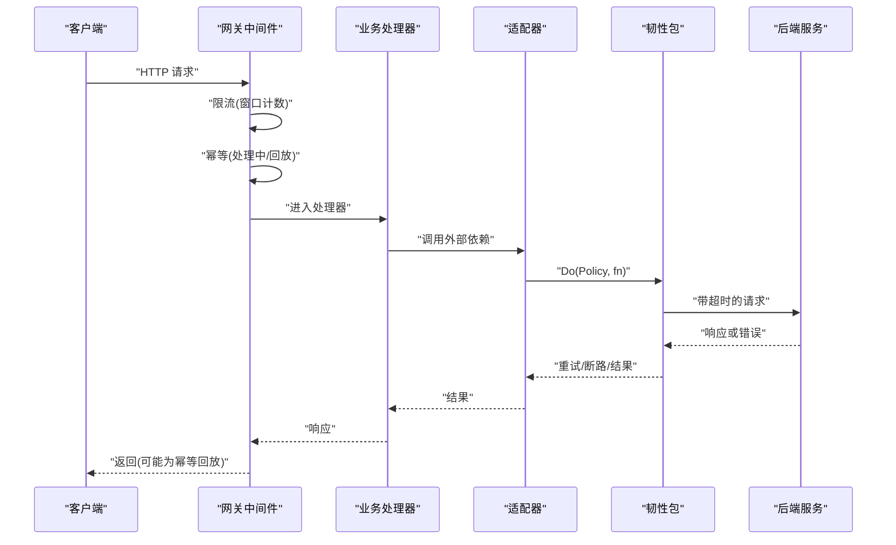
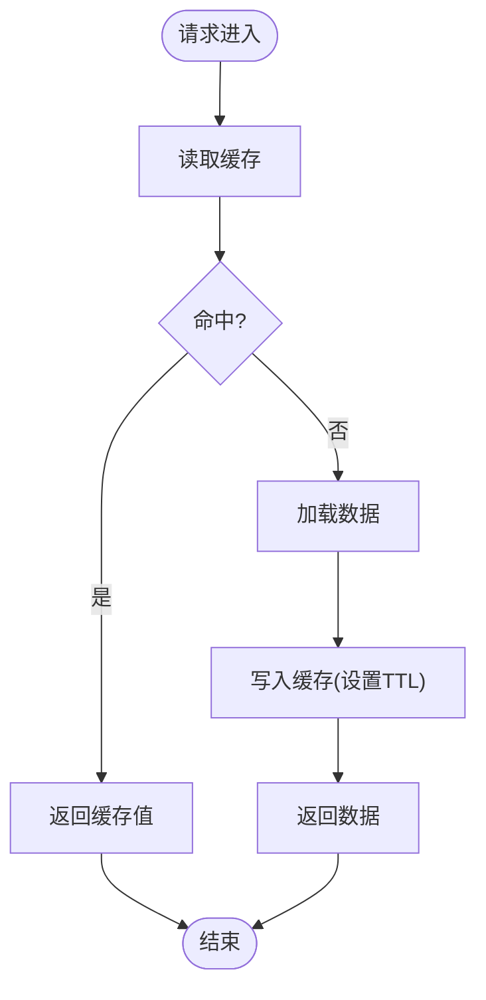
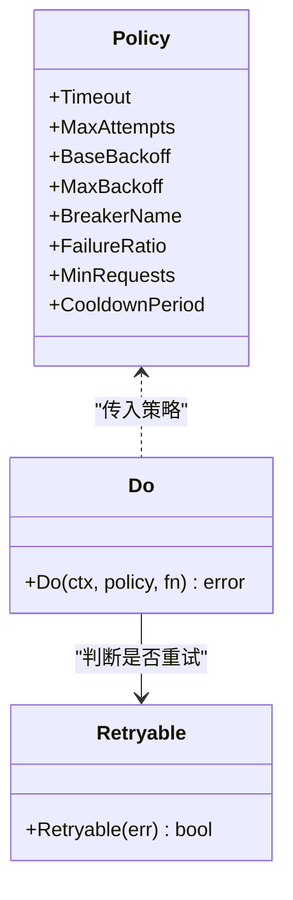
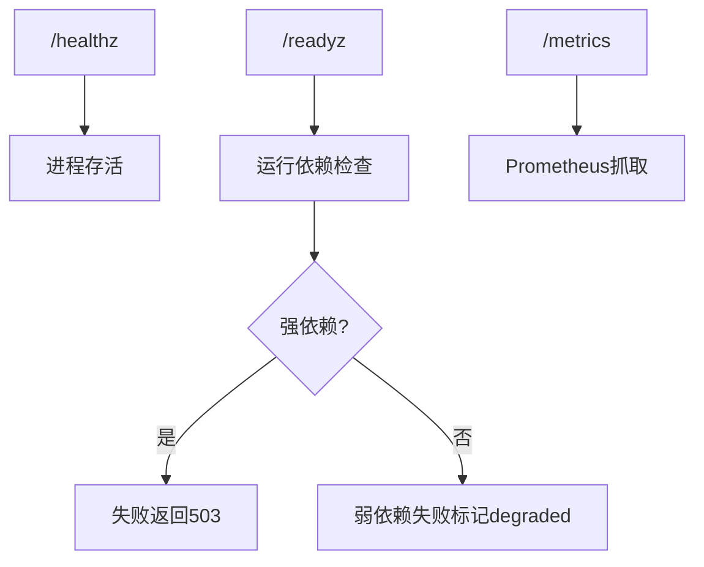
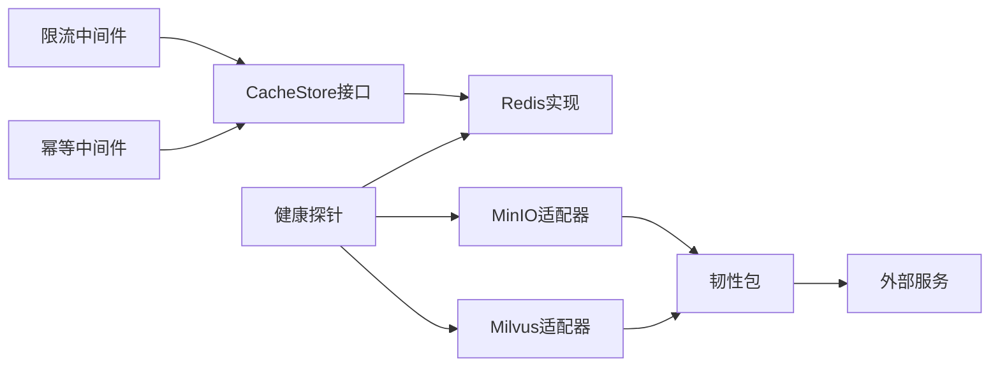

# 性能优化

<cite>
**本文引用的文件**
- [pkg/bootstrap/redis.go](file://repo/pkg/bootstrap/redis.go)
- [pkg/adapters/resilience/resilience.go](file://repo/pkg/adapters/resilience/resilience.go)
- [services/ani-gateway/internal/middleware/ratelimit.go](file://repo/services/ani-gateway/internal/middleware/ratelimit.go)
- [services/ani-gateway/internal/middleware/idempotency.go](file://repo/services/ani-gateway/internal/middleware/idempotency.go)
- [pkg/adapters/objectstore/minio_store.go](file://repo/pkg/adapters/objectstore/minio_store.go)
- [pkg/adapters/vectorstore/milvus_store.go](file://repo/pkg/adapters/vectorstore/milvus_store.go)
- [pkg/bootstrap/probes.go](file://repo/pkg/bootstrap/probes.go)
- [pkg/ports/cache_store.go](file://repo/pkg/ports/cache_store.go)
- [development-records/sprint14-core-resilience-plan.md](file://repo/development-records/sprint14-core-resilience-plan.md)
</cite>

## 目录
1. [简介](#简介)
2. [项目结构](#项目结构)
3. [核心组件](#核心组件)
4. [架构总览](#架构总览)
5. [详细组件分析](#详细组件分析)
6. [依赖关系分析](#依赖关系分析)
7. [性能考量](#性能考量)
8. [故障排查指南](#故障排查指南)
9. [结论](#结论)
10. [附录](#附录)

## 简介
本指南聚焦于生产级性能优化，围绕缓存策略、数据库查询优化、网络性能优化、内存与并发控制、以及监控指标采集展开。内容基于仓库中已实现的网关中间件、适配器韧性能力、Redis 接入与健康探测等代码事实，提供可落地的设计模式与最佳实践，帮助在现有系统上持续提升吞吐、降低延迟并增强稳定性。

## 项目结构
本项目采用分层与适配器模式：
- 网关层（ani-gateway）：承载 HTTP 横切关注点（限流、幂等、超时、健康）。
- 适配层（adapters）：封装外部依赖（对象存储、向量存储、Kubernetes REST），统一注入韧性策略（超时、重试、断路器、多端点回退）。
- 启动与探针（bootstrap）：负责 Redis 连接、数据面健康探测与 /metrics 暴露。
- 端口定义（ports）：抽象 CacheStore、ObjectStore、VectorStore 等接口，解耦实现细节。

**图示来源**
- [services/ani-gateway/internal/middleware/ratelimit.go:14-40](file://repo/services/ani-gateway/internal/middleware/ratelimit.go#L14-L40)
- [services/ani-gateway/internal/middleware/idempotency.go:31-125](file://repo/services/ani-gateway/internal/middleware/idempotency.go#L31-L125)
- [pkg/adapters/resilience/resilience.go:89-133](file://repo/pkg/adapters/resilience/resilience.go#L89-L133)
- [pkg/bootstrap/probes.go:37-57](file://repo/pkg/bootstrap/probes.go#L37-L57)
- [pkg/bootstrap/redis.go:27-64](file://repo/pkg/bootstrap/redis.go#L27-L64)

**章节来源**
- [development-records/sprint14-core-resilience-plan.md:192-201](file://repo/development-records/sprint14-core-resilience-plan.md#L192-L201)

## 核心组件
- 共享缓存接口与实现
  - 通过 ports.CacheStore 抽象 Get/Set/SetNX/Delete/Increment/Exists，供网关限流与幂等重放使用。
  - Redis 通过 bootstrap 连接 UniversalClient，支持单实例/Sentinel/Cluster 模式，并提供 Ping 验证。
- 网关中间件
  - 限流：按租户+方法+路由类别窗口计数，超限返回 429。
  - 幂等：对写操作请求进行响应重放，处理中重复请求返回 409，完成后缓存响应体并带回放头。
- 适配器韧性
  - 每调用超时、指数退避重试、命名断路器；错误分类区分可重试与不可重试。
  - MinIO/Milvus 支持端点列表与 LB/VIP，在网络错误、429、5xx 时尝试下一个端点。
- 健康与降级
  - readyz 聚合强/弱依赖健康检查，强依赖失败返回 503，弱依赖失败标记 degraded。
  - /metrics 暴露 reconcile 控制器基础指标。

**章节来源**
- [pkg/ports/cache_store.go:8-15](file://repo/pkg/ports/cache_store.go#L8-L15)
- [pkg/bootstrap/redis.go:15-64](file://repo/pkg/bootstrap/redis.go#L15-L64)
- [services/ani-gateway/internal/middleware/ratelimit.go:14-40](file://repo/services/ani-gateway/internal/middleware/ratelimit.go#L14-L40)
- [services/ani-gateway/internal/middleware/idempotency.go:31-125](file://repo/services/ani-gateway/internal/middleware/idempotency.go#L31-L125)
- [pkg/adapters/resilience/resilience.go:56-133](file://repo/pkg/adapters/resilience/resilience.go#L56-L133)
- [pkg/bootstrap/probes.go:37-57](file://repo/pkg/bootstrap/probes.go#L37-L57)

## 架构总览
下图展示一次写请求的完整链路：网关限流→幂等检测→业务处理→适配器调用→韧性包装（超时/重试/断路器）→后端服务；同时健康探针持续探测各依赖状态并输出 metrics。

**图示来源**
- [services/ani-gateway/internal/middleware/ratelimit.go:14-40](file://repo/services/ani-gateway/internal/middleware/ratelimit.go#L14-L40)
- [services/ani-gateway/internal/middleware/idempotency.go:31-125](file://repo/services/ani-gateway/internal/middleware/idempotency.go#L31-L125)
- [pkg/adapters/resilience/resilience.go:89-133](file://repo/pkg/adapters/resilience/resilience.go#L89-L133)

## 详细组件分析

### 缓存策略与 Redis 使用模式
- 共享缓存抽象
  - CacheStore 提供原子 Increment 用于限流窗口计数，SetNX 用于幂等哨兵，TTL 控制过期。
- Redis 连接与拓扑
  - 支持 URL 解析与显式 Addrs，模式包括 standalone/sentinel/cluster；连接前执行 Ping 校验。
- 热点数据处理建议
  - 热点键：结合 TTL 与分片键（如 tenant_id + route_class）避免单键竞争。
  - 读放大：对高频只读数据可引入本地二级缓存（需考虑一致性窗口与失效策略）。
  - 写放大：批量写入与合并更新，减少 Redis 往返。

**图示来源**
- [pkg/ports/cache_store.go:8-15](file://repo/pkg/ports/cache_store.go#L8-L15)
- [pkg/bootstrap/redis.go:27-64](file://repo/pkg/bootstrap/redis.go#L27-L64)
- [services/ani-gateway/internal/middleware/ratelimit.go:47-56](file://repo/services/ani-gateway/internal/middleware/ratelimit.go#L47-L56)
- [services/ani-gateway/internal/middleware/idempotency.go:79-124](file://repo/services/ani-gateway/internal/middleware/idempotency.go#L79-L124)

**章节来源**
- [pkg/bootstrap/redis.go:15-64](file://repo/pkg/bootstrap/redis.go#L15-L64)
- [services/ani-gateway/internal/middleware/ratelimit.go:47-56](file://repo/services/ani-gateway/internal/middleware/ratelimit.go#L47-L56)
- [services/ani-gateway/internal/middleware/idempotency.go:79-124](file://repo/services/ani-gateway/internal/middleware/idempotency.go#L79-L124)

### 数据库查询优化技巧
- 索引优化
  - 针对高频过滤字段建立复合索引；避免选择性低的列单独建索引。
  - 覆盖索引减少回表；定期分析慢查询日志调整索引。
- 查询计划分析
  - 使用 EXPLAIN/EXPLAIN ANALYZE 观察扫描方式与代价；避免全表扫描与隐式类型转换。
  - 分页查询使用游标或基于主键的范围查询替代 OFFSET 深翻页。
- 连接池配置
  - 根据并发与延迟目标设置最大连接数、空闲连接数、连接生命周期；监控连接等待与复用率。
  - 读写分离场景下，确保事务内读从库一致性与故障切换。

[本节为通用指导，不直接分析具体文件]

### 网络性能优化
- 负载均衡配置
  - 多端点配置：MinIO/Milvus 接受端点列表或 LB/VIP，并在网络错误、429、5xx 时尝试下一个端点。
  - Redis Sentinel/Cluster：通过 UniversalOptions 配置多节点与主从切换。
- 连接复用
  - 复用 http.Client 与底层连接池；合理设置 KeepAlive、IdleConnTimeout。
- 超时设置
  - 每调用超时：通过 resilience.Policy.Timeout 包裹外部调用，避免长尾阻塞。
  - 健康探测短超时：Health 调用轻量且快速失败，保障 readyz 准确性。

**图示来源**
- [pkg/adapters/resilience/resilience.go:13-22](file://repo/pkg/adapters/resilience/resilience.go#L13-L22)
- [pkg/adapters/resilience/resilience.go:56-133](file://repo/pkg/adapters/resilience/resilience.go#L56-L133)
- [pkg/adapters/objectstore/minio_store.go:31-58](file://repo/pkg/adapters/objectstore/minio_store.go#L31-L58)
- [pkg/adapters/vectorstore/milvus_store.go:26-67](file://repo/pkg/adapters/vectorstore/milvus_store.go#L26-L67)

**章节来源**
- [pkg/adapters/objectstore/minio_store.go:31-58](file://repo/pkg/adapters/objectstore/minio_store.go#L31-L58)
- [pkg/adapters/vectorstore/milvus_store.go:26-67](file://repo/pkg/adapters/vectorstore/milvus_store.go#L26-L67)
- [pkg/bootstrap/redis.go:80-124](file://repo/pkg/bootstrap/redis.go#L80-L124)

### 内存管理、GC 调优与并发控制
- 内存管理
  - 避免大对象频繁分配；复用缓冲与连接；及时释放 Body 与临时切片。
  - 对热点路径进行零拷贝优化（如字节切片复用）。
- GC 调优
  - 监控 GC 频率与停顿时间；在高吞吐场景适当增大堆大小以降低 GC 压力。
  - 避免全局大 map 长期持有；必要时使用 LRU 或分片 map。
- 并发控制
  - 使用 context 控制超时与取消；限制 goroutine 数量防止资源耗尽。
  - 对共享状态加锁或使用无锁数据结构；避免锁竞争热点。

[本节为通用指导，不直接分析具体文件]

### 监控指标定义与采集
- 健康探针
  - /healthz：进程存活。
  - /readyz：依赖健康聚合，强依赖失败返回 503，弱依赖失败标记 degraded。
  - /metrics：Prometheus 格式的基础 reconcile 指标。
- 指标项
  - 工作负载 reconcile 次数、成功/失败计数、因退避跳过的次数。
- 采集方法
  - 通过 Prometheus 抓取 /metrics；结合 K8s ServiceMonitor 或 PodMonitor 自动发现。

**图示来源**
- [pkg/bootstrap/probes.go:37-57](file://repo/pkg/bootstrap/probes.go#L37-L57)
- [pkg/bootstrap/probes.go:102-136](file://repo/pkg/bootstrap/probes.go#L102-L136)
- [pkg/bootstrap/probes.go:69-87](file://repo/pkg/bootstrap/probes.go#L69-L87)

**章节来源**
- [pkg/bootstrap/probes.go:37-57](file://repo/pkg/bootstrap/probes.go#L37-L57)
- [pkg/bootstrap/probes.go:69-87](file://repo/pkg/bootstrap/probes.go#L69-L87)

## 依赖关系分析
- 网关中间件依赖共享缓存接口，实际由 Redis 实现；限流与幂等共用同一 store。
- 适配器通过韧性包统一注入超时、重试与断路器；MinIO/Milvus 支持多端点回退。
- 健康探针聚合 Postgres/NATS/Redis/ObjectStore/VectorStore 健康状态，决定 readyz 返回值。

**图示来源**
- [services/ani-gateway/internal/middleware/ratelimit.go:14-40](file://repo/services/ani-gateway/internal/middleware/ratelimit.go#L14-L40)
- [services/ani-gateway/internal/middleware/idempotency.go:31-125](file://repo/services/ani-gateway/internal/middleware/idempotency.go#L31-L125)
- [pkg/adapters/resilience/resilience.go:89-133](file://repo/pkg/adapters/resilience/resilience.go#L89-L133)
- [pkg/bootstrap/probes.go:144-200](file://repo/pkg/bootstrap/probes.go#L144-L200)

**章节来源**
- [pkg/bootstrap/probes.go:144-200](file://repo/pkg/bootstrap/probes.go#L144-L200)

## 性能考量
- 缓存策略
  - 使用 TTL 控制过期；热点键分片；读多写少场景优先缓存。
  - 幂等重放减少重复副作用与后端压力。
- 数据库
  - 索引与查询计划优化；连接池参数与监控；避免深翻页。
- 网络
  - 多端点回退与断路器保护；每调用超时避免雪崩；连接复用降低握手开销。
- 内存与并发
  - 控制对象生命周期；合理堆大小；限制并发度与锁粒度。
- 监控
  - 健康探针与 metrics 采集；结合告警阈值识别退化与瓶颈。

[本节为综合建议，不直接分析具体文件]

## 故障排查指南
- 限流异常
  - 检查共享 store 可用性；确认租户上下文与公共路径放行逻辑。
  - 若 store 不可用，中间件返回 503 并记录错误码。
- 幂等冲突
  - 指纹不一致返回 409；处理中重复请求返回 409；已完成请求直接回放。
- 适配器超时与重试
  - 通过 resilience.Do 的 Timeout 与 MaxAttempts 控制；错误分类决定是否重试。
- 健康探针
  - readyz 返回 fail/degraded 时，查看对应依赖的错误信息；弱依赖降级不影响整体可用。

**章节来源**
- [services/ani-gateway/internal/middleware/ratelimit.go:27-36](file://repo/services/ani-gateway/internal/middleware/ratelimit.go#L27-L36)
- [services/ani-gateway/internal/middleware/idempotency.go:49-98](file://repo/services/ani-gateway/internal/middleware/idempotency.go#L49-L98)
- [pkg/adapters/resilience/resilience.go:56-133](file://repo/pkg/adapters/resilience/resilience.go#L56-L133)
- [pkg/bootstrap/probes.go:102-136](file://repo/pkg/bootstrap/probes.go#L102-L136)

## 结论
本指南基于仓库中已实现的网关中间件、适配器韧性与健康探针，提供了缓存、数据库、网络、内存与并发、监控等方面的优化建议。建议在现有基础上继续完善：
- 将更多适配器接入统一的韧性策略与多端点回退。
- 完善数据库索引与查询计划优化流程。
- 强化监控告警与压测验证，确保生产就绪。

[本节为总结性内容，不直接分析具体文件]

## 附录
- 关键配置与环境变量
  - 网关限流：GATEWAY_RATE_LIMIT_REQUESTS、GATEWAY_RATE_LIMIT_WINDOW。
  - 适配器超时：KUBERNETES_REQUEST_TIMEOUT、OBJECT_STORE_REQUEST_TIMEOUT、VECTOR_STORE_REQUEST_TIMEOUT。
  - Redis 模式：URL 或 Addrs + Mode（standalone/sentinel/cluster）。
- 参考实现路径
  - 限流中间件：services/ani-gateway/internal/middleware/ratelimit.go
  - 幂等中间件：services/ani-gateway/internal/middleware/idempotency.go
  - 韧性包：pkg/adapters/resilience/resilience.go
  - Redis 连接：pkg/bootstrap/redis.go
  - 健康探针：pkg/bootstrap/probes.go

**章节来源**
- [services/ani-gateway/internal/middleware/ratelimit.go:58-72](file://repo/services/ani-gateway/internal/middleware/ratelimit.go#L58-L72)
- [development-records/sprint14-core-resilience-plan.md:331-358](file://repo/development-records/sprint14-core-resilience-plan.md#L331-L358)
- [pkg/bootstrap/redis.go:80-124](file://repo/pkg/bootstrap/redis.go#L80-L124)