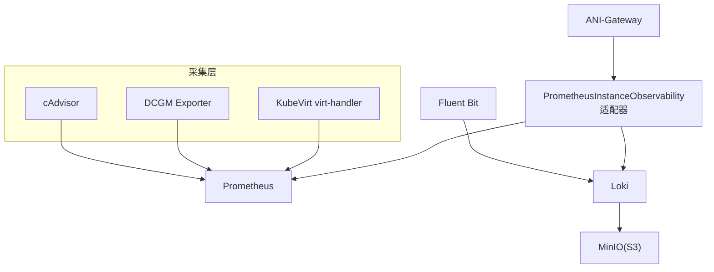
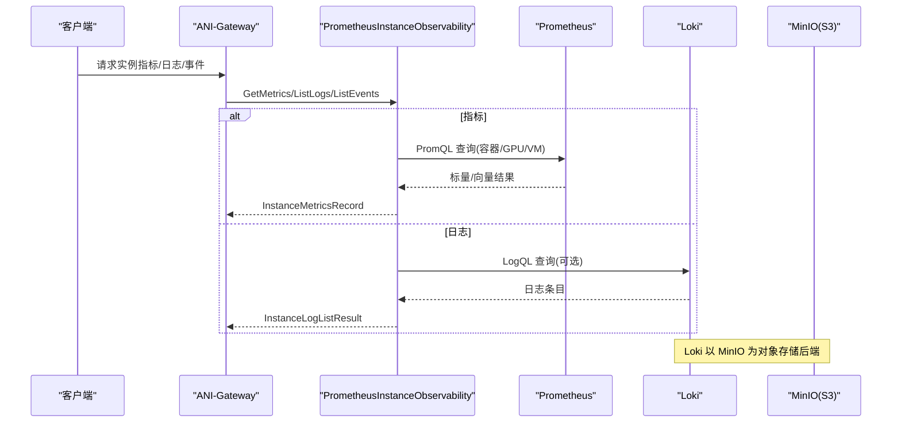
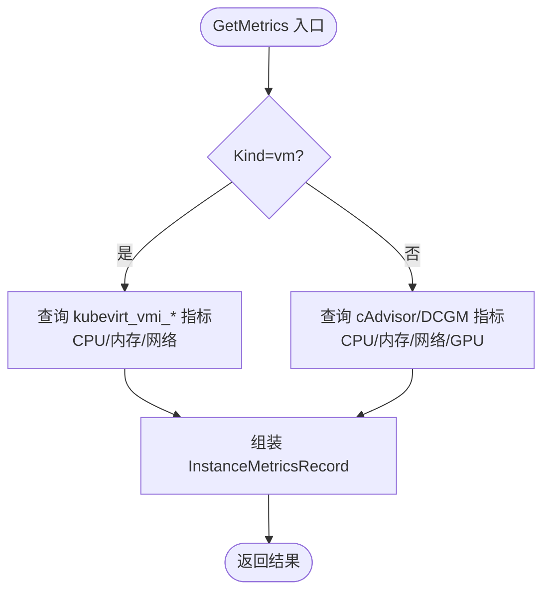
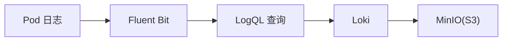
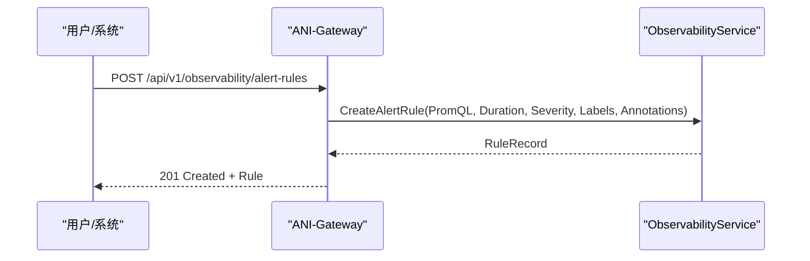
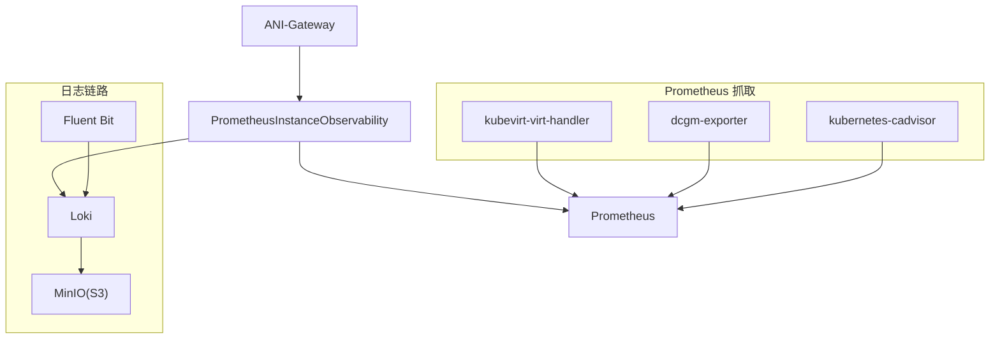

# 性能监控

<cite>
**本文引用的文件**
- [prometheus_instance_observability.go](file://repo/pkg/adapters/runtime/prometheus_instance_observability.go)
- [sprint13-instance-observability-prometheus-live.yaml](file://repo/deploy/real-k8s-lab/sprint13-instance-observability-prometheus-live.yaml)
- [sprint13-instance-observability-loki-live.yaml](file://repo/deploy/real-k8s-lab/sprint13-instance-observability-loki-live.yaml)
- [40-dcgm-observability-contract.yaml](file://repo/deploy/manifests/m1-infra-e/40-dcgm-observability-contract.yaml)
- [observability.go](file://repo/services/ani-gateway/internal/router/observability.go)
- [instances.go](file://repo/services/ani-gateway/internal/router/instances.go)
- [test_backend_apis.py](file://repo/scripts/test_backend_apis.py)
- [issue-008-prometheus-kubevirt-scrape.md](file://repo/services/tasks/modules/issue/console/compute/instance-observability-completion/issue-008-prometheus-kubevirt-scrape.md)
- [instance-observability-completion-b2-prometheus-dcgm-scrape.md](file://repo/development-records/instance-observability-completion-b2-prometheus-dcgm-scrape.md)
- [spec-console-instance-observability-completion.md](file://repo/services/tasks/modules/spec/console/compute/spec-console-instance-observability-completion.md)
</cite>

## 目录
1. [简介](#简介)
2. [项目结构](#项目结构)
3. [核心组件](#核心组件)
4. [架构总览](#架构总览)
5. [详细组件分析](#详细组件分析)
6. [依赖关系分析](#依赖关系分析)
7. [性能考量](#性能考量)
8. [故障排查指南](#故障排查指南)
9. [结论](#结论)
10. [附录](#附录)

## 简介
本指南面向平台与运维团队，系统化说明 ANI 平台的性能监控方案：关键指标定义与采集、Prometheus 集成与数据存储、告警规则配置方法、性能基准测试策略以及问题诊断与调试技巧。内容基于仓库中已实现的实例可观测性适配器、Prometheus/Loki 部署清单、网关路由与接口契约等真实代码与配置进行梳理，确保可操作性与落地性。

## 项目结构
与性能监控直接相关的代码与配置分布在以下位置：
- 指标采集与聚合：运行时适配器通过 Prometheus 查询容器、GPU（DCGM）与 VM（KubeVirt）指标，并统一封装为实例指标记录。
- 日志采集与存储：Fluent Bit 采集 Pod 日志写入 Loki；Loki 以 S3（MinIO）为后端，支持保留期与索引压缩。
- 服务暴露与查询：ANI-Gateway 提供可观测性查询与告警规则管理接口，内部路由到本地或远程适配器。
- 部署与抓取：Prometheus 抓取 cAdvisor、DCGM Exporter、KubeVirt virt-handler；Loki 单副本示例部署。

图表来源
- [prometheus_instance_observability.go:155-324](file://repo/pkg/adapters/runtime/prometheus_instance_observability.go#L155-L324)
- [sprint13-instance-observability-prometheus-live.yaml:57-103](file://repo/deploy/real-k8s-lab/sprint13-instance-observability-prometheus-live.yaml#L57-L103)
- [sprint13-instance-observability-loki-live.yaml:341-416](file://repo/deploy/real-k8s-lab/sprint13-instance-observability-loki-live.yaml#L341-L416)

章节来源
- [prometheus_instance_observability.go:155-324](file://repo/pkg/adapters/runtime/prometheus_instance_observability.go#L155-L324)
- [sprint13-instance-observability-prometheus-live.yaml:57-103](file://repo/deploy/real-k8s-lab/sprint13-instance-observability-prometheus-live.yaml#L57-L103)
- [sprint13-instance-observability-loki-live.yaml:341-416](file://repo/deploy/real-k8s-lab/sprint13-instance-observability-loki-live.yaml#L341-L416)

## 核心组件
- 指标采集适配器：PrometheusInstanceObservability 负责按实例维度聚合 CPU、内存、网络、GPU 利用率与显存、VM guest OS 资源使用，并对缺失值做降级处理。
- 日志持久化：可选注入 LogStore（如 Loki），未注入时回退至 K8s Pod 日志 API，保证零回归。
- 可观测性网关：提供指标查询、事件/安全事件列表、日志分页、执行/控制台会话创建等能力，并在响应中附带开发模式信息。
- 告警规则管理：网关暴露告警规则的增删改查接口，支持 PromQL、持续时间、严重级别、标签与注解。

章节来源
- [prometheus_instance_observability.go:19-86](file://repo/pkg/adapters/runtime/prometheus_instance_observability.go#L19-L86)
- [prometheus_instance_observability.go:88-153](file://repo/pkg/adapters/runtime/prometheus_instance_observability.go#L88-L153)
- [observability.go:72-86](file://repo/services/ani-gateway/internal/router/observability.go#L72-L86)
- [observability.go:156-254](file://repo/services/ani-gateway/internal/router/observability.go#L156-L254)

## 架构总览
下图展示从采集端到查询端的完整链路：Prometheus 抓取三类数据源，适配器将结果标准化；日志经 Fluent Bit 入 Loki 并落盘 MinIO；Gateway 对外暴露统一接口。

图表来源
- [prometheus_instance_observability.go:155-324](file://repo/pkg/adapters/runtime/prometheus_instance_observability.go#L155-L324)
- [sprint13-instance-observability-loki-live.yaml:127-138](file://repo/deploy/real-k8s-lab/sprint13-instance-observability-loki-live.yaml#L127-L138)

## 详细组件分析

### 指标采集与聚合（PrometheusInstanceObservability）
- 指标范围
  - 容器：CPU 使用率、工作集内存、内存 limit、网络收发字节。
  - GPU：DCGM 导出器提供的 GPU 利用率、显存 used/free/total。
  - VM：KubeVirt virt-handler 的 kubevirt_vmi_* 指标，包含 CPU 速率、驻留内存、domain 内存总量与可用内存计算得到“已用”，以及网络收发速率。
- 容错与降级
  - 单个 exporter 不可用时不影响其他字段采集；缺失字段返回 nil，不伪造 0。
  - 对 NaN/Inf 值进行过滤，避免序列化异常。
- 匹配策略
  - 容器路径使用正则匹配 pod 名，兼容控制器生成的带 hash 后缀的 Pod。
  - VM 路径使用 name 精确匹配 VMI 名称。

图表来源
- [prometheus_instance_observability.go:155-324](file://repo/pkg/adapters/runtime/prometheus_instance_observability.go#L155-L324)

章节来源
- [prometheus_instance_observability.go:155-324](file://repo/pkg/adapters/runtime/prometheus_instance_observability.go#L155-L324)
- [prometheus_instance_observability.go:459-490](file://repo/pkg/adapters/runtime/prometheus_instance_observability.go#L459-L490)
- [prometheus_instance_observability.go:613-618](file://repo/pkg/adapters/runtime/prometheus_instance_observability.go#L613-L618)

### 日志采集与存储（Loki + Fluent Bit）
- 采集：Fluent Bit DaemonSet 每节点采集 /var/log/pods/*，解析 CRI 日志并提取 namespace/pod/container 作为 label。
- 存储：Loki 以 TSDB + S3（MinIO）为后端，启用 retention 清理，支持高吞吐与低成本归档。
- 访问：适配器支持注入 LogStore（Loki），否则回退到 K8s Pod 日志 API。

图表来源
- [sprint13-instance-observability-loki-live.yaml:341-416](file://repo/deploy/real-k8s-lab/sprint13-instance-observability-loki-live.yaml#L341-L416)
- [sprint13-instance-observability-loki-live.yaml:127-145](file://repo/deploy/real-k8s-lab/sprint13-instance-observability-loki-live.yaml#L127-L145)

章节来源
- [sprint13-instance-observability-loki-live.yaml:341-416](file://repo/deploy/real-k8s-lab/sprint13-instance-observability-loki-live.yaml#L341-L416)
- [prometheus_instance_observability.go:88-140](file://repo/pkg/adapters/runtime/prometheus_instance_observability.go#L88-L140)

### 可观测性网关与告警规则
- 指标/日志/事件：Gateway 路由到适配器，返回结构化结果与开发模式信息。
- 告警规则：提供 REST 接口创建/更新/删除/列举告警规则，支持 PromQL、持续时间、严重级别、标签与注解。

图表来源
- [observability.go:156-183](file://repo/services/ani-gateway/internal/router/observability.go#L156-L183)
- [observability.go:293-329](file://repo/services/ani-gateway/internal/router/observability.go#L293-L329)

章节来源
- [observability.go:72-86](file://repo/services/ani-gateway/internal/router/observability.go#L72-L86)
- [observability.go:156-254](file://repo/services/ani-gateway/internal/router/observability.go#L156-L254)
- [instances.go:579-601](file://repo/services/ani-gateway/internal/router/instances.go#L579-L601)

## 依赖关系分析
- 指标数据源
  - cAdvisor：节点与容器指标，RBAC 允许读取 nodes/metrics 与 /metrics/cadvisor。
  - DCGM Exporter：GPU 指标，静态目标指向 ani-system 命名空间 Service。
  - KubeVirt virt-handler：VM 指标，通过 kubernetes_sd_configs 发现 kubevirt 命名空间下特定标签与端口的 Pod。
- 日志数据源
  - Fluent Bit：DaemonSet 形式，需要 pods/pods/log/nodes/proxy 权限。
  - Loki：S3（MinIO）后端，需提前创建 bucket 并注入凭据。
- 网关依赖
  - 适配器：PrometheusInstanceObservability 与可选 LogStore。
  - 健康检查：脚本验证 Gateway 的 /healthz、/readyz 等端点。

图表来源
- [sprint13-instance-observability-prometheus-live.yaml:57-103](file://repo/deploy/real-k8s-lab/sprint13-instance-observability-prometheus-live.yaml#L57-L103)
- [sprint13-instance-observability-loki-live.yaml:274-324](file://repo/deploy/real-k8s-lab/sprint13-instance-observability-loki-live.yaml#L274-L324)
- [40-dcgm-observability-contract.yaml:10-18](file://repo/deploy/manifests/m1-infra-e/40-dcgm-observability-contract.yaml#L10-L18)

章节来源
- [sprint13-instance-observability-prometheus-live.yaml:57-103](file://repo/deploy/real-k8s-lab/sprint13-instance-observability-prometheus-live.yaml#L57-L103)
- [sprint13-instance-observability-loki-live.yaml:274-324](file://repo/deploy/real-k8s-lab/sprint13-instance-observability-loki-live.yaml#L274-L324)
- [40-dcgm-observability-contract.yaml:10-18](file://repo/deploy/manifests/m1-infra-e/40-dcgm-observability-contract.yaml#L10-L18)
- [test_backend_apis.py:165-178](file://repo/scripts/test_backend_apis.py#L165-L178)

## 性能考量
- 采集频率与窗口
  - Prometheus 全局 scrape_interval 与 evaluation_interval 设置为 5s，适合高频指标。
  - VM 与网络指标使用 rate(...[5m]) 计算瞬时速率，平衡精度与开销。
- 资源限制
  - Prometheus 与 Loki 均设置 requests/limits，避免资源争用影响业务。
  - Fluent Bit 每节点一份，限制 CPU/Memory，降低节点负载。
- 查询优化
  - 容器指标使用 sum() 聚合多 series，避免非确定性取值。
  - 日志查询使用 cursor 分页与 limit 上限，控制 Loki 压力。
- 可靠性
  - 单 exporter 失败不影响其他指标字段；NaN/Inf 被过滤。
  - 日志路径支持回退到 K8s Pod 日志 API，保障可用性。

章节来源
- [sprint13-instance-observability-prometheus-live.yaml:57-61](file://repo/deploy/real-k8s-lab/sprint13-instance-observability-prometheus-live.yaml#L57-L61)
- [prometheus_instance_observability.go:186-221](file://repo/pkg/adapters/runtime/prometheus_instance_observability.go#L186-L221)
- [prometheus_instance_observability.go:261-324](file://repo/pkg/adapters/runtime/prometheus_instance_observability.go#L261-L324)
- [prometheus_instance_observability.go:613-618](file://repo/pkg/adapters/runtime/prometheus_instance_observability.go#L613-L618)
- [sprint13-instance-observability-loki-live.yaml:140-145](file://repo/deploy/real-k8s-lab/sprint13-instance-observability-loki-live.yaml#L140-L145)

## 故障排查指南
- 指标无数据
  - 确认 Prometheus 抓取 job 是否生效（cAdvisor/DCGM/KubeVirt）。
  - 校验 RBAC 与 TLS 配置（bearer_token_file、insecure_skip_verify）。
  - 检查 PromQL 中的 namespace/pod 匹配是否正确（正则 vs 精确）。
- 日志不可见
  - 确认 Fluent Bit 已采集并成功写入 Loki（查看输出与错误日志）。
  - 校验 Loki S3 凭据与 bucket 是否存在，retention 是否过短。
  - 使用 LogQL 按 namespace/pod 标签查询，确认 label 注入正确。
- 网关健康
  - 使用脚本验证 /healthz、/readyz、/health、/ready 等端点。
- 常见错误定位
  - Prometheus 返回空结果或状态码异常：检查 query 与目标可达性。
  - NaN/Inf 导致序列化失败：适配器已过滤，若仍出现需检查上游指标。

章节来源
- [sprint13-instance-observability-prometheus-live.yaml:57-103](file://repo/deploy/real-k8s-lab/sprint13-instance-observability-prometheus-live.yaml#L57-L103)
- [sprint13-instance-observability-loki-live.yaml:127-145](file://repo/deploy/real-k8s-lab/sprint13-instance-observability-loki-live.yaml#L127-L145)
- [test_backend_apis.py:165-178](file://repo/scripts/test_backend_apis.py#L165-L178)
- [prometheus_instance_observability.go:459-490](file://repo/pkg/adapters/runtime/prometheus_instance_observability.go#L459-L490)

## 结论
本项目已实现覆盖容器、GPU 与 VM 的统一指标采集与日志持久化，并通过 Gateway 暴露稳定接口。Prometheus 与 Loki 的部署配置清晰、可维护，适配器具备良好降级与容错能力。建议在生产环境完善 Loki 高可用与 MinIO 持久化，结合告警规则与压测流程形成闭环的性能治理体系。

## 附录

### 关键性能指标定义与采集方法
- 响应时间：可通过 Gateway 健康端点与指标查询接口延迟评估；在压测中统计 P50/P95/P99。
- 吞吐量：Prometheus 抓取成功率与每秒查询数（QPS）；日志写入吞吐（Loki ingestion_rate_mb）。
- 错误率：Prometheus 查询失败比例、Loki 写入失败比例、Gateway 5xx 比例。
- 资源使用率：CPU 使用率（容器/VM）、内存使用率（工作集/domain 内存）、GPU 利用率与显存占用、网络 I/O。

章节来源
- [prometheus_instance_observability.go:186-221](file://repo/pkg/adapters/runtime/prometheus_instance_observability.go#L186-L221)
- [prometheus_instance_observability.go:261-324](file://repo/pkg/adapters/runtime/prometheus_instance_observability.go#L261-L324)
- [sprint13-instance-observability-loki-live.yaml:140-145](file://repo/deploy/real-k8s-lab/sprint13-instance-observability-loki-live.yaml#L140-L145)

### 监控系统架构（Prometheus 集成、指标收集、数据存储）
- 指标收集：cAdvisor、DCGM Exporter、KubeVirt virt-handler 三个 job。
- 数据存储：Prometheus TSDB（示例 emptyDir），Loki TSDB + MinIO 对象存储。
- 查询与可视化：Gateway 提供统一接口；PromQL/LogQL 用于灵活查询。

章节来源
- [sprint13-instance-observability-prometheus-live.yaml:57-103](file://repo/deploy/real-k8s-lab/sprint13-instance-observability-prometheus-live.yaml#L57-L103)
- [sprint13-instance-observability-loki-live.yaml:127-145](file://repo/deploy/real-k8s-lab/sprint13-instance-observability-loki-live.yaml#L127-L145)

### 告警规则配置（阈值、分级、通知）
- 阈值：基于 PromQL 表达式设定阈值（如 CPU 使用率 > 80% 持续 5 分钟）。
- 分级：severity 字段区分 warning/critical。
- 通知：对接外部通知渠道（邮件/IM/短信），由 Alertmanager 或自定义处理器实现。

章节来源
- [observability.go:72-86](file://repo/services/ani-gateway/internal/router/observability.go#L72-L86)
- [observability.go:156-183](file://repo/services/ani-gateway/internal/router/observability.go#L156-L183)
- [observability.go:293-329](file://repo/services/ani-gateway/internal/router/observability.go#L293-L329)

### 性能基准测试方法
- 负载测试：模拟并发请求调用 Gateway 指标/日志接口，观察 QPS、延迟与错误率。
- 压力测试：逐步增加负载直至瓶颈，关注 Prometheus/Loki 资源使用与 GC。
- 性能回归检测：在 CI 中运行健康检查与基础查询，对比基线指标。

章节来源
- [test_backend_apis.py:165-178](file://repo/scripts/test_backend_apis.py#L165-L178)

### 性能问题诊断工具与调试技巧
- 使用 PromQL 直接查询原始指标，验证抓取与标签。
- 使用 LogQL 按 namespace/pod 过滤日志，定位异常。
- 检查适配器日志与错误返回，确认降级逻辑是否生效。
- 利用健康端点快速判断服务就绪状态。

章节来源
- [prometheus_instance_observability.go:459-490](file://repo/pkg/adapters/runtime/prometheus_instance_observability.go#L459-L490)
- [sprint13-instance-observability-loki-live.yaml:341-416](file://repo/deploy/real-k8s-lab/sprint13-instance-observability-loki-live.yaml#L341-L416)
- [test_backend_apis.py:165-178](file://repo/scripts/test_backend_apis.py#L165-L178)