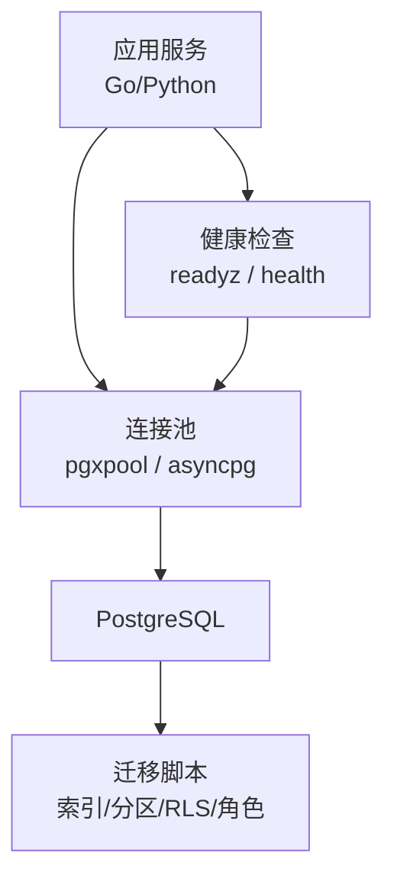
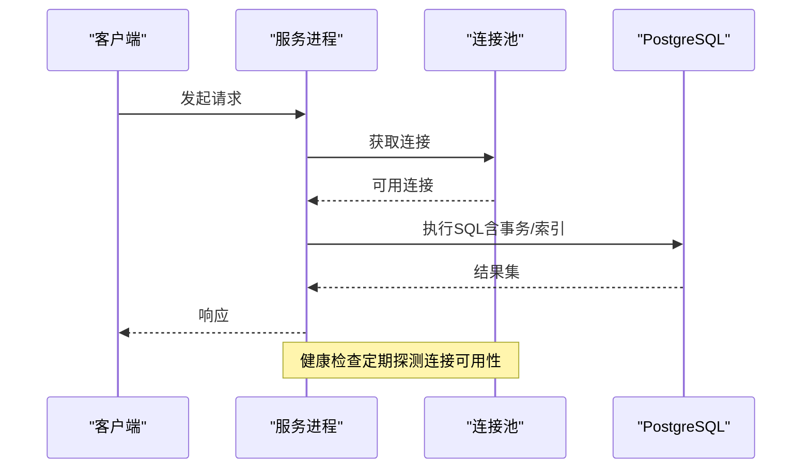
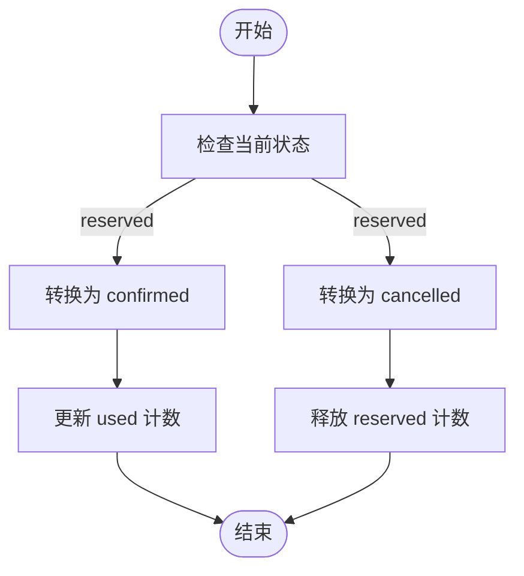
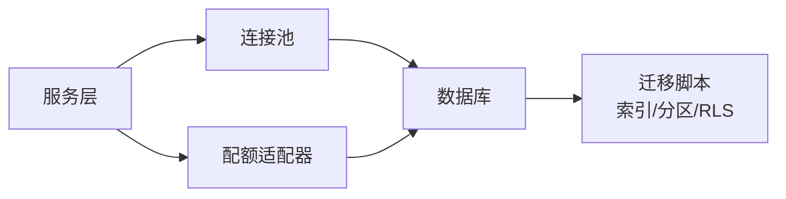

# 数据库优化

<cite>
**本文引用的文件**
- [repo/deploy/migrations/20260501_001_init_schema.sql](file://repo/deploy/migrations/20260501_001_init_schema.sql)
- [repo/deploy/migrations/20260731_001_metering_usage.sql](file://repo/deploy/migrations/20260731_001_metering_usage.sql)
- [repo/pkg/bootstrap/db.go](file://repo/pkg/bootstrap/db.go)
- [repo/services/kb-service/main.py](file://repo/services/kb-service/main.py)
- [repo/pkg/adapters/runtime/postgres_quota.go](file://repo/pkg/adapters/runtime/postgres_quota.go)
</cite>

## 目录
1. [简介](#简介)
2. [项目结构](#项目结构)
3. [核心组件](#核心组件)
4. [架构总览](#架构总览)
5. [详细组件分析](#详细组件分析)
6. [依赖关系分析](#依赖关系分析)
7. [性能考量](#性能考量)
8. [故障排查指南](#故障排查指南)
9. [结论](#结论)
10. [附录](#附录)

## 简介
本指南面向 ANI 平台的数据库优化，聚焦以下方面：索引设计与优化策略（复合索引、覆盖索引、索引维护）、查询优化技巧（执行计划分析、慢查询优化、连接池配置）、数据库连接管理（连接池大小、超时设置、健康检查）、事务优化（隔离级别选择、死锁预防），以及监控指标与性能调优工具使用方法。内容基于仓库中的迁移脚本、连接初始化代码、服务生命周期与健康检查实现，以及配额与并发控制逻辑进行提炼与总结。

## 项目结构
- 数据库结构与索引定义集中在迁移脚本中，涵盖租户、用户、模型、推理服务、知识库、异步任务、审计日志、计量等核心表，并配套行级安全策略与专用角色。
- Go 侧通过 pgxpool 初始化连接池，设置最小/最大连接数、连接生命周期、空闲时间与健康检查周期，并在启动时校验数据库版本。
- Python 侧 kb-service 使用 asyncpg 创建独立连接池，分别用于 gRPC 调用路径和 outbox 分发路径，并在 readyz 探针中报告 DB 池状态。
- 配额与并发控制通过 PostgresQuota 在事务内以原子更新与行锁串行化资源预占，避免超卖与悬挂预占。

图表来源
- [repo/pkg/bootstrap/db.go:14-52](file://repo/pkg/bootstrap/db.go#L14-L52)
- [repo/services/kb-service/main.py:63-80](file://repo/services/kb-service/main.py#L63-L80)
- [repo/deploy/migrations/20260501_001_init_schema.sql:12-27](file://repo/deploy/migrations/20260501_001_init_schema.sql#L12-L27)

章节来源
- [repo/deploy/migrations/20260501_001_init_schema.sql:1-658](file://repo/deploy/migrations/20260501_001_init_schema.sql#L1-L658)
- [repo/deploy/migrations/20260731_001_metering_usage.sql:1-53](file://repo/deploy/migrations/20260731_001_metering_usage.sql#L1-L53)
- [repo/pkg/bootstrap/db.go:14-65](file://repo/pkg/bootstrap/db.go#L14-L65)
- [repo/services/kb-service/main.py:63-233](file://repo/services/kb-service/main.py#L63-L233)

## 核心组件
- 连接池与启动校验：Go 侧使用 pgxpool 配置连接池参数与健康检查；启动时读取 server_version 验证连通性。
- 多事件循环连接池：Python 侧为 gRPC 与 outbox 分别创建 asyncpg 池，确保连接绑定到正确的事件循环。
- 健康检查：kb-service 的 /readyz 返回 db/outbox_db/grpc 等组件状态，便于编排层判断就绪。
- 配额与并发控制：PostgresQuota 在事务中使用原子 UPDATE + WHERE 条件与 FOR UPDATE 锁定，保证并发安全与幂等。

章节来源
- [repo/pkg/bootstrap/db.go:14-65](file://repo/pkg/bootstrap/db.go#L14-L65)
- [repo/services/kb-service/main.py:63-233](file://repo/services/kb-service/main.py#L63-L233)
- [repo/pkg/adapters/runtime/postgres_quota.go:49-178](file://repo/pkg/adapters/runtime/postgres_quota.go#L49-L178)

## 架构总览
下图展示从请求进入服务到数据库访问的关键路径，包括连接池、健康检查与事务处理。

图表来源
- [repo/pkg/bootstrap/db.go:14-52](file://repo/pkg/bootstrap/db.go#L14-L52)
- [repo/services/kb-service/main.py:213-233](file://repo/services/kb-service/main.py#L213-L233)

## 详细组件分析

### 索引设计与优化策略
- 复合索引
  - 按租户维度高频查询场景，建议优先建立 (tenant_id, created_at DESC) 或 (tenant_id, status) 等复合索引，减少回表并支持排序与过滤。
  - 示例参考：审计日志、推理审计日志、工作负载实例等表均包含 tenant_id 与时间列的复合索引，利于分页与时间范围扫描。
- 覆盖索引
  - 对只读聚合或列表接口，尽量将常用过滤列与排序列纳入索引，必要时包含必要字段以减少回表。例如 metering 相关表的 (tenant_id, resource_type, recorded_at)。
- 索引维护
  - 高写入表（如审计日志、推理审计日志）采用按月分区，配合定时任务维护新分区，降低锁竞争与维护成本。
  - 定期统计信息更新与索引重建需结合业务低峰期执行，避免影响在线查询。

章节来源
- [repo/deploy/migrations/20260501_001_init_schema.sql:254-281](file://repo/deploy/migrations/20260501_001_init_schema.sql#L254-L281)
- [repo/deploy/migrations/20260501_001_init_schema.sql:499-523](file://repo/deploy/migrations/20260501_001_init_schema.sql#L499-L523)
- [repo/deploy/migrations/20260731_001_metering_usage.sql:33-38](file://repo/deploy/migrations/20260731_001_metering_usage.sql#L33-L38)

### 查询优化技巧
- 执行计划分析
  - 针对慢查询使用 EXPLAIN/EXPLAIN ANALYZE 分析扫描方式、索引命中与代价估算，关注顺序扫描与回表比例。
  - 对大表分区查询，确认分区裁剪是否生效，避免全表扫描。
- 慢查询优化
  - 优先利用复合索引与覆盖索引；避免在索引列上使用函数或类型转换导致索引失效。
  - 分页查询使用 keyset 分页（基于唯一键或时间戳），避免深分页导致的性能退化。
- 连接池配置
  - Go 侧默认 MaxConns=20、MinConns=2、MaxConnLifetime=30min、MaxConnIdleTime=5min、HealthCheckPeriod=30s，适合中等并发场景；可根据 QPS 与延迟目标调整。
  - Python 侧 kb-service 为 gRPC 与 outbox 分别创建池，避免跨事件循环冲突，提升稳定性。

章节来源
- [repo/pkg/bootstrap/db.go:14-52](file://repo/pkg/bootstrap/db.go#L14-L52)
- [repo/services/kb-service/main.py:63-80](file://repo/services/kb-service/main.py#L63-L80)

### 数据库连接管理
- 连接池大小
  - 根据服务并发度与数据库 CPU/IO 能力设定 MaxConns；过高会导致上下文切换与锁竞争，过低则排队等待。
  - MinConns 保持一定预热连接，降低冷启动延迟。
- 超时设置
  - 连接建立与查询执行应设置合理超时，避免长尾阻塞；Go 侧启动时带 30s 超时重试。
- 健康检查
  - 启用 HealthCheckPeriod 定期探测连接可用性；服务就绪探针（/readyz）汇总 DB 池状态，供编排层决策。

章节来源
- [repo/pkg/bootstrap/db.go:14-52](file://repo/pkg/bootstrap/db.go#L14-L52)
- [repo/services/kb-service/main.py:213-233](file://repo/services/kb-service/main.py#L213-L233)

### 事务优化方案
- 隔离级别选择
  - 默认可考虑 READ COMMITTED；涉及复杂一致性要求时使用 SERIALIZABLE 或借助行锁与条件更新实现强一致。
- 死锁预防
  - 统一加锁顺序，避免交叉锁；使用 WHERE 条件与原子更新减少锁粒度；必要时使用 SELECT ... FOR UPDATE 显式锁定。
- 幂等与补偿
  - 配额流程通过状态机（reserved→confirmed/cancelled/released）与 WHERE state='...' 守卫实现幂等；失败时通过补偿动作清理中间态。

图表来源
- [repo/pkg/adapters/runtime/postgres_quota.go:193-330](file://repo/pkg/adapters/runtime/postgres_quota.go#L193-L330)

章节来源
- [repo/pkg/adapters/runtime/postgres_quota.go:49-178](file://repo/pkg/adapters/runtime/postgres_quota.go#L49-L178)
- [repo/pkg/adapters/runtime/postgres_quota.go:193-330](file://repo/pkg/adapters/runtime/postgres_quota.go#L193-L330)

### 监控指标与性能调优工具
- 监控指标
  - 连接池：活跃连接数、空闲连接数、等待队列长度、获取连接耗时。
  - 查询性能：QPS、P95/P99 延迟、慢查询数量、锁等待时间。
  - 资源使用：CPU、内存、磁盘 IO、网络带宽。
- 调优工具
  - PostgreSQL：pg_stat_statements、EXPLAIN/ANALYZE、pg_stat_activity、pg_locks。
  - 服务侧：Prometheus 指标导出、日志采样、链路追踪 ID（request_id）。
  - 健康检查：/health 与 /readyz 暴露组件状态，便于自动化巡检。

章节来源
- [repo/services/kb-service/main.py:213-233](file://repo/services/kb-service/main.py#L213-L233)

## 依赖关系分析
- 服务与数据库的耦合点主要在连接池初始化与 SQL 执行处；迁移脚本定义了表结构、索引、分区与 RLS 策略，是查询优化的基础。
- 配额模块依赖事务与行锁，确保并发安全；其方法对外暴露 Try/TryMany/Confirm/Cancel/Release 等接口，内部通过原子更新与状态守卫实现幂等。

图表来源
- [repo/pkg/bootstrap/db.go:14-52](file://repo/pkg/bootstrap/db.go#L14-L52)
- [repo/deploy/migrations/20260501_001_init_schema.sql:12-27](file://repo/deploy/migrations/20260501_001_init_schema.sql#L12-L27)
- [repo/pkg/adapters/runtime/postgres_quota.go:49-178](file://repo/pkg/adapters/runtime/postgres_quota.go#L49-L178)

章节来源
- [repo/pkg/bootstrap/db.go:14-65](file://repo/pkg/bootstrap/db.go#L14-L65)
- [repo/deploy/migrations/20260501_001_init_schema.sql:1-658](file://repo/deploy/migrations/20260501_001_init_schema.sql#L1-L658)
- [repo/pkg/adapters/runtime/postgres_quota.go:49-178](file://repo/pkg/adapters/runtime/postgres_quota.go#L49-L178)

## 性能考量
- 索引设计应围绕高频查询模式，优先使用复合索引与覆盖索引，减少回表与排序开销。
- 分区表适用于高写入量与时间序列数据，配合定时维护新分区，降低锁竞争。
- 连接池参数需与服务并发与数据库能力匹配，避免过度连接导致资源争用。
- 事务应尽量短小，减少锁持有时间；使用原子更新与状态守卫提高并发安全性。
- 健康检查与就绪探针有助于快速发现连接问题与降级状态。

## 故障排查指南
- 连接问题
  - 检查连接池配置与健康检查周期；查看服务 /readyz 输出中 db/outbox_db 状态。
  - 若连接建立失败，确认 DATABASE_URL 与网络可达性；观察启动时的重试日志。
- 慢查询
  - 使用 EXPLAIN/ANALYZE 分析执行计划；检查索引是否命中；关注分区裁剪是否生效。
  - 对大表查询限制返回行数，避免全表扫描。
- 死锁与锁等待
  - 使用 pg_locks 与 pg_stat_activity 定位锁持有者与等待者；调整加锁顺序与事务粒度。
- 配额异常
  - 检查资源配额元数据是否注册且 enabled；确认预占流水状态与幂等守卫；查看错误码映射。

章节来源
- [repo/services/kb-service/main.py:213-233](file://repo/services/kb-service/main.py#L213-L233)
- [repo/pkg/bootstrap/db.go:14-52](file://repo/pkg/bootstrap/db.go#L14-L52)
- [repo/pkg/adapters/runtime/postgres_quota.go:49-178](file://repo/pkg/adapters/runtime/postgres_quota.go#L49-L178)

## 结论
通过合理的索引设计、连接池配置、健康检查与事务优化，可以显著提升 ANI 平台数据库的性能与稳定性。迁移脚本提供了完善的表结构、索引与分区基础；Go 与 Python 侧的连接管理与就绪探针保障了服务的健壮性；配额模块展示了在高并发场景下的原子更新与幂等实践。建议持续监控关键指标，结合执行计划分析与分区维护，持续优化查询与事务路径。

## 附录
- 常见索引模式
  - 租户+时间：(tenant_id, created_at DESC)
  - 租户+状态：(tenant_id, status)
  - 计量查询：(tenant_id, resource_type, recorded_at)
- 分区策略
  - 审计日志与推理审计日志按月分区，定时创建新分区。
- 健康检查
  - /health 返回基本状态；/readyz 返回组件就绪情况，便于编排层决策。