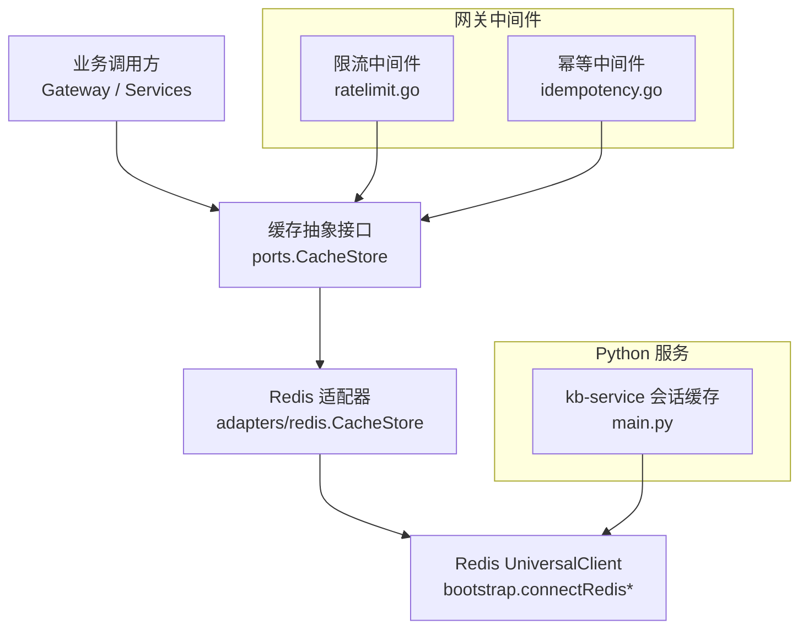
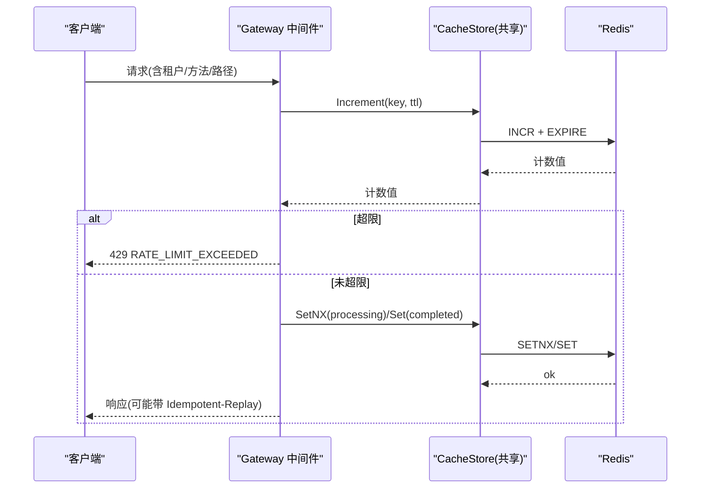
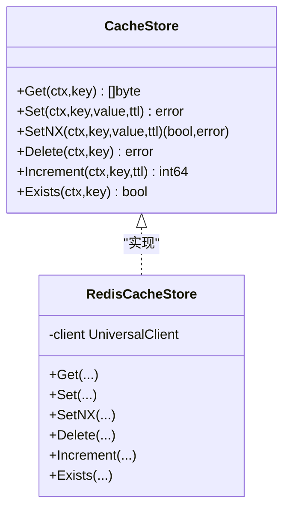
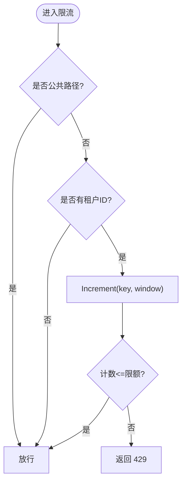
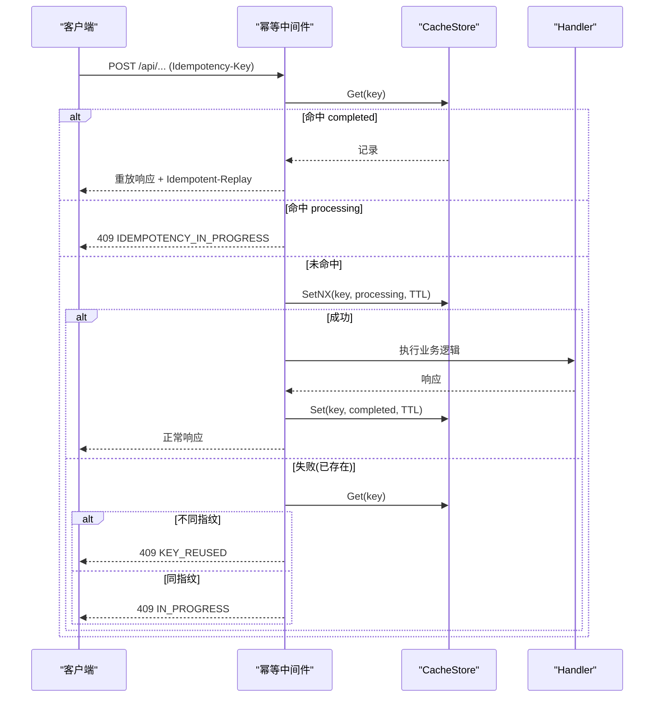
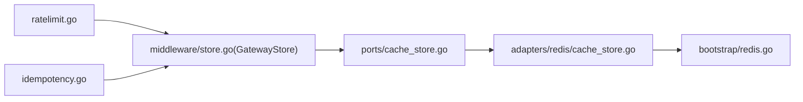

# 缓存策略

<cite>
**本文引用的文件**
- [pkg/ports/cache_store.go](file://repo/pkg/ports/cache_store.go)
- [pkg/adapters/redis/cache_store.go](file://repo/pkg/adapters/redis/cache_store.go)
- [pkg/bootstrap/redis.go](file://repo/pkg/bootstrap/redis.go)
- [services/ani-gateway/internal/middleware/store.go](file://repo/services/ani-gateway/internal/middleware/store.go)
- [services/ani-gateway/internal/middleware/ratelimit.go](file://repo/services/ani-gateway/internal/middleware/ratelimit.go)
- [services/ani-gateway/internal/middleware/idempotency.go](file://repo/services/ani-gateway/internal/middleware/idempotency.go)
- [services/kb-service/main.py](file://repo/services/kb-service/main.py)
- [development-records/sprint14-core-resilience-plan.md](file://repo/development-records/sprint14-core-resilience-plan.md)
</cite>

## 目录
1. [简介](#简介)
2. [项目结构](#项目结构)
3. [核心组件](#核心组件)
4. [架构总览](#架构总览)
5. [详细组件分析](#详细组件分析)
6. [依赖关系分析](#依赖关系分析)
7. [性能与容量规划](#性能与容量规划)
8. [故障排查指南](#故障排查指南)
9. [结论](#结论)
10. [附录：键命名规范与配置清单](#附录键命名规范与配置清单)

## 简介
本文件面向 ANI 平台中的 Redis 缓存策略，系统性说明设计模式、实现细节与运维要点。内容覆盖：
- 缓存抽象接口与 Redis 适配器
- 缓存键命名规范与序列化格式
- TTL、主动失效与被动过期处理
- 热点数据识别与防护（预加载、防击穿、防雪崩）
- 一致性保障（读写穿透、更新策略）
- 监控指标与故障恢复机制

## 项目结构
ANI 的缓存能力通过“端口-适配器”模式解耦：
- 端口层定义统一的缓存抽象接口，屏蔽底层存储差异
- 适配层提供 Redis 的具体实现
- 网关中间件以共享存储形式复用该能力，用于限流与幂等重放
- Python 服务在会话缓存场景按需接入 Redis，并具备降级到数据库的能力

图表来源
- [pkg/ports/cache_store.go:8-15](file://repo/pkg/ports/cache_store.go#L8-L15)
- [pkg/adapters/redis/cache_store.go:13-75](file://repo/pkg/adapters/redis/cache_store.go#L13-L75)
- [pkg/bootstrap/redis.go:27-64](file://repo/pkg/bootstrap/redis.go#L27-L64)
- [services/ani-gateway/internal/middleware/ratelimit.go:14-87](file://repo/services/ani-gateway/internal/middleware/ratelimit.go#L14-L87)
- [services/ani-gateway/internal/middleware/idempotency.go:17-214](file://repo/services/ani-gateway/internal/middleware/idempotency.go#L17-L214)
- [services/kb-service/main.py:100-130](file://repo/services/kb-service/main.py#L100-L130)

章节来源
- [pkg/ports/cache_store.go:8-15](file://repo/pkg/ports/cache_store.go#L8-L15)
- [pkg/adapters/redis/cache_store.go:13-75](file://repo/pkg/adapters/redis/cache_store.go#L13-L75)
- [pkg/bootstrap/redis.go:27-64](file://repo/pkg/bootstrap/redis.go#L27-L64)
- [services/ani-gateway/internal/middleware/ratelimit.go:14-87](file://repo/services/ani-gateway/internal/middleware/ratelimit.go#L14-L87)
- [services/ani-gateway/internal/middleware/idempotency.go:17-214](file://repo/services/ani-gateway/internal/middleware/idempotency.go#L17-L214)
- [services/kb-service/main.py:100-130](file://repo/services/kb-service/main.py#L100-L130)

## 核心组件
- 缓存抽象接口：统一 Get/Set/SetNX/Delete/Increment/Exists 操作，供各模块使用
- Redis 适配器：基于 go-redis UniversalClient，封装原子计数与 TTL 设置
- 启动装配：支持 URL、Standalone/Sentinel/Cluster 多种模式，连接时 Ping 校验
- 网关中间件：通过共享 store 实现按租户+路由类别的窗口限流与幂等响应重放
- Python 会话缓存：异步 Redis 客户端懒连接，失败时回退到仅数据库持久化

章节来源
- [pkg/ports/cache_store.go:8-15](file://repo/pkg/ports/cache_store.go#L8-L15)
- [pkg/adapters/redis/cache_store.go:23-75](file://repo/pkg/adapters/redis/cache_store.go#L23-L75)
- [pkg/bootstrap/redis.go:27-64](file://repo/pkg/bootstrap/redis.go#L27-L64)
- [services/ani-gateway/internal/middleware/ratelimit.go:47-87](file://repo/services/ani-gateway/internal/middleware/ratelimit.go#L47-L87)
- [services/ani-gateway/internal/middleware/idempotency.go:31-124](file://repo/services/ani-gateway/internal/middleware/idempotency.go#L31-L124)
- [services/kb-service/main.py:100-130](file://repo/services/kb-service/main.py#L100-L130)

## 架构总览
ANI 采用“共享缓存后端 + 中间件”的架构：
- Gateway 通过注入共享 CacheStore 为所有中间件提供一致的缓存能力
- 限流中间件使用原子递增+TTL 实现滑动窗口计数
- 幂等中间件使用 SetNX 建立“进行中”哨兵，完成后缓存响应体并重放
- Python 服务在会话缓存中采用异步客户端，构建期懒连接，异常时降级

图表来源
- [services/ani-gateway/internal/middleware/ratelimit.go:47-87](file://repo/services/ani-gateway/internal/middleware/ratelimit.go#L47-L87)
- [services/ani-gateway/internal/middleware/idempotency.go:31-124](file://repo/services/ani-gateway/internal/middleware/idempotency.go#L31-L124)
- [pkg/adapters/redis/cache_store.go:56-66](file://repo/pkg/adapters/redis/cache_store.go#L56-L66)

## 详细组件分析

### 缓存抽象与 Redis 适配器
- 接口设计：Get/Set/SetNX/Delete/Increment/Exists，覆盖读、写、原子计数、存在性检查
- 适配器行为：
  - Get：不存在返回“未找到”错误，便于上层区分缓存缺失与网络错误
  - SetNX：用于并发控制（如幂等“进行中”哨兵）
  - Increment：使用事务管道执行 INCR+EXPIRE，保证计数与 TTL 原子性
  - Exists：基于 EXISTS 命令判断键是否存在

图表来源
- [pkg/ports/cache_store.go:8-15](file://repo/pkg/ports/cache_store.go#L8-L15)
- [pkg/adapters/redis/cache_store.go:13-75](file://repo/pkg/adapters/redis/cache_store.go#L13-L75)

章节来源
- [pkg/ports/cache_store.go:8-15](file://repo/pkg/ports/cache_store.go#L8-L15)
- [pkg/adapters/redis/cache_store.go:23-75](file://repo/pkg/adapters/redis/cache_store.go#L23-L75)

### 启动装配与连接模式
- 支持三种模式：URL、Standalone、Sentinel、Cluster
- 连接时进行 Ping 探测，失败则拒绝启动
- 提供两种构造方式：从 URL 或从结构化配置

章节来源
- [pkg/bootstrap/redis.go:27-64](file://repo/pkg/bootstrap/redis.go#L27-L64)
- [pkg/bootstrap/redis.go:80-125](file://repo/pkg/bootstrap/redis.go#L80-L125)

### 网关限流中间件（窗口计数）
- 键空间：ratelimit:{tenant_id}:{method}:{route_class}
- 窗口与限额：通过环境变量配置请求数与时间窗口
- 行为：对公共路径和无租户请求放行；超限返回 429；store 不可用时返回 503

图表来源
- [services/ani-gateway/internal/middleware/ratelimit.go:14-87](file://repo/services/ani-gateway/internal/middleware/ratelimit.go#L14-L87)

章节来源
- [services/ani-gateway/internal/middleware/ratelimit.go:14-87](file://repo/services/ani-gateway/internal/middleware/ratelimit.go#L14-L87)

### 网关幂等中间件（响应重放）
- 适用方法：POST/PUT/PATCH/DELETE
- 键空间：idempotency:{scope}:{tenant}:{method}:{path}:{hash(idempotency_key)}
- 流程：
  - 首次：SetNX 写入“processing”，进入 handler
  - 完成：缓存状态码、内容类型与响应体，TTL 默认 24h；沙箱令牌路径可动态计算 TTL
  - 重复：命中“completed”直接重放响应并加头 Idempotent-Replay；命中“processing”返回 409
- 指纹：对方法、路径、查询串与规范化后的请求体做哈希，防止 key 重用冲突

图表来源
- [services/ani-gateway/internal/middleware/idempotency.go:17-214](file://repo/services/ani-gateway/internal/middleware/idempotency.go#L17-L214)

章节来源
- [services/ani-gateway/internal/middleware/idempotency.go:17-214](file://repo/services/ani-gateway/internal/middleware/idempotency.go#L17-L214)

### Python 会话缓存（kb-service）
- 启动时尝试创建异步 Redis 客户端，绑定到 gRPC 事件循环
- 若 Redis 不可用，记录警告并降级为仅数据库持久化
- 懒连接：构造不立即打开连接，避免启动期泄漏

章节来源
- [services/kb-service/main.py:100-130](file://repo/services/kb-service/main.py#L100-L130)

## 依赖关系分析
- 中间件通过别名 GatewayStore 引用 ports.CacheStore，保持与具体实现的松耦合
- 限流与幂等均依赖共享 store 注入，避免在各中间件中直接依赖 Redis SDK
- 启动装配负责根据配置创建 Redis UniversalClient，并暴露 Close 函数

图表来源
- [services/ani-gateway/internal/middleware/store.go:1-6](file://repo/services/ani-gateway/internal/middleware/store.go#L1-L6)
- [pkg/ports/cache_store.go:8-15](file://repo/pkg/ports/cache_store.go#L8-L15)
- [pkg/adapters/redis/cache_store.go:13-75](file://repo/pkg/adapters/redis/cache_store.go#L13-L75)
- [pkg/bootstrap/redis.go:27-64](file://repo/pkg/bootstrap/redis.go#L27-L64)

章节来源
- [services/ani-gateway/internal/middleware/store.go:1-6](file://repo/services/ani-gateway/internal/middleware/store.go#L1-L6)
- [pkg/ports/cache_store.go:8-15](file://repo/pkg/ports/cache_store.go#L8-L15)
- [pkg/adapters/redis/cache_store.go:13-75](file://repo/pkg/adapters/redis/cache_store.go#L13-L75)
- [pkg/bootstrap/redis.go:27-64](file://repo/pkg/bootstrap/redis.go#L27-L64)

## 性能与容量规划
- 原子计数与 TTL：使用管道执行 INCR+EXPIRE，减少 RTT 并保证一致性
- 连接池与模式：UniversalClient 支持 Standalone/Sentinel/Cluster，生产建议至少 Sentinel 或 Cluster 部署
- 超时与重试：外部调用可通过 resilience 包注入超时与重试策略，降低瞬时抖动影响
- 健康探测：数据面依赖（包括 Redis）纳入 readyz 探针，强依赖失败返回 503，弱依赖降级为 degraded
- 容量估算：按租户×路由类别维度统计键数量；合理设置窗口大小与 TTL，避免键爆炸

章节来源
- [pkg/adapters/redis/cache_store.go:56-66](file://repo/pkg/adapters/redis/cache_store.go#L56-L66)
- [pkg/bootstrap/redis.go:80-125](file://repo/pkg/bootstrap/redis.go#L80-L125)
- [development-records/sprint14-core-resilience-plan.md:51-94](file://repo/development-records/sprint14-core-resilience-plan.md#L51-L94)

## 故障排查指南
- 限流不可用：当 store 不可用时返回 503，需检查 Redis 连通性与配置
- 幂等冲突：指纹不一致返回冲突；处理中请求返回 409，需确认客户端是否正确去重
- 会话缓存降级：Python 服务在 Redis 不可用时降级为 DB-only，需关注日志告警
- 健康探针：强依赖（如 Redis）失败将导致 readyz 返回 fail，需结合 live gate 证据定位

章节来源
- [services/ani-gateway/internal/middleware/ratelimit.go:27-36](file://repo/services/ani-gateway/internal/middleware/ratelimit.go#L27-L36)
- [services/ani-gateway/internal/middleware/idempotency.go:50-98](file://repo/services/ani-gateway/internal/middleware/idempotency.go#L50-L98)
- [services/kb-service/main.py:116-130](file://repo/services/kb-service/main.py#L116-L130)
- [development-records/sprint14-core-resilience-plan.md:51-94](file://repo/development-records/sprint14-core-resilience-plan.md#L51-L94)

## 结论
ANI 的缓存体系以统一接口为核心，通过 Redis 适配器支撑网关限流与幂等重放，并在 Python 服务中提供会话缓存与降级策略。配合启动装配的多模式连接、健康探针与韧性基础（超时、重试、断路器），形成了可扩展且高可用的缓存基础设施。后续可在热点识别、预加载与更细粒度熔断方面继续完善。

## 附录：键命名规范与配置清单
- 键命名规范
  - 限流：ratelimit:{tenant_id}:{method}:{route_class}
  - 幂等：idempotency:{scope}:{tenant}:{method}:{path}:{hash(idempotency_key)}
  - 幂等元数据（沙箱令牌）：idempotency:...:metadata
- 序列化格式
  - 幂等记录：JSON，包含 state、fingerprint、status_code、content_type、body、expires_at
  - 限流：整型计数（INCR）
  - 其他缓存值：二进制字节（由调用方决定编码）
- TTL 策略
  - 限流：按窗口时间设置 TTL（例如秒级）
  - 幂等：默认 24 小时；沙箱令牌路径可根据响应 expires_at 动态计算
- 配置项（示例）
  - 限流：GATEWAY_RATE_LIMIT_REQUESTS、GATEWAY_RATE_LIMIT_WINDOW
  - Redis：REDIS_URL、REDIS_MODE、REDIS_ADDRS、REDIS_MASTER_NAME、REDIS_USERNAME、REDIS_PASSWORD、REDIS_SENTINEL_USERNAME、REDIS_SENTINEL_PASSWORD、REDIS_DB
- 监控与指标（建议）
  - 命中率、延迟分布、错误率（网络/权限/配额）
  - 键空间增长趋势、内存占用、慢查询
  - 限流触发次数、幂等重放次数、409/429 比例

章节来源
- [services/ani-gateway/internal/middleware/ratelimit.go:58-87](file://repo/services/ani-gateway/internal/middleware/ratelimit.go#L58-L87)
- [services/ani-gateway/internal/middleware/idempotency.go:17-214](file://repo/services/ani-gateway/internal/middleware/idempotency.go#L17-L214)
- [pkg/bootstrap/redis.go:15-25](file://repo/pkg/bootstrap/redis.go#L15-L25)
- [pkg/bootstrap/redis.go:80-125](file://repo/pkg/bootstrap/redis.go#L80-L125)