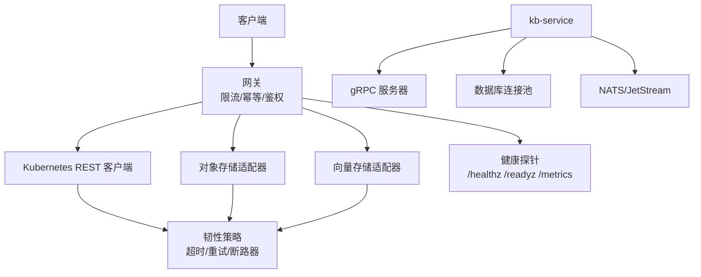
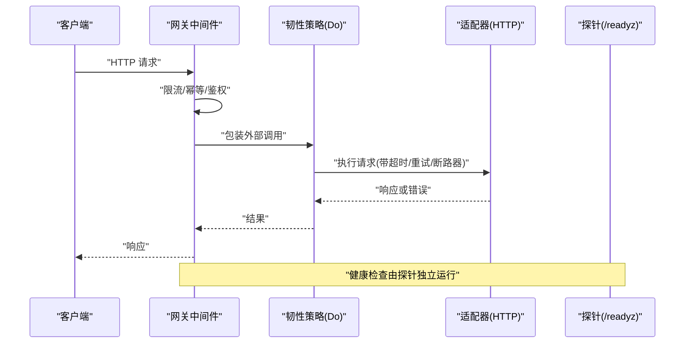
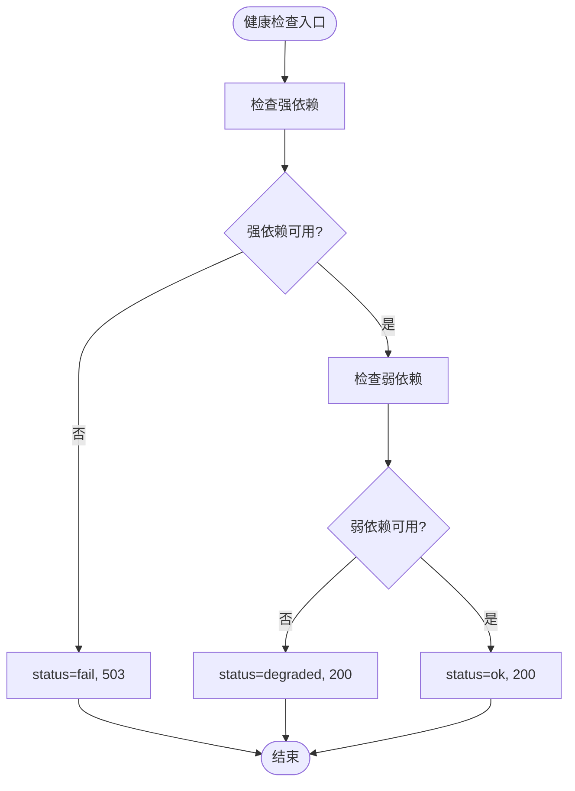
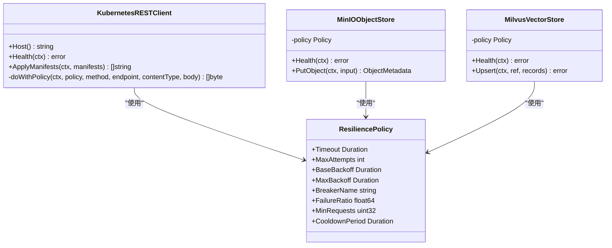
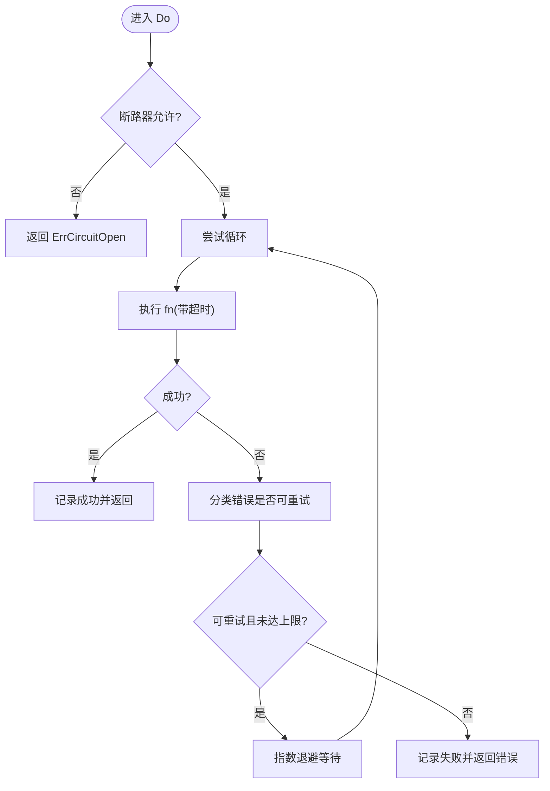
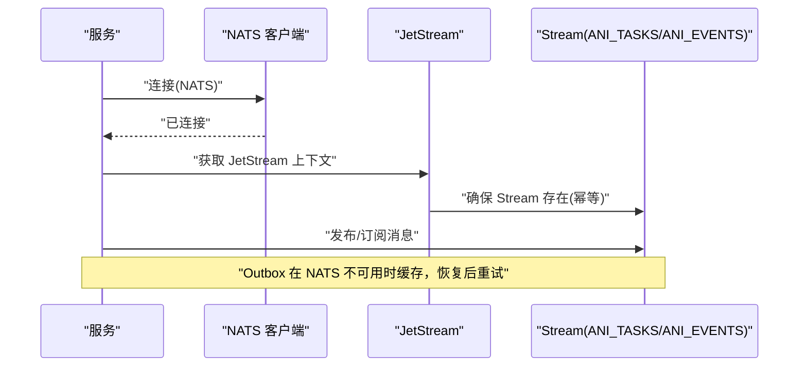
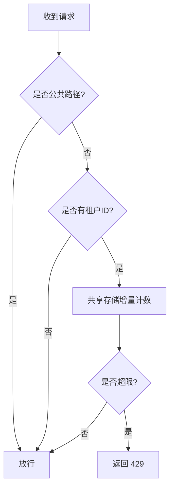
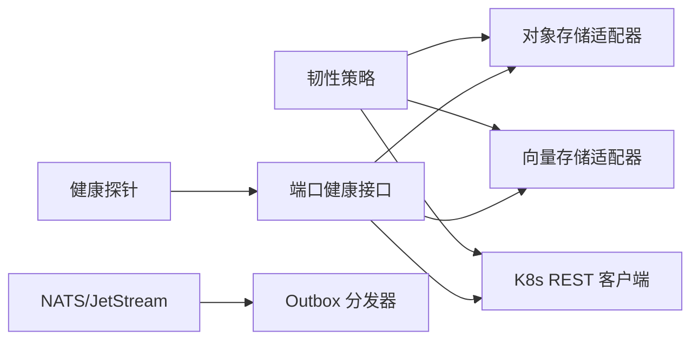

# 网络性能优化

<cite>
**本文引用的文件**
- [resilience.go](file://repo/pkg/adapters/resilience/resilience.go)
- [kubernetes_rest_client.go](file://repo/pkg/adapters/runtime/kubernetes_rest_client.go)
- [minio_store.go](file://repo/pkg/adapters/objectstore/minio_store.go)
- [milvus_store.go](file://repo/pkg/adapters/vectorstore/milvus_store.go)
- [nats.go](file://repo/pkg/bootstrap/nats.go)
- [probes.go](file://repo/pkg/bootstrap/probes.go)
- [ratelimit.go](file://repo/services/ani-gateway/internal/middleware/ratelimit.go)
- [main.py](file://repo/services/kb-service/main.py)
- [sprint14-core-resilience-plan.md](file://repo/development-records/sprint14-core-resilience-plan.md)
</cite>

## 目录
1. [简介](#简介)
2. [项目结构](#项目结构)
3. [核心组件](#核心组件)
4. [架构总览](#架构总览)
5. [详细组件分析](#详细组件分析)
6. [依赖关系分析](#依赖关系分析)
7. [性能考量](#性能考量)
8. [故障排查指南](#故障排查指南)
9. [结论](#结论)
10. [附录](#附录)

## 简介
本文件聚焦于 ANI 平台在网络层面的性能与韧性优化，覆盖负载均衡与服务发现、健康检查与故障转移、连接复用与连接池管理（HTTP/gRPC）、超时设置与重试机制、消息队列（NATS）性能优化，以及监控指标与性能测试方法。内容基于仓库中网关中间件、适配器层、启动探针与 NATS 初始化等实现进行归纳与可视化说明，帮助读者快速定位配置点与优化策略。

## 项目结构
从网络性能视角，关键代码分布在以下层次：
- 网关层：限流中间件、幂等重放、请求路由与中间件链
- 适配器层：Kubernetes REST、对象存储（MinIO）、向量存储（Milvus）的 HTTP 调用封装，统一通过 resilience 策略包装
- 启动与可观测性：NATS 连接与 JetStream 初始化、服务就绪探针（healthz/readyz/metrics）
- 内部服务：kb-service 的 gRPC 服务器与数据库连接池、NATS outbox 分发器

**图示来源**
- [ratelimit.go:14-87](file://repo/services/ani-gateway/internal/middleware/ratelimit.go#L14-L87)
- [kubernetes_rest_client.go:30-100](file://repo/pkg/adapters/runtime/kubernetes_rest_client.go#L30-L100)
- [minio_store.go:31-105](file://repo/pkg/adapters/objectstore/minio_store.go#L31-L105)
- [milvus_store.go:26-67](file://repo/pkg/adapters/vectorstore/milvus_store.go#L26-L67)
- [probes.go:37-57](file://repo/pkg/bootstrap/probes.go#L37-L57)
- [nats.go:12-54](file://repo/pkg/bootstrap/nats.go#L12-L54)
- [main.py:133-178](file://repo/services/kb-service/main.py#L133-L178)

**章节来源**
- [ratelimit.go:14-87](file://repo/services/ani-gateway/internal/middleware/ratelimit.go#L14-L87)
- [probes.go:37-57](file://repo/pkg/bootstrap/probes.go#L37-L57)
- [nats.go:12-54](file://repo/pkg/bootstrap/nats.go#L12-L54)
- [main.py:133-178](file://repo/services/kb-service/main.py#L133-L178)

## 核心组件
- 韧性策略（超时/重试/断路器）：为所有外部 HTTP 调用提供统一的超时、退避重试与命名断路器能力，避免雪崩并提升可用性
- Kubernetes REST 客户端：封装 API Server 访问，支持 CA 加载、Bearer Token、字段管理器、请求超时与幂等读路径的重试策略
- 对象存储与向量存储适配器：支持多端点配置与健康探测，在错误时尝试下一个端点，配合韧性策略做失败隔离
- NATS 连接与 JetStream：带重试的连接建立、自动创建核心 Stream、按业务语义选择保留策略
- 健康探针：统一暴露 healthz/readyz/metrics，区分强依赖与弱依赖降级状态
- 网关限流：基于共享存储的租户级窗口计数限流，超限返回 429，保护后端

**章节来源**
- [resilience.go:13-22](file://repo/pkg/adapters/resilience/resilience.go#L13-L22)
- [kubernetes_rest_client.go:30-100](file://repo/pkg/adapters/runtime/kubernetes_rest_client.go#L30-L100)
- [minio_store.go:31-105](file://repo/pkg/adapters/objectstore/minio_store.go#L31-L105)
- [milvus_store.go:26-67](file://repo/pkg/adapters/vectorstore/milvus_store.go#L26-L67)
- [nats.go:12-54](file://repo/pkg/bootstrap/nats.go#L12-L54)
- [probes.go:37-57](file://repo/pkg/bootstrap/probes.go#L37-L57)
- [ratelimit.go:14-87](file://repo/services/ani-gateway/internal/middleware/ratelimit.go#L14-L87)

## 架构总览
下图展示一次典型请求从网关到后端的链路，包括限流、幂等、韧性策略与探针：

**图示来源**
- [ratelimit.go:14-87](file://repo/services/ani-gateway/internal/middleware/ratelimit.go#L14-L87)
- [resilience.go:89-133](file://repo/pkg/adapters/resilience/resilience.go#L89-L133)
- [kubernetes_rest_client.go:432-480](file://repo/pkg/adapters/runtime/kubernetes_rest_client.go#L432-L480)
- [probes.go:37-57](file://repo/pkg/bootstrap/probes.go#L37-L57)

## 详细组件分析

### 负载均衡、服务发现与健康检查
- 多端点与故障转移
  - 对象存储与向量存储适配器均支持端点列表；当发生网络错误、429、5xx 时尝试下一个端点，形成应用层负载均衡与故障转移
  - 该模式适用于 LB/VIP 场景，减少单点故障影响
- 健康检查
  - 统一探针暴露 /healthz、/readyz、/metrics
  - 强依赖（如 Postgres/NATS/Redis/Kubernetes API）失败 → status=fail + HTTP 503
  - 弱依赖（如 ObjectStore/VectorStore）失败 → status=degraded + HTTP 200
  - 未配置的依赖视为正常，避免本地开发误报
- 服务发现
  - 通过端点列表或 LB/VIP 实现服务发现；结合健康检查与熔断策略，动态规避不可用节点

**图示来源**
- [probes.go:37-57](file://repo/pkg/bootstrap/probes.go#L37-L57)
- [probes.go:102-136](file://repo/pkg/bootstrap/probes.go#L102-L136)
- [probes.go:144-218](file://repo/pkg/bootstrap/probes.go#L144-L218)

**章节来源**
- [minio_store.go:107-125](file://repo/pkg/adapters/objectstore/minio_store.go#L107-L125)
- [milvus_store.go:159-165](file://repo/pkg/adapters/vectorstore/milvus_store.go#L159-L165)
- [probes.go:37-57](file://repo/pkg/bootstrap/probes.go#L37-L57)
- [probes.go:102-136](file://repo/pkg/bootstrap/probes.go#L102-L136)
- [probes.go:144-218](file://repo/pkg/bootstrap/probes.go#L144-L218)

### 连接复用与连接池管理（HTTP 与 gRPC）
- HTTP 连接复用
  - Kubernetes REST 客户端使用 http.Client；默认复用连接，建议在生产环境自定义 Transport 以控制 TLS、KeepAlive、最大空闲连接等参数
  - 对象存储与向量存储适配器同样基于 http.Client，可通过配置注入以实现全局连接池调优
- gRPC 连接与线程模型
  - kb-service 在后台线程启动 gRPC 服务器，使用 ThreadPoolExecutor 处理 RPC；数据库连接池创建于专用事件循环以避免跨循环问题
  - 生命周期管理确保优雅关闭：停止 gRPC、drain NATS、关闭数据库连接池
- 连接池建议
  - 根据并发与下游容量调整连接池大小与超时
  - 对高延迟下游适当增大连接数，但需评估内存与 CPU 开销
  - 合理设置 KeepAlive、IdleTimeout、MaxIdleConnsPerHost

**图示来源**
- [kubernetes_rest_client.go:30-100](file://repo/pkg/adapters/runtime/kubernetes_rest_client.go#L30-L100)
- [minio_store.go:31-105](file://repo/pkg/adapters/objectstore/minio_store.go#L31-L105)
- [milvus_store.go:26-67](file://repo/pkg/adapters/vectorstore/milvus_store.go#L26-L67)
- [resilience.go:13-22](file://repo/pkg/adapters/resilience/resilience.go#L13-L22)

**章节来源**
- [kubernetes_rest_client.go:134-161](file://repo/pkg/adapters/runtime/kubernetes_rest_client.go#L134-L161)
- [main.py:63-80](file://repo/services/kb-service/main.py#L63-L80)
- [main.py:133-178](file://repo/services/kb-service/main.py#L133-L178)

### 超时设置与重试机制
- 每调用超时
  - 通过 resilience.Policy.Timeout 为每次外部调用注入 deadline；未设置则继承上下文
  - Kubernetes REST、MinIO、Milvus 均在调用点包裹 Do，确保超时生效
- 重试与退避
  - MaxAttempts 控制总尝试次数；BaseBackoff/MaxBackoff 实现指数退避上限
  - Retryable 判定：网络错误、超时、429、5xx 可重试；context.Canceled 不重试
- 断路器
  - BreakerName/FailureRatio/MinRequests/CoolDownPeriod 控制熔断；open 时直接返回 ErrCircuitOpen，避免放大故障
- 幂等读路径
  - Kubernetes REST 的只读/观察/dry-run 可使用重试策略；写路径（Apply）不重试，保证一致性

**图示来源**
- [resilience.go:89-133](file://repo/pkg/adapters/resilience/resilience.go#L89-L133)
- [resilience.go:56-87](file://repo/pkg/adapters/resilience/resilience.go#L56-L87)
- [resilience.go:144-164](file://repo/pkg/adapters/resilience/resilience.go#L144-L164)
- [resilience.go:166-223](file://repo/pkg/adapters/resilience/resilience.go#L166-L223)
- [kubernetes_rest_client.go:432-480](file://repo/pkg/adapters/runtime/kubernetes_rest_client.go#L432-L480)

**章节来源**
- [resilience.go:13-22](file://repo/pkg/adapters/resilience/resilience.go#L13-L22)
- [resilience.go:56-87](file://repo/pkg/adapters/resilience/resilience.go#L56-L87)
- [resilience.go:89-133](file://repo/pkg/adapters/resilience/resilience.go#L89-L133)
- [resilience.go:144-164](file://repo/pkg/adapters/resilience/resilience.go#L144-L164)
- [resilience.go:166-223](file://repo/pkg/adapters/resilience/resilience.go#L166-L223)
- [kubernetes_rest_client.go:432-480](file://repo/pkg/adapters/runtime/kubernetes_rest_client.go#L432-L480)

### 消息队列性能优化（NATS）
- 连接与重连
  - connectNATS 启用重试连接、最大重连次数与重连等待时间，避免启动抖动导致失败
  - 连接成功后初始化 JetStream，并确保核心 Stream 存在
- 流与保留策略
  - ANI_TASKS：WorkQueuePolicy，首个消费者 Ack 后即删除，适合点对点任务消费
  - ANI_EVENTS：InterestPolicy，只要还有订阅者未消费就保留，支持 fan-out
  - 存储策略与副本数可按生产需求调整
- Outbox 与背压
  - kb-service 的 outbox dispatcher 在 NATS 不可用时缓存事件，恢复后继续分发；readiness 将 outbox 作为弱依赖报告
- 性能建议
  - 合理设置批量发送与消费并行度
  - 针对热点主题进行分片或分区，降低单主题压力
  - 监控积压与消费延迟，必要时扩容消费者

**图示来源**
- [nats.go:12-54](file://repo/pkg/bootstrap/nats.go#L12-L54)
- [nats.go:56-94](file://repo/pkg/bootstrap/nats.go#L56-L94)
- [main.py:83-97](file://repo/services/kb-service/main.py#L83-L97)
- [main.py:163-178](file://repo/services/kb-service/main.py#L163-L178)

**章节来源**
- [nats.go:12-54](file://repo/pkg/bootstrap/nats.go#L12-L54)
- [nats.go:56-94](file://repo/pkg/bootstrap/nats.go#L56-L94)
- [main.py:83-97](file://repo/services/kb-service/main.py#L83-L97)
- [main.py:163-178](file://repo/services/kb-service/main.py#L163-L178)

### 网关限流与背压
- 租户级窗口计数
  - 基于共享存储（如 Redis）的 Increment 原子计数，键格式包含租户、方法与路由类别
  - 超过阈值返回 429，保护后端不被突发流量打爆
- 公共路径与无租户请求放行
  - 对公开路径或未携带租户的请求跳过限流，保障基础设施接口可用
- 配置项
  - 通过环境变量配置请求数与窗口时长，便于不同环境差异化限流

**图示来源**
- [ratelimit.go:14-87](file://repo/services/ani-gateway/internal/middleware/ratelimit.go#L14-L87)

**章节来源**
- [ratelimit.go:14-87](file://repo/services/ani-gateway/internal/middleware/ratelimit.go#L14-L87)

## 依赖关系分析
- 适配器对韧性策略的依赖
  - Kubernetes REST、MinIO、Milvus 均通过 resilience.Do 包装外部调用，统一获得超时、重试与断路器能力
- 探针与端口健康
  - probes 调用各端口的 Health 接口，区分强/弱依赖，输出结构化健康信息
- NATS 与 Outbox
  - bootstrap.nats 负责连接与 Stream 初始化；kb-service 的 outbox 依赖 NATS 进行事件分发

**图示来源**
- [resilience.go:89-133](file://repo/pkg/adapters/resilience/resilience.go#L89-L133)
- [kubernetes_rest_client.go:432-480](file://repo/pkg/adapters/runtime/kubernetes_rest_client.go#L432-L480)
- [minio_store.go:107-125](file://repo/pkg/adapters/objectstore/minio_store.go#L107-L125)
- [milvus_store.go:159-165](file://repo/pkg/adapters/vectorstore/milvus_store.go#L159-L165)
- [probes.go:144-218](file://repo/pkg/bootstrap/probes.go#L144-L218)
- [nats.go:12-54](file://repo/pkg/bootstrap/nats.go#L12-L54)

**章节来源**
- [resilience.go:89-133](file://repo/pkg/adapters/resilience/resilience.go#L89-L133)
- [probes.go:144-218](file://repo/pkg/bootstrap/probes.go#L144-L218)
- [nats.go:12-54](file://repo/pkg/bootstrap/nats.go#L12-L54)

## 性能考量
- 连接池与传输层
  - 为高并发场景定制 http.Transport：设置 KeepAlive、MaxIdleConnsPerHost、IdleConnTimeout
  - 对 gRPC 服务端线程池大小与数据库连接池进行容量规划，避免资源争用
- 超时与重试
  - 为外部调用设置合理的 RequestTimeout，防止慢请求拖垮系统
  - 仅对幂等操作启用重试；写路径保持一次性提交，避免重复副作用
- 断路器与熔断
  - 为关键下游配置断路器，避免级联故障；冷却期与最小样本量防止冷启动误判
- 消息队列
  - 合理设置批大小与消费并行度；监控积压与延迟，必要时水平扩展消费者
  - 使用合适的 Stream 保留策略，平衡可靠性与存储成本
- 健康检查与降级
  - 强依赖失败立即降级（503），弱依赖失败降级但不阻断主流程（200 degraded）
  - 通过 metrics 暴露 reconcile 控制器指标，辅助容量与稳定性分析

[本节为通用指导，不直接分析具体文件]

## 故障排查指南
- 常见问题定位
  - 连接失败：检查 NATS 连接重试与重连间隔；确认 Stream 是否存在
  - 超时错误：核对 resilience.Policy.Timeout 与各适配器的 RequestTimeout 配置
  - 重试风暴：检查 Retryable 分类与 MaxAttempts；确认是否对非幂等操作启用了重试
  - 断路器频繁打开：调整 FailureRatio、MinRequests、CooldownPeriod，避免过度敏感
  - 健康检查异常：查看 /readyz 的结构化输出，区分强/弱依赖失败原因
- 日志与指标
  - 关注探针输出的 latency_ms 与 error 字段
  - 采集 /metrics 中的 reconcile 计数器，识别回退与失败趋势
- 复现与验证
  - 使用隔离 fixture 进行真实后端 kill/degradation/failover 验证
  - 通过单元测试覆盖超时、重试、断路器等边界条件

**章节来源**
- [nats.go:12-54](file://repo/pkg/bootstrap/nats.go#L12-L54)
- [resilience.go:56-87](file://repo/pkg/adapters/resilience/resilience.go#L56-L87)
- [resilience.go:166-223](file://repo/pkg/adapters/resilience/resilience.go#L166-L223)
- [probes.go:37-57](file://repo/pkg/bootstrap/probes.go#L37-L57)
- [probes.go:102-136](file://repo/pkg/bootstrap/probes.go#L102-L136)

## 结论
本项目在网络层面已形成较为完善的性能与韧性体系：通过韧性策略统一超时/重试/断路器，适配器层支持多端点与故障转移，健康探针提供强/弱依赖分级降级，NATS 提供可靠的消息通道与 outbox 容错，网关限流保护后端免受突发流量冲击。建议在上线前结合真实拓扑进行容量规划与故障注入演练，持续优化连接池、超时与重试参数，完善监控告警与压测基线。

[本节为总结性内容，不直接分析具体文件]

## 附录
- 相关计划与事实核对
  - 韧性基础、超时、重试、断路器、多端点故障转移、数据面 readyz 等已在 Sprint14 计划中逐项落地与验证
  - 部分能力（如命名断路器持续故障注入、PG 读副本 HA）仍在推进中

**章节来源**
- [sprint14-core-resilience-plan.md:51-63](file://repo/development-records/sprint14-core-resilience-plan.md#L51-L63)
- [sprint14-core-resilience-plan.md:203-233](file://repo/development-records/sprint14-core-resilience-plan.md#L203-L233)
- [sprint14-core-resilience-plan.md:264-359](file://repo/development-records/sprint14-core-resilience-plan.md#L264-L359)
- [sprint14-core-resilience-plan.md:362-370](file://repo/development-records/sprint14-core-resilience-plan.md#L362-L370)
- [sprint14-core-resilience-plan.md:454-471](file://repo/development-records/sprint14-core-resilience-plan.md#L454-L471)