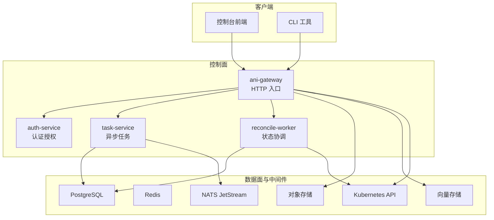
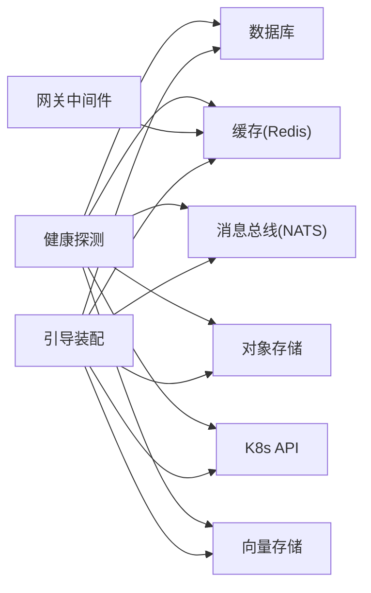

# 常见问题与解决方案

<cite>
**本文引用的文件**
- [repo/README.md](file://repo/README.md)
- [deploy/docker/README.md](file://deploy/docker/README.md)
- [deploy/helm/ani-platform/README.md](file://deploy/helm/ani-platform/README.md)
- [pkg/bootstrap/server.go](file://pkg/bootstrap/server.go)
- [pkg/types/errors.go](file://pkg/types/errors.go)
- [services/ani-gateway/internal/router/auth.go](file://services/ani-gateway/internal/router/auth.go)
- [scripts/validate_auth_gateway_contract.py](file://scripts/validate_auth_gateway_contract.py)
- [services/kb-service/main.py](file://services/kb-service/main.py)
- [development-records/sprint14-core-resilience-plan.md](file://development-records/sprint14-core-resilience-plan.md)
- [development-records/r-p0-1-gateway-rate-limit.md](file://development-records/r-p0-1-gateway-rate-limit.md)
- [development-records/sprint13-storage-rook-ceph-readiness.md](file://development-records/sprint13-storage-rook-ceph-readiness.md)
- [development-records/instance-orchestration-a.md](file://development-records/instance-orchestration-a.md)
- [development-records/m2-2-auth-a-auth-service-foundation.md](file://development-records/m2-2-auth-a-auth-service-foundation.md)
</cite>

## 目录
1. [简介](#简介)
2. [项目结构](#项目结构)
3. [核心组件](#核心组件)
4. [架构总览](#架构总览)
5. [详细组件分析](#详细组件分析)
6. [依赖关系分析](#依赖关系分析)
7. [性能考虑](#性能考虑)
8. [故障排查指南](#故障排查指南)
9. [结论](#结论)
10. [附录](#附录)

## 简介
本文件面向 ANI 平台在部署、运行过程中遇到的典型问题，提供“问题描述—错误日志示例—根本原因—解决步骤”的完整闭环。覆盖安装部署失败、服务启动异常、API 调用错误、数据库连接问题、存储挂载失败、环境配置与权限问题、资源不足等常见场景；并给出通用诊断流程与工具使用建议。内容基于仓库中的本地开发说明、Helm Chart 说明、引导装配、健康探测、错误码定义、网关限流/幂等/韧性设计、存储快照就绪声明、实例编排实现要点等真实材料整理而成。

## 项目结构
ANI 采用 monorepo 组织：Go 服务（Gateway、Auth、Task、Reconcile Worker 等）、Python 服务（KB Service）、CLI、前端控制台、API 契约、Helm/Docker 部署、适配器与能力抽象、SDK 与脚本校验器等。本地开发通过 Docker Compose 一键拉起依赖（PostgreSQL、MinIO、NATS、Redis、Milvus），生产通过 Helm Chart 管理控制面与基础设施依赖。



图表来源
- [repo/README.md:18-67](file://repo/README.md#L18-L67)
- [deploy/helm/ani-platform/README.md:1-19](file://deploy/helm/ani-platform/README.md#L1-L19)

章节来源
- [repo/README.md:18-67](file://repo/README.md#L18-L67)
- [deploy/helm/ani-platform/README.md:1-19](file://deploy/helm/ani-platform/README.md#L1-L19)

## 核心组件
- 引导与装配：统一从环境变量加载数据库、NATS、Redis、对象/向量存储、工作负载与网络/存储 provider、Harbor 镜像仓库等配置，并在启动时建立连接；若关键依赖不可用则终止进程或降级。
- 健康探测：独立健康端口暴露依赖健康检查，强依赖失败返回 fail+503，弱依赖失败返回 degraded+200。
- 错误模型：统一的 ANIError 与 HTTP 状态映射，便于网关层将内部错误转换为对外一致的错误体。
- 网关中间件：限流、幂等响应重放、超时与重试/断路器基础能力，配合共享存储实现跨副本一致性。
- 存储与编排：支持 Volume/Snapshot/MountTarget 渲染与 Apply，结合 Kubernetes/Rook-Ceph 完成卷生命周期；实例创建路径包含 Registry 准入、网络注解、存储绑定。

章节来源
- [pkg/bootstrap/server.go:22-150](file://pkg/bootstrap/server.go#L22-L150)
- [pkg/bootstrap/server.go:387-445](file://pkg/bootstrap/server.go#L387-L445)
- [pkg/types/errors.go:21-67](file://pkg/types/errors.go#L21-L67)
- [development-records/sprint14-core-resilience-plan.md:51-64](file://development-records/sprint14-core-resilience-plan.md#L51-L64)
- [development-records/sprint13-storage-rook-ceph-readiness.md:17-32](file://development-records/sprint13-storage-rook-ceph-readiness.md#L17-L32)
- [development-records/instance-orchestration-a.md:29-35](file://development-records/instance-orchestration-a.md#L29-L35)

## 架构总览
下图展示一次典型请求从控制台到后端服务的流转，以及健康探测与错误处理的关键节点。

```mermaid
sequenceDiagram
participant U as "用户/控制台"
participant GW as "ani-gateway"
participant AS as "auth-service"
participant TS as "task-service"
participant DB as "PostgreSQL"
participant RS as "Redis"
participant OB as "对象/向量存储"
participant K as "Kubernetes API"
U->>GW : "POST /api/v1/instances"
GW->>AS : "鉴权/令牌校验"
AS-->>GW : "鉴权结果"
GW->>TS : "创建实例任务(含幂等键)"
TS->>DB : "写入任务(幂等)"
TS->>RS : "记录处理中/限流计数"
TS->>OB : "镜像拉取/元数据访问"
TS->>K : "创建/观察资源"
K-->>TS : "资源状态"
TS-->>GW : "异步任务ID/状态"
GW-->>U : "202 Accepted + 任务信息"
Note over GW,DB : "健康探测 : 强依赖失败→503; 弱依赖失败→200 degraded"
```

图表来源
- [pkg/bootstrap/server.go:387-445](file://pkg/bootstrap/server.go#L387-L445)
- [development-records/sprint14-core-resilience-plan.md:51-64](file://development-records/sprint14-core-resilience-plan.md#L51-L64)
- [development-records/r-p0-1-gateway-rate-limit.md:1-29](file://development-records/r-p0-1-gateway-rate-limit.md#L1-L29)

## 详细组件分析

### 安装与本地环境搭建失败
- 现象
  - 执行 make deps 后依赖服务未就绪或端口冲突。
  - 内存不足导致 Milvus 启动失败。
  - Dex 未启动导致 OIDC 登录链路不通。
- 可能原因
  - 未满足最低资源要求（内存≥8GB、磁盘≥20GB）。
  - Docker Compose profile 未启用 auth/tools。
  - 环境变量未正确加载。
- 定位方法
  - 使用 make deps-status 查看各依赖服务状态。
  - 检查 .env 是否已复制并填写必要项。
  - 确认 Docker Desktop/Engine 版本与 Compose V2。
- 解决步骤
  - 确保满足硬件与 Docker 版本要求。
  - 按需启动可选组件：`make deps` 后再 `make deps-status`。
  - 如需完整 OIDC 流程，启用 auth profile 启动 Dex 并验证。
  - 清理环境时使用 make deps-clean（谨慎操作）。

章节来源
- [deploy/docker/README.md:1-77](file://deploy/docker/README.md#L1-L77)

### Helm 部署与基础设施契约问题
- 现象
  - Helm 安装时报值不合法或缺少必需组件。
  - 离线包无法拉取公共 chart。
- 可能原因
  - values 与 M1-INFRA-A/B profile 契约不一致。
  - 未锁定 chart 版本或未准备离线镜像清单。
- 定位方法
  - 先以 raw manifests 做 dry-run 校验。
  - 核对 component-contracts 与 profiles。
- 解决步骤
  - 使用 kubectl --dry-run=client 验证 manifests。
  - 按 Helm README 更新 values/profile 并锁定 chart 版本。
  - 生成离线包前制作镜像锁文件。

章节来源
- [deploy/helm/ani-platform/README.md:1-19](file://deploy/helm/ani-platform/README.md#L1-L19)

### 服务启动异常（数据库/NATS/Redis）
- 现象
  - 服务启动后立即退出，日志提示连接失败。
- 可能原因
  - DatabaseURL、NATSURL、RedisURL 配置错误或网络不可达。
  - 容器/主机间网络隔离导致端口不通。
- 定位方法
  - 查看引导初始化日志，定位具体依赖连接失败点。
  - 检查健康端口是否可访问。
- 解决步骤
  - 修正环境变量或配置文件中的连接串。
  - 确保依赖服务已启动且可达。
  - 若为 Redis，确认模式（单例/Sentinel/Cluster）与凭据匹配。

章节来源
- [pkg/bootstrap/server.go:108-150](file://pkg/bootstrap/server.go#L108-L150)
- [pkg/bootstrap/server.go:152-357](file://pkg/bootstrap/server.go#L152-L357)

### 健康探测与健康端点异常
- 现象
  - readyz 返回 fail 或 degraded，影响负载均衡摘除。
- 可能原因
  - 强依赖（PG/NATS/Redis/K8s API）不可用。
  - 弱依赖（对象存储/向量存储）不可用。
- 定位方法
  - 访问健康端口，查看依赖探测结果。
  - 对照强/弱依赖分类判断。
- 解决步骤
  - 修复强依赖连接或网络。
  - 对弱依赖进行降级配置或恢复后端。
  - 调整探针阈值与超时。

章节来源
- [pkg/bootstrap/server.go:387-445](file://pkg/bootstrap/server.go#L387-L445)
- [development-records/sprint14-core-resilience-plan.md:51-64](file://development-records/sprint14-core-resilience-plan.md#L51-L64)

### API 调用错误（鉴权/限流/幂等）
- 现象
  - 401/403/429/409/500 等错误。
- 可能原因
  - 鉴权失败（OIDC/JWT/API Key）。
  - 超过网关限流阈值。
  - 重复提交触发幂等保护。
  - 业务状态非法或资源不存在。
- 定位方法
  - 核对 OpenAPI 契约与路由注册是否一致。
  - 检查网关中间件链顺序与共享存储可用性。
  - 查看错误码与 HTTP 状态映射。
- 解决步骤
  - 修复鉴权配置（Issuer/Client ID/Secret 等）。
  - 调整限流参数或优化调用频率。
  - 为写操作设置幂等键，避免重复提交。
  - 根据错误码修正请求参数或状态机。

章节来源
- [scripts/validate_auth_gateway_contract.py:1-59](file://scripts/validate_auth_gateway_contract.py#L1-L59)
- [scripts/validate_auth_gateway_contract.py:62-92](file://scripts/validate_auth_gateway_contract.py#L62-L92)
- [services/ani-gateway/internal/router/auth.go:51-95](file://services/ani-gateway/internal/router/auth.go#L51-L95)
- [pkg/types/errors.go:21-67](file://pkg/types/errors.go#L21-L67)
- [development-records/r-p0-1-gateway-rate-limit.md:1-29](file://development-records/r-p0-1-gateway-rate-limit.md#L1-L29)

### 数据库连接与迁移问题
- 现象
  - 服务启动失败或任务执行报错。
- 可能原因
  - 连接串错误、账号权限不足、迁移未执行。
- 定位方法
  - 检查引导阶段的数据库连接日志。
  - 核对迁移脚本与目标库版本。
- 解决步骤
  - 修正连接串与权限。
  - 执行必要的迁移脚本。
  - 如为多实例，确保连接池与并发合理。

章节来源
- [pkg/bootstrap/server.go:108-150](file://pkg/bootstrap/server.go#L108-L150)

### 存储挂载与快照失败（Rook-Ceph）
- 现象
  - 创建卷/快照失败，或挂载目标不可用。
- 可能原因
  - StorageClass/VolumeSnapshotClass 未正确配置。
  - CSI snapshot CRDs/controller 未安装。
  - 文件系统后端（如 NFS）未就绪。
- 定位方法
  - 核对 live gate 命令与所需组件版本。
  - 检查 in-cluster RBAC 与服务账户。
- 解决步骤
  - 安装/恢复 CSI snapshot CRDs 与 controller。
  - 创建正确的 StorageClass/VolumeSnapshotClass。
  - 使用 live gate 复测并输出证据。

章节来源
- [development-records/sprint13-storage-rook-ceph-readiness.md:17-32](file://development-records/sprint13-storage-rook-ceph-readiness.md#L17-L32)

### 实例编排失败（Registry/Network/Storage）
- 现象
  - 实例创建卡在 resolve_resources/network_binding/storage_mount。
- 可能原因
  - 镜像引用未通过准入。
  - 网络注解未注入或 VPC/Subnet 解析失败。
  - PVC pending 或存储绑定失败。
- 定位方法
  - 检查 dryrun renderer 与 resource resolver 的输出。
  - 核对 SharedNetworkService/SharedStorageService/SharedImageRegistry 注入。
- 解决步骤
  - 修正镜像仓库 TLS 与凭据。
  - 补齐网络与存储资源。
  - 等待 WaitForFirstConsumer PVC 变为 Bound。

章节来源
- [development-records/instance-orchestration-a.md:29-35](file://development-records/instance-orchestration-a.md#L29-L35)

### 认证与 OIDC 集成问题
- 现象
  - 登录失败、刷新 token 失败、回调错误。
- 可能原因
  - Issuer/Client ID/Secret 配置不正确。
  - Dex 未启动或端点不可达。
  - 前端 401 未先尝试 refresh。
- 定位方法
  - 使用 smoke 脚本验证 discovery/JWKS/token endpoint。
  - 核对 auth-service 与网关中间件配置。
- 解决步骤
  - 修正 OIDC 配置并重启相关服务。
  - 前端在 beforeLoad 中刷新 token，401 先 refresh 再跳转。
  - 使用 make validate-auth-dex-smoke 验收。

章节来源
- [deploy/docker/README.md:30-61](file://deploy/docker/README.md#L30-L61)
- [development-records/m2-2-auth-a-auth-service-foundation.md:51-80](file://development-records/m2-2-auth-a-auth-service-foundation.md#L51-L80)

### Python 服务（kb-service）启动与事件分发异常
- 现象
  - gRPC 服务启动但查询无缓存或 outbox 未派发。
- 可能原因
  - asyncpg 连接池未在与 gRPC 相同的事件循环创建。
  - NATS 不可用导致 outbox 延迟派发。
  - Redis session cache 不可用导致回退到仅 DB。
- 定位方法
  - 检查启动日志中关于 pool/NATS/Redis 的警告。
  - 确认 gRPC 与 uvicorn 两个事件循环的资源隔离。
- 解决步骤
  - 确保在 gRPC 专用事件循环创建 asyncpg 池。
  - 允许 NATS 启动期 best-effort，待恢复后自动派发。
  - 接受 Redis 不可用时降级为仅 DB 持久化。

章节来源
- [services/kb-service/main.py:63-80](file://services/kb-service/main.py#L63-L80)
- [services/kb-service/main.py:83-97](file://services/kb-service/main.py#L83-L97)
- [services/kb-service/main.py:100-130](file://services/kb-service/main.py#L100-L130)
- [services/kb-service/main.py:150-201](file://services/kb-service/main.py#L150-L201)

## 依赖关系分析
- 引导装配依赖：数据库、NATS、Redis、对象/向量存储、工作负载与网络/存储 provider、Harbor。
- 网关中间件依赖：共享存储（Redis-backed CacheStore）用于限流与幂等。
- 健康探测依赖：强依赖（PG/NATS/Redis/K8s API）与弱依赖（对象/向量存储）。
- 存储与编排依赖：Kubernetes/Rook-Ceph、CSI snapshot-controller、StorageClass/VolumeSnapshotClass。



图表来源
- [pkg/bootstrap/server.go:22-150](file://pkg/bootstrap/server.go#L22-L150)
- [development-records/sprint14-core-resilience-plan.md:51-64](file://development-records/sprint14-core-resilience-plan.md#L51-L64)

章节来源
- [pkg/bootstrap/server.go:22-150](file://pkg/bootstrap/server.go#L22-L150)
- [development-records/sprint14-core-resilience-plan.md:51-64](file://development-records/sprint14-core-resilience-plan.md#L51-L64)

## 性能考虑
- 每调用超时：为外部调用（K8s REST、MinIO、Milvus）注入可配超时，避免长尾阻塞。
- 重试与断路器：对幂等读/观察/dry-run 可配置重试策略；持续失败触发断路器，减少雪崩风险。
- 限流：基于共享存储的 per-tenant + route-class 窗口计数，防止突发流量压垮后端。
- 健康探测：区分强/弱依赖，及时下线不稳定实例，提升整体可用性。

章节来源
- [development-records/sprint14-core-resilience-plan.md:51-64](file://development-records/sprint14-core-resilience-plan.md#L51-L64)
- [development-records/r-p0-1-gateway-rate-limit.md:1-29](file://development-records/r-p0-1-gateway-rate-limit.md#L1-L29)

## 故障排查指南

### 通用诊断流程
1. 明确范围：是安装部署、服务启动、API 调用、还是存储/网络问题。
2. 收集证据：
   - 服务日志（引导阶段、健康探测、中间件链）。
   - 健康端点响应（fail/degraded）。
   - 错误码与 HTTP 状态映射。
   - 依赖连通性（PG/NATS/Redis/K8s API/对象/向量存储）。
3. 缩小根因：
   - 配置类：环境变量、Helm values、profile 契约。
   - 权限类：RBAC、ServiceAccount、凭据。
   - 资源类：CPU/内存/磁盘不足。
   - 拓扑类：单端点 vs 多端点 failover。
4. 验证修复：
   - 使用本地/隔离 live gate 复测。
   - 逐步放开功能开关，观察回归。

### 常用工具与命令
- 本地依赖：make deps、make deps-status、make deps-down、make deps-clean。
- 认证验收：make validate-auth-dex-smoke。
- 架构与契约校验：make validate-architecture、make validate-doc-entrypoints、make validate-infra。
- 存储就绪：使用对应 live gate 命令（参考存储就绪文档）。
- 健康探测：访问健康端口，检查强/弱依赖状态。

### 常见问题速查表
- 安装部署失败
  - 检查 Docker 版本与资源要求。
  - 使用 make deps-status 逐项确认依赖。
  - 按需启用 auth/tools profile。
- 服务启动异常
  - 核对 DatabaseURL/NATSURL/RedisURL。
  - 关注引导阶段错误日志。
  - 检查健康端口。
- API 调用错误
  - 核对 OpenAPI 契约与路由注册。
  - 检查鉴权配置与 token 刷新逻辑。
  - 关注限流与幂等中间件行为。
- 数据库连接问题
  - 校验连接串与权限。
  - 执行必要迁移。
- 存储挂载失败
  - 确认 StorageClass/VolumeSnapshotClass。
  - 安装/恢复 CSI snapshot CRDs 与 controller。
  - 使用 live gate 复测。
- 环境配置与权限
  - 核对 Helm values/profile 契约。
  - 检查 ServiceAccount/RBAC。
  - 确认 OIDC Issuer/Client ID/Secret。
- 资源不足
  - 扩容 CPU/内存/磁盘。
  - 调整连接池与超时。
  - 降低并发或分批执行。

章节来源
- [deploy/docker/README.md:1-77](file://deploy/docker/README.md#L1-L77)
- [deploy/helm/ani-platform/README.md:1-19](file://deploy/helm/ani-platform/README.md#L1-L19)
- [pkg/bootstrap/server.go:108-150](file://pkg/bootstrap/server.go#L108-L150)
- [pkg/bootstrap/server.go:387-445](file://pkg/bootstrap/server.go#L387-L445)
- [scripts/validate_auth_gateway_contract.py:1-59](file://scripts/validate_auth_gateway_contract.py#L1-L59)
- [development-records/sprint13-storage-rook-ceph-readiness.md:17-32](file://development-records/sprint13-storage-rook-ceph-readiness.md#L17-L32)

## 结论
ANI 平台在引导装配、健康探测、错误模型、网关中间件与存储编排方面已形成较完整的工程化能力。遇到问题时，优先依据健康探测与错误码定位强/弱依赖与边界条件，再通过本地/隔离 live gate 快速复现与验证。对于生产环境，应完善多端点 failover、真实拓扑验证与压测，确保韧性能力真正落地。

## 附录
- 本地开发与环境变量：参考 deploy/docker/README.md。
- Helm Chart 与组件契约：参考 deploy/helm/ani-platform/README.md。
- 引导装配与环境覆盖：参考 pkg/bootstrap/server.go。
- 错误码与 HTTP 映射：参考 pkg/types/errors.go。
- 网关限流与韧性：参考 development-records/r-p0-1-gateway-rate-limit.md 与 sprint14-core-resilience-plan.md。
- 存储就绪与 live gate：参考 development-records/sprint13-storage-rook-ceph-readiness.md。
- 实例编排关键点：参考 development-records/instance-orchestration-a.md。
- 认证与 OIDC：参考 deploy/docker/README.md 与 development-records/m2-2-auth-a-auth-service-foundation.md。
- Python 服务启动与事件分发：参考 services/kb-service/main.py。