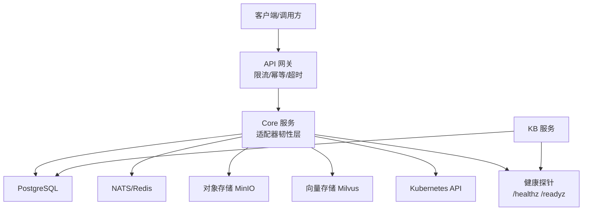
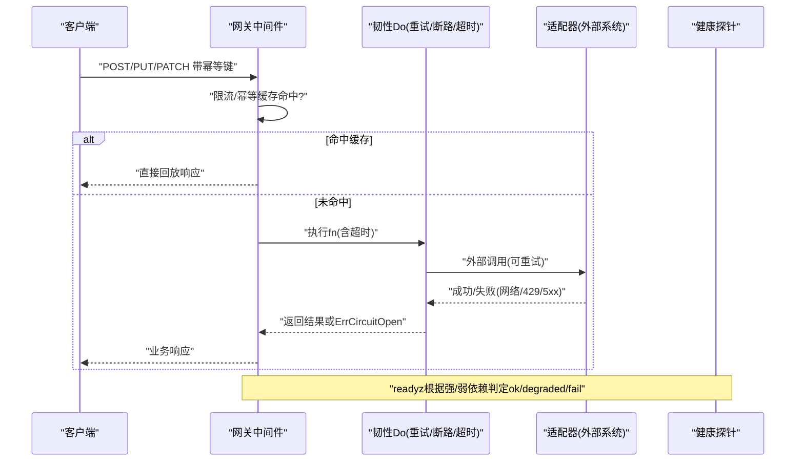
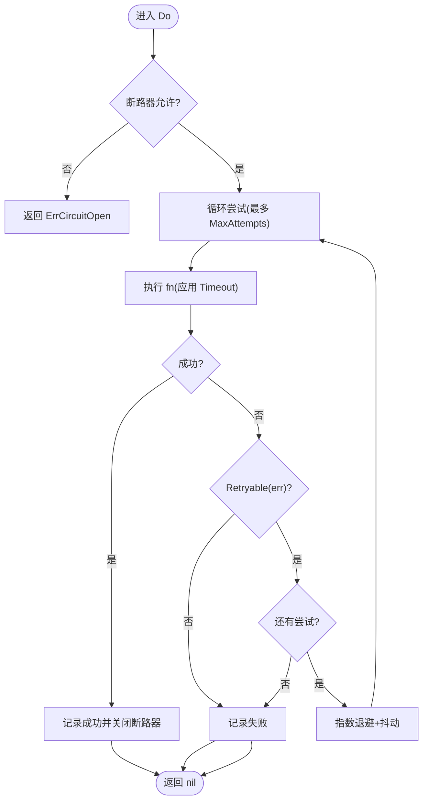
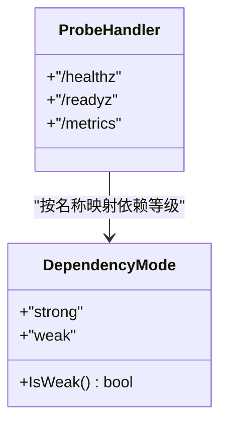
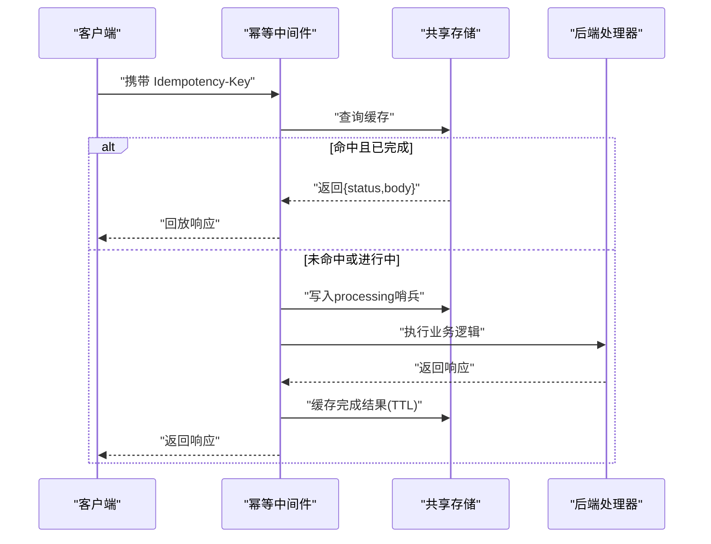
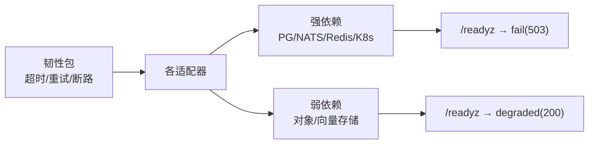

# 应急响应与恢复

<cite>
**本文引用的文件**
- [sprint14-core-resilience-plan.md](file://repo/development-records/sprint14-core-resilience-plan.md)
- [resilience.go](file://repo/pkg/adapters/resilience/resilience.go)
- [probes.go](file://repo/pkg/bootstrap/probes.go)
- [degradation.go](file://repo/pkg/adapters/resilience/degradation.go)
- [idempotency.go](file://repo/services/ani-gateway/internal/middleware/idempotency.go)
- [main.py](file://repo/services/kb-service/main.py)
- [instance_service.go](file://repo/pkg/adapters/runtime/instance_service.go)
- [init_schema.sql](file://repo/deploy/migrations/20260501_001_init_schema.sql)
</cite>

## 目录
1. [简介](#简介)
2. [项目结构](#项目结构)
3. [核心组件](#核心组件)
4. [架构总览](#架构总览)
5. [详细组件分析](#详细组件分析)
6. [依赖关系分析](#依赖关系分析)
7. [性能与可用性考量](#性能与可用性考量)
8. [故障场景与应急操作手册](#故障场景与应急操作手册)
9. [回滚策略与版本管理](#回滚策略与版本管理)
10. [备份恢复与数据一致性](#备份恢复与数据一致性)
11. [应急联系人与升级流程](#应急联系人与升级流程)
12. [结论](#结论)

## 简介
本手册面向生产运维与平台工程团队，提供 ANI 平台的标准化应急响应与恢复流程。内容覆盖服务降级、故障转移、数据恢复、版本回滚、备份恢复、数据一致性检查与业务连续性保障等关键主题，并结合仓库中已实现的韧性能力（超时、重试、断路器、健康探测、幂等重放、多端点故障转移）给出可操作的步骤与决策依据。

## 项目结构
ANI 的应急与恢复能力主要分布在以下层次：
- 网关层：限流、幂等响应重放、请求超时控制
- Core 适配层：每调用超时、操作级重试退避、断路器、数据面健康探测、多端点故障转移
- 启动与健康：统一健康探针与就绪探针，区分强依赖与弱依赖的降级语义
- 服务侧：KB 服务的就绪探针与组件状态上报
- 数据与迁移：数据库初始结构与幂等/审计/任务表，支撑回滚与可观测性

图表来源
- [probes.go:37-57](file://repo/pkg/bootstrap/probes.go#L37-L57)
- [idempotency.go:31-125](file://repo/services/ani-gateway/internal/middleware/idempotency.go#L31-L125)
- [resilience.go:89-133](file://repo/pkg/adapters/resilience/resilience.go#L89-L133)
- [main.py:213-232](file://repo/services/kb-service/main.py#L213-L232)

章节来源
- [sprint14-core-resilience-plan.md:168-201](file://repo/development-records/sprint14-core-resilience-plan.md#L168-L201)
- [probes.go:37-57](file://repo/pkg/bootstrap/probes.go#L37-L57)

## 核心组件
- 韧性策略包：提供超时、重试退避、断路器、错误分类与执行封装，供各适配器复用
- 健康探针：统一实现 /healthz 与 /readyz，按强/弱依赖输出 ok/degraded/fail
- 网关中间件：限流、幂等响应重放、并发冲突处理
- 服务就绪：KB 服务暴露 readyz，聚合 DB、Outbox、gRPC 等组件状态
- 实例生命周期：支持容器/VM 的回滚与快照恢复

章节来源
- [resilience.go:13-22](file://repo/pkg/adapters/resilience/resilience.go#L13-L22)
- [resilience.go:56-87](file://repo/pkg/adapters/resilience/resilience.go#L56-L87)
- [resilience.go:89-133](file://repo/pkg/adapters/resilience/resilience.go#L89-L133)
- [probes.go:102-136](file://repo/pkg/bootstrap/probes.go#L102-L136)
- [degradation.go:10-17](file://repo/pkg/adapters/resilience/degradation.go#L10-L17)
- [idempotency.go:31-125](file://repo/services/ani-gateway/internal/middleware/idempotency.go#L31-L125)
- [main.py:213-232](file://repo/services/kb-service/main.py#L213-L232)
- [instance_service.go:1177-1201](file://repo/pkg/adapters/runtime/instance_service.go#L1177-L1201)

## 架构总览
下图展示一次写请求在网关与 Core 中的韧性路径，包括幂等重放、重试、断路器与健康探测对就绪状态的影响。

图表来源
- [idempotency.go:31-125](file://repo/services/ani-gateway/internal/middleware/idempotency.go#L31-L125)
- [resilience.go:89-133](file://repo/pkg/adapters/resilience/resilience.go#L89-L133)
- [probes.go:102-136](file://repo/pkg/bootstrap/probes.go#L102-L136)

## 详细组件分析

### 韧性策略与执行器
- Policy：集中描述超时、最大尝试次数、退避上下限、断路器参数
- Retryable：基于上下文取消/超时、HTTP 状态码、网络错误类型判断是否可重试
- Do：串联超时、重试退避与断路器；open 时短路返回 ErrCircuitOpen
- 断路器：滚动窗口统计失败比，达到阈值后进入 open，冷却后 half-open 试探

图表来源
- [resilience.go:89-133](file://repo/pkg/adapters/resilience/resilience.go#L89-L133)
- [resilience.go:56-87](file://repo/pkg/adapters/resilience/resilience.go#L56-L87)
- [resilience.go:166-223](file://repo/pkg/adapters/resilience/resilience.go#L166-L223)

章节来源
- [resilience.go:13-22](file://repo/pkg/adapters/resilience/resilience.go#L13-L22)
- [resilience.go:56-87](file://repo/pkg/adapters/resilience/resilience.go#L56-L87)
- [resilience.go:89-133](file://repo/pkg/adapters/resilience/resilience.go#L89-L133)
- [resilience.go:166-223](file://repo/pkg/adapters/resilience/resilience.go#L166-L223)

### 健康探针与降级语义
- /healthz：进程健康
- /readyz：聚合依赖检查，强依赖失败→fail(503)，弱依赖失败→degraded(200)
- 依赖等级：object-store、vector-store 为弱依赖；其余默认强依赖

图表来源
- [probes.go:37-57](file://repo/pkg/bootstrap/probes.go#L37-L57)
- [probes.go:102-136](file://repo/pkg/bootstrap/probes.go#L102-L136)
- [degradation.go:10-17](file://repo/pkg/adapters/resilience/degradation.go#L10-L17)

章节来源
- [probes.go:102-136](file://repo/pkg/bootstrap/probes.go#L102-L136)
- [degradation.go:10-17](file://repo/pkg/adapters/resilience/degradation.go#L10-L17)

### 网关幂等与限流
- 幂等：对 POST/PUT/PATCH/DELETE 使用共享存储缓存首次响应，重复请求直接回放；并发处理中返回冲突
- 限流：基于共享存储的窗口计数，超限返回 429
- 超时：通过 resilience 包注入每次调用超时

图表来源
- [idempotency.go:31-125](file://repo/services/ani-gateway/internal/middleware/idempotency.go#L31-L125)

章节来源
- [idempotency.go:31-125](file://repo/services/ani-gateway/internal/middleware/idempotency.go#L31-L125)
- [sprint14-core-resilience-plan.md:299-327](file://repo/development-records/sprint14-core-resilience-plan.md#L299-L327)

### 服务就绪（KB 服务）
- 暴露 /readyz，聚合 DB、Outbox、gRPC 等组件状态，缓存为 best-effort 不影响 ok 判定

章节来源
- [main.py:213-232](file://repo/services/kb-service/main.py#L213-L232)

### 实例回滚与快照恢复
- 容器：通过 revision 历史进行回滚，记录 rollout 状态与历史事件
- VM：通过 snapshot_id 指定快照进行回滚，校验快照有效性

章节来源
- [instance_service.go:1177-1201](file://repo/pkg/adapters/runtime/instance_service.go#L1177-L1201)
- [instance_service.go:1925-1954](file://repo/pkg/adapters/runtime/instance_service.go#L1925-L1954)

## 依赖关系分析
- 强依赖：Postgres、NATS、Redis、Kubernetes API（不可用→503）
- 弱依赖：对象存储、向量存储（不可用→降级模式）
- 适配器韧性：超时、重试、断路器统一由 resilience 包提供，被各适配器复用
- 健康探针：将依赖等级映射到就绪状态，便于上游负载均衡与流量治理

图表来源
- [probes.go:144-218](file://repo/pkg/bootstrap/probes.go#L144-L218)
- [degradation.go:10-17](file://repo/pkg/adapters/resilience/degradation.go#L10-L17)
- [resilience.go:89-133](file://repo/pkg/adapters/resilience/resilience.go#L89-L133)

章节来源
- [probes.go:144-218](file://repo/pkg/bootstrap/probes.go#L144-L218)
- [degradation.go:10-17](file://repo/pkg/adapters/resilience/degradation.go#L10-L17)

## 性能与可用性考量
- 超时：避免线程/连接耗尽，建议为所有外部调用设置合理超时
- 重试：仅对幂等操作启用，结合指数退避与抖动降低雪崩风险
- 断路器：持续失败快速熔断，冷却后半开探测，防止放大故障
- 健康探针：上游负载均衡根据 /readyz 状态摘除不健康实例
- 幂等：网关层统一幂等重放，减少重复副作用与数据不一致风险

[本节为通用指导，不直接分析具体文件]

## 故障场景与应急操作手册

### 数据库故障（Postgres 不可用）
- 现象：/readyz 返回 fail，HTTP 503；强依赖检查失败
- 应急步骤：
  - 确认 PG 集群状态与主从切换情况
  - 若主库不可用，切换到只读副本或备用实例（需拓扑就绪）
  - 观察 /readyz 恢复为 ok 后再恢复流量
  - 核查审计日志与异步任务队列，必要时清理死信任务
- 参考依据：
  - 强依赖判定与就绪状态映射
  - 异步任务幂等与租约机制

章节来源
- [probes.go:144-157](file://repo/pkg/bootstrap/probes.go#L144-L157)
- [init_schema.sql:354-390](file://repo/deploy/migrations/20260501_001_init_schema.sql#L354-L390)

### 存储不可用（对象存储/向量存储）
- 现象：/readyz 返回 degraded，HTTP 200；相关功能降级
- 应急步骤：
  - 优先恢复弱依赖（对象/向量存储），同时限制非关键流量
  - 若无法立即恢复，启用降级策略（如跳过检索/索引增强功能）
  - 验证多端点故障转移是否生效（MinIO/Milvus endpoint list）
- 参考依据：
  - 弱依赖降级语义
  - 多端点配置与 fallback

章节来源
- [probes.go:180-203](file://repo/pkg/bootstrap/probes.go#L180-L203)
- [degradation.go:10-17](file://repo/pkg/adapters/resilience/degradation.go#L10-L17)
- [sprint14-core-resilience-plan.md:450-473](file://repo/development-records/sprint14-core-resilience-plan.md#L450-L473)

### 服务崩溃（Core/Gateway/KB）
- 现象：/healthz 或 /readyz 异常；负载摘除
- 应急步骤：
  - 重启实例或滚动更新到稳定版本
  - 检查幂等缓存与限流状态，避免风暴
  - 观察重试与断路器状态，确认无持续失败
- 参考依据：
  - 健康探针与就绪探针
  - 幂等与限流中间件

章节来源
- [probes.go:37-57](file://repo/pkg/bootstrap/probes.go#L37-L57)
- [idempotency.go:31-125](file://repo/services/ani-gateway/internal/middleware/idempotency.go#L31-L125)

### 外部 API 不稳定（Kubernetes API/第三方 HTTP）
- 现象：大量 429/5xx 或网络错误
- 应急步骤：
  - 启用重试与断路器，限制最大尝试次数与退避上限
  - 若持续失败，触发断路器 open，保护下游
  - 检查健康探针与路由策略，隔离受影响区域
- 参考依据：
  - 重试与断路器实现
  - 健康探针

章节来源
- [resilience.go:56-87](file://repo/pkg/adapters/resilience/resilience.go#L56-L87)
- [resilience.go:89-133](file://repo/pkg/adapters/resilience/resilience.go#L89-L133)
- [probes.go:102-136](file://repo/pkg/bootstrap/probes.go#L102-L136)

### 数据面健康异常（Object/Vector/K8s）
- 现象：/readyz 中对应检查项 fail/degraded
- 应急步骤：
  - 定位具体依赖（对象/向量/K8s）并恢复
  - 若为弱依赖，先降级再恢复；强依赖必须尽快恢复
  - 验证恢复后 /readyz 状态回归正常
- 参考依据：
  - 数据面健康检查接入

章节来源
- [probes.go:180-218](file://repo/pkg/bootstrap/probes.go#L180-L218)

## 回滚策略与版本管理

### 容器与 VM 回滚
- 容器：通过 revision 历史选择目标版本进行回滚，记录 rollout 状态与历史事件
- VM：通过 snapshot_id 指定快照进行回滚，校验快照有效性
- 操作前准备：
  - 确认目标版本/快照存在且有效
  - 评估影响范围与回滚窗口
- 操作步骤：
  - 提交回滚请求（携带幂等键）
  - 监控回滚过程与状态变更
  - 验证服务可用性与数据一致性
- 参考依据：
  - 回滚入口与校验逻辑
  - 快照查找与匹配

章节来源
- [instance_service.go:1177-1201](file://repo/pkg/adapters/runtime/instance_service.go#L1177-L1201)
- [instance_service.go:1925-1954](file://repo/pkg/adapters/runtime/instance_service.go#L1925-L1954)

### 平台版本回滚
- 升级历史：记录 from_version、to_version、状态与错误信息
- 回滚策略：
  - 若新版本导致严重问题，优先回滚到上一个稳定版本
  - 回滚前备份当前配置与数据快照
  - 回滚后验证 /readyz 与关键业务接口
- 参考依据：
  - 升级历史表结构

章节来源
- [init_schema.sql:476-489](file://repo/deploy/migrations/20260501_001_init_schema.sql#L476-L489)

## 备份恢复与数据一致性

### 数据库备份与恢复
- 备份策略：
  - 定期全量备份与增量 WAL 归档
  - 备份前确保事务一致性与锁释放
- 恢复流程：
  - 停止写入或切换到只读模式
  - 恢复到目标时间点或快照
  - 验证数据完整性与一致性
  - 逐步恢复写入并观察 /readyz
- 参考依据：
  - 初始结构与权限模型
  - 审计与任务表用于追踪与补偿

章节来源
- [init_schema.sql:12-27](file://repo/deploy/migrations/20260501_001_init_schema.sql#L12-L27)
- [init_schema.sql:354-390](file://repo/deploy/migrations/20260501_001_init_schema.sql#L354-L390)

### 对象存储与向量存储恢复
- 对象存储：
  - 利用多端点故障转移与 LB/VIP 提升可用性
  - 恢复后验证 GET / 健康检查
- 向量存储：
  - 使用 Health() 列表集合进行健康检查
  - 恢复后验证检索能力
- 参考依据：
  - 多端点配置与 fallback
  - 健康检查实现

章节来源
- [sprint14-core-resilience-plan.md:450-473](file://repo/development-records/sprint14-core-resilience-plan.md#L450-L473)
- [probes.go:180-203](file://repo/pkg/bootstrap/probes.go#L180-L203)

### 数据一致性检查
- 幂等键：确保重复请求不产生副作用
- Outbox：保证“写 DB + 发事件”的原子性
- 审计日志：追踪关键操作与结果
- 参考依据：
  - Outbox 表结构与发布机制
  - 审计日志表结构

章节来源
- [init_schema.sql:391-407](file://repo/deploy/migrations/20260501_001_init_schema.sql#L391-L407)
- [init_schema.sql:499-523](file://repo/deploy/migrations/20260501_001_init_schema.sql#L499-L523)

## 应急联系人与升级流程
- 角色分工：
  - 一线值班：负责初步诊断与告警响应
  - 二线专家：深入排查与修复方案制定
  - 三线厂商：外部系统（PG/MinIO/Milvus/K8s）支持与协调
- 升级流程：
  - 发现故障 → 记录时间线与现象 → 初步止血（限流/降级/熔断）
  - 评估影响范围 → 制定恢复方案（回滚/切换/恢复）
  - 执行恢复 → 验证 /readyz 与关键接口 → 复盘与改进
- 沟通渠道：
  - 内部群/电话会议/工单系统
  - 对外公告与用户通知（必要时）

[本节为通用流程说明，不直接分析具体文件]

## 结论
ANI 平台已在网关与 Core 层构建了较为完善的韧性基础：超时、重试、断路器、健康探针、幂等重放与多端点故障转移。结合本手册的应急流程，可在数据库、存储、服务崩溃等常见故障场景下快速止血与恢复，并通过回滚与备份恢复保障业务连续性与数据一致性。建议在真实环境中持续演练与验证，确保预案有效可靠。