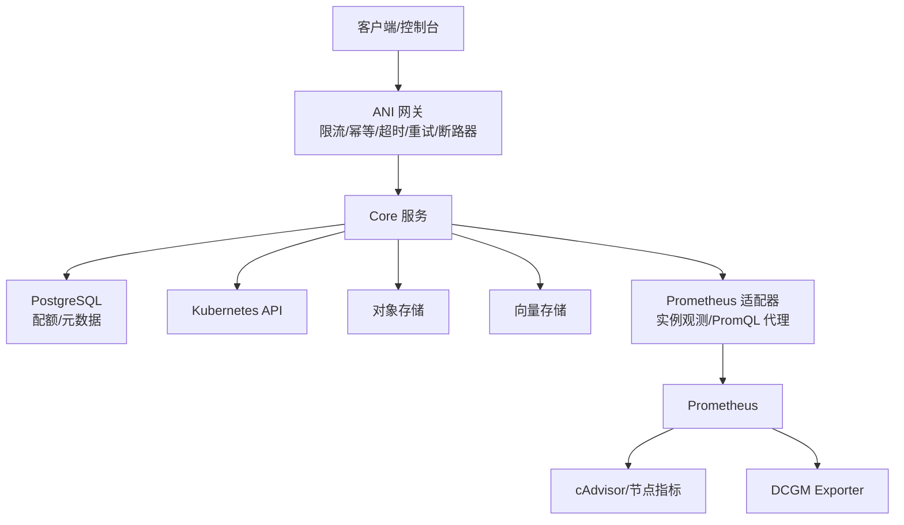
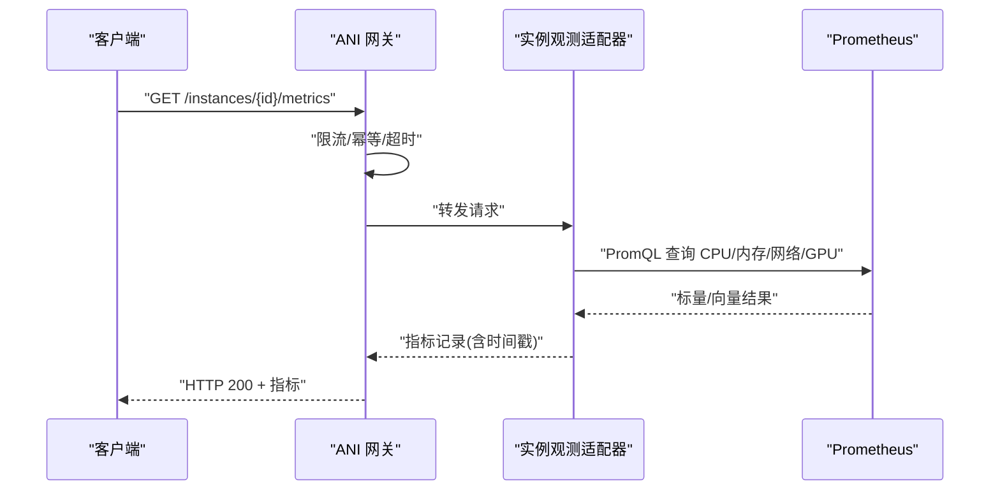
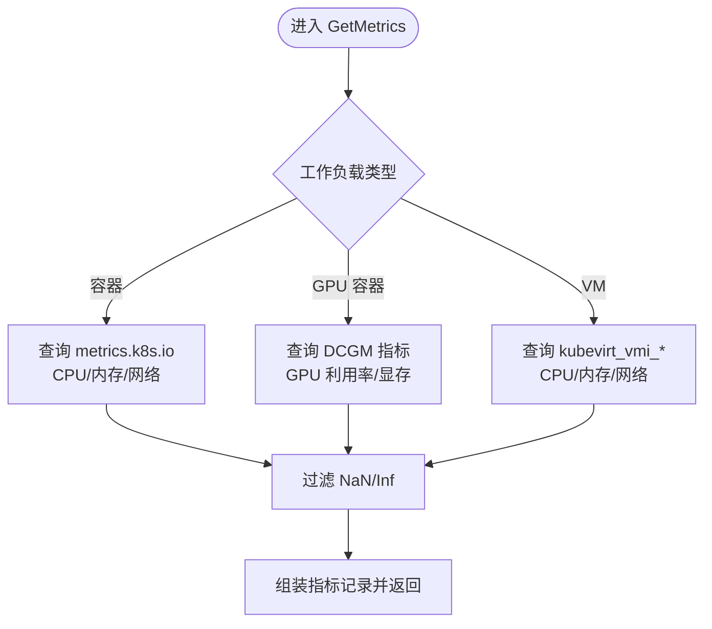
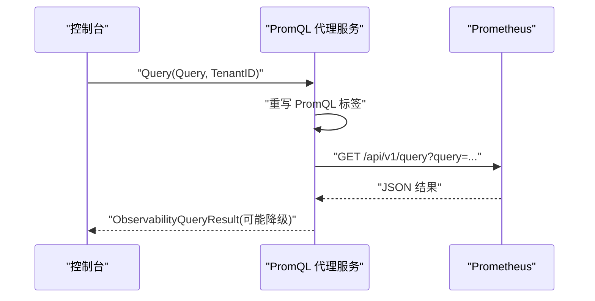
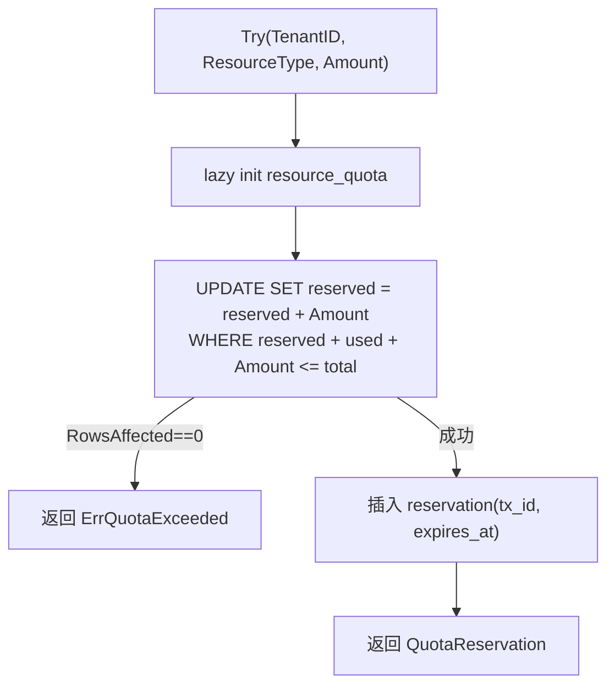
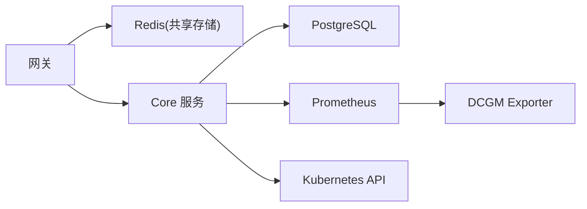

# 性能问题排查

<cite>
**本文引用的文件**
- [prometheus_instance_observability.go](file://repo/pkg/adapters/runtime/prometheus_instance_observability.go)
- [prometheus_observability_service.go](file://repo/pkg/adapters/runtime/prometheus_observability_service.go)
- [postgres_quota.go](file://repo/pkg/adapters/runtime/postgres_quota.go)
- [sprint14-core-resilience-plan.md](file://repo/development-records/sprint14-core-resilience-plan.md)
- [instance-observability-completion-b2-prometheus-dcgm-scrape.md](file://repo/development-records/instance-observability-completion-b2-prometheus-dcgm-scrape.md)
- [validate_gpu_inventory_live_gate.py](file://repo/scripts/validate_gpu_inventory_live_gate.py)
- [kb-service main.py](file://repo/services/kb-service/main.py)
- [gpu_inventory_resources.go](file://repo/services/ani-gateway/internal/router/gpu_inventory_resources.go)
</cite>

## 目录
1. [引言](#引言)
2. [项目结构](#项目结构)
3. [核心组件](#核心组件)
4. [架构总览](#架构总览)
5. [详细组件分析](#详细组件分析)
6. [依赖关系分析](#依赖关系分析)
7. [性能考虑](#性能考虑)
8. [故障排查指南](#故障排查指南)
9. [结论](#结论)
10. [附录](#附录)

## 引言
本指南面向生产环境中的性能问题排查，覆盖 CPU 使用率过高、内存泄漏、数据库慢查询、网络延迟等典型场景。结合仓库中已有的可观测性适配层（Prometheus 指标采集与实例观测）、PostgreSQL 配额与事务实现、网关韧性（限流、幂等、超时、重试、断路器、降级）以及 GPU 指标采集配置，提供从“识别瓶颈 → 定位根因 → 制定优化策略 → 验证回归”的完整方法论，并给出 Prometheus/Grafana 指标定义与阈值建议、pprof/火焰图/分布式追踪的使用要点、容量规划与压测方法。

## 项目结构
本项目在可观测性与韧性方面具备良好基础：
- 可观测性：通过 Prometheus 适配器获取容器/VM 指标、GPU DCGM 指标，并提供 PromQL 代理查询能力。
- 数据面健康：readyz 探针区分强/弱依赖，支持优雅降级。
- 网关韧性：限流、幂等重放、每调用超时、重试退避、断路器、多端点 failover。
- 存储与配额：PostgreSQL 配额 TCC 预占/实扣、行级锁串行化、批量操作与幂等。
- GPU 资源：DCGM exporter scrape 接入，GPU 利用率/显存指标可被 Prometheus 采集。

图表来源
- [prometheus_instance_observability.go:155-251](file://repo/pkg/adapters/runtime/prometheus_instance_observability.go#L155-L251)
- [prometheus_observability_service.go:94-176](file://repo/pkg/adapters/runtime/prometheus_observability_service.go#L94-L176)
- [sprint14-core-resilience-plan.md:237-263](file://repo/development-records/sprint14-core-resilience-plan.md#L237-L263)
- [instance-observability-completion-b2-prometheus-dcgm-scrape.md:11-29](file://repo/development-records/instance-observability-completion-b2-prometheus-dcgm-scrape.md#L11-L29)

章节来源
- [prometheus_instance_observability.go:155-251](file://repo/pkg/adapters/runtime/prometheus_instance_observability.go#L155-L251)
- [prometheus_observability_service.go:94-176](file://repo/pkg/adapters/runtime/prometheus_observability_service.go#L94-L176)
- [sprint14-core-resilience-plan.md:237-263](file://repo/development-records/sprint14-core-resilience-plan.md#L237-L263)
- [instance-observability-completion-b2-prometheus-dcgm-scrape.md:11-29](file://repo/development-records/instance-observability-completion-b2-prometheus-dcgm-scrape.md#L11-L29)

## 核心组件
- 实例观测适配器：从 Prometheus 拉取 CPU/内存/网络/GPU 指标，兼容容器与 VM 两种工作负载；对 NaN/Inf 做安全过滤，避免序列化异常。
- PromQL 代理服务：将前端模板注入的 namespace/pod/name 重写为真实值后转发到 Prometheus，失败时降级返回空结果并标注 DevProfile。
- PostgreSQL 配额服务：TCC 预占/实扣状态机，单行原子 UPDATE + 行锁串行化，批量 TryMany 保证一致性；Put/List/GetMy 等接口支持 RLS 隔离与平台/租户事务。
- 网关韧性中间件：限流（共享存储窗口计数）、幂等响应重放（Redis TTL 缓存）、每调用超时、重试退避、断路器、优雅降级、多端点 failover。
- GPU 指标采集：Prometheus 新增 DCGM exporter scrape job，暴露 GPU 利用率与显存指标，供适配器查询。

章节来源
- [prometheus_instance_observability.go:155-251](file://repo/pkg/adapters/runtime/prometheus_instance_observability.go#L155-L251)
- [prometheus_observability_service.go:94-176](file://repo/pkg/adapters/runtime/prometheus_observability_service.go#L94-L176)
- [postgres_quota.go:51-155](file://repo/pkg/adapters/runtime/postgres_quota.go#L51-L155)
- [sprint14-core-resilience-plan.md:268-358](file://repo/development-records/sprint14-core-resilience-plan.md#L268-L358)
- [instance-observability-completion-b2-prometheus-dcgm-scrape.md:11-29](file://repo/development-records/instance-observability-completion-b2-prometheus-dcgm-scrape.md#L11-L29)

## 架构总览
下图展示一次实例指标查询的关键路径：控制台发起请求 → 网关限流/幂等/超时 → Core 路由到实例观测适配器 → 适配器向 Prometheus 查询 → 解析指标并返回。

图表来源
- [prometheus_instance_observability.go:155-251](file://repo/pkg/adapters/runtime/prometheus_instance_observability.go#L155-L251)
- [prometheus_observability_service.go:94-176](file://repo/pkg/adapters/runtime/prometheus_observability_service.go#L94-L176)
- [sprint14-core-resilience-plan.md:268-358](file://repo/development-records/sprint14-core-resilience-plan.md#L268-L358)

## 详细组件分析

### 组件A：实例观测适配器（CPU/内存/网络/GPU）
- 功能要点
  - 容器分支：通过 metrics.k8s.io 导出器获取 CPU/内存/网络；GPU 分支通过 DCGM 指标获取利用率与显存。
  - VM 分支：通过 kubevirt_vmi_* 指标计算 CPU 使用率、内存驻留、已用/总量、网络收发。
  - 安全处理：过滤 NaN/Inf，避免序列化异常；缺失字段保持 nil，不伪造 0。
- 复杂度与性能
  - 每次查询执行多次 PromQL 标量查询，注意 step/window 选择与标签匹配正则开销。
  - 聚合 sum() 消除多 series 非确定性，减少抖动。
- 错误处理
  - 单个 exporter 不可用时不阻塞其他字段采集；Prometheus 查询失败返回错误并标记降级。

图表来源
- [prometheus_instance_observability.go:155-251](file://repo/pkg/adapters/runtime/prometheus_instance_observability.go#L155-L251)

章节来源
- [prometheus_instance_observability.go:155-251](file://repo/pkg/adapters/runtime/prometheus_instance_observability.go#L155-L251)

### 组件B：PromQL 代理服务（Prometheus 代理查询）
- 功能要点
  - 重写前端模板中的 namespace/pod/name label 为真实值，再转发到 Prometheus /api/v1/query 或 /api/v1/query_range。
  - 失败时降级为空结果，DevProfile 标注原因，便于前端/运维区分“无数据”和“链路降级”。
- 性能与稳定性
  - HTTP 客户端默认超时；NaN/Inf 采样点过滤；未知 resultType 回退 vector。
- 集成点
  - 需要 InstanceLookup 以解析 instance_id 对应的 tenant_id、namespace、pod 名前缀。

图表来源
- [prometheus_observability_service.go:94-176](file://repo/pkg/adapters/runtime/prometheus_observability_service.go#L94-L176)

章节来源
- [prometheus_observability_service.go:94-176](file://repo/pkg/adapters/runtime/prometheus_observability_service.go#L94-L176)

### 组件C：PostgreSQL 配额服务（TCC 预占/实扣）
- 功能要点
  - Try/TryMany：单行原子 UPDATE + WHERE 校验余量，防止超卖；TryMany 在同一事务内循环，任一失败整体回滚。
  - Confirm/Cancel/Release：幂等状态机，WHERE state='reserved'/'confirmed' 守卫重复操作；释放/确认转账在同一事务。
  - Put/List/GetMy：平台/租户事务隔离，RLS 自动过滤；List 支持 keyset 分页。
- 性能与并发
  - FOR UPDATE 行锁串行化关键路径；批量操作减少往返；cursor 分页避免深翻页。
- 错误处理
  - 区分“流水不存在”与“流水存在但状态已变更”，避免静默吞错。

图表来源
- [postgres_quota.go:51-155](file://repo/pkg/adapters/runtime/postgres_quota.go#L51-L155)

章节来源
- [postgres_quota.go:51-155](file://repo/pkg/adapters/runtime/postgres_quota.go#L51-L155)

### 组件D：GPU 指标采集与验证
- 采集配置：Prometheus ConfigMap 新增 dcgm-exporter scrape job，暴露 GPU 利用率与显存指标。
- 验证脚本：检查 Core /gpu-inventory/occupancy 与 DCGM 指标可用性，输出证据 JSON。
- 用途：为实例观测适配器提供 GPU 维度指标，支撑 GPU 性能分析与容量规划。

章节来源
- [instance-observability-completion-b2-prometheus-dcgm-scrape.md:11-29](file://repo/development-records/instance-observability-completion-b2-prometheus-dcgm-scrape.md#L11-L29)
- [validate_gpu_inventory_live_gate.py:284-324](file://repo/scripts/validate_gpu_inventory_live_gate.py#L284-L324)

## 依赖关系分析
- 网关韧性依赖 Redis 作为共享存储后端，用于限流计数与幂等重放缓存。
- 实例观测适配器依赖 Prometheus 与 Kubernetes API；VM 分支依赖 kubevirt 指标。
- 配额服务依赖 PostgreSQL，使用 RLS 与事务保证一致性与隔离。
- GPU 指标依赖 DCGM Exporter 与 Prometheus scrape 配置。

图表来源
- [sprint14-core-resilience-plan.md:237-263](file://repo/development-records/sprint14-core-resilience-plan.md#L237-L263)
- [prometheus_instance_observability.go:155-251](file://repo/pkg/adapters/runtime/prometheus_instance_observability.go#L155-L251)
- [postgres_quota.go:51-155](file://repo/pkg/adapters/runtime/postgres_quota.go#L51-L155)

章节来源
- [sprint14-core-resilience-plan.md:237-263](file://repo/development-records/sprint14-core-resilience-plan.md#L237-L263)
- [prometheus_instance_observability.go:155-251](file://repo/pkg/adapters/runtime/prometheus_instance_observability.go#L155-L251)
- [postgres_quota.go:51-155](file://repo/pkg/adapters/runtime/postgres_quota.go#L51-L155)

## 性能考虑
- 指标采集与查询
  - 使用 sum() 聚合消除多 series 非确定性；合理设置 PromQL 的 window/step，避免过大范围导致查询缓慢。
  - 对 NaN/Inf 进行过滤，避免序列化异常与前端渲染问题。
- 数据库查询
  - 使用 keyset 分页（cursor）替代 offset 分页，避免深翻页性能退化。
  - 批量操作（TryMany）减少往返；FOR UPDATE 行锁串行化关键路径，避免超卖。
- 网络与外部依赖
  - 每调用超时保护线程/协程不被长尾请求占用；重试退避仅用于幂等操作；断路器避免雪崩。
  - 多端点 failover 在网络错误、429、5xx 时尝试下一个 endpoint。
- 容量规划
  - 基于 Prometheus 指标（CPU/内存/网络/GPU）建立容量基线；结合 DCGM 指标评估 GPU 池利用率与瓶颈。
  - 配额服务可用于限制租户资源使用，防止单租户打满集群。

[本节为通用指导，不直接分析具体文件]

## 故障排查指南

### CPU 使用率过高
- 现象
  - 实例 CPUUtilizationPct 持续高位；PromQL 查询耗时增加。
- 定位步骤
  - 通过实例观测适配器查询 CPU 指标，确认是否为特定实例/容器/VM。
  - 检查 PromQL 是否使用了过大的 window/step；必要时缩小范围或优化查询。
  - 查看网关限流是否生效（429），是否存在突发流量未受控。
- 缓解措施
  - 调整 PromQL 查询参数；启用/调优网关限流；对热点实例进行扩容或隔离。

章节来源
- [prometheus_instance_observability.go:182-221](file://repo/pkg/adapters/runtime/prometheus_instance_observability.go#L182-L221)
- [sprint14-core-resilience-plan.md:268-295](file://repo/development-records/sprint14-core-resilience-plan.md#L268-L295)

### 内存泄漏
- 现象
  - 实例 MemoryUsedMB 持续增长；MemoryTotalMB 不变或增长缓慢。
- 定位步骤
  - 通过实例观测适配器查询内存指标；对比 limit（container_spec_memory_limit_bytes）判断是否接近上限。
  - 检查是否有大对象分配或连接池未释放；查看日志与事件。
- 缓解措施
  - 调整容器内存 limit；修复代码中的内存泄漏；增加监控告警阈值。

章节来源
- [prometheus_instance_observability.go:192-207](file://repo/pkg/adapters/runtime/prometheus_instance_observability.go#L192-L207)

### 数据库慢查询
- 现象
  - 配额相关操作（Try/Confirm/Release）耗时增加；PG 连接池压力上升。
- 定位步骤
  - 检查 SQL 是否命中索引；使用 keyset 分页避免深翻页。
  - 观察 FOR UPDATE 行锁竞争；批量操作是否合理。
- 缓解措施
  - 优化 SQL；引入批处理；调整 PG 连接池大小与超时；必要时分库分表。

章节来源
- [postgres_quota.go:403-513](file://repo/pkg/adapters/runtime/postgres_quota.go#L403-L513)
- [postgres_quota.go:51-155](file://repo/pkg/adapters/runtime/postgres_quota.go#L51-L155)

### 网络延迟
- 现象
  - 外部调用（MinIO/Milvus/K8s REST）超时或失败；网关出现大量 429/5xx。
- 定位步骤
  - 检查每调用超时配置；查看重试与断路器状态；确认多端点 failover 是否生效。
  - 使用 readyz 探针判断强/弱依赖健康状态。
- 缓解措施
  - 调整超时/重试/断路器参数；启用多端点配置；对弱依赖实施降级策略。

章节来源
- [sprint14-core-resilience-plan.md:331-419](file://repo/development-records/sprint14-core-resilience-plan.md#L331-L419)

### GPU 指标不可用
- 现象
  - GPU 利用率/显存指标缺失；实例观测返回 nil。
- 定位步骤
  - 检查 Prometheus 是否采集到 DCGM 指标；验证 scrape job 配置。
  - 使用验证脚本检查 Core /gpu-inventory/occupancy 与 DCGM 指标可用性。
- 缓解措施
  - 修正 scrape 配置；确保 DCGM Exporter 正常运行；必要时重启或替换节点。

章节来源
- [instance-observability-completion-b2-prometheus-dcgm-scrape.md:11-29](file://repo/development-records/instance-observability-completion-b2-prometheus-dcgm-scrape.md#L11-L29)
- [validate_gpu_inventory_live_gate.py:284-324](file://repo/scripts/validate_gpu_inventory_live_gate.py#L284-L324)

### 服务就绪与健康
- 现象
  - readyz 返回 degraded 或 fail；部分功能不可用。
- 定位步骤
  - 检查 kb-service readyz 组件状态（DB、Outbox、gRPC）。
  - 检查 Core 数据面健康（ObjectStore/VectorStore/K8sClusterService）。
- 缓解措施
  - 修复依赖组件；对弱依赖实施降级；对强依赖实施熔断与告警。

章节来源
- [kb-service main.py:218-232](file://repo/services/kb-service/main.py#L218-L232)
- [sprint14-core-resilience-plan.md:362-370](file://repo/development-records/sprint14-core-resilience-plan.md#L362-L370)

## 结论
本项目在可观测性与韧性方面具备坚实基础：Prometheus 指标采集与实例观测适配器提供细粒度性能视图；PostgreSQL 配额服务保障资源隔离与一致性；网关韧性中间件提供限流、幂等、超时、重试、断路器与降级能力。结合 DCGM GPU 指标采集，可全面覆盖 CPU/内存/网络/GPU 的性能排查与优化。建议在生产环境中持续完善指标采集、告警阈值与压测流程，确保系统在高负载下的稳定性与可扩展性。

[本节为总结，不直接分析具体文件]

## 附录

### Prometheus 指标定义与阈值建议
- CPU 使用率
  - 指标：container_cpu_usage_seconds_total（容器）、kubevirt_vmi_cpu_usage_seconds_total（VM）
  - 阈值：持续 >80% 触发告警；>90% 需扩容或优化
- 内存使用
  - 指标：container_memory_working_set_bytes（容器）、kubevirt_vmi_memory_domain_bytes/usable_bytes（VM）
  - 阈值：used/limit >80% 告警；接近 limit 需扩容或修复泄漏
- 网络 I/O
  - 指标：container_network_receive/transmit_bytes_total（容器）、kubevirt_vmi_network_*（VM）
  - 阈值：带宽饱和或丢包率升高时需优化网络或扩容
- GPU 指标
  - 指标：DCGM_FI_DEV_GPU_UTIL、DCGM_FI_DEV_FB_USED/FREE
  - 阈值：利用率 >85% 告警；显存使用 >90% 告警

章节来源
- [prometheus_instance_observability.go:182-251](file://repo/pkg/adapters/runtime/prometheus_instance_observability.go#L182-L251)
- [instance-observability-completion-b2-prometheus-dcgm-scrape.md:11-29](file://repo/development-records/instance-observability-completion-b2-prometheus-dcgm-scrape.md#L11-L29)

### Grafana 仪表板配置建议
- 创建实例级仪表板：包含 CPU/内存/网络/GPU 曲线图
- 添加告警规则：基于上述阈值配置通知渠道
- 使用 PromQL 代理服务统一查询 namespace/pod/name 标签，避免前端拼接错误

章节来源
- [prometheus_observability_service.go:94-176](file://repo/pkg/adapters/runtime/prometheus_observability_service.go#L94-L176)

### pprof、火焰图与分布式追踪
- pprof
  - 在 Go 服务中启用 pprof 端点，定期采集 CPU/内存 profile
  - 使用 go tool pprof 分析热点函数与内存分配
- 火焰图
  - 基于 pprof 生成火焰图，定位 CPU 热点与调用栈
- 分布式追踪
  - 在网关与服务间注入 trace ID，串联请求链路
  - 结合 Prometheus 指标与日志，快速定位慢调用与错误

[本节为通用指导，不直接分析具体文件]

### 容量规划与压测方法
- 容量规划
  - 基于历史指标建立基线；结合业务增长预测资源需求
  - 使用配额服务限制租户资源，防止单租户影响全局
- 压测方法
  - 使用工具模拟高并发请求，观察网关限流与后端处理能力
  - 逐步增加负载，记录 QPS/RT/错误率，确定瓶颈点
  - 针对数据库、网络、GPU 分别进行专项压测

[本节为通用指导，不直接分析具体文件]