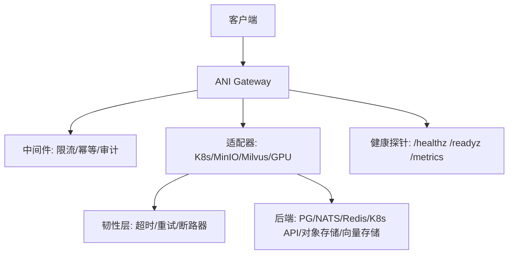
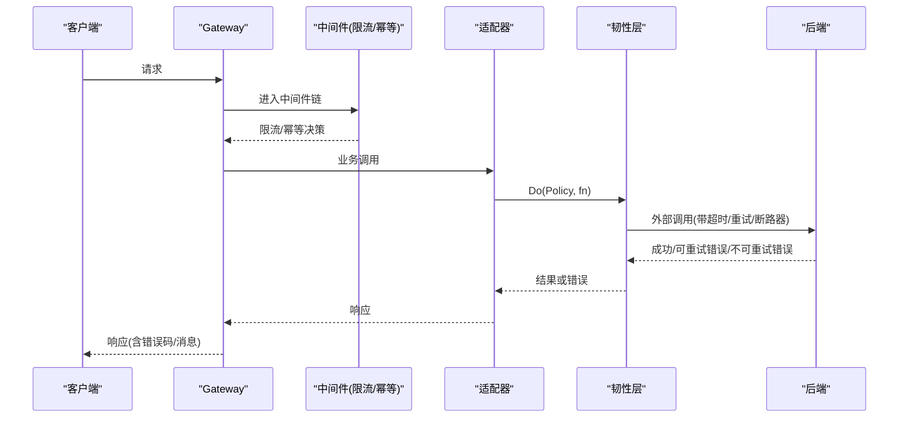
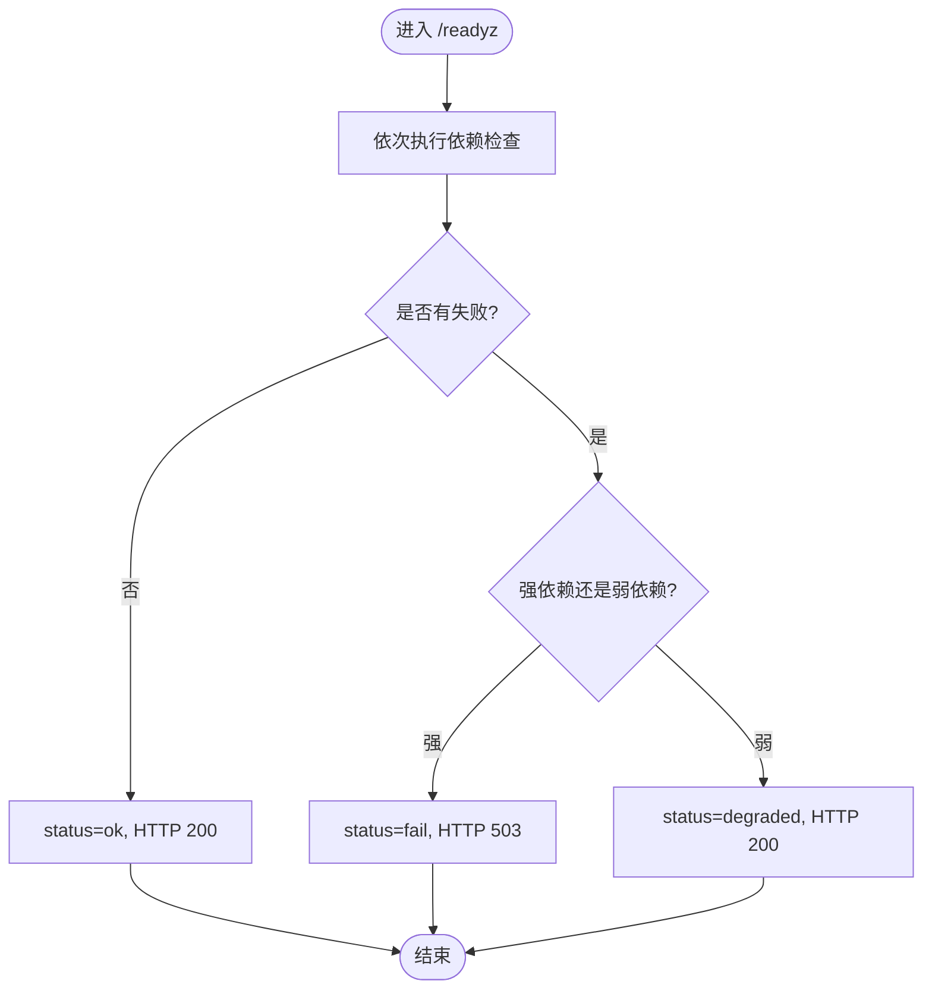
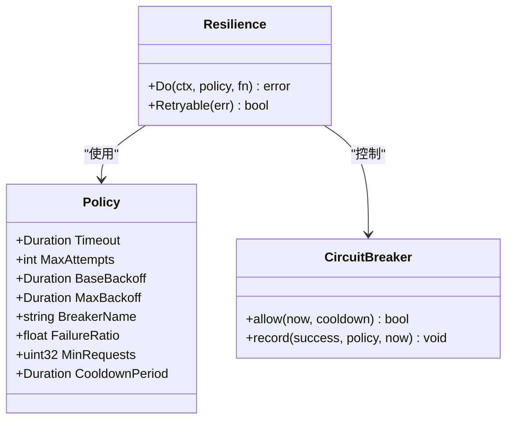
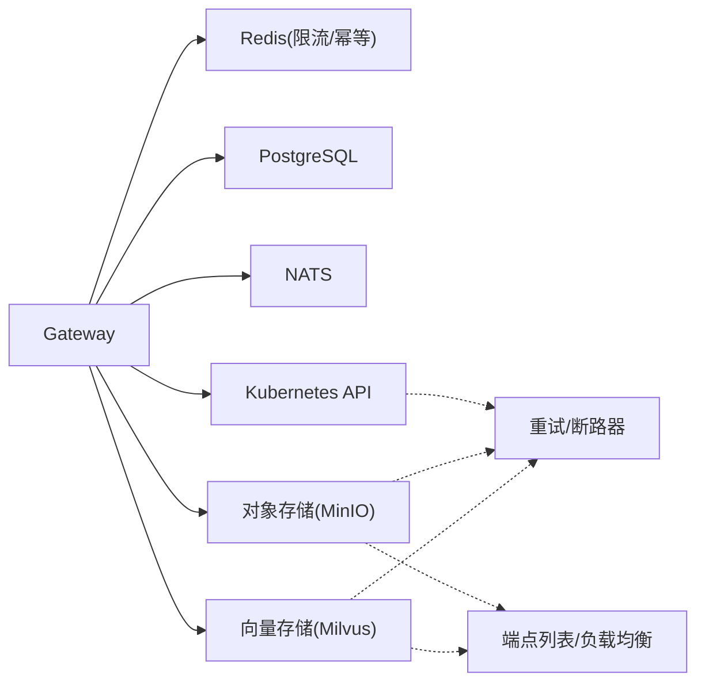

# 故障排查

<cite>
**本文引用的文件**
- [probes.go](file://repo/pkg/bootstrap/probes.go)
- [resilience.go](file://repo/pkg/adapters/resilience/resilience.go)
- [main.go（ani-gateway）](file://repo/services/ani-gateway/main.go)
- [errors.go](file://repo/pkg/types/errors.go)
- [cache_store.go](file://repo/pkg/ports/cache_store.go)
- [sprint14-core-resilience-plan.md](file://repo/development-records/sprint14-core-resilience-plan.md)
- [validate_gpu_inventory_live_gate.py](file://repo/scripts/validate_gpu_inventory_live_gate.py)
- [real-k8s-lab-k8s-kubeovn-kubevirt-bootstrap.md](file://repo/development-records/real-k8s-lab-k8s-kubeovn-kubevirt-bootstrap.md)
</cite>

## 目录
1. [简介](#简介)
2. [项目结构](#项目结构)
3. [核心组件](#核心组件)
4. [架构总览](#架构总览)
5. [详细组件分析](#详细组件分析)
6. [依赖关系分析](#依赖关系分析)
7. [性能注意事项](#性能注意事项)
8. [故障排查指南](#故障排查指南)
9. [结论](#结论)
10. [附录](#附录)

## 简介
本指南面向安装部署、运行期错误、性能问题与网络问题的快速定位与恢复。内容基于仓库中已实现的健康探测、重试/断路器、多端点故障转移、限流与幂等中间件、结构化错误码以及 live gate 证据体系，提供可操作的排障步骤、日志分析方法、调试技巧与应急流程。

## 项目结构
- Gateway 服务：负责请求路由、鉴权、限流、幂等、审计与运行时装配，连接各适配器（Kubernetes API、对象存储、向量存储、GPU 清单等）。
- Core 健康与韧性：通过 /healthz、/readyz 暴露进程级与数据面依赖健康；resilience 包提供超时、重试、退避与断路器；支持多端点 failover。
- 验证与证据：live gate 脚本对真实环境执行断言并输出脱敏 evidence JSON，用于生产就绪判定与回溯。

**图表来源**
- [main.go（ani-gateway）](file://repo/services/ani-gateway/main.go)
- [probes.go](file://repo/pkg/bootstrap/probes.go)
- [resilience.go](file://repo/pkg/adapters/resilience/resilience.go)

**章节来源**
- [main.go（ani-gateway）](file://repo/services/ani-gateway/main.go)
- [probes.go](file://repo/pkg/bootstrap/probes.go)

## 核心组件
- 健康探针：/healthz 返回进程状态；/readyz 聚合强/弱依赖健康，失败时区分 fail/degraded 并映射 HTTP 状态码；/metrics 暴露 reconcile 指标。
- 韧性策略：统一 Policy 描述超时、重试次数、指数退避、断路器参数；Do 封装调用；Retryable 判定可重试错误；命名断路器按失败比与冷却周期切换 open/half-open。
- 网关中间件：共享 Redis-backed CacheStore 支撑限流窗口计数与幂等响应重放；审计后台写入。
- 结构化错误：ANIError 携带稳定 code/message，HTTPStatusForError 将哨兵错误映射为 HTTP 状态码。

**章节来源**
- [probes.go](file://repo/pkg/bootstrap/probes.go)
- [resilience.go](file://repo/pkg/adapters/resilience/resilience.go)
- [cache_store.go](file://repo/pkg/ports/cache_store.go)
- [errors.go](file://repo/pkg/types/errors.go)

## 架构总览
Gateway 启动时加载各运行时配置，构造 Redis 共享存储，注册中间件与路由，暴露健康与指标端点。数据面依赖通过 ports 接口抽象，由适配器实现 Health(ctx)，并在 readyz 中检测。外部调用经 resilience.Do 包裹，具备超时、重试与断路器保护。

**图表来源**
- [main.go（ani-gateway）](file://repo/services/ani-gateway/main.go)
- [resilience.go](file://repo/pkg/adapters/resilience/resilience.go)

## 详细组件分析

### 健康探针与降级语义
- /healthz：返回进程 ok 与版本。
- /readyz：遍历检查项，强依赖失败 → status=fail + HTTP 503；弱依赖失败 → status=degraded + HTTP 200；未配置端口视为未启用不报错。
- /metrics：输出 reconcile 计数器（ticks/successes/failures/backoff skips）。

**图表来源**
- [probes.go](file://repo/pkg/bootstrap/probes.go)

**章节来源**
- [probes.go](file://repo/pkg/bootstrap/probes.go)

### 韧性层：超时、重试与断路器
- Policy：Timeout、MaxAttempts、BaseBackoff、MaxBackoff、BreakerName、FailureRatio、MinRequests、CooldownPeriod。
- Retryable：上下文取消不可重试；DeadlineExceeded、429/5xx、网络错误/超时/临时错误可重试。
- Do：在断路器允许下执行，失败且可重试则指数退避重试，最终返回最后一次错误；open 时直接返回 ErrCircuitOpen。
- 断路器：滚动窗口统计失败比，达到阈值后 open，冷却后 half-open 探测一次成功即恢复。

**图表来源**
- [resilience.go](file://repo/pkg/adapters/resilience/resilience.go)

**章节来源**
- [resilience.go](file://repo/pkg/adapters/resilience/resilience.go)

### 网关中间件：限流与幂等
- 共享存储：通过 Redis-backed CacheStore 提供 Get/Set/SetNX/Delete/Increment/Exists，支撑跨副本的限流计数与幂等缓存。
- 限流：per-tenant + route-class 窗口计数，超限返回 429。
- 幂等：对 mutating 请求记录 processing 哨兵，完成后缓存响应；重复请求回放响应并加头标识；并发进行中返回 409。

**章节来源**
- [cache_store.go](file://repo/pkg/ports/cache_store.go)
- [sprint14-core-resilience-plan.md](file://repo/development-records/sprint14-core-resilience-plan.md)

### 结构化错误与 HTTP 映射
- ANIError：包含稳定 code、message 与 cause（仅服务端日志）。
- HTTPStatusForError：将哨兵错误映射到标准 HTTP 状态码（404/409/401/403/400/500）。

**章节来源**
- [errors.go](file://repo/pkg/types/errors.go)

## 依赖关系分析
- 健康检查覆盖：postgres、nats、redis、object-store、vector-store、kubernetes-api。
- 适配器韧性：Kubernetes REST 共享客户端支持超时与重试策略；MinIO/Milvus 支持 endpoint list 与 429/5xx/网络错误 fallback。
- 多端点故障转移：Redis 支持 Sentinel/Cluster；MinIO/Milvus 接受端点列表或 LB/VIP，failover 期间复用断路器避免持续打挂掉端点。

**图表来源**
- [probes.go](file://repo/pkg/bootstrap/probes.go)
- [resilience.go](file://repo/pkg/adapters/resilience/resilience.go)
- [sprint14-core-resilience-plan.md](file://repo/development-records/sprint14-core-resilience-plan.md)

**章节来源**
- [probes.go](file://repo/pkg/bootstrap/probes.go)
- [resilience.go](file://repo/pkg/adapters/resilience/resilience.go)
- [sprint14-core-resilience-plan.md](file://repo/development-records/sprint14-core-resilience-plan.md)

## 性能注意事项
- 每调用超时：通过环境变量注入各适配器的 RequestTimeout，避免长尾阻塞。
- 重试与退避：仅对幂等读/观察/dry-run 路径开启重试，写路径不重试，防止放大副作用。
- 断路器：持续失败时快速失败，降低雪崩风险；冷却后半开探测恢复。
- 健康探测：弱依赖降级不影响主流程，但需关注 degraded 告警与指标增长。

[本节为通用指导，无需特定文件引用]

## 故障排查指南

### 一、安装部署问题
- 镜像拉取与源问题
  - 现象：初始化或节点加入时镜像拉取超时。
  - 处理：使用国内镜像仓库或镜像源覆盖；修正 containerd v2 sandbox pinned image 并重启相关组件。
  - 参考：真实实验室 bootstrap 记录中的镜像与软件源处理。
- 节点身份与 CNI 残留
  - 现象：worker join 后 Node identity 冲突；CNI 卡在等待 join 网关。
  - 处理：重置 worker join 状态，删除错误 Node 对象；清理 OVN 残留 annotation 与 IP 对象，重启控制器/CNI pod。
- 最小底座缺失
  - 现象：Helm、vCluster CLI、Harbor、MinIO、Milvus、NATS、Redis、PG 等未部署导致功能不可用。
  - 处理：按里程碑补齐基础设施；通过 live gate 逐步验证。

**章节来源**
- [real-k8s-lab-k8s-kubeovn-kubevirt-bootstrap.md](file://repo/development-records/real-k8s-lab-k8s-kubeovn-kubevirt-bootstrap.md)

### 二、运行时错误
- 健康与可用性
  - 检查 /healthz 确认进程存活；检查 /readyz 查看具体依赖状态与延迟。
  - 强依赖失败 → 503；弱依赖失败 → 200 但 status=degraded。
  - 若出现“未配置”错误，确认对应端口是否启用。
- 错误码与消息
  - 使用结构化错误码定位问题类型（如 NOT_FOUND、CONFLICT、UNAUTHORIZED、FORBIDDEN、BAD_REQUEST、INVALID_STATE、INTERNAL_ERROR）。
  - 结合 HTTP 状态码与错误码快速定位客户端/服务端问题。
- 限流与幂等
  - 429：可能触达限流阈值，检查租户与路由类配额。
  - 409：幂等进行中或冲突，检查 Idempotency-Key 与并发提交。

**章节来源**
- [probes.go](file://repo/pkg/bootstrap/probes.go)
- [errors.go](file://repo/pkg/types/errors.go)
- [sprint14-core-resilience-plan.md](file://repo/development-records/sprint14-core-resilience-plan.md)

### 三、性能问题
- 超时与慢查询
  - 调整各适配器的 RequestTimeout，避免外部调用拖垮服务。
  - 关注 /metrics 中 reconcile ticks/failures/backoff skips，识别调度瓶颈。
- 重试风暴与雪崩
  - 合理设置 MaxAttempts/BaseBackoff/MaxBackoff，避免重试放大。
  - 启用断路器，持续失败时快速失败，冷却后探测。
- 资源争用
  - 关注 GPU 清单与占用情况，必要时限制并发或扩容资源池。

**章节来源**
- [resilience.go](file://repo/pkg/adapters/resilience/resilience.go)
- [probes.go](file://repo/pkg/bootstrap/probes.go)

### 四、网络连接问题
- 后端不可用
  - /readyz 显示某依赖 fail/degraded，优先检查网络连通性、证书与认证。
  - 对于 K8s API，复用 /version 作为轻量健康信号。
- 多端点故障转移
  - 配置对象存储/向量存储的端点列表或 LB/VIP，确保 429/5xx/网络错误时自动切换到下一端点。
  - Redis 支持 Sentinel/Cluster，确保主从切换可用。
- 真实环境验证
  - 使用 live gate 脚本对真实环境进行断言，并输出 evidence JSON 用于回溯。

**章节来源**
- [sprint14-core-resilience-plan.md](file://repo/development-records/sprint14-core-resilience-plan.md)
- [validate_gpu_inventory_live_gate.py](file://repo/scripts/validate_gpu_inventory_live_gate.py)

### 五、日志分析方法
- 日志级别与格式
  - Gateway 默认使用 JSON 处理器输出结构化日志，便于采集与分析。
- 关键日志识别
  - 启动阶段：各运行时配置失败会记录错误并退出；共享存储连接失败也会记录错误。
  - 健康探针：/readyz 返回 checks 中包含每个依赖的状态、延迟与错误信息。
  - 指标：/metrics 暴露 reconcile 计数器，辅助定位调度失败与回退。
- 建议
  - 将 /healthz、/readyz、/metrics 纳入监控与告警；对 degraded 与 fail 状态设置不同告警等级。
  - 结合 live gate 的 evidence JSON 与时间线，快速定位变更影响。

**章节来源**
- [main.go（ani-gateway）](file://repo/services/ani-gateway/main.go)
- [probes.go](file://repo/pkg/bootstrap/probes.go)

### 六、调试工具与技巧
- 断点调试
  - 在适配器外部调用点与 resilience.Do 入口设置断点，观察超时、重试与断路器行为。
- 性能分析
  - 使用 /metrics 观察 reconcile 指标；结合系统 CPU/内存/网络指标定位瓶颈。
- 内存泄漏检测
  - 关注长时间运行的服务内存曲线；结合 GC 指标与堆快照定位异常分配。
- 故障注入与演练
  - 使用 live gate 模拟后端 kill、弱依赖降级、控制器主从切换，验证恢复能力。

**章节来源**
- [resilience.go](file://repo/pkg/adapters/resilience/resilience.go)
- [probes.go](file://repo/pkg/bootstrap/probes.go)
- [sprint14-core-resilience-plan.md](file://repo/development-records/sprint14-core-resilience-plan.md)

### 七、应急处理流程
- 服务降级
  - 弱依赖不可用时，服务以 degraded 模式继续运行；必要时关闭非核心功能，保障主干流程。
- 故障转移
  - 启用多端点配置，自动切换到健康端点；Redis Sentinel/Cluster 切换主节点。
- 数据恢复
  - 利用幂等重放与 DB 级幂等机制，避免重复副作用；必要时回滚到已知安全状态。
- 回滚与隔离
  - 通过 live gate 隔离 namespace 验证变更；发布前确保 aggregate live gate 通过。

**章节来源**
- [sprint14-core-resilience-plan.md](file://repo/development-records/sprint14-core-resilience-plan.md)

## 结论
本指南基于仓库中已实现的健康探针、韧性策略、中间件与 live gate 体系，提供了从安装部署到运行期问题的系统化排查方法。建议在生产环境中持续运行 live gate，结合 /healthz、/readyz、/metrics 与结构化日志，建立完善的监控与告警体系，确保快速发现与恢复故障。

## 附录
- 常用命令
  - 健康检查：curl /healthz、/readyz、/metrics
  - Live gate：按仓库说明执行相应 validate-* 命令，输出 evidence JSON
- 参考文档
  - Sprint14 韧性与服务语义计划：涵盖超时、重试、断路器、降级与多端点故障转移
  - 真实实验室 bootstrap 记录：镜像源、节点身份、CNI 问题处理

[本节为补充信息，无需特定文件引用]