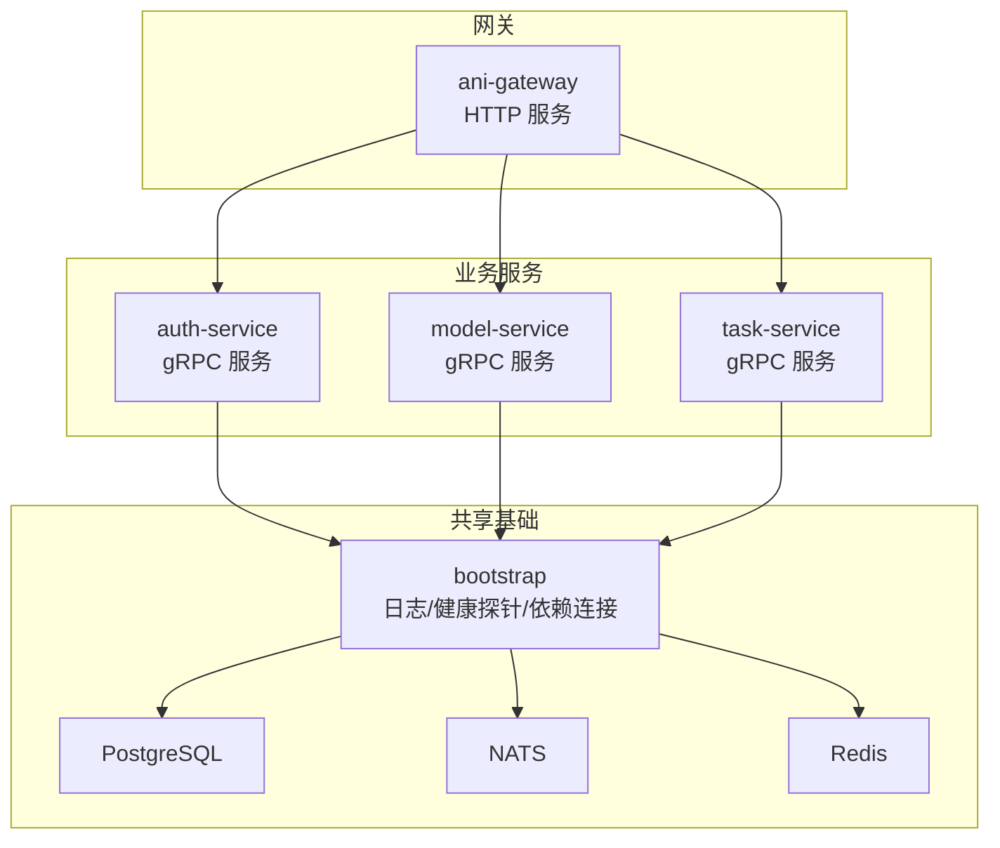
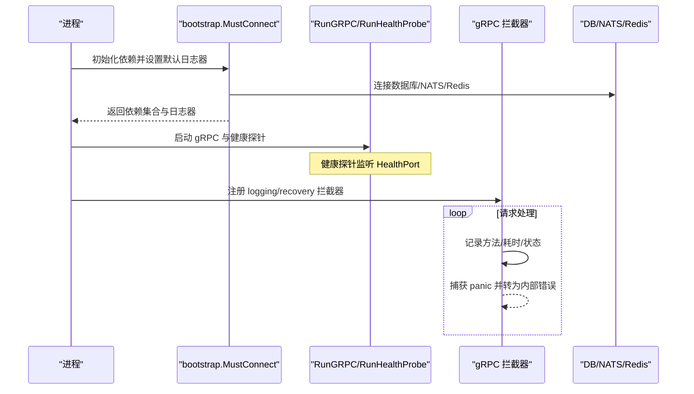
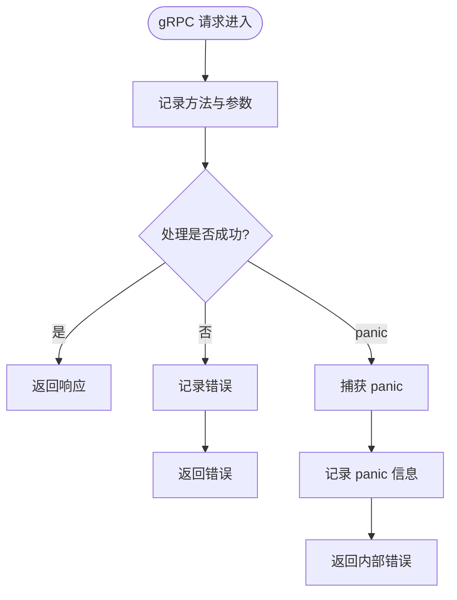
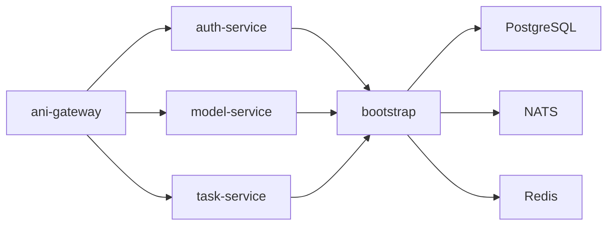

# 日志分析与调试

<cite>
**本文引用的文件**
- [pkg/bootstrap/server.go](file://repo/pkg/bootstrap/server.go)
- [pkg/bootstrap/db.go](file://repo/pkg/bootstrap/db.go)
- [pkg/bootstrap/nats.go](file://repo/pkg/bootstrap/nats.go)
- [pkg/bootstrap/redis.go](file://repo/pkg/bootstrap/redis.go)
- [services/ani-gateway/main.go](file://repo/services/ani-gateway/main.go)
- [services/auth-service/internal/config/config.go](file://repo/services/auth-service/internal/config/config.go)
- [services/task-service/internal/config/config.go](file://repo/services/task-service/internal/config/config.go)
- [services/model-service/internal/config/config.go](file://repo/services/model-service/internal/config/config.go)
- [services/ani-gateway/instance_observability_runtime.go](file://repo/services/ani-gateway/instance_observability_runtime.go)
- [services/ani-gateway/instance_service_runtime.go](file://repo/services/ani-gateway/instance_service_runtime.go)
- [services/ani-gateway/internal/router/auth.go](file://repo/services/ani-gateway/internal/router/auth.go)
- [tools/kms-sm4-live-fixture/main.go](file://repo/tools/kms-sm4-live-fixture/main.go)
</cite>

## 目录
1. [简介](#简介)
2. [项目结构](#项目结构)
3. [核心组件](#核心组件)
4. [架构总览](#架构总览)
5. [详细组件分析](#详细组件分析)
6. [依赖关系分析](#依赖关系分析)
7. [性能与可观测性](#性能与可观测性)
8. [故障排查指南](#故障排查指南)
9. [结论](#结论)
10. [附录](#附录)

## 简介
本指南面向 ANI 平台的运维与研发人员，聚焦“日志分析与调试”。内容涵盖：
- 各服务的日志级别、输出格式与关键日志识别方法
- 使用 kubectl、docker logs 等工具收集与分析日志的实操步骤
- 常见错误日志解读与定位技巧
- 结构化日志查询、日志聚合分析、性能相关日志监控
- 调试工具与技巧（断点调试、内存泄漏检测、CPU 性能分析）

## 项目结构
本项目采用多服务架构，Go 语言实现。日志基础设施集中在 bootstrap 层，各服务通过统一入口启动并输出 JSON 结构化日志到标准输出，便于容器化环境采集。

图表来源
- [pkg/bootstrap/server.go:108-150](file://repo/pkg/bootstrap/server.go#L108-L150)
- [services/ani-gateway/main.go:20-221](file://repo/services/ani-gateway/main.go#L20-L221)

章节来源
- [pkg/bootstrap/server.go:108-150](file://repo/pkg/bootstrap/server.go#L108-L150)
- [services/ani-gateway/main.go:20-221](file://repo/services/ani-gateway/main.go#L20-L221)

## 核心组件
- 统一日志器：所有服务在启动时创建 JSON 格式的 slog 日志器并设为默认，输出到 stdout，便于 Kubernetes 日志系统采集。
- gRPC 拦截器：统一的请求级日志记录与 panic 恢复，保证异常路径可追踪。
- 健康探针：独立 HTTP 端口暴露健康检查，包含依赖就绪状态与控制器指标读取。
- 配置加载：各服务通过环境变量注入数据库、NATS、Redis、端口等配置，并在启动阶段打印关键连接信息。

章节来源
- [pkg/bootstrap/server.go:108-150](file://repo/pkg/bootstrap/server.go#L108-L150)
- [pkg/bootstrap/server.go:387-445](file://repo/pkg/bootstrap/server.go#L387-L445)
- [pkg/bootstrap/server.go:551-573](file://repo/pkg/bootstrap/server.go#L551-L573)
- [services/auth-service/internal/config/config.go:28-53](file://repo/services/auth-service/internal/config/config.go#L28-L53)
- [services/task-service/internal/config/config.go:18-32](file://repo/services/task-service/internal/config/config.go#L18-L32)
- [services/model-service/internal/config/config.go:11-20](file://repo/services/model-service/internal/config/config.go#L11-L20)

## 架构总览
下图展示了服务启动、依赖连接与健康探针的生命周期，以及 gRPC 调用链路的日志与恢复机制。

图表来源
- [pkg/bootstrap/server.go:108-150](file://repo/pkg/bootstrap/server.go#L108-L150)
- [pkg/bootstrap/server.go:387-445](file://repo/pkg/bootstrap/server.go#L387-L445)
- [pkg/bootstrap/server.go:551-573](file://repo/pkg/bootstrap/server.go#L551-L573)

## 详细组件分析

### 日志格式与级别规范
- 输出格式：JSON 结构化日志，字段包含 level、msg、method、err、port、url、value 等上下文键，便于检索与聚合。
- 日志级别：
  - Info：服务启动、依赖连接成功、监听端口等常规事件。
  - Warn：重试、降级、未知配置值、非致命状态不一致。
  - Error：依赖连接失败、服务启动失败、请求处理异常、panic 恢复。
- 关键日志识别：
  - 依赖连接：数据库、NATS、Redis 的连接成功与重试。
  - 服务监听：gRPC 与 health probe 的端口监听与关闭。
  - 请求链路：gRPC 方法的 method、err、panic 恢复。
  - 配置与降级：实例可观测性存储回退、无效整数环境变量等。

章节来源
- [pkg/bootstrap/server.go:108-150](file://repo/pkg/bootstrap/server.go#L108-L150)
- [pkg/bootstrap/db.go:39-49](file://repo/pkg/bootstrap/db.go#L39-L49)
- [pkg/bootstrap/nats.go:36-52](file://repo/pkg/bootstrap/nats.go#L36-L52)
- [pkg/bootstrap/redis.go:46-46](file://repo/pkg/bootstrap/redis.go#L46-L46)
- [pkg/bootstrap/server.go:407-445](file://repo/pkg/bootstrap/server.go#L407-L445)
- [pkg/bootstrap/server.go:551-573](file://repo/pkg/bootstrap/server.go#L551-L573)
- [services/ani-gateway/instance_observability_runtime.go:110-114](file://repo/services/ani-gateway/instance_observability_runtime.go#L110-L114)
- [services/ani-gateway/instance_service_runtime.go:54-54](file://repo/services/ani-gateway/instance_service_runtime.go#L54-L54)

### 服务启动与依赖连接日志
- ani-gateway：依次配置 K8s 集群代理、加密、密钥、GPU 库存、网络、存储、镜像仓库、实例运行时、向量存储、可观测性等，并在成功时输出 provider 与配置项；失败时输出错误并退出。
- auth-service、task-service、model-service：通过各自 config.Load 读取环境变量，设置 GRPC_PORT、HEALTH_PORT、ServiceName 等，并在 bootstrap 中完成依赖连接与日志输出。

章节来源
- [services/ani-gateway/main.go:20-221](file://repo/services/ani-gateway/main.go#L20-L221)
- [services/auth-service/internal/config/config.go:28-53](file://repo/services/auth-service/internal/config/config.go#L28-L53)
- [services/task-service/internal/config/config.go:18-32](file://repo/services/task-service/internal/config/config.go#L18-L32)
- [services/model-service/internal/config/config.go:11-20](file://repo/services/model-service/internal/config/config.go#L11-L20)

### gRPC 请求日志与异常恢复
- 每个 gRPC 调用都会经过 loggingUnaryInterceptor，记录 method 与 err；recoveryUnaryInterceptor 捕获 panic 并转换为内部错误，避免进程崩溃。
- 健康探针：独立 HTTP 服务器，提供依赖就绪检查与控制器指标读取，便于编排系统探测。

图表来源
- [pkg/bootstrap/server.go:551-573](file://repo/pkg/bootstrap/server.go#L551-L573)

章节来源
- [pkg/bootstrap/server.go:387-445](file://repo/pkg/bootstrap/server.go#L387-L445)
- [pkg/bootstrap/server.go:551-573](file://repo/pkg/bootstrap/server.go#L551-L573)

### 认证错误映射与日志
- 平台账密登录错误映射将 gRPC 状态码转换为 HTTP 状态码与错误码，如未认证、参数非法、前置条件失败等，并输出相应错误消息。
- OIDC 流程中，绑定请求体失败会直接返回 BAD_REQUEST 错误。

章节来源
- [services/ani-gateway/internal/router/auth.go:213-243](file://repo/services/ani-gateway/internal/router/auth.go#L213-L243)

### 实例可观测性与日志回退
- 当实例可观测性日志存储配置为未实现的 Elasticsearch 或未知值时，会记录 Warn 并回退到 K8s Pod 日志 API，确保功能可用但可能影响性能与能力。

章节来源
- [services/ani-gateway/instance_observability_runtime.go:110-114](file://repo/services/ani-gateway/instance_observability_runtime.go#L110-L114)

### 工具与夹具日志
- kms-sm4 live fixture 启动与运行过程中记录服务地址、对象根路径与错误信息，便于验证与排障。

章节来源
- [tools/kms-sm4-live-fixture/main.go:38-48](file://repo/tools/kms-sm4-live-fixture/main.go#L38-L48)

## 依赖关系分析
- 服务间依赖：ani-gateway 作为 HTTP 入口，调用 auth-service、model-service、task-service 等 gRPC 服务；这些服务共享 bootstrap 提供的数据库、NATS、Redis 连接。
- 健康探针依赖：health probe 读取依赖就绪状态与控制器指标，用于编排系统的存活与就绪探测。

图表来源
- [pkg/bootstrap/server.go:108-150](file://repo/pkg/bootstrap/server.go#L108-L150)
- [services/ani-gateway/main.go:20-221](file://repo/services/ani-gateway/main.go#L20-L221)

章节来源
- [pkg/bootstrap/server.go:108-150](file://repo/pkg/bootstrap/server.go#L108-L150)
- [services/ani-gateway/main.go:20-221](file://repo/services/ani-gateway/main.go#L20-L221)

## 性能与可观测性
- 请求级性能：gRPC 拦截器记录方法名与错误，结合健康探针与控制器指标，可评估吞吐与延迟。
- 依赖就绪：数据库、NATS、Redis 的连接日志与重试提示有助于快速定位后端不稳定问题。
- 可观测性回退：当外部日志存储不可用时，自动回退到 K8s Pod 日志 API，保障基本可观测能力。

章节来源
- [pkg/bootstrap/server.go:387-445](file://repo/pkg/bootstrap/server.go#L387-L445)
- [pkg/bootstrap/db.go:39-49](file://repo/pkg/bootstrap/db.go#L39-L49)
- [pkg/bootstrap/nats.go:36-52](file://repo/pkg/bootstrap/nats.go#L36-L52)
- [pkg/bootstrap/redis.go:46-46](file://repo/pkg/bootstrap/redis.go#L46-L46)
- [services/ani-gateway/instance_observability_runtime.go:110-114](file://repo/services/ani-gateway/instance_observability_runtime.go#L110-L114)

## 故障排查指南

### 日志级别与关键字识别
- 启动阶段：
  - 关注“database connected”“nats connected”“redis connected”等成功日志。
  - 若出现“failed to connect to ...”则立即检查对应依赖配置与网络连通性。
- 运行阶段：
  - “gRPC error”“gRPC panic recovered”指示请求处理异常或 panic。
  - “not ready, retrying...”表示依赖尚未就绪，需检查后端服务状态。
  - “falling back to K8s pod log API”说明外部日志存储不可用，已回退。

章节来源
- [pkg/bootstrap/db.go:39-49](file://repo/pkg/bootstrap/db.go#L39-L49)
- [pkg/bootstrap/nats.go:36-52](file://repo/pkg/bootstrap/nats.go#L36-L52)
- [pkg/bootstrap/redis.go:46-46](file://repo/pkg/bootstrap/redis.go#L46-L46)
- [pkg/bootstrap/server.go:551-573](file://repo/pkg/bootstrap/server.go#L551-L573)
- [services/ani-gateway/instance_observability_runtime.go:110-114](file://repo/services/ani-gateway/instance_observability_runtime.go#L110-L114)

### 使用 kubectl 收集与分析日志
- 查看 Pod 列表与状态：
  - 列出命名空间下的 Pod，确认目标 Pod 处于 Running 且 Ready。
- 抓取日志：
  - 使用 kubectl logs 获取指定 Pod 的标准输出日志，支持时间范围过滤与尾随模式。
  - 对于多容器 Pod，指定容器名以获取特定容器的日志。
- 实时跟踪：
  - 使用 --follow 实时观察日志滚动，配合 grep 过滤关键字（如 ERROR、WARN）。
- 关联请求：
  - 通过 gRPC 方法名与错误信息定位具体调用链路，结合健康探针状态判断依赖可用性。

### 使用 docker logs 收集与分析日志
- 本地或 Docker 环境：
  - 使用 docker logs 查看容器标准输出日志，支持 --tail、--since、--grep 等选项。
  - 对长时间运行的容器，建议定期轮转与归档日志，避免磁盘占用过高。
- 日志聚合：
  - 将 stdout 日志接入集中式日志系统（如 ELK、Loki），按服务名、Pod 名、时间维度进行索引与检索。

### 常见错误日志解读
- 依赖连接失败：
  - 数据库、NATS、Redis 连接失败通常由配置错误或网络隔离导致，检查环境变量与网络策略。
- 认证失败：
  - 未认证或参数非法会返回明确的 HTTP 状态码与错误码，检查客户端凭证与请求体格式。
- Panic 恢复：
  - 捕获到的 panic 会被记录并转换为内部错误，需进一步分析堆栈与上下文。

章节来源
- [pkg/bootstrap/server.go:108-150](file://repo/pkg/bootstrap/server.go#L108-L150)
- [services/ani-gateway/internal/router/auth.go:213-243](file://repo/services/ani-gateway/internal/router/auth.go#L213-L243)
- [pkg/bootstrap/server.go:551-573](file://repo/pkg/bootstrap/server.go#L551-L573)

### 结构化日志查询与聚合分析
- 结构化字段：
  - 使用 level、msg、method、err、port、url、value 等字段进行精确检索。
- 聚合分析：
  - 按服务名、错误类型、时间段统计错误率与峰值。
  - 结合健康探针与控制器指标，评估系统稳定性与性能瓶颈。

### 性能相关日志监控
- 请求级指标：
  - 通过 gRPC 拦截器记录的方法名与错误，评估接口性能与异常分布。
- 依赖就绪：
  - 数据库、NATS、Redis 的重试日志反映后端稳定性，需关注重试频率与持续时间。
- 可观测性回退：
  - 外部日志存储不可用时的回退日志提示，需尽快修复以提升可观测能力。

章节来源
- [pkg/bootstrap/server.go:387-445](file://repo/pkg/bootstrap/server.go#L387-L445)
- [pkg/bootstrap/db.go:39-49](file://repo/pkg/bootstrap/db.go#L39-L49)
- [pkg/bootstrap/nats.go:36-52](file://repo/pkg/bootstrap/nats.go#L36-L52)
- [pkg/bootstrap/redis.go:46-46](file://repo/pkg/bootstrap/redis.go#L46-L46)
- [services/ani-gateway/instance_observability_runtime.go:110-114](file://repo/services/ani-gateway/instance_observability_runtime.go#L110-L114)

### 调试工具与技巧
- 断点调试：
  - 在本地开发环境中，使用 IDE 对关键函数设置断点，逐步执行并观察变量状态。
- 内存泄漏检测：
  - 使用 pprof 或内存分析工具（如 go tool pprof）采集堆快照，定位内存增长原因。
- CPU 性能分析：
  - 使用 pprof 采集 CPU 火焰图，识别热点函数与阻塞点。
- 健康探针：
  - 通过健康探针端点检查依赖就绪状态，辅助定位服务启动与依赖问题。

## 结论
本项目采用统一的 JSON 结构化日志与 gRPC 拦截器，提供了清晰的请求级日志与异常恢复机制。通过健康探针与依赖连接日志，能够快速定位启动与运行期问题。结合 kubectl 与 docker logs 等工具，可实现高效的日志收集与分析。建议在生产环境中接入集中式日志系统，并结合 pprof 等工具进行性能分析与调优。

## 附录
- 环境变量参考：
  - DATABASE_URL、NATS_URL、REDIS_URL：依赖连接字符串。
  - GRPC_PORT、HEALTH_PORT：服务端口。
  - INSTANCE_OBSERVABILITY_PROVIDER、INSTANCE_OBSERVABILITY_PROMETHEUS_URL：可观测性配置。
- 常用命令：
  - kubectl logs <pod> -f --tail=100
  - docker logs <container> --tail=100 --grep="ERROR"
  - go tool pprof http://<service>:<pprof-port>/debug/pprof/profile