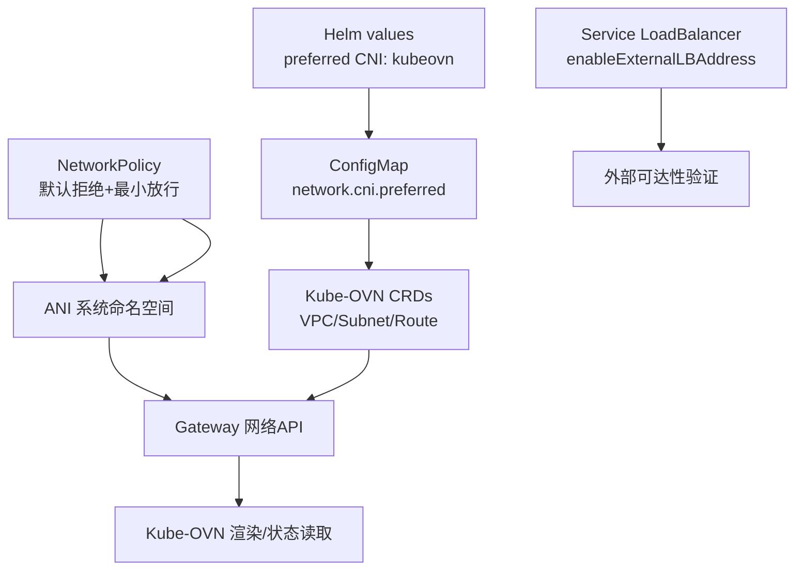
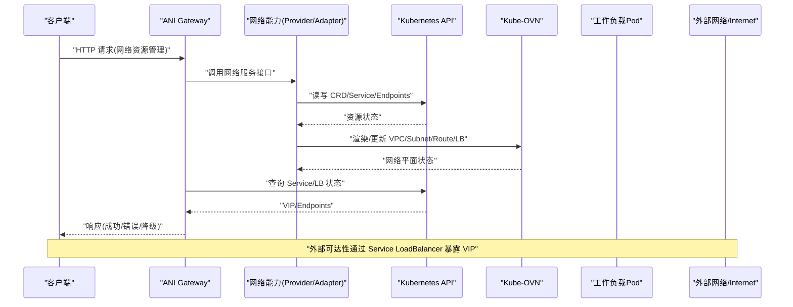
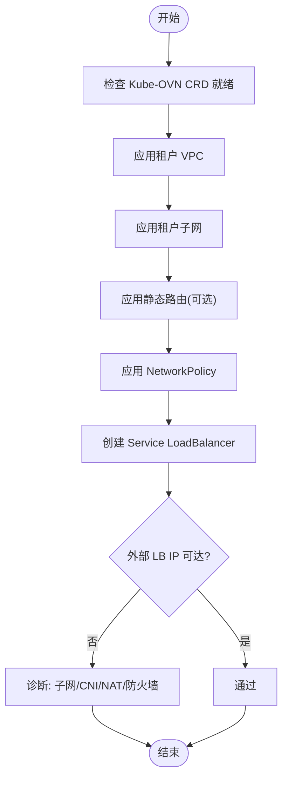
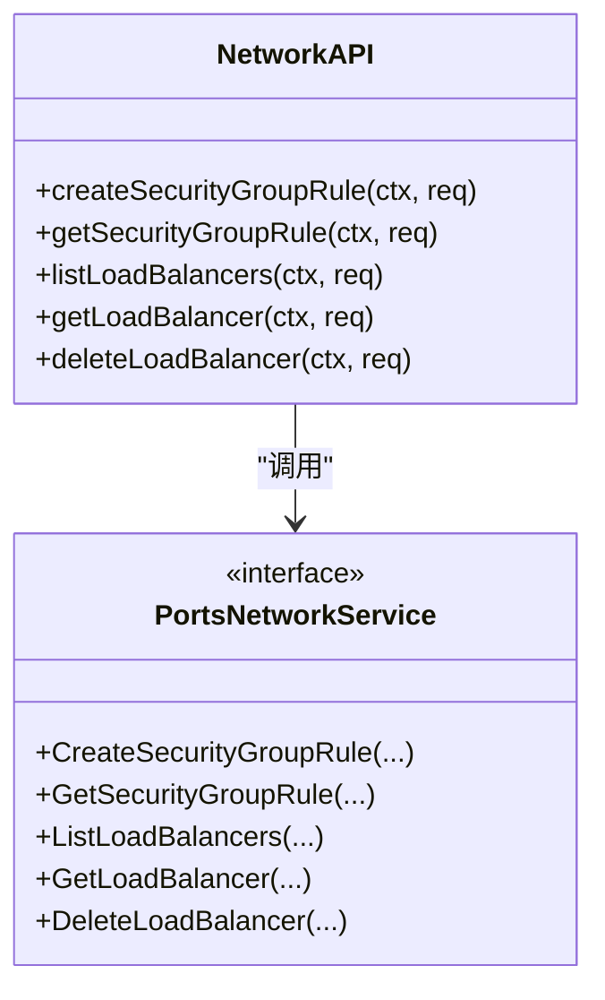
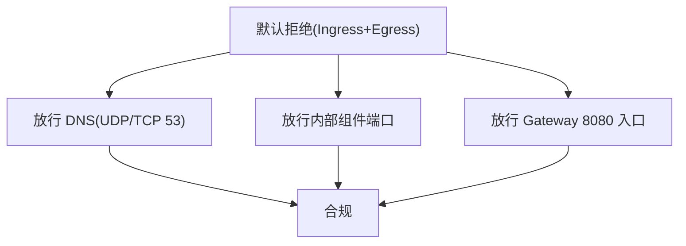
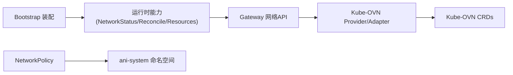

# 网络连接问题排查

<cite>
**本文引用的文件**
- [values.yaml](file://repo/deploy/helm/ani-platform/values.yaml)
- [10-platform-config.yaml](file://repo/deploy/manifests/m1-infra-a/10-platform-config.yaml)
- [20-networkpolicy.yaml](file://repo/deploy/manifests/m1-infra-a/20-networkpolicy.yaml)
- [10-kubeovn-tenant-vpc-template.yaml](file://repo/deploy/manifests/m1-infra-c/10-kubeovn-tenant-vpc-template.yaml)
- [kubeovn-lb-external-deps.yaml](file://repo/deploy/real-k8s-lab/kubeovn-lb-external-deps.yaml)
- [kubeovn-network-live-gate.yaml](file://repo/deploy/real-k8s-lab/kubeovn-network-live-gate.yaml)
- [network_resources.go](file://repo/services/ani-gateway/internal/router/network_resources.go)
- [deps_test.go](file://repo/pkg/bootstrap/deps_test.go)
- [validate_sandbox_live_gate.py](file://repo/scripts/validate_sandbox_live_gate.py)
- [resilience_plan.md](file://repo/development-records/sprint14-core-resilience-plan.md)
- [real-k8s-lab-k8s-kubeovn-kubevirt-bootstrap.md](file://repo/development-records/real-k8s-lab-k8s-kubeovn-kubevirt-bootstrap.md)
</cite>

## 目录
1. [简介](#简介)
2. [项目结构](#项目结构)
3. [核心组件](#核心组件)
4. [架构总览](#架构总览)
5. [详细组件分析](#详细组件分析)
6. [依赖关系分析](#依赖关系分析)
7. [性能与可用性考量](#性能与可用性考量)
8. [故障排查指南](#故障排查指南)
9. [结论](#结论)
10. [附录](#附录)

## 简介
本指南面向在 ANI 平台中遇到网络连接问题的工程师，覆盖服务间通信、外部 API 调用、负载均衡器配置、网络安全策略等常见场景的诊断方法。结合仓库中的 Helm/Manifest 配置、Kubernetes NetworkPolicy、Kube-OVN 资源以及 Gateway 路由与健壮性实现，提供可操作的排障步骤与验证手段。同时给出网络连通性测试工具（curl、wget、telnet、nc）的使用建议，并针对 DNS、SSL/TLS、代理等常见问题给出定位思路。

## 项目结构
本项目在网络相关方面主要涉及以下层面：
- 平台配置与 CNI 偏好：通过 Helm values 与 ConfigMap 声明首选 CNI 为 Kube-OVN，并启用默认拒绝的网络策略。
- 租户 VPC 与子网模板：定义租户级 VPC、私有子网、网关与 NAT 行为。
- 外部负载均衡与可达性：通过 Kube-OVN Subnet 的 enableExternalLBAddress 与 Service LoadBalancer 暴露外部 IP，并在真实实验室中进行可达性验证。
- 安全策略：使用 Kubernetes NetworkPolicy 实施默认拒绝与最小化放行。
- Gateway 网络能力：提供 VPC/Subnet/安全组/负载均衡器等资源的 HTTP API。
- 健壮性与降级：对后端依赖（数据库、消息总线、对象存储、向量库、K8s API）进行健康检查与降级策略。

图表来源
- [values.yaml:51-52](file://repo/deploy/helm/ani-platform/values.yaml#L51-L52)
- [10-platform-config.yaml:12-13](file://repo/deploy/manifests/m1-infra-a/10-platform-config.yaml#L12-L13)
- [20-networkpolicy.yaml:1-76](file://repo/deploy/manifests/m1-infra-a/20-networkpolicy.yaml#L1-L76)
- [kubeovn-lb-external-deps.yaml:15-88](file://repo/deploy/real-k8s-lab/kubeovn-lb-external-deps.yaml#L15-L88)
- [network_resources.go:1-47](file://repo/services/ani-gateway/internal/router/network_resources.go#L1-L47)

章节来源
- [values.yaml:51-52](file://repo/deploy/helm/ani-platform/values.yaml#L51-L52)
- [10-platform-config.yaml:12-13](file://repo/deploy/manifests/m1-infra-a/10-platform-config.yaml#L12-L13)
- [20-networkpolicy.yaml:1-76](file://repo/deploy/manifests/m1-infra-a/20-networkpolicy.yaml#L1-L76)
- [10-kubeovn-tenant-vpc-template.yaml:1-28](file://repo/deploy/manifests/m1-infra-c/10-kubeovn-tenant-vpc-template.yaml#L1-L28)
- [kubeovn-lb-external-deps.yaml:15-88](file://repo/deploy/real-k8s-lab/kubeovn-lb-external-deps.yaml#L15-L88)
- [kubeovn-network-live-gate.yaml:1-47](file://repo/deploy/real-k8s-lab/kubeovn-network-live-gate.yaml#L1-L47)
- [network_resources.go:1-47](file://repo/services/ani-gateway/internal/router/network_resources.go#L1-L47)

## 核心组件
- 网络能力接口与实现装配：Bootstrap 阶段将网络状态读取、重同步与本地网络服务装配到运行时能力中，确保后续模块能访问网络资源。
- Gateway 网络 API：提供创建/查询/删除 VPC、子网、安全组、规则、绑定以及负载均衡器的 HTTP 端点，统一对外暴露网络管理能力。
- Kube-OVN 资源模板：租户 VPC/子网模板定义了隔离的网络平面；外部 LB 示例展示了如何通过 MACVLAN 与 Subnet 注解暴露外部 IP。
- 网络策略：默认拒绝所有流量，仅放行必要的控制面与组件间通信端口。
- 健壮性与健康检查：对关键依赖提供 readyz 探针与降级语义，便于快速识别网络或后端不可用导致的故障。

章节来源
- [deps_test.go:92-113](file://repo/pkg/bootstrap/deps_test.go#L92-L113)
- [network_resources.go:495-531](file://repo/services/ani-gateway/internal/router/network_resources.go#L495-L531)
- [network_resources.go:644-678](file://repo/services/ani-gateway/internal/router/network_resources.go#L644-L678)
- [10-kubeovn-tenant-vpc-template.yaml:1-28](file://repo/deploy/manifests/m1-infra-c/10-kubeovn-tenant-vpc-template.yaml#L1-L28)
- [kubeovn-lb-external-deps.yaml:15-88](file://repo/deploy/real-k8s-lab/kubeovn-lb-external-deps.yaml#L15-L88)
- [20-networkpolicy.yaml:1-76](file://repo/deploy/manifests/m1-infra-a/20-networkpolicy.yaml#L1-L76)
- [resilience_plan.md:51-63](file://repo/development-records/sprint14-core-resilience-plan.md#L51-L63)

## 架构总览
下图展示从客户端请求到后端服务的典型网络路径，包括 Gateway、Kube-OVN、Service/LB、Pod 以及外部可达性验证。

图表来源
- [network_resources.go:1-47](file://repo/services/ani-gateway/internal/router/network_resources.go#L1-L47)
- [kubeovn-lb-external-deps.yaml:66-88](file://repo/deploy/real-k8s-lab/kubeovn-lb-external-deps.yaml#L66-L88)
- [kubeovn-network-live-gate.yaml:19-40](file://repo/deploy/real-k8s-lab/kubeovn-network-live-gate.yaml#L19-L40)

## 详细组件分析

### Kube-OVN 网络插件配置与排障
- 首选 CNI 与平台配置：Helm values 指定 preferred CNI 为 kubeovn；平台 ConfigMap 也声明 network.cni.preferred 为 kubeovn。
- 租户 VPC/子网模板：定义私有子网、网关、是否允许 NAT 出向等，用于租户隔离。
- 外部 LB 可达性：通过 Subnet 的 enableExternalLBAddress 与 Service LoadBalancer 的 loadBalancerIP，结合 MACVLAN 的 NetworkAttachmentDefinition，使 VIP 可在外部网络可达。
- 真实实验室门禁：通过 live gate 校验 CRD 就绪、VPC/Subnet/静态路由、NetworkPolicy、Service/LB 以及外部 LB IP 可达性。

图表来源
- [kubeovn-network-live-gate.yaml:19-40](file://repo/deploy/real-k8s-lab/kubeovn-network-live-gate.yaml#L19-L40)
- [10-kubeovn-tenant-vpc-template.yaml:1-28](file://repo/deploy/manifests/m1-infra-c/10-kubeovn-tenant-vpc-template.yaml#L1-L28)
- [kubeovn-lb-external-deps.yaml:15-88](file://repo/deploy/real-k8s-lab/kubeovn-lb-external-deps.yaml#L15-L88)

章节来源
- [values.yaml:51-52](file://repo/deploy/helm/ani-platform/values.yaml#L51-L52)
- [10-platform-config.yaml:12-13](file://repo/deploy/manifests/m1-infra-a/10-platform-config.yaml#L12-L13)
- [10-kubeovn-tenant-vpc-template.yaml:1-28](file://repo/deploy/manifests/m1-infra-c/10-kubeovn-tenant-vpc-template.yaml#L1-L28)
- [kubeovn-lb-external-deps.yaml:15-88](file://repo/deploy/real-k8s-lab/kubeovn-lb-external-deps.yaml#L15-L88)
- [kubeovn-network-live-gate.yaml:1-47](file://repo/deploy/real-k8s-lab/kubeovn-network-live-gate.yaml#L1-L47)

### Gateway 网络 API 与安全组/负载均衡器
- 安全组规则创建/获取：提供创建安全组规则与获取规则的 HTTP 端点，支持方向、协议、端口范围、CIDR 与动作。
- 负载均衡器列表/获取/删除：提供负载均衡器的 CRUD 操作，返回包含 VIP 等信息的结构体。
- 租户隔离：测试用例验证跨租户访问被拒绝，确保多租户隔离。

图表来源
- [network_resources.go:495-531](file://repo/services/ani-gateway/internal/router/network_resources.go#L495-L531)
- [network_resources.go:644-678](file://repo/services/ani-gateway/internal/router/network_resources.go#L644-L678)

章节来源
- [network_resources.go:495-531](file://repo/services/ani-gateway/internal/router/network_resources.go#L495-L531)
- [network_resources.go:644-678](file://repo/services/ani-gateway/internal/router/network_resources.go#L644-L678)
- [network_resources_test.go:43-76](file://repo/services/ani-gateway/internal/router/network_resources_test.go#L43-L76)
- [network_resources_test.go:149-176](file://repo/services/ani-gateway/internal/router/network_resources_test.go#L149-L176)

### 网络策略与默认拒绝
- 默认拒绝：在 ani-system 命名空间启用 Ingress/Egress 默认拒绝。
- 控制面出站放行：允许 DNS（UDP/TCP 53）、组件间通信（Postgres 5432、NATS 4222、Redis 6379、MinIO 9000、Milvus 19530）。
- 入口放行：仅允许访问 Gateway 的 8080 端口。

图表来源
- [20-networkpolicy.yaml:1-76](file://repo/deploy/manifests/m1-infra-a/20-networkpolicy.yaml#L1-L76)

章节来源
- [20-networkpolicy.yaml:1-76](file://repo/deploy/manifests/m1-infra-a/20-networkpolicy.yaml#L1-L76)

### 健壮性、健康检查与降级
- 数据面 readyz：对 ObjectStore、VectorStore、K8sClusterService 等提供只读健康检查，失败时 readyz 返回 503。
- 重试与断路器：对幂等操作引入指数退避重试与命名断路器，避免瞬时网络抖动导致级联失败。
- 每调用超时：为外部 HTTP 调用注入可配超时，防止阻塞。
- 多端点回退：MinIO/Milvus 支持 endpoint list，在网络错误或 429/5xx 时尝试下一个端点。

章节来源
- [resilience_plan.md:51-63](file://repo/development-records/sprint14-core-resilience-plan.md#L51-L63)
- [resilience_plan.md:391-419](file://repo/development-records/sprint14-core-resilience-plan.md#L391-L419)

## 依赖关系分析
- Bootstrap 装配：网络状态读取、重同步与本地网络服务在启动时被装配到运行时能力中，供上层模块使用。
- Gateway 路由：网络资源管理的 HTTP 路由调用 ports.NetworkService，最终映射到具体 Provider/Adapter。
- Kube-OVN 渲染：通过 CRD（VPC/Subnet/Route）与 Service/LB 资源描述网络拓扑，由 Kube-OVN 控制器生效。
- 网络策略：限制命名空间内 Pod 的入站/出站流量，保障最小权限原则。

图表来源
- [deps_test.go:92-113](file://repo/pkg/bootstrap/deps_test.go#L92-L113)
- [network_resources.go:1-47](file://repo/services/ani-gateway/internal/router/network_resources.go#L1-L47)
- [20-networkpolicy.yaml:1-76](file://repo/deploy/manifests/m1-infra-a/20-networkpolicy.yaml#L1-L76)

章节来源
- [deps_test.go:92-113](file://repo/pkg/bootstrap/deps_test.go#L92-L113)
- [network_resources.go:1-47](file://repo/services/ani-gateway/internal/router/network_resources.go#L1-L47)
- [20-networkpolicy.yaml:1-76](file://repo/deploy/manifests/m1-infra-a/20-networkpolicy.yaml#L1-L76)

## 性能与可用性考量
- 连接池与超时：外部调用应设置合理的超时与连接池参数，避免长尾延迟影响整体吞吐。
- 重试与退避：对幂等读/观察/dry-run 等调用采用指数退避重试，减少瞬时网络抖动的影响。
- 断路器：持续失败时快速失败，降低雪崩风险。
- 健康检查：readyz 及时反映后端不可用，配合自动扩缩容与滚动升级策略提升可用性。

[本节为通用指导，不直接分析具体文件]

## 故障排查指南

### 服务间通信不通
- 检查 NetworkPolicy：确认目标 Pod 所在命名空间的入站/出站策略是否放行了必要端口。
- 检查 Service/Endpoints：确认 Service 类型与 selector 是否正确，Endpoints 是否有就绪地址。
- 检查 DNS：确认 Pod 能解析集群内服务名（如 *.svc.cluster.local），必要时检查 CoreDNS 与上游 DNS。
- 检查代理：若使用 HTTP/SOCKS 代理，确认环境变量与客户端配置正确。

参考命令
- curl/wget：测试 HTTP/HTTPS 连通与响应码。
- telnet/nc：测试 TCP 端口可达性。
- dig/nslookup/host：测试 DNS 解析。

章节来源
- [20-networkpolicy.yaml:1-76](file://repo/deploy/manifests/m1-infra-a/20-networkpolicy.yaml#L1-L76)
- [validate_sandbox_live_gate.py:348-366](file://repo/scripts/validate_sandbox_live_gate.py#L348-L366)

### 外部 API 调用失败
- 检查 egress 策略：确认 Pod 出站是否允许访问外部域名/IP。
- 检查证书与 SNI：HTTPS 调用需确保 CA 信任链与 SNI 正确。
- 检查代理：确认代理地址、认证与绕过列表。
- 检查超时与重试：合理设置超时与重试策略，避免瞬时失败放大。

章节来源
- [20-networkpolicy.yaml:1-76](file://repo/deploy/manifests/m1-infra-a/20-networkpolicy.yaml#L1-L76)
- [resilience_plan.md:51-63](file://repo/development-records/sprint14-core-resilience-plan.md#L51-L63)

### 负载均衡器配置与可达性
- 检查 Service 类型与注解：确认 type=LoadBalancer，且 Kube-OVN 注解 enableExternalLBAddress 已启用。
- 检查 Subnet CIDR 与网关：确认 VIP 在子网范围内，网关可达。
- 检查外部可达性：在真实节点上通过 curl/telnet 测试 VIP 端口。

章节来源
- [kubeovn-lb-external-deps.yaml:15-88](file://repo/deploy/real-k8s-lab/kubeovn-lb-external-deps.yaml#L15-L88)
- [kubeovn-network-live-gate.yaml:19-40](file://repo/deploy/real-k8s-lab/kubeovn-network-live-gate.yaml#L19-L40)

### Kube-OVN 配置检查与故障排除
- CRD 就绪：确认 vpcs.kubeovn.io、subnets.kubeovn.io 存在并可查询。
- VPC/Subnet/Route：确认租户 VPC、子网、静态路由已创建并处于就绪状态。
- 控制面 Node annotation：若出现 OVN NB/SB 缺少 node logical switch port 或 ip.kubeovn.io 对象缺失，清理残留 annotation 并重启 controller/CNI pod 以重新分配。
- 外部 LB：通过 MACVLAN 与 Subnet 注解暴露 VIP，并进行可达性验证。

章节来源
- [kubeovn-network-live-gate.yaml:19-40](file://repo/deploy/real-k8s-lab/kubeovn-network-live-gate.yaml#L19-L40)
- [real-k8s-lab-k8s-kubeovn-kubevirt-bootstrap.md:49-65](file://repo/development-records/real-k8s-lab-k8s-kubeovn-kubevirt-bootstrap.md#L49-L65)
- [kubeovn-lb-external-deps.yaml:15-88](file://repo/deploy/real-k8s-lab/kubeovn-lb-external-deps.yaml#L15-L88)

### 防火墙规则与网络安全策略
- 默认拒绝：确认默认拒绝策略已生效，仅放行必要端口。
- 组件间通信：确认 Postgres、NATS、Redis、MinIO、Milvus 等端口在策略中放行。
- 入口策略：确认仅开放 Gateway 的 8080 端口。

章节来源
- [20-networkpolicy.yaml:1-76](file://repo/deploy/manifests/m1-infra-a/20-networkpolicy.yaml#L1-L76)

### DNS 解析问题
- 检查 Pod 的 DNS 配置与上游 DNS 可达性。
- 使用 dig/nslookup 验证解析结果与 TTL。
- 若使用自定义域名，确认 Ingress/Gateway 配置与证书匹配。

[本节为通用指导，不直接分析具体文件]

### SSL/TLS 证书问题
- 检查 CA 信任链与中间证书是否完整。
- 检查 SNI 与证书域名匹配。
- 对于自签名证书，仅在测试环境使用，生产环境建议使用受信任 CA。

[本节为通用指导，不直接分析具体文件]

### 代理配置问题
- 检查 HTTP_PROXY/HTTPS_PROXY/NO_PROXY 环境变量。
- 确认代理服务器可达与认证信息正确。
- 对内部域名设置 NO_PROXY 以避免不必要的代理转发。

[本节为通用指导，不直接分析具体文件]

## 结论
通过 Helm/Manifest 配置、Kube-OVN 资源、NetworkPolicy 与 Gateway 网络 API 的组合，ANI 平台提供了可控、可观测、可恢复的网络能力。排障时应遵循“从外到内、从策略到实现”的思路：先确认外部可达性与策略放行，再检查 Service/Endpoints、DNS、证书与代理，最后深入到 Kube-OVN 控制器与 CRD 状态。借助 live gate 与健康检查，可以快速定位并验证修复效果。

[本节为总结，不直接分析具体文件]

## 附录
- 常用命令建议
  - curl：测试 HTTP/HTTPS 连通与响应码，查看头部与重定向。
  - wget：下载或测试连通，支持断点续传与重试。
  - telnet/nc：测试 TCP 端口可达性，辅助判断防火墙与监听问题。
  - dig/nslookup/host：测试 DNS 解析，验证记录类型与 TTL。
  - kubectl get endpoints/service/pod/node：检查 K8s 网络资源状态。
  - kubectl describe crd/vpc/subnet/route：检查 Kube-OVN 资源详情与事件。

[本节为通用指导，不直接分析具体文件]