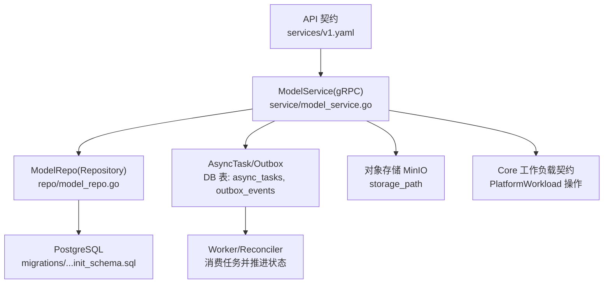
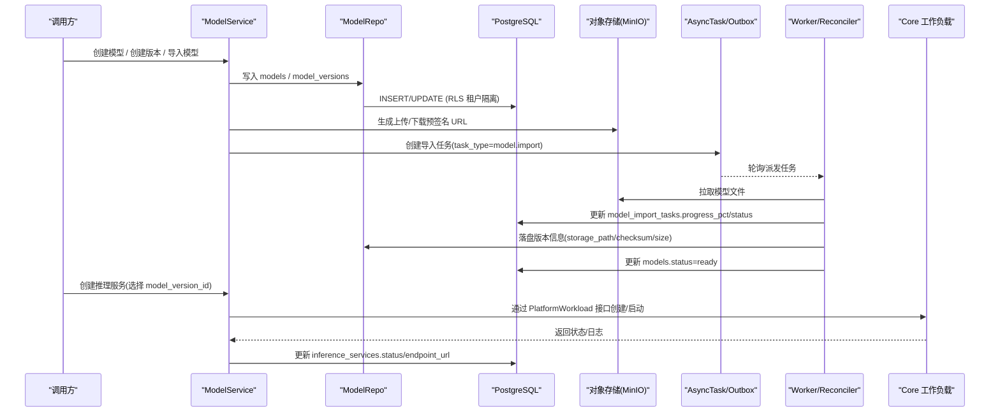
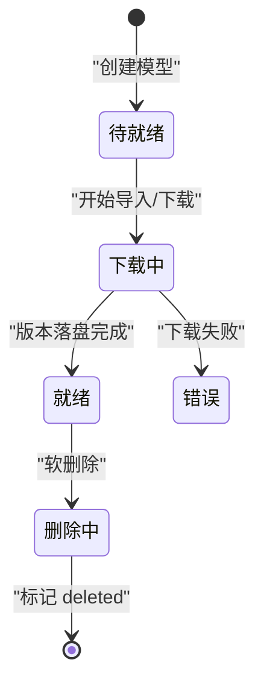
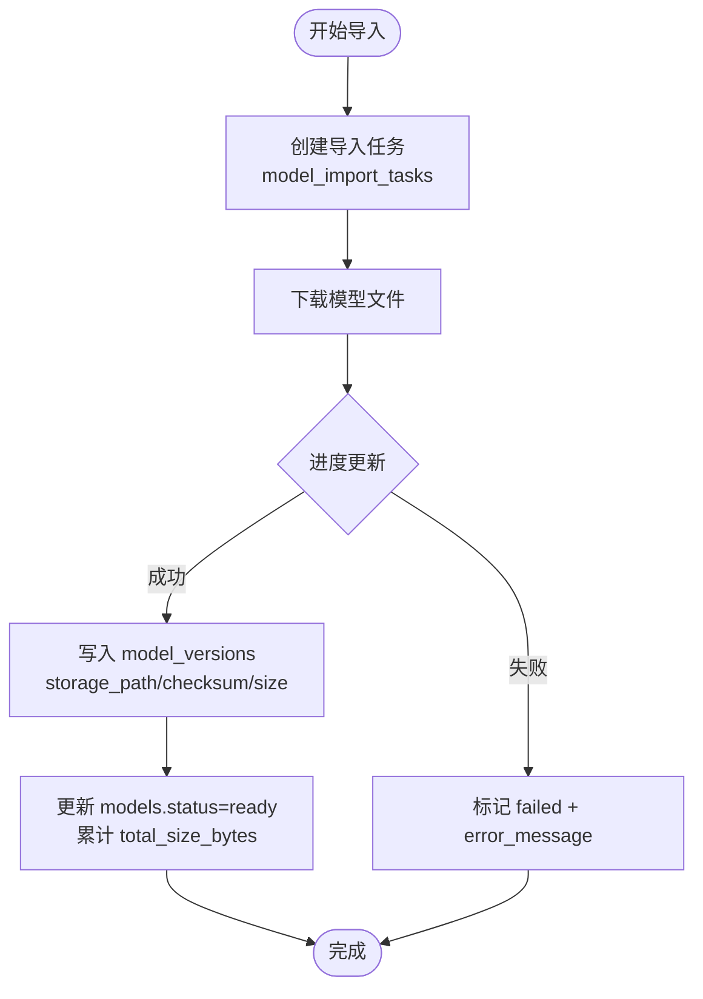
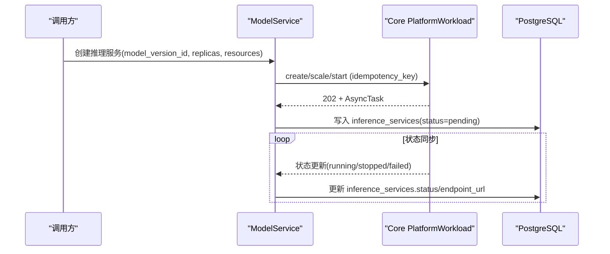
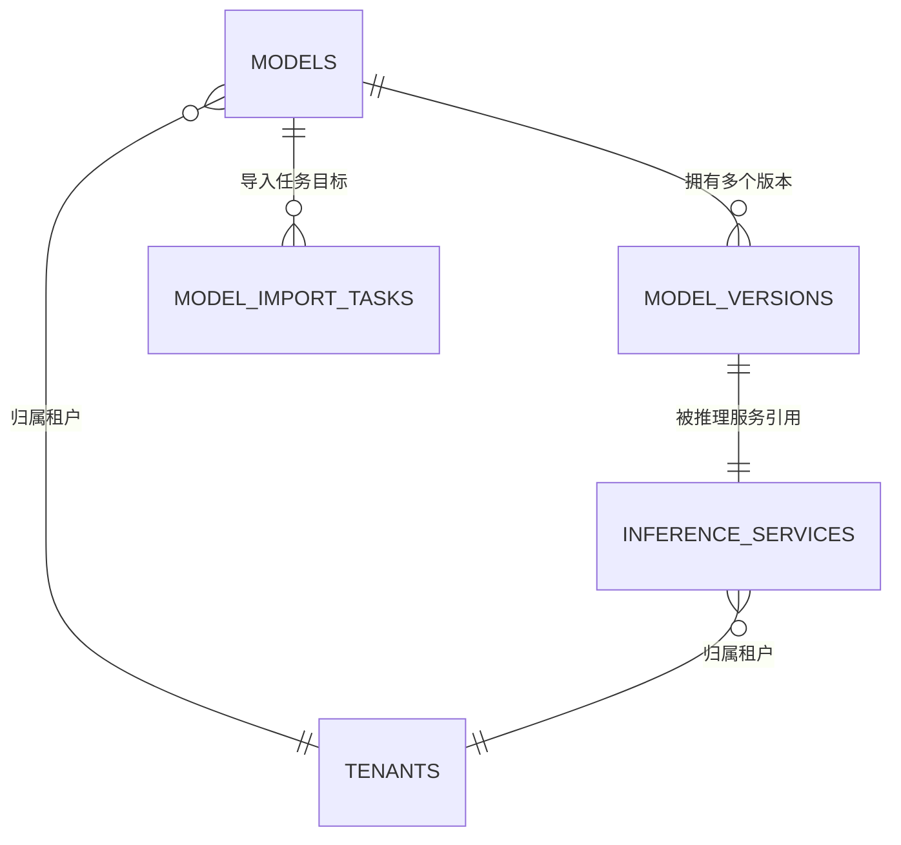

# AI模型相关表

<cite>
**本文引用的文件**
- [20260501_001_init_schema.sql](file://repo/deploy/migrations/20260501_001_init_schema.sql)
- [model_repo.go](file://repo/services/model-service/internal/repo/model_repo.go)
- [model_service.go](file://repo/services/model-service/internal/service/model_service.go)
- [v1.yaml（Services）](file://repo/api/openapi/services/v1.yaml)
- [inference-platform-workload-contract-a.md](file://repo/development-records/inference-platform-workload-contract-a.md)
- [PHASE3-MODEL-ENHANCEMENT-ACCEPTANCE-RECORD.md](file://repo/services/tasks/phase3/acceptance/PHASE3-MODEL-ENHANCEMENT-ACCEPTANCE-RECORD.md)
</cite>

## 目录
1. [简介](#简介)
2. [项目结构](#项目结构)
3. [核心组件](#核心组件)
4. [架构总览](#架构总览)
5. [详细组件分析](#详细组件分析)
6. [依赖关系分析](#依赖关系分析)
7. [性能考量](#性能考量)
8. [故障排查指南](#故障排查指南)
9. [结论](#结论)
10. [附录](#附录)

## 简介
本文件聚焦 ANI 平台中 AI 模型全生命周期管理的数据层设计，围绕以下四张核心表展开：
- models：模型元数据与来源、能力、状态等。
- model_versions：模型版本、格式、加密信息、存储路径与配置快照。
- model_import_tasks：从外部仓库导入模型的异步任务进度与错误记录。
- inference_services：基于某个模型版本创建的推理服务实例及其部署状态。

文档将说明这些表如何支撑“模型上传—版本控制—加密存储—推理服务部署”的完整流程，并解释元数据、配置、存储路径的管理方式，以及导入任务的进度跟踪与错误处理机制。

## 项目结构
与模型相关的数据定义集中在数据库迁移脚本中；服务侧通过 gRPC 接口暴露模型管理能力，并通过 Repository 层访问数据库；推理服务创建与生命周期由 Services 层与 Core 工作负载契约共同约束。

图表来源
- [v1.yaml（Services）:129-241](file://repo/api/openapi/services/v1.yaml#L129-L241)
- [model_service.go:36-180](file://repo/services/model-service/internal/service/model_service.go#L36-L180)
- [model_repo.go:90-245](file://repo/services/model-service/internal/repo/model_repo.go#L90-L245)
- [20260501_001_init_schema.sql:126-208](file://repo/deploy/migrations/20260501_001_init_schema.sql#L126-L208)

章节来源
- [20260501_001_init_schema.sql:126-208](file://repo/deploy/migrations/20260501_001_init_schema.sql#L126-L208)
- [model_service.go:36-180](file://repo/services/model-service/internal/service/model_service.go#L36-L180)
- [model_repo.go:90-245](file://repo/services/model-service/internal/repo/model_repo.go#L90-L245)
- [v1.yaml（Services）:129-241](file://repo/api/openapi/services/v1.yaml#L129-L241)

## 核心组件
- 模型表 models：承载租户维度下的模型名称、显示名、描述、来源（upload/huggingface/modelscope/builtin）、能力列表、总体大小、状态机（pending/downloading/ready/error/deleted）。
- 版本表 model_versions：绑定到具体模型，记录版本号、是否加密、加密算法、格式（safetensors/gguf/pytorch）、文件大小、校验和、MinIO 存储路径、JSONB 配置快照。
- 导入任务表 model_import_tasks：记录从外部仓库导入的任务源、目标模型、进度百分比、已下载字节、总字节、错误信息、起止时间。
- 推理服务表 inference_services：绑定到某模型版本，记录副本数、GPU 类型与每 Pod 数量、并发上限、放置偏好、运行状态（pending/downloading/decrypting/deploying/running/stopping/stopped/failed）、内部 endpoint、K8s 命名空间与 Deployment 名称。

此外，通用异步任务表 async_tasks 与出队表 outbox_events 用于跨服务事件与任务编排，支撑导入与部署等长耗时操作的进度与可靠性。

章节来源
- [20260501_001_init_schema.sql:126-208](file://repo/deploy/migrations/20260501_001_init_schema.sql#L126-L208)
- [20260501_001_init_schema.sql:354-406](file://repo/deploy/migrations/20260501_001_init_schema.sql#L354-L406)

## 架构总览
下图展示了模型从创建、导入、版本化到推理服务部署的关键数据流与状态流转。

图表来源
- [model_service.go:36-180](file://repo/services/model-service/internal/service/model_service.go#L36-L180)
- [model_repo.go:90-245](file://repo/services/model-service/internal/repo/model_repo.go#L90-L245)
- [20260501_001_init_schema.sql:126-208](file://repo/deploy/migrations/20260501_001_init_schema.sql#L126-L208)
- [inference-platform-workload-contract-a.md:1-21](file://repo/development-records/inference-platform-workload-contract-a.md#L1-L21)

## 详细组件分析

### 表结构与字段语义
- models
  - 关键字段：tenant_id、name、display_name、source、capabilities、status、total_size_bytes、error_message。
  - 唯一约束：(tenant_id, name)。
  - 索引：按 tenant_id 与 status 组合查询优化。
- model_versions
  - 关键字段：model_id、version、is_encrypted、encrypt_algo、format、size_bytes、checksum_sha256、storage_path、config_json。
  - 唯一约束：(model_id, version)。
  - 索引：按 model_id 查询优化。
- model_import_tasks
  - 关键字段：tenant_id、model_id、source、source_repo_id、status、progress_pct、downloaded_bytes、total_bytes、error_message、started_at、completed_at。
- inference_services
  - 关键字段：tenant_id、name、model_version_id、replicas、gpu_type、gpu_count_per_pod、max_concurrency、placement_region、placement_az、status、endpoint_url、k8s_namespace、k8s_deployment_name。
  - 唯一约束：(tenant_id, name)。
  - 索引：按 tenant_id 与 status 组合查询优化。

章节来源
- [20260501_001_init_schema.sql:126-208](file://repo/deploy/migrations/20260501_001_init_schema.sql#L126-L208)

### 模型生命周期与状态机
- 模型状态
  - pending → downloading → ready → error/deleted。
  - 当成功创建版本后，models.status 会回写为 ready，并累计 total_size_bytes。
- 推理服务状态
  - pending → downloading → decrypting → deploying → running → stopping → stopped/failed。
  - 部署完成后填充 endpoint_url，并维护 k8s_namespace/k8s_deployment_name。

图表来源
- [20260501_001_init_schema.sql:126-180](file://repo/deploy/migrations/20260501_001_init_schema.sql#L126-L180)
- [model_repo.go:218-245](file://repo/services/model-service/internal/repo/model_repo.go#L218-L245)

章节来源
- [20260501_001_init_schema.sql:126-180](file://repo/deploy/migrations/20260501_001_init_schema.sql#L126-L180)
- [model_repo.go:218-245](file://repo/services/model-service/internal/repo/model_repo.go#L218-L245)

### 模型元数据与配置管理
- 元数据：models.name/display_name/description/source/capabilities 等，便于检索与展示。
- 配置快照：model_versions.config_json 保存模型运行时所需参数（如 max_tokens），随版本冻结，避免后续变更影响已部署服务。
- 存储路径：model_versions.storage_path 指向对象存储中的实际文件路径，配合 checksum_sha256 保证完整性。
- 加密信息：is_encrypted、encrypt_algo、encrypt_hint 记录版本级加密策略与提示，支持后续重加密或密钥轮换。

章节来源
- [20260501_001_init_schema.sql:147-162](file://repo/deploy/migrations/20260501_001_init_schema.sql#L147-L162)
- [model_repo.go:41-88](file://repo/services/model-service/internal/repo/model_repo.go#L41-L88)

### 模型导入任务与进度跟踪
- 任务表 model_import_tasks 记录每次导入的来源、目标模型、进度、字节统计与错误信息。
- 服务层提供 ImportModel 接口（当前桩实现），未来将结合 outbox_events 与 worker 推进任务。
- 进度字段 progress_pct、downloaded_bytes、total_bytes 可用于前端进度条与重试判断。
- 错误处理：error_message 记录失败原因，status 可进入 failed/cancelled，供运维查看与告警。

图表来源
- [20260501_001_init_schema.sql:165-180](file://repo/deploy/migrations/20260501_001_init_schema.sql#L165-L180)
- [model_service.go:178-180](file://repo/services/model-service/internal/service/model_service.go#L178-L180)
- [model_repo.go:218-245](file://repo/services/model-service/internal/repo/model_repo.go#L218-L245)

章节来源
- [20260501_001_init_schema.sql:165-180](file://repo/deploy/migrations/20260501_001_init_schema.sql#L165-L180)
- [model_service.go:178-180](file://repo/services/model-service/internal/service/model_service.go#L178-L180)
- [model_repo.go:218-245](file://repo/services/model-service/internal/repo/model_repo.go#L218-L245)

### 推理服务部署与状态流转
- 创建推理服务时，需指定 model_version_id，确保不可变版本被引用。
- 服务状态包含 downloading/decrypting/deploying 等阶段，最终到达 running。
- 部署成功后填充 endpoint_url，并记录 k8s_namespace/k8s_deployment_name，便于运维定位。
- 所有变更通过 Core 的 PlatformWorkload 接口进行，遵循幂等键与 202 异步响应规范。

图表来源
- [v1.yaml（Services）:154-241](file://repo/api/openapi/services/v1.yaml#L154-L241)
- [inference-platform-workload-contract-a.md:1-21](file://repo/development-records/inference-platform-workload-contract-a.md#L1-L21)
- [20260501_001_init_schema.sql:186-208](file://repo/deploy/migrations/20260501_001_init_schema.sql#L186-L208)

章节来源
- [v1.yaml（Services）:154-241](file://repo/api/openapi/services/v1.yaml#L154-L241)
- [inference-platform-workload-contract-a.md:1-21](file://repo/development-records/inference-platform-workload-contract-a.md#L1-L21)
- [20260501_001_init_schema.sql:186-208](file://repo/deploy/migrations/20260501_001_init_schema.sql#L186-L208)

### 加密存储与密钥提示
- 版本级加密标志 is_encrypted 与 encrypt_algo 明确版本是否加密及算法。
- encrypt_hint 为用户自定义提示，不存储真实密钥，便于审计与提示。
- Phase3 增强支持 re-encrypt 与密钥撤销场景，对应 API 行为与错误码在验收记录中有约定。

章节来源
- [20260501_001_init_schema.sql:147-162](file://repo/deploy/migrations/20260501_001_init_schema.sql#L147-L162)
- [PHASE3-MODEL-ENHANCEMENT-ACCEPTANCE-RECORD.md:31-52](file://repo/services/tasks/phase3/acceptance/PHASE3-MODEL-ENHANCEMENT-ACCEPTANCE-RECORD.md#L31-L52)

## 依赖关系分析
- 模型与版本：一对多关系，model_versions.model_id 引用 models.id。
- 推理服务与版本：一对一关系，inference_services.model_version_id 引用 model_versions.id。
- 导入任务与模型：可选关联，model_import_tasks.model_id 引用 models.id。
- 租户隔离：所有表均启用 RLS，通过 tenant_id 过滤，确保多租户安全。
- 异步任务：async_tasks/outbox_events 作为通用任务与事件总线，支撑导入与部署流程的可靠推进。

图表来源
- [20260501_001_init_schema.sql:126-208](file://repo/deploy/migrations/20260501_001_init_schema.sql#L126-L208)

章节来源
- [20260501_001_init_schema.sql:126-208](file://repo/deploy/migrations/20260501_001_init_schema.sql#L126-L208)

## 性能考量
- 索引优化：models、inference_services 使用 tenant_id+status 复合索引，提升按租户与状态筛选的性能。
- 分区表：inference_audit_logs 按月分区，降低高写入量审计日志对主表的影响。
- 游标分页：ModelRepo.List 使用 cursor 分页，避免深翻页性能问题。
- 事务与幂等：创建模型/版本使用事务；异步任务使用 idempotency_key 防止重复提交。

章节来源
- [20260501_001_init_schema.sql:144-208](file://repo/deploy/migrations/20260501_001_init_schema.sql#L144-L208)
- [model_repo.go:138-197](file://repo/services/model-service/internal/repo/model_repo.go#L138-L197)

## 故障排查指南
- 模型导入失败
  - 检查 model_import_tasks.status 与 error_message，确认下载源与网络连通性。
  - 核对 storage_path 是否有效，checksum_sha256 是否与源一致。
- 推理服务部署失败
  - 检查 inference_services.status 与 error_message，确认模型版本是否 ready。
  - 核对 K8s 命名空间与 Deployment 名称是否存在，endpoint_url 是否已填充。
- 权限与租户隔离
  - 确认请求上下文设置了正确的 tenant_id，RLS 策略生效。
- 异步任务卡住
  - 检查 async_tasks 的 lease_until 与 last_heartbeat_at，确认 worker 是否存活。
  - 若任务处于 dead_letter，检查 error_message 与补偿动作。

章节来源
- [20260501_001_init_schema.sql:165-208](file://repo/deploy/migrations/20260501_001_init_schema.sql#L165-L208)
- [20260501_001_init_schema.sql:354-406](file://repo/deploy/migrations/20260501_001_init_schema.sql#L354-L406)

## 结论
ANI 平台的模型数据层以 models、model_versions、model_import_tasks、inference_services 为核心，结合 async_tasks/outbox_events 实现了可靠的异步任务编排。通过版本化与加密字段，平台支持安全的模型存储与部署；通过状态机与索引优化，保障了端到端的性能与可观测性。未来可在导入与部署环节进一步集成 Outbox 发布器与 Worker，完善端到端闭环。

## 附录
- 关键 API 契约参考：
  - 模型与推理服务资源定义与错误码见 services/v1.yaml。
  - 推理服务通过 Core PlatformWorkload 接口进行创建、扩缩容、生命周期管理。
- 验收与增强：
  - Phase3 模型增强验收记录明确了加密、推荐与用量统计的边界与接口约定。

章节来源
- [v1.yaml（Services）:129-241](file://repo/api/openapi/services/v1.yaml#L129-L241)
- [inference-platform-workload-contract-a.md:1-21](file://repo/development-records/inference-platform-workload-contract-a.md#L1-L21)
- [PHASE3-MODEL-ENHANCEMENT-ACCEPTANCE-RECORD.md:31-52](file://repo/services/tasks/phase3/acceptance/PHASE3-MODEL-ENHANCEMENT-ACCEPTANCE-RECORD.md#L31-L52)