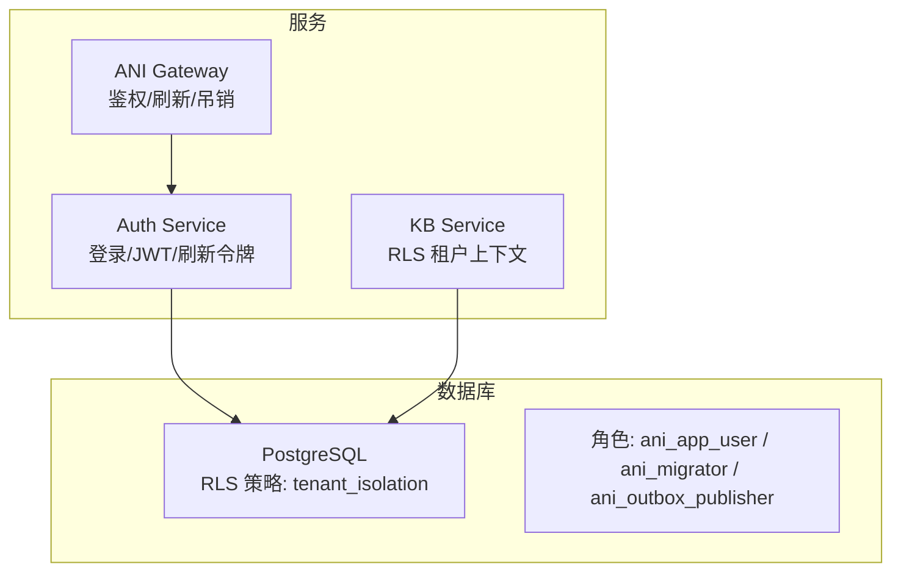
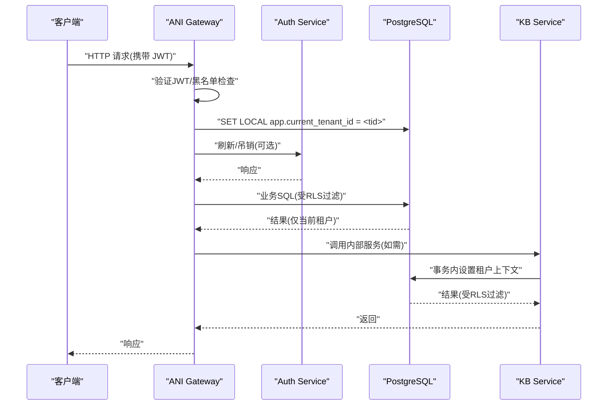
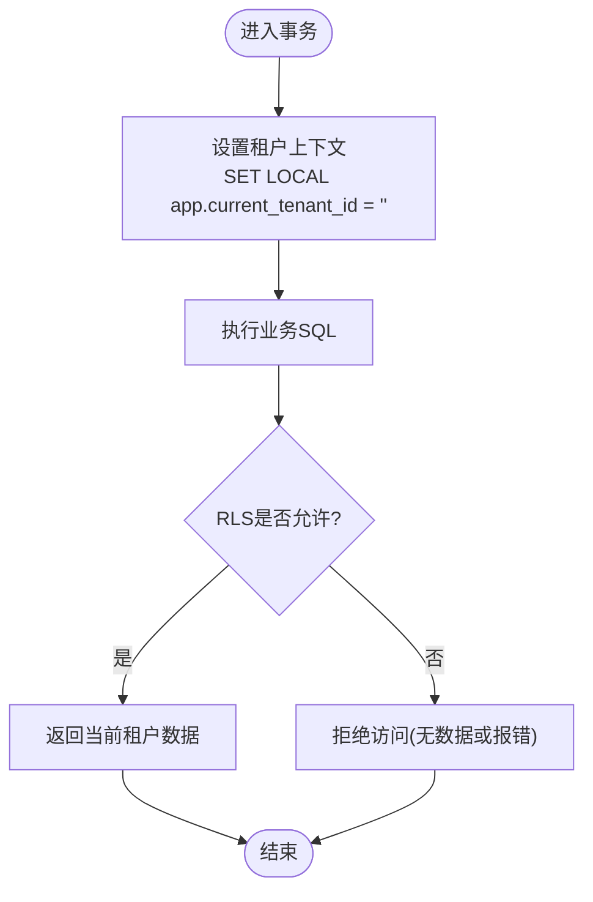
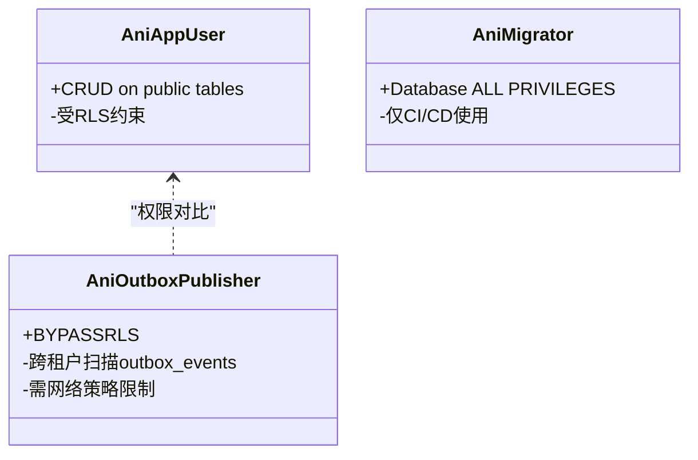
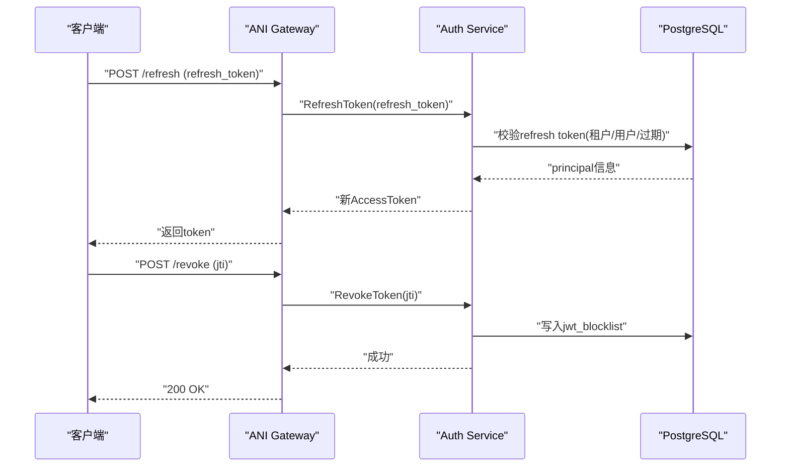
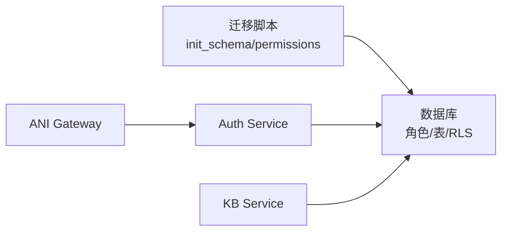

# 安全与权限

<cite>
**本文引用的文件**
- [20260501_001_init_schema.sql](file://repo/deploy/migrations/20260501_001_init_schema.sql)
- [20260502_003_permissions_schema.sql](file://repo/deploy/migrations/20260502_003_permissions_schema.sql)
- [rls.py](file://repo/services/kb-service/app/repositories/rls.py)
- [password_login.go](file://services/auth-service/internal/service/password_login.go)
- [platform_login.go](file://services/auth-service/internal/service/platform_login.go)
- [refresh_tokens_test.go](file://services/auth-service/internal/service/refresh_tokens_test.go)
- [auth.go](file://services/ani-gateway/internal/router/auth.go)
- [ANI-08-安全架构设计.md](file://ANI-08-安全架构设计.md)
</cite>

## 目录
1. [简介](#简介)
2. [项目结构](#项目结构)
3. [核心组件](#核心组件)
4. [架构总览](#架构总览)
5. [详细组件分析](#详细组件分析)
6. [依赖关系分析](#依赖关系分析)
7. [性能考虑](#性能考虑)
8. [故障排查指南](#故障排查指南)
9. [结论](#结论)
10. [附录](#附录)

## 简介
本文件聚焦 ANI 平台的安全与权限体系，围绕以下目标展开：
- 行级安全（RLS）策略实现与 tenant_isolation 的配置与应用
- 数据库角色权限模型：ani_app_user、ani_migrator、ani_outbox_publisher 等角色的权限边界
- JWT 令牌黑名单、刷新令牌、API Key 的安全存储与管理
- 多租户数据隔离的技术实现与安全边界
- 安全最佳实践、漏洞防护与合规性考虑

## 项目结构
安全相关能力横跨迁移脚本、认证服务、网关与知识库服务等模块：
- 数据库层：初始 schema 定义、权限表与 RLS 策略
- 认证服务：登录流程、JWT 签发与校验、刷新令牌持久化
- 网关：鉴权中间件、刷新与吊销接口转发
- 知识库服务：在事务中设置租户上下文以驱动 RLS

**图表来源**
- [20260501_001_init_schema.sql:12-27](file://repo/deploy/migrations/20260501_001_init_schema.sql#L12-L27)
- [20260501_001_init_schema.sql:525-627](file://repo/deploy/migrations/20260501_001_init_schema.sql#L525-L627)
- [password_login.go:76-91](file://services/auth-service/internal/service/password_login.go#L76-L91)
- [platform_login.go:72-88](file://services/auth-service/internal/service/platform_login.go#L72-L88)
- [rls.py:16-32](file://repo/services/kb-service/app/repositories/rls.py#L16-L32)

**章节来源**
- [20260501_001_init_schema.sql:12-27](file://repo/deploy/migrations/20260501_001_init_schema.sql#L12-L27)
- [20260501_001_init_schema.sql:525-627](file://repo/deploy/migrations/20260501_001_init_schema.sql#L525-L627)

## 核心组件
- 数据库角色与权限
  - ani_app_user：应用连接账号，非 owner/superuser/bypassrls，受 RLS 约束，具备对业务表的 CRUD 权限
  - ani_migrator：迁移专用，拥有数据库级全部权限，仅 CI/CD 使用
  - ani_outbox_publisher：bypassrls 专用角色，用于跨租户扫描 outbox_events 发布消息，需配合网络策略限制访问来源
- 行级安全（RLS）
  - 所有业务表启用并强制 RLS，策略统一为 tenant_isolation，通过会话变量 app.current_tenant_id 过滤
  - Python 仓库方法需在事务内调用 set_tenant_context(conn, tenant_id) 设置租户上下文
- 认证与授权
  - 登录成功后签发 AccessToken 与 RefreshToken；RefreshToken 持久化到 refresh_tokens 表，支持过期与吊销
  - JWT 黑名单（jwt_blocklist）+ 缓存快路径，支持 RevokeToken 立即失效
  - API Key 以哈希形式存储，绑定租户与用户，支持限流与吊销
- 多租户隔离
  - 数据库层 RLS 是最后一道防线；网络层 KubeOVN VPC 隔离；K8s RBAC/NetworkPolicy 控制服务间通信

**章节来源**
- [20260501_001_init_schema.sql:12-27](file://repo/deploy/migrations/20260501_001_init_schema.sql#L12-L27)
- [20260501_001_init_schema.sql:82-120](file://repo/deploy/migrations/20260501_001_init_schema.sql#L82-L120)
- [20260501_001_init_schema.sql:525-627](file://repo/deploy/migrations/20260501_001_init_schema.sql#L525-L627)
- [rls.py:16-32](file://repo/services/kb-service/app/repositories/rls.py#L16-L32)
- [ANI-08-安全架构设计.md:175-218](file://ANI-08-安全架构设计.md#L175-L218)

## 架构总览
下图展示从客户端请求到数据库访问的完整鉴权与隔离链路。

**图表来源**
- [auth.go:369-396](file://services/ani-gateway/internal/router/auth.go#L369-L396)
- [20260501_001_init_schema.sql:525-627](file://repo/deploy/migrations/20260501_001_init_schema.sql#L525-L627)
- [rls.py:16-32](file://repo/services/kb-service/app/repositories/rls.py#L16-L32)

## 详细组件分析

### 行级安全（RLS）与 tenant_isolation
- 策略定义
  - 所有业务表启用并强制 RLS，策略名称统一为 tenant_isolation
  - 过滤条件基于会话变量 app.current_tenant_id，确保只返回当前租户数据
- 应用侧设置
  - Python 仓库方法必须在事务内调用 set_tenant_context(conn, tenant_id)，将租户ID注入会话变量
  - 该函数会校验 tenant_id 为合法 UUID，再执行 SET LOCAL，避免 SQL 注入风险
- 覆盖范围
  - 包括 knowledge_bases、kb_documents、kb_sessions、kb_messages、models、inference_services、workload_instances、async_tasks、api_keys、refresh_tokens、audit_logs、metering_records、outbox_events 等

**图表来源**
- [rls.py:16-32](file://repo/services/kb-service/app/repositories/rls.py#L16-L32)
- [20260501_001_init_schema.sql:525-627](file://repo/deploy/migrations/20260501_001_init_schema.sql#L525-L627)

**章节来源**
- [rls.py:16-32](file://repo/services/kb-service/app/repositories/rls.py#L16-L32)
- [20260501_001_init_schema.sql:525-627](file://repo/deploy/migrations/20260501_001_init_schema.sql#L525-L627)

### 数据库角色权限模型
- ani_app_user
  - 用途：微服务应用连接账号
  - 权限：对 public schema 下所有表具备 SELECT/INSERT/UPDATE/DELETE
  - 约束：非 owner、非 superuser、非 bypassrls，严格受 RLS 约束
- ani_migrator
  - 用途：CI/CD 迁移专用
  - 权限：数据库级 ALL PRIVILEGES，不应用于运行时
- ani_outbox_publisher
  - 用途：跨租户扫描 outbox_events 并发布到消息总线
  - 权限：BYPASSRLS，必须配合网络策略限制访问来源，防止滥用

**图表来源**
- [20260501_001_init_schema.sql:12-27](file://repo/deploy/migrations/20260501_001_init_schema.sql#L12-L27)

**章节来源**
- [20260501_001_init_schema.sql:12-27](file://repo/deploy/migrations/20260501_001_init_schema.sql#L12-L27)

### JWT 令牌黑名单与刷新令牌
- 刷新令牌
  - 登录成功后生成并持久化到 refresh_tokens 表，记录用户、租户、角色、过期时间
  - 刷新时仅颁发新的 AccessToken，不续发 RefreshToken，遵循不可续期策略
- 黑名单
  - 吊销时将 jti 写入 jwt_blocklist，并在缓存中快速命中，提高吊销效率
- 网关集成
  - Gateway 提供刷新与吊销接口，转发至 Auth Service 处理

**图表来源**
- [password_login.go:76-91](file://services/auth-service/internal/service/password_login.go#L76-L91)
- [platform_login.go:72-88](file://services/auth-service/internal/service/platform_login.go#L72-L88)
- [refresh_tokens_test.go:115-139](file://services/auth-service/internal/service/refresh_tokens_test.go#L115-L139)
- [auth.go:369-396](file://services/ani-gateway/internal/router/auth.go#L369-L396)

**章节来源**
- [password_login.go:76-91](file://services/auth-service/internal/service/password_login.go#L76-L91)
- [platform_login.go:72-88](file://services/auth-service/internal/service/platform_login.go#L72-L88)
- [refresh_tokens_test.go:115-139](file://services/auth-service/internal/service/refresh_tokens_test.go#L115-L139)
- [auth.go:369-396](file://services/ani-gateway/internal/router/auth.go#L369-L396)

### API Key 的安全存储与管理
- 存储
  - 数据库中仅存储 SHA256(api_key)，原始值仅在创建时返回一次
  - 与租户、用户、权限范围绑定，不可跨租户使用
- 管理
  - 支持按 Key 限流、吊销、查看最后使用时间
  - 结合 RBAC 与网关中间件进行调用控制

**章节来源**
- [20260501_001_init_schema.sql:82-100](file://repo/deploy/migrations/20260501_001_init_schema.sql#L82-L100)
- [ANI-08-安全架构设计.md:211-218](file://ANI-08-安全架构设计.md#L211-L218)

### 多租户数据隔离与安全边界
- 数据库层
  - RLS 强制隔离，所有查询均受 app.current_tenant_id 约束
- 网络层
  - KubeOVN VPC 隔离租户流量，默认拒绝跨租户访问
- 服务层
  - Gateway 在会话中设置租户上下文，服务间调用信任已鉴权的上下文
- 审计与合规
  - 操作审计日志不可篡改，保留周期满足等保要求

**章节来源**
- [20260501_001_init_schema.sql:525-627](file://repo/deploy/migrations/20260501_001_init_schema.sql#L525-L627)
- [ANI-08-安全架构设计.md:234-252](file://ANI-08-安全架构设计.md#L234-L252)

## 依赖关系分析
- 认证服务依赖数据库角色与表：users、roles、user_roles、refresh_tokens、jwt_blocklist
- 网关依赖认证服务提供的刷新与吊销接口
- 知识库服务依赖 RLS 策略与租户上下文设置
- 迁移脚本定义角色、表结构与 RLS 策略，是安全能力的基石

**图表来源**
- [20260501_001_init_schema.sql:12-27](file://repo/deploy/migrations/20260501_001_init_schema.sql#L12-L27)
- [20260502_003_permissions_schema.sql:20-77](file://repo/deploy/migrations/20260502_003_permissions_schema.sql#L20-L77)
- [rls.py:16-32](file://repo/services/kb-service/app/repositories/rls.py#L16-L32)

**章节来源**
- [20260501_001_init_schema.sql:12-27](file://repo/deploy/migrations/20260501_001_init_schema.sql#L12-L27)
- [20260502_003_permissions_schema.sql:20-77](file://repo/deploy/migrations/20260502_003_permissions_schema.sql#L20-L77)

## 性能考虑
- RLS 过滤由数据库引擎执行，避免应用层重复过滤，减少越权风险
- JWT 黑名单采用“缓存快路径 + 持久化兜底”，提升吊销响应速度
- RefreshToken 仅颁发 AccessToken，降低令牌体积与传输开销
- Outbox Publisher 使用 BYPASSRLS 角色，但需严格网络策略限制，避免全表扫描影响性能

[本节为通用指导，无需特定文件引用]

## 故障排查指南
- 无法访问其他租户数据
  - 检查是否在事务内正确设置租户上下文
  - 确认 RLS 策略已启用且策略谓词匹配
- 刷新令牌失败
  - 检查 refresh_tokens 表中是否存在有效记录
  - 确认租户与用户匹配，未过期且未被吊销
- JWT 吊销无效
  - 检查 jwt_blocklist 是否写入成功
  - 确认网关与服务端缓存是否同步
- Outbox 事件未发布
  - 检查 ani_outbox_publisher 角色权限与网络连接
  - 确认 outbox_events 索引与轮询逻辑正常

**章节来源**
- [rls.py:16-32](file://repo/services/kb-service/app/repositories/rls.py#L16-L32)
- [20260501_001_init_schema.sql:82-120](file://repo/deploy/migrations/20260501_001_init_schema.sql#L82-L120)
- [auth.go:369-396](file://services/ani-gateway/internal/router/auth.go#L369-L396)

## 结论
ANI 平台通过“网络隔离 + 身份认证 + RBAC + RLS”的多层纵深防御，实现了强隔离的多租户安全模型。数据库角色权限清晰，JWT 与刷新令牌机制完善，API Key 安全可控。建议在生产环境中持续强化网络策略、证书轮换与审计合规，确保系统长期安全运行。

[本节为总结，无需特定文件引用]

## 附录
- 安全最佳实践
  - 所有外部输入必须校验类型与长度，禁止拼接 SQL
  - 密码与密钥使用 bcrypt/SHA256 存储，不在日志与错误中暴露
  - 最小权限原则：每个服务仅授予必要权限
  - 定期扫描依赖与镜像，及时修复高危漏洞
- 合规性考虑
  - 审计日志不可篡改，保留周期满足等保要求
  - 传输层强制 TLS 1.3，禁用弱加密套件
  - 敏感数据脱敏与加密存储，密钥不落盘

[本节为通用指导，无需特定文件引用]