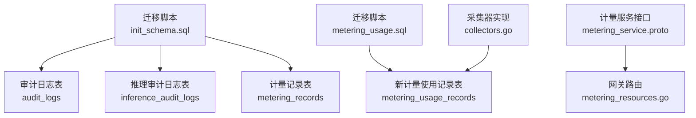
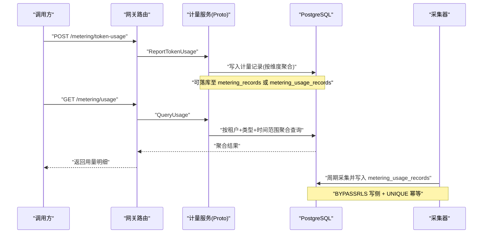
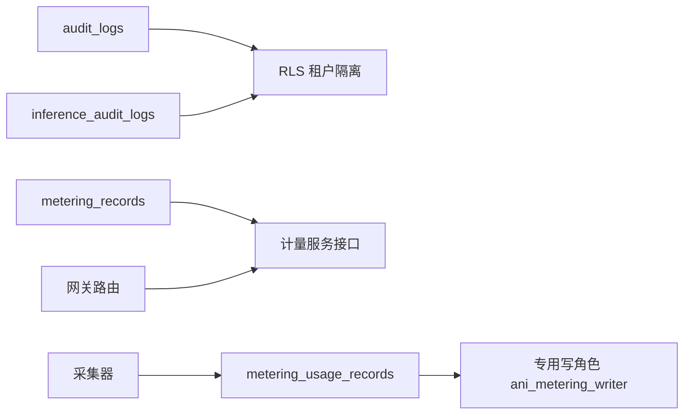

# 审计计量表

<cite>
**本文引用的文件**
- [20260501_001_init_schema.sql](file://repo/deploy/migrations/20260501_001_init_schema.sql)
- [20260731_001_metering_usage.sql](file://repo/deploy/migrations/20260731_001_metering_usage.sql)
- [metering_service.proto](file://repo/api/proto/metering/v1/metering_service.proto)
- [metering_resources.go](file://repo/services/ani-gateway/internal/router/metering_resources.go)
- [collectors.go](file://repo/pkg/adapters/metering/collectors.go)
- [plan-metering-consumer-v2.md](file://repo/services/tasks/modules/plan/plan-metering-consumer-v2.md)
</cite>

## 目录
1. [简介](#简介)
2. [项目结构](#项目结构)
3. [核心组件](#核心组件)
4. [架构总览](#架构总览)
5. [详细组件分析](#详细组件分析)
6. [依赖关系分析](#依赖关系分析)
7. [性能与成本优化](#性能与成本优化)
8. [故障排查指南](#故障排查指南)
9. [结论](#结论)
10. [附录](#附录)

## 简介
本文件聚焦 ANI 平台的审计与计量相关数据表设计与实现，覆盖以下主题：
- 审计日志表（audit_logs）、推理审计日志表（inference_audit_logs）的分区策略、记录规范与查询优化。
- 计量记录表（metering_records）与新计量使用记录表（metering_usage_records）的设计差异、采集频率、聚合方式与计费关联。
- 时间序列数据的按月分区方案及 TimescaleDB hypertable 转换路径。
- 大数据量场景下的性能优化与存储成本考虑。

## 项目结构
与审计计量相关的核心文件包括数据库迁移脚本、计量服务接口定义、网关路由与采集器实现等。下图给出与本文直接相关的文件与职责概览。

图表来源
- [20260501_001_init_schema.sql:254-281](file://repo/deploy/migrations/20260501_001_init_schema.sql#L254-L281)
- [20260501_001_init_schema.sql:440-454](file://repo/deploy/migrations/20260501_001_init_schema.sql#L440-L454)
- [20260501_001_init_schema.sql:500-523](file://repo/deploy/migrations/20260501_001_init_schema.sql#L500-L523)
- [20260731_001_metering_usage.sql:21-37](file://repo/deploy/migrations/20260731_001_metering_usage.sql#L21-L37)
- [metering_service.proto:11-22](file://repo/api/proto/metering/v1/metering_service.proto#L11-L22)
- [metering_resources.go:65-93](file://repo/services/ani-gateway/internal/router/metering_resources.go#L65-L93)
- [collectors.go:19-43](file://repo/pkg/adapters/metering/collectors.go#L19-L43)

章节来源
- [20260501_001_init_schema.sql:254-281](file://repo/deploy/migrations/20260501_001_init_schema.sql#L254-L281)
- [20260501_001_init_schema.sql:440-454](file://repo/deploy/migrations/20260501_001_init_schema.sql#L440-L454)
- [20260501_001_init_schema.sql:500-523](file://repo/deploy/migrations/20260501_001_init_schema.sql#L500-L523)
- [20260731_001_metering_usage.sql:21-50](file://repo/deploy/migrations/20260731_001_metering_usage.sql#L21-L50)
- [metering_service.proto:11-70](file://repo/api/proto/metering/v1/metering_service.proto#L11-L70)
- [metering_resources.go:65-179](file://repo/services/ani-gateway/internal/router/metering_resources.go#L65-L179)
- [collectors.go:19-43](file://repo/pkg/adapters/metering/collectors.go#L19-L43)

## 核心组件
- 审计日志表 audit_logs：操作层面审计，按月分区，支持租户隔离 RLS。
- 推理审计日志表 inference_audit_logs：推理调用审计，高写入量，按月分区，支持租户隔离。
- 计量记录表 metering_records：历史计量落库表，建议转换为 TimescaleDB hypertable。
- 新计量使用记录表 metering_usage_records：面向实例维度的通用计量落地表，具备幂等约束与专用写角色。

章节来源
- [20260501_001_init_schema.sql:254-281](file://repo/deploy/migrations/20260501_001_init_schema.sql#L254-L281)
- [20260501_001_init_schema.sql:440-454](file://repo/deploy/migrations/20260501_001_init_schema.sql#L440-L454)
- [20260501_001_init_schema.sql:500-523](file://repo/deploy/migrations/20260501_001_init_schema.sql#L500-L523)
- [20260731_001_metering_usage.sql:21-50](file://repo/deploy/migrations/20260731_001_metering_usage.sql#L21-L50)

## 架构总览
审计与计量在系统中的交互如下：
- 推理调用产生审计日志写入 inference_audit_logs（按月分区）。
- 平台操作产生审计日志写入 audit_logs（按月分区）。
- 资源用量通过计量服务接口上报或采集，最终持久化到 metering_records 或 metering_usage_records。
- 网关暴露计量查询与上报接口，供内部服务或控制台消费。

图表来源
- [metering_resources.go:65-179](file://repo/services/ani-gateway/internal/router/metering_resources.go#L65-L179)
- [metering_service.proto:11-70](file://repo/api/proto/metering/v1/metering_service.proto#L11-L70)
- [collectors.go:19-43](file://repo/pkg/adapters/metering/collectors.go#L19-L43)
- [20260731_001_metering_usage.sql:21-50](file://repo/deploy/migrations/20260731_001_metering_usage.sql#L21-L50)

## 详细组件分析

### 审计日志表 audit_logs
- 设计要点
  - 按月分区：以 created_at 为分区键，便于按时间裁剪与归档。
  - 租户隔离：启用 RLS，读侧通过 app.current_tenant_id 过滤。
  - 字段包含：tenant_id、user_id、request_id、action、resource、result、details、ip_address、user_agent、created_at。
  - 索引：按 tenant_id、created_at 建立索引，提升常见查询性能。
- 记录规范
  - action 表示具体操作（如 user.login、model.deploy、kb.create）。
  - result 限定 success/failure。
  - details 使用 JSONB 承载扩展信息。
- 查询优化
  - 常用查询条件：tenant_id、created_at 范围；建议结合分区裁剪与索引扫描。
  - 避免全表扫描，尽量带上时间范围与租户过滤。
- 保留策略
  - 按月分区天然支持按月份清理旧数据。
  - 可配合外部归档或冷热分层降低长期存储成本。

章节来源
- [20260501_001_init_schema.sql:500-523](file://repo/deploy/migrations/20260501_001_init_schema.sql#L500-L523)
- [20260501_001_init_schema.sql:605-617](file://repo/deploy/migrations/20260501_001_init_schema.sql#L605-L617)

### 推理审计日志表 inference_audit_logs
- 设计要点
  - 高写入量场景，按月分区，分区键为 created_at。
  - 字段包含：tenant_id、service_id、user_id、api_key_id、request_id、model_name、input_tokens、output_tokens、duration_ms、status_code、created_at。
  - 索引：按 tenant_id、created_at 建立索引。
- 记录规范
  - request_id 用于全链路追踪。
  - input_tokens/output_tokens 用于 Token 级计量。
  - duration_ms/status_code 用于性能与状态统计。
- 查询优化
  - 典型查询：按租户、模型、时间段聚合 token 数与耗时。
  - 利用分区裁剪与索引快速定位数据。
- 保留策略
  - 按月分区便于定期清理或归档。
  - 可结合 TimescaleDB hypertable 进行自动管理与压缩。

章节来源
- [20260501_001_init_schema.sql:254-281](file://repo/deploy/migrations/20260501_001_init_schema.sql#L254-L281)
- [20260501_001_init_schema.sql:648-650](file://repo/deploy/migrations/20260501_001_init_schema.sql#L648-L650)

### 计量记录表 metering_records
- 设计要点
  - 历史计量落库表，字段包含：id、tenant_id、az_name、resource_type、resource_id、quantity、unit、recorded_at。
  - 复合主键 (id, recorded_at)，适合时序数据。
  - 索引：按 tenant_id、recorded_at 与 resource_type、recorded_at。
- 采集频率与聚合
  - 由上层服务按事件或周期上报，单位可为 hours、GB·hours、tokens、calls。
  - 支持按 az、resource_type、day/hour 分组聚合。
- 计费关联
  - 通过 resource_type 与 unit 映射到计费维度（如 gpu_hours、input_tokens）。
  - 可与 BOSS 报表对接，提供月度汇总。
- 保留策略
  - 建议转换为 TimescaleDB hypertable，按天分块，便于压缩与降采样。

章节来源
- [20260501_001_init_schema.sql:440-454](file://repo/deploy/migrations/20260501_001_init_schema.sql#L440-L454)
- [20260501_001_init_schema.sql:648-650](file://repo/deploy/migrations/20260501_001_init_schema.sql#L648-L650)
- [metering_service.proto:24-70](file://repo/api/proto/metering/v1/metering_service.proto#L24-L70)

### 新计量使用记录表 metering_usage_records
- 设计要点
  - 通用计量落地表，覆盖多种维度（GPU/CPU/内存等）。
  - 字段包含：id、tenant_id、resource_ref、resource_type、period、quantity、unit、recorded_at。
  - 唯一约束：(tenant_id, resource_ref, resource_type, period) 保证同一实例同一维度同一周期仅一行，实现写入幂等。
  - 专用写角色 ani_metering_writer（BYPASSRLS），读侧走普通用户并启用 RLS。
- 采集频率与聚合
  - 采集器按分钟对齐生成 period，周期内累计 quantity。
  - 支持按租户、资源类型、时间范围查询。
- 计费关联
  - resource_type 与 unit 对应计费维度（如 gpu_second、cpu_second、gib_second）。
  - 可通过 QueryUsage 接口获取聚合结果，供计费系统使用。
- 保留策略
  - 可按 period 或 recorded_at 进行归档与清理。

章节来源
- [20260731_001_metering_usage.sql:21-50](file://repo/deploy/migrations/20260731_001_metering_usage.sql#L21-L50)
- [plan-metering-consumer-v2.md:277-339](file://repo/services/tasks/modules/plan/plan-metering-consumer-v2.md#L277-L339)

### 时间序列数据分区策略与 TimescaleDB 转换
- 分区策略
  - audit_logs 与 inference_audit_logs 采用按月分区，分区键为 created_at。
  - 初始迁移创建当月与下月分区，后续由定时任务维护。
- TimescaleDB 转换方案
  - 可将 metering_records 与 inference_audit_logs 转换为 hypertable。
  - chunk_time_interval 建议：metering_records 按天，inference_audit_logs 按月。
  - 转换后获得自动分块、压缩、降采样等能力。

章节来源
- [20260501_001_init_schema.sql:254-281](file://repo/deploy/migrations/20260501_001_init_schema.sql#L254-L281)
- [20260501_001_init_schema.sql:500-523](file://repo/deploy/migrations/20260501_001_init_schema.sql#L500-L523)
- [20260501_001_init_schema.sql:648-650](file://repo/deploy/migrations/20260501_001_init_schema.sql#L648-L650)

### 审计日志记录规范与查询优化
- 记录规范
  - 审计日志需包含租户、用户、请求ID、动作、资源、结果、详情、IP、UA、时间戳。
  - 推理审计日志需包含服务ID、API Key ID、模型名、输入输出 Token、耗时、状态码。
- 查询优化
  - 优先使用租户与时间范围过滤，利用分区裁剪与索引。
  - 对高频查询建立合适索引（如 tenant_id、created_at）。
  - 避免 SELECT *，只取必要字段减少 IO。
- 数据保留策略
  - 按月分区便于按月份清理或归档。
  - 对冷数据可压缩或迁移至低成本存储。

章节来源
- [20260501_001_init_schema.sql:500-523](file://repo/deploy/migrations/20260501_001_init_schema.sql#L500-L523)
- [20260501_001_init_schema.sql:254-281](file://repo/deploy/migrations/20260501_001_init_schema.sql#L254-L281)

### 计量数据采集频率、聚合方式与计费关联
- 采集频率
  - 采集器按分钟对齐生成 period，周期内累计 quantity。
  - 支持 GPU/CPU/内存等多维度采集。
- 聚合方式
  - 按租户、资源类型、时间范围聚合 total_quantity。
  - 支持 group_by 为 resource_type、az、day、hour。
- 计费关联
  - resource_type 与 unit 映射到计费维度。
  - 通过 GetSummary 接口提供月度汇总，供 BOSS 报表使用。

章节来源
- [collectors.go:19-43](file://repo/pkg/adapters/metering/collectors.go#L19-L43)
- [metering_service.proto:24-70](file://repo/api/proto/metering/v1/metering_service.proto#L24-L70)
- [plan-metering-consumer-v2.md:277-339](file://repo/services/tasks/modules/plan/plan-metering-consumer-v2.md#L277-L339)

## 依赖关系分析
- 审计日志与推理审计日志依赖 PostgreSQL 分区表与 RLS 机制。
- 计量记录依赖计量服务接口与采集器实现。
- 新计量使用记录依赖专用写角色与唯一约束保证幂等。
- 网关路由依赖计量服务接口暴露查询与上报能力。

图表来源
- [20260501_001_init_schema.sql:500-523](file://repo/deploy/migrations/20260501_001_init_schema.sql#L500-L523)
- [20260501_001_init_schema.sql:254-281](file://repo/deploy/migrations/20260501_001_init_schema.sql#L254-L281)
- [20260731_001_metering_usage.sql:21-50](file://repo/deploy/migrations/20260731_001_metering_usage.sql#L21-L50)
- [metering_service.proto:11-70](file://repo/api/proto/metering/v1/metering_service.proto#L11-L70)
- [metering_resources.go:65-179](file://repo/services/ani-gateway/internal/router/metering_resources.go#L65-L179)
- [collectors.go:19-43](file://repo/pkg/adapters/metering/collectors.go#L19-L43)

章节来源
- [20260501_001_init_schema.sql:500-523](file://repo/deploy/migrations/20260501_001_init_schema.sql#L500-L523)
- [20260501_001_init_schema.sql:254-281](file://repo/deploy/migrations/20260501_001_init_schema.sql#L254-L281)
- [20260731_001_metering_usage.sql:21-50](file://repo/deploy/migrations/20260731_001_metering_usage.sql#L21-L50)
- [metering_service.proto:11-70](file://repo/api/proto/metering/v1/metering_service.proto#L11-L70)
- [metering_resources.go:65-179](file://repo/services/ani-gateway/internal/router/metering_resources.go#L65-L179)
- [collectors.go:19-43](file://repo/pkg/adapters/metering/collectors.go#L19-L43)

## 性能与成本优化
- 分区裁剪
  - 审计日志与推理审计日志按月分区，查询时带上时间范围可显著减少扫描数据量。
- 索引优化
  - 为高频查询字段建立索引（如 tenant_id、created_at）。
  - 避免过度索引影响写入性能。
- TimescaleDB 转换
  - 将 metering_records 与 inference_audit_logs 转换为 hypertable，启用自动分块、压缩与降采样。
- 存储成本
  - 对冷数据定期归档或压缩。
  - 合理设置保留策略，避免无限增长。
- 写入优化
  - 使用批量写入与事务合并减少 IO。
  - 利用唯一约束与 ON CONFLICT DO NOTHING 实现幂等写入。

[本节为通用指导，不直接分析具体文件]

## 故障排查指南
- 审计日志缺失
  - 检查分区是否创建与维护。
  - 验证 RLS 策略是否正确配置。
  - 确认写入权限与连接账号。
- 计量数据异常
  - 检查采集器是否正常运行。
  - 验证 period 对齐与唯一约束冲突。
  - 确认专用写角色权限与 BYPASSRLS 配置。
- 查询性能问题
  - 分析执行计划，确认分区裁剪与索引使用。
  - 调整查询条件，避免全表扫描。

章节来源
- [20260501_001_init_schema.sql:500-523](file://repo/deploy/migrations/20260501_001_init_schema.sql#L500-L523)
- [20260501_001_init_schema.sql:254-281](file://repo/deploy/migrations/20260501_001_init_schema.sql#L254-L281)
- [20260731_001_metering_usage.sql:21-50](file://repo/deploy/migrations/20260731_001_metering_usage.sql#L21-L50)

## 结论
ANI 平台的审计与计量体系通过分区表、RLS 隔离、专用写角色与唯一约束等手段，实现了高写入量场景下的可靠记录与高效查询。审计日志与推理审计日志按月分区，便于保留与归档；计量记录支持多维度聚合与计费关联。未来可通过 TimescaleDB hypertable 进一步提升时序数据处理能力。建议在大数据量场景下持续优化索引、分区与存储策略，平衡性能与成本。

[本节为总结性内容，不直接分析具体文件]

## 附录
- 关键表结构参考
  - audit_logs：操作审计，按月分区。
  - inference_audit_logs：推理审计，按月分区。
  - metering_records：历史计量，建议 hypertable。
  - metering_usage_records：新计量使用记录，幂等与专用写角色。
- 接口参考
  - RecordUsage、QueryUsage、GetSummary。
- 采集器参考
  - DCGMGPUCollector 采集 GPU 占用时长。

章节来源
- [20260501_001_init_schema.sql:500-523](file://repo/deploy/migrations/20260501_001_init_schema.sql#L500-L523)
- [20260501_001_init_schema.sql:254-281](file://repo/deploy/migrations/20260501_001_init_schema.sql#L254-L281)
- [20260501_001_init_schema.sql:440-454](file://repo/deploy/migrations/20260501_001_init_schema.sql#L440-L454)
- [20260731_001_metering_usage.sql:21-50](file://repo/deploy/migrations/20260731_001_metering_usage.sql#L21-L50)
- [metering_service.proto:11-70](file://repo/api/proto/metering/v1/metering_service.proto#L11-L70)
- [collectors.go:19-43](file://repo/pkg/adapters/metering/collectors.go#L19-L43)