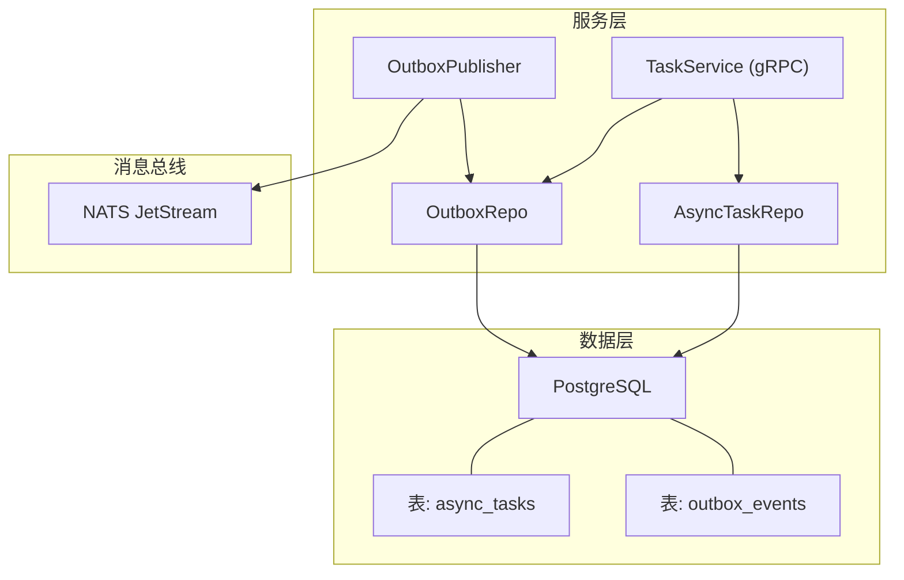
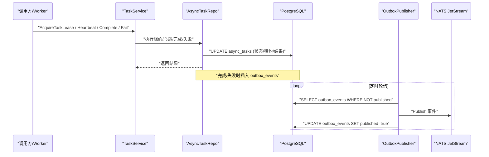
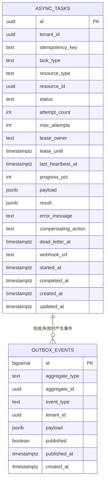
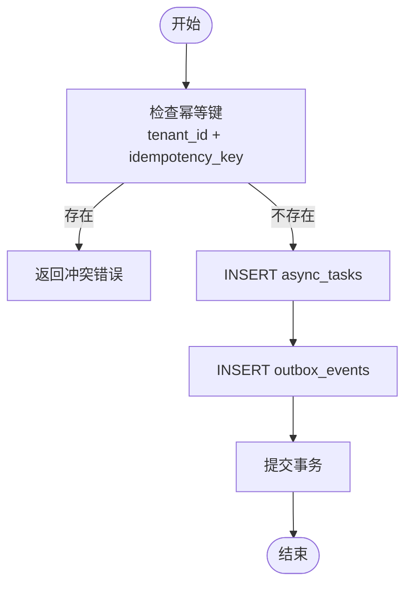
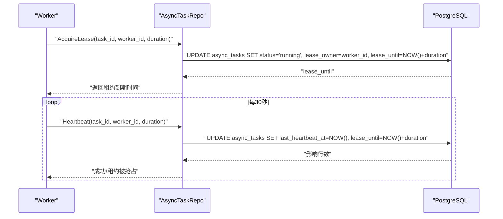
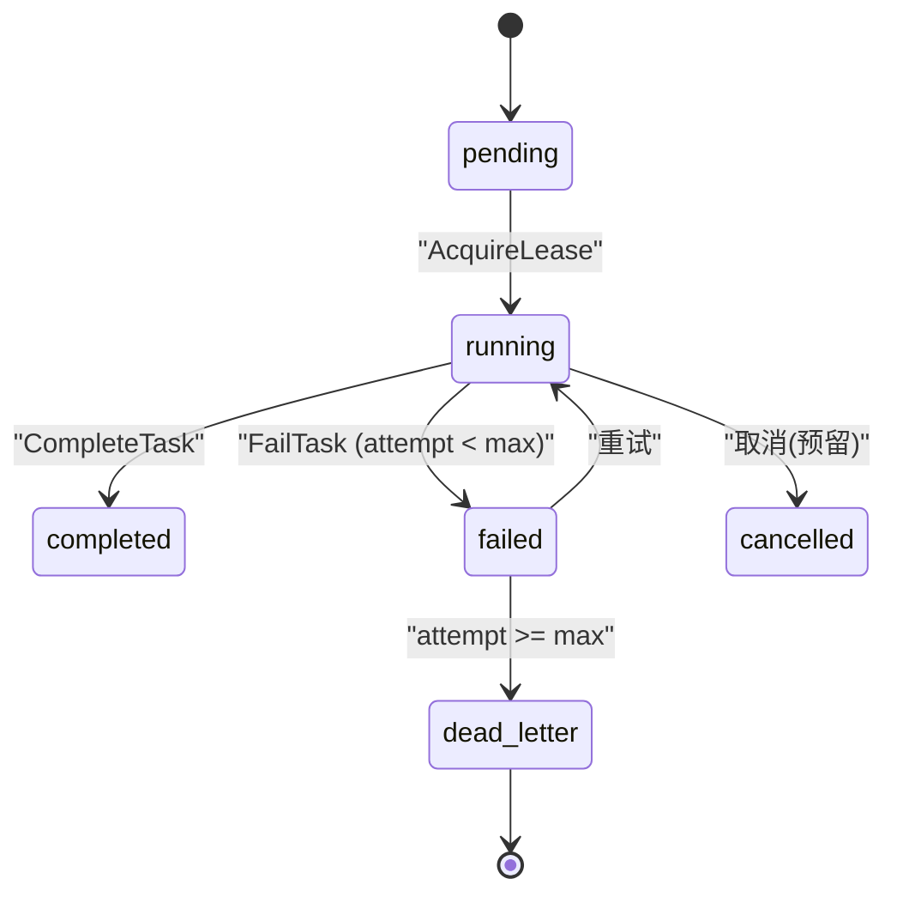
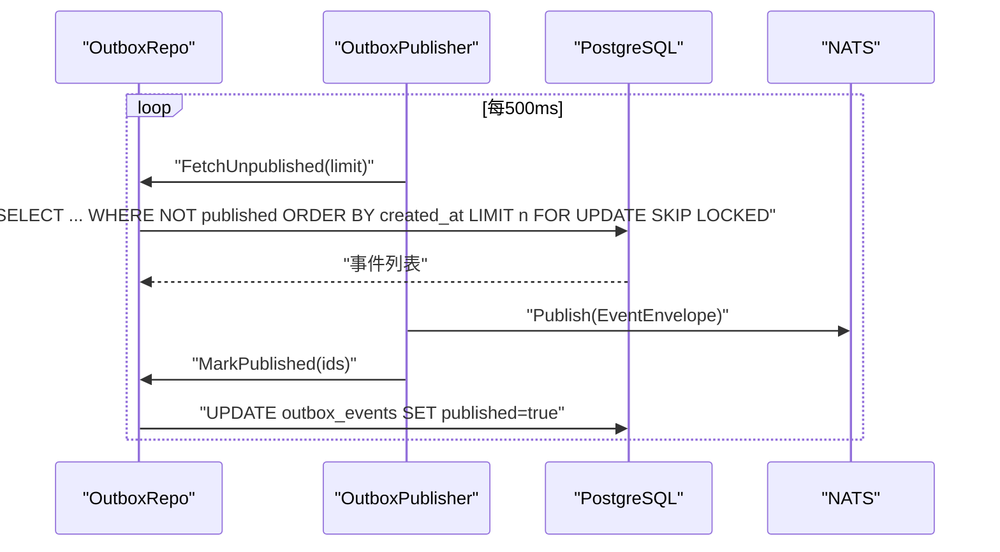
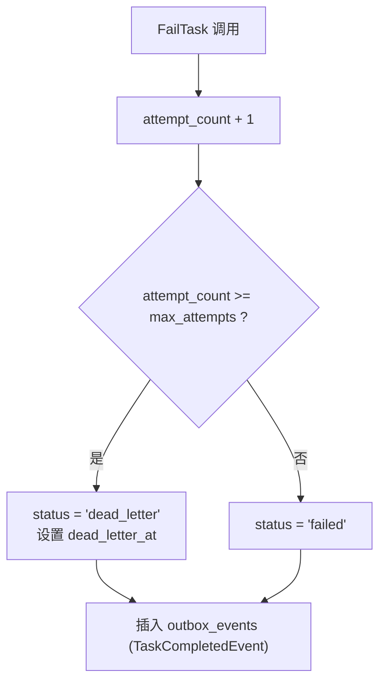
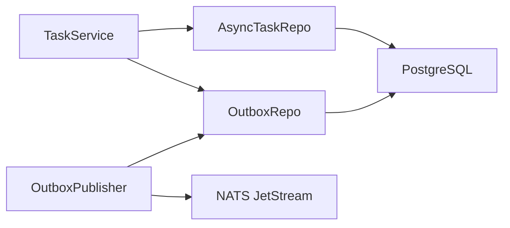

# 异步任务表

<cite>
**本文引用的文件**
- [20260501_001_init_schema.sql](file://repo/deploy/migrations/20260501_001_init_schema.sql)
- [task_repo.go](file://repo/pkg/repo/task_repo.go)
- [outbox_repo.go](file://repo/pkg/repo/outbox_repo.go)
- [task_service.go](file://repo/services/task-service/internal/service/task_service.go)
- [outbox_publisher.go](file://repo/services/task-service/internal/worker/outbox_publisher.go)
- [task_service.proto](file://repo/api/proto/task/v1/task_service.proto)
- [async_task_store.go](file://repo/pkg/adapters/runtime/async_task_store.go)
</cite>

## 目录
1. [简介](#简介)
2. [项目结构](#项目结构)
3. [核心组件](#核心组件)
4. [架构总览](#架构总览)
5. [详细组件分析](#详细组件分析)
6. [依赖关系分析](#依赖关系分析)
7. [性能考虑](#性能考虑)
8. [故障排查指南](#故障排查指南)
9. [结论](#结论)
10. [附录](#附录)

## 简介
本文件聚焦于异步任务相关的数据表与实现：async_tasks（异步任务）与 outbox_events（出站事件）。文档围绕以下目标展开：
- 解释 Saga 模式在异步任务中的应用，包括幂等性保证、租约机制、心跳检测、死信队列。
- 说明 Outbox 模式的实现原理，确保数据库操作与消息发布的原子性。
- 描述任务状态机、重试策略、补偿动作的执行流程。
- 提供任务监控、故障排查与性能调优建议。

## 项目结构
与异步任务相关的代码分布在迁移脚本、仓库层、服务层与消息发布器中：
- 数据模型定义在迁移脚本中，包含 async_tasks 与 outbox_events 的表结构、索引与行级安全策略。
- 仓库层封装了任务创建、租约获取、心跳、完成/失败、过期租约回收以及出站事件的读取与标记。
- 服务层暴露 gRPC 接口供 Worker 调用以推进任务生命周期。
- 出站事件由独立发布者轮询并投递到消息总线（NATS），并在同一事务中标记为已发布。

图表来源
- [task_repo.go:19-30](file://repo/pkg/repo/task_repo.go#L19-L30)
- [outbox_repo.go:24-33](file://repo/pkg/repo/outbox_repo.go#L24-L33)
- [outbox_publisher.go:14-25](file://repo/services/task-service/internal/worker/outbox_publisher.go#L14-L25)
- [20260501_001_init_schema.sql:354-406](file://repo/deploy/migrations/20260501_001_init_schema.sql#L354-L406)

章节来源
- [20260501_001_init_schema.sql:354-406](file://repo/deploy/migrations/20260501_001_init_schema.sql#L354-L406)
- [task_repo.go:19-30](file://repo/pkg/repo/task_repo.go#L19-L30)
- [outbox_repo.go:24-33](file://repo/pkg/repo/outbox_repo.go#L24-L33)
- [outbox_publisher.go:14-25](file://repo/services/task-service/internal/worker/outbox_publisher.go#L14-L25)

## 核心组件
- 异步任务仓库（AsyncTaskRepo）：负责任务的创建、查询、租约获取、心跳、进度更新、完成与失败处理，以及在成功或失败时写入出站事件。
- 出站事件仓库（OutboxRepo）：负责批量拉取未发布的事件，并在发布成功后批量标记为已发布。
- 出站事件发布者（OutboxPublisher）：定时从数据库拉取未发布事件，通过消息总线发布，并在同一事务中标记为已发布。
- 任务服务（TaskService）：对外暴露 gRPC 接口，Worker 通过该服务进行任务租约获取、心跳、进度上报、完成与失败通知。
- 数据模型（迁移脚本）：定义 async_tasks 与 outbox_events 表结构、索引、约束与行级安全策略。

章节来源
- [task_repo.go:74-125](file://repo/pkg/repo/task_repo.go#L74-L125)
- [task_repo.go:164-230](file://repo/pkg/repo/task_repo.go#L164-L230)
- [task_repo.go:259-343](file://repo/pkg/repo/task_repo.go#L259-L343)
- [outbox_repo.go:41-96](file://repo/pkg/repo/outbox_repo.go#L41-L96)
- [outbox_publisher.go:72-116](file://repo/services/task-service/internal/worker/outbox_publisher.go#L72-L116)
- [task_service.go:65-151](file://repo/services/task-service/internal/service/task_service.go#L65-L151)
- [20260501_001_init_schema.sql:354-406](file://repo/deploy/migrations/20260501_001_init_schema.sql#L354-L406)

## 架构总览
系统采用“业务写库 + Outbox 事件”的模式，将业务变更与消息发布解耦并通过事务保证一致性；同时使用任务租约与心跳机制避免僵尸任务，配合重试与死信队列保障可靠性。

图表来源
- [task_service.go:65-151](file://repo/services/task-service/internal/service/task_service.go#L65-L151)
- [task_repo.go:164-230](file://repo/pkg/repo/task_repo.go#L164-L230)
- [task_repo.go:259-343](file://repo/pkg/repo/task_repo.go#L259-L343)
- [outbox_repo.go:41-96](file://repo/pkg/repo/outbox_repo.go#L41-L96)
- [outbox_publisher.go:72-116](file://repo/services/task-service/internal/worker/outbox_publisher.go#L72-L116)

## 详细组件分析

### 数据模型：async_tasks 与 outbox_events
- async_tasks：记录异步任务的全生命周期信息，包括租户隔离键、幂等键、任务类型、资源关联、状态、尝试次数、最大尝试次数、租约持有者与过期时间、心跳时间、进度、负载与结果、错误信息、补偿动作、死信时间与回调地址等。具备唯一约束与多个索引以支持高效查询与调度。
- outbox_events：记录待发布的事件，包含聚合类型、聚合ID、事件类型、租户、负载、是否已发布及发布时间等，用于保证“写库+发消息”的原子性。

图表来源
- [20260501_001_init_schema.sql:354-406](file://repo/deploy/migrations/20260501_001_init_schema.sql#L354-L406)

章节来源
- [20260501_001_init_schema.sql:354-406](file://repo/deploy/migrations/20260501_001_init_schema.sql#L354-L406)

### 幂等性与事务原子性
- 幂等性：任务创建时使用租户ID与幂等键的唯一约束，重复提交会返回冲突错误，防止重复创建任务。
- 原子性：任务创建在同一事务内写入业务数据与 outbox_events；任务完成/失败也在事务内更新任务状态并插入出站事件，确保“写库+发事件”的一致性。

图表来源
- [task_repo.go:74-125](file://repo/pkg/repo/task_repo.go#L74-L125)

章节来源
- [task_repo.go:74-125](file://repo/pkg/repo/task_repo.go#L74-L125)

### 租约机制与心跳检测
- 租约获取：Worker 通过 AcquireLease 原子更新任务状态为 running，设置租约持有者与过期时间；若已被其他 Worker 持有或租约未过期则获取失败。
- 心跳续期：Worker 定期调用 Heartbeat 更新最后心跳时间与租约过期时间；若租约被抢占或状态不匹配则报错。
- 过期租约回收：通过查询 running 且租约过期的任务，交由协调器重新分配。

图表来源
- [task_repo.go:164-230](file://repo/pkg/repo/task_repo.go#L164-L230)

章节来源
- [task_repo.go:164-230](file://repo/pkg/repo/task_repo.go#L164-L230)

### 任务状态机与重试策略
- 状态集合：pending、running、completed、failed、cancelled、dead_letter。
- 重试策略：每次失败 attempt_count+1；当达到 max_attempts 时转为 dead_letter，否则回到 failed 等待重试。
- 补偿动作：失败时可记录 compensating_action，用于后续回滚或修复。

图表来源
- [task_service.proto:91-112](file://repo/api/proto/task/v1/task_service.proto#L91-L112)
- [task_repo.go:303-343](file://repo/pkg/repo/task_repo.go#L303-L343)
- [async_task_store.go:278-285](file://repo/pkg/adapters/runtime/async_task_store.go#L278-L285)

章节来源
- [task_service.proto:91-112](file://repo/api/proto/task/v1/task_service.proto#L91-L112)
- [task_repo.go:303-343](file://repo/pkg/repo/task_repo.go#L303-L343)
- [async_task_store.go:278-285](file://repo/pkg/adapters/runtime/async_task_store.go#L278-L285)

### Outbox 模式与消息发布
- 出栈事件写入：任务创建、完成或失败时在事务内写入 outbox_events。
- 发布流程：OutboxPublisher 定时拉取未发布事件，批量发送到消息总线，并在同一事务中标记为已发布，确保至少一次投递与最终一致性。
- 跨租户扫描：发布者使用专用角色 bypass RLS，严格限制访问来源，仅用于平台内部事件分发。

图表来源
- [outbox_repo.go:41-96](file://repo/pkg/repo/outbox_repo.go#L41-L96)
- [outbox_publisher.go:72-116](file://repo/services/task-service/internal/worker/outbox_publisher.go#L72-L116)
- [20260501_001_init_schema.sql:25-27](file://repo/deploy/migrations/20260501_001_init_schema.sql#L25-L27)

章节来源
- [outbox_repo.go:41-96](file://repo/pkg/repo/outbox_repo.go#L41-L96)
- [outbox_publisher.go:72-116](file://repo/services/task-service/internal/worker/outbox_publisher.go#L72-L116)
- [20260501_001_init_schema.sql:25-27](file://repo/deploy/migrations/20260501_001_init_schema.sql#L25-L27)

### 补偿动作与死信队列
- 补偿动作：任务失败时可记录补偿动作描述，便于后续人工或自动化处理。
- 死信队列：超过最大尝试次数的任务进入 dead_letter，并记录 dead_letter_at，便于监控与告警。

图表来源
- [task_repo.go:303-343](file://repo/pkg/repo/task_repo.go#L303-L343)

章节来源
- [task_repo.go:303-343](file://repo/pkg/repo/task_repo.go#L303-L343)

### 任务监控与可观测性
- 指标字段：progress_pct、last_heartbeat_at、lease_until、dead_letter_at、attempt_count、max_attempts。
- 监控建议：
  - 统计各状态任务数量与趋势，重点关注 running 超时与 dead_letter 增长。
  - 监控 Outbox 未发布事件堆积与发布延迟。
  - 对 Worker 心跳频率与租约过期率进行告警。

章节来源
- [20260501_001_init_schema.sql:354-406](file://repo/deploy/migrations/20260501_001_init_schema.sql#L354-L406)
- [task_repo.go:345-380](file://repo/pkg/repo/task_repo.go#L345-L380)

## 依赖关系分析
- 服务层依赖仓库层：TaskService 调用 AsyncTaskRepo 与 OutboxRepo 完成状态变更与事件管理。
- 仓库层依赖数据库：所有状态变更与事件读写均通过 PostgreSQL，使用事务与锁保证一致性。
- 发布者依赖消息总线：OutboxPublisher 将事件投递到 NATS，并使用批处理与跳过锁定提升吞吐。

图表来源
- [task_service.go:22-30](file://repo/services/task-service/internal/service/task_service.go#L22-L30)
- [task_repo.go:19-30](file://repo/pkg/repo/task_repo.go#L19-L30)
- [outbox_repo.go:24-33](file://repo/pkg/repo/outbox_repo.go#L24-L33)
- [outbox_publisher.go:14-25](file://repo/services/task-service/internal/worker/outbox_publisher.go#L14-L25)

章节来源
- [task_service.go:22-30](file://repo/services/task-service/internal/service/task_service.go#L22-L30)
- [task_repo.go:19-30](file://repo/pkg/repo/task_repo.go#L19-L30)
- [outbox_repo.go:24-33](file://repo/pkg/repo/outbox_repo.go#L24-L33)
- [outbox_publisher.go:14-25](file://repo/services/task-service/internal/worker/outbox_publisher.go#L14-L25)

## 性能考虑
- 批量拉取与跳过锁定：Outbox 拉取使用 LIMIT 与 FOR UPDATE SKIP LOCKED，减少锁竞争与重复处理。
- 索引优化：async_tasks 针对租户、状态、租约与死信建立索引；outbox_events 针对未发布事件建立索引。
- 租户隔离：通过 RLS 与租户上下文设置，避免跨租户数据泄露与误操作。
- 批处理大小：Outbox 默认批次大小为 100，可根据吞吐调整；轮询间隔默认 500ms，可按延迟需求调整。

章节来源
- [outbox_repo.go:41-52](file://repo/pkg/repo/outbox_repo.go#L41-L52)
- [outbox_publisher.go:34-39](file://repo/services/task-service/internal/worker/outbox_publisher.go#L34-L39)
- [20260501_001_init_schema.sql:383-406](file://repo/deploy/migrations/20260501_001_init_schema.sql#L383-L406)
- [task_repo.go:414-424](file://repo/pkg/repo/task_repo.go#L414-L424)

## 故障排查指南
- 任务无法获取租约：检查 lease_until 与 lease_owner，确认 Worker 是否正确续租；查看心跳日志与租约过期时间。
- 任务长时间运行无心跳：协调器应回收过期租约并重新分配；检查 Worker 健康与数据库连接。
- Outbox 事件堆积：检查发布者是否正常运行、消息总线是否可用；关注发布失败日志与数据库锁竞争。
- 死信任务过多：检查失败原因与补偿动作；必要时人工介入或自动重试。

章节来源
- [task_repo.go:164-230](file://repo/pkg/repo/task_repo.go#L164-L230)
- [task_repo.go:345-380](file://repo/pkg/repo/task_repo.go#L345-L380)
- [outbox_publisher.go:72-116](file://repo/services/task-service/internal/worker/outbox_publisher.go#L72-L116)

## 结论
本项目通过 async_tasks 与 outbox_events 实现了可靠的异步任务编排与事件驱动架构。结合幂等性、租约与心跳、重试与死信、以及 Outbox 模式，系统在分布式环境下具备高可用与最终一致性能力。建议在运维中加强监控与告警，合理配置批处理与轮询参数，持续优化性能与稳定性。

## 附录
- gRPC 接口参考：任务获取、租约获取、心跳、进度更新、完成与失败。
- 状态枚举：pending、running、completed、failed、cancelled、dead_letter。
- 租户隔离：所有表启用 RLS，应用通过租户上下文设置访问控制。

章节来源
- [task_service.proto:10-35](file://repo/api/proto/task/v1/task_service.proto#L10-L35)
- [task_service.proto:91-112](file://repo/api/proto/task/v1/task_service.proto#L91-L112)
- [20260501_001_init_schema.sql:584-626](file://repo/deploy/migrations/20260501_001_init_schema.sql#L584-L626)