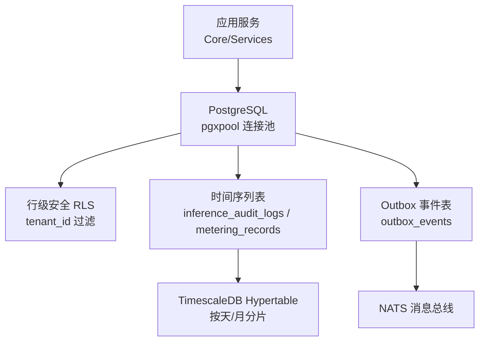
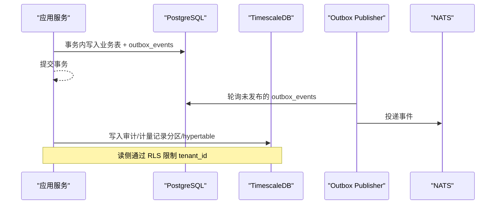
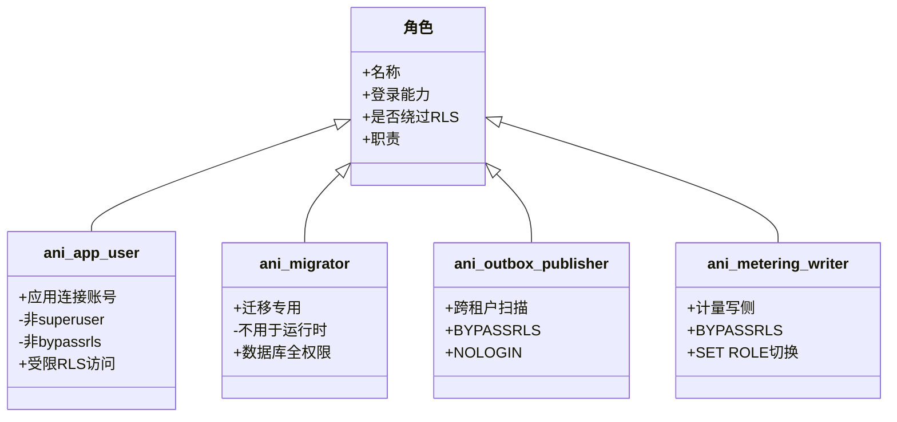
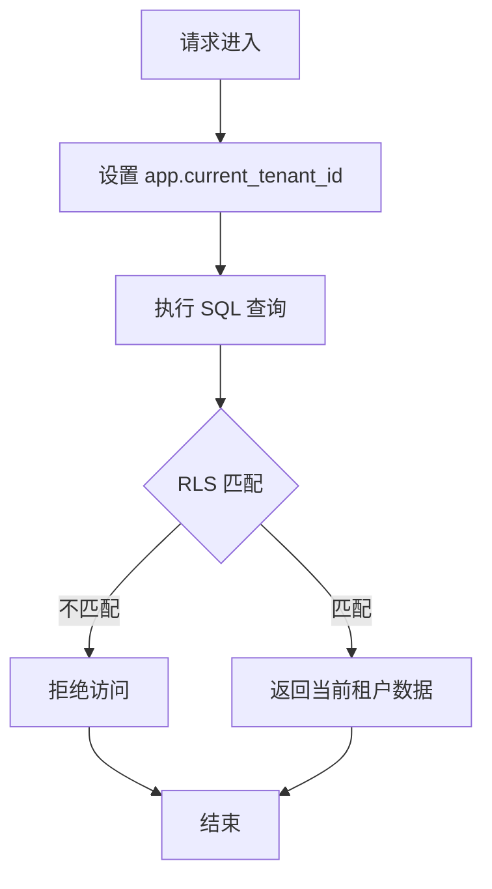
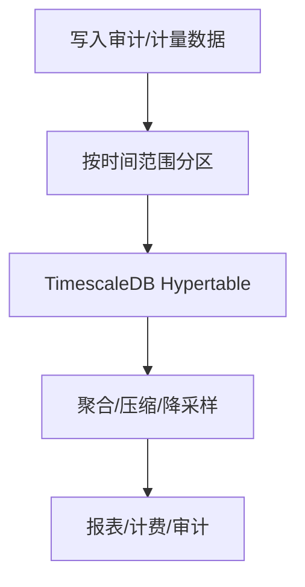
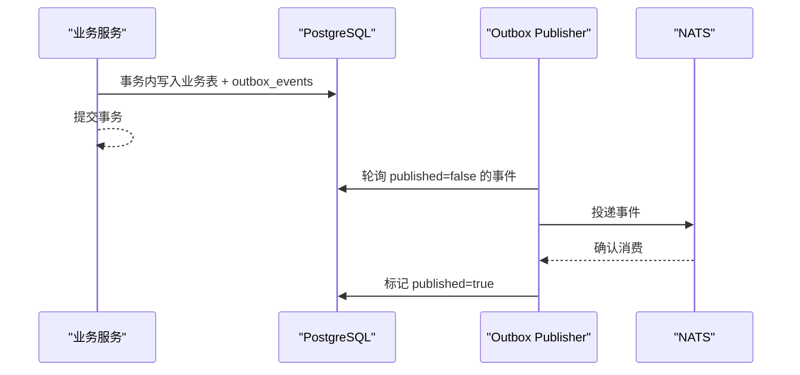
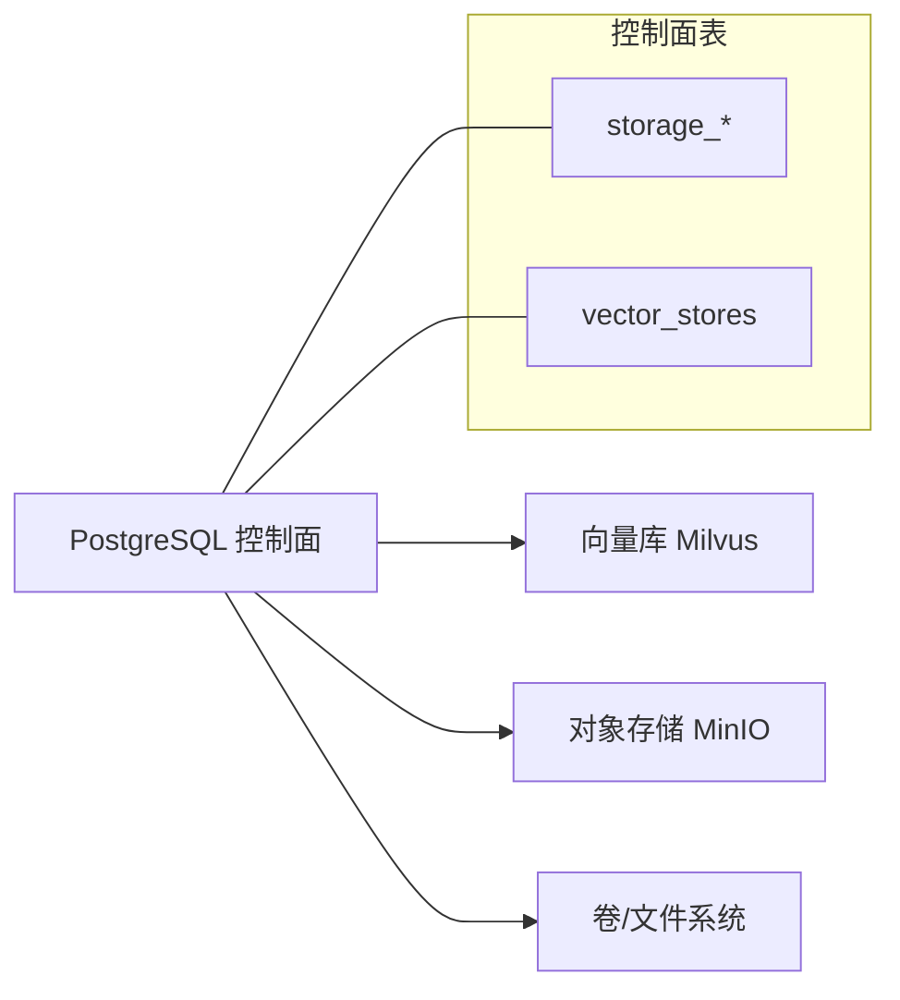
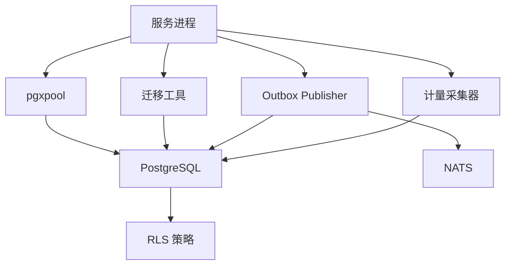

# 数据库概览

<cite>
**本文引用的文件**
- [20260501_001_init_schema.sql](file://repo/deploy/migrations/20260501_001_init_schema.sql)
- [20260502_003_permissions_schema.sql](file://repo/deploy/migrations/20260502_003_permissions_schema.sql)
- [20260707_014_platform_users.sql](file://repo/deploy/migrations/20260707_014_platform_users.sql)
- [20260802_001_async_tasks.sql](file://repo/deploy/migrations/20260802_001_async_tasks.sql)
- [20260731_001_metering_usage.sql](file://repo/deploy/migrations/20260731_001_metering_usage.sql)
- [20260803_001_storage_control_plane_state.sql](file://repo/deploy/migrations/20260803_001_storage_control_plane_state.sql)
- [postgresql.yaml](file://repo/deploy/helm/ani-platform/component-contracts/postgresql.yaml)
- [db.go](file://repo/pkg/bootstrap/db.go)
- [ANI-02-产品功能设计.md](file://ANI-02-产品功能设计.md)
</cite>

## 目录
1. [简介](#简介)
2. [项目结构](#项目结构)
3. [核心组件](#核心组件)
4. [架构总览](#架构总览)
5. [详细组件分析](#详细组件分析)
6. [依赖关系分析](#依赖关系分析)
7. [性能考虑](#性能考虑)
8. [故障排查指南](#故障排查指南)
9. [结论](#结论)
10. [附录](#附录)

## 简介
本文件面向 ANI 平台的数据库侧，系统性说明 PostgreSQL/TimescaleDB 技术选型、多租户隔离策略、数据分区与索引优化、以及角色权限模型（ani_app_user、ani_migrator、ani_outbox_publisher）。同时概述核心数据域：租户管理、用户认证、AI 模型管理、推理服务、知识库、异步任务、计量与存储控制面等的数据组织方式。文档以迁移脚本和 Helm 契约为权威来源，确保描述与实际落地一致。

## 项目结构
数据库相关资产主要分布在以下位置：
- 迁移脚本：deploy/migrations 下的 SQL 文件，定义初始 schema、权限、扩展表与 RLS 策略。
- Helm 契约：deploy/helm/ani-platform/component-contracts/postgresql.yaml，声明应用角色、迁移路径与约束。
- 连接与池化：pkg/bootstrap/db.go，封装 pgxpool 连接、健康检查与版本探测。
- 产品与安全边界：ANI-02-产品功能设计.md，明确“所有数据表使用 PostgreSQL RLS，fail-closed 原则”。

图表来源
- [postgresql.yaml:9-22](file://repo/deploy/helm/ani-platform/component-contracts/postgresql.yaml#L9-L22)
- [20260501_001_init_schema.sql:12-27](file://repo/deploy/migrations/20260501_001_init_schema.sql#L12-L27)
- [20260501_001_init_schema.sql:254-280](file://repo/deploy/migrations/20260501_001_init_schema.sql#L254-L280)
- [20260501_001_init_schema.sql:440-454](file://repo/deploy/migrations/20260501_001_init_schema.sql#L440-L454)
- [20260501_001_init_schema.sql:391-406](file://repo/deploy/migrations/20260501_001_init_schema.sql#L391-L406)

章节来源
- [postgresql.yaml:1-33](file://repo/deploy/helm/ani-platform/component-contracts/postgresql.yaml#L1-L33)
- [20260501_001_init_schema.sql:1-658](file://repo/deploy/migrations/20260501_001_init_schema.sql#L1-L658)
- [db.go:14-64](file://repo/pkg/bootstrap/db.go#L14-L64)
- [ANI-02-产品功能设计.md:231-241](file://ANI-02-产品功能设计.md#L231-L241)

## 核心组件
- 数据库角色与权限
  - ani_app_user：应用连接账号，受 RLS 强制约束，无 superuser/bypassrls。
  - ani_migrator：仅用于迁移的账号，不供业务服务使用。
  - ani_outbox_publisher：BYPASSRLS 专用角色，跨租户扫描 outbox_events 发布到 NATS。
  - ani_metering_writer：计量采集写侧 BYPASSRLS 角色，通过 SET ROLE 切换写入。
- 多租户隔离
  - 所有业务表启用并强制 RLS，基于 tenant_id 与 current_setting('app.current_tenant_id') 进行行级过滤。
  - 平台管理员用户支持 tenant_id IS NULL，与租户用户区分。
- 高写入量数据分区
  - inference_audit_logs 按月范围分区；metering_records 建议转换为 TimescaleDB hypertable（按天分片）；审计日志 audit_logs 同样按月分区。
- 幂等与一致性
  - async_tasks 提供 idempotency_key 唯一约束与租约机制，保障重试安全与僵尸任务回收。
  - outbox_events 保证“写 DB + 发 NATS”的最终一致性。
- 存储与向量控制面
  - 存储/对象/文件系统/向量库的控制面元数据统一在 PostgreSQL 中维护，内容仍由 MinIO/Milvus 管理。

章节来源
- [20260501_001_init_schema.sql:12-27](file://repo/deploy/migrations/20260501_001_init_schema.sql#L12-L27)
- [20260501_001_init_schema.sql:525-627](file://repo/deploy/migrations/20260501_001_init_schema.sql#L525-L627)
- [20260501_001_init_schema.sql:254-280](file://repo/deploy/migrations/20260501_001_init_schema.sql#L254-L280)
- [20260501_001_init_schema.sql:440-454](file://repo/deploy/migrations/20260501_001_init_schema.sql#L440-L454)
- [20260501_001_init_schema.sql:354-406](file://repo/deploy/migrations/20260501_001_init_schema.sql#L354-L406)
- [20260731_001_metering_usage.sql:10-50](file://repo/deploy/migrations/20260731_001_metering_usage.sql#L10-L50)
- [20260707_014_platform_users.sql:1-24](file://repo/deploy/migrations/20260707_014_platform_users.sql#L1-L24)
- [20260803_001_storage_control_plane_state.sql:1-9](file://repo/deploy/migrations/20260803_001_storage_control_plane_state.sql#L1-L9)

## 架构总览
ANI 平台采用 PostgreSQL 作为控制面主数据源，结合 TimescaleDB 对时序指标进行高效聚合与压缩。应用通过 pgxpool 连接数据库，执行带 RLS 的查询；迁移由独立账号完成；Outbox 模式将业务变更持久化后投递至 NATS；高写入审计与计量数据通过分区或 hypertable 提升吞吐与可维护性。

图表来源
- [20260501_001_init_schema.sql:391-406](file://repo/deploy/migrations/20260501_001_init_schema.sql#L391-L406)
- [20260501_001_init_schema.sql:254-280](file://repo/deploy/migrations/20260501_001_init_schema.sql#L254-L280)
- [20260501_001_init_schema.sql:440-454](file://repo/deploy/migrations/20260501_001_init_schema.sql#L440-L454)
- [postgresql.yaml:9-22](file://repo/deploy/helm/ani-platform/component-contracts/postgresql.yaml#L9-L22)

## 详细组件分析

### 角色与权限模型
- ani_app_user
  - 用途：所有微服务访问数据库的连接账号。
  - 约束：非 superuser、非 bypassrls，强制 RLS。
  - 权限：public schema 下表的 SELECT/INSERT/UPDATE/DELETE。
- ani_migrator
  - 用途：CI/CD 执行迁移脚本，不用于运行时服务。
  - 权限：数据库级别全部权限，仅限迁移流程。
- ani_outbox_publisher
  - 用途：跨租户扫描 outbox_events 并发布到 NATS。
  - 约束：BYPASSRLS NOLOGIN，需配合网络策略限制访问来源。
- ani_metering_writer
  - 用途：计量采集写侧 BYPASSRLS 角色，通过 SET ROLE 切换身份写入。
  - 权限：metering_usage_records 的 CRUD。

图表来源
- [20260501_001_init_schema.sql:12-27](file://repo/deploy/migrations/20260501_001_init_schema.sql#L12-L27)
- [20260731_001_metering_usage.sql:10-50](file://repo/deploy/migrations/20260731_001_metering_usage.sql#L10-L50)
- [postgresql.yaml:9-22](file://repo/deploy/helm/ani-platform/component-contracts/postgresql.yaml#L9-L22)

章节来源
- [20260501_001_init_schema.sql:12-27](file://repo/deploy/migrations/20260501_001_init_schema.sql#L12-L27)
- [20260731_001_metering_usage.sql:10-50](file://repo/deploy/migrations/20260731_001_metering_usage.sql#L10-L50)
- [postgresql.yaml:9-22](file://repo/deploy/helm/ani-platform/component-contracts/postgresql.yaml#L9-L22)

### 多租户隔离与权限策略
- 所有业务表启用并强制 RLS，策略基于 tenant_id 与当前会话设置的 app.current_tenant_id。
- 平台管理员用户允许 tenant_id IS NULL，并通过 roles.tenant_id IS NULL 标识平台内置角色。
- 权限 JSONB 约束规范了资源、动作与作用域，防止越权配置。

图表来源
- [20260501_001_init_schema.sql:525-627](file://repo/deploy/migrations/20260501_001_init_schema.sql#L525-L627)
- [20260707_014_platform_users.sql:1-24](file://repo/deploy/migrations/20260707_014_platform_users.sql#L1-L24)
- [20260502_003_permissions_schema.sql:6-18](file://repo/deploy/migrations/20260502_003_permissions_schema.sql#L6-L18)

章节来源
- [20260501_001_init_schema.sql:525-627](file://repo/deploy/migrations/20260501_001_init_schema.sql#L525-L627)
- [20260707_014_platform_users.sql:1-24](file://repo/deploy/migrations/20260707_014_platform_users.sql#L1-L24)
- [20260502_003_permissions_schema.sql:6-18](file://repo/deploy/migrations/20260502_003_permissions_schema.sql#L6-L18)

### 数据分区与时序优化
- 推理审计日志 inference_audit_logs：按月范围分区，便于归档与清理。
- 计量记录 metering_records：建议转换为 TimescaleDB hypertable，按天分片，提高聚合与压缩效率。
- 审计日志 audit_logs：按月范围分区，支持按租户与时间的高效查询。

图表来源
- [20260501_001_init_schema.sql:254-280](file://repo/deploy/migrations/20260501_001_init_schema.sql#L254-L280)
- [20260501_001_init_schema.sql:440-454](file://repo/deploy/migrations/20260501_001_init_schema.sql#L440-L454)
- [20260501_001_init_schema.sql:499-522](file://repo/deploy/migrations/20260501_001_init_schema.sql#L499-L522)

章节来源
- [20260501_001_init_schema.sql:254-280](file://repo/deploy/migrations/20260501_001_init_schema.sql#L254-L280)
- [20260501_001_init_schema.sql:440-454](file://repo/deploy/migrations/20260501_001_init_schema.sql#L440-L454)
- [20260501_001_init_schema.sql:499-522](file://repo/deploy/migrations/20260501_001_init_schema.sql#L499-L522)

### 异步任务与 Outbox 模式
- 异步任务 async_tasks：包含幂等键、租约、心跳、死信队列字段，支持重试与补偿。
- Outbox 事件 outbox_events：在同一事务中写入业务数据与事件，publisher 轮询发布到 NATS，保证最终一致性与可靠性。

图表来源
- [20260501_001_init_schema.sql:354-406](file://repo/deploy/migrations/20260501_001_init_schema.sql#L354-L406)
- [20260802_001_async_tasks.sql:1-14](file://repo/deploy/migrations/20260802_001_async_tasks.sql#L1-L14)

章节来源
- [20260501_001_init_schema.sql:354-406](file://repo/deploy/migrations/20260501_001_init_schema.sql#L354-L406)
- [20260802_001_async_tasks.sql:1-14](file://repo/deploy/migrations/20260802_001_async_tasks.sql#L1-L14)

### 存储与向量控制面
- 控制面元数据：storage_volumes、storage_filesystems、storage_objects、vector_stores 等在 PostgreSQL 中维护状态、提供者引用与幂等键。
- 内容存储：MinIO（对象）、Milvus（向量）负责实际数据体，控制面只存元数据与索引信息。
- RLS 覆盖：新增存储/向量相关表均启用并强制 RLS，确保租户隔离。

图表来源
- [20260803_001_storage_control_plane_state.sql:1-9](file://repo/deploy/migrations/20260803_001_storage_control_plane_state.sql#L1-L9)
- [20260803_001_storage_control_plane_state.sql:467-583](file://repo/deploy/migrations/20260803_001_storage_control_plane_state.sql#L467-L583)

章节来源
- [20260803_001_storage_control_plane_state.sql:1-9](file://repo/deploy/migrations/20260803_001_storage_control_plane_state.sql#L1-L9)
- [20260803_001_storage_control_plane_state.sql:467-583](file://repo/deploy/migrations/20260803_001_storage_control_plane_state.sql#L467-L583)

### 连接与池化配置
- 连接池：MaxConns=20，MinConns=2，生命周期与空闲时间合理配置，健康检查周期 30s。
- 启动探测：连接成功后读取 server_version，失败则重试直至超时。
- 抽象接口：ConnectMetadataStore 返回 MetadataStore 与关闭函数，便于服务注入。

章节来源
- [db.go:14-64](file://repo/pkg/bootstrap/db.go#L14-L64)

## 依赖关系分析
- 应用服务依赖 PostgreSQL 提供的 RLS 与事务能力，通过 pgxpool 管理连接。
- 迁移流程依赖 ani_migrator 账号，Helm 契约限定迁移路径与首条迁移。
- Outbox 发布者依赖 BYPASSRLS 角色与 NATS 消息总线，实现跨租户事件分发。
- 计量采集依赖 ani_metering_writer 角色，绕过 RLS 写入聚合数据。

图表来源
- [postgresql.yaml:9-22](file://repo/deploy/helm/ani-platform/component-contracts/postgresql.yaml#L9-L22)
- [20260501_001_init_schema.sql:12-27](file://repo/deploy/migrations/20260501_001_init_schema.sql#L12-L27)
- [20260501_001_init_schema.sql:391-406](file://repo/deploy/migrations/20260501_001_init_schema.sql#L391-L406)
- [20260731_001_metering_usage.sql:10-50](file://repo/deploy/migrations/20260731_001_metering_usage.sql#L10-L50)

章节来源
- [postgresql.yaml:9-22](file://repo/deploy/helm/ani-platform/component-contracts/postgresql.yaml#L9-L22)
- [20260501_001_init_schema.sql:12-27](file://repo/deploy/migrations/20260501_001_init_schema.sql#L12-L27)
- [20260501_001_init_schema.sql:391-406](file://repo/deploy/migrations/20260501_001_init_schema.sql#L391-L406)
- [20260731_001_metering_usage.sql:10-50](file://repo/deploy/migrations/20260731_001_metering_usage.sql#L10-L50)

## 性能考虑
- 连接池调优：根据并发与延迟目标调整 MaxConns/MinConns 与生命周期，避免连接抖动。
- 分区与索引：
  - 审计与计量数据按月/天分区，减少扫描范围。
  - 针对高频查询列建立复合索引（如 tenant_id + created_at）。
- 时序优化：将 metering_records 与 inference_audit_logs 转为 TimescaleDB hypertable，利用自动分片、压缩与降采样。
- 幂等与去重：async_tasks 的 idempotency_key 与唯一索引避免重复执行与重复写入。
- Outbox 轮询：对 outbox_events 的 published=false 条件索引提升发布效率。

[本节为通用性能指导，无需特定文件来源]

## 故障排查指南
- 连接失败或版本探测失败
  - 现象：启动时无法获取 server_version 或连接超时。
  - 排查：检查 DATABASE_URL、网络连通、pgxpool 配置与重试逻辑。
- RLS 导致数据不可见
  - 现象：查询结果为空或报错。
  - 排查：确认会话已设置 app.current_tenant_id，且策略生效；核对租户 ID 与数据行。
- Outbox 事件未发布
  - 现象：NATS 未收到预期事件。
  - 排查：检查 outbox_events.published 标志与索引；确认 publisher 角色与权限；验证 NATS 可达。
- 异步任务卡住或重复执行
  - 现象：任务长时间 running 或重复处理。
  - 排查：检查 lease_until、last_heartbeat_at 与 status；确认 reconciler 是否正确回收僵尸任务。
- 计量写入异常
  - 现象：计量数据缺失或重复。
  - 排查：确认使用 ani_metering_writer 角色写入；检查唯一约束 (tenant_id, resource_ref, resource_type, period)。

章节来源
- [db.go:14-64](file://repo/pkg/bootstrap/db.go#L14-L64)
- [20260501_001_init_schema.sql:525-627](file://repo/deploy/migrations/20260501_001_init_schema.sql#L525-L627)
- [20260501_001_init_schema.sql:391-406](file://repo/deploy/migrations/20260501_001_init_schema.sql#L391-L406)
- [20260802_001_async_tasks.sql:1-14](file://repo/deploy/migrations/20260802_001_async_tasks.sql#L1-L14)
- [20260731_001_metering_usage.sql:10-50](file://repo/deploy/migrations/20260731_001_metering_usage.sql#L10-L50)

## 结论
ANI 平台以 PostgreSQL 为核心控制面，结合 TimescaleDB 对时序数据进行高效管理。通过严格的角色权限模型与 RLS 强制隔离，确保多租户数据安全。异步任务与 Outbox 模式提升了系统的可靠性与可扩展性。存储与向量控制面的元数据集中管理，既保证了一致性，又解耦了内容存储。整体设计兼顾安全性、性能与可维护性，为后续扩展提供了坚实基础。

[本节为总结性内容，无需特定文件来源]

## 附录
- 技术选型要点
  - PostgreSQL：强一致、RLS、分区表、JSONB 灵活扩展。
  - TimescaleDB：时序数据的高吞吐写入与高效聚合。
  - Outbox + NATS：最终一致性的可靠事件驱动架构。
- 关键表与用途
  - tenants/users/roles/api_keys/refresh_tokens：租户与认证基础。
  - models/model_versions/model_import_tasks：AI 模型管理与导入。
  - inference_services/inference_audit_logs：推理服务与调用审计。
  - knowledge_bases/kb_documents/kb_sessions/kb_messages：知识库与问答。
  - async_tasks/outbox_events：异步任务与事件发布。
  - metering_records/metering_usage_records：计量与用量统计。
  - storage_* / vector_stores：存储与向量控制面元数据。

章节来源
- [20260501_001_init_schema.sql:29-658](file://repo/deploy/migrations/20260501_001_init_schema.sql#L29-L658)
- [20260731_001_metering_usage.sql:18-50](file://repo/deploy/migrations/20260731_001_metering_usage.sql#L18-L50)
- [20260803_001_storage_control_plane_state.sql:12-583](file://repo/deploy/migrations/20260803_001_storage_control_plane_state.sql#L12-L583)