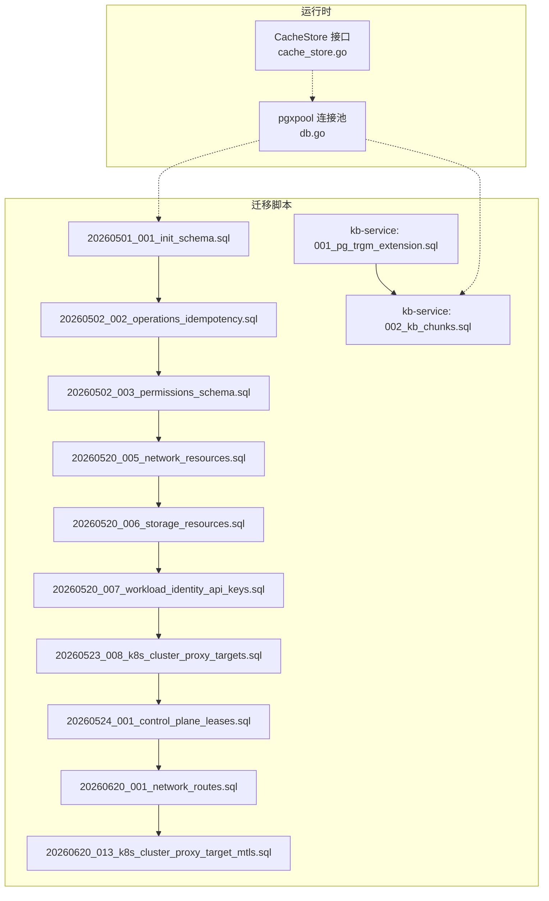
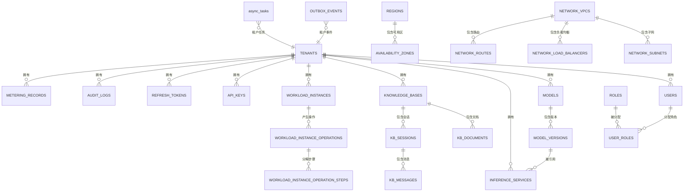
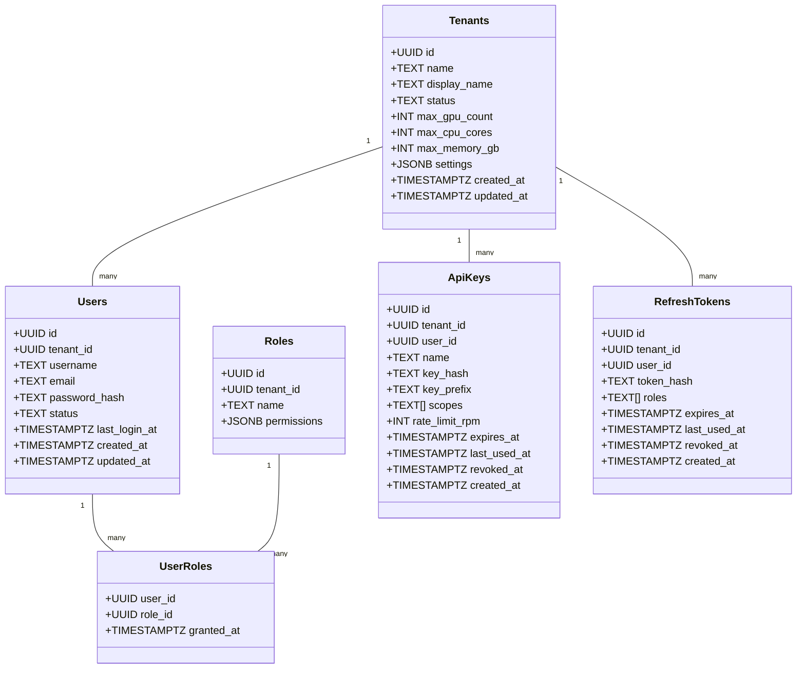
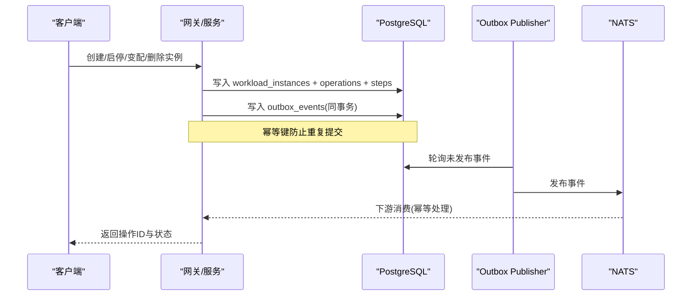
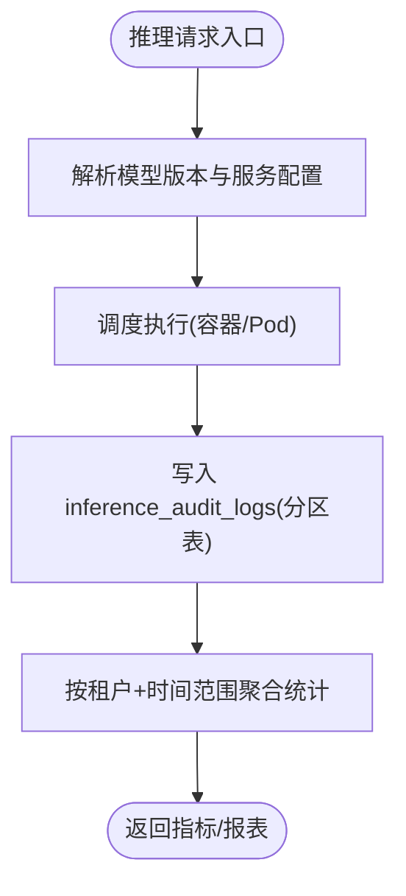
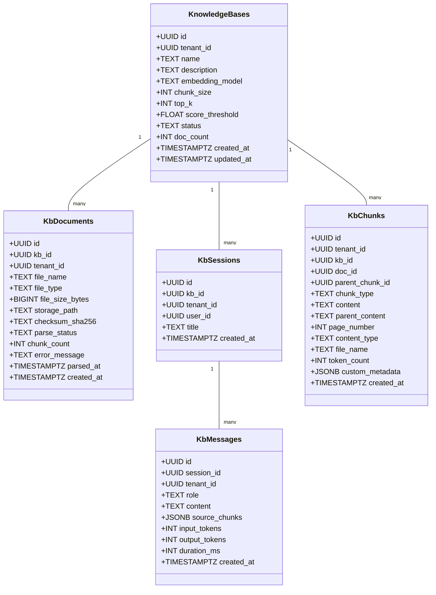
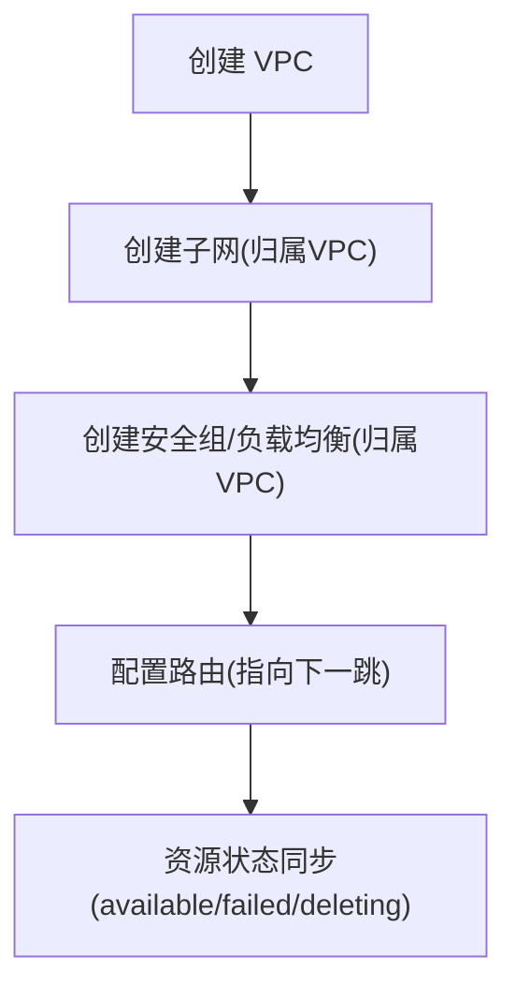
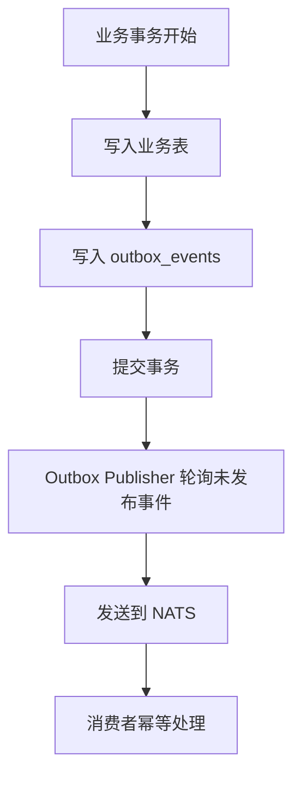

# 数据库设计

<cite>
**本文引用的文件**
- [20260501_001_init_schema.sql](file://repo/deploy/migrations/20260501_001_init_schema.sql)
- [20260502_002_operations_idempotency.sql](file://repo/deploy/migrations/20260502_002_operations_idempotency.sql)
- [20260502_003_permissions_schema.sql](file://repo/deploy/migrations/20260502_003_permissions_schema.sql)
- [20260520_005_network_resources.sql](file://repo/deploy/migrations/20260520_005_network_resources.sql)
- [20260520_006_storage_resources.sql](file://repo/deploy/migrations/20260520_006_storage_resources.sql)
- [20260520_007_workload_identity_api_keys.sql](file://repo/deploy/migrations/20260520_007_workload_identity_api_keys.sql)
- [20260523_008_k8s_cluster_proxy_targets.sql](file://repo/deploy/migrations/20260523_008_k8s_cluster_proxy_targets.sql)
- [20260524_001_control_plane_leases.sql](file://repo/deploy/migrations/20260524_001_control_plane_leases.sql)
- [20260620_001_network_routes.sql](file://repo/deploy/migrations/20260620_001_network_routes.sql)
- [20260620_013_k8s_cluster_proxy_target_mtls.sql](file://repo/deploy/migrations/20260620_013_k8s_cluster_proxy_target_mtls.sql)
- [db.go](file://repo/pkg/bootstrap/db.go)
- [cache_store.go](file://repo/pkg/ports/cache_store.go)
- [001_pg_trgm_extension.sql](file://repo/services/kb-service/migrations/001_pg_trgm_extension.sql)
- [002_kb_chunks.sql](file://repo/services/kb-service/migrations/002_kb_chunks.sql)
</cite>

## 目录
1. [引言](#引言)
2. [项目结构](#项目结构)
3. [核心组件](#核心组件)
4. [架构总览](#架构总览)
5. [详细组件分析](#详细组件分析)
6. [依赖关系分析](#依赖关系分析)
7. [性能与优化](#性能与优化)
8. [故障排查指南](#故障排查指南)
9. [结论](#结论)
10. [附录](#附录)

## 引言
本文件面向 ANI 平台的 PostgreSQL/TimescaleDB 数据库设计，覆盖表结构、实体关系、字段定义、主外键约束、索引策略、查询优化、分区与高时序数据管理、迁移版本管理与执行流程、数据访问模式、缓存策略、性能优化方案以及备份恢复、监控告警、容量规划等运维要点。文档以迁移脚本为权威来源，结合服务启动时的连接配置与缓存接口抽象，形成从“存储模型”到“运行时访问”的完整闭环说明。

## 项目结构
- 数据库迁移集中存放于 deploy/migrations，按时间戳+序号命名，保证可追溯与顺序执行。
- 知识库子服务的迁移位于 services/kb-service/migrations，使用扩展与表级 RLS 保持一致性。
- 应用通过 pkg/bootstrap/db.go 建立 pgxpool 连接池并校验数据库版本；通过 ports.CacheStore 抽象 Redis 等共享缓存能力。

图表来源
- [20260501_001_init_schema.sql:1-658](file://repo/deploy/migrations/20260501_001_init_schema.sql#L1-L658)
- [20260502_002_operations_idempotency.sql:1-135](file://repo/deploy/migrations/20260502_002_operations_idempotency.sql#L1-L135)
- [20260502_003_permissions_schema.sql:1-77](file://repo/deploy/migrations/20260502_003_permissions_schema.sql#L1-L77)
- [20260520_005_network_resources.sql:1-113](file://repo/deploy/migrations/20260520_005_network_resources.sql#L1-L113)
- [20260520_006_storage_resources.sql:1-86](file://repo/deploy/migrations/20260520_006_storage_resources.sql#L1-L86)
- [20260520_007_workload_identity_api_keys.sql:1-22](file://repo/deploy/migrations/20260520_007_workload_identity_api_keys.sql#L1-L22)
- [20260523_008_k8s_cluster_proxy_targets.sql:1-37](file://repo/deploy/migrations/20260523_008_k8s_cluster_proxy_targets.sql#L1-L37)
- [20260524_001_control_plane_leases.sql:1-10](file://repo/deploy/migrations/20260524_001_control_plane_leases.sql#L1-L10)
- [20260620_001_network_routes.sql:1-29](file://repo/deploy/migrations/20260620_001_network_routes.sql#L1-L29)
- [20260620_013_k8s_cluster_proxy_target_mtls.sql:1-20](file://repo/deploy/migrations/20260620_013_k8s_cluster_proxy_target_mtls.sql#L1-L20)
- [db.go:14-65](file://repo/pkg/bootstrap/db.go#L14-L65)
- [cache_store.go:1-15](file://repo/pkg/ports/cache_store.go#L1-L15)
- [001_pg_trgm_extension.sql:1-7](file://repo/services/kb-service/migrations/001_pg_trgm_extension.sql#L1-L7)
- [002_kb_chunks.sql:1-53](file://repo/services/kb-service/migrations/002_kb_chunks.sql#L1-L53)

章节来源
- [20260501_001_init_schema.sql:1-658](file://repo/deploy/migrations/20260501_001_init_schema.sql#L1-L658)
- [db.go:14-65](file://repo/pkg/bootstrap/db.go#L14-L65)
- [cache_store.go:1-15](file://repo/pkg/ports/cache_store.go#L1-L15)

## 核心组件
- 租户与身份：tenants、users、roles、user_roles、api_keys、refresh_tokens、jwt_blocklist。
- 资源编排：workload_instances、instance_plan_audits、workload_instance_operations、workload_instance_operation_steps。
- 推理与审计：models、model_versions、inference_services、inference_audit_logs（按月分区）。
- 知识库：knowledge_bases、kb_documents、kb_sessions、kb_messages、kb_chunks（KB 子服务）。
- 异步与事件：async_tasks、outbox_events。
- 基础设施：regions、availability_zones、metering_records（建议 TimescaleDB hypertable）、audit_logs（按月分区）。
- 网络与存储：network_vpcs/subnets/security_groups/load_balancers/routes、storage_volumes/filesystems/objects。
- 控制面与代理：k8s_cluster_proxy_targets、control_plane_leases。

章节来源
- [20260501_001_init_schema.sql:29-658](file://repo/deploy/migrations/20260501_001_init_schema.sql#L29-L658)
- [20260502_002_operations_idempotency.sql:8-87](file://repo/deploy/migrations/20260502_002_operations_idempotency.sql#L8-L87)
- [20260520_005_network_resources.sql:7-75](file://repo/deploy/migrations/20260520_005_network_resources.sql#L7-L75)
- [20260520_006_storage_resources.sql:7-56](file://repo/deploy/migrations/20260520_006_storage_resources.sql#L7-L56)
- [20260620_001_network_routes.sql:3-21](file://repo/deploy/migrations/20260620_001_network_routes.sql#L3-L21)
- [20260523_008_k8s_cluster_proxy_targets.sql:7-18](file://repo/deploy/migrations/20260523_008_k8s_cluster_proxy_targets.sql#L7-L18)
- [20260524_001_control_plane_leases.sql:1-10](file://repo/deploy/migrations/20260524_001_control_plane_leases.sql#L1-L10)
- [002_kb_chunks.sql:14-39](file://repo/services/kb-service/migrations/002_kb_chunks.sql#L14-L39)

## 架构总览
ANI 平台采用“PostgreSQL 主库 + 可选 TimescaleDB 扩展”的混合时序与事务型存储模型。核心特点：
- 多租户隔离：所有业务表均启用行级安全（RLS），通过会话变量 app.current_tenant_id 或 ani.tenant_id 进行强制隔离。
- 幂等与可观测：实例操作链路与步骤记录、Outbox 事件、审计日志保障可追踪与可重放。
- 高写入吞吐：推理调用审计日志、计量记录采用分区表，并建议转换为 TimescaleDB hypertable 以获得自动分片与压缩。
- 外部资源映射：网络、存储、K8s 集群代理目标等外部资源状态持久化，支撑跨域编排与一致性。

图表来源
- [20260501_001_init_schema.sql:29-658](file://repo/deploy/migrations/20260501_001_init_schema.sql#L29-L658)
- [20260502_002_operations_idempotency.sql:30-87](file://repo/deploy/migrations/20260502_002_operations_idempotency.sql#L30-L87)
- [20260520_005_network_resources.sql:7-75](file://repo/deploy/migrations/20260520_005_network_resources.sql#L7-L75)
- [20260520_006_storage_resources.sql:7-56](file://repo/deploy/migrations/20260520_006_storage_resources.sql#L7-L56)
- [20260620_001_network_routes.sql:3-21](file://repo/deploy/migrations/20260620_001_network_routes.sql#L3-L21)

## 详细组件分析

### 租户、身份与权限
- tenants：租户元数据与配额（GPU/CPU/内存）上限，status 枚举限制。
- users：用户与邮箱唯一性约束，关联租户。
- roles/user_roles：RBAC 模型，permissions 使用 JSONB 并通过迁移 003 的 CHECK 约束确保 schema 正确。
- api_keys/refresh_tokens/jwt_blocklist：API Key 与令牌生命周期管理，支持过期、撤销与黑名单。

图表来源
- [20260501_001_init_schema.sql:29-120](file://repo/deploy/migrations/20260501_001_init_schema.sql#L29-L120)
- [20260502_003_permissions_schema.sql:20-77](file://repo/deploy/migrations/20260502_003_permissions_schema.sql#L20-L77)

章节来源
- [20260501_001_init_schema.sql:29-120](file://repo/deploy/migrations/20260501_001_init_schema.sql#L29-L120)
- [20260502_003_permissions_schema.sql:20-77](file://repo/deploy/migrations/20260502_003_permissions_schema.sql#L20-L77)

### 工作负载与实例生命周期
- workload_instances：统一承载 VM/Container/GPU Container/Inference/Notebook/Sandbox/Batch Job 的状态与资源引用。
- instance_plan_audits：计划阶段审计，记录渲染清单、准入结果与警告。
- workload_instance_operations/workload_instance_operation_steps：操作级与步骤级追踪，支持幂等键与失败重试标记。

图表来源
- [20260501_001_init_schema.sql:210-252](file://repo/deploy/migrations/20260501_001_init_schema.sql#L210-L252)
- [20260502_002_operations_idempotency.sql:30-87](file://repo/deploy/migrations/20260502_002_operations_idempotency.sql#L30-L87)
- [20260501_001_init_schema.sql:354-406](file://repo/deploy/migrations/20260501_001_init_schema.sql#L354-L406)

章节来源
- [20260501_001_init_schema.sql:210-252](file://repo/deploy/migrations/20260501_001_init_schema.sql#L210-L252)
- [20260502_002_operations_idempotency.sql:30-87](file://repo/deploy/migrations/20260502_002_operations_idempotency.sql#L30-L87)
- [20260501_001_init_schema.sql:354-406](file://repo/deploy/migrations/20260501_001_init_schema.sql#L354-L406)

### 推理服务与审计日志
- models/model_versions：模型元数据与版本信息，支持加密算法与存储路径。
- inference_services：推理服务部署态，含副本、GPU 类型、并发度、状态与 K8s 关联。
- inference_audit_logs：高写入量审计日志，按月分区，建议转换为 TimescaleDB hypertable 以提升时序查询性能。

图表来源
- [20260501_001_init_schema.sql:126-208](file://repo/deploy/migrations/20260501_001_init_schema.sql#L126-L208)
- [20260501_001_init_schema.sql:254-281](file://repo/deploy/migrations/20260501_001_init_schema.sql#L254-L281)
- [20260501_001_init_schema.sql:648-650](file://repo/deploy/migrations/20260501_001_init_schema.sql#L648-L650)

章节来源
- [20260501_001_init_schema.sql:126-208](file://repo/deploy/migrations/20260501_001_init_schema.sql#L126-L208)
- [20260501_001_init_schema.sql:254-281](file://repo/deploy/migrations/20260501_001_init_schema.sql#L254-L281)
- [20260501_001_init_schema.sql:648-650](file://repo/deploy/migrations/20260501_001_init_schema.sql#L648-L650)

### 知识库与分块检索
- knowledge_bases/kb_documents/kb_sessions/kb_messages：知识库、文档、会话与消息，RLS 强制租户隔离。
- kb_chunks（KB 子服务）：父/子/文档摘要层级结构，支持 trigram 全文检索。

图表来源
- [20260501_001_init_schema.sql:286-348](file://repo/deploy/migrations/20260501_001_init_schema.sql#L286-L348)
- [002_kb_chunks.sql:14-39](file://repo/services/kb-service/migrations/002_kb_chunks.sql#L14-L39)

章节来源
- [20260501_001_init_schema.sql:286-348](file://repo/deploy/migrations/20260501_001_init_schema.sql#L286-L348)
- [001_pg_trgm_extension.sql:1-7](file://repo/services/kb-service/migrations/001_pg_trgm_extension.sql#L1-L7)
- [002_kb_chunks.sql:14-39](file://repo/services/kb-service/migrations/002_kb_chunks.sql#L14-L39)

### 网络与存储资源
- network_vpcs/subnets/security_groups/load_balancers/routes：VPC、子网、安全组、负载均衡与路由，均带状态机与租户隔离。
- storage_volumes/filesystems/objects：卷、文件系统与对象存储元数据，支持状态与容量约束。

图表来源
- [20260520_005_network_resources.sql:7-75](file://repo/deploy/migrations/20260520_005_network_resources.sql#L7-L75)
- [20260620_001_network_routes.sql:3-21](file://repo/deploy/migrations/20260620_001_network_routes.sql#L3-L21)
- [20260520_006_storage_resources.sql:7-56](file://repo/deploy/migrations/20260520_006_storage_resources.sql#L7-L56)

章节来源
- [20260520_005_network_resources.sql:7-75](file://repo/deploy/migrations/20260520_005_network_resources.sql#L7-L75)
- [20260520_006_storage_resources.sql:7-56](file://repo/deploy/migrations/20260520_006_storage_resources.sql#L7-L56)
- [20260620_001_network_routes.sql:3-21](file://repo/deploy/migrations/20260620_001_network_routes.sql#L3-L21)

### 异步任务与事件总线
- async_tasks：通用任务表，支持幂等键、租约、心跳、死信队列与补偿动作。
- outbox_events：与业务写在同一事务中，由专用角色 publisher 轮询并发布至消息总线，实现最终一致性与可靠性。

图表来源
- [20260501_001_init_schema.sql:354-406](file://repo/deploy/migrations/20260501_001_init_schema.sql#L354-L406)

章节来源
- [20260501_001_init_schema.sql:354-406](file://repo/deploy/migrations/20260501_001_init_schema.sql#L354-L406)

### 控制面与集群代理
- k8s_cluster_proxy_targets：租户级 K8s/vCluster 代理目标，支持 mTLS 证书字段。
- control_plane_leases：控制面分布式锁/租约，用于协调多实例运行。

章节来源
- [20260523_008_k8s_cluster_proxy_targets.sql:7-37](file://repo/deploy/migrations/20260523_008_k8s_cluster_proxy_targets.sql#L7-L37)
- [20260620_013_k8s_cluster_proxy_target_mtls.sql:7-20](file://repo/deploy/migrations/20260620_013_k8s_cluster_proxy_target_mtls.sql#L7-L20)
- [20260524_001_control_plane_leases.sql:1-10](file://repo/deploy/migrations/20260524_001_control_plane_leases.sql#L1-L10)

## 依赖关系分析
- 迁移依赖顺序：按文件名前缀递增，init_schema 为基础，后续逐步添加网络、存储、代理、路由等能力。
- 运行时依赖：服务启动时通过 db.go 建立 pgxpool，校验数据库版本；缓存通过 cache_store.go 抽象，供网关限流、会话等场景使用。

图表来源
- [20260501_001_init_schema.sql:1-658](file://repo/deploy/migrations/20260501_001_init_schema.sql#L1-L658)
- [20260502_002_operations_idempotency.sql:1-135](file://repo/deploy/migrations/20260502_002_operations_idempotency.sql#L1-L135)
- [20260502_003_permissions_schema.sql:1-77](file://repo/deploy/migrations/20260502_003_permissions_schema.sql#L1-L77)
- [20260520_005_network_resources.sql:1-113](file://repo/deploy/migrations/20260520_005_network_resources.sql#L1-L113)
- [20260520_006_storage_resources.sql:1-86](file://repo/deploy/migrations/20260520_006_storage_resources.sql#L1-L86)
- [20260520_007_workload_identity_api_keys.sql:1-22](file://repo/deploy/migrations/20260520_007_workload_identity_api_keys.sql#L1-L22)
- [20260523_008_k8s_cluster_proxy_targets.sql:1-37](file://repo/deploy/migrations/20260523_008_k8s_cluster_proxy_targets.sql#L1-L37)
- [20260524_001_control_plane_leases.sql:1-10](file://repo/deploy/migrations/20260524_001_control_plane_leases.sql#L1-L10)
- [20260620_001_network_routes.sql:1-29](file://repo/deploy/migrations/20260620_001_network_routes.sql#L1-L29)
- [20260620_013_k8s_cluster_proxy_target_mtls.sql:1-20](file://repo/deploy/migrations/20260620_013_k8s_cluster_proxy_target_mtls.sql#L1-L20)

章节来源
- [db.go:14-65](file://repo/pkg/bootstrap/db.go#L14-L65)
- [cache_store.go:1-15](file://repo/pkg/ports/cache_store.go#L1-L15)

## 性能与优化
- 分区与 TimescaleDB
  - inference_audit_logs、audit_logs 已按月分区，建议在启用 TimescaleDB 后转换为 hypertable，设置合适的 chunk_time_interval（如 1 天/1 月），开启压缩与降采样。
  - metering_records 建议同样转换为 hypertable，按 recorded_at 分片，提升计量聚合查询性能。
- 索引策略
  - 高频过滤列建 B-tree：tenant_id、state、updated_at、created_at 组合索引。
  - 文本检索：kb_chunks.content 使用 GIN trigram 索引，需先启用 pg_trgm 扩展。
  - 条件索引：对 running/active 状态的任务与操作使用 WHERE 条件索引减少扫描。
- 连接池与超时
  - 使用 pgxpool 配置 MaxConns/MinConns/Lifetime/IdleTime/HealthCheckPeriod，避免连接泄漏与雪崩。
- 查询优化
  - 优先使用分区裁剪（按 created_at/recorded_at）。
  - 避免 SELECT *，仅选择必要列；对大 JSONB 字段谨慎使用。
  - 分页使用 cursor/limit，避免深翻页。
- 缓存策略
  - 通过 CacheStore 抽象实现共享缓存（如 Redis），用于网关限流窗口计数、热点元数据缓存、会话与令牌校验等。
  - 使用 SetNX 实现分布式锁，Increment 实现原子计数。

章节来源
- [20260501_001_init_schema.sql:254-281](file://repo/deploy/migrations/20260501_001_init_schema.sql#L254-L281)
- [20260501_001_init_schema.sql:499-522](file://repo/deploy/migrations/20260501_001_init_schema.sql#L499-L522)
- [20260501_001_init_schema.sql:440-454](file://repo/deploy/migrations/20260501_001_init_schema.sql#L440-L454)
- [20260501_001_init_schema.sql:648-650](file://repo/deploy/migrations/20260501_001_init_schema.sql#L648-L650)
- [001_pg_trgm_extension.sql:1-7](file://repo/services/kb-service/migrations/001_pg_trgm_extension.sql#L1-L7)
- [002_kb_chunks.sql:31-39](file://repo/services/kb-service/migrations/002_kb_chunks.sql#L31-L39)
- [db.go:14-65](file://repo/pkg/bootstrap/db.go#L14-L65)
- [cache_store.go:1-15](file://repo/pkg/ports/cache_store.go#L1-L15)

## 故障排查指南
- 连接问题
  - 检查 DATABASE_URL 是否有效；确认 pgxpool 初始化与 server_version 查询成功；关注重试间隔与超时。
- 权限与隔离
  - 确认 RLS 策略生效；应用连接账号非 superuser/bypassrls；会话变量 app.current_tenant_id/ani.tenant_id 是否正确设置。
- 迁移失败
  - 核对迁移顺序与依赖；回滚需遵循幂等设计（IF NOT EXISTS/ADD COLUMN IF NOT EXISTS）。
- 高写入压力
  - 对 inference_audit_logs、audit_logs、metering_records 启用 TimescaleDB hypertable；调整 chunk 大小与压缩策略。
- 任务卡住
  - 检查 async_tasks 的 lease_until 与 last_heartbeat_at；清理僵尸任务并重新分配。

章节来源
- [db.go:14-65](file://repo/pkg/bootstrap/db.go#L14-L65)
- [20260501_001_init_schema.sql:525-627](file://repo/deploy/migrations/20260501_001_init_schema.sql#L525-L627)
- [20260501_001_init_schema.sql:354-390](file://repo/deploy/migrations/20260501_001_init_schema.sql#L354-L390)

## 结论
本数据库设计以 PostgreSQL 为核心，辅以 TimescaleDB 扩展应对高写入时序数据；通过 RLS、幂等键、Outbox、审计日志与分区索引构建可靠的多租户平台底座。配合连接池调优与缓存抽象，满足大规模实例编排、推理服务与知识库检索的性能与稳定性要求。

## 附录

### 数据迁移版本管理与执行流程
- 版本命名：YYYYMMDD_NNN_description.sql，保证时间顺序与可读性。
- 执行工具：可使用 psql 直接执行或 Atlas 迁移工具；建议在生产环境通过 CI/CD 流水线执行并记录输出。
- 幂等性：迁移脚本普遍使用 IF NOT EXISTS/ADD COLUMN IF NOT EXISTS，允许重复执行。
- 依赖关系：每个迁移头部注释标明依赖的前序迁移，确保顺序执行。

章节来源
- [20260501_001_init_schema.sql:1-6](file://repo/deploy/migrations/20260501_001_init_schema.sql#L1-L6)
- [20260502_002_operations_idempotency.sql:1-5](file://repo/deploy/migrations/20260502_002_operations_idempotency.sql#L1-L5)
- [20260502_003_permissions_schema.sql:1-5](file://repo/deploy/migrations/20260502_003_permissions_schema.sql#L1-L5)

### 数据访问模式与缓存策略
- 数据访问
  - 通过 pgxpool 获取连接；在事务内完成业务写入与 outbox 写入，保证原子性。
  - 所有查询携带租户上下文，利用 RLS 强制隔离。
- 缓存策略
  - 使用 CacheStore 接口实现共享缓存；典型用法包括：
    - 网关限流：基于 tenant_id + route_class 的窗口计数。
    - 热点元数据：模型/服务/租户配置短 TTL 缓存。
    - 分布式锁：SetNX 实现互斥。
    - 计数器：Increment 实现原子计数。

章节来源
- [db.go:14-65](file://repo/pkg/bootstrap/db.go#L14-L65)
- [cache_store.go:1-15](file://repo/pkg/ports/cache_store.go#L1-L15)

### 备份恢复、监控告警与容量规划
- 备份恢复
  - 使用 pg_dump/pg_restore 或云厂商托管备份；对分区表可按分区粒度归档。
  - 对敏感字段（如密钥哈希、令牌哈希）注意脱敏与最小化保留。
- 监控告警
  - 监控数据库连接数、慢查询、锁等待、分区增长速率。
  - 对 outbox 未发布积压、async_tasks 死信队列、lease 过期任务设置告警。
- 容量规划
  - 根据推理调用与计量写入峰值估算磁盘与 IOPS；合理设置 TimescaleDB chunk 大小与压缩策略。
  - 定期评估索引命中率与冗余索引，清理无用索引。

[本节为通用运维指导，不直接分析具体文件]