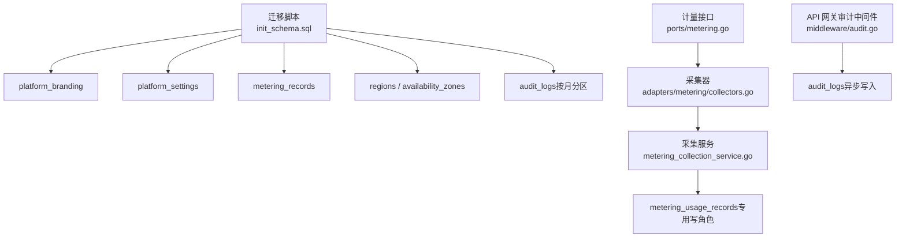
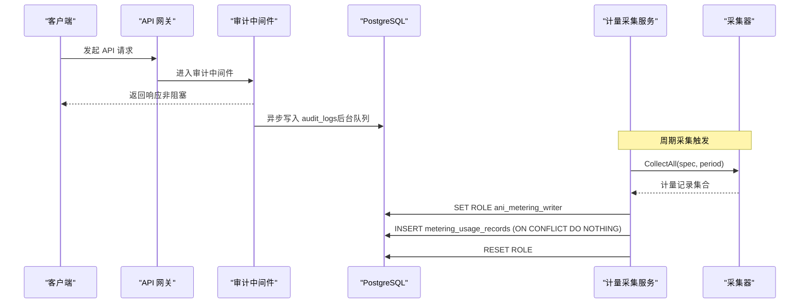
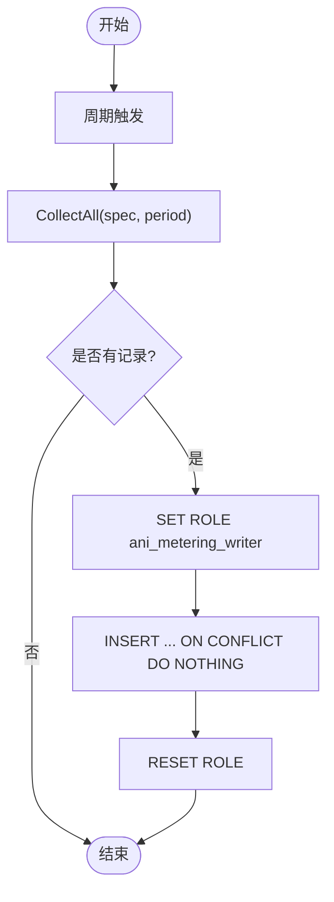
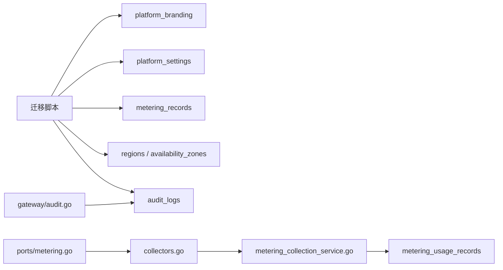

# 平台设置与计量表

<cite>
**本文引用的文件**
- [20260501_001_init_schema.sql](file://repo/deploy/migrations/20260501_001_init_schema.sql)
- [20260731_001_metering_usage.sql](file://repo/deploy/migrations/20260731_001_metering_usage.sql)
- [metering.go](file://repo/pkg/ports/metering.go)
- [collectors.go](file://repo/pkg/adapters/metering/collectors.go)
- [metering_collection_service.go](file://repo/services/metering-service/internal/service/metering_collection_service.go)
- [audit.go](file://repo/services/ani-gateway/internal/middleware/audit.go)
</cite>

## 目录
1. [简介](#简介)
2. [项目结构](#项目结构)
3. [核心组件](#核心组件)
4. [架构总览](#架构总览)
5. [详细组件分析](#详细组件分析)
6. [依赖关系分析](#依赖关系分析)
7. [性能考虑](#性能考虑)
8. [故障排查指南](#故障排查指南)
9. [结论](#结论)
10. [附录](#附录)

## 简介
本文件聚焦平台“设置”和“计量”相关的数据表设计与实现，覆盖以下主题：
- platform_branding（品牌设置）：支持白标化配置的 Logo、颜色、域名等。
- platform_settings（平台设置）：KV 存储模式，用于动态配置管理。
- metering_records（计量记录）：多资源类型计量（GPU 小时/秒、CPU 小时/秒、内存 GB·小时/秒、存储 GB·天、Token 数量等）。
- regions（区域）与 availability_zones（可用区）：多地域部署支撑。
- 审计日志表的分区设计与合规性要求。
- TimescaleDB hypertable 的转换方案，优化时序数据查询性能。

## 项目结构
与本文相关的数据库迁移与代码位于如下位置：
- 数据库迁移脚本：deploy/migrations
- 计量领域接口与采集器：pkg/ports、pkg/adapters/metering
- 计量采集服务：services/metering-service
- API 网关审计中间件：services/ani-gateway/internal/middleware

图表来源
- [20260501_001_init_schema.sql:412-523](file://repo/deploy/migrations/20260501_001_init_schema.sql#L412-L523)
- [20260731_001_metering_usage.sql:21-50](file://repo/deploy/migrations/20260731_001_metering_usage.sql#L21-L50)
- [metering.go:8-112](file://repo/pkg/ports/metering.go#L8-L112)
- [collectors.go:19-43](file://repo/pkg/adapters/metering/collectors.go#L19-L43)
- [metering_collection_service.go:195-237](file://repo/services/metering-service/internal/service/metering_collection_service.go#L195-L237)
- [audit.go:10-55](file://repo/services/ani-gateway/internal/middleware/audit.go#L10-L55)

章节来源
- [20260501_001_init_schema.sql:412-523](file://repo/deploy/migrations/20260501_001_init_schema.sql#L412-L523)
- [20260731_001_metering_usage.sql:21-50](file://repo/deploy/migrations/20260731_001_metering_usage.sql#L21-L50)
- [metering.go:8-112](file://repo/pkg/ports/metering.go#L8-L112)
- [collectors.go:19-43](file://repo/pkg/adapters/metering/collectors.go#L19-L43)
- [metering_collection_service.go:195-237](file://repo/services/metering-service/internal/service/metering_collection_service.go#L195-L237)
- [audit.go:10-55](file://repo/services/ani-gateway/internal/middleware/audit.go#L10-L55)

## 核心组件
- 品牌设置表 platform_branding：单行约束，承载平台级白标化样式与标识。
- 平台设置表 platform_settings：键值对 JSONB 存储，便于运行时动态调整系统行为。
- 计量记录表 metering_records：通用计量宽表，按租户、资源类型、时间维度聚合。
- 新增计量使用记录表 metering_usage_records：面向周期采集的高吞吐写入，具备唯一约束与 BYPASSRLS 写角色。
- 区域与可用区表 regions / availability_zones：描述多地域与多可用区拓扑。
- 审计日志表 audit_logs：按月分区，配合 RLS 与异步写入，满足合规审计需求。

章节来源
- [20260501_001_init_schema.sql:460-523](file://repo/deploy/migrations/20260501_001_init_schema.sql#L460-L523)
- [20260731_001_metering_usage.sql:21-50](file://repo/deploy/migrations/20260731_001_metering_usage.sql#L21-L50)

## 架构总览
下图展示从 API 请求到审计落库、以及计量采集到持久化的整体流程。

图表来源
- [audit.go:10-55](file://repo/services/ani-gateway/internal/middleware/audit.go#L10-L55)
- [metering_collection_service.go:195-237](file://repo/services/metering-service/internal/service/metering_collection_service.go#L195-L237)
- [collectors.go:19-43](file://repo/pkg/adapters/metering/collectors.go#L19-L43)

## 详细组件分析

### 品牌设置表 platform_branding
- 设计要点
  - 单行表：通过唯一索引保证仅一条记录，便于全局读取。
  - 字段覆盖 Logo（明/暗）、Favicon、主色/次色、登录背景、ICP 备案号等。
  - 默认值提供开箱即用主题，便于快速上线与白标化替换。
- 典型用途
  - 控制台前端根据该表渲染品牌元素。
  - 运维可通过迁移或管理接口更新品牌信息。
- 注意事项
  - 图片 URL 建议指向对象存储并采用预签名链接，避免直链泄露。
  - 颜色字段需遵循可访问性与对比度规范。

章节来源
- [20260501_001_init_schema.sql:460-475](file://repo/deploy/migrations/20260501_001_init_schema.sql#L460-L475)

### 平台设置表 platform_settings（KV 存储）
- 设计要点
  - 以 key 为主键，value 为 JSONB，description 用于说明配置项含义。
  - 适合存放开关、阈值、默认值等运行时可调参数。
- 典型用法
  - 计量采集间隔、推理默认 Token 上限、知识库召回策略等。
- 扩展建议
  - 结合版本控制与灰度发布，对关键配置变更进行审批与回滚。
  - 敏感配置建议使用加密存储或外部密钥管理服务。

章节来源
- [20260501_001_init_schema.sql:491-497](file://repo/deploy/migrations/20260501_001_init_schema.sql#L491-L497)

### 计量记录表 metering_records（通用计量宽表）
- 设计要点
  - 包含 tenant_id、az_name、resource_type、resource_id、quantity、unit、recorded_at。
  - resource_type 支持多种资源：gpu_hours/cpu_hours/memory_gb_hours/storage_gb_days/input_tokens/output_tokens/kb_queries 等。
  - 复合索引优化按租户与时间的查询。
- 适用场景
  - 历史计量归档、跨维度聚合统计、账单导出。
- 注意
  - 高写入量场景建议转换为 TimescaleDB hypertable（见后文）。

章节来源
- [20260501_001_init_schema.sql:436-455](file://repo/deploy/migrations/20260501_001_init_schema.sql#L436-L455)

### 新增计量使用记录表 metering_usage_records（周期采集专用）
- 设计要点
  - 字段：tenant_id、resource_ref、resource_type、period、quantity、unit、recorded_at。
  - 唯一约束：(tenant_id, resource_ref, resource_type, period)，确保同一周期不重复。
  - 写侧角色：ani_metering_writer（BYPASSRLS），允许跨租户批量写入；读侧仍受 RLS 隔离。
- 采集流程
  - 采集服务按周期触发，调用采集器产出记录，批量写入并使用 ON CONFLICT DO NOTHING 幂等兜底。
  - 停止时若从未产出记录，会补采一次全生命周期用量。
- 优势
  - 解耦采集与查询，提升写入吞吐与稳定性。
  - 通过唯一约束与幂等写入保障数据一致性。

图表来源
- [metering_collection_service.go:195-237](file://repo/services/metering-service/internal/service/metering_collection_service.go#L195-L237)
- [20260731_001_metering_usage.sql:21-50](file://repo/deploy/migrations/20260731_001_metering_usage.sql#L21-L50)

章节来源
- [20260731_001_metering_usage.sql:21-50](file://repo/deploy/migrations/20260731_001_metering_usage.sql#L21-L50)
- [metering_collection_service.go:195-237](file://repo/services/metering-service/internal/service/metering_collection_service.go#L195-L237)

### 区域与可用区表：regions 与 availability_zones
- 设计要点
  - regions：定义平台区域（如 cn-east），含显示名与状态。
  - availability_zones：绑定 region，维护 AZ 名称、显示名、Karmada 集群名、状态及 GPU 容量/占用 JSON 字段。
- 作用
  - 支撑多地域部署、调度与容量规划。
  - 为实例放置、服务部署提供地理维度元数据。
- 索引
  - 在 availability_zones 上建立 region_id 索引，加速按区域查询。

章节来源
- [20260501_001_init_schema.sql:412-434](file://repo/deploy/migrations/20260501_001_init_schema.sql#L412-L434)

### 审计日志表 audit_logs（分区与合规）
- 设计要点
  - 按月范围分区，便于冷热数据管理与清理。
  - 字段涵盖租户、用户、请求 ID、动作、资源、结果、详情、IP、User-Agent、时间戳。
  - 启用 RLS，限制租户可见性；平台管理员可 bypass。
- 写入方式
  - API 网关审计中间件异步收集，后台 worker 批量写入，避免阻塞请求路径。
- 合规性
  - 保留操作轨迹与结果，支持审计追溯与合规检查。
  - 建议结合日志保留策略与脱敏策略。

章节来源
- [20260501_001_init_schema.sql:499-523](file://repo/deploy/migrations/20260501_001_init_schema.sql#L499-L523)
- [audit.go:10-55](file://repo/services/ani-gateway/internal/middleware/audit.go#L10-L55)

### 计量接口与采集器
- 接口定义
  - ports.MeteringResourceType 枚举了 CPU、内存、GPU、Token 等计量维度。
  - MeteringUsageRecord 表示一条用量记录，包含租户、资源引用、类型、总量、单位、周期。
- 采集器
  - DCGMGPUCollector：基于持有 GPU 数量与运行时长计算 gpu_seconds。
  - 其他维度（CPU、内存）由对应采集器从监控源拉取指标并换算。
- 采集服务
  - 管理 per-instance ticker，周期调用 CollectAll，持久化至 metering_usage_records。
  - 停止时若未采集过，则补采全生命周期用量。

章节来源
- [metering.go:8-112](file://repo/pkg/ports/metering.go#L8-L112)
- [collectors.go:19-43](file://repo/pkg/adapters/metering/collectors.go#L19-L43)
- [metering_collection_service.go:51-157](file://repo/services/metering-service/internal/service/metering_collection_service.go#L51-L157)

## 依赖关系分析
- 迁移脚本提供基础表结构与 RLS 策略。
- 计量采集服务依赖端口接口与采集器实现，最终写入专用计量表。
- 审计中间件与审计日志表形成异步审计链路。
- 区域与可用区表为调度与部署提供元数据支撑。

图表来源
- [20260501_001_init_schema.sql:412-523](file://repo/deploy/migrations/20260501_001_init_schema.sql#L412-L523)
- [20260731_001_metering_usage.sql:21-50](file://repo/deploy/migrations/20260731_001_metering_usage.sql#L21-L50)
- [metering.go:8-112](file://repo/pkg/ports/metering.go#L8-L112)
- [collectors.go:19-43](file://repo/pkg/adapters/metering/collectors.go#L19-L43)
- [metering_collection_service.go:195-237](file://repo/services/metering-service/internal/service/metering_collection_service.go#L195-L237)
- [audit.go:10-55](file://repo/services/ani-gateway/internal/middleware/audit.go#L10-L55)

## 性能考虑
- 分区与分片
  - audit_logs 与 inference_audit_logs 按月分区，利于清理与查询裁剪。
  - 建议在启用 TimescaleDB 后将 metering_records 与 inference_audit_logs 转为 hypertable，按日/月分块，显著提升时序查询性能。
- 索引策略
  - metering_records 与 metering_usage_records 均按 tenant_id + recorded_at 建立索引，优化租户维度的时间序列查询。
  - metering_usage_records 增加唯一约束，避免重复写入。
- 写入优化
  - 计量采集使用批量写入与 ON CONFLICT DO NOTHING，降低冲突成本。
  - 审计写入走异步通道，避免阻塞请求路径。
- 角色与权限
  - 采集写侧使用 BYPASSRLS 角色，绕过 RLS 以提升跨租户写入效率；读侧仍受 RLS 保护。

章节来源
- [20260501_001_init_schema.sql:436-455](file://repo/deploy/migrations/20260501_001_init_schema.sql#L436-L455)
- [20260731_001_metering_usage.sql:21-50](file://repo/deploy/migrations/20260731_001_metering_usage.sql#L21-L50)
- [metering_collection_service.go:195-237](file://repo/services/metering-service/internal/service/metering_collection_service.go#L195-L237)
- [audit.go:10-55](file://repo/services/ani-gateway/internal/middleware/audit.go#L10-L55)

## 故障排查指南
- 计量写入失败
  - 检查 ani_metering_writer 角色是否存在且已授予成员权限。
  - 确认连接池是否执行了 SET ROLE 与 RESET ROLE。
  - 查看唯一约束冲突是否被正确处理（ON CONFLICT DO NOTHING）。
- 审计日志缺失
  - 确认审计中间件已启动后台 worker。
  - 检查通道缓冲是否溢出导致丢弃（非阻塞写入）。
  - 验证 audit_logs 分区是否存在且可写。
- 品牌与平台设置未生效
  - 核对 platform_branding 单行记录是否存在。
  - 检查 platform_settings 中 key 是否正确，value 是否为有效 JSON。
- 区域与可用区异常
  - 校验 availability_zones.region_id 外键关联。
  - 检查 karmada_cluster 唯一性约束。

章节来源
- [metering_collection_service.go:195-237](file://repo/services/metering-service/internal/service/metering_collection_service.go#L195-L237)
- [audit.go:10-55](file://repo/services/ani-gateway/internal/middleware/audit.go#L10-L55)
- [20260501_001_init_schema.sql:412-523](file://repo/deploy/migrations/20260501_001_init_schema.sql#L412-L523)

## 结论
- platform_branding 与 platform_settings 提供了平台白标化与动态配置能力，便于多租户与多品牌运营。
- metering_records 与 metering_usage_records 分别承担历史归档与周期采集职责，结合唯一约束与 BYPASSRLS 写角色，兼顾一致性与性能。
- regions 与 availability_zones 为多地域部署提供基础元数据。
- audit_logs 按月分区与异步写入，满足合规审计与高性能要求。
- 建议将高频时序表迁移至 TimescaleDB hypertable，进一步优化查询与归档性能。

## 附录

### TimescaleDB hypertable 转换方案
- 目标表
  - metering_records：按 recorded_at 创建 hypertable，chunk_time_interval 可按日或周。
  - inference_audit_logs：按 created_at 创建 hypertable，chunk_time_interval 按月。
- 收益
  - 自动分块与压缩，减少存储空间。
  - 时间范围查询更快，支持降采样与连续聚合。
- 实施步骤
  - 启用 TimescaleDB 扩展。
  - 对目标表执行 create_hypertable。
  - 调整查询与归档策略，确保兼容现有索引与 RLS。

章节来源
- [20260501_001_init_schema.sql:648-651](file://repo/deploy/migrations/20260501_001_init_schema.sql#L648-L651)